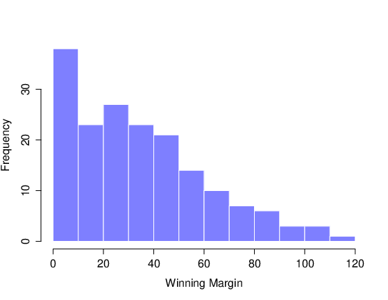
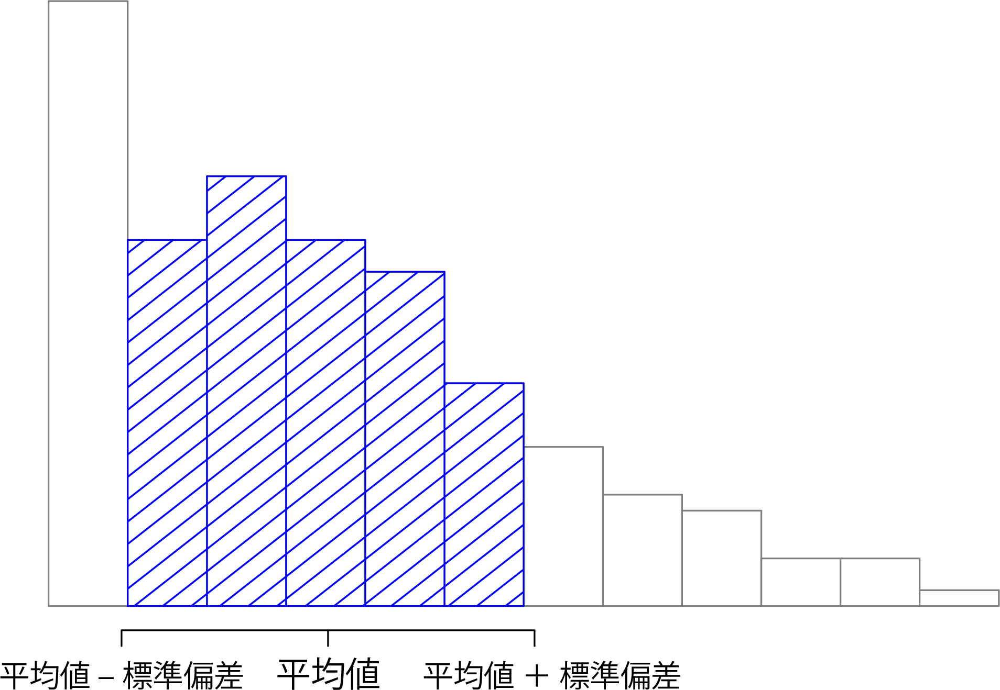
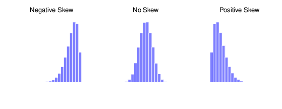
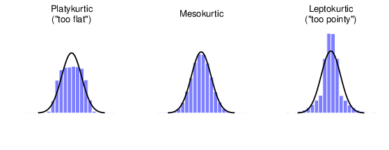

# (PART) データ処理 {-} 

記述統計 {#ch:descriptives}
=============================================

新しいデータセットを取得したら最初に行うべきことの1つに，理解しやすい形でデータを簡潔に要約するということがあります。その役目を担っているのが<span class="keyterm">記述統計</span>です（これとは対照的なものとして推測統計があります）。実際のところ，多くの人は「統計」という用語を記述統計と同じ意味で使用しています。本章で扱うトピックがまさにそれなのですが，詳細の説明に入る前に，なぜ記述統計が必要なのかについて理解しておきましょう。そのために，[<span class="filename">aflsmall_margins.csv</span>](data/aflsmall_margins.csv)ファイルを開いてファイルにどんな変数が格納されているのかを見てみます（ファイル名を右クリックしてファイルをダウンロードしてください）。


```{r aflsmallmargins, warning=FALSE, echo=FALSE, out.width='82.4%', fig.align='center', fig.cap='[<span class="filename">aflsmall_margins.csv</span>](data/aflsmall_margins.csv)に格納されている変数を<span class="jamovi">jamovi</span>で表示したところ', echo=FALSE}
knitr::include_graphics("img/descriptives/aflsmall_margins.png")
```

このファイルには1つしか変数が入っていません。あるのは<span class="rtext">afl.margins</span>という変数だけです。本章ではこの変数を中心的に使いながら話を進めていきますので，この変数がどういう値なのかを少しお話ししておきます。本書で使用するデータセットは大半が仮想データですが，これはオーストラリア・フットボールリーグ（AFL）の実際のデータです^[オーストラリアにお住まいでない方々へ。AFLはオーストラリアのフットボールリーグです。本章の内容を理解する上で，このリーグについてまったく知らなくても問題ありません。]。この<span class="rtext">afl.margins</span>変数には，2010年のシーズンに行われた全176試合（ホームとアウェーの両方）の得点差が入力されています。

この結果だけでは，このデータが実際に何を意味するのかはわかりません。単に「データを見る」だけでは，効率的にデータを理解することはできないのです。そのデータに実際にどんな意味があるのかを理解するためには，記述統計量（本章）を算出してわかりやすい図（第\@ref(ch:graphics)章）を作成する必要があります。図と記述統計では記述統計から始める方が簡単ですのでこちらから始めようと思いますが，まずは<span class="rtext">afl.margins</span>データのヒストグラムを示しておきます（図\@ref(fig:histogram1)）。これを見れば，これから説明しようとするデータが実際にどんな風に見えるのかが大体わかっていただけるのではないでしょうか。なお，ヒストグラムの作成方法についてはセクション\@ref(sec:hist)で説明しますので，今のところヒストグラムは見るだけで十分です。この図を見ると<span class="rtext">afl.margins</span>データがどういうものかがとてもよくわかります。

```{r histogram1, warning=FALSE, echo=FALSE, out.width='70.6%', fig.align='center', fig.cap='AFL2010得点差データ（<span class="rtext">afl.margins</span>変数）のヒストグラム。これを見ると，大きな得点差はそれほど多く生じないことがわかる。', echo=FALSE}

```


中心傾向の指標  {#sec:centraltendency}
--------------------------------------------------------

図\@ref(fig:histogram1)のようにデータを図で示すと，データの「要点」がわかりやすくなります。また多くの場合，データをいくつかの単純な「要約」統計量に凝縮するのも非常に有効です。大抵の場合，まず最初に計算することになるのは<span class="keyterm">中心傾向</span>の指標でしょう。これは，そのデータの「平均」あるいは「中央」がどこにあるのかということです。中心傾向の指標としてもっとも一般的に使用されるのは，平均値，中央値，最頻値の3つです。ここではこれらについて1つ1つ順番に見ていくことにします。また，それらがどのような場面で役立つのかも説明します。

### 平均値 {#sec:mean}

観測データセットの<span class="keyterm">平均値</span>（mean）とは，いわゆる普通の平均のことです。すべての値を合計し，値の個数でその合計を割って求めます。AFL得点差データの最初の5つの値は56，31，56，8，32ですから，これらの観測値の平均値は単純に次のようになります。

$$
\frac{56 + 31 + 56 + 8 + 32}{5} = \frac{183}{5} = 36.60
$$

平均値の定義を初めて聞いたなどという人はいないでしょう。平均値は日常でも頻繁に使用されていますので，とてもなじみがある統計値ですね。平均値という概念は誰もがすでに知っているものですので，これを利用して統計学者がこの計算を説明するときに使う数学的な表記や<span class="jamovi">jamovi</span>での計算方法について説明しておこうと思います。

まず最初の数学的表記が\(N\)です。これは，平均値の計算に使用する観測値の個数を意味します（先ほどの例の場合，\(N = 5\)となります）。次に，観測値そのものにもラベルをつける必要があります。観測値のラベルとしては，伝統的に\(X\)が用いられています。そして，何番目の観測値を扱っているのかを示すためには，このラベルに添え字をつけます。たとえば，\(X_1\)は最初の観測値を意味し，\(X_2\)は2つめの観測値を意味します。また，\(X_N\)は一番最後の観測値を意味します。また，やや抽象化された表現ですが，\(X_i\)は\(i\)番目の観測値を意味します。こうした表記方法をしっかり理解するために，<span class="rtext">afl.margins</span>の最初の5つの観測値について，それを指すのに用いられる数学的な表記と実際の数値の関係を表にしてみました。


```{r, warning=FALSE, echo=FALSE,message=FALSE}
library(knitr)
library(kableExtra)

dt<- matrix(c('1試合目の得点差', '\\(X_1\\)', '56点', 
                      '2試合目の得点差', '\\(X_2\\)', '31点', 
                      '3試合目の得点差', '\\(X_3\\)', '56点', 
                      '4試合目の得点差', '\\(X_4\\)', '8点', 
                      '5試合目の得点差', '\\(X_5\\)', '32点'
), ncol=3, byrow=T)

colnames<-c('観測内容','数学表記','観測値')
kable(dt, align = c('c','c','c')) %>%
  kable_styling(bootstrap_options = "striped", full_width = F)
```

では，平均値の式を数式で書いてみましょう。伝統的に，それが平均値であることを示すには\(\overline{X}\)という書き方をします。そして，平均値の公式は次のような形で表せます。

$$
\overline{X} = \frac{X_1 + X_2 + \ldots + X_{N-1} + X_N}{N}\
$$

この公式は正しいのですが，ものすごく長いですよね。ですから，これをすっきりさせるために<span class="keyterm">総和記号</span>（合計記号）と呼ばれる\(\scriptstyle\sum\)を使用します^[合計するという意味で\(\Sigma\)という記号を使うのにはちゃんと意味があります。これはギリシャ文字のシグマの大文字で，アルファベットのSに相当します（訳注：英語では総和（合計）は「summation」と言います）。これと同様に，複数の数値をすべて掛け合わせるという意味の記号もあります。積（掛け算）は英語では「product」と呼ばれることから，これには\(\Pi\)という記号が用いられます（これはギリシャ語のパイの大文字で，アルファベットのPに相当します）。]。最初の5つの観測値の合計を式で表すとき，\(X_1 + X_2 + X_3 + X_4 +X_5\)というように長い形で書くこともできますが，総和記号を使うとこれはこんなに短くなります。

$$
\sum_{i=1}^5 X_i
$$

これを日本語に直せば，「\(i\)の値が1から5までの場合の\(X_i\)の値をすべて合計する」という意味になります。つまり，この式は「最初の5つの観測値を合計する」という意味です。このような書き方を使って平均値の公式を示すと次の通りになります。

$$
\overline{X} = \frac{1}{N} \sum_{i=1}^N X_i
$$


正直なところ，このような数学的な書き方をしたからといって平均値の概念がより明確になるわけではありません。これは単に，「すべての値を合計したうえでその個数で割る」ということをおしゃれな形に書き直しただけだからです。それに，ここで数式を詳しく取りあげたのはそれが理由ではありません。そうではなく，本書を読む人には，平均値（\(\overline{X}\)）合計（\(\scriptstyle\sum\)），\(i\)番目の観測値（\(X_i\)），観測値の総数（\(N\)）など，本書の中で繰り返し使用するこうした表記についてしっかり理解しておいて欲しいからです。こうした記号は頻繁に使うので，この式を見たときに，それが「たくさんの値を合計して別の値で割る」という意味であるというように数式が「読める」よう，しっかり理解しておく必要があります。

### <span class="jamovi">jamovi</span>による平均値の算出

ここまでは計算方法の話でした。では，コンピューターの魔法を使ってこれを計算するにはどうすればよいのでしょうか。観測値の数が多くなると，こうした計算はコンピューターにやらせた方がずっと楽になります。それでは，<span class="jamovi">jamovi</span>でデータ全体の平均値を計算する手順を見てみましょう。まず「**Exploration**（探索）」ボタンをクリックして「**Descriptives**（記述統計）」を選択します。そして<span class="rtext">afl.margins</span>変数を選択して「右矢印」をクリックし，その変数を「**Variables**（変数）」ボックスに移動します。するとその直後に画面右側の部分に「**Descriptives**（記述統計量）」を含んだ表が表示されます。その様子を示したものが図\@ref(fig:descriptivesdefault)です。


```{r descriptivesdefault, warning=FALSE, echo=FALSE, out.width='70.6%', fig.align='center', fig.cap='AFL2010得点差データ（<span class="rtext">afl.margins</span>変数）の記述統計量', echo=FALSE}
knitr::include_graphics("img/descriptives/descriptives_default.png")
```   


図\@ref(fig:descriptivesdefault)でわかるように，<span class="rtext">afl.margins</span>変数の平均値は35.30です。この表には，その他の情報として観測値の総数（N=176），欠損値の数（0)，そしてこの変数の中央値（Median），最小値（Minimum），最大値（Maximum）が示されています。

### 中央値 {#sec:median}

中心傾向としてよく使用される指標の2つめは<span class="keyterm">中央値</span>（median）です。これは平均値よりもずっと説明が簡単です。観測データセットの中央値とは，ちょうど真ん中に来る値です。先ほどと同様に，AFL得点差データの最初の5つ（ 56，31，56，8，32）のみを扱うことにしましょう。中央値を見つけるために，これらの値を小さい方から順に並べます。

$$
8, 31, \mathbf{32}, 56, 56
$$

こうすれば，この5つの値の中央値が32であることがすぐわかります。並び替えた値の中央にこの値があるからです（先ほどの一覧では中央値がわかりやすいように太字にしてあります）。簡単ですね。ところで，もし最初の5つではなく6つの観測値を使った場合はどうなるでしょうか。このシーズンの6試合目の得点差は14点なので，この6つの値を並び替えると

$$
8, 14, \mathbf{31}, \mathbf{32}, 56, 56
$$ 

のようになって，31と32の*2つ*が真ん中に来ることになります。このような場合には，中央値にはこれら2つの値の平均値を使用します。つまり，31.5です。この手順も，数値がたくさんある場合には非常に面倒になります。当然，実際の場面で手作業でデータを並び替えて中央値を探すようなことをする人はいません。実際にはコンピュータを使ってこの作業を行います。そして，<span class="jamovi">jamovi</span>はすでに<span class="rtext">afl.margins</span>変数の中央値（Median）を30.50と算出してくれています（図\@ref(fig:descriptivesdefault)）。

### 平均値と中央値はどう違う？

平均値と中央値は計算方法が違うだけではありません。それぞれの値がデータについてどのようなことを意味しているのか，どんな場合にそれぞれの値を使用するのかということも知っておく必要があります。これを図として示したものが図\@ref(fig:meanmedian)です。平均値はデータセットの「重心（バランスの中心）」のようなものであるのに対し，中央値はデータの「真ん中の値」です。この違いが何を意味するかというと，それはどのようなデータでどのようなことをしたいかによって，どちらを使うべきかが異なってくるということなのです。大まかな目安としては次のようになります。

-   そのデータが名義尺度の場合，平均値も中央値も使うことはできません。平均値と中央値はどちらもそのデータに割り当てられた数値が意味を持つ場合に使用できるものだからです。任意に数値を割り当てられるような場合には，最頻値（セクション\@ref(sec:mode)）を使用するのが良いでしょう。

-   そのデータが順序尺度の場合には，平均値より中央値を使う方が良いでしょう。中央値はそのデータが持つ順序の情報（どちらの数値の方が大きいか）だけを使用しますので，データが厳密な数値である必要がありません。つまり，中央値はデータが順序尺度で得られたものである場合にぴったりであるということになります。一方，平均値はそれぞれの観測値に割り当てられた詳細な数値情報を使用しますので，順序尺度データには適切ではありません。

-   間隔尺度や比率尺度の場合には，平均値と中央値のどちらも使用することができます。どちらを選択すべきかというのは，何を見たいかによって異なります。平均値はデータに含まれるすべての情報を使用するという利点があります（これはデータがそれほどたくさんではない場合に役立ちます）。ただし，極端な値（外れ値）よる影響を受けやすいという特徴があります。


```{r meanmedian, warning=FALSE, echo=FALSE, message=FALSE, out.width='70.6%', fig.align='center', fig.cap='平均値と中央値の違い。平均値は基本的にデータセットの「重心」。ヒストグラムでそれぞれのデータをブロックとして表したとき，シーソーのようにバランスが取れる地点が平均値になる。これに対し，中央値は中央にあるブロックのことであり，そのブロックよりも大きな観測値と小さな観測値のブロックは数が同じになる。'}

require(magick); require(ggplot2); require(ggplotify); require(cowplot)

p1<-as.grob(image_read("img/descriptives2/mean.png"))
p2<-as.grob(image_read("img/descriptives2/median.png"))

plot_grid(p1,p2, labels=c("(a)", "(b)"),ncol=2,scale=.9,label_size=12)

```


この最後の部分について少し詳しく見てみましょう。結果として，ヒストグラムが非対称である場合（歪みのある場合，セクション\@ref(sec:skewkurt)参照）には，平均値と中央値の間に体系的な差が生じます。図\@ref(fig:meanmedian)にもそうした歪みが見られます。中央値を示した右側の図では中央値がヒストグラムの「本体」に近い部分に位置しているのに対して，平均値を示した左側の図では平均値が「裾」（極端な値のある場所）の方に引きずられているのがわかると思います。具体的な例で見てみましょうか。ボブ（年収50,000ドル），ケイト（年収60,000ドル），ジェーン（年収65,000ドル）が同じテーブルに座っているとします。このテーブルの平均年収は58,333ドルで，年収の中央値は60,000ドルです。そこにビル（年収100,000,000ドル）がやってきました。するとこのテーブルの平均年収は一気に25,043,750ドルに上昇しますが，中央値はわずかに上昇して62,500ドルになるだけです。あなたがそのテーブルにいる人の全体的な収入について知りたいのであれば，おそらく平均値を使うのが良いでしょう。そうではなく，そのテーブルの典型的な収入がいくらぐらいであるかを知りたいのであれば，中央値の方が良いということになります。

### 実際場面での例 {#sec:housingpriceexample}

平均値と中央値の違いについて注意すべき理由を理解するために，実際の場面におけるデータを例に考えてみましょう。私には「ジャーナリストには科学や統計の知識が足りない」と馬鹿にする傾向がありますが，ここでも存分にそれを発揮することにします。これは2010年9月24日に[ABCニュースのウェブサイト](www.abc.net.au/news/stories/2010/09/24/3021480.htm)で見つけた記事です。

> コモンウェルス銀行の上級幹部は過去数週間，オーストラリアの住宅価格や住宅価格対収入比が同様の国々と比べて遜色ないものであるということを示そうと全国を飛び回っている。同銀行の取引部門コムセックのチーフエコノミストであるクレイグ・ジェームス氏は「 住宅取得能力は過去5，6年間横ばい状態だ」と語っている。

住宅ローンを抱えている人，住宅ローンを組もうと考えている人，家賃を払っている人，あるいはこの数年間でオーストラリアの住宅市場がどうなっているのかをわずかでも覚えている人であれば，この内容にはとても驚いたことでしょう。では，この記事の続きを見てみましょう。

> オーストラリアコモンウェルス銀行は，グラフや数値，国際比較を通じ，住宅状況に対する悲観論の解消に努めてきた。この発表資料で銀行は，オーストラリアの住宅価格が収入に比べてかなり高額であるという主張を否定している。この資料によれば，世帯収入に対する住宅価格の比率はオーストラリア主要都市部で5.6，国全体では4.3であり，この数値は他の先進国と同程度であるという。資料によれば，この比率はニューヨークで7，オークランドでは6.7，バンクーバーでは9.3である。

これまた朗報ですね。ただし，この記事には次のような見解も述べられています。

> アナリストの多くは，銀行が使用している数字や比較は誤解を与えるものだという。コモンウェルス銀行の資料4ページ目にあるグラフや表には，国際比較のための追加データの情報源としてDemographiaの記載がある。ところが，コモンウェルス銀行と同様にオーストラリアの住宅価格対収入比をDemographiaのデータで算出してみると，その数値は5.6や4.3といったものではなく，9に近い値となる。

さて，これはまたずいぶん値が違います。ある人は9だといい，別の人は4から5だというのです。では，ここは妥協ということで，実際の値はその中間のどこかだと考えておけばよいでしょうか。そんなわけがありませんね。この状況では，正しい答えと間違った答えがあるのです。そしてDemographiaが正しい答えで，コモンウェルス銀行は間違いです。この記事には次のような指摘があります。

> コモンウェルス銀行が算出した国内における価格対収入比の数字には明らかな問題があり，そこでは収入の平均値と住宅価格の中央値との間で計算が行われている（それに対してDemographiaの数値は収入の中央値と住宅価格の中央値が用いられている）。中央値とはちょうど真ん中に位置する値のことで，極度に高い値や低い値は含まれていない。平均値にはオーストラリアの富裕層の収入も含まれるため，一般に収入や住宅価格の平均値は中央値よりも高くなる。別の言い方をすれば，コモンウェルス銀行の数字では，収入の計算の際にはラルフ・ノリス^[訳注：コモンウェルス銀行の最高経営責任者]の数百万ドルという収入が含まれているにもかかわらず，住宅価格の計算には（まず間違いなく）高額な彼の住宅の価格は含まれていない。そのため，オーストラリアの中間所得層にとっての住宅価格帯収入比が低く評価されることになる。

これ以上わかりやすい説明はないでしょう。比率の計算方法はDemographiaの方が正しいのです。銀行は間違った方法で計算しています。数字に関してかなり洗練された知識を持つ主要銀行のような組織がなぜこのような初歩的なミスをするのかというと…… いや，彼らの考えについて特別に何か知っているわけではないので確かなことはわかりません。ただ，この記事にはたまたま以下のような事実も言及されています。これが関係しているかもしれないし，していないかもしれませんが。

> オーストラリア最大の住宅ローン業者でもあるコモンウェルス銀行にとって，住宅価格の上昇はつねに最大の関心事である。中小企業向け融資と同様に，住宅ローンの担保という形で同行はオーストラリアの住宅市場に対しても実質的に大きな影響力を持っている。

……やれやれ，ですね。

### 最頻値 {#sec:mode}

サンプルの最頻値は非常に単純です。これはもっとも頻繁に出現する値のことです。これを説明するために，別のAFLデータを見てみましょう。決勝に進出した回数が一番多いのはどのチームでしょうか。[<span class="filename">aflsmall_finalists.csv</span>](data/aflsmall_finalists.csv)ファイルを開いて<span class="rtext">afl.finalists</span>変数を見てください。図\@ref(fig:aflsmallfinalists)のようになっているはずです。この変数には1987年から2010年までに行われた決勝戦200試合に出場した全400チームの名前が含まれています。

```{r aflsmallfinalists, warning=FALSE, echo=FALSE, out.width='64.7%', fig.align='center', fig.cap='[<span class="filename">aflsmall_finalists.csv</span>](data/aflsmall_finalists.csv)ファイルに格納されている変数を<span class="jamovi">jamovi</span>で表示した様子。', echo=FALSE}
knitr::include_graphics("img/descriptives/aflsmall_finalists.png")
```   


この変数に対して*できる*ことは，この400件の観測値すべてに目を通し，決勝チームのリストの中に各チームの名前が何回出てくるかを数えることです。そしてそれを<span class="keyterm">度数分布表</span>にまとめます。ただし，これはとても単純で退屈な作業です。この種の作業はまさにコンピューターの得意とするところですので，この作業を<span class="jamovi">jamovi</span>にやってもらうことにしましょう。「**Exploration**（探索）」>「**Descriptives**（記述統計）」とたどっていき，「**Frequency tables**（度数分布表）」のところにある小さなチェックボックスにチェックを入れてください。すると図\@ref(fig:aflsmallfinalistsmode)のようになるはずです。

```{r aflsmallfinalistsmode, warning=FALSE, echo=FALSE, out.width='70.6%', fig.align='center', fig.cap='<span class="rtext">afl.finalists</span>変数の度数分布表を<span class="jamovi">jamovi</span>で表示した様子。', echo=FALSE}
knitr::include_graphics("img/descriptives/aflsmall_finalists_mode.png")
```   


これで度数分布表ができました。あとはこれを見るだけです。この24年間のデータで，もっとも決勝進出回数が多いチームはGeelongでした。つまり，<span class="rtext">afl.finalists</span>データの最頻値は「<span class="rtext">Geelong</span>」ということになります。これで1987年から2010年までの期間ではGeelongの決勝進出が最多（39回）ということがわかります。また，「**Descriptives**（記述統計量）」の表では平均値（Mean），中央値（Median），最小値（Minimum），最大値（Maximum）の部分は空白になっていることにも注意してください。これは，<span class="rtext">afl.finalists</span>変数は名義尺度の文字変数であり，それらの値を計算しても無意味だからです。

最頻値について最後に1つ指摘しておきます。最頻値は名義尺度のデータを使用する際にもっともよく使われます。なぜなら，平均値や中央値はこれらの変数には役に立たないからです。ただし，順序尺度や間隔尺度，比率尺度の変数に対して最頻値を求めたいという場合もあり得ます。たとえば，最初に使用した<span class="rtext">afl.margins</span>変数で考えてみましょう。この変数は明らかに比率尺度です（なぜそうなのかがわからなければ，セクション\@ref(sec:scales)を読み直してみるといいでしょう）。だから，たいていの場合には，中心傾向の指標としては平均値または中央値が用いられます。しかし，次のような場面を想定してみましょう。友達との間で賭けをして，フットボールの試合をランダムに1つ選ぶとします。どのチームの試合かもわからない状態で，得点差を*正確に*予測しなければなりません。もし結果が予測通りなら50ドルもらえます。外れたら1ドル没収です。「おしい」結果に対する残念賞というのはありません。得点差をぴったり当てる必要があるのです。こうした賭けでは，平均値や中央値はまったく役に立ちません。賭けるべき数字は最頻値です。<span class="rtext">afl.margins</span>変数の最頻値を<span class="jamovi">jamovi</span>で計算するには，そのデータセットの画面で「**Exploration**（探索）」>「**Descriptives**（記述統計）」とたどり，表示された画面で「**Statistics**（統計量）」と書かれた部分を展開します。そこで「**Mode**（最頻値）」と書かれたチェックボックスにチェックを入れると，図\@ref(fig:aflsmallmarginsmode)のように「**Descriptives**（記述統計量）」の表に最頻値が表示されるようになります。つまり，2010年のデータが示すところでは，賭けをするなら「3点差」に賭けるべきなのです。


```{r aflsmallmarginsmode, warning=FALSE, echo=FALSE, out.width='70.6%', fig.align='center', fig.cap='<span class="rtext">afl.margins</span>変数の最頻値を<span class="jamovi">jamovi</span>で表示した様子。', echo=FALSE}
knitr::include_graphics("img/descriptives/aflsmall_margins_mode.png")
```   


ばらつきの指標 {#sec:var}
--------------------------------------

ここまでは*中心傾向*という統計量について話をしてきました。これは，そのデータの「中心的」な値，あるいは「一般的」な値のことです。しかし，要約統計量として中心傾向だけ計算すればよいというわけはではありません。その次に必要になるのがデータの<span class="keyterm">ばらつき</span>の指標です。つまり，そのデータがどのように「ばらついている」かということです。それぞれの観測値は，平均値や中央値からどの程度「離れている」のでしょうか。ここではデータが間隔尺度または比率尺度によるものであるとしましょう。そして，<span class="rtext">afl.margins</span>データを使って説明していくことにします。このデータを使ってさまざまなばらつきの指標の説明を行います。それらの指標にはそれぞれ長所と短所があります。

### 範囲 {#sec:range}

変数の<span class="keyterm">範囲</span>（レンジ）というのはとても単純で，最大値から最小値を引いた値です。AFLの得点差データでは，最大値は116で最小値は0です。この範囲という値は「ばらつき」を定量化するためのもっとも単純な方法ですが，最悪の部類に入る指標でもあります。データの頑健^[訳注：ちょっとした変化に影響を受けないこと。]な要約値を算出するために，平均値に関して注意しなければならなかった点を思い出してください。データの中に1つあるいは2つの極端な値が含まれている場合，そうした値に統計量が過度に引きずられてしまうのは避けたいところです。たとえば，

$$
-100,2,3,4,5,6,7,8,9,10
$$

のように極端な外れ値を含む変数の場合，ばらつきの指標として範囲が頑健でないことは明らかです。この変数の範囲は110ですが，外れ値を除いた場合には範囲は8になるからです。

### 四分位範囲

<span class="keyterm">四分位範囲</span>（IQR）は範囲と似ていますが，最大値と最小値の差を使う代わりに，25パーセンタイル値と75パーセンタイル値の差を使用します。<span class="keyterm">パーセンタイル</span>という言葉は初めて見るかもしれません。データセットの10パーセンタイル値といったときには，データの中でその値（\(x\)）よりも小さな値が全体の10％であるような値を指します。じつを言うと，すでに皆さんはこのような値を見たことがあるのです。それは中央値です。中央値はデータセットの50パーセンタイル値なのです。<span class="jamovi">jamovi</span>では，「**Exploration**（探索）」>「**Descriptives**（記述統計）」の「**Statistics**（統計量）」画面にある「**Quartiles**（四分位）」にチェックを入れるだけで簡単に25，50，75パーセンタイル値を指定することができます。

```{r aflsmallmarginsiqr, warning=FALSE, echo=FALSE, out.width='35.3%', fig.align='center', fig.cap='<span class="jamovi">jamovi</span>で[<span class="filename">afl.margins</span>](data/afl.margins)変数の四分位数を表示した様子。', echo=FALSE}
knitr::include_graphics("img/descriptives/aflsmall_margins_iqr.png")
```   


当然のことながら，図\@ref(fig:aflsmallmarginsiqr)の50パーセンタイル値は中央値と同じ値です。そして，\(50.50 - 12.75 = 37.75\)というように75パーセンタイル値から25パーセンタイル値を引くことで，2010年AFL得点差データの四分位範囲は37.75と求まります。範囲が何を意味しているのかはとてもわかりやすいですが，この四分位範囲が何を意味するのかはややわかりづらくなります。これについて，四分位範囲はデータの「半分」が収まる幅であると考えるとわかりやすいでしょう。つまり，データ全体の4分の1は25パーセンタイル値よりも小さな値で，別の4分の1が75パーセンタイルよりも大きな値ですから，データの残りの「半分」がこの2つの値の間にあることになります。そのため，四分位範囲はデータの半分をカバーする範囲ということになるのです。

### 平均絶対偏差 {#sec:aad}

ここまでに見てきた範囲と四分位範囲という2つの指標は，どちらもパーセンタイルを見ることでデータのばらつきを捉えようとするものでした。しかし，ばらつきを把握する方法はそれだけではありません。別のアプローチとしては，意味のある基準点（たいていは平均値か中央値）を1つ選び，そこから「典型的に」どの程度の偏差（ズレ）があるかという形でばらつきを捉えようとするものもあります。「典型的」な偏差とはどういう意味でしょうか。通常は，そうしたズレの大きさの平均値や中央値ということです。事実，これには（平均値からの）「平均絶対偏差」と（中央値からの）「中央絶対偏差」という2種類の指標があります。私が読んだ限りでは，統計学では中央絶対偏差が用いられており，そちらの方が良さそうです。ただ，正直言って心理学で中央絶対偏差が使用されているのは見たことがありません。平均絶対偏差なら心理学の論文でときどき目にすることがあります。このセクションでは，1つめの指標（平均絶対偏差）について説明します。2つめの指標（中央絶対偏差）についてはまた後で説明します。

先ほどの説明はやや抽象的に聞こえたかもしれません。ここでは平均値からの<span class="keyterm">平均絶対偏差</span>（mean absolute deviation）について少しゆっくり見ていくことにします。この指標のいいところは，その名前を見れば実際の計算方法がわかるということです。AFL得点差データで見てみましょう。ここでも最初の5試合分の観測値（56，31，56，8，32）だけを見ることにします。この指標は基準点（この場合は平均値）からの偏差（ズレ）に基づいて計算されますので，最初にすべきことは平均値（\(\overline{X}\)）の算出です。5つの観測値の平均値は\(\overline{X} = 36.6\)です。次は，それぞれの観測値（\(X_i\)）を偏差値^[訳注：受験などでよく聞かれる「偏差値」は「学力偏差値」で，ここいう偏差値とは少し違います。]に変換します。これは，観測値\(X_i\)と平均値\(\overline{X}\)の差を計算することによって求められます。つまり，偏差値は \(X_i - \overline{X}\) と定義されます。サンプルデータの最初の観測値では，この値は\(56 - 36.6 = 19.4\)となります。ほら，簡単ですね。そしてその次に，これらの偏差を絶対偏差に変換します。マイナスの値からマイナスを取るわけです。数学的には，\(-3\)という値の絶対値は\(|-3|\)で，\(|-3| = 3\)となります。ここで絶対値を使うのは，私たちに関心があるのは単にその値がどれだけ平均値に*近い*かということであって，それらが平均値より大小さいかということには関心がないからです。この手順をできるだけわかりやすくするために，5つの観測値すべてについてこの計算を行った結果を下の表に示しました。

```{r, warning=FALSE, echo=FALSE, message=FALSE}
library(knitr)
library(kableExtra)

dt<- matrix(c(
'','1','56','19.4','19.4','','2','31','-5.6','5.6','','3','56','19.4','19.4','','4','8','-28.6','28.6','','5','32','-4.6','4.6'
), ncol=5, byrow=T)

dtf<-as.data.frame(dt)
colnames(dtf)<-c('日本語<br>数式','何試合目<br>\\(i\\)','値<br>\\(X_i\\)','平均からの偏差<br>\\(X_i - \\overline{X}\\)','絶対偏差<br>\\(|X_i - \\overline{X}|\\)')

kable(dtf, align = c('c','c','c','c','c','c'), escape = FALSE) %>%
  kable_styling(bootstrap_options = "striped", full_width = F)
```

さてこれで各観測値の絶対偏差値が求まりました。後はこれらの値の平均値を求めるだけです。計算してみましょう。

$$
\frac{19.4 + 5.6 + 19.4 + 28.6 + 4.6}{5} = 15.52
$$

これでおしまいです。5つの値の平均絶対偏差は15.52と求まりました。

この例での計算はこれでおしまいですが，いくつかやり残していることがあります。まず，この計算手順をきちんと数学的な公式にしておくことがとても大事です。ただ，それをするには平均絶対偏差を数式で表記しなくてはなりません。ここで面倒なのが，「平均絶対偏差（mean absolute deviation）」も「中央絶対偏差（median absolute deviation）」も，省略するとどちらもMADになってしまうということです。MADとするとどっちのことかわからなくなってしまいますので，それが平均絶対偏差であることがわかるように少しばかり工夫が必要です。まったく。そこで，ここでは平均絶対偏差の略としてAADを使用することにしましょう。これは平均（*average*）絶対偏差の省略形です。さて，これで数式上のあいまいさは多少解消されました。先ほどの計算手順を公式として表すと次のようになります。

$$
\rm{\small AAD}(X) = \frac{1}{N} \sum_{i = 1}^N |X_i - \overline{X}|
$$


### 分散

平均絶対偏差も役に立つ指標ですが，ばらつきの指標としてベストとはいえません。純粋に数学的な点からいえば，偏差の絶対値よりも2乗値を使う方がより好まれます。そしてそれにはそれなりの理由があります。そして，偏差を2乗した場合には，<span class="keyterm">分散</span>（variance）と呼ばれる指標が得られます。分散には，ここでは触れませんが統計的に見てとても嬉しい特徴があり^[「嬉しい」という言葉をかなり特殊な意味で使っているかもしれませんが，一応，私が嬉しいと思う部分を少しだけ説明しておきます。分散というのは*相加的*なのです。それはどういうことでしょうか。ここに\(X\)と\(Y\)という2つの変数があったとします。その分散は\(\mbox{Var}(X)\)と\(\mbox{Var}(Y)\)です。そして，この2つの変数を合計して新しい変数を\(Z\)を作ることにしました。つまり，\(Z = X+Y\)です。すると，変数\(Z\)の分散は\(\mbox{Var}(X) + \mbox{Var}(Y)\)に等しくなるのです。これは*とても*便利な性質です。これは本章で説明した他の指標では成り立ちません。
]，そして大きな心理学的欠陥もあります。それについてはこのすぐ後に説明します。データセット\(X\)の分散は，\(\mbox{Var}(X)\)と書かれることもありますが，\(s^2\)と書くことの方が一般的です（その理由はすぐにわかります）。観測値のまとまりに対して分散を求める場合の計算式は次の通りです。

$$
\mbox{Var}(X) = \frac{1}{N} \sum_{i=1}^N \left( X_i - \overline{X} \right)^2
$$ 

見てわかるように，この式は基本的には平均絶対偏差を求めるのに使用したものと同じです。ただし，「偏差の絶対値」ではなく「偏差の2乗値」を使用している点が異なります。このため，分散は「2乗平均偏差」と呼ばれることもあります。

基本的な考え方をおさえたところで，今度は具体的な例で見てみましょう。ここでもAFLデータのうち最初の5件を使うことにします。先ほどと同じように表にまとめれば，その結果は次のようになります。

```{r, warning=FALSE, echo=FALSE, message=FALSE}
library(knitr)
library(kableExtra)

dt<- matrix(c(
'','1','56','19.4','376.36','','2','31','-5.6','31.36','','3','56','19.4','376.36','','4','8','-28.6','817.96','','5','32','-4.6','21.16'
), ncol=5, byrow=T)

dtf<-as.data.frame(dt)
colnames(dtf)<-c('日本語<br>数式','何試合目<br>\\(i\\)','値<br>\\(X_i\\)','平均からの偏差<br>\\(X_i - \\overline{X}\\)','偏差の2乗<br>\\((X_i - \\overline{X})^2\\)')

kable(dtf, align = c('c','c','c','c','c','c'), escape = FALSE) %>%
  kable_styling(bootstrap_options = "striped", full_width = F)
```


表の一番右の列には2乗された偏差の値が入っていますので，後はこれを平均するだけです。これを手（電卓）で計算してみると，結果として324.64という分散が求まります。すごくないですか？ おそらく皆さんには大きな疑問（つまり，324.64という数値が実際に何を意味するのか）があると思うのですが，それはひとまずおいておいて，ここではまず<span class="jamovi">jamovi</span>でこの値を計算する方法について見てみましょう。なぜなら，ある奇妙なことが起こるからです。メニューボタン（左上の3本線）をクリックし「**New**（新規）」で<span class="jamovi">jamovi</span>の新規ファイルを作成してください。そして，<span class="rtext">afl.margins</span>データセットの最初の5つのデータ（<span class="rtext">56, 31, 56, 8, 32</span>）をA列に入力します。変数型を「**Continuous**（連続）」にして，「**Descriptives**（記述統計）」の下にある「**Variance**（分散）」チェックボックスにチェックを入れます。すると，手計算した値と同じ数値（<span class="rtext">324.64</span>）が表示され…… いや，ちょっと待ってください。表示されたのは（<span class="rtext">405.80</span>）でぜんぜん*違う*値です（図\@ref(fig:aflsmallmarginsvariance1)）。おかしいですね。<span class="jamovi">jamovi</span>が壊れているのでしょうか。タイプミス？ それとも私がバカなの？

```{r aflsmallmarginsvariance1, warning=FALSE, echo=FALSE, out.width='82.4%', fig.align='center', fig.cap='<span class="jamovi">jamovi</span>で<span class="rtext">afl.margins</span>データの最初の5つの観測値について分散を算出したところ。', echo=FALSE}
knitr::include_graphics("img/descriptives/aflsmall_margins_variance1.png")
```   


これについては答えは「ノー」です^[3つめについては間違いではないかもしれませんが。]。タイプミスでも<span class="jamovi">jamovi</span>が間違っているのでもありません。実際のところ，<span class="jamovi">jamovi</span>の結果がこうなる原因を説明するのは簡単です。ただし，なぜそうするのかという*理由*については説明がちょっとやっかいです。まず「原因」について見てみましょう。<span class="jamovi">jamovi</span>では，分散の計算には先ほど説明したのとは少し違う式が使われています。偏差の2乗を平均する際には合計を観測値の数（\(N\)）で割るという手順が必要ですが，<span class="jamovi">jamovi</span>では合計値が（\(N-1\)）で割られています。つまり，<span class="jamovi">jamovi</span>が使用している式は次のようになります。

$$
\frac{1}{N-1} \sum_{i=1}^N \left( X_i - \overline{X} \right)^2
$$

これが*原因*の部分です。でも，本当に知りたいのは，なぜ<span class="jamovi">jamovi</span>では合計値を割るのに\(N\)ではなく\(N-1\)が使われているのかという*理由*ですよね。だって，分散は偏差の2乗の*平均値*のはずですから。では，分散を計算する際に観測値の個数\(N\)で割るのはダメなのでしょうか。いえ，そんなことはありません。ただ，これは第\@ref(ch:estimation)章で説明しますが，「標本について説明する」ことと「標本が属する母集団について推測する」のではわずかに違いがあります。ここまでのところでは，その2つに違いはありませんでした。標本について説明する場合であろうと母集団について推論する場合であろうと，平均値はまったく同じ手順で計算されます。しかし，分散や標準偏差，その他の指標ではそうではないのです。私が最初に説明した方法（つまり，\(N\)で割って実際の平均値を求める方法）は，標本についての分散を計算する場合の手順です。ところがたいていの場合，じつは標本*そのもの*はさほど重要ではありません。その標本は，世界全体を知るための手がかりに過ぎない場合の方が多いのです。その場合，「標本統計量」ではなく「母数」の推定という考え方が必要になってきます。ただ，この話についてはまだここでは早すぎます。今のところ，<span class="jamovi">jamovi</span>はちゃんとやることをやってくれているのだと信じておくことにしましょう。この話については，第\@ref(ch:estimation)章で推測について説明する際にまた触れることにします。

さて，あともう1つだけ。これまでのところ，このセクションの内容はなんだかミステリー小説のようでした。分散の計算方法について説明し，<span class="jamovi">jamovi</span>による計算で生じる奇妙な「\(N-1\)」問題を取りあげ，なぜそうなるのかについて少しだけ説明をしましたが，肝心の部分についてまだ説明していないのです。それは，分散をどう*解釈*すればいいのかということです。記述統計量というのは記述して説明するためにあるはずなのに，これまでのところ，この分散という値はまるでちんぷんかんぷんな数値です。私が分散についてイメージしやすくなるような説明をしてこなかったのは，残念ながらそうした説明がないからなのです。これが分散の最大の欠点です。ばらつきを表すという基本的性質においては数学的にも洗練されていて優れた点があるのですが，人間同士のコミュニケーションにおいては完全に役立たずです 分散という値は，元の変数の視点からはまったく解釈できないのです。すべての数値が2乗されていますので，もはやそこには何の意味もありません。これは大きな問題です。たとえば，先ほどの表では1試合目の得点は「平均値より376.36平方点高い^[訳注：念のため，「平方」は「2乗」という意味です。平方メートル（㎡）はメートルの2乗ということです。]ということになります。これは*まったくもって*馬鹿げた説明ですね。そして324.64という分散の計算にも同じことがいえます。これまでにたくさんフットボールの試合を見てきましたが，誰かが「平方点」などと言うのを一度として聞いたことがありません。それは現実の測定単位では*ない*ですし，分散というのはそうした意味不明な単位で表されているために，人間にはまったくちんぷんかんぷんなのです。

### 標準偏差 {#sec:sd}

さて，その部分の説明は飛ばしましたが，数学的に優れた性質があるから分散を使いたいとしましょう。ですが私たちはロボットではなく生身の人間ですから，数値は測定値と同じ単位（つまり「平方点」ではなく「点」）で表されていた方がありがたいですね。さてどうしたものでしょうか。答えは簡単です。分散の平方根をとればいいのです。分散の（正の）平方根は<span class="keyterm">標準偏差</span>（standard deviation）あるいは「2乗平均偏差平方根（root mean squared deviation: RMSD）」と呼ばれます。これできれいさっぱり問題が片づきました。「324.68平方点の分散」が実際のところ何を意味しているのかということがわかる人はいませんが，「18.01点の標準偏差」であればずっとわかりやすくなります。なぜなら，元の観測値と測定単位が同じだからです。標本データの標準偏差は，伝統的には\(s\)と示されますが，「sd」や「std dev.」というような表記もときどき見かけます。標準偏差は分散の平方根に等しいので，次の公式を見て驚くことはないでしょう。

$$
s = \sqrt{ \frac{1}{N} \sum_{i=1}^N \left( X_i - \overline{X} \right)^2 }
$$

<span class="jamovi">jamovi</span>で計算する場合，「**Variance**（分散）」のチェックボックスのすぐ上にある「**Std. deviation**（標準偏差）」にチェックを入れてください。これにチェックを入れると，標準偏差として<span class="rtext">26.07</span>という値が表示されます。ただ，先ほどの分散のところでの話から，<span class="jamovi">jamovi</span>で計算される値は上の公式で計算した場合と違うのではないかと思った人もいるでしょう。分散の場合と同様に，<span class="jamovi">jamovi</span>では\(N\)で割るのではなく\(N-1\)で割った数値が算出されます。その理由については第\@ref(ch:estimation)章で再度この問題に触れたときにわかると思いますが，この新しい量については\(\hat\sigma\)（「シグマハット」と読みます）と示すことにします。その公式は次の通りです。

$$
\hat\sigma = \sqrt{ \frac{1}{N-1} \sum_{i=1}^N \left( X_i - \overline{X} \right)^2 }
$$

標準偏差の解釈は，じつは少し複雑です。標準偏差は分散から導き出される値で，分散は私たち人間にとってはほとんど意味不明な数量ですから，標準偏差の解釈もそう簡単にはいかないのです。そのため，大まかな目安を利用してこの値を理解することになります。一般に，平均値から標準偏差1つ分の範囲には，データの68％が収まることが期待されます。標準偏差2つ分の範囲ならデータ全体の95％，3つ分なら99.7％です。この目安は，たいていの場合はかなりうまくあてはまるのですが，正確なものではありません。これは，ヒストグラムが左右対称な「釣り鐘型」であるという*仮定*に基づいて求められた基準です^[厳密には，データが*正規*分布しているという仮定で，これは第\@ref(ch:probability)章における議論で非常に重要になります。また，本書ではその後も繰り返し登場します。]。図\@ref(fig:histogram1)に示したAFL得点差データのヒストグラムにはこれがあてはまらないことがわかるはずです。とはいえ，このルールは大体はあてはまるものです。実際のところ，AFL得点差データの65.3%は，平均値から標準偏差1つ分の範囲に収まっています。これを視覚的に示したのが\@ref(fig:aflsd)です。

```{r aflsd, warning=FALSE, echo=FALSE, out.width='58.8%', fig.align='center', fig.cap='AFL得点差データでの標準偏差の図示。ヒストグラム中の網掛けの部分は，平均値から標準偏差1つ分の範囲にあるデータの量を示す。この例ではデータの65.3％がこの範囲に収まっており，本文で触れた「おおよそ68％」という目安に大体あてはまっている。', echo=FALSE}

```

### 指標の選択

範囲，四分位範囲，平均絶対偏差，分散，そして標準偏差と，ばらつきの指標についてはたくさんのものを説明してきました。また，その長所と短所についても少しだけ触れました。これをまとめると次のようになります。

-   **範囲**　 データ全体が収まる幅についての情報です。外れ値による影響をとても受けやすいので，そうした外れ値に特別注目する必要があるような場合を除いてほとんど使われることはありません。

-   **四分位範囲**　 そのデータの「ちょうど半分」が収まる範囲についての情報です。かなり頑健で，中央値をうまく補完してくれます。よく用いられている値です。

-   **平均絶対偏差**　 観測値が平均値から「平均的に」どの程度離れているかという情報です。解釈はしやすいですがちょっとした問題があり（それについてはここでは触れていません），そのせいで統計学者にとっては標準偏差よりも魅力度が低いものになっています。ときどき使用されますが，多くはありません。

-   **分散**　 平均値からの偏差の2乗値の平均値です。この値は数学的に非常に美しく，おそらくは平均値からのちらばりを記述するための「正しい」方法です。ただし，データとは単位が異なってしまうため，まったく解釈ができません。使用されるのはほぼ数学的ツールとしてのみですが，かなりの数の統計ツールが「裏で」この値を使用しています。

-   **標準偏差**　 この値は分散の平方根です。数学的にも美しく，測定値と同じ単位で表されるため解釈も容易です。中心傾向として平均値を使う場合，ばらつきの指標としてはこの値がデフォルトになります。ばらつきの指標のなかでもダントツで使用頻度の高い値です。

要するに，データのばらつきを報告する際の指標としては，標準偏差と四分位偏差の2つが一般的だということです。ただし，状況によっては他の値が使われる場合もあります。本書でこれらすべてを説明したのは，そうしたケースに遭遇する可能性がそこそこあるからです。

歪度と尖度 {#sec:skewkurt}
--------------------------------------

心理学の論文で目にする可能性のあるものとしてはあと2つ，歪度と尖度という記述統計量があります。実際のところは，どちらの値もすでに説明した中心傾向やばらつきの指標に比べると目にする機会はかなり少なくなります。歪度はとても重要なので，これについて言及されているのをたびたび見ることになるでしょう。ただ，私は科学論文の中で尖度が報告されているのをこれまでに見たことがありません。

```{r skewness, warning=FALSE, echo=FALSE, out.width='82.4%', fig.align='center', fig.cap='歪度の図示。左の図は歪度が負のデータセットの場合（歪度＝(&minus;.93）。中央は歪度がないデータセット（完全にゼロではなく，歪度=&minus;.006）。右の図は歪度が正のデータセット（歪度=.93）。', echo=FALSE}

```

この2つのうちでは<span class="keyterm">歪度</span>（skewness）の方が面白いので，こちらから見ていくことにしましょう。歪度は基本的には分布の対称性の指標です。これは図にしてみるととてもよくわかります。図\@ref(fig:skewness)に示したように，データの中に極端に小さな値がたくさんある（つまり，小さい値の側の裾が「長い」）場合で，大きい方向には極端な値がそれほどない場合（図の左），そのデータは*負の歪度*を持つといいます。一方で，大きい値の側に極端な値が多数ある場合（図の右），そのデータは*正の歪度*を持つといいます。これが歪度の性質です。もし平均値よりもはるかに大きな値がたくさんあれば，データの分布は正の歪度あるいは右歪曲となり，分布は左側に長い裾を持つ形になります。負の歪度あるいは左歪曲分布の場合にはその逆です。左右対称の分布では歪度は0です。歪度の値がプラスであれば正の歪度，マイナスなら負の歪度の分布ということです。データセットの歪度は次のような式で求められます。

$$
\mbox{歪度}(X) = \frac{1}{N \hat{\sigma}^3} \sum_{i=1}^N (X_i - \overline{X})^3
$$

式の中の\(N\)は観測値の個数，\(\overline{X}\)は標本の平均，そして\(\hat{\sigma}\)は標準偏差です（これは「\(N-1\)」で割るバージョンの方です）。ありがたいことに，<span class="jamovi">jamovi</span>を使えば歪度を計算することができます。「**Exploration**（探索）」>「**Descriptives**（記述統計）」の「**Statistics**（統計量）」オプションにチェックボックスがあるのでそれをチェックしてください。<span class="rtext">afl.margins</span>変数の場合，歪度の数値は<span class="rtext">0.780</span>でした。この歪度の推定値を歪度の標準誤差（Std. error skewness）の値で割ってやると，そのデータがどの程度歪んでいるのかという指標を得ることができます。とくに観測値の個数が少ない場合（\(N<50\)），1つの目安としてその値が2以下であればそのデータはそれほど歪んでいないということになります。もしその値が2を超えるようであれば分布の歪みが大きいので，統計分析によっては制限が生じる可能性があります。ただし，この解釈に対して明確な意見の一致があるわけではありません。さて，ということはAFLの得点差データはそこそこ歪んでいるということになります（<span class="rtext">0.780 / 0.183 = 4.262</span>）。

ときどき話には上るものの実際には滅多にお目にかかることのない最後の指標がデータの<span class="keyterm">尖度</span>（kurtosis）です。簡単に言えば，尖度とはデータの「とんがり」具合のことです（図\@ref(fig:kurtosis)）。慣例では，「正規曲線」（黒線）の場合を尖度0とします。つまり，この曲線を基準にしてとんがり具合を評価するわけです。

```{r kurtosis, warning=FALSE, echo=FALSE, out.width='$4', fig.align='center', fig.cap='尖度の図。図の左は「緩尖的」，つまり「平たく潰れた」のデータセットの場合（尖度=&minus;.95）。中央は「中尖的」なデータセットでデータのとんがり具合がちょうど良い場合（尖度=0）。図の右は「急尖的」なデータセットで，データが「とんがりすぎている」場合（尖度=2.12）。尖度は正規曲線（黒線）を基準に測定されるものであることに注意。', echo=FALSE}

```

この図では，図の左はとんがり具合が足りず，尖度の値はマイナスになります。このようなデータは*<ruby>緩尖<rt>かんせん</rt></ruby>的*であると呼ばれます。図の右はとんがりすぎている場合で，尖度の値はプラスになります。このようなデータは*急尖的*であると呼ばれます。図の中央はちょうどいい具合にとんがっている状態で，このようなデータは*中尖的*であると呼ばれ，尖度は0になります。これをまとめると次のようになります。

```{r, warning=FALSE, echo=FALSE,message=FALSE}
library(knitr)
library(kableExtra)

dt<- matrix(c('平た過ぎ', '緩尖的', 'マイナス',   
'適度なとんがり', '中尖的', '0',
'とんがりすぎ', '  急尖的', 'プラス'), ncol=3, byrow=T)

colnames(dt)<-c('くだけた表現','専門的な用語','尖度の値')

kable(dt, align = c('l','c','c')) %>%
  kable_styling(bootstrap_options = "striped", full_width = F)
```

尖度の式は，すでに見てきた分散や歪度の式と考え方はよく似ています。ただし，分散で偏差の2乗値が含まれていた場所，歪度で偏差の3乗値が含まれていた場所が，尖度では4乗値になります^[この式の「\(-3\)」の部分は正規分布の倍に尖度が0になるようにするための調整です。公式の最後に「\(-3\)」をつけるだけというのは間抜けな感じがしますが，数学的な理由はちゃんとあります。]。

$$
\mbox{尖度}(X) = \frac{1}{N \hat\sigma^4} \sum_{i=1}^N \left( X_i - \overline{X} \right)^4
$$

大丈夫。私もこの式にはさほど関心がありません。大事なのは，<span class="jamovi">jamovi</span>には歪度のチェックボックスのすぐ下に尖度を算出するためのチェックボックスがあるということです。これにチェックを入れれば尖度が<span class="rtext">0.101</span>であり，その標準誤差が<span class="rtext">0.364</span>であるということを教えてくれます。これは，AFLの得点差データは十分とんがっているということを意味します。

グループごとの記述統計 {#sec:groupdescriptives}
------------------------------------------------------------------------------

何らかのグループ変数を使ってグループごとに記述統計量を見たいというケースもよくあることでしょう。これは<span class="jamovi">jamovi</span>ではとても簡単にできます。たとえば，<span class="rtext">clin.trial</span>データの記述統計量を，<span class="rtext">therapy</span>の種類ごとに見たいとします。これはここで初めて使う新しいデータセットです。このデータは[<span class="filename">clinicaltrial.csv</span>](data/clinicaltrial.csv)ファイルに格納されています。このファイルは第\@ref(ch:anova)章で何度も使用することになるものです（このデータの詳しい説明はその章の最初にあります）。ではこのファイルを読み込んでみましょう。次のようになるはずです。


```{r clinicaltrial, warning=FALSE, echo=FALSE, out.width='82.4%', fig.align='center', fig.cap='[<span class="filename">clinicaltrial.csv</span>](data/clinicaltrial.csv)ファイルに格納されている変数を<span class="jamovi">jamovi</span>で表示した様子。', echo=FALSE}
knitr::include_graphics("img/descriptives/clinicaltrial.png")
```


データにはplacebo（プラセボ，偽薬），「anxifree」，「joyzepam」という3種類の薬が含まれており，6名の対象者がそれぞれの薬を投与されています。また，9名の対象者が認知行動療法（CBT）による治療を受け，9名は心理療法を受けていません（no therapy）。また，<span class="rtext">mood.gain</span>変数の「**Descriptives**（記述統計）」 を見てみると，ほとんどの人で気分向上（mood gain）が見られることがわかりますが（平均値\(=0.88\)）, この測度がどのようなものなのかがわからないのでそれ以上のことは何ともいえません。まあ，まずまずといったところでしょうか。何となくですが，このデータを見てみる価値はありそうです。

そこで，このデータについてもう少し詳しく記述統計を見てみましょう。今度は，療法（therapy）のタイプごとに算出してみます。<span class="jamovi">jamovi</span>の「**Statistics**（統計量）」オプションで，「**Std. deviation**（標準偏差）」, 「**Skewness**（歪度）」，「**Kurtosis**（尖度）」 にチェックを入れてください。そして，<span class="rtext">therapy</span>変数を「**Split by**（グループ変数）」ボックスに移動します。すると，図\@ref(fig:clinicaltrialgrouping)のような結果が得られるはずです。


```{r clinicaltrialgrouping, warning=FALSE, echo=FALSE, out.width='82.4%', fig.align='center', fig.cap='療法（therapy）ごとの記述統計量（Descriptives）', echo=FALSE}
knitr::include_graphics("img/descriptives/clinicaltrial_grouping.png")
```   


グループ変数が複数ある場合はどうしたらよいでしょうか。たとえば，薬と療法のすべての組み合わせごとに気分向上（mood gain）の平均値を求めたいような場合です。その場合には，さらに他の変数（<span class="rtext">drug</span>）を「**Split by**（グループ変数）」ボックスを追加します。とても簡単ですね。ただ，あまり多くの変数で分割すると，それぞれの組み合わせに含まれる観測値が少なくなりすぎて，計算結果が無意味なものになってしまうことがあります。そのような場合，<span class="jamovi">jamovi</span>は結果として<span class="rtext">NaN</span>や<span class="rtext">Inf</span>のような値を返します^[<span class="jamovi">jamovi</span>では，数値そのものも不思議な形式で示されることがあります。数値が非常に小さい場合や非常に大きい場合，<span class="jamovi">jamovi</span>は指数形式で数値を表示します。たとえば，<span class="rtext">6.51e-4</span>というのがそれですが，これは小数点を左側に4つ動かしなさいという意味で，実際の数値は<span class="rtext">0.000651</span>だということです。<span class="rtext">6.51e+4</span>のようにプラスの記号がついている場合には，小数点を右に動かします。この場合，実際の数値は65,100.00です。通常は，非常に小さい値または非常に大きい値でのみこのような表示方法が用いられます。たとえば<span class="rtext">6.51e-16</span>のような数値は，通常の書き方をすると非常に見苦しいものになります。]。

標準得点 {#sec:zscore}
----------------------------------

私の友人が「気難しさ」を測定するための新しい質問紙を作っているとしましょう。その質問紙には気難しい行動が記述された50の質問があり，回答者はそれに対してあてはまるかどうかを答えるのです。非常に大きな標本（仮に100万人くらいとしましょうか）では，データはかなりきれいに正規分布しており，そして気難しさ得点の平均値は17点（50点満点）で，標準偏差は5点でした。さて，この質問紙に私が回答してみたところ，その得点は50点満点で35点でした。この結果から，私の気難しさはどの程度といえるでしょうか。1つの方法として，私の気難しさ得点は50点満点中35点（35/50）だったわけですから，私の気難しさは70％という考え方ができるかもしれません。ただ，よく考えてみるとこれはおかしな話です。もし私の友人が質問文の表現を修正したら，人々はその質問に対して異なった反応をする可能性があります。そうすると，全体的な得点は質問文によって上昇したり下降したりすることも十分あり得るわけです。つまり，「気難しさ70%」というのは，*この質問紙で得られる得点*において70%であるにすぎないと言うことになります。たとえこれが非常に優れた質問紙であったとしても，これではあまり役に立つ情報とはいえません。

この問題を解決するための簡単な方法の1つに，私の気難しさを他の誰かと比べる形で記述するというやり方があります。ショックなことに，私の友人の100万人からなる標本では，私と同じくらい気難しさ得点が高かったのはわずか159人でした（正直なところ，これはそれほど非現実的な値ではありません）。つまり，私は気難しさにおいて全体の上位0.016％に入るほどだったのです。こうすると，ずっとわかりやすい形で元のデータを解釈することができるようになります。この，人々全体の気難しさの分布という視点から私の気難しさを説明するというアイデアが，標準化という手法の数量的な考え方です。先ほどのようにすべてをパーセントで説明するというのも1つの方法ですが，問題なのは「てっぺんにただ一人」という場合があるということです。たとえば，私の友人が集めた標本には1000人分のデータしかなかったとしましょう（とはいえ，新しい質問紙を検証する目的であればこれでも十分大きな標本ですが）。そして，その結果は50点満点中16点が平均値で，標準偏差は5点だったとします。ここで問題なのが，その標本の中には私と同じくらい気難しさ得点の高かった人が誰もいなかったのです。

しかし，これで何もかもおしまいというわけではありません。別の方法として，私の気難しさ得点を<span class="keyterm">標準得点</span>（standard score）に変換するというやり方があるのです。標準得点は\(z\)得点とも呼ばれます。標準得点は，私の気難しさ得点が平均値から標準偏差何個分上にあるか，という形で定義されます。これを「なんちゃって数式」にしてみると，標準得点の計算は次のようになります。

$$
\mbox{標準得点} = \frac{\mbox{素点} - \mbox{平均値}}{\mbox{標準偏差}}
$$

ちゃんとした数式で表すと，\(z\)得点の式は次のようになります。

$$
z_i = \frac{X_i - \overline{X}}{\hat\sigma}
$$

さて，気難しさのデータに話を戻すと，これでダニーの気難しさ得点を標準気難しさ得点に変換することができるようになりました。

$$
z = \frac{35 - 17}{5} = 3.6
$$
この値を解釈するには，セクション\@ref(sec:sd)であげた大まかな目安を思い出してください。そこではデータ全体の99.7%は平均値から標準偏差3つ分の範囲に収まると説明したはずです。つまり，私の気難しさ得点を\(z\)得点にすると3.6になるということは，じつのところ私は非常に気難しいということになります。より具体的にいうと，私は99.98%の人よりも気難しいということになるのです。まあ，そんなところでしょうね。

標準得点には，素点を大きな集団と比較して解釈できるようになる（そのおかげで任意に設定された尺度で測定された変数を理解できる）というだけでなく，もう1つ便利な働きがあります。素点では比較できないような状況でも，標準得点なら比較が可能になるのです。たとえば，私の友人が外向性を測定するための24項目の質問紙も持っていたとしましょう。この質問紙の全体の平均値は13点で，標準偏差は4点，私の点数は2点でした。わかると思いますが，外向性質問紙における2点という得点と，気難しさ質問紙での35点という得点をそのまま比較しても意味がありません。この2つの変数の素点は根本的に違う対象についてのものであり，これをそのまま比較したら，それはリンゴとミカンを比べているようなことになるからです。

では標準得点ではどうでしょうか。そうなると話は変わります。標準得点を計算してみると，気難しさでは\(z = (35-17)/5 = 3.6\)，外向性では\(z = (2-13)/4 = -2.75\)になります。なんと，この2つの数字はお互いに比較することが*できる*のです^[ただしいくつか注意すべき点があります。変数Aの標準偏差と変数Bの標準偏差がつねにぴったり対応するとは限りません。2つの変数で\(z\)を比較することに意味があるかどうかについては，ちゃんと常識で判断しましょう。]。私は他の人に比べてかなり外向性が低く（\(z = -2.75\)）そしてたいていの人よりもかなり気難しい（\(z = 3.6\)）のです。また，一般的な値からズレている程度は外向性よりも気難しさの方が大きいということもわかります。なぜなら，気難しさの3.6というズレ幅は外向性の2.75というズレ幅よりも大きいからです。標準得点というのは，ある観測値が*その集団全体に対して*どれくらいの位置にあるのかを示すものなので，まったく種類の異なる変数間でも比較することが*できる*のです。

要約
-------

基本的な記述統計量の算出は，実際のデータ分析ではまず最初に行うことです。そして記述統計は推測統計よりもずっと理解が容易であることから，他の統計の教科書と同じように，本書でもまず記述統計から入りました。本章では，以下の項目について説明しました。

-   **中心傾向の指標**　 大まかにいえば，中心傾向の指標はそのデータがどのあたりにあるのかを示すものです。論文で一般的に報告されるものとしては，平均値，中央値，最頻値という3つの指標があります。（セクション\@ref(sec:centraltendency)）

-   **ばらつきの指標**　 一方で，ばらつきの指標はそのデータがどの程度「ばらついている」かを示すものです。主な指標としては，範囲，標準偏差，四分位範囲があります。（セクション\@ref(sec:var)）

-   **歪度と尖度の指標**　 変数の分布に見られる非対称性（歪度）と分布のとんがり具合（尖度）についても取りあげました。（セクション\@ref(sec:skewkurt)）

-   **<span class="jamovi">jamovi</span>によるグループごとの集計**　 本書のメインテーマは<span class="jamovi">jamovi</span>によるデータ分析ですから，<span class="jamovi">jamovi</span>で記述統計量をグループごとに求める方法についても少し時間を使って説明しました。（セクション\@ref(sec:groupdescriptives)）

-   **標準得点**　 \(z\)得点はちょっとばかり不思議なヤツです。生粋の記述統計量というわけでもなければ，コテコテの推測統計量というわけでもありません。これについてはセクション\@ref(sec:zscore)で説明しました。そのセクションはしっかり理解しておいてください。後ほどまた扱います。

次の章では，グラフの書き方について説明します。みんな，きれいなグラフが大好きですよね。でもそのまえに，大事なお話をしておこうと思います。一般的な統計入門の授業では，記述統計については少ししか扱われません。1回の授業か，多くても2回くらいではないでしょうか。講義の大部分は推測統計の説明に費やされます。そこが難しい部分だからです。それはそうなのですが，そのせいで普段から記述統計量を正しく選択するということの重要性が置き去りにされてしまっています。その点はしっかり心しておきましょう。

### エピローグ　---適切な記述統計で説明するということ---

> 一人の人間の死は悲劇だが\
> 　数百万の人間の死は\
> 　　統計上の数字でしかない。\
> 
> 　　　　　--- ヨシフ・スターリン，ポツダム1945年

> 950,000人 -- 1,200,000人\
> 
> 　　　　　--- ソビエト連邦による1937-1938年の\
> 　　　　　　　弾圧死者数の推定値　エルマン[@Ellman2002]

数百万という死者数に対する統計的性質を言い表したスターリンの悪名高い言葉には，重要な側面が含まれています。この発言の意図は，1人の死は私たちに個人的な影響を与え，それの影響を否定することはできないが，死者数が多すぎるとそれを理解できなくなり，その結果，単なる統計値として簡単に無視できるようになるということです。スターリンの言っていることは半分正しいのです。統計というのは抽象的な概念で，出来事の記述方法は私たちの実体験とはかけ離れているために，それを視覚化することは難しいものです。数百万人の死というものが「実際に」どのようなものであるのかを想像できる人は，いたとしてもごくわずかでしょう。ところが，ある一人の人物の死というものは簡単に想像することができますし，孤独死と聞けば強い悲しみを感じることでしょう。これは，エルマンの淡々とした統計的な記述からは感じられない感情です。

しかし，話はそう単純ではありません。数字がなければ，個数がわからなければ，そして何が起きたのかの説明がなければ，実際に何が起きたのかを知る*機会*すら私たちには得られないということになります。抜け落ちている感情を奮い起こそうとすることすらできないのです。実際，私はグーラグ^[訳注：旧ソ連の矯正労働収容所]とは地球の反対側にいて，快適な椅子に座りながら土曜の朝にこの原稿を書いています。私は人生で一度たりともグーラグを経験したことはありませんが，それでもエルマンによる数字とスターリンの発言をこうして並べたとき，私は胸が重苦しくなり，そして寒気を感じました。スターリンによる弾圧が，私の経験を遙かに超えたものであることは間違いありません。しかし，こうして統計データや当時のさまざまな個人記録を組み合わせれば，まったく理解の及ばないものではなくなるのです。エルマンのこの数字からは，この2年の間にスターリンによる弾圧で私が住む町の全人口に等しい数の人々がこの世から消し去さられたのだということがわかります。その1人1人の死にはそれぞれの物語があり，そしてそれは悲劇的なものでしょうが，私たちはそれについては一部しか知ることができません。それでも，非常に注意深く選ばれた統計値によって，この残虐行為の規模が見えてくるようになるのです。

ですから，統計学者や科学者が第一にすべき任務はデータの要約であり，そこで何が起きたのかについて人々が理解できるような形で数値化することであると言っても過言ではないのです。これが記述統計の仕事であるわけですが，この仕事は数字を使いさえすればできるというものではありません。皆さんはデータ分析者であり，統計ソフトではありません。皆さんがすべきことは，こうした*統計値*を使って*説明*することなのです。データの分析は，数字を列記すれば終わりではありません。皆さんが本当にやろうとしていることは，それを使って人々に何かを伝えることのはずです。数字は重要ですが，それらをきちんとまとめてストーリーを作らなければ，誰もそれを理解できません。つまり，構成をよく考えてください。文脈をよく考えてください。そして統計を使って要約する出来事1つ1つについてよく考えるようにしてください。
