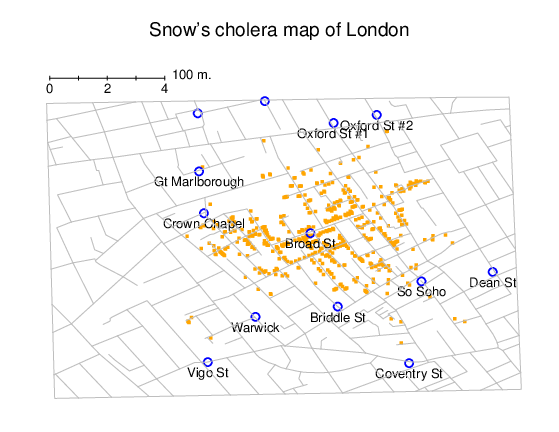
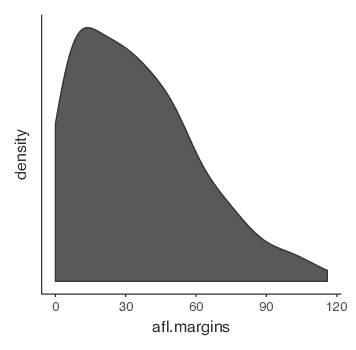
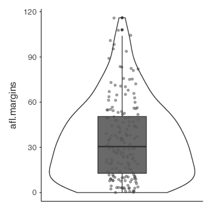
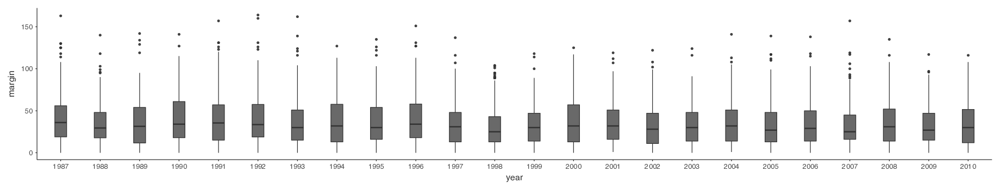
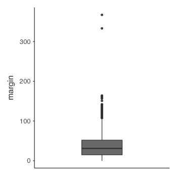

グラフの作成 {#ch:graphics}
=================================

> 何よりもまずデータを示せ\
>
> 　　　　　--- エドワード・タフテ^[これは，タフテの『The Visual Display of Quantitative Information（量的情報の視覚的表示）』という素晴らしい本からの引用です。]

データの視覚化はデータ分析において非常に重要な作業です。それがなぜかという理由は2つありますが，その2つは密接に関連しています。まず，あなたが伝えたいことを相手にわかりやすくするためには，見やすくて視覚的に魅力的な「プレゼンテーション用の図」を作ることが重要であるという理由です。また，それと同じくらい，あるいはそれ以上に重要な理由として，*あなたが*自分のデータを理解するうえで，グラフを描くことが非常に役立つということがあります。これから分析しようとしているデータについてよりよく知るには，「探索的グラフ」を作成することが重要です。そんなことはわかりきっていると思うかもしれませんが，これらを忘れてしまっている人を私は何度となく見かけます。

本章の重要性を理解するために，優れたグラフがいかに強力であるかを示すところから始めたいと思います。図\@ref(fig:snowmap1)は，効果的な視覚化の例として有名なデータを再描画したもので，これはジョン・スノーが1854年に作成したコレラによる死亡地図です。この地図はシンプルかつエレガントですよね。背景には，場所がわかりやすいように道路地図が描かれています。その上には，多数の小さな点が描かれており，この1つ1つがコレラの発生場所を示しています。円は井戸の場所を示しており，そこには名前が示されています。このグラフをざっと見ただけでも，コレラ大発生の原因がブロードストリート（Broad St）の井戸にあることは明らかです。このグラフを見たスノー博士は，この井戸のポンプからハンドルを取り外して使えないようにし，それによって500人以上の命を奪ったコレラの大発生が終息にいたりました。データを視覚化するというのはこれほどまでに強力なのです。

この章には目的が2つあります。1つめは，データの分析やプレゼンテーションの際によく用いられる，とくに一般的なグラフについて説明することです。そして2つめは，それらのグラフを<span class="jamovi">jamovi</span>で作成する方法について説明することです。グラフそれ自体はとても簡単であることが多いので，ある意味この章の内容はとてもシンプルだといえます。多くの人が苦労するのはグラフ作成の部分です。とくに，ちゃんとしたグラフを作るのは難しいようです。幸いにして，グラフの見た目にとびきりのこだわりでもない限り，<span class="jamovi">jamovi</span>でのグラフの作成は非常にシンプルです。<span class="jamovi">jamovi</span>には*とても*素晴らしいグラフやプロットがデフォルトでたくさん備わっており，それらを使うとわかりやすく高品質なグラフが作成できるのです。ただし，<span class="jamovi">jamovi</span>の作図機能にはいまのところ高度な編集機能はありませんので，一般的でない形式の図を作成しようとする場合，あるいは特別な変更を図に加えたい場合には，<span class="jamovi">jamovi</span>ではできない可能性があります。

```{r snowmap1, warning=FALSE, echo=FALSE, out.width='82.4%', fig.align='center', fig.cap='ジョン・スノーのコレラ地図の再描画。頭上の小さな点はコレラの発生地点を，円は井戸の位置を示す。図から明らかなように，コレラの発生はBroad St井戸の付近に密集している。', echo=FALSE}

```

ヒストグラム {#sec:hist}
--------------------------

それではまず，<span class="keyterm">ヒストグラム</span>（histogram）から始めましょう。ヒストグラムはデータを視覚化するもっとも単純かつ便利な方法です。ヒストグラムは間隔尺度または比率尺度の変数に使用できます（たとえば第\@ref(ch:descriptives)章の<span class="rtext">afl.margins</span>データ）。ヒストグラムの目的は，変数の全体的な印象をつかむことにあります。ヒストグラムはいろんなところで使われているので，これがどんなものかを知っている人も多いとは思いますが，完璧を期して説明しておくことにしましょう。ヒストグラムでは，すべての値を<span class="keyterm">ビン</span>^[訳注：ヒストグラムのグラフ上の棒のことです。]（bin）に振り分け，それぞれのビンに観測値がいくつ入るかを数えます。そしてこの個数をそのビンの度数または密度として縦棒で示します。AFLの得点差データには得点差が10点未満の試合が33試合あり，それが第\@ref(ch:descriptives)章の図\@ref(fig:histogram1)では一番左端の棒の高さによって示されています。なお，このグラフの作成には<span class='R'>R</span>の高度なグラフ作成パッケージを使用しています。今のところは<span class="jamovi">jamovi</span>でこれとまったく同じグラフを作ることはできません。ただし，これに近いものなら作成可能です。そして<span class="jamovi">jamovi</span>でヒストグラムを作成する方法はとても簡単です。「**Exploration**（探索）」>「**Descriptives**（記述統計）」の「**plots**（作図）」の部分を開き，「**histogram**（ヒストグラム）」のチェックボックスにチェックを入れるだけです（図\@ref(fig:jamovihistogram)）。<span class="jamovi">jamovi</span>のデフォルトでは，縦軸の名前は「density（密度）」，横軸の名前は変数名になります。<span class="keyterm">ビン</span>の幅は自動で選択されます。縦軸には図\@ref(fig:histogram1)のような目盛りや個数の情報がありませんが，これはさほど問題ではありません。なぜなら，ここで関心があるのは，データがどのように分布しているかということだからです。データは正規分布になっているでしょうか。それとも歪んでいたり極端にとんがっていたりするのでしょうか。こうした特徴は，<span class="keyterm">ヒストグラム</span>を作成してみることでわかります。

```{r jamovihistogram, warning=FALSE, echo=FALSE, out.width='82.4%', fig.align='center', fig.cap='jamoviのヒストグラム', echo=FALSE}
knitr::include_graphics("img/graphics/jamovi_histogram.png")
```

<span class="jamovi">jamovi</span>では，追加機能として「**Density**（密度）」曲線を作図することもできます。それには「**Plots**（作図）」オプションの下にある「**Density**（密度）」チェックボックスをクリックしてください（そして「**Histogram**」のチェックはオフにします）。すると，図\@ref(fig:histogram2)のような図が表示されます。密度プロットは，連続した区間または期間におけるデータの分布を視覚化します。この図はヒストグラムの変種で，<span class="keyterm">カーネル平滑化</span>（kernel smoothing）という方法を用いて値を図に示しています。これは，分布を平滑化してノイズを除去する手法です。密度プロットのピーク部分は，その値が集中している場所です。ヒストグラムよりも密度プロットの方が優れている点として，密度プロットではグラフの形がビン（ヒストグラムの棒のことです）の数に影響されないので分布の特徴をつかみやすいということがあります。ヒストグラムでは，ビンが20本もあれば大丈夫ですが，ビンが4本しかなければ分布の形はわかりません。密度プロットの場合にはそうした問題が生じないのです。

```{r histogram2, warning=FALSE, echo=FALSE, out.width='58.8%', fig.align='center', fig.cap='jamoviで作成した<span class="rtext">afl.margins</span>変数の密度プロット', echo=FALSE}

```


プレゼンテーション用（つまりレポートに使ったりする場合）にはもっと見た目を整える必要はあるでしょうが，データを記述するうえではこの図はとても便利です。ヒストグラムや密度プロットの強みは，（適切に用いれば）データの範囲全体を見ることができ，データがどのような形をしているのかがわかりやすいというところにあります。ヒストグラムの欠点としては，かなり場所をとるということです。この後に説明する他の図と違い，1つの図に20から30のヒストグラムを詰め込んだとしたら，それを見た人は圧倒されてしまうでしょう。そしてもちろん，データが名義尺度の場合にはヒストグラムは役に立ちません。

箱ひげ図 {#sec:boxplots}
-----------------------------

ヒストグラムの代わりに使えるようなものとして，<span class="keyterm">箱ひげ図</span>（box and wiskers plot）あるいは「ボックスプロット（boxplot）」と呼ばれるグラフがあります。ヒストグラムと同様に，これは間隔尺度や比率尺度のデータに最適です。箱ひげ図は，データの中央値と四分位範囲，そして範囲をシンプルな形で視覚化したものです。箱ひげ図は非常にコンパクトなので，とくにデータ分析の探索的な段階，つまり自分自身のデータについて理解しようとする段階において非常によく使われる手法になっています。再び<span class="rtext">afl.margins</span>データを使ってこの図がどのようなものかを見てみましょう。

```{r boxplot1, warning=FALSE, echo=FALSE, out.width='82.4%', fig.align='center', fig.cap='jamoviで<span class="rtext">afl.margins variable</span>の箱ひげ図を表示した様子。', echo=FALSE}
knitr::include_graphics("img/graphics/boxplot1.png")
```


箱ひげ図がどのようなものかを知るには，それを描いてみるのが一番です。「**Box plot**（箱ひげ図）」チェックボックスをクリックすると図\@ref(fig:boxplot1)の右下にあるようなグラフが表示されます。<span class="jamovi">jamovi</span>で作成されるのは非常に基本的な箱ひげ図です。この図は次のように解釈します。まず，箱の中央にある太い線が中央値の位置を表しています。箱の縦幅は25%パーセンタイル値から75%パーセンタイル値までの範囲を表しており，「ひげ」の部分は一定の基準内にある両端の値までの範囲を示しています。デフォルトでは，その基準は四分位範囲の1.5倍に設定されています。つまり，ヒゲの下限は<span class="rtext">25パーセンタイル値 - (1.5\*四分位範囲)</span>，上限は<span class="rtext">75パーセンタイル値 + (1.5\*四分位範囲)</span>です。この範囲からはみ出す観測値については，ひげの外側に小さな丸または点で示されます。一般的に，これらは<span class="keyterm">外れ値</span>（outlier）と見なされます。AFL得点差データでは，この範囲（上限は107）から外れる観測値が2つありました。そしてこれらの観測値は点で示されています。スプレッドシートでデータを見てみると，確かにこれより大きな数値のもの（108と116）があります。点で示されているのはこれらの値です。

### バイオリン図  {#sec:violinplots}

```{r boxplot2, warning=FALSE, echo=FALSE, out.width='47.1%', fig.align='center', fig.cap='jamoviによる<span class="rtext">afl.margins</span>変数のバイオリン図。箱ひげ図とデータ点を重ねて表示している。', echo=FALSE}

```


一般的な箱ひげ図の変種としてバイオリン図があります。バイオリン図は箱ひげ図に似ていますが，データ値のカーネル確率密度も併せて示される点が異なります。通常，バイオリン図では，データの中央値や四分位範囲を示すマーカーを一般的な箱ひげ図と同様の形で示します。<span class="jamovi">jamovi</span>でそのような図を作成する場合，「**Violin**（バイオリン）」と「**Box plot**（箱ひげ図）」の両方にチェックを入れてください。図\@ref(fig:boxplot2)では，「**Data**（データ）」のチェックボックスもオンになっています。こうすると，図の中に各データ点も示されます。ただ，個人的にはこれはちょっと図がごちゃごちゃしすぎだと思います。シンプルな形の方がわかりやすいので，実際の場面では単純な箱ひげ図を使う方がいいかもしれませんね。

### 複数の箱ひげ図を描画する  {#sec:multipleboxplots}

最後にあと1つだけ。複数の箱ひげ図を一度に表示したい場合はどうすればよいでしょうか。たとえば，AFLの得点差データについて，2010年のデータだけでなく1987年から2010年までのデータを一度に箱ひげ図にしたいような場合です。そのためにはまずそのデータを探してこないといけませんが，そのデータは[<span class="filename">aflsmall2.csv</span>](data/aflsmall2.csv)ファイルに格納されています。このファイルを<span class="jamovi">jamovi</span>に読み込んでどうなるか見てみましょう（ファイル名を右クリックしてファイルをダウンロードしてください）。これはかなり巨大なデータセットです。変数には4296試合分のデータが格納されています。<span class="jamovi">jamovi</span>を使ってやりたいことは，<span class="rtext">margin</span>（得点差）変数の箱ひげ図を作成することですが，その際に<span class="rtext">year</span>（年）ごとに作図する必要があります。そのためには，図\@ref(fig:splitfile1)にあるように<span class="rtext">year</span>変数を「**Split by**（グループ変数）」に移動します。

```{r splitfile1, warning=FALSE, echo=FALSE, out.width='58.8%', fig.align='center', fig.cap='「Split by（グループ変数）」の設定', echo=FALSE}
knitr::include_graphics("img/graphics/splitfile1.png")
```

その結果が図\@ref(fig:boxplot3)です。このような形で箱ひげ図を作成すると，ヒストグラムよりも箱ひげ図の方が便利な場合というのがわかると思います。あまりに細かすぎる情報に圧倒されることなく，年ごとのデータがどのようになっているのかをこのようにして一覧できるのです。同じようにして1つの図に24個のヒストグラムを詰め込んだらどうなるかを想像してみてください。そこから何かに役立つ情報が得られるとはまず考えられませんね。

```{r boxplot3, warning=FALSE, echo=FALSE, out.width='82.4%', fig.align='center', fig.cap='複数の箱ひげ図をまとめて表示した様子。<span class="rtext">aflsmall12</span>データの<span class="rtext">margin</span>（得点差）を<span class="rtext">year</span>（年）ごとに図示している。', echo=FALSE}

```


### 箱ひげ図で外れ値を探す {#sec:boxplotoutliers}

```{r boxplot4, warning=FALSE, echo=FALSE, out.width='47.1%', fig.align='center', fig.cap='箱ひげ図では外れ値の疑いが強い観測値がわかる。', echo=FALSE}

```


箱ひげ図では一定の範囲を超える観測値は自動的に切り分けられて表示されるので（<span class="jamovi">jamovi</span>では点で示されます），この図を<span class="keyterm">外れ値</span>（outlier）を探すための方法として用いることもよくあります。外れ値とは，他の観測値に比べて飛び抜けて極端な値である「疑いがある」ものをいいます。1つ例を挙げてみましょう。AFLの得点差データで箱ひげ図を作成したら図\@ref(fig:boxplot4)のようになったとします。2つの観測値が何かちょっとおかしいということがすぐわかりますね。この2試合だけ得点差が300点を超えています。これはさすがにありえません。おかしいと思ったら，データをよく見てみましょう。<span class="jamovi">jamovi</span>では，疑わしい観測値がどれなのかを素早く簡単に探し出すことができ，元のデータを確認してその部分に間違いがないかを確かめることができます。特定の範囲を超える観測値だけを抽出するには，フィルタ機能を使用します。この例では300を超える値を探し出したいので，フィルタをそのように設定します。まず，<span class="jamovi">jamovi</span>の「**Data**（データ）」タブにある「**Filters**（フィルタ）」ボタンをクリックしてください。そして，フィルタの入力欄に「<span class="rtext">= margin > 300</span>」と入力します（図\@ref(fig:filter1)）

```{r filter1, warning=FALSE, echo=FALSE, out.width='82.4%', fig.align='center', fig.cap='フィルタ画面', echo=FALSE}
knitr::include_graphics("img/graphics/filter1.png")
```


すると，スプレッドシートにこの条件に合致するかどうかを示す新たな列が追加され，この条件に合致した観測値だけがハイライトされます。どの観測値が含まれているのかを素早く探し出す1つの方法は，（「**Exploration**（探索）」>**「Descriptives**（記述統計）」で）「<span class="rtext">ID</span>」変数の「**Frequency table**（度数分布表）」を作成してみることです（この変数は名義変数である必要があります。そうでないと度数分布表が作成されません）。図\@ref(fig:filter2)から，得点差が300を超える観測値のIDは<span class="rtext">14</span>と<span class="rtext">134</span>であることがわかります。こうした疑わしい観測値については，元のデータを参照して何が原因であるのかを確かめなくてはなりません。

```{r filter2, warning=FALSE, echo=FALSE, out.width='82.4%', fig.align='center', fig.cap='ID変数の度数分布表から，疑わしい値が14番目と134番目の観測値であることがわかる。', echo=FALSE}
knitr::include_graphics("img/graphics/filter2.png")
```

多くの場合，これは誰かが数値を打ち間違えていることが原因です。ばかばかしく思えるかもしれませんが，こうしたことは本当によくあるのです。実際のデータセットでは，つまらないミスが混入していることがよくあります。そしてその多くは，コンピューターへのデータ入力時に生じています。実際，データ分析ではこうした確認作業に対して<span class="keyterm">データクリーニング</span>（data cleaning）というような専用の名前まであり，この段階にかなりの時間が費やされることもあるのです。データクリーニングでは，元のデータファイルにおけるタイプミス（「タイポ」）や欠損値など，さまざまなエラーの検出や訂正が行われます。

そこまで極端な値でない場合，箱ひげ図で外れ値として示されていたとしても，その値を分析に含めるかどうかは，*なぜ*データがそのようになっていると考えられるのかや，あなたが*何のために*そのデータを使用したいのかに大きく依存します。よく考えて適切に判断しましょう。その外れ値に合理的な理由があると思えるなら，それは残しておくようにしてください。ともあれ，この問題についてはセクション\@ref(sec:regressiondiagnostics)でもう再度触れることにします。

棒グラフ {#sec:bargraph}
------------------------------

その他，<span class="keyterm">棒グラフ</span>も非常によく使用されるグラフです。セクション\@ref(sec:mode)で使用した<span class="rtext">afl.finalists</span>データセットの<span class="rtext">afl.finalists</span>で棒グラフを作成してみましょう。ここでは<span class="rtext">afl.finalists</span>データセットに格納された期間で各チームが決勝進出した回数を棒グラフとして示すことにします。たくさんのチームがありますが，ここではとくにBrisbane，Carlton，Fremantle，Richmondの4チームに着目します。まずはフィルタを設定して，棒グラフにするこの4チームの値だけを抽出しましょう。<span class="jamovi">jamovi</span>ならこの作業はとても簡単です。先ほどと同様に「**Filters**（フィルタ）」機能を使用します。「**Filters**（フィルタ）」の画面を開いたら，次のように入力します。

<span class="rtext">&nbsp;&nbsp;&nbsp;&nbsp;afl.finalists == 'Brisbane' or afl.finalists == 'Carlton' \
&nbsp;&nbsp;&nbsp;&nbsp;or afl.finalists == 'Fremantle' or afl.finalists == 'Richmond'</span> ^[<span class="jamovi">jamovi</span>では，「一致」を示すのに"<span class="rtext">==</span>"という記号を使います。]

このように入力すると，「**Data**（データ）」ビューに抽出結果が表示されます。次に，「**Exploration**（探索）」>「**Descriptives**（記述統計）」で「**Bar plot**（棒グラフ）」にチェックをいれてください（グラフを作成する変数を指定するために，<span class="rtext">afl.finalists</span>変数を忘れずに「**Variables**（変数）」ボックスに入れておきましょう）。すると，図\@ref(fig:bar1)のような棒グラフが得られるはずです。


```{r bar1, warning=FALSE, echo=FALSE, out.width='82.4%', fig.align='center', fig.cap='フィルタでAFLの4チームを抽出し，それを棒グラフとして示した様子。', echo=FALSE}
knitr::include_graphics("img/graphics/bar1.png")
```


画像ファイルの保存  {#sec:saveimage}
-----------------------------------------------------

皆さんきっとこう考えているのではないでしょうか。いくら<span class="jamovi">jamovi</span>できれいなグラフが描けたって，それを保存したり，友人に送って自分のデータがいかにすごいかを自慢したりできないなら意味がないじゃないかと。さて，画像を保存するにはどうすればいいでしょうか。これも簡単です。グラフの画像を右クリックして，「<span class="rtext">eps</span>」，「<span class="rtext">svg</span>」，「<span class="rtext">pdf</span>」のいずれかの形式で保存すればよいのです。どの形式を選んでもきれいな画像が保存されますので，それを友人に送ったり，課題や論文に使ったりすることができます^[訳注：個人的な意見ですが，人に送るならPDF形式が無難です。大抵のPCにはAcrobat Readerがインストールされていて，それがあればPDFファイルを開くことができるからです（Mac OSの場合は「プレビュー」で開けます）。残りの2つはPDFに比べると一般的ではないので，相手から「ファイルが開けない」と言われる可能性は高くなります。]。

要約
-------

おそらく私は単純な人間なのでしょう。グラフが大好きです。新たに論文を書くときはいつも，まず最初にどんなグラフを描こうかと考えます。私の頭の中では，論文とはまさにストーリーに沿ってグラフが並べられたものなのです。残りはうわべの飾りでしかありません。何が言いたいかというと，人間の視覚はとても強力なデータ分析ツールだということです。視覚を通じて適切に情報を与えてやれば，たくさんの情報を非常に素早く人に伝えることができるのです。まさに「百聞は一見にしかず」です。そうした点から，本書の中でも本章はとくに重要な部分だと言えます。本章では次の内容を扱いました。

-   **よく用いられる図**　 本章の大部分は統計専門家がよく使う標準的なグラフについての説明でした。取りあげたのは，ヒストグラム（セクション\@ref(sec:hist)），箱ひげ図（セクション\@ref(sec:boxplots)），そして棒グラフ（セクション\@ref(sec:bargraph)）です。

-   **画像ファイルの保存**　 作成したグラフを保存する方法についても触れました（セクション\@ref(sec:saveimage)）。

最後に1つ指摘しておきます。<span class="jamovi">jamovi</span>は非常にきれいなグラフを作成してくれますが，今のところグラフの編集はできません。より高度なグラフや図を作成したい場合には，<span class="R">R</span>のパッケージの方がより強力です。非常に人気のある作図システムとしては<span class="rtext">ggplot2</span>（<http://ggplot2.org/>）があり，これはおおまかに『The grammar of graphics（作図の原理）』[@Wilkinson2006]の考え方に基づいたグラフ描画パッケージです。ただし，初心者向きではありません。これを使うには<span class="R">R</span>についてかなり理解している必要がありますし，理解していたとしてもコツをつかむまでに少し時間がかかります。それでも，時間をかけて独学するだけの価値はあります。それほど強力で優れたシステムです。

