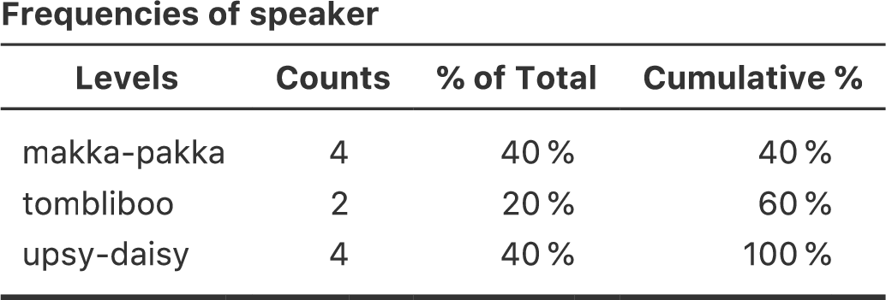

データの操作 {#ch:datahandling}
=========================================

> 人生という庭は，哲学者らが便宜的に説く姿からはほど遠い。\
もう少し耕した方が良さそうだ。\
>
>　　　　　--- ロジャー・ゼラズニー^[『ハングマンの帰還（Home is the Hangman）』（1975年）より引用。]

本章は，私の基準からしてもちょっと変わった内容を含んでいます。本章の目的は，データを扱う際の実際的な問題について説明することです。これについては，本書の他の場所ではあまり触れられていません。実際のデータセットを扱う際の問題点は，それらがとても*乱雑*であるということです。分析に適した形で変数が格納されていないということもよくありますし，データセットに多数の欠損値が含まれているようなこともあります。データの一部のみを分析したいということもあるでしょう。他にもさまざまなことがあります。つまり，データセットの変数を分析に適した形にするためには，さまざまな<span class="keyterm">データ操作</span>を行わなくてはならないのです。本章は，こうした実際上の問題に関する基本的な部分を説明することを目的としています。実際のデータを扱う際にさまざまな実際的問題が生じることからこの章を書くに至ったわけですが，本書の他の章と同様，ここでも小規模な練習用データセットを用いて説明していきます。本章の内容は基本的にはいろいろなテクニックの紹介であり，全体としてまとまったストーリーがあるわけではありません。そこで，まず最初に扱う項目をリストアップしておこうと思います。

-   セクション\@ref(sec:freqtables)　 データの集計

-   セクション\@ref(sec:logicals)　 論理式の使用

-   セクション\@ref(sec:transform)　 変数変換

-   セクション\@ref(sec:mathfunc)　 便利な数学関数

-   セクション\@ref(sec:subset)　 サブセットの抽出

このように，本章では非常に広く，そして*たくさん*の内容を扱います。この章は，本書の中でもとくに長くて難しい部分かもしれませんが，それでも多数ある重要なトピックのほんの一部を表面的に説明したものに過ぎません。これは私からのアドバイスですが，この章を一度読み通したうえで，できる限りいろいろと試してみるようにしてください。一度にすべてを理解する必要はありませんし，とくに後半部分は理解できないからといって心配しすぎる必要はありません。本書のこの後の部分でもこの章の内容が必要になることはわずかですし，基本的なことだけ理解できていれば十分だからです。ただし，本書の後の方になって，私がここで説明する概念のいくつかを理解するために，この章に戻ってくることになるでしょう。

データの集計とクロス集計 {#sec:freqtables}
----------------------------------------------------------

データ分析において非常に一般的な作業の1つに，度数分布表またはクロス集計表の作成があります。その作業は<span class="jamovi">jamovi</span>でできますので，その方法をこのセクションで説明します。

### 1つの変数で表を作成する

まずは簡単な例から始めましょう。私には小さな子供がいますので，『In the Night Garden^[訳注：イギリスの子供向け番組。]』のようなテレビ番組をよく見ます。そして[<span class="filename">nightgarden.csv</span>](data/nightgarden.csv)ファイルには，その番組での会話を私が書き留めたデータが含まれています。このファイルにある，<span class="rtext">speaker</span>（話し手）と<span class="rtext">utterance</span>（発話）という2つの変数がここでの対象です。このデータセットを<span class="jamovi">jamovi</span>で開き，スプレッドシートでどのようなデータか見てみましょう。データは次のようになっているはずです。

「speaker（話し手）」 変数：\
<span class="rtext">upsy-daisy upsy-daisy upsy-daisy upsy-daisy tombliboo tombliboo makka-pakka \
makka-pakka makka-pakka makka-pakka</span>

「utterance（発話）」変数：\
<span class="rtext">pip pip onk onk ee oo pip pip onk onk</span>

これを見ると，私の頭がどうかしているということがよくわかるはずです。このデータで，たとえば番組の各キャラクターが話した回数を数える必要があったとします。<span class="jamovi">jamovi</span>の「**Descriptives**（記述統計）」画面には「**Frequency tables**（度数分布表）」というチェックボックスがあり，それを使えば図\@ref(fig:freqtable)のような結果が得られます。


```{r freqtable, warning=FALSE, echo=FALSE, out.width='58.8%', fig.align='center', fig.cap='speaker変数の度数分布表', echo=FALSE}

```


この表の最初の行には，<span class="rtext">speaker</span>変数の何を示しているのかが説明されています。「Levels」の列は，データに含まれている話し手（speaker）の一覧で，「Counts」の列はその話し手のがデータの中に何個含まれているかを示しています。要するにこれは度数分布表です。

<span class="jamovi">jamovi</span>の「**Frequency tables**（度数分布表）」チェックボックスは，1つの変数に対して1つの表しか作成してくれません。<span class="rtext">speaker</span>（話し手）と<span class="rtext">utterance</span>（発話）の2つの変数を組み合わせ，それぞれの話し手がそれぞれの発話を何回行ったかを知りたいような場合には，クロス集計表，すなわち分割表を作成する必要があります。<span class="jamovi">jamovi</span>では，「**Frequencies**（頻度）」>「**Contingency Tables**（分割表）」>「**Independent Samples**（対応なしのサンプル）」で，<span class="rtext">speaker</span>（話し手）変数を「**Rows**（行）」に，<span class="rtext">utterances</span>（発話）変数を「**Columns**（列）」に設定します。このように設定すると，図\@ref(fig:contingencytable)のような分割表が得られます。


```{r contingencytable, warning=FALSE, echo=FALSE, out.width='82.4%', fig.align='center', fig.cap='<span class="r-text">speaker</span>（話し手）変数と<span class="r-text">utterance</span>（発話）変数の分割表。', echo=FALSE}
knitr::include_graphics("img/mechanics/contingencytable.png")
```


ここでは「\(\chi^2\) Tests」の表については忘れてください。これについては第\@ref(ch:chisquare)章で説明します。この分割表を解釈する際は，ここに示されているのがデータの度数だという点に注意してください。つまり，1行2列目の2という数字は，Makka-Pakka（1行目)による「onk」（2列目)という発話がこのデータセットには2個含まれていたという意味です。

### 分割表へのパーセンテージの追加

図\@ref(fig:contingencytable)には度数そのものが示されています。つまり，指定した変数の各水準の組み合わせでその観測値がいくつあったかという数が示されているわけです。しかし，個数だけでなくパーセントも示したいという場合があるでしょう。「**Contingency Tables**（分割表）」画面の「**Cells**（セル）」オプションにはさまざまなパーセントのためのチェックボックスがあります。まず，「**Row**（行）」のチェックボックスをオンにすると，結果画面の「**Contingency Table**」（分割表）は図\@ref(fig:contingencyrow)のようになります。


```{r contingencyrow, warning=FALSE, echo=FALSE, out.width='82.4%', fig.align='center', fig.cap='<span class="r-text">speaker</span>（話し手）変数と<span class="r-text">utterance</span>（発話）変数の分割表に行ごとのパーセントを示したもの。', echo=FALSE}
knitr::include_graphics("img/mechanics/contingencyrow.png")
```


```{r contingencycol, warning=FALSE, echo=FALSE, out.width='82.4%', fig.align='center', fig.cap='<span class="r-text">speaker</span>（話し手）変数と<span class="r-text">utterance</span>（発話）変数の分割表に列ごとのパーセントを示したもの。', echo=FALSE}
knitr::include_graphics("img/mechanics/contingencycol.png")
```


ここに表示されているのは，キャラクターごとの各発話のパーセントです。つまり，Makka-Pakkaの発話は「pip」が50%で，残りの50%は「onk」ということです。この結果と列ごとのパーセンテージを示した場合とを比較してみましょう（「**Cells**（セル）」画面の「**Row**（行）」のチェックを外して「**Column**（列）」にチェックを入れてください）。その結果が図\@ref(fig:contingencycol)です。この表には，各発話ごとのキャラクターのパーセントが示されています。たとえば，「ee」という発話が会った場合に，（このデータセットの中では）その話し手がTomblibooである割合が100%ということです。

<span class="jamovi">jamovi</span>の論理式{#sec:logicals}
-------------------------------------------------

<span class="jamovi">jamovi</span>におけるデータ変換の多くでは，<span class="keyterm">論理値</span>という考え方がとても重要です。論理値とは，ある値が真であるか偽であるかを表したものです。<span class="jamovi">jamovi</span>では，論理値は非常にわかりやすい形で使用されます。論理値としては<span class="rtext">true</span>（真）と<span class="rtext">false</span>（偽）という2種類の値があります。このようにとてもシンプルにも関わらず，論理値は非常に便利なものなのです。それではこの値について見ていくことにしましょう。

### 数学的真実の評価

ジョージ・オーウェルの古典，『1984年』には，全体主義の党が掲げる「2足す2は5である」というスローガンが登場します。これは，人間の自由を政治的に支配できれば，こうした基本的な真理すら破壊できるという考え方です。これは恐ろしい考えです。そしてなんと，主人公のウィンストン・スミスは，最終的に拷問に屈し，この主張に同意してしまうのです。そしてこの小説では「人間には無限の可<ruby>塑<rt>そ</rt></ruby>性がある」と語られます。私は人類にとってこの主張が真でないと強く確信していますし^[中二病的に「かっこよく」なろうとしたことがありますが，できないことも多々ありました。]，もちろん，<span class="jamovi">jamovi</span>にとっても真ではありません。<span class="jamovi">jamovi</span>には完全な可塑性というものはありませんし，少なくとも基本的な計算に関しては，何が真で何がそうでないのかということに関しては確たる意見を持っているのです。

<span class="rtext">2+2</span>を計算させれば必ず毎回同じ答えを返してくれますし，その答えが5であることはありません^[これは「**Compute**（計算）」の新規変数画面で可能です。すべてのセルで新規変数として<span class="rtext">2+2</span>を計算しても役には立ちませんが。]。もちろん，これは<span class="jamovi">jamovi</span>が単に計算をしているだけです。\(2+2 = 4\)が正しいかどうかについて尋ねたわけではありません。こうした判断を明示的に<span class="jamovi">jamovi</span>にさせたい場合には，<span class="rtext">2+2==4</span>という命令文を使います。

一体何をしたのかというと，これは，<span class="keyterm">等価演算子</span>と呼ばれる<span class="rtext">==</span>記号を用いて，<span class="jamovi">jamovi</span>に「真か偽か」の判断をさせているのです^[これは等号（<span class="rtext">=</span>）とはまったく違う演算子である点に注意してください。<span class="jamovi">jamovi</span>で論理式を作成する際によくある打ち間違いは，<span class="rtext">==</span>のつもりで<span class="rtext">=</span>と入力してしまうことです（他の統計プログラムでも，<span class="rtext">=</span>と<span class="rtext">==</span>の区別は重要です。）。これにはとくに注意してください。私は10代の頃からいろいろなプログラミング言語を使ってきましたが，*いまだに*よく間違えます。私がイケてない10代だったのはきっとそのせいでしょうね。そしていまだにイケてないのもそのせいでしょう。]。では，<span class="jamovi">jamovi</span>が党のスローガンをどう判断するか見てみましょう。次の式を「数式（formula）」ボックスに入力して新しい変数を計算させます。

```{block2, type='rblock1'}
2+2 == 5
```

さて結果はどうなったでしょうか。スプレッドシートに表示された新しい計算変数の列には「false」（偽）がずらりと表示されるはずです。やったね！ 自由万歳！ とまあそんな感じです。では，もし<span class="jamovi">jamovi</span>に2足す2が５であるということを<span class="rtext">2+2=5</span>といった文を使って信じ込ませようとしたらどうなるでしょうか。これを<span class="R">R</span>のような他のプログラムで実行するとエラーメッセージが表示されます。ところが，これを<span class="jamovi">jamovi</span>で実行すると，「false」（偽）の値がずらりと表示されるのです。どうなっているのでしょうか。どうやら<span class="jamovi">jamovi</span>は非常に賢くて，正しい<span class="keyterm">等価演算子</span>（<span class="rtext">==</span>）を使おうが等号（=）を使おうが，あなたが<span class="rtext">2+2=5</span>が真であるか同かをテストしているのだということをきちんと認識してくれているようです。


### 論理演算

ここまで，論理演算について見てきました。ただし，お見せしたのはもっとも単純な例です。こう聞いても驚かないでしょうが，論理演算は普通の計算を組み合わせたり，関数と組み合わせたりして複雑な形で使用することができます。たとえば次のようにです。

```{block2, type='rblock1'}
3\*3 + 4\*4 == 5\*5
```

または

```{block2, type='rblock1'}
SQRT(25) == 5
```

それだけではありません。表\@ref(tab:logicals)に見られるように，論理演算子にはいくつかの基本的な数学概念を表す複数のものが用意されているのです。これらは見ればわかるのではないかと思います。たとえば，<span class="keyterm">未満</span>（より小）演算子（<span class="rtext"><</span>）は，左側の数値が右側の数値よりも小さいかどうかをチェックします。左側の方が値が小さければ<span class="rtextoutput">true</span>（真）を返し，2つの値が同じか，右側の値の方が小さければ<span class="rtextoutput">false</span>（偽）という答えを返します。

これに対し，<span class="keyterm">以下</span>演算子（<span class="rtext"><=</span>）の場合は，その名前が示すとおりの振る舞いをします。つまり，左側の値が右側よりも小さい場合，または2つの値が同じ場合に<span class="rtextoutput">true</span>（真）を返すのです。となれば，<span class="keyterm">超過</span>（より大）演算子（<span class="rtext">></span>）と<span class="keyterm">以上</span>演算子（<span class="rtext">>=</span>）がどのような振る舞いをするかはもうおわかりでしょう。

論理演算子リストのその次にあるのは<span class="keyterm">不等価</span>演算子（<span class="rtext">!=</span>）で，これも他と同じように見たとおりの働きをします。これは，この記号の左右で値が等しくない場合に<span class="rtextoutput">true</span>（真）を返します。つまり，\(2+2\)は\(5\)ではありませんので，これを計算させると新しい計算変数には<span class="rtextoutput">true</span>の値が入力されます。やってみましょう。

```{block2, type='rblock1'}
2+2 != 5
```

<table><caption>(\#tab:logicals) 論理演算子の例。専門的には，これらは「二項関係演算子」と呼ばれますが，私はその呼び方が嫌いなのでそうは呼びません。私の本ですから私の呼びたい名前で呼びます。</caption></table>
```{r, warning=FALSE, echo=FALSE,message=FALSE}
library(knitr)
library(kableExtra)

dt<- matrix(c(
'未満（より小）','<span class="rtext"><</span>','<span class="rtext">2 < 3</span>','<span class="rtextoutput">true</span>','以下','<span class="rtext"><=</span>','<span class="rtext">2 <= 2</span>','<span class="rtextoutput">true</span>','超過（より大）','<span class="rtext">></span>','<span class="rtext">2 > 3</span>','<span class="rtextoutput">false</span>','以上','<span class="rtext">>=</span>','<span class="rtext">2 >= 2</span>','<span class="rtextoutput">true</span>','等価（等しい）','<span class="rtext">==</span>','<span class="rtext">2 == 3</span>','<span class="rtextoutput">false</span>','不等価（等しくない）','<span class="rtext">!=</span>','<span class="rtext">2 != 3</span>','<span class="rtextoutput">true</span>'
), ncol=4, byrow=T)
colnames(dt)<-c('演算','演算子','入力例','結果')

kable(dt, align = c('l','c','c','c'), escape = FALSE) %>%
  kable_styling(bootstrap_options = "striped", full_width = F)
```


これで終わりではありません。あと3つ，知っておくとよい論理演算子があります（表\@ref(tab:logicals2)）。それは<span class="keyterm">否定</span>演算子（<span class="rtext">NOT</span>），<span class="keyterm">かつ</span>（論理積）演算子（<span class="rtext">and</span>）そして<span class="keyterm">または</span>（論理和）演算子（<span class="rtext">or</span>）です。


```{r logicals2, warning=FALSE, echo=FALSE,message=FALSE}
library(knitr)
library(kableExtra)

dt<- matrix(c(
'否定','<span class="rtext">NOT</span>','<span class="rtext">NOT(1==1)</span>','<span class="rtextoutput">false</span>',
'または','<span class="rtext">or</span>','<span class="rtext">(1==1) or (2==3)</span>','<span class="rtextoutput">true</span>',
'かつ','<span class="rtext">and</span>','<span class="rtext">(1==1) and (2==3)</span>','<span class="rtextoutput">false</span>'
), ncol=4, byrow=T)
colnames(dt)<-c('演算','演算子','入力例','結果')

kable(dt, align = c('l','c','c','c'), escape = FALSE,caption='その他の論理演算子') %>%
  kable_styling(bootstrap_options = "striped", full_width = F)
```


他の論理演算子同様に，その振る舞いは大体その名前からわかるのではないでしょうか。たとえば，「\(2+2 = 4\) *または* \(2+2 = 5\)である」という評価を行えば，その答えはイエス（true）になります。これは「いずれか」が正しいことを評価する文ですので，2つのうちどちらか一方でも真であれば，真ということになるのです。これが<span class="rtext">or</span>演算子の働きです ^[ここは<span class="jamovi">jamovi</span>のヘンテコな部分です。たとえば<span class="rtext">2+2 == 5</span>のような単純な論理式を入力した場合には，<span class="jamovi">jamovi</span>はスプレッドシートの対応する列に<span class="rtextoutput">false</span>（または<span class="rtextoutput">true'）と表示してくれます。じつはその背後では，<span class="jamovi">jamovi</span>は<span class="rtextoutput">false</span>を<span class="rtext">0</span>として，そして<span class="rtextoutput">true</span>を<span class="rtext">1</span>として扱っているのです。そして<span class="rtext">(2+2==4) or (2+2==5)</span>のような少し複雑な論理式を入力した場合，<span class="jamovi">jamovi</span>はその式の結果が「偽」か「真」かに応じて単に<span class="rtext">0</span>か<span class="rtext">1</span>を表示するだけなのです。
]。


```{block2, type='rblock1'}
(2+2==4) or (2+2==5)  
```

一方で，「\(2+2 = 4\) *かつ* \(2+2 = 5\)」では，その答えはノー（false）になります。「*かつ*」では，その両方が真でなくてはならないからです。これが<span class="rtext">and</span>演算子の働きです。

```{block2, type='rblock1'}
(2+2==4) and (2+2==5)
```

最後に，*否定*演算子です。これも単純ですが，言葉で説明のはちょっとやっかいです。もし「\(2+2 = 5\)ではない」という文の評価を行えば，この文は正しい（true）ということになるでしょう。それは，「\(2+2 = 5\)は間違い（false）」だからです。そして実際その通りです。<span class="jamovi">jamovi</span>で計算させるには次のように書きます。

```{block2, type='rblock1'}
NOT(2+2==5)
```

つまり，<span class="rtext">2+2 == 5</span>は<span class="rtext">false</span> （偽）の文なので，<span class="rtext">NOT(2+2==5)</span>の答えは<span class="rtext">true</span>（真）ということになるわけです。結局，「偽でない」ということは「真」であるというのと同じことだからです。もちろん，現実世界においてはそう言い切れない場合もあります。ただ，<span class="jamovi">jamovi</span>の世界は私たちの世界よりずっと白と黒がはっきりしています。<span class="jamovi">jamovi</span>にとっては，すべては真か偽のどちらかなのです。グレーというのは許されません。

もちろん，この\(2+2 = 5\)の例では，「否定」演算子（<span class="rtext">NOT</span>）と「等価」演算子（<span class="rtext">==</span>）の2つを使用する必要はありません。次のように「不等価」演算子（<span class="rtext">!=</span>）で表すこともできます。

```{block2, type='rblock1'}
2+2 != 5
```

### 文字に対する論理演算 {#sec:logictext}

こうした論理演算子は，論理データと同様に文字に対しても使用できますが，これについて少し説明しておこうと思います。<span class="jamovi">jamovi</span>がそれぞれの演算をどのように解釈するかについてはすこし注意しておく必要があるからです。このセクションでは，等価演算子（<span class="rtext">==</span>）が文字に対してどのように適用されるのかを説明します。とくに重要なのはこの部分です。もちろん，不等価演算子（<span class="rtext">!=</span>）は<span class="rtext">==</span>とは正反対の答えを返しますので，これについても説明していることにはなるのですが，<span class="rtext">!=</span>の使用については特別に例を示したりはしません。

さて，それでは見ていきましょう。ある意味，これはとても簡単です。たとえば，<span class="jamovi">jamovi</span>に<span class="rtext">"cat"</span>と<span class="rtext">"dog"</span>が同じかどうかを聞きたければ次のように書きます。

```{block2, type='rblock1'}
"cat" == "dog"
```

とてもわかりやすいですね。そして<span class="jamovi">jamovi</span>がこうした判断もできるということをしっておくと役立ちます。同様に，<span class="jamovi">jamovi</span>は<span class="rtext">"cat"</span>と<span class="rtext">"cat"</span>が同じであることも判断できます。

```{block2, type='rblock1'}
"cat" == "cat"
```

これも期待通りの答えが返ってきます。ただし，<span class="jamovi">jamovi</span>は文法や空白に対してあまり寛容でないという点には注意しておく必要があります。もし2つの文字列にそうした違いがある場合には，<span class="jamovi">jamovi</span>は2つが同じではないという判断をします。たとえば次のような場合です。

```{block2, type='rblock1'}
" cat" == "cat"\
"cat" == "CAT"\
"cat" == "c a t"
```


文字に対して論理演算子を使用することもできます。たとえば，<span class="jamovi">jamovi</span>は文字列に対して「<span class="rtext"><</span>」や「<span class="rtext">></span>」という演算子を使用することもできるのです。この場合，アルファベット順に見た場合に2つの文字列のどちらが先に来るかという判断になります。大抵は。じつはこれはちょっとややこしいのですが，まずは簡単な例から見てみましょう。

```{block2, type='rblock1'}
"cat" < "dog"
```

<span class="jamovi">jamovi</span>では，この例の評価結果は<span class="rtextoutput">true</span>（真）になります。それは，<span class="rtext">"cat"</span>がアルファベット順では<span class="rtext">"dog"</span>より前に来るからです。そのため<span class="jamovi">jamovi</span>ではこの文は真であると判断されます。そして，もし<span class="rtext">"cat"</span>が<span class="rtext">"anteater"</span>より前に来るかどうかを答えさせれば，その結果は<span class="rtextoutput">false</span>（偽）になります。ここまではいいですね。ただし，文字データの扱いは，辞書の場合より少し複雑です。たとえば，<span class="rtext">"cat"</span>と<span class="rtext">"CAT"</span>を比較するとどうなるでしょうか。先に来るのは？ では試してみましょう。

```{block2, type='rblock1'}
"CAT" < "cat"
```

その結果は<span class="rtextoutput">true</span>（真）になります。つまり，<span class="jamovi">jamovi</span>では大文字は小文字よりも先にくると判断されるのです。まあいいでしょう。これに関しては驚く人はいないはずです。ところが，驚くことに，<span class="jamovi">jamovi</span>では*すべて*大文字で書かれた単語が*すべて*小文字で書かれたものよりも先に来ると判断されてしまうのです。つまり，<span class="rtext">"anteater" < "zebra"</span>は真であり，<span class="rtext">"ANTEATER" < "ZEBRA"</span>も真なのですが，<span class="rtext">"anteater" < "ZEBRA"</span>は真ではないのです。試してみてください。

```{block2, type='rblock1'}
"anteater" < "ZEBRA"
```

この結果は<span class="rtextoutput">false</span>（偽）になります。なんとも変な感じですね。以上の点を踏まえ，<span class="jamovi">jamovi</span>がさまざまな文字の順序をどのように判断しているのかを知るには表\@ref(tab:asciiorder)が参考になるでしょう。


```{r asciiorder, warning=FALSE, echo=FALSE,message=FALSE}
library(knitr)
library(kableExtra)

dt<- matrix(c(
' ! " # $ % & \' ( ) * + , - . / , 0 1 2 3 4 5 6 7 8 9 : ; < = > ? @ ',
' A B C D E F G H I J K L M N O P Q R S T U V W X Y Z [ \\ ] , ^ _ ` ',
' a b c d e f g h i j k l m n o p q r s t u v w x y z } | { '
), ncol=1, byrow=T)

kable(dt, align = c('c','c','c','c'), escape = FALSE,caption='<span class="jamovi">jamovi</span>における文字の順序',col.names = NULL) %>%
  kable_styling(bootstrap_options = "striped", full_width = F)
```


変数の変換と記録 {#sec:transform}
----------------------------------------------------------

実際のデータ分析場面では，あなたのデータに含まれている変数が必要な形になっていないということも珍しいことではありません。たとえば，連続値の変数（年齢など）を少数のカテゴリ（若者・中年・高齢者など）に区分した方が便利な場合もあります。また，数値変数を別の数値変数に変換したい場合というのもあるかもしれません（元の数値の絶対値を分析したい場合など）。このセクションでは，<span class="jamovi">jamovi</span>でこうした操作を行うための基本的な方法について説明します。

### 変換変数の作成

まずは変数の<span class="keyterm">変換</span>からです。文字通りにとれば，これは変数に対して*何らかの*変換を行うということになりますが，実際には元の変数値に対して比較的単純な数学関数を適用して新しい変数を作成することを言います。そうした新しい変数を作るのは，関心のある対象をよりうまく表現した形にするためであったり，実施したい統計検定の前提を満たすためであったりします。統計的検定やその前提についてはまだ話していませんので，ここでは1つめの例について説明することにします。

10人にある1つの質問をしたという，単純な研究の例で考えてみましょう。質問は次の通りです。

> 「恐竜はかっこいい」という文について，あなたはどの程度その通りだと思いますか。「1（まったくその通りでない）」から「7（まったくその通りである）」でお答えください。

では，そのデータを読み込んでみてみましょう。[<span class="filename">likert.omv</span>](data/likert.omv)というデータファイルでは，10人の人々のリカート尺度での反応得点が1つの変数に収められています。ただ，このままでは反応データとしてあまりいい形でないかもしれません。反応尺度は左右対称になっていますので，中間点を0（どちらでもない）として，左右の両端をそれぞれ\(-3\)（まったくその通りでない）と\(+3\)（まったくその通りである）とした方がわかりやすそうです。そのような形でデータを記録しておけば，それがどのような意味を持っているのかをよりうまく反映した形になります。このような変換はとても簡単です。元の値からそれぞれ4を引けばいいのです。<span class="jamovi">jamovi</span>では，こうした変換は新しい変数を計算させることで可能です。「**Data**（データ）」>「**Compute**（計算）」と進むと，新しい変数がスプレッドシートに追加されるのがわかります。この変数の名前は<span class="rtext">likert.centred</span>としましょう（この通り名前を入力してください）そして，図\@ref(fig:likertraw)にあるように数式ボックスに「<span class="rtext">likert.raw - 4</span>」と式を入力してください。


```{r likertraw, warning=FALSE, echo=FALSE, out.width='82.4%', fig.align='center', fig.cap='<span class="jamovi">jamovi</span>で新しい変数を計算させている様子。', echo=FALSE}
knitr::include_graphics("img/mechanics/likertraw.png")
```


データをこのような形に変換しておくと便利なのは，意見の*向き*と意見の*強さ*を別々に分析したいという場面もよくあるからです。その場合，向きと強さを分けるために，<span class="rtext">likert.centred</span>変数に大して2種類の変換を行います。まず，<span class="rtext">opinion.strength</span>変数には中心化された値の絶対値を入力します（「ABS」関数を使用します）^[数値の絶対値というのは，その数値が正か負かに関わらず，ゼロからの距離を意味するものと考えることができます。] 。「**Compute**（計算）」ボタンを使用して新しい変数を<span class="jamovi">jamovi</span>に追加してください。この変数に<span class="rtext">opinion.strength</span>と名前をつけ，今度は数式ボックスの横にある**f~x~**ボタンをクリックします。これをクリックすると，さまざまな「**Functions**（関数）」とその関数で使用できる「**Variables**（変数）」が表示されるので，「ABS」をダブルクリックして，その後に 「likert.centred」をダブルクリックします。すると，「Formula（関数）」ボックスの中身は「<span class="rtext">ABS(likert.centred)</span>となり，図\@ref(fig:opinionstrength)にあるようにスプレッドシートの新しい変数にその値が入力されます。


```{r opinionstrength, warning=FALSE, echo=FALSE, out.width='82.4%', fig.align='center', fig.cap='**f~x~**ボタンと関数の使用。', echo=FALSE}
knitr::include_graphics("img/mechanics/opinionstrength.png")
```


次に，意見の強さは考えず，意見の向きだけを含んだ変数を計算します。つまり，変数の符号だけを見るわけです。<span class="jamovi">jamovi</span>では，<span class="rtext">IF</span>関数を使えばこれができます。「**Compute**（計算）」ボタンで新しい変数を作り，名前を<span class="rtext">opinion.sign</span>としたら，数式ボックスに「<span class="rtext">IF(likert.centred == 0, 0, likert.centred / opinion.strength)</span>」と入力します。

こうすると，<span class="rtext">likert.centred</span>変数の負の値は\(-1\)に，正の値は\(1\)に変換され，ゼロは\(0\)のままになるのがわかります。

```{block2, type='rblock1'}
-1  1 -1  0  0  0 -1  1  1  1
```

この「IF」コマンドが何をしているのか詳しく見てみましょう。<span class="jamovi">jamovi</span>では，「IF」文は'IF(expression, value, else)'のように3つの部分で構成されています。最初の部分である「expression（式）」は，論理式または数式です。この例では，「<span class="rtext">likert.centred == 0</span>」が入力されています。この式の答えは，<span class="rtext">likert.centred</span>の値がゼロの場合に「真」になります。2つめの部分は「value（値）」で，これは先ほどの式が「真」であった場合に新しい変数に入力される値です。先ほどの例では，<span class="rtext">likert.centred</span>が0の場合には新しい変数の値を0にしなさいと指示しているわけです。3つめの「else（それ以外）」には，式の結果が「偽」の場合，つまり<span class="rtext">likert.centred</span>がゼロでない場合に使用される論理値や数式を入力します。先ほどの例では，<span class="rtext">likert.centred</span>を<span class="rtext">opinion.strength</span>で割って，<span class="rtext">likert.centred</span>の元の値の符号によって，<span class="rtext">-1</span>または<span class="rtext">+1</span>になるようにしているのです^[<span class="rtext">likert.centred</span>の値の符号を確かめる際に，単に<span class="rtext">likert.centred/opinion.strength</span>とするのでなく<span class="rtext">IF</span>を使って0を0のままにしておく手順が必要な理由は，数値を0で割ることが数学的に不可能だからです。0で割ったらどうなるか試してみてください。]。

これでおしまいです。手元には3つの新しい変数ができました。これらの変数はどれも元の<span class="rtext">likert.raw</span>変数に対する有用な変換です。

### 少数カテゴリへの区分

変数値を少数の水準を含む離散変数に変換したいということは非常に多くの場面で生じます。たとえば，社交的な場に参加する人々の年齢分布に関心があるとします。

```{block2, type='rblock1'}
60,58,24,26,34,42,31,30,33,2,9
```

いくつかの状況では，こうしたデータを少数のカテゴリーにグループ化した方が便利です。たとえば，このデータを若者（0-20），成人（21-40），年長者（41-60）の3つに大まかに分類するとします。これはかなり大まかな分類であり，この分類はこのデータセットでしか意味をなさないものです（たとえば，一般的には40代を「年長者」とするのは変でしょう）。<span class="jamovi">jamovi</span>で変数を分割するのにはすでに取りあげた<span class="rtext">IF</span>関数を使用します。ただし，今度は<span class="rtext">IF</span>を入れ子にして使う必要があります。どういうことかというと，<span class="rtext">IF</span>文を複数設定して，最初の<span class="rtext">IF</span>の式が「真」の場合には1つめの値を設定し，2つめの<span class="rtext">IF</span>の式が「真」の場合は2つめの値，3つめの<span class="rtext">IF</span>が「真」の場合は3つめの値を設定するのです。これは次のように書くことができます。

```{block2, type='rblock1'}
IF(Age >= 0 and Age <= 20, 1, \
IF(Age >= 21 and Age <= 40, 2, \
IF(Age >= 41 and Age <= 60, 3 )))
```

このとき，左かっこが全部で3つありますので，最後に右かっこが3つ必要になるという点に注意してください。そうでないとエラーになります。<span class="jamovi">jamovi</span>でのこのデータ変換は図\@ref(fig:agecats)のようになります。ここでは，度数分布も表示されています。

```{r agecats, warning=FALSE, echo=FALSE, out.width='82.4%', fig.align='center', fig.cap='<span class="rtext">IF</span>関数で変数値を少数のカテゴリーに分割した様子。', echo=FALSE}
knitr::include_graphics("img/mechanics/agecats.png")
```


結果として出力されるカテゴリーが，その研究プロジェクトの視点から見て意味のあるものであるかどうかをしっかり考えるようにしてください。もしそのカテゴリーに意味があるように思えなければ，このカテゴリーを用いたデータ分析は無意味なものになってしまう可能性が高いでしょう。もっと一般的なことをいうと，多くの人は自分の（連続的でごちゃごちゃした）データを少数の（離散的でシンプルな）カテゴリーに分類し直し，元のデータではなくその分類結果を分析することを好むようです^[本書をもう少し先まで読み進めた後でもう一度このセクションを読み直したとすると，これの典型的な例の1つとして<span class="rtext">Age</span>を予測変数とする回帰分析を行う代わりに<span class="rtext">AgeCats</span>をグループ変数として分散分析を行う場合があげられます。このような分析方法が有効な場面もあるのです。たとえば，<span class="rtext">Age</span>と結果変数が非線形の関係にあり，非線形回帰をやりたくない場合がそうです。ただし，そうすることに本当に合理的な理由がない限り，あまり良い方法とは言えません。他のさまざまな問題（データが正規性の仮定に違反するなど）が生じる可能性が高くなり，統計力も大きく損なわれるからです。]。根本的にダメだとまではいいませんが，時に重大な問題を引き起こすことになりますので，こうした分割を行う場合には十分注意しておくようにしてください。

### 複数の変数に変換を適用する

場合によっては，1つ以上の変数に対して同じ変数変換を行いたいということがあります。たとえば，複数の質問紙項目について同じ方法で再計算や記録を行ったりする場合です。<span class="jamovi">jamovi</span>の嬉しい機能の1つに，「**Data**（データ）」>「**Transform**（変換）」を用いて変数の変換を行えるという点があります。これは保存したり複数の変数に適用したりできるのです。最初のリカート尺度の例に戻りましょう。10人の回答値が１つの変数に収められている[<span class="filename">likert.omv</span>](data/likert.omv)ファイルを使用します。保存したり複数の変数に適用したりできる変換を作成するには（これと同じような変数が複数あるという仮定します），まずスプレッドシートビューで最初に変換を作成する変数を選択（クリック）します。この例では，<span class="rtext">likert.raw</span>変数です。次に，「**Data**（データ）」の「**Transform**（変換）」ボタンをクリックします。すると，図\@ref(fig:transform1)のような画面が表示されるはずです。


```{r transform1, warning=FALSE, echo=FALSE, out.width='82.4%', fig.align='center', fig.cap='「**Transform**（変換）」コマンドによる変数変換。', echo=FALSE}
knitr::include_graphics("img/mechanics/transform1.png")
```

新しい変数に名前をつけます。ここでは<span class="rtext">opinion.strength</span>としておきましょう。そして，「**using transform**（変換を使用）」のプルダウンメニューから「**Create New Transform...**（新規に変換を作成）」を選択します。ここで新しい変換を作成し，名前をつけると，それを好きなだけ他の変数に再適用することができます。変換には，自動的に「Transform 1」という名前がつけられます（なんとも独創的な名前ですよね。でも変更したければ変更できますよ。） そして図\@ref(fig:transform2)のように数式ボックスに「<span class="rtext">ABS(\$source - 4)</span>」という式を入力し，キーボードのEnterキー（Returnキー）を押します。するとほら，あっという間に新たな変換が作成され，それが<span class="rtext">likert.raw</span>に適用されました。いい感じ，でしょ？ ここで，式の中で変数名の代わりに「<span class="rtext">\$source</span>」という表現を用いてる点に注意してください。これは，複数の変数に対して同じ変換を適用できるようにするための書き方です。その際に変換元になる変数の部分は，「<span class="rtext">\$source</span>」という書き方をしておく必要があるのです。作成した変換は保存していつでも使うことができます（データセットを[<span class="filename">.omv</span>](data/.omv)ファイルとして保存した場合です。そうでないと変換は保存されません）。


```{r transform2, warning=FALSE, echo=FALSE, out.width='82.4%', fig.align='center', fig.cap='<span class="jamovi">jamovi</span>での変換の指定。独創的な「Transform 1」という名前で作成される。', echo=FALSE}
knitr::include_graphics("img/mechanics/transform2.png")
```

2つめの，社交的な場に参加した人々の年齢を区分する例についても変換を作成することができます。もちろんそうしたいですよね。この場合には，変数を「若者」，「成人」，「年長者」の3グループに区分しました。これと同じことを，今度は「**Transform**（変換）」>「**Add condition**（条件の追加）」からやってみましょう。このデータセット（先ほどのデータセットを開いてください。もし保存していなければ，もう一度作成してください）で，新しい変数変換の設定を行います。変換変数の名前は<span class="rtext">AgeCats</span>とし，作成する変換の名前は<span class="rtext">Agegroupings</span>としましょう。そして数式ボックスの隣にある大きな「＋」マークをクリックします。これは「**Add condition**（条件の追加）」ボタンで，図\@ref(fig:transform3)には大きな赤い矢印をつけておいたので，どこにあるかは一目瞭然です。図\@ref(fig:transform3)の通り変換を再設定したら，新しい値がスプレッドシートに表示されます。この<span class="rtext">Agegroupings</span>という変換を保存しておけば，いつでも何度でも好きなときに再利用することができるのです。まあ「年齢」の変数が複数あるということはそうそうないでしょう。ですが<span class="jamovi">jamovi</span>で変換を設定する方法がこれでわかったわけですから，他の変数に対してもこの手順で変換をすればいいわけです。そうした操作が必要になる典型的な場面として，たとえば20項目の質問紙データがあって，元の値は1から6で記録されているのだけれども，何らかの理由でそれを1から3にコード化し直したいというようなケースが考えられます。この場合，<span class="jamovi">jamovi</span>で変換を作成すれば，再コード化したい変数それぞれにその変換を簡単に適用することができます。

```{r transform3, warning=FALSE, echo=FALSE, out.width='82.4%', fig.align='center', fig.cap='「Add condition（条件の追加）」で3つのカテゴリに分類し直した様子。', echo=FALSE}
knitr::include_graphics("img/mechanics/transform3.png")
```

その他の数学関数および演算子 {#sec:mathfunc}
---------------------------------------------------------------------

セクション\@ref(sec:transform)では，変数変換の基本的な考え方に触れ，そうした変数変換のほとんどは簡単な数学関数や演算子で構成されていることを説明しました。このセクションでは，現実場面でのデータ分析にとって非常に役立つその他の数学的関数や算術演算子について説明しておこうと思います。表\@ref(tab:mathfunc)は，ここで取りあげるさまざまな数学関数の要約です^[ボックス・コックス変換についてはここでの説明は省略します。詳しくは\@ref(sec:regressionnormality)を参照してください。]。これらはさまざまな関数のうちのごく一部でしかありませんが，これらはデータ分析では日常的に使用されることの多いものであり，どれも<span class="jamovi">jamovi</span>で使用できるものです。

Table: (#tab:mathfunc)  数学関数の一覧

                                                        関数                                     入力例                                       結果 
------------------------------------------- ---------------------------------------------   ------------------------------------------      ------------------------------------------------
平方根                                       <span class="rtext">SQRT(x)</span>                 <span class="rtext">SQRT(25)</span>                <span class="rtextoutput">5</span> 
絶対値                                       <span class="rtext">ABS(x)</span>                  <span class="rtext">ABS(-23)</span>                <span class="rtextoutput">23</span> 
常用対数（10を底とする）                        <span class="rtext">LOG10(x)</span>                <span class="rtext">LOG10(1000)</span>             <span class="rtextoutput">3</span> 
自然対数（\(e\)を底とする）                     <span class="rtext">LN(x)</span>                      <span class="rtext">LN(1000)</span>                <span class="rtextoutput">6.908</span> 
指数関数                                      <span class="rtext">EXP(x)</span>                  <span class="rtext">EXP(6.908)</span>              <span class="rtextoutput">1000.245</span> 
ボックス・コックス変換                          <span class="rtext">BOXCOX(x, lamda)</span>      <span class="rtext">BOXCOX(6.908, 3)</span>      <span class="rtextoutput">109.551</span> 
 


### 対数と指数

先ほど述べたように，<span class="jamovi">jamovi</span>には便利な数学関数がたくさん内蔵されていますが，それらすべてについてここで説明する必要はないでしょう。ここまでは，本書の中で必要になる機能だけに絞って説明してきました。ただし，対数と指数に関してはその例外にしたいと思います。これらを本書で使用することはありませんが，一般的な統計の世界ではこれらは*ありふれた*ものです。それだけでなく，変数の対数値（つまり変数値を対数変換した値）を分析するのが便利な場面というのは*たくさん*あります。本書の読者の多く（おそらくほとんど）が，これまでに対数や指数を学んできたことでしょう。ですが，過去の経験からいって，社会科学の統計クラスを受講する学生の大部分は高校以来対数はご無沙汰という人たちですので，ここで簡単に復習をしておこうと思います。

対数と指数を理解する最も簡単な方法は，それらを実際に計算してみて，それらが他の単純な計算とどういう関係にあるかを見ることです。対数と指数の関数として，<span class="jamovi">jamovi</span>には<span class="rtext">LN()</span>，<span class="rtext">LOG10()</span>，<span class="rtext">EXP()</span>があります。まず，<span class="rtext">LOG10()</span>について見てみましょう。これは常用対数と呼ばれるものです。<span class="keyterm">対数</span>は，基本的には\(x\)乗の「逆」と考えてください。常用対数の場合，10の\(x\)乗と深く関連しています。たとえば，10の3乗は1000です。数学的には次のように書きます。

$$  10^3 = 1000  $$

 対数を理解するコツは，「10の3乗は1000」であるという文と「1000の（常用）対数は3である」という文が同じ意味だということを認識することです。数学的には，後半の文は次のように記述します。

$$  \log_{10}( 1000 ) = 3  $$


さて，<span class="rtext">LOG10()</span>関数が10の\(x\)乗に関係したものであるということは，他の数字の\(x\)乗に関係した対数（底が10以外の対数）もあるのではないかと思った人もいるでしょう。そう，その通りです。10という数字自体に，数学的に特別な意味はありません。10進数が支配的な世界に暮らす私たちにとってはこれは便利な数字ですが，数学という悪魔的な世界では，私たちが使用する10進数は嘲笑の的です。悲しいことに，私たちがどのような数のシステムを使用していようと，宇宙の法則はそれにはお構いなしなのです。とにかく，こうした宇宙の無関心さの結果，10を底にして対数を計算するということに特別な根拠はありません。たとえば，2を底として対数を計算することもできるのです。統計においては，10や2を底とする対数ではなく，<span class="keyterm">自然対数</span>と呼ばれる対数をよく見ることになります。これは，\(e\)を底とする対数です。いつの日かこの対数に出くわすこともあるでしょうから，\(e\)が何かをここで説明しておきましょう。<span class="keyterm">ネイピア数</span>として知られる\(e\)という数値は，小数点以下の数値が無限に続くあの忌々しい「無理数」の一種で，数学ではとくに重要な数の1つとして考えられています。\(e\)を最初の数桁だけ記載すると次のような値になります。

$$  e = 2.718282  $$

 本書では扱いませんが，統計では\(e\)の\(x\)乗を計算する必要がある場面にたびたび遭遇します。\(e\)を\(x\)乗することを\(x\)の<span class="keyterm">指数関数</span>といい，これは\(e^x\)や\(\exp(x)\)のように書かれます。<span class="jamovi">jamovi</span>には指数関数を計算する<span class="rtext">EXP()</span>という関数がありますが，これは当然のことでしょう。この\(e\)という数が統計にはしょっちゅう出てくるので，自然対数（つまり\(e\)を底とする対数）もたびたび登場します。数学者はこれを，\(\log_e(x)\)や\(\ln(x)\)のように書きます。事実，<span class="jamovi">jamovi</span>でもこれと同じ方式を用いています。<span class="rtext">LN()</span>関数は，自然対数を求めるための関数です。

さて，これで本書における指数や対数の話はおしまいです。

サブセットの抽出 {#sec:subset}
--------------------------------------------------

データ処理の中でもとくに重要なものの1つに，データの中から特定の一部（サブセット）だけを取り出すということがあります。たとえば，特定の実験条件のデータだけを分析対象としたい場合や50歳以上の人のデータだけをじっくり見てみたい場合などです。そのためには，まず関心のある観測値だけを含むサブセットを抽出するフィルタを設定する必要があります。

このセクションでは，以前に使用した[<span class="filename">nightgarden.csv</span>](data/nightgarden.csv)データセットを使います。この章を一気に読んでいれば，すでに手元の<span class="jamovi">jamovi</span>ウィンドウの中にこのデータセットがあるはずです。このセクションでは，<span class="rtext">speaker</span>と<span class="rtext">utterance</span>という2つの変数に注目しましょう（これらの変数がどんなものであったかを忘れてしまった人はセクション\@ref(sec:freqtables)を参照してください）。ここでは，Makka-Pakkaの発話だけを取り出したいとします。そのためには，<span class="jamovi">jamovi</span>でフィルタを設定しなくてはなりません。まず「**Data**（データ）」タブの「**Filters**（フィルタ）」をクリックしてフィルタウィンドウを開いてください。それから，「Filter 1」の入力欄に次のように入力します。

```{block2, type='rblock1'}
speaker == 'makka-pakka'
```

これが終わったら，スプレッドシートに「Filter 1」という名前の新しい列が追加されているはずです（図\@ref(fig:subset1)参照）。

```{r subset1, warning=FALSE, echo=FALSE, out.width='59.5%', fig.align='center', fig.cap='<span class="filename">nightgarden.csv</span>データのサブセットの作成。', echo=FALSE}
knitr::include_graphics("img/mechanics/subset1.png")
```

この列では，<span class="rtext">speaker</span>（話し手）が「makka-pakka」<u>でない</u>行はグレーになっていて，<span class="rtext">speaker</span>（話し手）が「makka-pakka」<u>である</u>行には緑のチェックマークが示され，選択された状態になっています。これをテストするには，<span class="rtext">speaker</span>（話し手）変数に対して「**Exploration**（探索）」>「**Descriptives**（記述統計）」>「**Frequency tables**（度数分布表）」を実行し，どのような結果になるかを見てみてください。さあ，やってみましょう。

このようなシンプルな例だけでなく，論理式を使ってもっと複雑なフィルタを作成することもできます。たとえば，発話が「pip」または「oo」の行だけを抽出したいとします。その場合，「Filter 1」の入力欄に次のように入力します。

```{block2, type='rblock1'}
utterance == 'pip' or utterance == 'oo'
```

要約
-------

この章には一貫性はありません。この章は，知っておくと便利な知識やコツの詰め合わせだからです。ですから，それらの項目をここでもう一度リストアップしておこうと思います。

-   セクション\@ref(sec:freqtables)　 データの集計

-   セクション\@ref(sec:logicals)　 論理式の使用

-   セクション\@ref(sec:transform)　 変数変換

-   セクション\@ref(sec:mathfunc)　 便利な数学関数

-   セクション\@ref(sec:subset)　 サブセットの抽出
