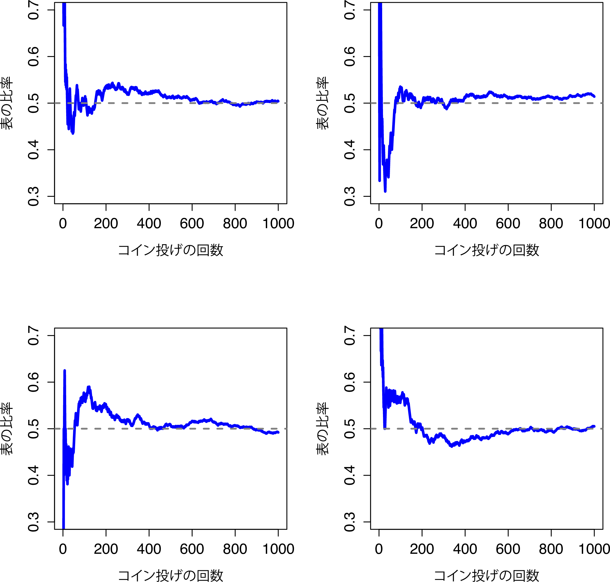
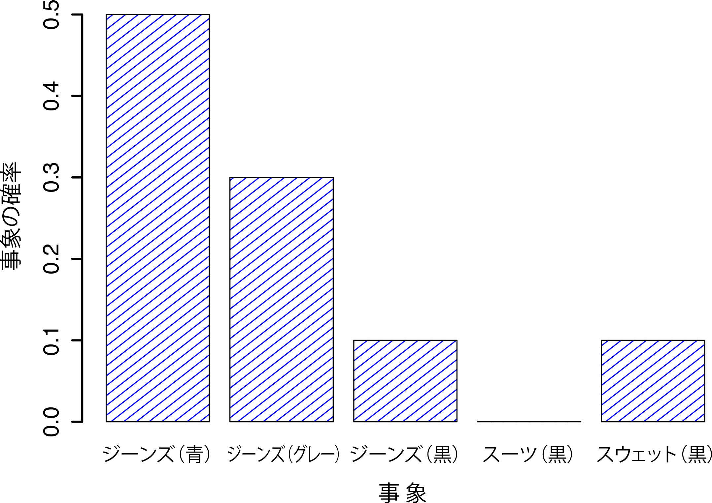
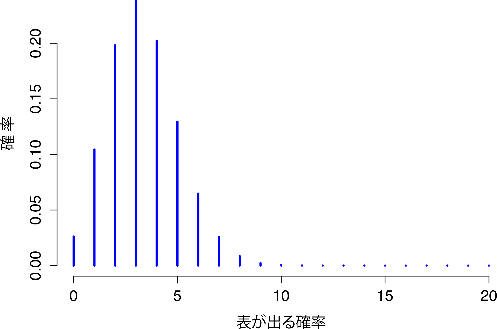
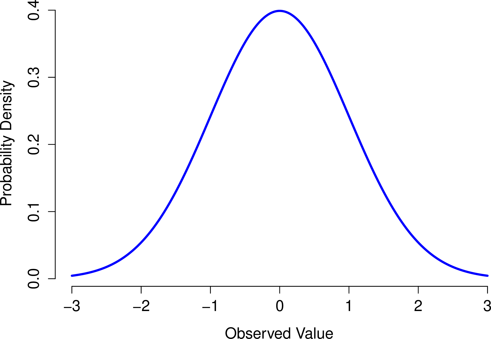
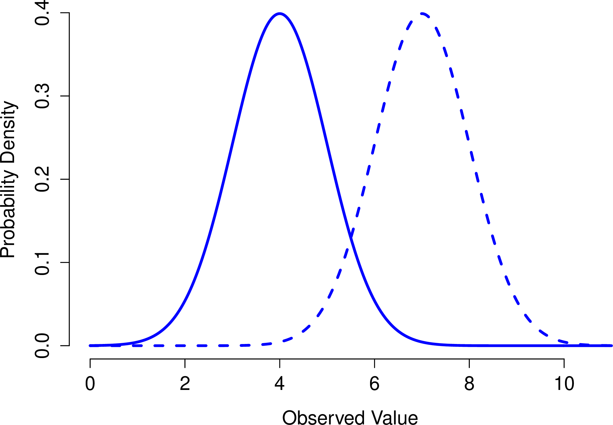
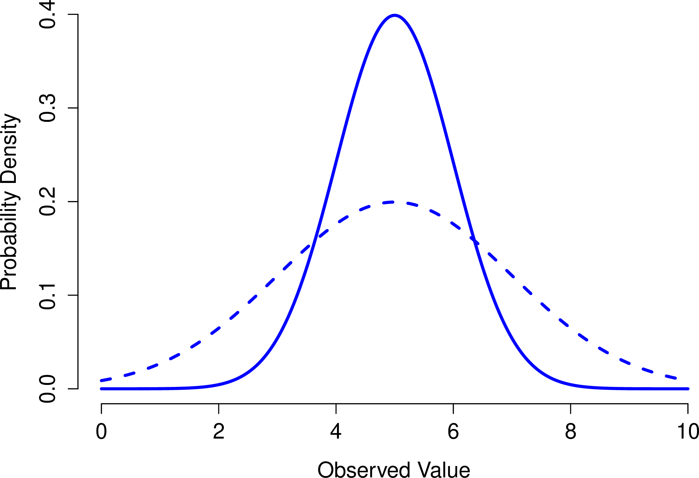
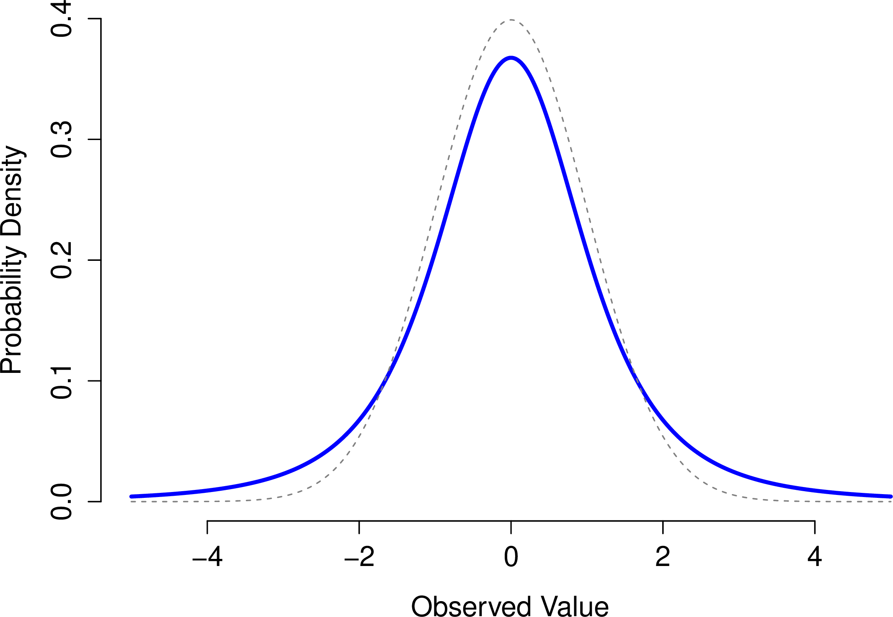
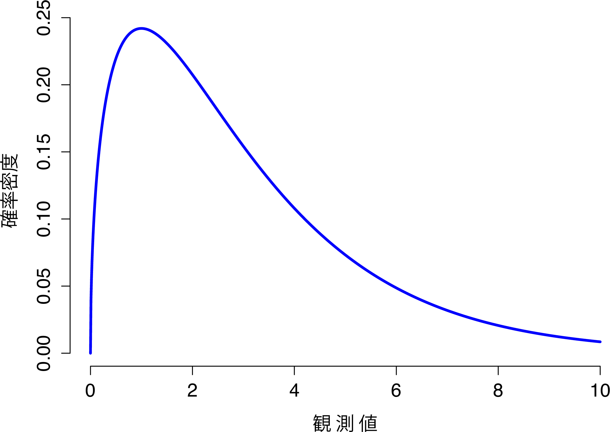
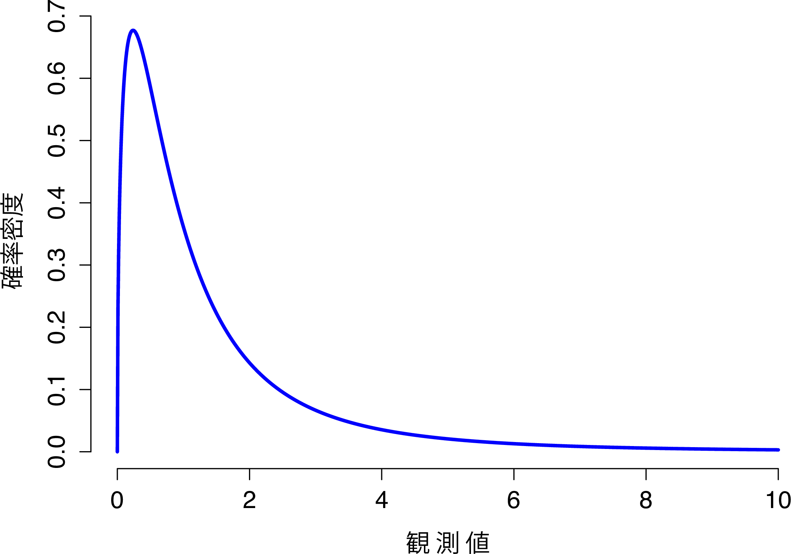

確率入門 {#ch:probability}
=================================================

> 神はわれわれに確率の薄明かりのみを与えてくださった。
>
> 　　　　　--- ジョン・ロック


ここまで，本書では実験デザインの基本的な考え方やデータの要約方法について説明してきました。そして多くの人が統計と呼ぶのはこのことです。つまり，数値を集め，平均値を求め，グラフを作り，レポートか何かに貼り付けるというのが統計です。スタンプラリーでスタンプの代わりに数値を集めているようなものですね。しかし，統計はそれだけではありません。実際，記述統計は統計のほんの一部に過ぎませんし，有用性という部分でもそれほど大したものではありません。統計のとくに有用な部分は，データについての推論が可能になるような情報を提供してくれるというところにあるのです。

統計を使うとデータから推論を引き出せるという視点から統計について考えてみると，そうした例がありとあらゆる場面にあることに気づくはずです。たとえば，シドニー・モーニング・ヘラルドの2010年10月30日の記事からの抜粋を見て見ましょう。

> 「厳しい状況ですね」予備選挙の結果，現政権が労働党政権において23%という史上最低の支持率であったことを受け，首相はそう答えた。

このような話は新聞だけでなく日常生活でもよくありますが，これについて少し詳しく考えてみましょう。世論調査は調査会社によるものであり，こうした会社にはお金があるので調査規模も大きいことが普通です。私はめんどくさがり屋なので元の調査データを探したりはしていませんが，仮にニューサウスウェールズ州でランダムに抽出された1000人を対象とした調査で，そのうち230人（23%）がオーストラリア労働党を支持すると答えたのだとしましょう。オーストラリア選挙管理委員会によれば，2010年の連邦選挙ではニューサウスウェールズ州の有権者登録は4,610,795人ということですから，この調査では残りの4,609,795人（有権者の約99.98%）の意見はわからないということになります。この調査に答えた人のうち嘘の答えをした人が誰一人いなかったとしても，私たちにとって100%確かなのは，労働党への投票数は230/4610795（約0.005%）から4610025/4610795（約99.83%）の間のどこかだということだけです。では，調査会社や新聞社，そして読者は，なぜ労働党への投票率が23%であると考えることができるのでしょうか。

その答えは明らかです。無作為に1000人を選び，そのうちの230人が労働党に投票すると答えた場合，投票者全体の中で実際に労働党に投票するのがその230人*だけ*であるという可能性は非常に低いからです。言い換えれば，私たちは，調査会社の集めたデータが人口全体の特徴をうまく表したものになっていると考えているわけです。ではどの程度うまく表されているのでしょうか。労働党の実際の得票率が24%だったとしたら驚くでしょうか。29%だったらどうでしょう。37％なら？ これくらいになると，直感的に少しおかしいと感じるようになるでしょうね。実際の得票率が24%だったとしても誰も驚かないでしょうが，37%だと誰もが驚くはずです。ただ，29%だとそんなものだといえるかどうか，微妙なところです。こうした判断をするときには，単に数字を見て推測するだけでなく，もっと強力なツールが必要です。

こうした疑問に答えるためのツールとして<span class="keyterm">推測統計</span>があります。このような疑問は科学の営みにおける中心的な部分なので，統計法や研究法の入門の授業ではこれらが授業内容の大部分を占めています。ただし，統計的推論の理論は<span class="keyterm">確率論</span>を元に構築されているので，確率論について知っておく必要があります。確率論に関する議論は，基本的には背景的な問題です。この章では統計そのものについての説明はほとんどありませんし，この章の内容については本書の他の部分ほど深く理解しておく必要はありません。ですが，確率論は統計法を支える柱ですから，ここでその基本について説明しておく価値はあるでしょう。

確率と統計の違い {#sec:probstats}
-------------------------------------------------------------------

確率論についての話に入る前に，確率と統計の関係についてすこし考えてみるのがいいでしょう。この2つの分野は非常に近いのですが，まったく同じではありません。確率論は「可能性の学問」です。これは数学の一部門で，さまざまな出来事がどれくらいの頻度で起こりうるのかということを教えてくれます。たとえば，確率論を使って答えられる問いには次のようなものがあります。

-   10回連続でコインを投げたとき，表が出る確率はどれくらいだろうか。

-   サイコロを2回振ったとき，6が2回出る確率はどれくらいだろうか。

-   しっかりシャッフルされたカードデッキからカードを5枚引いたとき，それがすべてハートである確率はどれくらいだろうか。

-   私が宝くじに当たる確率はどれくらいだろうか。

これらの質問には，すべてある共通点があるという点に注意してください。どの場合も「世界の真実」はすでにわかっていて，問いの対象となっているのは「どのような事象」が生じるのかという部分です。最初の問題では，コインは公正であるということが私には*わかっている*ので，コインを何回投げても表が出る確率はその都度50%になります。2つめの問題では，1つのサイコロを1回振ったとき，6が出る確率は1/6であることが*わかっています*。3つめの問題では，カードデッキが適切にシャッフルされていることが*わかっています*。そして4つめの問題では，宝くじには一定のルールがあるということが*わかっています*。これでおわかりでしょうか。確率に関する問いでは，世界についてのすでに明らかな<span class="keyterm">モデル</span>があり，それを使って何らかの計算をすることになるのです。しかも，元となるモデルはとても単純です。たとえば，コイン投げの例では，そのモデルを次のように表すことができます 

$$
P(\mbox{表}) = 0.5
$$

 これは「表が出る確率は0.5である」と読むことができます。後でまた説明しますが，パーセントは0%から100%までの数字であるのに対し，確率は0から1までの値をとります。この確率モデルを使って最初の問題に答えるとき，実際の結果がどうなるのかはわかりません。10回連続で表が出るかもしれませんし，3回だけかもしれません。そしてここが重要な部分です。確率論では，*モデル*は明らかですが*データ*はそうではないのです。

だからこそ確率なのです。では統計ではどうでしょうか。統計の問題はこれとはまったく反対です。統計では，世界の真実は私たちには*わかりません*。私たちの手元にあるのはデータであり，そのデータを元に世界の真実を*知る*ことが目的なのです。統計的な問いは次のようになります。

-   私の友人がコインを10回投げて10回連続で表だったのだけど，あれはいかさまなのだろうか。

-   カードデッキの上から5枚カードを引いたら全部ハートだった。このデッキはちゃんとシャッフルされているのだろうか。

-   宝くじ委員長の配偶者が宝くじに当たった場合，くじに不正があった可能性はないだろうか。

今度は，私たちの手元にあるのはデータだけです。私に*わかっている*ことは，友人がコイン投げで10回ともすべて表を出したということです。そして私が<span class="keyterm">推測</span>したいのは，私が今見た出来事（事象）が，仕掛けのないコインを10回投げたときに起こりうるものなのか，あるいは友人がいかさまをしたことを疑うべきなのかということです。私の手元にあるデータはたとえば次のようになります。

    表　表　表　表　表　表　表　表　表　表

ここで私がやりたいことは，どちらの「世界のモデル」を信じるべきかを判断するということです。もしコインに仕掛けがないのなら，私が採用するモデルは「表が出る確率は0.5である」，つまり\(P(\mbox{表}) = 0.5\)というモデルになります。もしコインに仕掛けがあるなら，表が出る確率は0.5*でない*ということになります。その場合のモデルは\(P(\mbox{表}) \neq 0.5\)と表せます。このように，統計的な推論では，いくつかの確率モデルのうちどれが正しいのかを知ることが目的になるのです。統計的な問いと確率的な問いが同じでないことは明らかですが，しかしこれらはお互いに深く関係しています。こうしたことから，統計理論の入門としてはまず，確率とは何か，確率にはどのような性質があるのかというところから始めるのが良いでしょう。

確率の意味 {#sec:probmeaning}
--------------------------------------------------

確率についてはさまざまな疑問があると思いますが，まずは最初の1つから始めましょう。それは，「確率」とは何かということです。こう聞くと驚くかもしれませんが，統計学者と数学者は，確率の*法則*については（大部分で）意見が一致するのですが，それが何を*意味*するのかという部分では意見が一致しない場合があるのです。なんだか不思議ですよね。日常では「可能性」や「きっと」，「多分」といった言葉を当たり前のように使いますし，こうした疑問に答えることはさほど難しくないように思えるのに。ですが，実生活で「きっと」や「多分」に出くわしたような場面では，なんだかスッキリしないまま会話を終えていたのではないでしょうか。このように，（日常的な概念の多くは）それが実際にどういうことであるのかを*本当*には知らないものなのです。

ですからここで説明しておきましょう。たとえば， **アルデュイノ・アーセナル**と**C・ミラン**という2つのロボットサッカーチームの試合で賭けをするとします。いろいろ考えた結果，**アルデュイノ・アーセナル**が勝つ確率は80%だと判断しました。さてこれはどういう意味でしょうか。これには3つの可能性があります。

-   これはロボットのチームなので，仮に何度も繰り返し試合をさせたとすると，**アルデュイノ・アーセナル**が平均して10回中8回で勝利するだろう。

-   **C・ミラン**に1ドル賭けた場合の配当金が5ドル（つまり，勝ちを当てた場合に自分が賭けた1ドルに加えて報酬が4ドルもらえる）で，これが**アルデュイノ・アーセナル**に4ドル賭けた場合と同じ（つまり掛け金4ドルと報酬1ドル）である場合，私はその試合に賭けてもいいと思うだろう。

-   **アルデュイノ・アーセナル**の勝利に対する私の主観的「信念」や「自信」は， **C・ミラン**の勝利に対する信念よりも4倍強い。

これらはどれももっともな判断です。ただし，完全に同じものではありませんし，統計学者のすべてがこれを支持するわけではありません。じつは，統計学には複数のイデオロギー（そうですイデオロギーです）があり，そしてどちらの立場に立つかによって，こうした説明が無意味なものになったり見当違いなものになったりする場合があるのです。このセクションでは，論文に一般的に見られる2つの主要アプローチについて簡単に説明します。もちろん，この2つのアプローチしかないわけではありませんが，とくに影響力が大きいのがこの2つです。

### 頻度主義の視点

確率に対する2つの代表的なアプローチのうちの最初の1つで，統計学において支配的な地位にあるのが<span class="keyterm">頻度主義</span>で，これは確率を<span class="keyterm">長期的頻度</span>として見なす考え方です。仕掛けのないコインを何度も繰り返し投げたとしましょう。定義では，このコインは\(P(表) = 0.5\)という確率を持ちます。どのような結果が観察されるでしょうか。1つの可能性として，最初の20回は次のようになるかもしれません。

    裏　表　表　表　表　裏　裏　表　表　表　表　裏　表　表　裏　裏　裏　裏　裏　表

このケースでは，20回中11回（55%）で表が出ました。さて，ここで最初の\(N\)回における表の数（\(N_H\)と表します）を数え続けたとします。すると各回終了後の確率は\(N_H / N\)という形で表せます。そしてその結果は次のようになりました（この値を記録するのに実際にコインを投げています）。

|                    |     |     |       |       |      |      |       |      |      |      |
|:----------------|:---:|:---:|:----:|:----:|:---:|:---:|:----:|:---:|:---:|:---:|
| 投げた回数      | 1  |  2  |  3   |  4   |  5   |  6  |  7   |  8  |  9  | 10  |
| 表の回数        | 0   | 1   | 2    | 3    | 4   | 4    | 4    | 5   | 6   | 7   |
| 比率             | .00 | .50 | .67 | .75 | .80 | .67 | .57 | .63 | .67 | .70|

|                    |     |     |       |       |      |      |       |      |      |      |
|:----------------|:---:|:---:|:----:|:----:|:---:|:---:|:----:|:---:|:---:|:---:|
| 投げた回数      | 11 | 12 |  13 | 14   | 15 | 16  | 17   | 18  | 19 | 20  |
| 表の回数        | 8   | 8   |   9  | 10   | 10 | 10  | 10   | 10  | 10 | 11  |
| 比率             | .73 | .67 | .69 | .71 | .67 | .63 | .59 | .56 | .63 | .55|

さて，最初の数回では表の*比率*が.00から.80まで上下しているという点に注意してください。その後は，その幅が収まっていき，おおよそ.50という「正しい」比率に近くなっていきます。これが頻度主義的な確率の定義についての簡潔な説明です。仕掛けのないコインを何度も繰り返して投げたとき，\(N\)が大きくなる（無限大に近づく \(N\rightarrow \infty\)）につれて表が出る確率は50%に収束します。数学的には少し厳密でない部分もあるのですが，頻度主義的な確率の定義はおおよそこのようなものです。残念ながら，私には無限にコインを投げ続ける時間はありませんし，無限に投げ続けるだけの忍耐力もありません。ですが，私にはコンピューターがあり，コンピューターはそういう単純な作業をひたすら繰り返すことが得意です。そこでコンピューターにコインを1000回投げた場合をシミュレーションさせ，その結果\(N\)がどうなったかを\(N_H / N\)という比の形にして図にしてみました。この結果がまぐれでないことを確かめるために，念のため4回実行しています。その結果，図\@ref(fig:frequentistprobability)のようになりました。見ての通り，*観察された表の比率*は最終的には変動がなくなり，一定の値に落ち着きます。そしてその落ち着いた値が，表が出る真の確率ということになります。

```{r frequentistprobability, warning=FALSE, echo=FALSE, out.width='82.4%', fig.align='center', fig.cap='頻度主義的な確率の動作原理を図にしたもの。仕掛けのないコインを何度も投げれば，観察される表の比率は次第に落ち着き，真の確率0.5に収束する。図は4回分のシミュレーションの結果。どのケースでも，コインを1000回投げた場合をシミュレーションし，表が出た比率を記録している。どの場合も最終的に0.5ちょうどにはなっていないが，この実験を継続的に繰り返せば，その結果は0.5になる「はず」である。', echo=FALSE}

```


頻度主義による確率の定義にはいくつか好ましい特徴があります。まず，客観的だということです。出来事の確率は*必然的に*世界に根差したものとなっています。確率的な記述が意味をなすのは，物理的宇宙で生じる（一連の）事象を参照している場合だけだからです^[これは，頻度主義では仮説的な記述ができないという意味ではありませんので念のため。これは単に，もしあなたが確率についての記述をしたいなら，それはその記述を観察可能な事象の反復という形や，その反復において異なる結果が生じる相対的頻度という形で再記述できなくてはならないということです。]。2つめに，あいまいさがありません。2人の人が同じ一連の結果を観察した場合，その事象の確率についての計算値は必然的に同じ値になります。

ただし，好ましくない特徴もあります。まず，無限の繰り返しというものは現実世界には存在しません。ポケットからコインを取り出して投げることを考えてみましょう。地面に落ちるたびに，コインは衝撃を受けます。その衝撃でコインはわずかにすり減ります。最終的にはコインはボロボロになってしまうでしょう。そうすると，コイン「無限に」繰り返して投げたふりをするということが本当に意味のあることなのか，客観的なことなのかと疑問に思えてきます。事象を「無限に繰り返す」ということは現実の物理的宇宙ではあり得ません。物理的宇宙に無限というものはないからです。もっと言えば，頻度主義の定義は適用できる範囲が狭いのです。日常生活場面には人間が確率を割り当てる事象はたくさんありますが，そうした事象には出来事の反復を仮説的に（あるいは理論的にすら）割り当てられないようなものもあります。たとえば，もしテレビの気象予報士が「2048年11月2日にアデレードが雨の確率は60%です」といったとして，私たちはそれをすんなり受け入れることができます。しかし，この確率は頻度主義的には明確には定義できません。アデレードという都市は1つしかありませんし，2048年の11月2日も1度しかないからです。この事象が無限に繰り返すということはあり得ず，これはたった1度しか起こり得ないのです。頻度主義的な確率論では，1度しか生じない出来事について確率的な記述をすることは*禁止*されています。頻度主義的な視点では，明日は雨が降るか降らないかのどちらかでしかあり得ません。繰り返しがない1度きりの出来事に対して「確率」ということはあり得ないのです。ただし，頻度主義にはこの問題を解決するための賢い技がいくつかあるということには触れておく必要があるでしょう。その1つとして，気象予報士の言っていることは，「『雨の確率が60%という予想の日』というカテゴリーがあり，そうした予測の日を全体として見てみると，そのうち60%は実際に雨である」という意味であるという考え方です。このような考え方はなんとも奇妙で直感に反するものですが，頻度主義的な立場にはこうした説明がよく見られます。この考え方は，本書のこの後の部分でも出てきます（セクション\@ref(sec:ci)参照）。

### ベイズ主義の視点

主観的視点と呼ばれることも多い<span class="keyterm">ベイズ主義</span>の確率論は，統計学者の間では少数派ですがここ数十年の間に着実に支持を集めつつあります。ただ，ベイズ主義にもいろいろあって，何を持って「ベイズ流の視点」とするかは難しいところがあります。その中で，主観的確率についてのもっとも一般的な考え方は，出来事の確率を「知的かつ合理的な行為者（エージェント）がある事象の真実に対して割り当てた<span class="keyterm">確信度</span>（degree of belief）である」と捉えるものです。この視点からは，確率とは世界に実在するものではなく，人間やその他の知的な動物による思考や仮定の中にだけ存在するものだということになります。

ただし，このアプローチが有効であるためには，何らかの方法で「確信度」を操作的に定義する必要があります。その方法にはさまざまなものがありますが，その1つにこれを「合理的賭博」という視点から公式化しようとする考え方があります。たとえば，私が明日は60%の確率で雨だと考えているとしましょう。そして，誰かが明日雨になるかどうかの賭けをしようと言ってきたとします。雨が降れば5ドルもらえ，雨が降らなければ5ドル没収です。私が考えている確率からすれば，これはかなり割のいい賭けだといえるでしょう。一方で，もし私が明日40%の確率で雨だと考えていたとしたら，その賭けは割に合わないものになります。つまり，「主観的確率」とは，私がその賭けを受けるかどうかという形で操作的に定義することができるというわけです。

ベイズ流のアプローチがもつ利点は何でしょうか。また，このような考え方に欠点はないのでしょうか。ベイズ流のアプローチにおける主な利点は，割り当てようと思えばどんな事象にも確率を割り当てることができるという点です。それらの事象が繰り返し起こるようなものでなくても構いません。ただし，（多くの人々にとっての）主な欠点は，それが客観的なものにはなり得ないということです。確率の特定には，確信度をもつ実体を特定しなくてはなりません。その実体は人間かもしれませんし，宇宙人やロボットかもしれません。もしかしたら統計学者かもしれません。ともあれ，何かを信じるということができるような知的な行為者がいなくてはならないのです。多くの人にとって，これはなんとも据わりの悪いものです。確率が恣意的に決められている様に思えるからです。ベイズ流のアプローチでは，関心の対象となる行為者は合理的である（つまり確率のルールに従う）必要はありますが，その信念は個人個人で違っていてもいいのです。私がこのコインには仕掛けがないと思っているからといって，他の人もそう思う必要はありませんし，それでどちらかが不合理であるということにはなりません。頻度主義の視点では，2人の観察者が同じ事象に対して異なる確率を割り当てることは許されません。そのようなことがあれば，少なくともそのうちの1人は間違っていることになります。これに対し，ベイズ流の視点ではそのようなことが起きても問題ありません。それぞれ異なった背景的知識を持つ2人の観察者が，同じ事象に対して異なる信念を持ったとしてもそれは正当なことなのです。つまり，頻度主義的な考え方は扱える範囲が狭すぎる（確率を扱う際の禁止事項が多い）のに対し，ベイズ流の考え方は逆にそれが広すぎる（観察者ごとの違いを許容しすぎる）というわけです。

### 2つの視点の違い ---正しいのはどちら？---

ここまでは2つの視点を個別に見てきましたので，今度は2つを比較してみましょう。セクションの最初にあげた仮想のロボットサッカーゲームの話に戻します。頻度主義者とベイズ主義者は，あの3つの記述に対してどのように考えるでしょうか。頻度主義者にとって，あの中でどの記述が確率の定義として適切ということになるでしょうか。ベイズ主義者ならどの記述を選ぶでしょうか。これらの記述の中に，頻度主義者やベイズ主義者にとって意味をなさないものはあるでしょうか。2つの視点を理解できていれば，これらの質問の答えは大体わかるはずです。

両者の違いを理解したとして，さて，どちらの立場が*正しい*のでしょうか。正直なところ，正しい答えというものがあるのかどうか私にはわかりません。私にわかる限りにおいて，事象の反復という頻度主義者的な考え方に数学的な間違いというのはありません。また，合理的行為者の信念というベイズ流の考え方にも数学的に間違った部分はありません。実際，ベイズ主義と頻度主義のそれぞれの考え方を詳しく見ていくと，多くの部分で一致する点もあるのです。そして，頻度主義的な方法で算出される結果は，多くの場合ベイズ流の合理的行為者が下す判断に一致します。また，ベイズ流の方法論の多くは，頻度主義的な視点から見て素晴らしい性質を持つと考えられるものだったりします。

私は基本的に現実主義者ですので，自分が信頼できる統計手法を使用することにしています。その理由については本書の終わりに説明しますが，最終的に私はベイズ流のやり方を好むようになりました。しかし，頻度主義的なやり方をまったく否定しているわけではありません。ただ，私のように寛大な考え方をする人ばかりではありません。たとえば，20世紀の統計学において傑出した人物の1人であるサー・ロナルド・フィッシャーは，ベイズ流の考え方に対する猛烈な反対者でした。フィッシャーが書いた統計の数学的基礎についての論文では，ベイズ流の確率は「脱出不可能なジャングルであり，統計という概念の精緻化を阻むものである[@Fisher1922b p. 311]」としています。また，心理学者のポール・ミールは，頻度主義的な方法に依存することは，「たくさんの乙女を夢中にさせられるかもしれないが，科学の世界に育つ子孫は残せないような，使えはするが種なしの知的道楽者」になることであると述べています[@Meehl1967 p. 114]。これで大体おわかりにように，統計の歴史というのは，何ともエンターテイメントに満ちているのです。

個人的に私はベイズ流の考え方を好みますが，統計分析の大部分は頻度主義アプローチに基づくものです。これに関して，私は現実的な考え方をしてます。本書の目標は心理学専攻における統計の授業に一般的な内容を扱うことです。そして，大部分の心理学者が使用している統計ツールについて理解するには，頻度主義的な方法をしっかり学んでおく必要があります。頻度主義的な考え方を学ぶことは，けっして無駄ではありません。最終的にベイズ流の考え方に切り替えるにしても，「伝統的な」頻度主義の視点で書かれた本は少なくとも1冊は読んでおくべきです。それに，本書ではベイズ流の考え方を完全に無視しているわけではありません。いたるところでベイズ流の考え方からコメントを加えていきますし，この問題については第\@ref(ch:bayes)章でも詳しく扱います。

確率論の基本  {#sec:basicprobability}
-----------------------------------------------------

ベイズ主義と頻度主義の間にはイデオロギーの対立はあるものの，確率が従うべきルールについては大部分で意見が一致しています。こうしたルールへの到達方法にはさまざまなものがありますが，もっともよく用いられているのは，20世紀の偉大なソビエトの数学者，アンドレイ・コルモゴロフの方法を元にしたものです。詳細には触れませんが，ここでその考え方について基本的な部分を説明しておきます。ここでは，私のズボンを例に話を進めていきたいと思います。

### 確率分布入門

私の人生における悲しいの事実の1つに，私はズボンを5本しか持っていないということがあります。ジーンズが3本と，スーツのズボンが1本，スウェットパンツが1本です。さらに悲しいことに，私はこれらのズボンに名前をつけていて，それぞれ\(X_1\)，\(X_2\)，\(X_3\)，\(X_4\)，\(X_5\)と呼んでいます。嘘ではありません。本当です。だからみんな，私のことを「ミスター想像力」と呼ぶのです。さて，ある任意の1日を選んだとすると，私はこれら5本のうち1本のズボンを履いているはずです。ズボンを1度に2本履こうとするほどバカではないですし，長年のトレーニングのおかげでズボンをはかずに外出することもなくなりましたから。もしこの状況を確率論の言葉で表現するなら，それぞれのズボン（つまり各\(X\)）は<span class="keyterm">根元事象</span>（elementary event）ということになります。根元事象の重要な性質として，私が毎回観察するたびに（たとえば私がズボンを履くたびに），その結果は可能性のある事象のうちのいずれか1つになるということがあります。先ほど説明したように，最近では私はこれらのズボンのうち必ずどれか1つだけを履きますから，この制約が満たされています。また，可能性のある事象のまとまりは<span class="keyterm">標本空間</span>（sample space）と呼ばれます。これを「ワードローブ」と呼ぶ人もいるとは思いますが，その人たちは私のズボンを確率的に考えるということを拒否しているのです。悲しいですね。

さて，この時点で私には標本空間（ワードローブ）があり，そしてそれは可能性のある複数の根元事象（ズボン）で構成されています。そして私がここでやりたいことは，これら根元事象の1つに対して<span class="keyterm">確率</span>（probability）を割り当てることです。まず，ある事象\(X\)に対して，その事象の確率は\(P(X)\)となり，この値は0から1までの範囲になります。そして，\(P(X)\)の値が大きくなればなるほど，その事象が発生しやすいということになります。たとえば\(P(X) = 0\)だったとすると，それは事象\(X\)が起こりえない（つまり私はけっしてそのズボンを履くことはない）ということになります。一方で，もし\(P(X) = 1\)だったとしたら，それは事象\(X\)の起きることが確実である（つまり私はいつもそのズボンを履く）ということになります。確率の値がこの中間にある場合，それは私がそのズボンをときどき履くということを意味します。たとえば，\(P(X) = 0.5\)であれば，それは私がそのズボンを半分の割合で履いているということです。

ここまでで確率についての説明ほぼおしまいです。ただ，最後に1つだけ認識しておいて欲しいことがあります。それは，「つねに何らかの事象が発生していなければならない」ということです。私がズボンを履くたびに，私は必ずズボンを履くことになるのです（なんだそれって感じですけどね）。このいささか陳腐な文の意味するところは，確率論において，根元事象の確率は合計が必ず1にならなければならないということなのです。これは<span class="keyterm">全確率の公式</span>（law of total probability）と呼ばれるものですが，呼び名についてはどうでもいいでしょう。大事なのは，こうした要件が満たされるとき，私たちの手元にあるものが<span class="keyterm">確率分布</span>（probability distribution）と呼ばれるものになるのです。たとえば，以下は確率分布の例です。


```{r, warning=FALSE, echo=FALSE,message=FALSE}
library(knitr)
library(kableExtra)

dt<- matrix(c('ジーンズ（青）', '\\(X_1\\)', '\\(P(X_1) = .5\\)',
                       'ジーンズ（グレー）', '\\(X_2\\)', '\\(P(X_2) = .3\\)',
                       'ジーンズ（黒）', '\\(X_3\\)', '\\(P(X_3) = .1\\)',
                       'スーツ（黒）', '\\(X_4\\)', '\\(P(X_4) = 0\\)',
                       'スウェットパンツ（黒）', '\\(X_5\\)', '\\(P(X_5) = .1\\)'
), ncol=3, byrow=T)

colnames(dt)<-c('ズボンの種類','ラベル','確率')

kable(dt, align = c('l','c','c')) %>%
  kable_styling(bootstrap_options = "striped", full_width = F)
```

この例では，すべての事象が0から1の範囲に収まる確率を持っており，これらをすべて合計するとその合計は1になります。どうですか，素晴らしいですよね。この分布を視覚化するために，図\@ref(fig:pantsprob)のような棒グラフを作成することだってできます（セクション\@ref(sec:bargraph)参照）。さて，これで私たちは皆，何かを成し遂げることができました。皆さんは確率分布とは何かということを学び，そして私はついに自分のズボンのグラフを作成する方法を見つけたのです。皆さんも私も，みんながハッピーですね。

```{r pantsprob, warning=FALSE, echo=FALSE, out.width='70.6%', fig.align='center', fig.cap='「ズボン」の確率分布を視覚的に表現したもの。ここには5つの「根元事象」（ズボン）があり，それぞれの事象には0から1までの生起確率がある。そしてこれらの確率を合計すると1になる。', echo=FALSE}

```


最後にもう1つだけ大事なことを指摘しておきます。確率論では，根元事象だけでなく<span class="keyterm">非根元事象</span>（non elementary events）についても話をすることができるのです。この概念について簡単な例を見てみましょう。先ほどのズボンの例では，私がジーンズを履く回数について言及することもできます。その場合，「ダニーがジーンズを履く」という事象は，実際に生じた根元事象がこの事象にとって適切なものであった場合に生じたことになります。具体的には，「ジーンズ（青）」，「ジーンズ（黒）」，「ジーンズ（グレー）」がそうです。数学的な用語では，この「ジーンズ」事象 \(E\) は根元事象の集合 \((X_1, X_2, X_3)\) ということになります。そしてこれらの根元事象のいずれかが生じた場合，\(E\) が生起したということになるのです。\(E\)をこのように定義すれば，\(P(E)\) の確率は非常に簡単に求めることができます。これらをすべて足せばいいのです。具体的には次のようになります。

$$
P(E) = P(X_1) + P(X_2) + P(X_3)
$$

 そして，青とグレー，黒のジーンズの確率はそれぞれ.5，.3，.1ですから，私がジーンズを履く確率は.9ということになります。

ここまで読んできて，そんなことは当たり前すぎるのではないかと思ったかもしれません。その通りです。ここでやっていることは，常識的な感覚を基本的な数式で表すことだからです。しかし，こうした単純なところからスタートして，ここから非常に強力な数学的ツールを作り出すことが可能になるのです。詳細については触れませんが，本書で扱うものについては表\@ref(tab:probrules)にまとめました。これらは，確率が満たす基本ルールのいくつかです。これらのルールは，ここまでに説明してきた単純な仮定から導き出されています。ただし，本書でこれらのルールを何かに使うということはありませんし，ここでもそうするつもりはありません。

Table: (#tab:probrules)  確率が満たすべきいくつかの基本ルール。本書で扱う分析を理解するためにこれらのルールを知っている必要はないが，確率論について詳しく知りたいなら重要となる。

  意味                       数学表現                           公式
  ----------------------- ---------------------- -------- -----------------------------------------
  \(A\)でない             \(P(\neg A)\)           \(=\)    \(1-P(A)\)
  \(A\)または\(B\)        \(P(A \cup B)\)         \(=\)    \(P(A) + P(B) - P(A \cap B)\)
  \(A\)かつ\(B\)          \(P(A \cap B)\)         \(=\)    \(P(A|B) P(B)\)
 


二項分布 {#sec:binomial}
---------------------------------------------

ご想像の通り，確率分布はさまざまな形を取り得るので，非常にさまざまな種類の分布が存在します。ただし，それらすべてが重要というわけではありません。実際，本書の内容の大部分では，二項分布，正規分布，\(t\)分布，\(\chi^2\)（カイ二乗）分布，そして\(F\)分布だけを利用しています。そこでこのセクションからは，これら5つの分布について簡単に説明していこうと思います。その中では，二項分布と正規分布については詳しめに見ていきます。さて，この5つの分布の中では二項分布がもっとも単純ですので，まずはこれから始めることにしましょう。

### 二項分布入門

確率論はゲームの勝率がどのように決まるかを説明するというところから始まっていますので，<span class="keyterm">二項分布</span>（binomial distribution）についての説明には，サイコロ投げやコイン投げの話が最適でしょう。ここで単純な「実験」を想像してみてください。私の小さな手の中には，まったく同じサイコロ（6面体）が20個握られています。それぞれのサイコロには，1つの面にドクロマークが描かれており，残りの5面には何も描かれていません。この20個のサイコロを振ったとき，ドクロマークが4つ出る確率はどれくらいでしょうか。サイコロに仕掛けがないものとすると，私たちはサイコロの各面の出る可能性が1/6であるということを知っています。別の言い方をすれば，ぞれぞれのサイコロでドクロが出る確率は約\(.167\)になります。これだけの情報がわかっていれば，さきほどの疑問に答えることができます。では，見てみましょう。

Table: (#tab:distformulas)  二項分布と正規分布の公式。本書の分析で実際にこれらの公式を使うことはありませんが，より進んだ統計の教科書を理解するにはこれらはとても重要です。そこで，文章の邪魔にならないよう，ここに表として示しておくことにしました。二項分布の式にある\(X!\)は階乗（つまり1から\(X\)までをすべて掛け合わたもの）で，正規分布の式にある「exp」は指数関数です。指数関数については第\@ref(ch:datahandling)章で説明しました。これらの式をよく理解できなくても大きな問題はありません。

|                                        二項分布                                        |                                                       正規分布                                                       |
|:--------------------------------------------------------------------------------------:|:--------------------------------------------------------------------------------------------------------------------:|
| \(P(X \ | \ \theta, N) = \displaystyle\frac{N!}{X! (N-X)!},\theta^X (1-\theta)^{N-X}\) | \(p(X \ | \ \mu,\sigma) = \displaystyle\frac{1}{\sqrt{2\pi}\sigma} \exp \left( -\frac{(X - \mu)^2}{2\sigma^2} \right)\) |


いつものように，ここでいくつかの用語と数学表記を示しておきます。まず，サイコロを振る回数は\(N\)で，これは二項分布の<span class="keyterm">サイズパラメータ</span>（size parameter）と呼ばれます。また，1つのサイコロでドクロマークが出る確率を\(\theta\)（シータ）という記号を用いて表します。これは二項分布の<span class="keyterm">成功確率</span>（success probability）と呼ばれる量です^[「成功」という用語は非常に恣意的なものである点に注意してください。これはその結果が望ましいものであるということを意味するわけではありません。もし\(\theta\)がバス事故で乗客が怪我をする確率を指している場合であっても，私はこれを成功確率と呼ぶでしょう。ですが，だからと言って私は事故で人が怪我することを望んでいるわけではありません。]。最後に，実験の結果を\(X\)という記号で表すことにします。つまりこれは，私がサイコロを振ったときに出たドクロの数です。\(X\)の実際の値は，その時その時で変化しますので，これは<span class="keyterm">ランダム変数</span>（random variable）と呼ばれます。さて，これで用語と表記がすべてそろったので，この問題についてもう少し正確に見ていくことにします。今，私たちが計算したい量は\(X = 4\)の確率で，\(\theta = .167\)かつ \(N=20\)であることがわかっています。そして，ここで計算したい値を一般的な「形」で表すと次のようになります。

$$
P(X \ | \ \theta, N)
$$

そして私たちはこの中でもとくに\(X=4\)，\(\theta = .167\)，\(N=20\)の場合に関心があるわけです。この問題に答えるには，あともう1つだけ数学表記を説明しておかなければなりません。\(\theta\)と\(N\)をパラメータとしてもつ二項分布から\(X\)が無作為に得られる場合，その表記は次のようになります。

$$
X \sim \mbox{B}(\theta, N)
$$

はいはい，そうですね。みなさん，表記，表記，表記の狂気でうっきっきーだと思っているはずです。この話に一体何の意味があるのでしょう。数学表記を知りたくて本書を読んでいる人はほとんどいないはずですから，話を先に進めて二項分布の使い方とかを説明するべきですよね。そこで，二項分布の公式は表\@ref(tab:distformulas)に示しました。読者の中にはこの式と戯れたい人もいるでしょうが，そんなことには興味のない人もいるでしょう。本書ではこの公式そのものは必要ありませんし，私もこれ以上詳しくこれについて話をするつもりはありません。そのかわり，二項分布がどのようなものかをここで示しておこうとおもいます。

図\@ref(fig:binomial1)には，サイコロ実験における考え得るすべての\(X\)，つまり\(X=0\)（ドクロなし）から\(X=20\)（全部ドクロ）までについての二項確率を示しました。これは基本的に棒グラフで，図\@ref(fig:pantsprob)に示した「ズボン確率」と何ら変わるところはありません。横軸は可能性のあるすべての事象で，縦軸はそれぞれの事象の確率です。この図では，20回中4回でドクロが出る確率はおよそ0.20（このすぐ後に説明しますが，より正確には0.2022036です）です。別の言い方をすれば，この実験を繰り返し行えば，その事象は20%位の確率で生じるということになります。

```{r binomial1, warning=FALSE, echo=FALSE, out.width='70.6%', fig.align='center', fig.cap='サイズパラメータN=20で成功確率θ=1/6の場合の二項分布。それぞれの縦棒は，それぞれの結果（つまりあるXの値）になる確率。これは確率分布なので，それぞれの確率は0から1までの値である必要があり，棒の高さの合計は1になる必要がある。', echo=FALSE}

```

\(\theta\)と\(N\)の値を変えると二項分布がどうなるかという感覚をつかんでもらうために，サイコロを転がす代わりにコインを投げたとしましょう。今度は，仕掛けのないコインを繰り返し何度も投げます，そして表が出る確率に関心があるとします。この場合，成功確率\(\theta = 1/2\)になります。そして，コインを\(N=20\)回投げたとしましょう。この例の場合，成功確率は変わりましたが実験の回数は同じです。二項分布はどのようになるでしょうか。図\@ref(fig:binomial2)の(a)に見られるように，全体的な分布の形が横にずれています。これは予測通りでしょう。では，もしコインを\(N=100\)回投げたらどうなるでしょうか。その場合の結果が\@ref(fig:binomial2)の(b)です。分布は大体中央に集まっていますが，起こりうる結果はより広い幅に広がっています。

```{r binomial2, warning=FALSE, message=FALSE,echo=FALSE, out.width='82.4%', fig.align='center', fig.cap='コインを投げた場合（成功確率θ=1/2）の2通りの二項分布。(a)はコインをN=20回投げた場合，(b)はコインをN=100回投げた場合。'}

require(magick); require(ggplot2); require(ggplotify); require(cowplot)

p1<-as.grob(image_read("img/probability/binomHeads20.png"))
p2<-as.grob(image_read("img/probability/binomHeads100.png"))

plot_grid(p1,p2, labels=c("(a)", "(b)"),ncol=2,scale=.9,label_size=12)

```


正規分布 {#sec:normal}
-----------------------------------------
```{r normdist, warning=FALSE, echo=FALSE, out.width='70.6%', fig.align='center', fig.cap='平均値μ=0で標準偏差σ=1の正規分布。横軸はある変数の値に対応し，縦軸はその値がどの程度観測されやすいかに関する情報。ただし，縦軸は「確率」ではなく「確率密度」になっている点に注意。連続分布には少しやっかいな性質があるため，縦軸はやや奇妙なことになる。そのため，この曲線の高さはあるxの値が観測される確率にはなっていない。ただし，曲線の高さから，どのxの値が生じやすいか（もっとも可能性が高いか）ということはわかる（その厄介な特徴の詳細についてはセクション\ref{sec:density}を参照）。', echo=FALSE}

```


二項分布は概念的にも理解しやすい分布ですが，一番重要というほどではありません。もっとも重要と言えるのは，<span class="keyterm">正規分布</span>（normal distribution）でしょう。この分布は，「釣鐘曲線」（bell curve）や「ガウス分布」（Gaussian distribution）などとも呼ばれます。正規分布は，分布の平均値である\(\mu\) と標準偏差である\(\sigma\)という2つのパラメータで記述されます。

変数\(X\)が正規分布するとき，その数学表記は次のようになります。

$$
X \sim \mbox{N}(\mu,\sigma)
$$

もちろん，これは単なる表記法に過ぎませんので，これだけでは正規分布それ自身について興味深い情報は何も得られません。二項分布の場合と同様に，本書には正規分布の公式を示してあります。統計法を学ぶ人は，少なくとも1度はこれを見ておくことが重要だと思うからです。ただ，これは入門テキストですので，これについて詳しく扱うことはしません。そのため，式は表\@ref(tab:distformulas)の中に突っ込んであります。

さて，数学な部分ではなく，変数が正規分布するということがどういう意味かを考えてみましょう。そのために，平均値\(\mu = 0\)，標準偏差\(\sigma = 1\)の正規分布を示した図\@ref(fig:normdist)を見てください。なぜ「釣鐘曲線」というのかはこれで明らかですね。見たまんまです。二項分布を示した図とは異なり，図\@ref(fig:normdist)の正規分布の図は「ヒストグラム」のような棒の並んだ形ではなく，滑らかな曲線になっています。これは恣意的なものではなく，二項分布が離散型なのに対して正規分布が連続的だからなのです。たとえば，先ほどのサイコロの例では，ドクロマークが3個や4個ということはあり得ても，3.9個ということはあり得ません。二項分布の図では，この点が反映されていたのです。たとえば図\@ref(fig:binomial1)では，\(X=3\)の箇所と\(X=4\)の箇所にはグラフの棒がありますが，その間には棒はありません。しかし，連続量にはこうした制約はありません。たとえば，天気について話しているとしましょう。心地よい春の気温は，23度や24度のこともあれば，23.9度ということもあり得ますし，その間のいかなる数値もとることができます。温度は連続変数だからです。だから，正規分布は春の気温を記述するのにはとても適していそうです^[実際には，正規分布はとても便利なので，変数が実際には連続量でないような場面でも正規分布が使用される傾向があります。十分なカテゴリーがある場合（リカート尺度の質問紙など）には，その近似値として正規分布を使用するということはかなり一般的に行われています。このようなやり方は，実際の場面ではあなたが思うよりもずっとうまく作用するのです。]。

これらを念頭に，正規分布の仕組みについてできるだけ直感的に理解できるように見ていくことにします。まず，この分布のパラメータを変化させたときにどのようなことが起こるかみてみましょう。そのために，図\@ref(fig:normmean)には標準偏差が同じで平均値が異なる正規分布を示しました。ご想像の通り，これらの分布はどちらも同じ「幅」です。この2つのグラフの違いは，左または右にずれているということだけです。それ以外の点ではまったく同じなのです。対照的に，平均値を一定にして標準偏差を増加させると，分布のピークは同じ場所にありますが，分布の幅が変化します（図\@ref(fig:normsd)）。なお，分布の幅が広くなるとピークの高さは低くなるという点にも注意してください。これはそうなるべきなのです。なぜなら，離散的な二項分布では棒の高さの*合計*が1になる必要があるのと同様に，この*曲線の下の面積*も1にならなければならないからです。話を先に進める前に，正規分布の重要な特徴を1つ指摘しておきます。それは，平均値や標準偏差の大きさに関わらず，全体の68.3%の領域が平均値から標準偏差1つ分の範囲に収まるということです。同様に，平均値から標準偏差2つ分の範囲には95.4%，標準偏差3つ分の範囲には99.7％が収まります。この考え方を示したのが図\@ref(fig:sdnorm)です。

```{r normmean, warning=FALSE, echo=FALSE, out.width='70.6%', fig.align='center', fig.cap='正規分布の平均値を変化させたときの様子。実線は平均値μ=4の正規分布で破線は平均値μ=7の正規分布。どちらの場合も標準偏差はσ=1。2つの分布は同じ形状であるが，当然のことながら破線直線よりも右側に移動する。', echo=FALSE}

```

```{r normsd, warning=FALSE, echo=FALSE, out.width='70.6%', fig.align='center', fig.cap='正規分布の標準偏差を変化させたときの様子。 この図に示されている2つの分布は，どちらも平均値はμ=5で，標準偏差が異なる。実線は標準偏差σ=1の分布で，破線は標準偏差σ=2の分布。両方の分布は同じ場所に「中心」があるが，破線の曲線は実線のものよりも広がっている。', echo=FALSE}

```

```{r sdnorm, warning=FALSE, echo=FALSE, out.width='82.4%', fig.align='center', fig.cap='曲線の下の面積は，観測値が特定の範囲内に収まる確率を示す。実線は、平均μ=0で標準偏差σ=1の正規分布。斜線で示した領域は，2つの重要なケースでの「曲線の下にある領域」。(a)は，観測値が平均値の1標準偏差以内に収まる確率で，これは68.3％。(b)は観測値が平均の2標準偏差以内に収まる確率で，こちらは95.4％。', echo=FALSE}
require(magick); require(ggplot2); require(ggplotify); require(cowplot)

p1<-as.grob(image_read("img/probability/normArea1SD.png"))
p2<-as.grob(image_read("img/probability/normArea2SD.png"))

plot_grid(p1,p2, labels=c("(a)", "(b)"),ncol=2,scale=.9,label_size=12)
```


```{r sdnorm2, warning=FALSE, echo=FALSE, out.width='82.4%', fig.align='center', fig.cap='「曲線の下の領域」についての別の2つの例。観測値が平均値から標準偏差1つ分下より小さな範囲に収まる確率(a)は15.9％，平均値とそこから標準偏差1つ分下の範囲との間にある確率(b)は34.1％。この2つを足し合わせると15.9％+34.1%=50％)になる。つまり，正規分布データの場合に観測値が平均値を下回る確率は50％。もちろん，平均を上回る確率も50％になる。', echo=FALSE}

require(magick); require(ggplot2); require(ggplotify); require(cowplot)

p1<-as.grob(image_read("img/probability/normAreaOther1.png"))
p2<-as.grob(image_read("img/probability/normAreaOther2.png"))

plot_grid(p1,p2, labels=c("(a)", "(b)"),ncol=2,scale=.9,label_size=12)

```

### 確率密度{#sec:density}

先ほどの正規分布の話では，私はあることをずっと隠そうとしてきました。入門用テキストでは，それが完全に省略されている場合もあります。そうしてもいいのかもしれません。私が隠そうとしている「それ」とは，ひねくれていると言わざるを得ないような統計学の基準をもってしても，奇妙で直感に反するものなのです。幸いなことに，基本的な統計を行う分にはそれについて深く理解する必要はありません。それは基礎を終えてもう少し進んだ段階になってから重要になり始めるものだからです。ですから，完璧にはわからなかったとしても，心配しすぎる必要はありません。ですが，その要点はつかめるようにしてください。

ここまでの正規分布の議論では，1つ2つひっかかる部分がありました。たとえば，図の縦軸は「密度」ではなく「確率密度」になっていましたね。また，正規分布の式では，\(P(X)\)でなく\(p(X)\)になっていたことに気づいた人もいるかもしれません。

じつを言うと，ここに示されているものは確率ではありません。実際はそれとは異なるものが示されているのです。それが何かを理解するためには，\(X\)が連続変数であるということがどういう*意味*であるのかについてじっくり考えてみる必要があります。たとえば，外の気温について話しているとしましょう。温度計によれば気温は23度ですが，それが本当に正確な値ではないということを私は知っています。それは*ぴったり*23度ではないのです。だから，もしかしたら23.1度だったりするのではないかと私は密かに思うわけです。しかし，それが本当に正しい値ではないということも私は知っています。それは23.09度かもしれないのです。しかし，それが……。さて，これでお分かりでしょう。純粋に連続的な量の場合，あなたはけっしてその正確な値を知ることはできないのです。

確率を考えるうえでこれがどういう意味を持つのかを考えてみましょう。明日の最高気温が平均値23度，標準偏差1度の正規分布から取られたと仮定します。その温度が23度*ぴったり*である可能性はいくつだと思うでしょうか。答えは「ゼロ」もしくは限りなくゼロに近い，ゼロとみなしてよいような値となるのです。それはなぜでしょうか。これは，究極に小さなダーツの的を狙って矢を投げているようなものだからです。いくら腕が良くてもけっしてその的に命中することはありません。実際の世界では，23度ぴったりの値にはけっしてなりません。それはつねに，23.1度や22.99998度のような値になるのです。つまり，温度がぴったり23度である確率というものについて話をすることは，まったく意味がないことなのです。しかし，日常の言葉では，もし私が外の気温は23度だと言ったとして，実際には22.9998度だったとしても，私が嘘つき呼ばわりされることはないでしょう。なぜなら，日常の会話では，「23度」というのは通常「22.5度と23.5度の間のどこか」を意味するからです。そして，温度がぴったり23度である確率を問うことは意味がありませんが，温度が22.5度と23.5度の間にある確率や，20度と30度の間にある確率など，温度がある範囲にある確率を問うことは無意味ではありません。

ここで重要な点は，連続量の分布について話すときに，ある特定の値の確率について話すことには意味がないということです。その代わり，値が特定の範囲にある確率については話をすることが*できる*のです。特定の範囲にある確率を知るには，「曲線の下の面積」を計算する必要があります。この考え方についてはすでに触れてきました。図\@ref(fig:sdnorm)では，色のついた領域に本当の意味での確率が示されています（たとえば，図\@ref(fig:sdnorm)の(a)は，観察される値が平均値から標準偏差1つ分の範囲に入る確率を示しています）。

さて，これでストーリーの一部が解明されました。連続量の確率分布がどのように解釈されるべきか（すなわち曲線の下の面積が重要である）ということについて簡単に説明しましたが，では，私が先ほど説明した\(p(x)\) の式は実際のところ何を意味しているのでしょうか。\(p(x)\)が確率を記述したものでないということは明らかです。ではこれは一体何なのでしょうか。この\(p(x)\)という量は<span class="keyterm">確率密度</span>（probability density）と呼ばれるもので，図に示された曲線の*高さ*を表すのです。確率密度それ自体にはあまり意味はありませんが，これはその曲線の下の*面積*がつねに確率として解釈可能なものになるよう*仕込まれて*いるのです。さて，今ここで知っておくべきこととしてはこれくらいで十分でしょう^[微積分が少しわかるという人には，もう少し正確な形で説明することもできます。確率はマイナスの値になることがなく，合計すると1になります。これと同じように，確率密度もマイナスの値になることはなく，（\(X\)の考えうるすべての値に対して積分をした場合）その積分値が1になります。そして，\(X\)が\(a\)と\(b\)の間にある確率を計算するには，対応する区間について密度関数を定積分すればよいのです。つまり\(\int_a^b p(x) \ dx\)です。もし微積分は忘れた，あるいは習ったことがないなら，これについては忘れてください。本書を読むうえでは必要ありませんので。]。

その他の便利な分布 {#sec:otherdists}
-------------------------------------------------

正規分布は統計でもっとも多く利用される分布で（その理由はこの後すぐ説明します），二項分布も様々な目的で便利な分布です。しかし統計の世界には無数の確率分布があり，本書ではこの後そのうちのいくつかに遭遇することになります。具体的に言うと，本書では\(t\)分布，\(\chi^2\)分布，\(F\)分布の3つが出てきます。それらの公式は示しませんし，詳細についても触れませんが，図だけは示しておきましょう。

-   <span class="keyterm">\(t\)分布</span>は連続分布で，見た目は正規分布に非常によく似ています（図\@ref(fig:tdist)）。ただし，\(t\)分布の「<ruby>裾<rt>すそ</rt></ruby>」は正規分布よりも「重い」（これはより広い範囲に広がっているという意味です）という点に注意してください。ここがこの2つの重要な相違点です。この分布は，データが正規分布になっていると考えられるけれども，その平均値や標準偏差がわからないという状況でよく用いられます。この分布については第\@ref(ch:ttest)章で再度取りあげます。

```{r tdist, warning=FALSE, echo=FALSE, out.width='58.8%', fig.align='center', fig.cap='自由度が3のt分布（実線）。正規分布に似ているが，まったく同じものではない。比較のために，標準正規分布を点線で示してある。', echo=FALSE}

```

-   <span class="keyterm">\(\chi^2\)分布</span>もまた，さまざまな場面で登場する分布です。本書でこの分布を使うのはカテゴリーデータの分析（第\@ref(ch:chisquare)章）のところですが，これはこの分布が用いられるさまざまな場面の1つにすぎません。数学的に掘り下げてみると（皆さんこういうの大好きですよね？），\(\chi^2\)分布がいたるところに登場する主な理由がわかります。仮にあなたが正規分布する変数を山ほど持っていたとしたら，その値を2乗して合計する（このようにして求められたものを「2乗和（平方和）」と言います）と，その合計値の分布が\(\chi^2\)分布になるのです。この事実が便利な場面というのがいかに多いかには驚かされることになるでしょう。ともかく，\(\chi^2\)分布は図\@ref(fig:chisqdist)のような形をしています。


```{r chisqdist, warning=FALSE, echo=FALSE, out.width='58.8%', fig.align='center', fig.cap='自由度が3のχ^2^分布。観測値はつねにゼロより大きくなければならず，分布がかなり歪んだ形になっている点に注意。それらの点はカイ2乗分布における重要な特徴である。', echo=FALSE}

```

-   <span class="keyterm">\(F\)分布</span>は\(\chi^2\)分布に少し似ています。そしてこれは，2つの\(\chi^2\)分布を比較する必要がある場合に用いられるのです。まあ，正気な人でそんなことをしたいと思う人がいるとは到底思えないかもしれませんが，実際のデータ分析場面ではこれはとても重要です。\(\chi^2\)分布は「2乗和」を用いる際に重要な分布だと言いました。ということはつまり，2つの「2乗和」を比べたい場合には\(F\)分布が関係している可能性が高いということなのです。ここまでのところ2乗和を含む例についてはまだ何も取りあげていませんが，それについては第\@ref(ch:anova)章で扱います。そして，まさにそこで\(F\)分布に遭遇することになります。この分布の形は図\@ref(fig:Fdist)の通りです。

```{r Fdist, warning=FALSE, echo=FALSE, out.width='58.8%', fig.align='center', fig.cap='自由度3と5のF分布。形はカイ2乗分布と似ているが，まったく同じではない。', echo=FALSE}

```

さて，それではこのセクションをおしまいにしましょう， ここでは，\(\chi^2\)，\(t\)，\(F\)の3つの分布について見てきました。これらはどれも連続分布で，どれも正規分布と密接に関係しています。本書の目的にとって重要なのは，これらの分布がすべて互いに深く関係しており，そして正規分布とも関連しているという，基本的な部分を理解しておくことです。本章のこの後の部分では，正規分布しているデータや，少なくとも正規分布が仮定されるデータを扱います。今ここで理解しておいて欲しいことは，もしあなたのデータが正規分布していることが仮定されるなら，データ分析において\(\chi^2\)や\(t\)，\(F\)といった分布がそこら中に現れても驚いてはいけないということです。

要約
-------

本章では確率について説明しました。確率の意味について説明し，そしてなぜ統計学者の間にその意味についての意見の一致がないのかを説明しました。また，本章では確率が従う必要のあるルールについても説明しました。そして確率分布という考え方を導入し，そして章の大部分で，統計においてとくに重要な確率分布を取り上げました。セクションごとの内容は次の通りです。

-   確率と統計（セクション\@ref(sec:probstats)）

-   確率に対する頻度主義とベイズ主義の視点（セクション\@ref(sec:probmeaning)）

-   確率の基礎（セクション\@ref(sec:basicprobability)）

-   二項分布（セクション\@ref(sec:binomial)），正規分布（セクション\@ref(sec:normal)），その他の分布（セクション\@ref(sec:otherdists)）

ご想像の通り，本書ですべての範囲が網羅されているわけではありません。確率論はそれ自体が数学の中でも大きな部門の1つで，統計への応用やデータ分析への応用とはまったく別の話です。そのため，確率論を扱う書籍は数千と存在し，大学でも確率論だけを扱った授業が複数あるのが一般的です。一般的な確率分布について立証するという「単純な」作業ですら，非常に大きなトピックなのです。本章では5つの確率分布を取り上げましたが，私の書棚には全45章からなる「統計分布」という書籍があり[@Evans2000]，そこにはこれを*はるかに*超える数の分布が説明されています。幸いなことに，そのほとんどはみなさんには必要ないものです。実際にデータ分析をする場面でも，数十という統計分布を知る必要がある可能性はまずないでしょう。それに，本書でそれらについて説明して欲しいとは思わないはずです。ただ，分布は他にもあるということだけは，知っておいて損はないでしょう。

上の内容とも重なりますが，本章は全体としては余談のようなものでもあります。学部の心理統計の授業の大半は，ここに取りあげた内容についてはほんの一瞬でさわりだけで終えてしまいます（私の授業もそうです）。そして，より上級のクラスでは，このような基本的な土台部分について振り返ることを「忘れて」しまっています。大部分の心理学者は確率と確率密度の違いを知りませんし，最近までは，ベイズ流の確率論と頻度主義の違いにすら気づいていませんでした。しかし，応用に入る前にこれらのことを理解しておくことは重要だと私は思います。たとえば，統計的推論において何が「許される」のかについてはたくさんのルールがありますが，それらはどれも恣意的で奇妙なものに思えることでしょう。ですが，ベイズ主義と頻度主義の違いというものを理解していれば，それらが意味を成し始めるのです。同様に，第\@ref(ch:ttest)章では\(t\)検定と呼ばれるものについて話をすることになりますが，この\(t\)検定の仕組みについて本当に理解したいなら，\(t\)分布が実際にどのようなものなのかを知っておくことはとても役に立ちます。何が言いたいのか，これでお分りいただけたでしょうか。