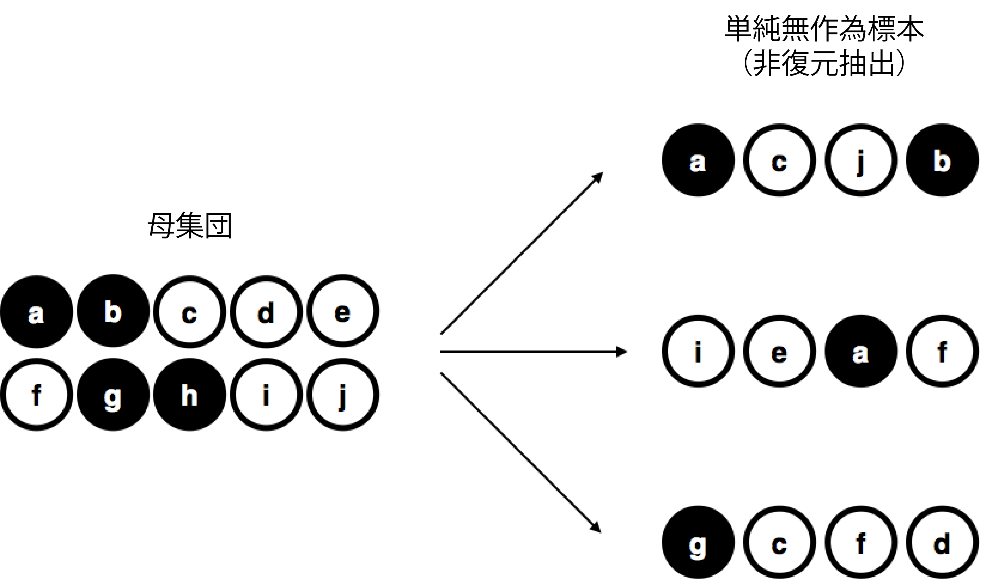
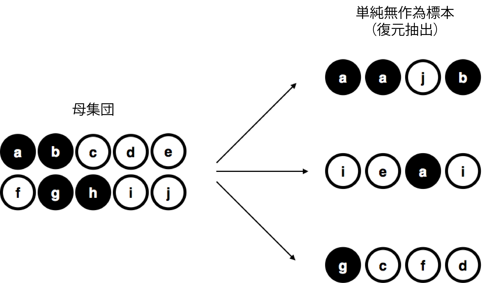
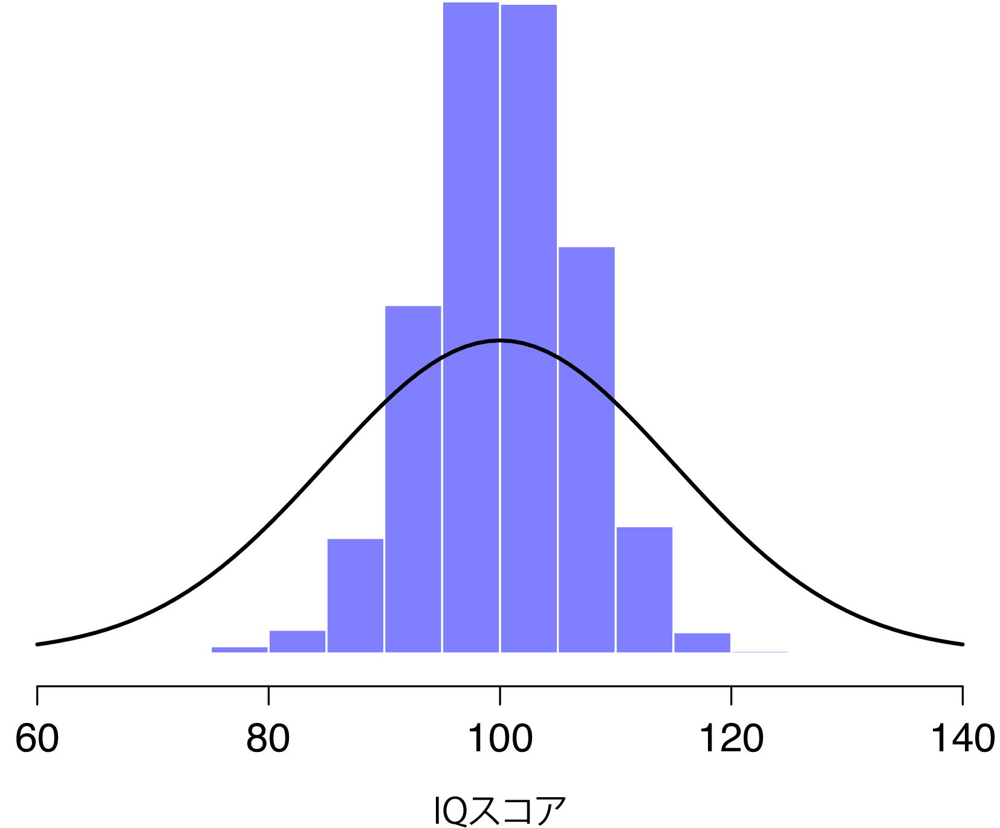
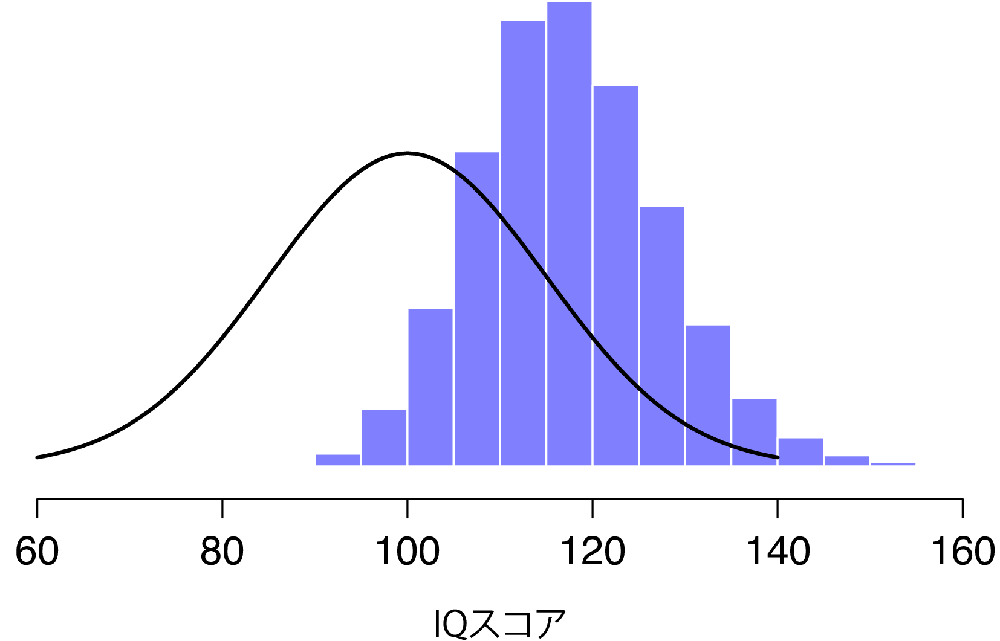
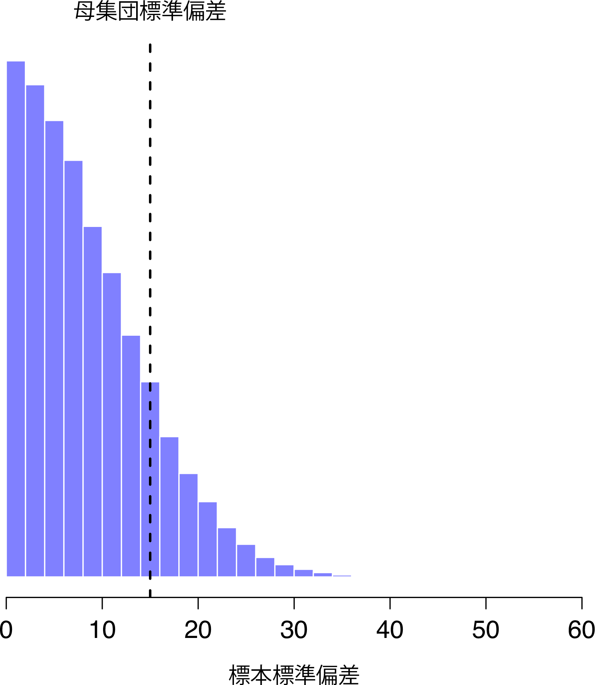

標本からの未知量の推定 {#ch:estimation}
================================================================

前章の冒頭では，*記述統計*と*推測統計*の主な違いについて強調しました。第\@ref(ch:descriptives)章でも説明したように，記述統計の役割は私たちが*すでに*知っていることをコンパクトに要約することにあります。推測統計の目的はこれとは対照的に「すでにわかっていることからまだわからないことを知る」ところにあります。皆さんはつい先ほど確率論の基礎を学んだところですし，今が統計的推論の考え方について学ぶにはちょうどいいタイミングだといえるでしょう。さて，私たちが知りたいこととは一体何なのでしょうか。そしてそれはどうすれば知ることができるのでしょうか。これらは推測統計における中心的な疑問であり，これらの疑問については伝統的に「推定」と「仮説検定」という2つの「大枠」で考えられてきました。本章の目標はこの2つのうちの1つめである推定の考え方について，その基礎を学ぶことにあります。ただし，まずは標本理論について少しスペースを割いて説明することにしましょう。なぜなら，標本についての理解が十分でなければ推定理論は意味をなさないからです。そこで本章の内容は大きく2つに分かれることになります。1つめはセクション\@ref(sec:srs)から\@ref(sec:samplesandclt)にかけての部分で，ここでは標本理論を中心的に扱います。そして2つめはセクション\@ref(sec:pointestimates)と\@ref(sec:ci)で，そこでは標本理論を応用しながら，統計学者が推定というものをどのように考えているのかについて説明することにします。

標本，母集団と標本抽出 {#sec:srs}
-------------------------------------------------

第4部への序章では，帰納の謎と呼ばれる話を取りあげ，何かを知るためには*必ず*仮定が必要であるということを強調しました。これが正しいとすると，まずはデータというものについてかなり一般的なわかりやすい仮定を行うことが必要になります。そしてここで<span class="keyterm">標本理論</span>の登場です。確率論がすべての統計理論にとっての土台であるとするならば，標本理論は家を建てる際の枠組みに相当するものと言えます。標本理論は，統計的推論においてどのような仮定を使用すべきかを特定するうえで非常に大きな役割を担います。つまり，統計学的なやり方で「推論する」方法について説明するためには，（標本）*から*推論を導き出すということや，（母集団）に*ついて*推論するということがどういうことであるのかについて，もっとはっきりさせておく必要があるのです。

ほとんどすべての場合，私たち研究者の手元にあるのはデータの<span class="keyterm">標本</span>（サンプル）です。私たちは何人もの参加者を相手に実験を行ったりしますし，調査会社は何人もの人々に電話で選挙での投票先について質問したりしますが，それによって得られるデータというのは有限であり，不完全なものです。世界中のすべての人を対象に実験するなどということは不可能ですし，調査会社にも全国民に電話して調査できるだけの時間やお金はありません。記述統計（第\@ref(ch:descriptives)章）における議論では，この標本だけが私たちの関心の対象でした。そこでの目的は，その標本について記述したり，それを要約したり，図で示したりすることだったわけです。しかし，ここから先はそうではありません。

### 母集団の定義 {#sec:pop}

標本というのは具体的なものです。データファイルを開けば，そこには標本データがあります。しかし<span class="keyterm">母集団</span>はずっと抽象的な考え方です。母集団は，あなたが結論を導きたい人々全体，あるいは考え得る観察データ全体のことを指し，一般的には標本よりも*はるかに*大きなものです。理想的には，研究者は関心がある対象の母集団を明確にしたうえで研究を始めます。なぜなら，研究デザインやデータに対する仮説検定は，どのような母集団について記述したいのかによって決まるからです。

場合によっては，関心の対象となる母集団が簡単に定義できることもあります。たとえば，章の最初に取りあげた「調査会社」の例では，母集団はその研究時点で登録されている数百万人という選挙人全員ということになります。そして標本はその母集団に属する1000人の人々です。ところが，多くの研究では話はそれほど単純ではありません。典型的な心理学実験では，関心対象の母集団を決めることはもう少し複雑になります。たとえば私が学部生100人を対象に何らかの実験を行ったとします。認知科学者としての私の目標は，心の仕組みについて何らかの知見を得ることです。では，この場合の「母集団」とは以下のうちどれでしょうか。

-   アデレード大学の心理学専攻生全員

-   世界中の心理学専攻生全員

-   現在オーストラリアに住んでいる人

-   この標本と同年代のオーストラリア人

-   今生きている人全員

-   現在，過去，未来におけるすべての人類

-   十分な知的能力を備えた地球上のすべての生物

-   全知的生命体

これらは，どれも心の働きを持つ実体についての定義であり，どれも認知心理学者にとって関心の対象になり得ます。つまり，どれが関心対象の真の母集団であるかがまったくはっきりしないのです。これとは別の例として，序章で取りあげたウェルズリー対クロカーのゲームで考えてみましょう。ここでの標本は，ウェルズリーが12勝0敗であったという結果です。ではその母集団は以下のうちどれでしょうか。

-   ウェルズリーとクロカーが目的地に到着するまでの全結果

-   ウェルズリーとクロカーが残りの人生でプレーしたゲームの全結果

-   ウェルズリーとクロカーが永遠に生きたとして，2人がすべての丘を制覇するまでに行ったゲームの全結果

-   平行宇宙を無限に作成したとして，そのそれぞれの宇宙でウェルズリーとクロカーの二人が同じ12の丘を越えるまでに行ったゲームの全結果

ここでも，その母集団が何であるのか明白ではありません。

### 単純無作為標本

母集団をどう定義するかにかかわらず，大事なのは標本が母集団の下位集団であるということ，そして私たちの目標は標本についての知識から母集団の特性について推論することであるということです。そして標本と母集団の関係は，標本がどのように抽出されたのかという*手続き*によって変化します。この手続きは，<span class="keyterm">標本抽出法</span>（sampling method）と呼ばれます。そして，これがなぜ重要なのかについはしっかり理解しておかなければなりません。

話を簡単にするために，ここにチップが10枚入った袋があるとしましょう。それぞれのチップには異なる文字が印刷されており，10枚のチップはすべて見分けることができます。また，チップには黒と白の2色があります。このチップ全体が関心のある母集団です。これを図にすると図\@ref(fig:srs1)の左のようになります。


```{r srs1, warning=FALSE, echo=FALSE, out.width='62.9%', fig.align='center', fig.cap='有限母集団から復元抽出した単純無作為標本', echo=FALSE}

```


この図からわかるように，チップ全体のうち4枚が黒で6枚が白です。ただし，現実世界においては，こうしたことは袋の中を見ない限りわかりません。さてここで，この袋を振り，目を閉じて袋の中からチップを4枚取り出すという実験を行ったとしましょう。このとき，取り出したチップは袋の中に戻さないものとします。そして，1枚目が\(a\)のチップ（黒），次が\(c\)のチップ（白），そして\(j\)（白），最後が\(b\)（黒）という結果になりました。必要なら，これらのチップをすべて袋の中に戻し，もう一度実験を繰り返しても構いません。その結果が図\@ref(fig:srs1)の右側です。繰り返しのたびに，方法はまったく同一でも結果はそれぞれ異なります。同じ手順を何度も繰り返したときにそれぞれ異なる結果になることから，このような手続きは*無作為*（ランダム）であると呼ばれます^[無作為性についての数学的定義はかなり専門的なものです。それは本書の範囲を遙かに超えていますので，ここではあまり厳密にならないことにします。そこで本書では，毎回繰り返すごとに結果が変わるようなものを無作為性があるものとして扱うことにします。]。また，チップを取り出す前に袋を振っていることから，それぞれのチップが選択される確率は等しいと考えるのが妥当でしょう。このように，母集団に含まれる各要素の選択確率がすべて同じという条件で抽出された標本は<span class="keyterm">単純無作為標本</span>と呼ばれます。また，この例ではチップを1枚取り出した後にそれを元に戻すことは*していない*ので，同じチップが2回取り出されることはあり得ません。このような場合，観察データが<span class="keyterm">非復元</span>抽出されたといいます。

標本抽出手続きの重要性を理解するために，別の実験の例を考えてみましょう。私の5歳になる息子が袋を開け，黒チップを4つの取り出すとします。このとき，一度取り出したチップを袋の中に戻すことはしません。この*偏った*標本抽出のケースを図\@ref(fig:brs)に示しました。さて，ここで結果として得られたのは4枚の黒チップで，白は1枚もありません。これはどう見ても標本抽出方法の違いによるものですよね。そしてもし黒チップだけを選ぶという方法で標本抽出が行われていたのだとしたら，標本のすべてが黒チップだったという結果から母集団について何かを知るということはできなくなります。こうした理由から，統計学者は標本が単純無作為抽出されていると考えることを好むのです。なぜなら，その方がデータ分析が*ずっと*簡単になるからです。

```{r brs, warning=FALSE, echo=FALSE, out.width='62.9%', fig.align='center', fig.cap='有限母集団から非復元抽出した偏りのある標本。', echo=FALSE}
knitr::include_graphics("img/estimation/brs.png")
```

もう1つ別の方法についても言及しておく価値があるでしょう。今度も目を閉じて袋を振り，チップを1枚取り出します。ただし，今度はその結果を記録して，そしてそのチップを袋に戻します。そしてまた目を閉じて袋を振り，チップを1枚取り出すのです。そしてこの方法を4回繰り返しました。このような方法で得られたデータセットは無作為標本ではあるのですが，今回はチップを取り出すごとに毎回袋に戻すという，<span class="keyterm">復元抽出</span>と呼ばる方法が用いられています。図\@ref(fig:srs2)に示したように，この方法では母集団に含まれる同じ要素が複数回観察される場合があるという点が最初の方法とは異なります。

```{r srs2, warning=FALSE, echo=FALSE, out.width='62.9%', fig.align='center', fig.cap='有限母集団から復元抽出した単純無作為標本', echo=FALSE}

```

私の経験では，大抵の心理学実験は非復元標本抽出を行っています。なぜなら，同じ人物が同じ実験に何度も参加することを認めていないからです。ただ，統計理論の多くでは，データが*復元*抽出された単純無作為標本であることが前提になっているのです。実際の場面でこれが問題になることはめったにありません。関心の対象となる母集団が十分大きい（なんとわずかに10以上の）場合には，復元抽出と非復元抽出の違いは無視できるほど小さなものになるからです。しかし，単純無作為標本と偏りのある標本間の違いは，無視できるほど小さなものではありません。

### 大半の標本は単純無作為標本に非ず

先ほど母集団として考えられるものを一覧にして示したように，ほとんどの場合には関心のある母集団から単純無作為標本を得るということはほぼ不可能です。私が実験を実施するとき，その実験の参加者がアデレード大学心理学専攻生の無作為標本であったとしたら，それはちょっとした奇跡です。たとえ「アデレード大学心理学専攻生」というような比較的小さな母集団であったとしてもです。標本抽出法の詳細については本書の範囲を超えていますが，どのようなものがあるのかについての大まかな感覚をお伝えするために，ここで主な手法のいくつかをあげておきます。

-   **層化抽出法**　あなたの母集団が複数の下位母集団，ないしは*層*に分かれている（または分けられる）場合というのを考えてみます。たとえば，複数の地点で研究を実施するような場合です。この場合には，母集団全体から無作為に標本抽出しようとするのではなく，それぞれの層から個別に無作為抽出することになるでしょう。母集団がはっきりといくつかの層に分かれている場合には，単純無作為抽出よりも層化抽出を用いた方が簡単です。また，とくに下位母集団の中に希少な集団が含まれているような場合には，単純無作為抽出よりも層化抽出の方が効率的です。たとえば統合失調症についての研究を行う場合，母集団を2つの層（統合失調症ありとなし）^[世の中は何事も単純ではありません。「統合失調症」の人と「統合失調症でない人」というような単純な区分は実際には不可能です。しかしこれは臨床心理学の教科書ではありませんし，こうした単純化については大目に見て欲しいと思います。]に分け，そこからそれぞれ同じ人数だけ標本抽出したほうがよいでしょう。もし完全に無作為に対象者を選択したとしたら，標本の中で統合失調症を患っている人の数が非常に少なくなり，研究が無意味になってしまう可能性があるからです。このような層化抽出の方法は*オーバーサンプリング*（過剰標本化）と呼ばれています。なぜなら，小規模な集団を過剰に代表させる形で標本抽出が行われているからです。

-   **雪だるま式抽出法**（機縁法）　これは，接触の困難な母集団や「隠れている」母集団を対象とする場合にとくに便利な手法です。こうしたケースは，社会科学ではよくあることなのです。たとえば，トランスジェンダーの人々に対して意識調査を実施したいとします。その場合，研究チームにはごく少数のトランスジェンダーの人の連絡先しかわからないかもしれません。そうすると，調査はまずそれらの人に研究参加を呼びかけるところから始まります（ステージ1）。そして調査終了時に，参加者に対して他に参加してくれそうな人の連絡先を教えて欲しいとお願いするのです。ステージ2では，そこで得られた新しい連絡先が調査対象になります。このようにして十分な量のデータが得られるまでこの手続きが繰り返されます。雪だるま式抽出法の大きな利点は，そうでもしないと得られないようなデータを得られるところにあります。ただし，統計的な部分では，標本の無作為性が非常に低いということが大きな短所としてあげられます。しかも，これに対処するのは困難です。また実際問題として，この手続きはかなり注意しないと非倫理的なものになりかねないという短所があります。隠れている母集団というのは，たいていの場合，理由があって隠れているものだからです。ここで例としてトランスジェンダーの人々を取りあげたのは，そうした問題を強調するためでもありました。注意を怠れば，表に出たくない人々を（しかも最悪の形で）無理やり表に引きずり出してしまうことになりかねません。仮にそうしたミスは犯さなかったとしても，社会的繋がりを利用してこうした人々の研究を行うことは，かなり立ち入ったものになりかねません。そもそも人々に連絡を取る*前に*同意を得るということは非常に困難ですし，しかも多くの場合，それらの人々に連絡して「あなたたちのことを研究したいのですが」というのは，それだけで相手を傷つける可能性もあります。人と人の繋がりというは複雑なものですから，データを得るための方法としてそれを使えるからといって，必ずしもそうすべきとは限らないのです。

-   **<ruby>恣意<rt>しい</rt></ruby>的抽出法**　名前からだいたい想像がつくと思います。この方法では，標本は研究者にとって都合のいいやり方で抽出され，関心対象となる母集団から無作為に選択されるわけではありません。雪だるま式抽出法も恣意的抽出法の1つで，それ以外にも様々なものがあります。よくある例としてあげられるのが，心理学専攻の学生を対象とした心理学実験です。このような標本は，2つの点で無作為ではありません。1つめに，心理学専攻の学生だけを用いているわけですから，そこから得られるデータは必然的に特定の下位母集団に限られることになります。2つ目に，学生たちはどの研究に参加するかを自分で選ぶことができるのが普通なので，この標本は心理学専攻の学生という下位母集団から無作為に抽出されたものではなく，自主的に参加していることになるわけです。実際の場面においては，大半の研究が何らかの形でこうした恣意的な標本抽出を行っています。恣意的抽出は場合によっては重大な制限につながる可能性もありますが，つねに問題になるわけというわけではありません。

### 単純無作為でない標本はどの程度問題か

さて，実際のデータ収集においては，データがきれいな単純無作為になっていないというのはよくあることです。これは問題なのでしょうか。少し考えるだけでも，単純無作為でないデータが問題になる*場合がある*のがわかるはずです。たとえば図\@ref(fig:srs1)と図\@ref(fig:brs)の違いがそうですね。ただし，単純無作為でないということはそこまで大きな問題ではありません。標本の偏り方によってはまったく問題でない場合もあるのです。たとえば層化抽出を行ったとしましょう。その場合，あなたはデータにどのような偏りがあるかについて知っていることになります。なぜなら，その偏りは研究の効率性を高める目的で意図的にそうしたものだからです。そしてその場合，その偏りを調整するための統計手法があります（ただし，それについては本書では扱いません）。つまり，このような場合には問題にならないのです。

より一般的な話として，無作為抽出というのはある目的のためにとられる手法の1つに過ぎず，それ自体が目的ではないということを忘れてはいけません。あなたの標本が恣意的に抽出されたものだとしましょう。つまり，そこには偏りがあると考えられます。しかし，標本抽出法におけるそうした偏りは，それが誤った結論につながる場合にのみ問題となるのです。何が言いたいかというと，そうした視点から見た場合，「すべての」側面において無作為な標本を得る必要はないということなのです。関心となる心理学的現象に関して無作為になっていればそれで良いのです。たとえば作業記憶についての研究をするとしましょう。研究1では，現在地球上にいる人類全体から無作為に標本抽出することができました。ただし，月曜生まれの人だけが対象です。研究2では，オーストラリア人の母集団から無作為に標本抽出することができました。私は自分の研究結果を人類全体に一般化したいと考えています。さて，どちらの研究がより好ましいでしょうか。その答えが研究1であることは明らかです。それはなぜでしょうか。それは，「月曜生まれ」であることが作業記憶の能力に対して意味のある影響を持つとは考えられないからです。対照的に，「オーストラリア人」がなぜ問題なのかについてもいくつか理由をあげることができます。オーストラリアは豊かな国で，十分に進んだ教育システムを持つ先進国です。そうした教育システムの中で育ってきた人は，作業記憶のテストを作成した人々と似たような人生経験をしてきている可能性が高くなります。こうした共通の体験が，「テストを受ける」とはどういうことか，心理学実験とはどのようなものかといったことについて，類似の信念や共通の仮定を形成する可能性があるのです。そしてこれらのことが実際に問題になる場合というのもあり得ます。たとえば，その「受験」スタイルの影響で，オーストラリア人は抽象的なテスト問題に対する注意の向け方というのを身につけているかもしれませんし，他の環境で育った人とはこの点で異なっているかもしれません。そうすると，オーストラリア人の結果を基に一般化した場合，作業記憶能力に対する誤ったイメージにつながる可能性というのもあり得るわけです。

この議論には重要なポイントが2つあります。まず1つめは，研究をデザインする場合，どの母集団に関心があるのかをよく考え，その母集団を適切に抽出する方法についてもよく考えなければならないということです。実際には，「標本の恣意性」（心理学の教員は心理学専攻の学生を標本としてよく使いますが、それはそれが一番安価にデータを集められる方法だからです。研究資金は限られていますからね）を受け入れざるを得ない場合がほとんどでしょう。しかしその場合にも，そうした方法が持つ危険性について少し考えてみる必要があります。2つ目に，もし他人の研究に対し，標本に恣意性があって人間全体という母集団から無作為抽出されていないと批判するならば，少なくともそれによって結果がどのように歪むと考えられるのかについて具体的に示すのが筋だということです。

### 母集団パラメータと標本統計量

無作為標本の抽出に関する方法論上のやっかいな問題はひとまず置いておいて，こんどは少し違う問題について考えてみましょう。ここまで，母集団について私たちは科学者的な視点から話をしてきました。心理学者にとっては，母集団は人間の集団です。生態学者にとっては，母集団はもしかしたらクマかもしれません。このように多くの場合，科学者にとって関心のある母集団は具体的なもので，現実世界に存在するものです。しかし，統計学者はちょっと変わった人々です。一方では，科学者たちと同じく実際世界のデータや科学に関心を持っています。しかしその一方で，数学者のように純粋な抽象世界を相手にしていたりもするのです。その結果，統計理論における母集団の定義はやや抽象的なものになりがちです。心理学の研究者が抽象的な理論的構成概念を具体的な測定尺度という形で操作的に定義するのと同様に（セクション\@ref(sec:measurement)），統計学者は「母集団」という概念を彼らにとって馴染み深い数学的対象として操作的に定義します。じつは皆さんは，ここまでのところですでにそのような数学的対象に遭遇しています。第\@ref(ch:probability)章で取りあげた確率分布がそれなのです。

この考え方はとてもシンプルです。たとえばIQスコアで考えてみましょう。心理学者にとって，関心のある母集団はIQスコアをもつ人間という集団です。統計学者は，その母集団を図\@ref(fig:IQdist)の(a)に示したような確率分布として操作的に定義することで「簡略化」します。知能検査は，IQスコアの平均値が100，標準偏差が15になるように設計されており，そしてIQスコアは正規分布します。これらの値は母集団全体の特徴を表すものであることから，<span class="keyterm">母集団パラメータ</span>と呼ばれます^[訳注：母集団パラメータのことを「母数」と呼びます。世の中には分母や総数の意味で「母数」という人が大勢いますが，それは統計学的には誤りです。]。つまり，母集団の平均値\(\mu\)は100で母集団の標準偏差\(\sigma\)は15です。

```{r IQdist, warning=FALSE, echo=FALSE, message=FALSE,out.width='82.4%', fig.align='center', fig.height=2.5, fig.cap='IQスコアの母集団分布(a)とそこから無作為抽出された2つの標本。図の(b)は100個の観測値を含む標本で(c)は10,000個の観測値を含む標本。'}

require(ggplot2); require(ggplotify); require(cowplot)

p1<-ggdraw()+draw_image("img/estimation/IQpopulation.png",y=-.1)
p2<-ggdraw()+draw_image("img/estimation/IQsample100.png",y=-.1)
p3<-ggdraw()+draw_image("img/estimation/IQsample10000.png",y=-.1)

plot_grid(p1,p2, p3,labels=c("(a)", "(b)", "(c)"),ncol=3,scale=.99,label_size=12)

```


さて，ここである実験を行なったとします。無作為に100人を選び，IQテストを実施するという方法で，母集団から単純無作為標本を得ました。その結果として得られた標本は次のようになっているかもしれません。

```{block2, type='rblock1'}
106 101 98 80 74 ... 107 72 100
```

これらのIQスコアは，平均値100で標準偏差15の正規分布から標本抽出されたものです。この標本のヒストグラムを作図すれば，図\@ref(fig:IQdist)の(b)に示したようなものになるでしょう。見ての通り，このヒストグラムは「大まか」にはそのような形をしていますが，図\@ref(fig:IQdist)の(a)に示した真の母集団分布に対してかなり荒削りな近似になっています。この標本の平均値を計算すると，母集団の平均値である100に近い値は得られても，ぴったり100にはなりません。実際に計算してみると，私が得た標本のIQスコアの平均値は98.5で，標準偏差は15.9でした。<span class="keyterm">標本統計量</span>は私の手元にあるデータセットの特徴であって，これは母集団の値にかなり近いものではあるのですが，完全に同じではないのです。一般に，手元のデータセットから計算できる値は標本統計量で，あなたが本当に知りたい値は母集団パラメータということになります。母集団パラメータの推定方法（セクション\@ref(sec:pointestimates)）やその推定値の信頼度（セクション\@ref(sec:ci)）については後ほど本章で説明しますが，その前にあともう少しだけ，標本理論について知っておきべき内容を説明しておきたいと思います。

大数の法則 {#sec:lawlargenumbers}
----------------------------------------------------

先ほどのセクションでは，標本サイズ\(N=100\)の仮想IQテストの結果についてお話ししました。そこでは，母集団の平均値が100であるのに対し，標本の平均値は98.5で，結果はかなり妥当な近似値と言えるものでした。多くの科学的研究では，この程度の正確さがあれば十分問題ないものと言えますが，場合によってはこれ以上の正確さが必要なこともあります。標本統計量がもっと母集団パラメータに近い値でなければならないような場合，どうすれば良いのでしょうか。

その答えは明白で，それはもっとたくさんのデータを集めるということです。そこでもっと大規模な実験を行ったとしましょう。今度は10,000人を対象にIQテストを実施しました。この実験の結果を<span class="jamovi">jamovi</span>でシミュレーションしてみましょう。[<span class="filename">IQsim.omv</span>](data/IQSim.omv)が<span class="jamovi">jamovi</span>のデータファイルです。このファイルには，平均値100で標準偏差15の母集団から無作為に抽出した値10,000件がデータとして記録されています。実際にはこれは，<span class="rtext">= NORM(100,15)</span>という関数で計算した結果を新たな変数として作成したものです。ヒストグラムや密度プロットを見てみれば，この大規模な標本の方が小さな標本よりも母集団分布に近似していることがわかります。そしてこれは，標本統計量にも反映されています。大規模な標本におけるIQスコアの平均値は99.68で，標準偏差は14.90でした。これらの値は，母集団の真の値に非常に近くなっています（図\@ref(fig:iqsim)）。

```{r iqsim, warning=FALSE, echo=FALSE, out.width='82.4%', fig.align='center', fig.cap='<span class="jamovi">jamovi</span>で正規分布から無作為抽出された標本', echo=FALSE}
knitr::include_graphics("img/estimation/IQsim.png")
```

こんなことを言うのはちょっとばかばかしい感じもするのですが，ここでの重要ポイントは，一般的に大規模な標本はよりよい情報を与えてくれるということです。なぜばかばかしく感じたかというと，そんなことは言われるまでもなく明白なことだからです。実際，これはあまりに当たり前のことなで，確率論の創始者の一人であるヤコブ・ベルヌーイが1713年にこの考えを数学的に証明した際，彼はこれをある意味馬鹿にしていました。こんなことは言われなくてもわかっているということを，彼は次のように述べています。

> どんなに愚かな男も，自然な直感により，誰にも教わらず自分の力で（これは驚くべきことである），数多く観察すればするほど目的の値からそれる危険が小さくなるということは知っているものだ[@Stigler1986 p65 参照]。

さて，この文はいささか人を見下したような感じがしますね（それに性差別的であることはいうまでもありません）。ですが，言っていることは正しいのです。たくさんデータがあるほど良い結果になるというのは当たり前のことに感じられます。では，なぜそうなのでしょうか。実際のところ，私たちが共有するこの直感は正しいものであり，そして統計学者はこれを<span class="keyterm">大数の法則</span>と呼んでいます。大数の法則は数学的な法則で，他の多くの標本統計量にあてはまるものですが，これについて考えるうえでもっとも単純なのは平均値です。標本の平均値は，データを平らに<ruby>均<rt>なら</rt></ruby>す（だから平均値というわけです）ことで算出される，もっともわかりやすい統計量ですので，これを例に見てみることにしましょう。大数の法則を標本の平均値に適用すると，標本サイズが大きくなればなるほど標本の平均値は母集団の平均値に近づいていくということになります。もう少し正確に言えば，標本サイズが無限大に「近づく」ならば（これは\(N \rightarrow \infty\)と表記します），標本の平均値は母集団の平均値に近づく（\(\overline{X} \rightarrow \mu\)）のです^[厳密には，大数の法則は独立した量の平均値として記述できるすべての統計量に関係しています。標本の平均値に大数の法則があてはまることは間違いありません。しかし，それ以外の多くの標本統計量においてもこれがあてはまるのです。たとえば，標本の分散は，ある種の平均値として書き表すことができるので，大数の法則があてはまります。しかし，標本の最小値は何かの平均値として書き表すことができないため，大数の法則はあてはまりません。]。

ここではこの大数の法則が正しいことを証明するというようなことはしませんが，これは統計理論においてとくに重要なツールの1つです。大数の法則は，たくさんのデータを集めれば最終的には真実にたどり着けるという，私たちの信念を正当化するのに使えるものなのです。いかなるデータセットにおいても，そこから算出される標本統計量は正しくない可能性があるわけですが，大数の法則により，もしデータを無限に集め続けることができたとすれば，その標本統計量は真の母数パラメータに近づいていく傾向にあるのです。

標本分布と中心極限定理 {#sec:samplesandclt}
------------------------------------------------------------------------------

大数の法則は非常に強力なツールですが，それだけですべての疑問に答えられるわけではありません。そもそも，この法則が私たちに与えてくれるのは「長期的な保証」でしかないのです。長期的に見て，もし私たちが何らかの方法で無限量のデータを集めることができたとすれば，大数の法則によって私たちの標本統計量が正しいということは保証されます。しかし，現実世界において長期的な保証は役に立たないというのは，経済学者ジョン・メイナード・ケインズの議論でも有名です。

> 長期的な結果というのは現状を見誤らせるものだ。長期的に見れば，われわれは皆死んでしまっているのだから。もし激しい嵐の中，経済学者に言えることが「嵐が過ぎ去れば海は再び平穏を取り戻す」ということだけだったとすれば，経済学者の仕事というのはあまりに簡単で，かつ無駄だということになる[@Keynes1923 p. 80]。

これは経済学者だけでなく，心理学者や統計学者にとっても同じです。標本の平均値の計算において，*最終的に*正しい答えにたどり着くだろうということがわかっているだけでは不十分なのです。無限大のデータセットから母集団の平均値を正確に知ることができたとしても，手元にある*実際の*データセットの標本サイズが\(N=100\)だったとしたら何の慰めにもなりません。だから実際問題として，それよりずっと控えめなサイズのデータセットで計算される標本の平均値がどのように振る舞うのかを知っておかなければならないのです。

### 平均値の標本分布 {#sec:samplingdists}

以上のことから，ここでは標本サイズ10,000などという研究のことは忘れましょう。その代わり，もっと小さな標本サイズの実験について考えてみます。今度は，\(N=5\)の人々を対象にIQスコアを測定することにします。先ほどと同様に，この実験は<span class="rtext">= NORM(100,15)</span>関数を使って<span class="jamovi">jamovi</span>でシミュレーションすることができます。ただし，今回は参加者IDは10,000も必要なく，5で十分です。<span class="jamovi">jamovi</span>でシミュレーションしたところ，次の結果になりました。

```{block2, type='rblock1'}
90 82 94 99 110
```

この標本におけるIQスコアの平均値は95です。驚くまでもなく，この平均値は先ほどの実験ほど正確な値ではありません。さて，ここで私がこの実験を<span class="keyterm">再現</span>（追試）したとしましょう。つまり，可能な限り先ほどと同じ手続きを使いて，新たに5人分のIQを標本として無作為抽出するのです。再び，<span class="jamovi">jamovi</span>でその手続きによる結果をシミュレーションしたところ，以下の5つの値が得られました。

```{block2, type='rblock1'}
78 88 111 111 117
```

今度は，この標本のIQスコアの平均値は101になりました。この実験を10回繰り返したとしたら，表\@ref(tab:replications)のような結果を得ることになります。そしてこれを見ればわかるように，標本の平均値は繰り返しのたびに毎回違う値になります。

```{r replications,  warning=FALSE, echo=FALSE, message=FALSE}
library(knitr)
library(kableExtra)

dt<- matrix(c(
' 90 ',' 82 ',' 94 ',' 99 ',' 110 ',' 95.0 ',' 78 ',' 88 ',' 111 ',' 111 ',' 117 ',' 101.0 ','  111 ',' 122 ',' 91 ',' 98 ',' 86 ',' 101.6 ',' 98 ',' 96 ',' 119 ',' 99 ',' 107 ',' 103.8  ',' 105 ',' 113 ',' 103 ',' 103 ',' 98 ',' 104.4 ',' 81 ',' 89 ',' 93 ',' 85 ',' 114 ',' 92.4  ',' 100 ',' 93 ',' 108 ',' 98 ',' 133 ',' 106.4 ','   107 ',' 100 ',' 105 ',' 117 ',' 85 ',' 102.8 ','  86 ',' 119 ',' 108 ',' 73 ',' 116 ',' 100.4  ',' 95 ',' 126 ',' 112 ',' 120 ',' 76 ',' 105.8 '
), ncol=6, byrow=T)

dtf<-as.data.frame(dt)
colnames(dtf)<-c('対象者1','対象者2','対象者3','対象者4','対象者5','標本平均値')
rownames(dtf)<-c('1回目', '2回目', '3回目', '4回目', '5回目', '6回目', '7回目', '8回目', '9回目', '10回目')

kable(dtf, align = c('r','r','r','r','r','r'), caption='尺度水準と連続・離散の区別の関係。チェックマークがついている部分は，そこにあてはまる変数のタイプが存在することを示す。') %>%
  kable_styling(bootstrap_options = "striped", full_width = F)
```

さて，このような形で「5人のIQスコア」を測定するという実験を何度も繰り返すとしましょう。そして繰り返しのたびに標本の平均値を記録していきます。これをしばらく繰り返せば，毎回の結果を観測値とするデータセットができあがります。最初の10回分の観察結果は表\@ref(tab:replications)の通りですから，私のデータセットは次のようになります。

```{block2, type='rblock1'}
95.0 101.0 101.6 103.8 104.4 ...
```

もしこれを10,000回繰り返し，そしてその結果をヒストグラムにしたらどうなるでしょうか。実際にやってみた結果を図\@ref(fig:sampdistmean)に示してあります。この図が示すように，5人のIQスコアの平均値は，ほとんどの場合90から110の間に収まります。何より重要なのは，こうした実験を何度も繰り返せば，最終的にこのような標本平均値の*分布*が得られるということです。統計学では，この分布には<span class="keyterm">平均値の標本分布</span>という特別な名前がつけられています。

標本分布は統計学における重要な理論的概念の1つで，小規模標本の振る舞いを理解するうえで非常に重要なものです。たとえば，私が1番最初の「5人のIQスコア実験」を行ったとき，標本の平均値は95でした。しかし図\@ref(fig:sampdistmean)の標本分布からわかるように，「5人のIQスコア実験」の結果はあまり正確ではありません。ですが，もしこの実験を繰り返したとしたら，標本の平均値は80から120の間の値になるということがこの標本分布から期待できます。

```{r sampdistmean, warning=FALSE, echo=FALSE, out.width='41.2%', fig.align='center', fig.cap='「5人のIQスコア実験」の平均値の標本分布。無作為に抽出した5人の「平均」IQスコアを計算すれば，IQ120を超えるものや80未満の者がたくさんいたとしても，ほとんどの場合，その結果は80から120の間の値となる。黒い線で示したのは母集団におけるIQスコアの分布。', echo=FALSE}

```

### 標本分布はすべての標本統計量に存在する

標本分布について覚えておいて欲しいことは，*いかなる*標本統計量にも標本分布があるということです。たとえば，この「5人のIQスコア実験」を繰り返すたびに各回のIQスコアの最大値を記録したとしましょう。その場合のデータセットはこのような形になります。

```{block2, type='rblock1'}
110 117 122 119 113 ... 
```

これを何度も繰り返すと，先ほどとはだいぶ異なる標本分布が得られます。名づけて*最大値の標本分布*です。5人のIQスコアの最大値の標本分布は図\@ref(fig:sampdistmax)に示しました。驚くまでもなく，5人を無作為に抽出し，その中でもっともIQの高い人を選んだとしたら，その人たちは平均以上のIQを持っていることになるのです。そしてほとんどの場合，その人たちのIQスコアは100から140の範囲に入ることになります。

```{r sampdistmax, warning=FALSE, echo=FALSE, out.width='47.1%', fig.align='center', fig.cap='「5人のIQスコア実験」における**最大値**の標本分布。無作為に選んだ5人のIQスコアの最大値を求めれば，その結果はほとんどの場合100から140になる。', echo=FALSE}

```


### 中心極限定理 {#sec:clt}

ここまでで，標本分布がどのようなものか，とくに平均値の標本分布がどのようなものかについての感覚を十分につかんでいただけたのではないかと思います。そこでこのセクションでは，平均値の標本分布が標本サイズによって変化するということについて説明したいと思います。これがどのようになるのかについては，皆さんは部分的にもうその答えを知っています。もし観測値がわずかしかないなら，標本の平均値は非常に不正確になる可能性があります。小規模な実験を何度も繰り返して平均値を計算し直したとすると，その都度大きく異なった答えになることでしょう。つまり，標本分布は非常に大きくなります。そしてもし大規模な実験を繰り返し，標本の平均値を計算したとしたら，平均値はおそらく毎回同じような値になることでしょう。つまり，標本分布は非常に小さくなります。これを視覚的に示したのが図\@ref(fig:IQsamp)で，標本サイズが大きいほど標本分布が小さく（狭く）なることがわかります。これは，標本分布の標準偏差という形で，数値で表すこともできます。そしてこの値は<span class="keyterm">標準誤差</span>（standard error）と呼ばれています。統計量の標準誤差はしばしば「SE」と表記されます。また，ほとんどの場合は*平均値*の標準誤差が対象となるので，SEM（standard error of mean）という略語で表されることもよくあります。先ほど図で見たように，標本サイズ\(N\)が大きくなるほど，標準誤差は小さくなります。

```{r IQsamp,  warning=FALSE, echo=FALSE, message=FALSE,out.width='82.4%', fig.align='center', fig.height=2.5, fig.cap='平均値の標本分布が標本サイズによりどう変化するかを示したもの。IQデータセットを10,000標本生成し，各データセットの平均IQスコアを算出した。図のヒストグラムは，それぞれの平均値の分布（平均値の標本分布）を示す。いずれのデータセットも，IQスコアは黒の実線で示した平均値100で標準偏差15の正規分布から抽出されている。図(a)では，各データセットには1つの観測値しか含まれていないため，各標本の平均値は1人のIQスコアにすぎない。結果として，平均値の標本分布は母集団のIQスコア分布と同じになる。しかし標本サイズを2にすると，各標本の平均値は1人のIQスコアの場合よりも母集団の平均値に近くなる傾向にあり，ヒストグラム（標本分布）は母集団の分布よりも狭い幅に集まる。標本サイズを10（図の(c)）にすると，標本の平均値の分布は母集団の真の平均値の周辺に密集する傾向にあることがわかる。', echo=FALSE}

require(ggplot2); require(ggplotify); require(cowplot)

p1<-ggdraw()+draw_image("img/estimation/samplingDist1.png")
p2<-ggdraw()+draw_image("img/estimation/samplingDist2.png")
p3<-ggdraw()+draw_image("img/estimation/samplingDist3.png")

plot_grid(p1,p2, p3,labels=c("(a)", "(b)", "(c)"),ncol=3,label_size=12)
```


さて，これで基本的な部分についての説明は終わりです。ただし，ここまでのところでまだ触れていないことがあります。ここまでの例はどれも「IQスコア実験」を扱っていました。IQスコアは大体正規分布するので，母集団分布が正規分布の場合の例として取りあげてきたわけです。では，正規分布でなかったら平均値の標本分布はどのようになるでしょうか。なんと，元の母集団分布がどのような形であるかに関係なく，\(N\)が増加するにつれて平均値の標本分布は正規分布に近づいていくのです。これを感覚的に理解するために，あるシミュレーションを行ってみましょう。ここでは図\@ref(fig:cltdemo)の(a)のヒストグラムに見られるような「傾いた」分布を使うことにします。この三角のヒストグラムと黒い線で示された釣り鐘曲線を見比べれば，母集団の分布が正規分布になっていないことがわかります。次に，たくさんの実験結果をシミュレーションしました。各実験では，この分布から\(N=2\)の標本を抽出し，そして標本の平均値を算出しています。図\@ref(fig:cltdemo)の(b)は，標本の平均値のヒストグラムです（つまり\(N=2\)の場合の平均値の標本分布）。すると，ヒストグラムは\(\cap\)型の分布になりました。これでもまだ正規分布ではありませんが，図\@ref(fig:cltdemo)の(a)に比べると，背景の黒線にだいぶ近くなっています。では標本サイズを\(N=4\)にしてみましょう。すると，平均値の標本分布はかなり正規分布に近くなりました（図\@ref(fig:cltdemo)の(c)）。さらに標本サイズを\(N=8\)にすると，ほぼ正規分布になります。つまり，標本サイズがよほど小さなものでない限り，母集団の分布がどのような形かに関係なく，平均値の標本分布はおおよそ正規分布になるのです。

```{r cltdemo, warning=FALSE, echo=FALSE,message=FALSE, out.width='82.4%', fig.align='center', fig.height=8, fig.cap='中心極限定理のデモ。図(a)は非正規分布の母集団の分布，図(b)から(d)は図(a)の分布から抽出された標本サイズ2，4，8の標本の平均値の標本分布を示す。見ての通り，たとえ元の母集団分布が非正規であっても，標本サイズがわずか4の場合ですら平均値の標本分布は正規分布に近くなる。', echo=FALSE}

require(ggplot2); require(ggplotify); require(cowplot)

p1<-ggdraw()+draw_image("img/estimation/cltDemo1.png")
p2<-ggdraw()+draw_image("img/estimation/cltDemo2.png")
p3<-ggdraw()+draw_image("img/estimation/cltDemo4.png")
p4<-ggdraw()+draw_image("img/estimation/cltDemo8.png")

plot_grid(p1,p2, p3, p4, labels=c("(a)", "(b)", "(c)","(d)"),ncol=2,scale=.85,label_size=12)

```

この図に示した結果から，平均値の標本分布については以下のことが言えそうです。

-   標本分布の平均値は，母集団の平均値に等しい

-   標本分布の標準偏差（つまり標準誤差）は，標本サイズが大きくなるほど小さくなる

-   標本サイズが大きくなると標本分布の形は正規分布になる

そしてこれらはどれも正しいのですが，統計学的にはこの3つの正しさを証明する<span class="keyterm">中心極限定理</span>という有名な定理があります。中心極限定理では，母集団の分布が平均値\(\mu\)と標準偏差\(\sigma\)をもつ場合，平均値の標本分布も\(\mu\)という平均値を持ち，その平均値の標準誤差は次の式で定義されます。

$$  \mbox{平均値の標準誤差（SEM）} = \frac{\sigma}{ \sqrt{N} }  $$

この式では，母集団の標準偏差\(\sigma\)を標本サイズ\(N\)の平方根で割っていますから，標準誤差は標本サイズが大きくなるほど小さくなることがわかります。また，この式から標本分布の形が正規分布になるということもわかります^[いつものように，私はここで少しばかりごまかしをしています。中心極限定理は，このセクションに示したよりもずっと一般的なものです。統計法入門の多くの教科書がそうであるのと同様に，ここでは中心極限定理があてはまる1つの状況についてのみ取りあげました。つまり，同一の分布から複数の事象を独立に取り出して平均値を求める場合です。しかし，中心極限定理はこれよりもはるかに一般的なものです。たとえば「\(U\)統計量」と呼ばれる統計量は，そのすべてが中心極限定理を満たし，大規模な標本サイズでは正規分布になります。平均値はそうした統計量のうちの1つであって，これしかないわけではありません。]。

これはあらゆる場面で役立ちます。このことから，大規模な実験の結果は小規模な実験の結果より信頼性があるということがわかりますし，標準誤差の式のおかげで，大規模な実験に*どの程度*の信頼性があるのかもわかります。また，正規分布（normal distribution）がなぜ*正規*（normal）と呼ばれているのかというのもここからわかります。実際の実験では，私たちが測定したいのはさまざまな量の平均値（たとえばIQとして測定される「一般的な」知能は，おそらく多数ある「特殊」知能の平均値です）であり，その場合，平均された量は正規分布に従うことになるわけです。この数学的法則により，実際のデータではさまざまな場面で正規分布に遭遇することになります。

母集団パラメータの推定 {#sec:pointestimates}
-----------------------------------------------------------

先ほどのセクションで取りあげたIQ実験の例では，母集団のパラメータがあらかじめわかっていました。知能の測定についての授業で一番最初に教わるように，IQスコアは平均値が100で標準偏差が15と*定義*されています。しかし，これには少しばかり嘘が含まれています。母集団におけるIQスコアの真の平均値が100であるというのはどのようにしてわかったのでしょうか。私たちがこれを知っているのは，このテストを作成した人が非常に大きなサンプルを用いた測定を行い，平均値が100になるように採点ルールを「仕込んだ」からです。これはもちろん悪いことではありませんし，心理学的測度を作成するうえで重要な部分です。しかし，この理論的な平均値である100はテストの作成者がテストを設計するうえで使用した母集団にのみあてはまることを忘れないようにしてください。実際，優れたテスト作成者であれば，さまざまな母集団（国や年齢の異なる集団など）に適用可能な「検査基準」をきちんと提供しているものです。

これはとても便利ですが，ほぼすべての研究プロジェクトは，そうした検査基準が定義されているのとは異なる母集団を対象としています。たとえば，鉛精錬所のある南オーストラリアの工業都市，ポートピリーで鉛中毒が認知機能にどのような影響を与えているかを測定したいとしましょう。そして，あなたはポートピリーの人々のIQスコアを，製鉄所のある南オーストラリアの工業都市，ワイアラの人々のIQスコアと比較するとします。どの都市を選ぶ場合も，単純に母集団のIQスコアの平均値が100であると*仮定*してはいけません。私の知る限り，南オーストラリアの工業都市に自動的に適用可能な基準データというのはないからです。そこで，標本のデータから母集団パラメータを<span class="keyterm">推定</span>する必要があるわけです。ではそれはどのようにすれば良いのでしょうか。

### 母集団平均値の推定

ポートピリーへ行き，ありがたいことに100人がIQテストを受けてくれたとしましょう。そしてそれらの人々のIQスコアの平均値が\(\overline{X}=98.5\)だったとします。では，ポートピリーの全人口におけるIQの真の平均値はいくつなのでしょうか。当然ながら，その答えはわかりません。\(97.2\)かもしれませんし，\(103.5\)かもしれません。私たちの標本は網羅的ではないので，断定的な答えを出すことはできないのです。それでも，もし「最有力候補」を示せと銃を突きつけて脅されたとしたら，わたしは\(98.5\)だというでしょう。これが統計的推定の本質です。それはつまり，最有力候補をあげることなのです。

この例では，不明な母集団パラメータの推定方法は非常に簡単です。まず，標本の平均値を計算します。そしてそれを<span class="keyterm">母平均推定値</span>として使用するのです。とてもシンプルですね。次のセクションでは，この直感的な答えの統計学的な正当性について説明します。ただ，今ここで大事なのは，標本統計量と母集団パラメータの推定値は概念的に異なるものであるということを皆さんに認識してもらうことです。標本統計量はデータの記述です。それに対し，推定値というのは母集団についての推測です。こうしたことから，統計学者はこれらを参照するうえで異なる表記を使用します。たとえば，母集団の真の平均値を\(\mu\)とする場合，その推定値は\(\hat\mu\)と表します。これに対して，標本の平均値は\(\overline{X}\)や\(m\)と表されます。ただし，単純無作為標本では，母集団平均値の推定値は標本平均値と同じになります。観察された標本の平均値が\(\overline{X} = 98.5\)であるならば，母集団平均値の推定値も\(\hat\mu = 98.5\)となるのです。数学表記をわかりやすくするために，表にまとめておきました。

| 表記   | 意味           | この値がいくつであるかはわかる？ |
|:------:|:-------------|:---------------------------------------------|
|\(\overline{X}\)  |    標本の平均値                 |        わかる。手元のデータから計算可能。      |
|\(\mu\)          |     母集団の真の平均値           |        確かな値はまずわからない。|
|\(\hat{\mu}\)    |     母集団平均値の推定値          |       わかる。単純無作為標本の場合，標本の平均値と同じになる。|

### 母集団標準偏差の推定

ここまでのところ，推定というのはとても簡単だと思ったことでしょう。そして，なぜこんな簡単なことについて延々と説明し続けるのかと不思議に思ったかもしれません。確かに，平均値という母集団パラメータの推定値（つまり\(\hat\mu\)）の場合には，その値は標本統計量（つまり\(\overline{X}\)）と同じになります。しかし，いつもそうとは限りません。今度は<span class="keyterm">母集団標準偏差の推定値</span>の求め方について見てみましょう。この値は\(\hat\sigma\)として表すことにします。この場合，推定値としてどの値を用いれば良いのでしょうか。おそらく皆さんが最初に考えたのは，平均値の場合と同様に標本統計量を推定値として用いればいいのではないかということでしょう。大体はそれで正しいのですが，しかし完全にと言うわけではありません。

その理由はこうです。私の手元に1つの観測値からなる標本があるとしましょう。ここでは，母集団の真の値が何であるのかがまったくわからないという場合を例にしたいので，完全に架空の値を使用することにします。そこで，対象とするのは私の靴の*ヤバさ*を測定した値だとします。そして，私の靴のヤバさが20だったとしましょう。つまり，私の手元にある標本は次の通りです。

`20`

これもれっきとした標本です。たとえ標本サイズが\(N=1\)であったとしてもです。この標本の平均値は20で，そしてこの標本の観測値はすべて（当然ながら）標本の平均値に等しいので，標本の標準偏差は0ということになります。*標本*の記述として，この値はまったくもって正しいものです。この標本には観測値が1つしか含まれていませんから，標本にばらつきは観察されません。つまり，標本の標準偏差が\(s = 0\)であるというのは正しい答えです。しかし，*母集団*の標準偏差の推定値としては，これではおかしいと思いますよね。たしかに，あなたも私も靴の「ヤバさ」なるものが何であるのかを知りませんが，でもデータについてはある程度わかります。ここで*標本*にばらつきがなかったのは，ばらつきを示せないほど標本が小さかったからに過ぎません。つまり，標本サイズ\(N=1\)の場合，母集団の標準偏差については「まったくわからない」というのが正解と*言えそう*です。

ここで注意して欲しいのは，標本平均値と母集団平均値ではこうしたことは*生じない*という点です。母集団の平均値について最有力候補をあげよと言われたとき，その値が20であるという推測はそれほどおかしなこととは思えません。たしかに，その推測が正しいという自信は得られないでしょう。それは，たった1回の観測しか行っていないからです。でも，それがあなたにとっての最有力候補であることには変わりありません。

少し状況を変化させてみましょう。私が2回目の観察を行ったとします。私のデータセットには靴のヤバさについて\(N=2\)の標本があります。そして，この標本に含まれる値は次のようになりました。

`20, 22`

今度は，標本が*十分に*大きくなったのでばらつきを観察できるようになりました。ばらつきを観察するには最低でも2つの観測値が必要になるのですね。この新しいデータセットでは，標本の平均値は\(\overline{X}=21\)で，標本の標準偏差は\(s=1\)です。では母集団についてはどうでしょう。どんな直感が得られたでしょうか。ここでも，母集団の平均値に関する限り，最有力候補は標本の平均値です。あえて推測するなら，ヤバさの母集団平均値は21ということになります。では標準偏差はどうでしょうか。今度は少し複雑です。標本の標準偏差はわずか2つの観測値に基づくものでしかなく，もしあなたが私と同じなら，おそらくわずか2つという観測値では母集団の真のばらつきを明らかするのに「十分でない」という直感を得ていることでしょう。これは，単に推定値が*誤り*であると推測しているのではなく，観測値が2つしかない状況では，その推定値はいくらか誤っているはずだと推測しているわけです。とくに気がかりなのは，その誤りが*体系的*であるということです。つまり，標本の標準偏差は母集団の標準偏差に比べて小さいはずだと疑っているわけです。

この直感は正しく思えますが，これについて何らかの方法で実証しておいた方がいいでしょう。実際，この直感を数学的に証明することは可能なのですが，数学的な知識が十分でなければそれをここでやってもあまり意味がありません。その代わり，ここではいくつかの実験結果をシミュレーションすることにします。では，ここで再びIQ実験に話を戻しましょう。IQの母平均が100で，母集団の標準偏差は15だとします。まず，\(N=2\)のIQスコアを測定する実験を行い，そして標本の標準偏差を計算します。これを何度も繰り返したとき，その標本標準偏差のヒストグラムを作成すると*標準偏差の標本分布*が得られます。この分布を図\@ref(fig:sampdistsd)に示しました。母集団の真の標準偏差は15ですが，*標本*の標準偏差の平均値は8.5しかありません。これは図\@ref(fig:IQsamp)の(b)の結果とはかなり異なるものだということに注意してください。図\@ref(fig:IQsamp)の(b)に示されているのは平均値の標本分布ですが，母集団の平均値と標本の平均値はどちらも100でした。

```{r sampdistsd, warning=FALSE, echo=FALSE, out.width='58.8%', fig.align='center', fig.cap='「2つのIQ得点実験」の標本標準偏差の標本分布。母集団の真の標準偏差は15（破線）であるが，ヒストグラムからわかるように，ほとんどの実験ではこれよりずっと小さな標本標準偏差が生成される。平均的すると，この実験における標本の標準偏差はわずか8.5で，実際の値よりかなり低い値になる。別の言い方をすれば，標本の標準偏差は母集団の標準偏差に対する**偏りあり**の推定値である。', echo=FALSE}

```

では，このシミュレーションをもう少し拡張してみましょう。今度は標本サイズを\(N=2\)に限定するのではなく，1から10まで変化させながら繰り返してみます。標本の平均値と標準偏差の平均値を標本サイズごとに求めて図示したものが図\@ref(fig:estimatorbias)です。図の左側の(a)には標本の平均値を，右側の(b)には標準偏差の平均値が示してあります。この2つの図はかなり異なっていますね。*平均的に*，標本の平均値は母集団の平均値とほぼ同じ値になっています。

```{r estimatorbias, warning=FALSE, echo=FALSE, message=FALSE,out.width='82.4%', fig.align='center', fig.height=3, fig.cap='標本の平均値は母集団平均値の不偏推定値であるが（図の(a)），標本の標準偏差は母集団標準偏差に対する偏りありの推定値である（図の(b)）。 この図では，まず1つの観測値を含む標本の抽出を10,000回シミュレートし，次に2つの観測値を含む標本の抽出を10,000回シミュレートし，という形で標本サイズ10までシミュレーションを行った。各データセットは架空のIQデータであり，母集団平均値は100，標準偏差は15である。平均値の場合，標本平均値は標本サイズに関係なく100に近い値になる(a)。しかし，標本の標準偏差は小さすぎる(b)値になることがわかる。とくに標本サイズが小さい場合にその傾向が顕著である。', echo=FALSE}

require(ggplot2); require(ggplotify); require(cowplot)

p1<-ggdraw()+draw_image("img/estimation/biasSD.png")
p2<-ggdraw()+draw_image("img/estimation/biasMean.png")

plot_grid(p1,p2, labels=c("(a)", "(b)"),ncol=2,scale=.9,label_size=12)

```

これは<span class="keyterm">不偏推定値</span>と呼ばれるもので，母集団平均値の最有力候補が標本の平均値と同じになるのはこれが理由です^[ここでも私はあることを隠しています。不偏であることは推定値の特徴として好ましいことではあるのですが，じつは偏りの有無以上に大事なことがあります。ただし，それについての詳しい議論は本書の範囲を超えています。ここでは，この話にはちょっと複雑な問題が隠れているということだけほのめかしておきます。]。しかし右側の図はずいぶん違いますね。全体的に，標本の標準偏差\(s\)は母集団の標準偏差\(\sigma\)よりも*小さく*なっています。このような値は<span class="keyterm">偏りありの推定値</span>とよばれます。つまり，母集団の標準偏差\(\sigma\)について「最有力候補\(\hat\sigma\)」を知りたい場合，それは標本の標準偏差\(s\)よりも少し大きな値になるということなのです。

こうした体系的な偏りを修正するのは実際にはとても簡単ですので，その方法を見てみましょう。ただし，標準偏差に取り組む前に，まず分散について見てみることにします。セクション\@ref(sec:var)の内容を思い出してください。標本の分散は標本平均値からの偏差の2乗値の平均値でした。つまり次の式の通りです。

$$  s^2 = \frac{1}{N} \sum_{i=1}^N (X_i - \overline{X})^2  $$

標本の分散\(s^2\)は，母集団の分散\(\sigma^2\)に対する偏りありの推定値です。しかし，ここに少しばかり調整を加えると，この値を不偏推定値に変換することができるのです。どんな調整かというと，\(N\)の代わりに\(N-1\)で割るというものです。すると，次の式が得られます。

$$  \hat\sigma^2 = \frac{1}{N-1} \sum_{i=1}^N (X_i - \overline{X})^2  $$

これが母集団の分散\(\sigma^2\)の不偏推定値になるのです。また，これでようやくセクション\@ref(sec:var)で生じていた疑問に答えることができました。それは，<span class="jamovi">jamovi</span>で分散を算出するとなぜわずかに異なる値になるのかということです。その答えは，<span class="jamovi">jamovi</span>が計算しているのは\(s^2\)ではなく\(\hat\sigma^2\)だからなのです。これと同様のことが標準偏差にもあてはまります。\(N\)の代わりに\(N-1\)で割ると，母集団標準偏差に対する推定値は次のようになります。

$$  \hat\sigma = \sqrt{\frac{1}{N-1} \sum_{i=1}^N (X_i - \overline{X})^2}  $$

そして<span class="jamovi">jamovi</span>に組み込まれている標準偏差の関数では，\(s\)の代わりに\(\hat\sigma\)が算出されるのです^[またしてもここには隠しごとがあります。\(\hat\sigma^2\)は\(\sigma^2\)の不偏推定値です。そして，この値の平方根を求めることは問題ないとされているので，そうすると\(\hat\sigma\)が\(\sigma\)の不偏推定値になるはずです。ですよね？ ところが，何とも奇妙で反直感的なことに，そうはならないのです。じつは，実際には\(\hat\sigma\)にはわずかながら偏りがあるのです。どうにも奇妙な話ですよね。\(\hat\sigma^2\)は母集団の分散\(\sigma^2\)の不偏推定値なのに，その平方根である\(\hat\sigma\)は母集団の標準偏差\(\sigma\)に対する偏りありの推定値になるのです。どうして！ どうしてなの！ おせーて！って感じですよね。では，なぜ\(\hat\sigma\)には偏りがあるのでしょうか。専門的な答えとしては「非線形変換（平方根など）の場合には期待通りにならないため」ということですが，統計数理を学んだことのない人にとってはこれではまったく意味不明でしょう。幸いなことに，実用上はこのままでも問題ではありません。偏りといってもごくわずかですし，実際の世界では誰もが\(\hat\sigma\)を使用していて，そしてこれでうまくいっているのです。数学というものは，時として単にやっかいなものだったりするのです。]。

最後に後1つだけ付け加えておきます。実際場面では，多くの人が\(\hat{\sigma}\)（つまり\(N-1\)の式で求めた値）のことを*標本の*標準偏差と呼んだりします。厳密に言えばこれは間違いです。*標本の*標準偏差は\(s\)（つまり\(N\)で割った値）のことだからです。理論的にも数値的にも，この2つは別物です。一方は標本の特徴を表すものであり，もう一方は母集団の特徴を推定したものだからです。ただし，現実の応用場面で私たちにとって実際に関心があるのは母集団のパラメータであることがほとんどなので，ほとんどの人が\(s\)でなく\(\hat\sigma\)を報告するのです。もちろん，この数値を報告することが間違いだと言いたいのではありません。要するに，多くの人はそれらの値を書く際に用語を不正確に使用していると言いたいのです。人々がそうするのは，「標本標準偏差」と言う方が，「母集団標準偏差推定値」と言うより短くてすっきりしているからです。これは大したことではありませんし，多くの人と同じように私も実際にはそうしています。ただ，この2つの*概念*をしっかり区別しておくということは大事です。「すでにわかっている標本の特徴」と「その標本が属する母集団についての推測」を混同してはいけません。\(s\)と\(\hat\sigma\)が同じものだと考えるようになると，実際にそのように扱ってしまうからです。

では，このセクションの締めくくりとして，ここまでの内容を整理した表を示しておきます。

| 表記   | 意味          | この値がいくつであるかはわかる？ |
|:------:|:-------------|:---------------------------------------------|
| \(s\)  | 標本の標準偏差 | わかる。手元のデータから計算可能。  |
| \(\sigma\) | 母集団の標準偏差 | 確かな値はまずわからない 。     |
| \(\hat{\sigma}\) | 母集団の推定値  | わかる。ただし，標本の標準偏差と同じ値ではない。  |

\

| 表記   | 意味           | この値がいくつであるかはわかる？ |
|:------:|:-------------|:---------------------------------------------|
| \(s^2\)  | 標本の分散 | わかる。手元のデータから計算可能。  |
| \(\sigma^2\) | 母集団の分散 | 確かな値はまずわからない。      |
| \(\hat{\sigma}^2\) | 母集団の推定値  | わかる。ただし，標本の分散と同じ値ではない。 |


信頼区間の推定 {#sec:ci}
----------------------------------------------

> 統計とは，確かなことを言わずに済ませるためのものである。\
>
> 　　　　　--- 作者不詳^[この言葉はTシャツやウェブサイトでもよく見かけますし，論文の中にも引用されていたりします（たとえば，[http://www.amstat.org/publications/jse/v10n3/friedman.html](http://www.amstat.org/publications/jse/v10n3/friedman.html)）ですが，これがもともと誰の言葉なのか，私にはわかりません。]

本章のここまでは，統計学者が標本データから母集団パラメータを推測する際に使用する標本理論の基礎について説明してきました。その議論の中で示したように，こうした標本理論が必要になるのはすべてのデータに何かしらの不確かさがあるためであり，推定値というのはけっして完璧に正確な値にはなり得ないからです。そしてこの議論に欠けていたのは，推定値の不確かさの程度を*数量化*しようとする部分です。たとえば，心理学専攻生のIQの平均は115である（もちろんこれは私が適当に考えた数字です）と推測するだけでは十分でないのです。私たちの推測について，その確かさの程度を表現する方法が必要です。たとえば，真の平均値が109から121の間にある可能性は95%というような形で表現できるといいですよね。そして，それができるのです。これは，平均値の<span class="keyterm">信頼区間</span>と呼ばれています。

標本分布を理解していれば，平均値の信頼区間という考え方は非常に簡単です。その方法を見てみましょう。母集団の平均値が\(\mu\)で，母集団の標準偏差が\(\sigma\)であるとしましょう。私はちょうど\(N\)人の参加者を用いた実験を終えたところで，その参加者全体の平均IQが\(\overline{X}\)でした。中心極限定理の議論（セクション\@ref(sec:clt)）から，平均値の標本分布はおおよそ正規分布することがわかっています。また，正規分布についてのセクション\@ref(sec:normal)の議論から，正規分布する量のうちの95%は平均値から標準偏差2つ分の範囲に収まるということもわかっています。

より正確には，正規分布する量の95%が収まるのは平均値から標準偏差1.96個分の範囲です。つぎに，標本分布の標準偏差は標準誤差と呼ばれていたことを思い出してください。そして平均値の標準誤差はSEMと表わされます。これらのパーツを組み合わせると，私たちが実際に観察する標本平均値\(\overline{X}\)は，95%の確率で母集団の真の平均値から標準偏差1.96個分の範囲に収まる可能性があるということになります。数学的に表記すると，これは次のようになります。

$$  \mu - \left( 1.96 \times \mbox{SEM} \right) \ \leq \  \overline{X}\  \leq \  \mu + \left( 1.96 \times \mbox{SEM} \right)  $$

ここで，標準誤差（SEM）は\(\sigma / \sqrt{N}\)です。そして私たちは95%の確率でこれが正しいということを確信できます。ただし，これの式は私たちが実際に関心のある疑問には答えていません。上の式は，母集団パラメータが与えられている場合に，その標本の平均値がどの範囲にあると予測できるかというものです。私たちに*必要*なものはこれとは反対です。私たちが必要としているのは，ある特定の標本についての観察結果から，母集団パラメータについて知るということだからです。ただし，それはさほど難しいことではありません。高校時代に習ったちょっとした代数を使えば，先ほどの式を次のように書き換えることができます。

$$  \overline{X} -  \left( 1.96 \times \mbox{SEM} \right) \ \leq \ \mu  \ \leq  \ \overline{X} +  \left( 1.96 \times \mbox{SEM}\right)  $$

そしてこの式は，この範囲に母集団平均値\(\mu\)が95%の確率で含まれることを意味するのです。この範囲は，<span class="keyterm">95%信頼区間</span>（confidence interval）と呼ばれ，\(\mbox{CI}_{95}\)と表記されます。そして，\(N\)が（平均値の標本分布が正規分布すると考えられるほどに）十分に大きければ，この95%信頼区間の式は次のように書くこともできます。

$$  \mbox{CI}_{95} = \overline{X} \pm \left( 1.96 \times \frac{\sigma}{\sqrt{N}} \right)  $$

ここで，この1.96という数値には特別な意味はありません。これは95%信頼区間が必要な場合の係数です。もし70%信頼区間が欲しければ，この場合のマジックナンバーは1.96ではなく，1.04という値になります。

### 式におけるちょっとした誤り

そして毎度のことですが，この説明には嘘が含まれています。先ほど95%信頼区間として示した式は，だいたいは正しいのですが，この議論における重要な部分にごまかしがあるのです。この式には平均値の標準誤差（SEM）が含まれている点に注意してください。つまり，この式を使うには，母集団の真の標準偏差\(\sigma\)が必要になるのです。しかしセクション\@ref(sec:pointestimates)で強調したように，母集団の真のパラメータは実際には*わかりません*。\(\sigma\)の真の値はわかりませんので，その代わりに母集団標準偏差の推定値\(\hat{\sigma}\)を使わざるを得ないのです。そのこと自体は簡単なのですが，そうすることの結果として，マジックナンバーを求める際には，正規分布の代わりに\(t\)分布を使用しなくてはならなくなるのです。そしてその値は標本サイズによって変化します。\(N\)が非常に大きい場合，\(t\)分布で求められる値は正規分布の場合の1.96とほぼ同じになります。しかし\(N\)が小さい場合，\(t\)分布を使用すると2.26というようなずっと大きな値になります。

これはそれほど不思議なことではありません。この値が大きくなるほど，信頼区間は広くなります。つまり，\(\mu\)の真の値についてより不確かになるということです。正規分布の代わりに\(t\)分布を使用する場合，この値は大きくなります。それはつまり，不確かさが増すということを意味しているのです。なぜこんな余分な不確かさが生じるのでしょうか。それは，母集団標準偏差の推定値\(\hat\sigma\)が間違っているかもしれないからです。もし間違っていれば，平均値の実際の標本分布がどのようなものであるのかについての不確かさが増すことになります。そしてその不確かさが，最終的に広い信頼区間という形で反映されるのです。

### 信頼区間の解釈

信頼区間でもっとも難しいのは，その*意味*についての理解です。初めて信頼区間というものに遭遇したとき，誰もが最初は「真の平均値は95%の確率でこの信頼区間の間にある」のように思ったはずです。なるほど，私が「95%確かだ」と言った場合の一般的な意味はその通りでしょう。でも残念ながら，これは正しくないのです。この直感的な定義には，母集団の平均値に対するあなたの個人的な*信念*が強く関係しています。私が「私は95%確信がある」といったとき，それは私の信念なのです。日常生活ではこれでまったく問題ありません。ですが，セクション\@ref(sec:probmeaning)を思い出してください。個人的な信念や確信について話すのはベイズ主義の考え方です。しかし，信頼区間はベイズ主義のツールでは*ありません*。本章の他の内容と同じく，信頼区間は*頻度主義*のツールであり，頻度主義のツールを使うのであれば，それに対してベイズ主義的なアプローチをあてはめてはならないのです。頻度主義の方法を使用するのであれば，頻度主義的な解釈をしなくてはなりません。

では，正しい解釈というのはどのようなものでしょうか。頻度主義の確率論について説明したことを思い出してください。「確率的記述」をして良いのは事象が反復する場合だけであり，そしてそこでできるのは異なる事象の頻度を数えることだけです。この視点をとるならば，95%信頼区間の解釈は反復に関連したものになるはずです。具体的に言うと，仮に私たちが同じ実験を何度も繰り返してその都度95%信頼区間を計算するということを行ったとしたら，それらの*区間*のうちの95%が真の平均値を含んでいる，というのが正しい解釈です。より一般的には，この手続きで算出された信頼区間全体の95%が，母集団の真の平均値を含むことになるのです。この考え方を図\@ref(fig:cirep)に示しました。ここでは，「10人のIQスコア」実験を50回行って算出した信頼区間（図の(a)）と，「25人のIQスコア」実験を50回行って算出した信頼区間（図の(b)）が示されています。偶然にも，シミュレーションした計100回の反復のうち，ちょうど95%に真の平均値が含まれていました。

```{r cirep, warning=FALSE, echo=FALSE, message=FALSE, out.width='82.4%', fig.align='center', fig.cap='95％信頼区間の図。図の(a)には，10人のIQを測定するという実験を50回反復した結果が示されている。点は標本平均値の位置を示し，線は95％信頼区間を示す。50個の信頼区間のうち47個では真の平均値（すなわち100）が含まれているが，＊印でマークされた3個の区間には真の平均値は含まれていない。下の(b)も同様で，こちらは25人のIQを測定するという実験の反復をシミュレートしている。', echo=FALSE}

require(ggplot2); require(ggplotify); require(cowplot)

p1<-ggdraw()+draw_image("img/estimation/confIntReplicated.png")
p2<-ggdraw()+draw_image("img/estimation/confIntReplicated2.png")

plot_grid(p1,p2, labels=c("(a)", "(b)"),ncol=1,scale=.9,label_size=12)

```

ここでポイントとなるのは，ベイズ主義的な確率論であれば母集団平均値の確率について述べる（つまり，母平均の不確かさについて言及する）ことができるのですが，頻度主義的な確率論ではそれは許されないということです。なぜなら，母集団は「反復」できないからです。頻度主義的な考え方では，母集団の平均値は固定なので，それについて確率的な主張はできません。しかし信頼区間は反復可能であり，私たちは実験をくりかえすことができます。そのため，頻度主義的な考え方でも，*信頼区間*（確率変数）が真の平均値を含んでいる確率については話をすることができるのです。しかし，*母集団の真の平均値*（反復不可能な事象）が信頼区間に収まる確率について話すことは許されません。

何とも融通が利かないように思えるでしょうが，でもこれは重要な部分です。なぜなら，解釈における違いは数学的な違いにつながるからです。なお，ベイズ流の確率論では，信頼区間に相当する値として*信用区間*（credible intervals）というものがあります。多くの場合，信用区間と信頼区間は非常によく似た値になりますが，場合によっては大きく異なる値になります。なお，お約束の通り，ベイズ流の考え方については第\@ref(ch:bayes)章で詳しく取りあげることにします。

### <span class="jamovi">jamovi</span>での信頼区間の算出

私の知る限り，<span class="jamovi">jamovi</span>には「**Descriptives**（記述統計）」機能の一部として平均値の信頼区間を算出する単純な方法は（まだ）ありません。ただし，「**Descriptives**（記述統計）」には標準誤差を算出するためのチェックボックスがありますので，これを使用して95%信頼区間の下限値を<span class="rtext">平均値&minus;(1.96\*標準誤差)</span>として計算することができます。また，95%信頼区間の上限は，<span class="rtext">平均値+(1.96\*標準誤差)</span>です。信頼区間の幅は95%として計算するのが心理学における事実上の標準です。たとえば，[<span class="filename">IQsim.omv</span>](data/IQsim.omv)ファイルを読み込んで，「**Descriptives**（記述統計）」で平均値と平均値の標準誤差にチェックを入れてやれば，シミュレーションされたIQの平均値に関連する信頼区間を次のように求めることができます。

95%信頼区間下限値 = 99.68 - (1.96 * 0.15) = 99.39

95%信頼区間上限値 = 99.68 + (1.96 * 0.15) = 99.98

つまり，このN=10,000という大規模な標本では，平均IQスコアは99.68で，その95%信頼区間は99.39から99.98ということになります。ぜんぜん難しくありませんよね。つまり，今のところ信頼区間を直接算出する方法は<span class="jamovi">jamovi</span>の「**Descriptives**（記述統計）」にはありませんが，その値が必要なら手作業で簡単に求めることは可能であるということです。

同様に，信頼区間を<span class="jamovi">jamovi</span>で作図しようという場合にも，「**Descriptives**（記述統計）」にはそれ用のオプションが（まだ）ありません。しかし，統計検定について学ぶ中で，たとえば第\@ref(ch:anova)章の例に見るように，データ分析の一部として信頼区間を作図することはできます。これはとても素晴らしい機能で，その方法についてはまた後ほど説明します。

要約
-------

本章では，主に2つのトピックについて扱いました。1つめは標本理論について，そして2つめは標本理論を用いて母集団パラメータの推定を行う方法についてです。セクションの内訳は以下の通りです。

-   標本，標本抽出，そして母集団に関する基本的な考え方（セクション\@ref(sec:srs)）

-   標本抽出の統計理論：大数の法則（セクション\@ref(sec:lawlargenumbers)），標本分布と中心極限定理（セクション\@ref(sec:samplesandclt)）

-   平均値と標準偏差の推定（セクション\@ref(sec:pointestimates)）

-   信頼区間の推定（セクション\@ref(sec:ci)）

いつものように，標本抽出や推定に関連するトピックはこれ以外にもたくさんのものがあり，本章ではそれらについては扱っていません。しかし，心理統計における入門編としては，本章は十分に包括的な内容だと思います。応用研究を行う研究者で，これ以上の理論が必要になることはあまりないでしょう。本章で取りあげられなかった問題の中で大事なものの1つとしては，単純無作為標本が得られない場合にどうすべきかということがあります。これに関してはたくさんの統計理論があるのですが，それらは本書の範囲を大きく超えるものです。