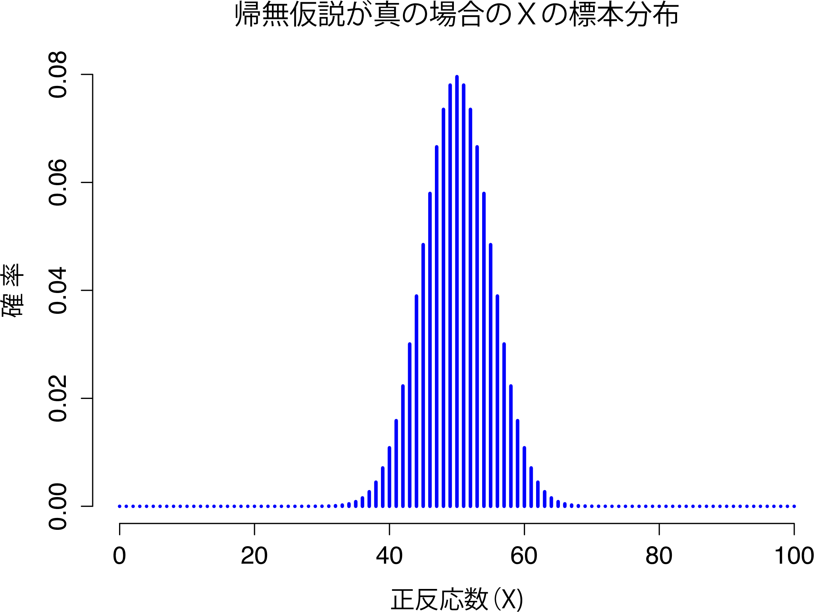
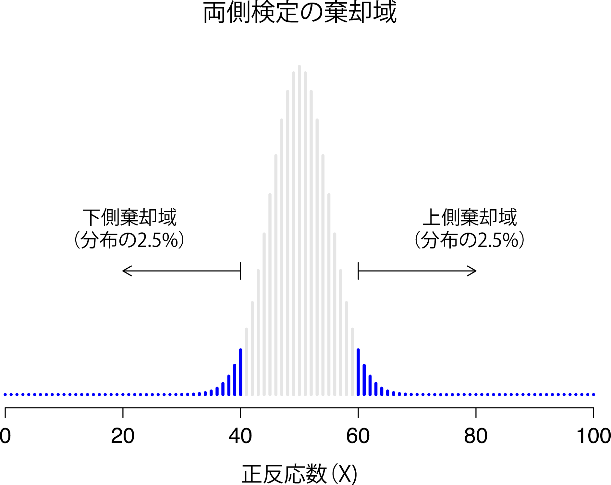
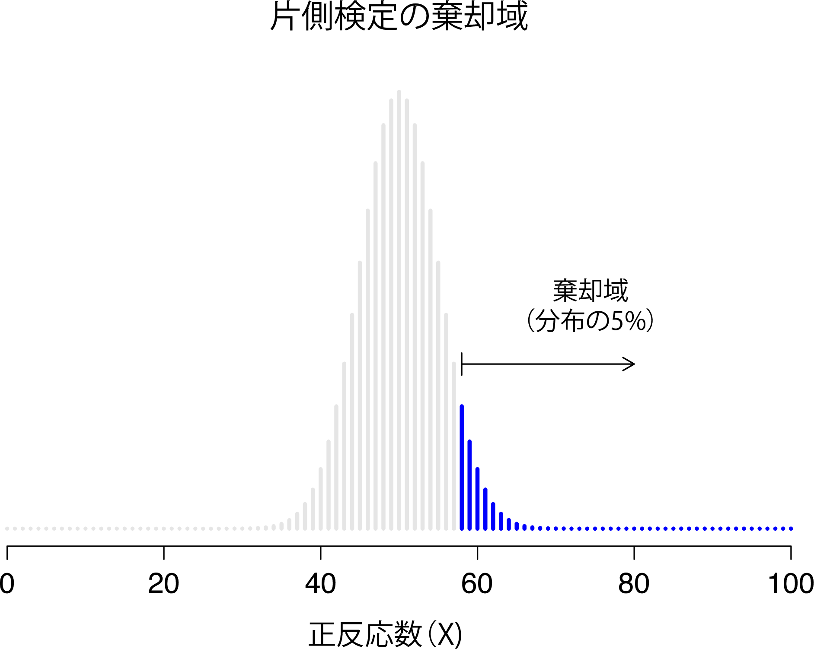
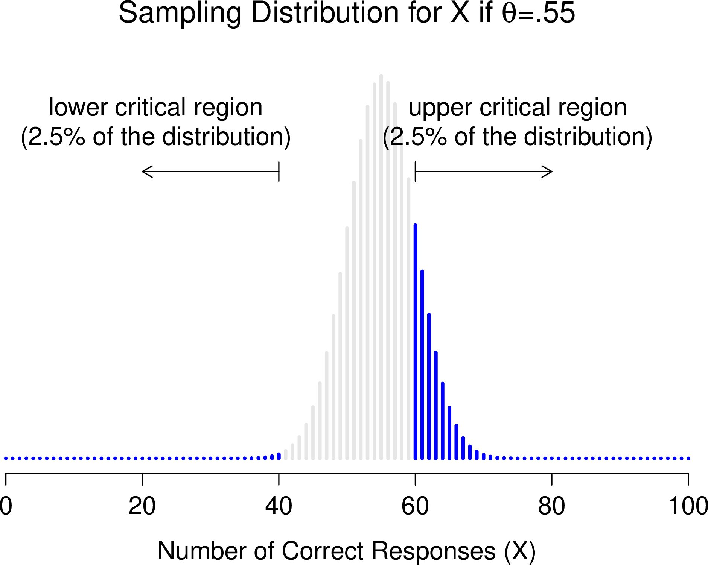
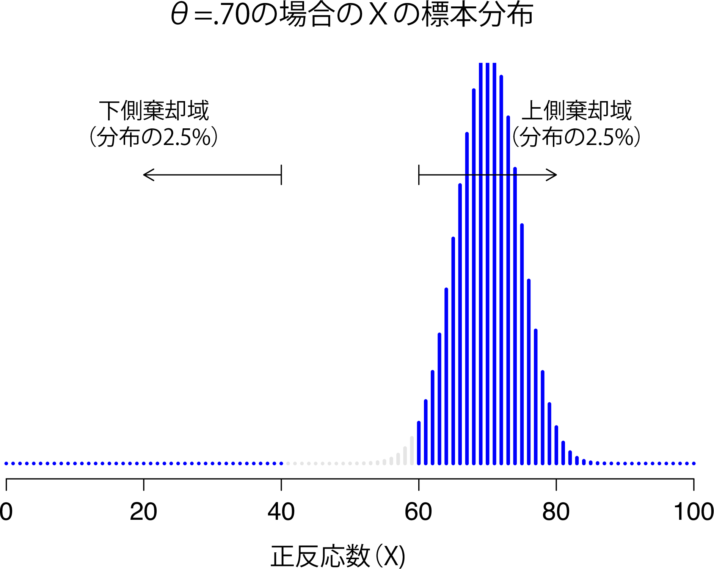
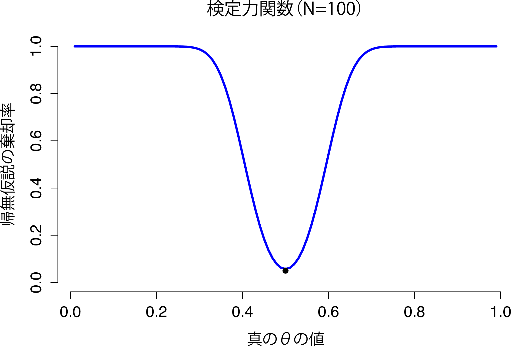
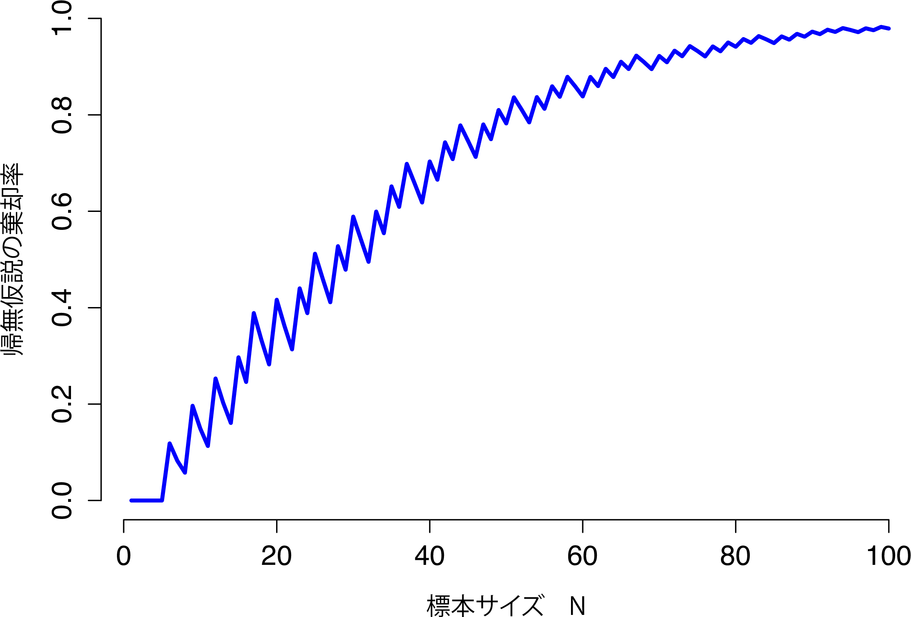

仮説検定 {#ch:hypothesistesting}
==============================================

> 帰納法とは，われわれの経験に調和するもっとも単純な法則を仮定する手続きである。しかし，この手続きに論理的正当性はなく，これはただ心理的に正当化されるに過ぎない。もっとも単純な出来事が実際に起きると信じる根拠などないということは明白である。明日も太陽は昇るというのは仮説に過ぎない。つまり，明日太陽が昇るかどうか，確実なことはわからないのである。
>
> 　　　　　--- ルートヴィヒ・ウィトゲンシュタイン^[ウィトゲンシュタイン，『論理哲学論考（Tractatus Logico-Philosphicus）』(1922) より引用]

先ほどの章では，推測統計における2つの大きな枠組みのうち，推定というものの背後にある考え方について説明しました。この章ではもう1つの枠組みである*仮説検定*について考えてみましょう。仮説検定というのは，非常に一般的な部分ではとてもシンプルな考え方です。研究者には世界に関する何らかの理論があって，そしてその理論が実際のデータで支持されるかどうかを知りたいというのが仮説検定の基本です。ただし，具体的な部分となると非常にややこしく，仮説検定の理論は統計を学ぶうえで多くの人にとってとくにモヤモヤを感じさせる部分であるようです。本章の構造は次の通りです。まず，仮説検定がどのように「組み立て」られているのかを示すために，単純な例を用いて仮説検定の仕組みをかなり詳細に説明します。その際，あまり教義的な話になりすぎないようにするつもりです。そうではなく，検定手順の背後にある理屈に目を向けます^[注：以下の記述は，一般的な入門テキストにおける標準的な記述とは少し異なっています。帰無仮説検定のオーソドックスな理論は，サー・ロナルド・フィッシャーおよびイェジ・ネイマンの20世紀初頭の研究に端を発します。しかし，フィッシャーとネイマンはその使い方について非常に異なる考え方をしていました。ほとんどの教科書に書かれている標準的な仮説検定の方法は，この2つのアプローチの混合です。本書の説明は，オーソドックスな理論よりはややネイマンよりで，とくに\(p\)値の意味についてはその傾向が強くなっています。]。さらにその後，仮説検定の理論にまつわるさまざまな考え方や規則，異説について，少し時間を割いて説明したいとおもいます。

風変わりな仮説 {#sec:hypotheses}
------------------------------------------------

私たちは皆，最終的には狂気に屈するのです。私がついに教授への昇格を遂げた時，私にもその日が訪れることでしょう。象牙の塔に身を隠し，地位も保証されて，ついに我を忘れて徹底的に非生産的な心理学研究にふけることができるのです。そう，それは超感覚的知覚（超能力）の研究です^[本当に信じている人がいたら申し訳ないですが，超能力に関する文献を読む限り，それが実在すると考えるのはまったく合理的ではありません。ただ，公正を期せば，いくつかの研究は非常に厳格にデザインされていて，心理学研究のデザインについて考えるには確かに興味深い領域と言えます。そしてもちろん，ここは自由の国ですから，あなたの時間と労力をかけて私が間違いであることを証明しようとすることはできます。しかし，それはあなたの知性の無駄遣いだと私は思います。]。

さて，この輝かしい日が訪れたとしましょう。私はまず，透視能力が存在するかどうかというシンプルな研究を行うことにしました。各参加者をテーブルの前の椅子に座らせ，実験者がカードを1枚見せます。カードの片側は黒で，反対側は白になっています。実験者はそのカードをもって隣の部屋に移動し，その部屋のテーブルの上にカードを置きます。そのカードは，黒または白のいずれかの面が上になるように置かれています。カードの向きは完全無作為で，その無作為化は実験者が参加者とともに部屋を出た後に行われます。そして2人目の実験者が入ってきて，参加者にカードのどちらの面が上になっているかを尋ねます。これは純粋に1回限りの実験です。各参加者が見るカードは1枚だけで，答えるのも1回だけです。そして，どの段階においても，参加者が正しい答えを知っている人と接触することはありません。そのため，私のデータセットはとてもシンプルなものです。私は\(N\)人に質問し，そのうち\(X\)人が正答しました。物事を具体的にするために，私がテストをしたのは\(N = 100\)人で，そのうち\(X = 62\)人が正答したとしましょう。確かにかなりの人数ですね。ですが，これは私が超能力の証拠を見つけたと主張できるほど多い数字なのでしょうか。仮説検定はこのような状況で役立ちます。ただし，仮説を*検定*する方法について説明する前に，仮説とは何かということをはっきりさせておかなければなりません。

### 研究仮説と統計的仮説

まず最初に，研究仮説と統計的仮説の違いについてしっかり理解しておく必要があります。私の超能力研究では，科学的な目標は透視能力の存在を示すことにあります。今回の場合，私にははっきりした研究目標があります。それは，超能力が存在する証拠を発見するということです。状況によってはもっと中立な立場にいる場合もあるかもしれません。つまり，透視能力があるかないかを確かめることが研究目標だという可能性もあり得るわけです。私がここで伝えたいことの基本的な部分は，私が自分の立場をどう説明するかにかかわらず，研究仮説には実質的で検証可能な科学的主張が含まれているということです。あなたが心理学者なら，あなたの研究仮説は基本的に心理学的構成概念に*ついて*のものになるでしょう。つまり，以下はいずれも<span class="keyterm">研究仮説</span>になり得ます。

-   **音楽聴取は他の物事に対する注意力を低下させる**　これは2つの心理学的概念（音楽を聴くことと物事に注意を払うこと）の因果関係についての主張であり，完全に合理的な研究仮説といえます。

-   **知能はパーソナリティに関連する**　 先ほどの場合と同様に，これは2つの心理学的概念（知能とパーソナリティ）の関係についての主張ですが，この主張は因果的ではなく相関的で，主張としてはやや弱いものになっています。

-   **知能とは情報処理能力の速さ<u>である</u>**　 この仮説は上の2つとはかなり異なる性質を持っています。これは関係についての主張ではありません。これは知能の基本的性質についての存在論的主張です（ついでに言えば，私はこの主張は間違いであると確信しています）。これについて少し詳しく説明しておきましょう。多くの場合「Xとは何か」という主張についての研究方法を考えるのは「XはYに影響する」という研究仮説を検証する実験方法を考えるよりも困難です。そして実際のところ，大抵はその存在論的主張から生じた何らかの関係的主張について検証する方法を考えることになるのです。たとえば，もし私が知能とは脳の情報処理速度のこと*である*と考えているならば，私の実験は知能の測度と処理速度の測度の関係を見るものになることでしょう。結果として，研究上の問いというのは実際にはほとんどが関係的なのものになりがちなのですが，それらはつねに自然状態についての存在論的な問いによって動機づけられているのです。

なお，実際には研究仮説が重複する場合もあり得るということに注意してください。超能力実験における私の究極の目標は，「超能力の存在」という存在論的主張を検証することかもしれませんが，私はそれを「物体を透視できる人がいる」という，より狭い仮説として操作的に限定するかもしれません。とはいえ，研究仮説としてまともな意味をなさないようなものもあります。

-   **愛は戦場である**（Love is a battlefield）　 これは漠然としすぎていて検証できません。研究仮説にも多少のあいまいさはあってよいのですが，理論的概念を操作的に定義できないようなものではいけません。もしかしたら単に想像力が足りないだけなのかもしれませんが，私にはこれを具体的な研究デザインにする方法がわかりません。もしその通りなら，これは科学的な研究仮説とは言えません。単なるポップソングです。だからといって，それがくだらないというわけではありません。人間の抱く深遠な疑問の多くはこうしたタイプのものです。いつの日か，科学的に検証可能な愛の理論が登場するかもしれませんし，科学で神の存在を検証できるようになるかもしれません。しかし，今のところはそうではありませんし，私はそれに対して納得できる科学的アプローチがあるとも思いません。

-   **違法薬物が違法なのはそれが違法な薬物だからだ**^[訳注：原文では「トートロジークラブの第1のルールがトートロジークラブの第1のルールである（The first rule of tautology club is the first rule of tautology club）」ですが，これではおそらくほとんどの人にとって意味不明だと思います。そこで，日本語版では循環論を示すような別の表現に変えました。]　 これは意味のある主張になっていません。確かに，この主張は真実です。この主張に矛盾する状況というのは自然状態では考えられません。つまり反証不可能な仮説ということになり，科学でこれを扱うことはできません。科学が対象として扱えるのは，誤りである可能性がある主張だけなのです。

-   **私の実験では「はい」より「いいえ」という答えの方が多い**　 これも研究仮説にはなりません。なぜなら，これはデータについての主張であって，心理学に関する主張ではないからです（ただし，人間には一種の「はい」バイアスがあるということを確かめるのがあなたの研究上の問いというのなら話は別です）。実際，この仮説は研究仮説というよりは統計的仮説に近いでしょう。

このように，研究仮説というのは時としてやっかいなこともあるのですが，究極的にはどれも*科学的*な主張です。これに対し，<span class="keyterm">統計的仮説</span>はやっかいでもなければ科学的主張でもありません。統計的仮説は数学的に正確である必要があり，そしてそれらはデータ発生メカニズム（つまり「母集団」）の特徴に関する具体的主張と対応していなくてはならないからです。しかしそれでも，統計的仮説とあなたの研究仮説に関係があることは明らかです。たとえば，私の超能力研究の研究仮説は「壁を透視できる人がいる」というものです。ここで私がやるべきことは，この仮説をデータ生成方法に関する記述に「対応づけ」することです。では，それがどのような記述かを考えてみましょう。この実験で私にとって興味のある量は\(P(\mbox{正解})\)で，これは私の実験参加者が質問に正答できる真の確率であり，そして未知の値です。この確率をギリシャ文字の\(\theta\)（シータ）で表しましょう。そしてここには4つの統計的仮説があります。

-   もし超能力が存在しないなら，そして私の実験方法に問題がないなら，参加者たちはただ単に当てずっぽうで答えていることになります。そうすると，彼らが正解するかどうかは半分半分ということになり，私の統計的仮説は「真の正答率\(\theta = 0.5\)」ということになります。

-   そうではなく，超能力が存在し，参加者たちは壁を透視してカードを見ることができるとします。もしそれが真実で，人々が当てずっぽうよりも良い成績を出すことができるなら，統計的仮説は\(\theta > 0.5\)になります。

-   3つめの可能性として，超能力が存在するものの，なぜか全員が反対側の色を答え，誰もそれに気づいていなかったとします（確かに奇妙ですが，ないとは言えません）。もしこの通りなら，参加者の結果は当てずっぽうより*悪い*成績になると予測されます。この場合，\(\theta < 0.5\)という統計的仮説になります。

-   最後は，超能力は存在すると考えられるけれども，参加者が正しい色を答えるか反対の色を答えるかの確信が持てないという場合です。この場合，データに関してできる主張は，正しい答えが0.5に*等しくない*ということだけです。そしてこれは，\(\theta \neq 0.5\)という統計的仮説になります。

これらはすべて統計的仮説の例として適切なものです。なぜなら，これらはどれも母集団パラメータについての記述であり，意味のある形で私の実験に関係しているからです。

この議論からわかるのは，統計的仮説検定を行おうとするとき，研究者は実際には異なる2種類の仮説を考えることになるということです。まず，その研究者には研究仮説（心理学についての主張）があります。そして，それに対応する統計的仮説（データを生み出す母集団についての主張）があるのです。私の超能力実験の例では次のようになります。

```{r, warning=FALSE, echo=FALSE,message=FALSE}
library(knitr)
library(kableExtra)

dt<- matrix(c('ダニーの*研究*仮説','「超能力は存在する」',
                      'ダニーの*統計的*仮説', '\\(\\theta \\neq 0.5\\)'), ncol=2, byrow=T)

kable(dt, align = c('l','c')) %>%
  kable_styling(bootstrap_options = "striped", full_width = F)
```

ここで重要な点は，*統計的仮説検定は統計的仮説を検証するためのものであり，研究仮説を検証するものではない*ということです。研究デザインがまずい場合，統計的仮説と研究仮説の関連は失われてしまいます。そうしたばかばかしい例として，私の超能力研究が，参加者から鏡に映ったカードが見えるような状況で行われていたとしましょう。このような場合，私は\(\theta \neq 0.5\)であるということについては非常に強力な証拠を得られるでしょうが，ここからは「超能力の存在」については何もわかりません。

### 帰無仮説と対立仮説

ここまではいいですね。私には研究仮説があり，それは世界についての私の考えに対応しています。そして私はそれを統計的仮説に対応させることができます。その統計的仮説は，データがどのように生成されるかについての私の考えと対応しています。多くの人が反直感的だと感じ始めるのはここからです。なぜなら，ここで新たな統計的仮説（*帰無*仮説，\(H_0\)）を考案することになるからです。これは，私の考えとはちょうど反対の考えに対応しています。そしてこれは，私が実際に関心のある考え（これは*対立*仮説（\(H_1\)）と呼ばれます）をひたすら否定しようとするものなのです。私たちの超能力実験では，帰無仮説は\(\theta = 0.5\)になります。なぜなら，これは超能力が*存在しない*場合に期待される値だからです。もちろん，私が期待しているのは超能力が実在するということなので，この帰無仮説に*対立*するのは\(\theta \neq 0.5\)ということになります。要するに，いま私たちがしていることは，私が真実であって欲しくないと思っているもの（帰無仮説）と，それが真実であれば嬉しいと思うもの（対立仮説）という2通りの場合について\(\theta\)の値を考えるということです。そして，ここが重要な点なのですが，仮説検定の目標は，対立仮説が（おそらく）正しいということを示すことでは*ない*のです。その目標は，帰無仮説が（おそらく）誤りであるということを示すことにあるのです。ほとんどの人は，ここで「何だそれは」と思うようです。

私の経験から言って，これについて考える最良の方法は仮説検定を刑事裁判に例えることです^[このたとえは，英/米/豪のような対審主義（原告と被告の双方が自らの立場を主張し，陪審員や裁判官が判断を下す裁判方式）をとっている国でないと成り立たないでしょう。そのことは私も理解しています。フランスの（<ruby>糾問<rt>きゅうもん</rt></ruby>主義裁判（裁判官が検察官の役割を併せ持ち，裁判官対被告で争われる方式）はかなりシステムが違います。]。つまり*帰無仮説裁判*だと考えるのです。帰無仮説は被告です。そして研究者は検察官で，統計検定そのものが裁判官です。刑事裁判と同様に，そこには推定無罪の原則があります。研究者であるあなたが「それが誤りである」ということを合理的な疑いの余地がない形で示せない限り，帰無仮説は真実と*みなされる*のです。あなたは自分の好きなように（といってもデタラメにという意味ではもちろんありません）実験をデザインすることができます。そしてあなたがそうするのは，データを用いて帰無仮説が誤りであると示し，有罪判決を勝ち取る可能性を最大化するためです。問題は，裁判のルールを決めるのは統計検定であり，そしてそのルールは帰無仮説を弁護するようにできているということです。とくに帰無仮説が真実である場合の誤審については，その可能性が低くなるように保証されています。ここが非常に重要です。結局のところ，帰無仮説には弁護士がいませんので，研究者が一心不乱にその誤りを証明しようとするなら，*誰か*がそれを弁護しなくてはならないのです。

2種類の誤り  {#sec:errortypes}
------------------------------------------

統計検定の組み立て方についての詳しい話を始める前に，その背後にある哲学を理解しておくのが良いでしょう。先ほどは帰無仮説検定と刑事裁判に類似性があるとほのめかしましたが，ここではっきりさせておくべきでしょう。理想を言えば，私たちはいかなる誤りも犯さないように検定を実施すべきです。しかし残念ながら，世界というのは乱雑であり，それは不可能なことです。単に不運な場合というのもあるでしょう。たとえば，コインを10回連続で投げたとき，10回すべてで表だったとしましょう。これは「このコインには偏りがある」という結論を導くうえで十分な証拠のように思えますよね。ところが，たとえコインに偏りがなかったとしても，1024分の1の確率でこれは起こり得るのです。つまり，現実世界においては，私たちは何らかの誤りを犯す可能性を*つねに*受け入れなければならないのです。その結果として，統計的仮説検定の背後にある目標は，誤りを*排除*することではなく，それらを*最小化*することになります。

ここで，「誤り」の意味についてもう少し明確にしておきましょう。まずは，明らかな部分からです。帰無仮説は，*真*（正しい）か*偽*（誤り）かのどちらかでしかありません。そして，私たちが行う検定は，帰無仮説を保持するか棄却するかを判断するためのものです^[帰無仮説検定について話す際に使う言葉に関する余談です。まず，あなたが使用を絶対に避けなければらないのは「証明」という言葉です。統計検定は実際には仮説が真か偽かを「証明」するものではありません。証明とは，確かであることを示すことです。しかし格言にもあるように，統計はけっしてそれが確かだとは言わないのです。その点は，誰もが同意することでしょう。しかしそれ以上に，じつはかなりやっかいなことがあるのです。ある人たちは，あなたに言えることは単に「帰無仮説を棄却した」，「帰無仮説を棄却できなかった」あるいは「帰無仮説を保持した」だけであるといいます。この考え方によれば，あなたは「対立仮説を受け入れた」や「帰無仮説を受け入れた」とは言えないことになります。個人的には，これは行き過ぎだと思います。私の考えでは，これは帰無仮説検定とカール・ポッパーの科学的手続きに対する反証主義的視点を組み合わせたものでしょう。反証主義と帰無仮説検定には似たところはありますが，それらはまったく同じものではありません。ですから，私は仮説を受け入れることは問題ないと考えます（「受け入れる」ということが「それが必ず真である」ということを意味しないという限りにおいてですが。とくに帰無仮説についてはそうです）。ですがこれに同意しない人も多いでしょう。何より，こうしたおかしな点があるという点には注意しておくようにしてください。そうでないと，自分の研究結果について書いている際に不意にこうした問題にはまってしまうことになります。]。そして次の表に示したように，検定を行った後，私たちはこの4つのうちの1つを選択することになります。


```{r, warning=FALSE, echo=FALSE,message=FALSE}
library(knitr)
library(kableExtra)

dt<- matrix(c('正しい結論','誤り（第1種）',
                      '誤り（第2種）', '正しい結論'), ncol=2, byrow=T)
colnames(dt)<-c('\\(H_0\\)を保持','\\(H_0\\)を棄却')
rownames(dt)<-c('\\(H_0\\)が正しい','\\(H_0\\)が誤り')

kable(dt, align = c('l','c')) %>%
  kable_styling(bootstrap_options = "striped", full_width = F)
```

すると，ここでの誤りには*2つ*の種類があることになります。帰無仮説が実際には正しいのにそれを棄却してしまった場合，私たちは<span class="keyterm">第1種の誤り</span>（タイプ1エラー）を犯したことになります。一方で，実際には誤りである帰無仮説を保持した場合，私たちは<span class="keyterm">第2種の誤り</span>（タイプ2エラー）を犯したことになるのです。

統計的検定は刑事裁判のようなものだと言いましたよね。ほら，その通りです。刑事裁判では，被告がその罪を犯したということに「合理的疑いの余地がない」ことを示さなければなりません。すべての証拠規則は（少なくとも理論上は）無実の被告を誤って告発する可能性が（ほぼ）ないように作られています。イギリスの法律学者ウィリアム・ブラックストーンの「1人の無実の者が苦しむより，10人の犯罪者が無罪になる方がましだ」という有名な言葉にあるように，裁判は被告の権利を守るように設計されているのです。ですから，刑事裁判ではこの2つの誤りに対する扱いが異なります。無実の被告を罰することは，有罪の者を自由の身にしてしまうことよりも悪いと考えられているからです。統計検定もこれとまったく同じです。検定の設計原理で一番重要な部分は，第1種の誤りが生じる確率を*コントロール*することにあります。そして，これが一定の確率より低くなるようにしてあるのです。この確率は\(\alpha\)で示され，これは検定の<span class="keyterm">有意水準</span>と呼ばれています。ここがまさに検定の中心的な部分ですので，もう一度繰り返しておきます。*第1種の誤りが\(\alpha\)以下である場合，仮説検定の有意水準は\(\alpha\)である*と言われます。

では，第2種の誤り率はどうでしょうか。これもコントロールしておきたいですね。そして，この確率は\(\beta\)で表されます。ただし，検定においては誤った帰無仮説が正しく棄却される確率である<span class="keyterm">検定力</span>（検出力），つまり\(1-\beta\)に注目する方が一般的です。これをわかりやすくするために，先ほどの表に関連する数値を書き加えました。


```{r, warning=FALSE, echo=FALSE,message=FALSE}
library(knitr)
library(kableExtra)

dt<- matrix(c('\\(1-\\alpha\\)（正しい保持の確率）',' \\(\\alpha\\)（第1種の誤り）',
                      ' \\(\\beta\\)（第2種の誤り）', '\\(1-\\beta\\)（検定力）'), ncol=2, byrow=T)
colnames(dt)<-c('\\(H_0\\)を保持','\\(H_0\\)を棄却')
rownames(dt)<-c('\\(H_0\\)が正しい','\\(H_0\\)が誤り')

kable(dt, align = c('l','c')) %>%
  kable_styling(bootstrap_options = "striped", full_width = F)
```


「検定力が高い」仮説検定というのは，\(\beta\)の値が小さく，かつ\(\alpha\)も望ましい（小さい）水準にあるものを言います。慣習的に，科学者は\(\alpha\)の水準として\(.05\)，\(.01\)，\(.001\)という3種類を利用します。ここで注意しておいて欲しいことがあります。検定では\(\alpha\)の水準は小さいことが*保証*されていますが，これに対応するような\(\beta\)の基準はありません。確かに第2種の誤り率も小さい方が*好ましい*ですし，それが小さくなるように検定をデザインするのですが，第1種の誤り率をコントロールする必要性の方がはるかに大きいため，ほとんどの場合，こちらは副次的なものになっています。もしブラックストーンが統計学者だったら「1つの真の帰無仮説を棄却するより，10の誤った帰無仮説を保持する方がましだ」と言ったかもしれません。ただ正直なところ，私がこの考え方に賛成かと言われると微妙なところです。それで納得いく場合もありますが，そうでない場合もあり，こればかりはなんとも言えません。ともかく，これが検定の背景にある考え方です。

検定統計量と標本分布 {#sec:teststatistics}
---------------------------------------------------------------------

さて，ここからは仮説検定をどのように組み立てるのかについての具体的な話を始めましょう。そのために，また先ほどの超能力実験の例に戻ります。ここでは，まず具体的な観察データのことは忘れて実験の構造について考えてみます。実際の数値がどのようなものであれ，データの*形式*は「\(N\)人中\(X\)人が隠されたカードの色を正しく特定した」というものになります。そして，ここでは仮に帰無仮説が真実だったとしましょう。つまり，超能力は存在せず，人が色を正しく当てる真の確率がちょうど\(\theta = 0.5\)だったとします。さて，実際のデータはどのようなものになっていることが*期待*されるでしょうか。当然ながら，正しく答えた人の比率が50%にかなり近い状態を期待するはずです。これをより数学的に表せば，\(X/N\)はほぼ\(0.5\)であるといえるでしょう。もちろん，測定値が*ぴったり*0.5であるとまでは思わないはずです。ですから，もし\(N=100\)人にテストをして，そのうちの\(X = 53\)人が正解したとしたら，その結果は帰無仮説にかなり一致していると認めざるを得ないでしょう。一方で，もし参加者のうち\(X = 99\)人が正答したとすると，帰無仮説は誤りであるとかなり自信を持って言うことができます。同様に，正答したのが\(X=3\)人だったという場合も，帰無仮説が誤りであるということに対して自信を持てるでしょう。では，これをもう少し専門的な形で見てみましょう。\(X\)の値はデータから計算することができるので，この値は私たちの手元にあります。\(X\)の値を確認したら，次は帰無仮説が正しいと考えられるか，あるいは帰無仮説は誤りで対立仮説を採用すべきかどうかということについて判断します。この際の判断を助けてくれるものとして計算されるのが<span class="keyterm">検定統計量</span>と呼ばれる値です。

検定統計量を選択したら，次の段階はその検定統計量の値がいくつだったら帰無仮説を棄却し，いくつだったら帰無仮説を保持するのかをはっきりさせることです。そのためには，帰無仮説が真である場合の<span class="keyterm">検定統計量の標本分布</span>（sampling distribution of the test statistic）を見る必要があります（標本分布についてはセクション\@ref(sec:samplingdists)でとりあげました）。それはなぜでしょうか。なぜなら，その分布を用いることで，私たちの帰無仮説においてどのような\(X\)の値が期待されるのかということがわかるからです。そのため，この分布は帰無仮説が私たちのデータにどの程度近いかを評価するためのツールとして使用できるのです。

```{r samplingdist, warning=FALSE, echo=FALSE, out.width='70.6%', fig.align='center', fig.cap='帰無仮説が真の場合の検定統計量\\(X\\)の標本分布。超能力実験のシナリオでは，これは二項分布になる。当然ながら，帰無仮説によれば正答率は\\(\\theta=.5\\)で，標本分布ではほとんどの場合（100人中）50人正答の可能性がもっとも高い。確率の大半は40から60の範囲に収まっている。', echo=FALSE}

```

では，実際に検定統計量の標本分布を決めるにはどうすればよいでしょうか。多くの仮説検定では，この部分は実際にかなり複雑です。そして本書のこの後の部分では，いくつかの検定で私がその部分の話を避けているということがわかると思います（じつは私もよくわかっていないものがあったりするのです）。しかし，非常に簡単な場合もあります。幸いなことに，私たちの超能力実験はそうした非常に簡単な場合の1つです。私たちの母集団パラメータ\(\theta\)は「人々が質問に正答する全体的確率」なので，私たちの検定統計量\(X\)は標本サイズ\(N\)の人々のうち何人が正答したかという*人数*になります。このような分布については，すでにセクション\@ref(sec:binomial)で取りあげています。二項分布というのはまさにこうした確率を示すものなのです。では，そのセクションで使用した表記と用語を用いて，「帰無仮説によれば\(X\)は二項分布することが予測される」ということを書くと次ようになります。

$$  X \sim \mbox{Bin}(\theta,N)  $$

 帰無仮説では\(\theta = 0.5\)とされていて，私たちの実験参加者は\(N=100\)人ですから，これで必要な標本分布が得られます。この標本分布を図示したのが図\@ref(fig:samplingdist)です。わかりやすい結果ですね。帰無仮説によれば，\(X=50\)という値がもっとも可能性が高く，正答するのはだいたい40人から60人の範囲になります。

結果の判断  {#sec:decisionmaking}
-------------------------------------------

さて，だいぶ終わりが見えてきました。私たちは検定統計量\(X\)を求められるようになりました。そしてもし\(X\)が\(N/2\)に近ければこの帰無仮説を保持し，そうでなければこれを棄却するということになります。あとはどんな問題が残っているでしょうか。それは，この検定統計量がいくつだったら帰無仮説を保持し，いくつだったら対立仮説を採用するかということです。たとえば，私の超能力研究では結果は\(X=62\)でした。さて，どう判断すれば良いのでしょう。帰無仮説を信じるべきでしょうか，それとも対立仮説を信じるべきでしょうか。

### 棄却域と臨界値

この問題に答えるためには，検定統計量\(X\)の<span class="keyterm">棄却域</span>（危険域）という概念を導入する必要があります。検定の棄却域とは，帰無仮説を棄却すべき\(X\)の値を示したものです。この棄却域はどのように求めればよいのでしょうか。まず，ここまでにわかっていることを整理しましょう。

-   帰無仮説を棄却するには，\(X\)は非常に大きいか非常に小さい必要があります。

-   帰無仮説が正しいなら，\(X\)の標本分布は\(\mbox{Bin}(0.5, N)\)になります。

-   もし\(\alpha =.05\)なら，棄却域はこの標本分布の5%の範囲をカバーしなければなりません。

とくに最後の点についてしっかり理解しておいてください。棄却域というのは帰無仮説を棄却する\(X\)の値に対応していて，ここで使用している標本分布は，帰無仮説が真である場合に特定の\(X\)の値が得られる確率を示しています。ここで，標本分布の20％をカバーするような棄却域を設定したとしましょう。そして帰無仮説が実際に正しかったとします。帰無仮説を誤って棄却する確率はいくつでしょうか。答えはもちろん20％です。この場合，\(\alpha\)の水準が\(0.2\)の検定を行ったことになります。もし\(\alpha = .05\)としたければ，棄却域がカバーすることを*許される*のは，検定統計量の標本分布のうち5％だけなのです。

そしてこの3つから，問題を一意に解くことができます。棄却域は非常に*極端な値*で構成されていて，これは分布の<span class="keyterm">裾</span>と呼ばれます。これを示したのが図\@ref(fig:crit2)です。

```{r crit2, warning=FALSE, echo=FALSE, out.width='70.6%', fig.align='center', fig.cap='超能力研究のための仮説検定に関連する棄却域。仮説検定の有意水準は\\(\\alpha=.05\\)。この図は，帰無仮説におけるXの標本分布を示す（すなわち図9.1に同じ）。 グレーの棒は，帰無仮説を保持する\\(X\\)の値。青い（網掛けの）棒は棄却域を示し，これらは帰無仮説を棄却するXの値である。 対立仮説は両側（すなわち\\(\\theta<.5\\)および\\(\\theta>.5\\)の両方の可能性がある）であるので，棄却域は分布の両側の裾をカバーする。有意水準\\(\\alpha=.05\\)を確保するためには，2つの領域のそれぞれが標本分布の2.5％をカバーする必要がある。', echo=FALSE}

```

もし\(\alpha = .05\)にしたければ，棄却域は\(X \leq 40\)と\(X \geq 60\)になります^[厳密に言えば，この場合には検定の有意水準は\(\alpha = .057\)で，これは少し寛大すぎます。しかし，もし私が39と61を棄却域の臨界値として選んだら，この棄却域には分布の3.5％しか含まれません。ですから40と60を臨界値とし，5.7%の第1種の誤り率を許容するのが一番良い方法でしょう。なぜなら，それは\(\alpha = .05\)の値にかなり近いからです。]。つまり，「正答」した人の数が41人から59人までであれば，私たちは帰無仮説を保持すべきなのです。そしてもし値が0から40，または60から100ならば，帰無仮説を棄却すべきということになります。なお，この40と60に相当する数値は，棄却域の境目の部分であることから<span class="keyterm">臨界値</span>と呼ばれることがよくあります。

これで，私たちの仮説検定では以下の項目が基本的に完了しました。

1. \(\alpha\)の水準を選択する（たとえば\(\alpha = .05\)）

2. \(H_0\)と\(H_1\)の比較が（意味のある形で）可能な何らかの検定統計量を選択する（\(X\)など）

3. 帰無仮説が正しい場合の検定統計量の標本分布を探す（今回の例では二項分布）

4. \(\alpha\)の水準に適した棄却域を設定する（0-40と60-100）

私たちのやるべきことは，あとは実際のデータで検定統計量を計算し（たとえば\(X = 62\)），これと臨界値を見比べて最終判断をすることだけです。算出結果の62という数値は60という臨界値より大きな値なので，ここでは帰無仮説は棄却されます。少し別の言い方をすれば，この検定によって「統計的に<span class="keyterm">有意</span>な結果が得られた」ということになるのです。

### 統計的に「有意」であるということ

> 統計も占い他のオカルト技法と同じだ。内輪でしか通じない専門用語を意図的に多用し，門外漢にはその方法がよくわからないようになっている。
>
> 　　　　　--- G・O・アシュリー^[インターネットによるとこれはアシュリーの言葉だということになっていますが，その主張の出典が示されているのを私はこれまで見たことがありません。]

ちょっとばかり話を脱線させて「有意」という言葉について考えてみましょう。統計的有意性の概念は実際にはとても単純なのですが，この名前のせいで混乱が生じてしまっています。データによって帰無仮説が棄却される場合，私たちは「この結果は*統計的に有意であった*」と言います。もう少し短く「結果が有意だった」と言うこともよくあります。この「有意である（significant）」という統計用語はかなり古い歴史を持つもので，「significant」という単語が「示された」というような意味を持っていた時代から使用されています。しかし，「significant」は現在では「重要である」に近い意味で用いられるようになっています。その結果，現代において統計法を学ぶ人々の多くに混乱が生じることになってしまったのです。なぜなら，「有意な結果」というとそれが重要なものであるかのように思えてしまうからです。しかし，そのような意味は一切ありません。「統計的に有意」という言葉は，「データによって帰無仮説が棄却される」というだけの意味なのです。その結果が現実世界において実際に重要かどうかというのはこれとはまったく別の問題で，それは他のさまざまな条件によって決まります。

### 片側検定と両側検定 {#sec:onesidedtests}

つい先ほど行った仮説検定について，もう1つ指摘しておきたいことがあります。私が統計的仮説についてもっとしっかり考えたなら，仮説は次のようになっていたことでしょう。

$$
H_0 :  \theta = .5 \\
H_1 :  \theta \neq .5   
$$

ここでは，対立仮説で\(\theta < .5\)と\(\theta > .5\)の*両方*の可能性がカバーされています。超能力で当てずっぽうよりも良い結果がでるか，*あるいは*逆に当てずっぽうよりも悪い結果になるか（そう考える人もいます）ということもあり得ると考えるなら，これは意味の通じる仮説です。統計的な用語では，これは<span class="keyterm">両側検定</span>と呼ばれます。このように呼ばれるのは，対立仮説が帰無仮説の「両側」の領域をカバーするからです。そしてその結果，\@ref(fig:crit2)に示したように検定でカバーされる棄却域は標本分布の両側の裾になります（もし\(\alpha =.05\)であれば両側2.5%ずつ）。

しかし，これしか可能性がないわけではありません。当てずっぽうよりも良い結果が出たときだけを超能力だと考えたい人もいるかもしれませんね。そうすると，対立仮説は\(\theta > .5\)の可能性だけをカバーすることになり，その結果として帰無仮説は\(\theta \leq .5\)になります。

$$
H_0 :  \theta \leq .5 \\
H_1 :  \theta > .5  
$$

この場合，私は<span class="keyterm">片側検定</span>と呼ばれるものを行っていることになり，棄却域は標本分布の片側の裾のみをカバーすることになります。これを示したのが図\@ref(fig:crit1)です。


```{r crit1, warning=FALSE, echo=FALSE, out.width='70.6%', fig.align='center', fig.cap='片側テストの棄却域。この場合，対立仮説は\\(\\theta>.5\\)であるため，\\(X\\)が大きな値の場合のみ帰無仮説が棄却される。結果的に，棄却域は標本分布の右側，具体的には分布の上位5％だけをカバーする。図<a href="#fig:crit2">9.2</a>の両側検定の場合と比較せよ。', echo=FALSE}

```

検定の評価値  {#sec:pvalue}
--------------------------------------

ある意味で，私たちはすでに仮説検定を完了しています。私たちは検定統計量を組み立て，帰無仮説が真である場合の標本分布を求め，そして検定の棄却域を設定しました。ところが，もっとも重要な数字についてまだ触れていないのです。それは<span class="keyterm">\(p\)値</span>です。そこで，ここではこの値について見てみることにしましょう。\(p\)値には2通りの解釈方法があります。1つはサー・ロナルド・フィッシャーによるもので，もう1つはイェジ・ネイマンによるものです。どちらの方法も筋は通っているのですが，この両者には仮説検定に対するかなり異なった考え方が反映されています。入門書のほとんどではフィッシャー流の考え方のみが扱われていますが，これは残念なことだと私は思います。私にとってはネイマン流の考え方のほうがわかりやすいですし，帰無仮説検定のロジックがうまく反映されているように思えるからです。ですが，その感じ方は人によって異なる可能性がありますね。ですからここでは両方を取りあげておきます。まずはネイマン流の考え方について見ていきましょう。

### 結果の判断に対するより柔軟な考え方

私が説明した仮説検定手順における問題点の1つは，「かろうじて有意」な場合と「明らかに有意」な場合の区別がまったくないということです。たとえば，私の超能力研究では，データに基づく結果は棄却域ギリギリに入るものでした。つまり，結果は有意だったわけですが，それはかろうじてのものだったのです。これとは対照的に，\(N=100\)人の参加者のうち\(X=97\)人が正答したというような実験結果が得られたとします。当然これは有意な結果になるわけですが，臨界値をかなり大きく超えており，つまり結果にまったくといっていいほどあいまいさがないわけです。ここまで説明してきた手順では，これら2つの区別はできません。もし私が第1種の誤り率を\(\alpha = .05\)にするという慣習的に標準となっている基準を採用していたとすれば，これらはどちらも「有意な結果」ということになります。

ここで\(p\)値の出番です。その仕組みを理解するために，同じデータセットに対して何度も仮説検定を行ったとしましょう。しかし，\(\alpha\)の値はその都度変えています。最初の超能力実験のデータでこれを行うと，次のような結果になります。

```{r ,  warning=FALSE, echo=FALSE, message=FALSE}
library(knitr)
library(kableExtra)

dt<- matrix(c(
'帰無仮説は...','棄却','棄却','棄却','保持','保持'
), ncol=6, byrow=T)

dtf<-as.data.frame(dt)
colnames(dtf)<-c('\\(\\alpha\\)の値', '0.05','0.04','0.03','0.02','0.01')

kable(dtf, align = c('c','c','c','c','c','c'), ) %>%
  kable_styling(bootstrap_options = "striped", full_width = F)
```

超能力データ（\(N=100\)人のうち\(X=62\)人で正解）を\(\alpha\)の水準を.03以上にして検定すれば，つねに帰無仮説は棄却されることになります。\(\alpha\)の水準が.02以下になると，つねに帰無仮説を保持することになります。つまり，このデータで帰無仮説が棄却される\(\alpha\)の最小値が.02と.03の間のどこかにあるはずです。これが\(p\)値です。実際，超能力データの場合には，この値は\(p = .021\)となります。つまり，こういうことです。

> \(p\)は帰無仮説を棄却する際に許容すべき第1種の誤り率（\(\alpha\)）の最小値である。

もし\(p\)があなたの許容できない誤り率になるのなら，あなたは帰無仮説を保持しなければなりません。もし\(p\)に等しい誤り率で満足できるなら，帰無仮説を棄却して対立仮説を採用しても良いということです。

実際，\(p\)はあなたの実施するあらゆる仮説検定における要約量であり，考え得るすべての\(\alpha\)値が考慮されています。そしてその結果，結果判断の過程を「柔軟に」してくれるという効果を持つのです。\(p \leq \alpha\)の検定では帰無仮説を棄却することになるでしょうし，\(p > \alpha\)の場合には帰無仮説を保持することになるでしょう。超能力実験では，私は\(X=62\)という値を得て，そして検定結果は\(p = .021\)になりました。つまり，私が許容しなければならない誤り率は2.1%ということになります。対照的に，私の実験結果が\(X=97\)であったとしましょう。この場合の\(p\)値はどうなるでしょうか。今度は\(p = 1.36 \times 10^{-25}\)となり，じつに小さな第1種の誤り率になります^[数値の指数表記が嫌いな人へ。これは\(p = .000000000000000000000000136\)になります。]。この2つめのケースでは，私はかなりの自信で帰無仮説を棄却することができます。なぜなら，帰無仮説を棄却するという私の判断が誤りである確率，つまり第1種の誤りは，およそ10<ruby>𥝱<rt>じょ</rt></ruby>（1兆の1兆倍）分の1でしかないからです。

### 極端なデータの出現確率

\(p\)値についての2つめの定義はサー・ロナルド・フィッシャーによるもので，多くの統計法入門の教科書で取りあげられているのはこちらの考え方です。私が棄却域を設定したとき，それは標本分布の*両方の裾*（つまり極端な値）に対応していましたよね。これは偶然ではありません。「良い」検定ではほぼすべての場合でこうした特徴が見られます（「良い」というのは，第2種の誤り率\(\beta\)が小さいという意味で，です）。それは，ほぼすべての場合において，良い棄却域というのは帰無仮説が真であればまず観察されないような検定統計量に対応しているからです。もしこれが正しければ，\(p\)値というのは，実際に私たちが得たのと少なくとも同程度に極端な統計量が観察される確率ということになります。つまり，もし帰無仮説から見てそのデータが非常に極端であり，まずあり得ないようなものであるならば，帰無仮説はおそらく誤りであろうと考えるのです。

### よくある間違い

さて，このように\(p\)値には2つの異なる考え方があり，しかもそのどちらも筋の通ったものといえます。そして2つのうちの1つはネイマン流の仮説検定アプローチで，もう1つはフィッシャー流です。ところが，人々，とくに統計初心者がよく行う3つめの解釈方法というのもあるのです。しかしこれは*絶対の絶対に誤り*です。その間違ったアプローチとは，\(p\)値を「帰無仮説が真である確率」と捉えるというものです。直感的にこのように考えたくなるのはわからなくもないのですが，これは2つの点で誤りです。まず，帰無仮説検定は頻度主義のツールであり，頻度主義の確率論では帰無仮説に対して確率を割り当てることは*できない*という点です。この確率論における見方では，帰無仮説は真か偽かのいずれかでしかなく，それが「5%の確率で」正しいというような言い方はできないのです。2つめに，仮説に確率を割り当てることが可能なベイズ流の確率論でも，\(p\)値は「帰無仮説が真である確率」にはなりません。こうした解釈は，\(p\)値の算出方法から見ても数学的に完全に矛盾しているのです。単刀直入に言えば，いくら直感的にそう感じられるとしても，\(p\)値に対してそのような解釈をする正当な理由が*<u>*ない*</u>*のです。ですから，絶対このような解釈はしないでください。

検定結果の報告 {#sec:writeup}
--------------------------------------------------------------

仮説検定の結果を書く際には，報告すべき情報というのはだいたい決まっています。ただし，それは用いた検定の種類によって少しずつ異なります。本書のこの後の部分では，さまざまな検定の結果を報告する方法について少し時間をとって説明していますので（個別の詳細についてはセクション\@ref(sec:chisqreport)参照），一般的な方法についてはだいたいわかっていただけるはずです。ともかく，どの検定を行うかにかかわらず，つねに必要になるのは，\(p\)値について何かを述べ，そして検定結果が有意であったかどうかを述べるということです。

こうした必要性があること自体は意外でも何でもありませんね。そもそもそのために検定をしているわけですから。しかし，その際に具体的にどうすべきなのかと言うことについてはいくつか論争があるのです。これについては意外に思うかもしれません。帰無仮説検定という枠組みに対して完全に異議を唱える人は別として，じつは結果の報告の際に検定で得られた具体的な\(p\)値を報告すべきか，それともあらかじめ設定した有意水準に対して\(p < \alpha\)であったかどうかだけを報告すべきか（たとえば\(p<.05\)）で，ある種の対立があるのです。

### 問題

なぜこれが問題になるのかを理解するためには，\(p\)値が*恐ろしく*便利なものであるという点を認識しておく必要があります。実際，\(p\)値を計算できるのであれば，検定の際に特定の\(\alpha\)の水準を設定する必要などないということになります。そんなことをせずに，計算によって得られた\(p\)値を直接解釈すればいいわけです。たとえば，仮に結果が\(p = .062\)であったとすると，それは帰無仮説を棄却することによる第1種の誤り率が6.2%であることを許容しなければならないという意味になります。もしあなたが個人的に6.2%では許容できないと思うなら，帰無仮説を保持すればいいわけです。そこでこの議論です。なぜ具体的な\(p\)値を報告し，許容できる第1種の誤り率について読み手に判断させるというのではだめなのでしょうか。このアプローチには，「柔軟」に結果を判断できるという大きな利点があるのに。事実，もしあなたがネイマン流の\(p\)値の定義を受け入れるなら，\(p\)値の本質はここにあります。これにより，「採用」と「棄却」を区別する厳格なラインとして\(\alpha = .05\)などという固定の有意水準を用意する必要はなくなり，\(p = .051\)と\(p = .049\)をまったく別物として扱わなければならないといった病的な問題を解決できるからです。

しかし，この柔軟性は\(p\)値の利点であり，同時に欠点でもあります。具体的な\(p\)値を報告するという考えを多くの人が好まないのは，研究者に自由を*与えすぎる*からなのです。とくに，データを見た*後*に，「これくらいの誤り率なら許容できる」というあなたの考えを変化させてしまうのです。たとえば，私の超能力実験の場合を考えてください。検定を行い，その結果の\(p\)値が.09だったとしましょう。帰無仮説を保持すべきでしょうか，棄却すべきでしょうか。さて，正直なところ，「本当に」受け入れたいと思う第1種の誤りの水準というものについて，これまでによく考えたことがありません。つまり，この点ついては何も意見を持っていないのです。ですが，超能力の存在については私には確かな意見があり，そして自分の研究が有名な科学誌に掲載されるということについても*当然ながら*意見を持っています。すると驚くことに，自分のデータを見た後になると，私は9%の誤り率ならそれほど悪くないじゃないかと思い始めます。それよりも，私の実験が失敗だったということを世間に対して認めることの方がずっと大きな問題です。そこで，事実を知った後で結果をすりあわせたかのように思われるのを避けるために，私は自分の\(\alpha\)は.1であるといい，10%の第1種の誤り率はそれほど悪いものではないと主張します。そしてその水準では，私の検定結果は有意なのです。これで私の勝ちです。

つまりここでの問題点はこういうことです。私は最高に正直な人間で，そして最高の意志を持っているかもしれませんが，あの辺やこの辺を「わずかに」調整してはどうかという誘惑は，とてもとても強いものなのです。これまでに実験をやったことがある人なら誰でもわかると思いますが，実験は長く厳しい道のりです。そして多くの場合，あなたは自分の仮説に*取り付かれて*しまうのです。実験の結果，自分の求めていたものが得られなかったということを認めるのはとても難しいものです。そしてここに危険が潜んでいます。もし私たちが「生の」\(p\)値を使用すれば，人はデータが実際に示していることではなく，自分の*信じたい*視点からデータを解釈するようになるでしょう。そしてもしそれが許されてしまうなら，私たちは一体何のために科学をやっているのでしょうか。それだったら，事実がどうあれ，自分が信じたいことだけを人々に信じさせればそれでいいのではないでしょうか。まあ，これはちょっと極端な話かもしれませんが，でもそうした心配はあるわけです。この考え方によれば，自分が使用する\(\alpha\)の値は前もって決めておかなければならないということになります。そして検定が有意だったかどうかだけを報告すべきだということになるのです。これが自分自身を正直に保つ唯一の方法なのですから。

### 考えられる解決策

実際には，前もって\(\alpha\)の基準を1つだけ指定する研究者というのは非常に希です。そうではなく，科学者は慣習的に.05，.01，.001という3つの標準的な有意水準を使用します。そして結果を報告するとき，このうちのどの有意水準で帰無仮説を棄却したのかを示すのです。これについては表\@ref(tab:pvaltable)にまとめました。こうすると，判断は少しだけ柔軟になります。なぜなら，\(p<.01\)というのは\(p<.05\)よりも厳しい基準にデータが適合していることを示すからです。しかし，これらの水準は慣習的なものとして前もって固定されているので，研究者がデータを見た後に自分の\(\alpha\)の水準を都合良く選ぶということは避けられます。

<table><caption>(\#tab:pvaltable) 慣習的に\(p\)値の報告で使用される値。多くの場合，以下の4つうちのいずれかが報告される（\(p<.05\)など）。ここには「＊印」で示す書き方も含めた（つまり，\*は\(p<.05\)を意味する）。なぜなら，統計ソフトではしばしばこうした表記が行われるからである。また，人によっては\(p>.05\)でなく*n.s.*（「有意でない（not significant）」の意）と書く人もいる。
</caption></table>
```{r, warning=FALSE, echo=FALSE, message=FALSE}
library(knitr)
library(kableExtra)

dt<- matrix(c(
' \\(p＞.05\\) ',  ' ',  ' 検定結果が有意でない',' 保持 ',
' \\(p＜.05\\) ',  '*[]()',' 検定結果は\\(\\alpha = .05\\)で有意。\\(\\alpha =.01\\)や\\(\\alpha = .001\\)では有意でない。',' 棄却 ',
' \\(p＜.01\\) ','**',' 検定結果は\\(\\alpha = .05\\)と\\(\\alpha = .01\\)で有意。\\(\\alpha = .001\\)では有意でない。',' 棄却 ',
' \\(p＜.001\\) ','***',' 検定結果はすべての有意水準で有意。',' 棄却 '
), ncol=4, byrow=T)

dtf<-as.data.frame(dt)
colnames(dtf)<-c('一般的<br>表記','記号','意味','帰無<br>仮説')

kable(dtf, align = c('l','l','l','c','c','c'),escape=F) %>%
  kable_styling(bootstrap_options = "striped", full_width = F)
```


それでも，非常に多くの人が正確な\(p\)値を報告することを好みます。多くの人にとって，\(p = .06\)の解釈を読み手に任せることができるという利点は，さまざまな欠点を上回るからです。ただし，詳細な\(p\)値の報告を好む研究者でも，小さな\(p\)値については正確な値を報告する代わりに\(p<.001\)とだけ書くのが一般的です。これは，1つには多くのソフトウェアが非常に小さな\(p\)値を出力しないことが理由です（たとえば，SPSSは\(p<.001\)の場合には\(p=.000\)と表示します）。また，別の理由として，非常に小さい\(p\)値は誤解を生む可能性があるということがあります。人間というのはどうしても，.0000000001のような数字を見たときに，それを対立仮説を支持するほぼ確実な証拠だと考えずにはいられなくなってしまうのです。しかし，実際にはほとんどの場合においてそれは誤りです。人生は広大で，乱雑で複雑です。そしてすべての統計的検定は，単純化や近似，仮定に基づいて考案されています。ですから，\(p<.001\)という数字が意味する以上のものを統計分析の結果から感じ取ってしまうのは合理的とはいえないのです。言い換えれば，\(p<.001\) というのは実際には「少なくとも*この検定*に関する限り，その証拠は圧倒的である」という意味の符号に過ぎません。

さて，ここまで読んできて，それなら一体どうすればいいのかと思っている人もいるかもしれませんね。この問題に関しては，意見がかなり食い違っています。詳細な\(p\)値を報告すべきだという人がいる一方で，表\@ref(tab:pvaltable)に示したアプローチを使うべきだという人もいるわけです。ですから，ここで私にできる最善のアドバイスは，自分の分野における論文や報告書がどのような慣習になっているかをチェックしてみなさいということです。もし一貫したパターンがないようなら，自分の好きな方を選べばいいでしょう。

仮説検定の実行 {#sec:runhyp}
----------------------------------------------------------

ここまでのところで，これは「本物」の仮説検定なのだろうか，それとも説明用に適当に作り上げた偽物なのだろうかと疑問に思っている人もいるかもしれませんね。これは本物です。先ほどの説明では，皆さんが実際に遭遇する可能性のあるもっとも単純な問題で考えるという形で，第1原理から検定を組み立てていきました。ですが，この検定はすでに存在するものです。この検定は*二項検定*と呼ばれるもので，これは「**Frequencies**（頻度）」ボタンから利用できる統計分析の1つとして<span class="jamovi">jamovi</span>にも実装されています。[<span class="rtext">binomialtest.omv</span>](data/binomialtest.omv)というデータファイルには<span class="rtext">n=100</span>人のうち<span class="rtext">x=62</span>人が正答したというデータが入っており，これを正答率が半分<span class="rtext">p=.5</span>^[ここにある<span class="rtext">p</span>は\(p\)値とは無関係です。<span class="jamovi">jamovi</span>の二項検定における<span class="rtext">p</span>は，帰無仮説に基づいた場合の正反応の確率です。いいかえれば，\(\theta\)の値です。]であるという帰無仮説で検定すると，図\@ref(fig:binomialtest)のような結果が得られます。

```{r binomialtest, warning=FALSE, echo=FALSE, out.width='82.4%', fig.align='center', fig.cap='<span class="jamovi">jamovi</span>における二項検定とその結果。', echo=FALSE}
knitr::include_graphics("img/nhst/binomialtest.png")
```

現時点では，この出力はよくわからないものに見えるでしょうが，多かれ少なかれ正しい結果が示されていることはわかると思います。具体的には，\(p\)値は0.02で一般的な基準である\(\alpha = .05\)よりも小さくなっているので，帰無仮説を棄却することができます。こうした結果の読み方についてはこの後たくさん見ていくことになります。しばらくすれば，これらを見て理解することは簡単に思えてくるはずです。

効果量，標本サイズと検定力{#sec:effectsize}
---------------------------------------------------------

先ほどのセクションでは，統計的仮説検定の主な設計原理として，第1種の誤り率をコントロールすることが重要であると強調しました。\(\alpha = .05\)に固定すれば，正しい帰無仮説が誤って棄却される確率を5%に抑えることができます。しかし，これは私たちが第2種の誤りをまったく気にしていないということではありません。実際のところ，研究者の視点からすれば誤った帰無仮説を棄却し損ねるということはとても嫌なものだからです。ですから，仮説検定の2つめの目標は\(\beta\)，つまり第2種の誤り率を最小化することとなります。ただし，普通は第2種の誤りを最小化するという言い方はしません。そうではなく，*検定力*を最大化するという言い方が用いられます。検定力は\(1-\beta\)として定義されるので，結局は同じことです。

### 検定力関数


ここで，第2種の誤りとは実際のところ何なのかということについて少し考えてみましょう。第2種の誤りは，対立仮説が正しいのに帰無仮説を棄却できない場合です。第1種の誤り率に\(\alpha = .05\)を設定するのと同じように，第2種の誤りについても1つの\(\beta\)値を計算できるといいのですが， 残念ながらそう簡単にはいきません。たとえば，私の超能力研究では対立仮説が実際にさまざまな\(\theta\)の可能性に対応していたことに注目してください。事実，対立仮説は0.5*以外*のすべての\(\theta\)にあてはまるのです。仮に正答の真の確率が55%（\(\theta = .55\)）だったとしましょう。そうすると，\(X\)の*真の*標本分布は帰無仮説が予測するものとは別のものになります。なぜなら，もっとも可能性のある値は\(X\)が100人中55人の場合ということになるからです。それだけではありません。標本分布は全体的に横に移動します（図\@ref(fig:crit3)）。しかし，棄却域は変化しません。定義上，棄却域というのは帰無仮説が予測する値に基づいているからです。図からわかるように，帰無仮説が間違っている場合には，標本分布のより大きな比率が棄却域に入ることになります。これは当然のことです。帰無仮説が棄却される確率は，帰無仮説が実際に誤りである場合にはより大きくなるからです。ただし，対立仮説として考えられるのは\(\theta = .55\)の場合だけではありません。今度は\(\theta\)の真の値が0.7だったとしましょう。標本分布はどうなるでしょうか。その答えを図\@ref(fig:crit4)に示しました。図のように，標本分布のほとんどすべてが棄却域に入りました。このように，\(\theta = 0.7\)の場合には，帰無仮説が正しく棄却される確率（つまり検定力）は\(\theta = 0.55\)の場合よりもずっと大きくなるのです。つまり，\(\theta = .55\)と\(\theta = .70\)はどちらも対立仮説の一部なのですが，第2種の誤り率は異なるのです。

```{r crit3, warning=FALSE, echo=FALSE, out.width='70.6%', fig.align='center', fig.cap='\\(\\theta=0.55\\)の母数パラメータ値に対する<emph>対立</emph>仮説下での標本分布。分布のかなりの部分が棄却域にある。', echo=FALSE}

```

```{r crit4, warning=FALSE, echo=FALSE, out.width='70.6%', fig.align='center', fig.cap='\\(\\theta=0.70\\)の母数パラメータ値に対する<emph>対立</emph>仮説下での標本分布。ほぼすべての分布が棄却域にある。', echo=FALSE}

```

これが何を意味しているかというと，検定力（すなわち\(1-\beta\)）は\(\theta\)の真の値によって変わるということなのです。このことがわかりやすくなるよう，すべての\(\theta\)の値について帰無仮説が棄却される確率を計算し，その結果を図\@ref(fig:powerfunction)に示しました。この図は，一般的に<span class="keyterm">検定力関数</span>と呼ばれています。こうすると，検定がどれだけ良いものになっているかということがよくわかります。なぜなら，これを見れば考え得るすべての\(\theta\)について，実際の検定力（\(1-\beta\)）がわかるからです。見ての通り，\(\theta\)の真の値が0.5に非常に近いときには検定力は急激に下降します。しかしそこから離れると検定力は大きくなります。

```{r powerfunction, warning=FALSE, echo=FALSE, out.width='70.6%', fig.align='center', fig.cap='帰無仮説が棄却される確率をθの真の値の関数として図示したもの。\\(\\theta\\)の真の値が帰無仮説が期待する値（すなわち、\\(\\theta=.5\\）と非常に異なる場合，検定がより強力（正しく棄却される可能性が高い）ということがはっきりわかる。\\(\\theta\\)が完全に.5（黒の点で図示されている）に等しい場合は帰無仮説は真であり，この場合に帰無仮説を棄却することは第1種の誤りであることに注意。', echo=FALSE}

```

### 効果量

> すべてのモデルは間違いであり，科学者はどの間違いがもっとも重大かということに注意せねばならない。トラがうろついているときにネズミの心配をするのは不適切なのだ。
>
> 　　　　　--- ジョージ・ボックス[@Box1976 p. 792]

図\@ref(fig:powerfunction)には仮説検定における非常に基本的なポイントが捉えられています。この世界の真の状態が帰無仮説の予測するものから大きく異なっている場合には検定力はとても大きくなり，世界の真の状態が帰無仮説に類似している（しかし同じではない）場合には，検定力は非常に小さくなるのです。それなら，世界の真の状態が帰無仮説にどれだけ「似ている」かを数量化する方法があると便利ですよね。それを表す統計量として，<span class="keyterm">効果量</span>（effect size）と呼ばれるものがあります[たとえば[]()@Cohen1988; @Ellis2010]。効果量は文脈によってわずかに異なる形で定義されています（ですからこのセクションでは非常に一般的な形で話をします）が，それが捉えようとしている量についての考え方は同じです。それは，*真*の母集団パラメータと帰無仮説で仮定されるパラメータ値の違いがどの程度大きいか，ということです。私たちの超能力研究の例では，\(\theta_0 = 0.5\)で帰無仮説が仮定する値を示し，\(\theta\)で真の値を示すとすれば，単純な効果量の測度は真の値と帰無仮説の値の差（つまり\(\theta - \theta_0\)）あるいは，これらの差の大きさ（\(|\theta - \theta_0|\)）のようなものになるはずです。

Table: (#tab:efsize)  統計的有意性と効果量の関係を理解するための大まかなガイド。基本的に，有意な結果が得られなかった場合，効果量はそれが正しいという証拠がないために意味をなさない。一方，結果が有意であっても効果量が小さい場合は，結果は実際には大したものではないということになる。しかし，このガイドは非常に大雑把なもので，これは研究によっても大きく異なる。小さな効果量も，いくつかの状況では実用的に非常に重要である場合がある。この表をあまりに額面通りにとらないこと。これは大まかなガイドに過ぎない。

|                        | 効果量：大               | 効果量：小               |   
|:----------------------|:-------------------------|:--------------------------|
| 有意な結果   | 差が本物で，実際的にも重要である。| 差はあるが，大したものでない可能性がある。|
| 有意でない結果                   | 効果なし                   |  効果なし   |


では，なぜ効果量を計算するのでしょうか。あなたが実験を行ったとしましょう。データを集め，そして仮説検定の結果，有意な結果を得ました。これだけで，有意な効果があったというのに十分ではないのでしょうか。だって，そこが仮説検定の*肝*ですよね？ まあ，ある意味その通りです。確かに仮説検定の肝は帰無仮説が誤りであることを示すことにあります。ですが，私たちの興味はそこだけにあるわけではありません。\(\theta = .5\)という帰無仮説が誤りであるということを示すのは，ストーリーの半分に過ぎないのです。帰無仮説を棄却することは，私たちが\(\theta \neq .5\)であると考えることを意味しています。しかし，\(\theta = .51\)と\(\theta = .8\)ではずいぶん大きな違いがあります。もし\(\theta = .8\)であるとわかったら，そこから帰無仮説が誤りであることがわかるだけでなく，それは*かなりの*誤りだということもわかるわけです。一方で，帰無仮説は棄却されたものの，真の\(\theta\)の値は.51だったとしましょう（これは標本サイズが非常に大きい場合にしかあり得ないことですが）。さて，確かに帰無仮説は誤りといえるのですが，それを重視すべきかどうかはまったくわかりません。なぜなら，効果量があまりに小さいからです。私の超能力研究の例で言えば，実際に超能力があるということを示せればそれはとてもすごいことなので^[実際には非常に小さい効果量というのは問題です。なぜなら，ごくわずかな方法論的欠陥によってその効果が生じている可能性があるからです。そして実際に完璧な実験というのはありませんから，方法論的な問題にはつねに注意する必要があるのです。]，このような差であっても重視するかもしれません。しかしその他の状況では，たとえそれが本当の差だったとしても，差が1%しかなければ普通はとくに興味深くも何ともないわけです。たとえば，高校のテストの点数に男女で違いがあるかを調べ，女子生徒の方が男子生徒より平均して1%だけ得点が高かったとしましょう。仮に私が数千人規模で生徒のデータを集めたとすれば，この差はほぼ間違いなく*統計的に有意*になります。ですが，どんなに\(p\)値が小さくても，これは興味深い差とはいえません。このようなわずかな差を根拠にして男性教育の危機だと触れ回ったりはしませんよね。だからこそ，仮説検定の結果とともに効果量の基準となる測度を報告することが（ゆっくりですが確実に）標準になりつつあるのです。仮説検定そのものは，観察した効果が本物だ（つまり，偶然ではない）と信じて良いかどうかを教えてくれるものです。これに対し，効果量はそれを重要視すべきかどうかということを教えてくれるものなのです。

### 検定力の向上

当然ながら，科学者は自分たちの実験の検定力を最大化しようと躍起になっています。誰だって自分の実験がうまく行って欲しいですし，だから帰無仮説が誤りならそれを棄却できる可能性を最大化したいのです（もちろん，普通は帰無仮説が誤りだと信じたいのです）。そしてここまでに見てきたように，検定力に影響する1つの要因が効果量です。だから，検定力を高めようと思うなら，あなたがまず最初にできることは効果量を増やすことです。つまり，効果量が最大になるような形で研究をデザインするということなのです。たとえば私の超能力研究では，私は超能力とは静かで真っ暗な部屋の中で，心を曇らせるような阻害因子が少ない環境で最大に発揮されるものだと考えているかもしれません。だとすれば，私はそうした環境で自分の実験を実施しようとするわけです。もし私が何らかの形で人々の超能力を増強できるなら，\(\theta\)の真の値は上昇するでしょうし^[母集団の真のパラメータ\(\theta\)は必ずしも不変ではありません。この文脈では，\(\theta\)は単人々が正確に別の部屋にあるカードの色を推測できる真の確率です。つまり，母集団パラメータはすべてのことに影響されます。もちろん，これは超能力が実際に存在するという前提でですが。]，それゆえ効果量も大きくなるでしょう。要するに，賢く実験をデザインすることが，検定力を上げる1つの方法だということです。なぜなら，それが効果量を増やすことになるからです。

残念ながら，最高の実験デザインを持ってしても小さな効果量しか得られない場合もあります。たとえば，超能力は存在するのだけれども，たとえベストコンディションであってもそれは非常に弱いものでしかないというような場合です。そのような状況では，検定力をあげるための最善の策は標本サイズを大きくすることです。一般に，観測値の数が多くなればなるほど，2つの仮説を区別できる可能性が高まります。仮に私が超能力実験を10人を対象に実施して，そのうち7人が隠されたカードの色を正しく当てたとしても，だからなんだという感じでしょう。しかし私が10,000人を対象に実験を行い，そしてそのうちの7,000人が正答だったとしたら，あなたは私が何か新しい発見をしたと思うのではないでしょうか。つまり，検定力は標本サイズが大きくなるほど高くなるのです。これを図\@ref(fig:powerfunctionsample)に示しました。この図には，真のパラメータが\(\theta = 0.7\)の場合について，標本サイズ\(N\)が1から100までの検定力を示してあります。なお，帰無仮説による予測値は\(\theta_0 = 0.5\)です。

```{r powerfunctionsample, warning=FALSE, echo=FALSE, out.width='70.6%', fig.align='center', fig.cap='検定力を標本サイズ\\(N\\)の関数として図示したもの。この場合，\\(\\theta\\)の真の値は0.7で帰無仮説は\\(\\theta=0.5\\)である。全体として，\\(N\\)が大きくなるほど検定力は高くなる（この関数の細かなジグザグは，\\(\\theta\\)，\\(\\alpha\\)と二項分布が離散的であるという事実の間の奇妙な関係によって生じるものであり，とくに問題になるようなものではない）。', echo=FALSE}

```

検定力は重要なものですから，あなたが実験をしようと考えるなら，どの程度の検定力が得られそうかということを知っておくことはとても役立ちます。ただし，正確に知ることはできません。なぜなら，本当の効果量を知ることなどできないからです。それでも，効果量がどれくらい大きくなるかを推測することは，多くの場合（というほどではないですが）可能です。その場合，どれくらいの標本サイズが必要なのかを推測することもできるのです。こうした考え方は<span class="keyterm">検定力分析</span>と呼ばれています。これは，これが使える場合には非常に便利です。検定力分析により，自分に利用可能な時間やお金で実験を成功させることができるかどうかというようなことを知ることができるのです。検定力分析は実験デザインにおける必要な要素であると論じられることも一般的になりつつあるので，知っておくだけの価値はあります。ただし，本書では検定力分析については説明しません。1つにはくだらない理由から，そしてもう1つには実質的な理由からです。

くだらない理由というのは，検定力分析について書くだけの時間がなかったということです。実質的な理由というのは，私自身が検定力分析に対してまだ少し懐疑的だからというものです。1人の研究者として言えば，私は自分がこれを使える状況にいるとは思えません。それは，(a)私の実験はそれほど一般的なものではないので，どれくらいの効果量を想定すべきかがわからない，あるいは(b)効果量がどれくらいかが文字通りわからないので，その答えをどう解釈していいかもわからない，からです。それに，統計コンサルティングで生計を立てている人物（偶然にもそれは私の妻だったりするのですが）と何度も会話した中で，私はあることに気づかざるを得ませんでした。それは，実際に誰かが検定力分析について彼女に相談してきたケースというのが，その人が研究助成金の申請書類を書こうとしていた場合*だけ*だということです。つまりどういうことかというと，科学者が実際に検定力分析をやろうとするのは，そうしたお役所手続きをやらざるを得ない場合だけだということです。こうした分析を毎回のようにやっている人というのはいないのです。つまり私の考えは，検定力は重要な概念だけれども検定力*分析*はあまり役に立たないというものです。ただし，(a)自分がしようとしている研究デザイン向けの検定力の計算方法を誰かが考案してくれている場合，(b)効果量がどれくらいになるかがかなりはっきりわかっている場合には話は別です^[この例外の1つは，研究者が新たな治療法について研究するという場合で，効果量がどの程度であるのか，たとえば既存の治療法を上回るという形でこれを事前に特定できるような場合です。この場合，新治療による潜在的な値について，ある程度の情報を得ることができます。]。私とは状況が異なる人もいるかもしれませんが，私はこれまで(a)や(b)という状況を経験したことがありません。もしかしたら，将来的には私の考えが変わり，本書の将来の版では検定力分析について詳細な説明がなされているということがあるかもしれませんが，現時点ではこの話題についてはこれぐらいで十分だと私は思います。

考慮すべき問題 {#sec:nhstmess}
--------------------------------------------

私が本章で説明してきたのは，従来型の帰無仮説検定の枠組みです。こうした帰無仮説検定の仕組みを理解することは絶対に必要です。なぜなら，20世紀初頭以降，これが推測統計における支配的なアプローチになっているからです。大多数の研究者がデータ分析にこの方法を用いていますから，たとえこれが嫌いでも知っておく必要があるのです。しかし，このアプローチに問題がないわけではありません。この枠組みにはいくつか奇妙な部分があり，歴史的な成立過程もヘンテコで，どの枠組みが正しいのかという理論的な論争もあり，軽率な人が陥る罠もたくさんあります。この話題について深入りするつもりはありませんが，こうした問題のいくつかを簡単に紹介しておく価値はあると思います。

### ネイマン流とフィッシャー流

あなたが最初に知っておくべきことは，従来型の帰無仮説検定は，実際には仮説検定に対するかなり異なった2つのアプローチのごった煮であるということです。1つはサー・ロナルド・フィッシャーにより提唱されたもので，もう1つはイェジ・ネイマンによるものです^[歴史的な経緯については@Lehmann2011を参照]。その歴史もごちゃごちゃです。なぜなら，フィッシャーとネイマンの考え方は時間とともに変化していきましたし，そして2人とも，自分たちの研究を数十年以上後の人々がどう解釈すればよいのかということについて，いかなる時点においても「断言」してくれていないのです。ただし，この2人のアプローチについてわかっていることを要約すると以下のようになります。

まず，フィッシャーのアプローチについて見てみましょう。私の知る限りフィッシャーは，あなたにはたった1つの仮説（帰無仮説）があり，そしてあなたのやりたいことは帰無仮説がデータに矛盾しているかどうかを知ることだと仮定しています。フィッシャーの考え方では，あなたのすべきことはデータが帰無仮説に従うということが「十分あり得ない」ことかどうかをチェックすることです。実際，先ほどの説明の中で取りあげたフィッシャーによる\(p\)値の定義がこれです。フィッシャーによれば，その帰無仮説でデータをまったくうまく説明できない場合，それを安全に棄却することができるのです。しかし，あなたにはそれと比べられるような別の仮説というものがまったくないので，「対立仮説を受け入れる」こともできません。なぜなら，対立仮説については明確に述べられていないからです。とまあ，だいたいこんな感じです。

これに対し，仮説検定は行為の指針となるものであるというのがネイマンの考えで，ネイマンのアプローチはフィッシャーのものよりいくらか秩序だったものでした。彼の考えは，あなたには複数の*選択肢*（帰無仮説を受け入れるか対立仮説を受け入れるか）があり，そして検定は，データがどちらによりあてはまるかを教えてくれるものであるというものでした。この考え方では，対立仮説を適切に設定することが重要になります。対立仮説が何かがわからなければ，その検定にどれだけ力があるのかがわかりませんし，どちらの選択が意味をなすのかもわかりません。この枠組みでは，異なる仮説間で優劣をつけるということが必要になるのです。ネイマンにとって，\(p\)値は帰無仮説でそのデータ（あるいはより極端なデータ）が生じる確率を直接示すものではなく，これはその「検定」が帰無仮説を受け入れることを示唆しているのか，対立仮説を受け入れることを示唆しているのかというような，より抽象的なものなのです。

そしておわかりのように，私たちが現在行っているのはこの2つの考え方の奇妙な寄せ集めです。私たちは，帰無仮説と対立仮説の両方について話をしてきました（ネイマン流），ですが，通常は極端なデータが出現する確率という視点で\(p\)値を定義します（フィッシャー流）^[本書ではネイマン流とフィッシャー流の\(p\)値について説明していますが，ほとんどの入門テキストではそうではありません。ほとんどの入門テキストは，フィッシャー流のものだけを示しています。]。ですが，\(\alpha\)の値も使用します（ネイマン流）。また，統計的検定の中には対立仮説が明示的に特定されるものもありますが（ネイマン流），それがとても曖昧なものもあります（フィッシャー流）。さらに，少なくとも何人かの人々は，対立仮説を受け入れることについて話すのもだめだと言います（フィッシャー流）。本当にごちゃごちゃなのです。ですが，なぜこんなにごちゃごちゃなのかは少なくともわかっていただけたのではないでしょうか。

### ベイズ主義と頻度主義

ここまでのところで，私は\(p\)値を「帰無仮説が正しい確率」として解釈しては*ならない*と強調してきました。帰無仮説検定は頻度主義のツール（第\@ref(ch:probability)章参照）ですので，仮説に対して確率を割り当てることはできないのです。帰無仮説は真か偽かのどちらかでしかありません。ベイズ流の統計的アプローチでは確率を確信度として解釈するので，「帰無仮説が正しい確率は10%である」というような言い方そのものはまったく問題ありません。それはこの仮説に対する確信の度合いを反映しているものだからです。しかし，このような解釈を頻度主義のアプローチで行うことはできません。思い出してください。あなたが頻度主義者なら，確率は独立に何度も反復が行われたときに何が起きるか（つまり長期的頻度）という形でしか言及できないのです。これがあなたの確率の解釈だとすると，帰無仮説が真実である「確率」というのはまったく意味をなしません。帰無仮説は真か偽かのいずれかにしかならないからです。つまり，帰無仮説について長期的頻度をもとに話すことなどできないのです。「帰無仮説の確率」について話すことは「自由の色」について話すのと同じくらい意味がないことです。そんなものはないからです。

とくに重要な点は，これは単なるイデオロギー的な問題ではないということです。あなたがベイズ主義者になることを選ぶなら，仮説について確率的な説明を行っても構いませんが，そうした確率を計算する際にはベイズ主義のルールに従う必要があります。これについては第\@ref(ch:bayes)章でより詳しく説明しますが，今ここで私が指摘しておきたいのは，\(p\)値というのは\(H_0\)が真かどうかの確率の近似値としては*最悪*のものだということです。帰無仮説の確率を知りたいのであれば，あなたに必要なのは\(p\)値ではありません。

### 注意点

おわかりのように，帰無仮説検定の背後にある理論はごちゃごちゃです。そして現在ですら，それをどう使う「べき」かについては議論があるのです。しかし，統計学者間の意見の不一致というのは私たちの本当の関心事ではありません。私たちが実際に関心があるのは実際的なデータ分析です。それに帰無仮説の有意性検定における「オーソドックス」なアプローチには確かにさまざまな問題点がありますが，私のような反省心のないベイズ主義者であっても，きちんと用いられる分においてはこれらは有用だと思います。大抵の場合，これらは意味のある答えを出してくれますし，それを使って興味深い発見をすることができます。しかし，ここまでに論じたさまざまなイデオロギーの対立や歴史的混乱はさておき，あらゆる統計における最大の危険は*よく考えない*ことです。馬鹿にしているわけではありません。文字通り「よく考えない」ことが問題なのです。それぞれの検定がデータについて実際に何を教えてくれているのかをよく考えずに，そしてそれがあなたの解釈と一貫しているのかどうかをよく確認しないままに，結果の解釈に飛びつくことを言っているのです。これが統計の最大の罠です。

この例として，次のようなケースを考えてみましょう[@Gelman2006 参照]。私の超能力実験で，データを男女別に分析したとします。男性参加者では50人中33人がカードの色を正しく当てました。この場合，結果は有意になります（\(p = .03\)）。女性参加者では，50人中29人が正答でした。この結果は有意ではありません（\(p = .32\)）。こうした結果を見ると，人々は「なぜ男女で超能力に差があるのだろうか」と考え始めずにはいられないわけです。しかし，これは間違いです。よく考えてみてください。ここでは男女を比較するという検定は行っていないのです。私たちが行ったのは，男性の反応と当てずっぽうの場合の比較（二項検定の結果は有意）と，女性の反応と当てずっぽうの場合の比較（二項検定の結果は有意でない）だけなのです。男女には実際に差があるということを論じたいなら，「男女には差がない」という帰無仮説について検定を行う必要があるでしょう。それは別の仮説検定を使うことで可能です^[この場合には，ピアソンの独立性のカイ二乗検定（第\@ref(ch:chisquare)章）を使用します。]，ですが実際にそれを行ってみると，男女で有意な差があるという結果にはなりません（\(p = .54\)）。さて，この2つのグループに何か根本的な差があると言えるのでしょうか。もちろんそんなことはありませんね。これは，両方のグループ（男女）のデータがどちらも境界線ギリギリのものだったのが原因です。男性では偶然\(p = .05\)という魔法のラインを超えたのに対し，女性の方はそうでなかったというだけなのです。これは男女に差があるということを意味するものではありません。こうした間違いは本当によくあることなので，つねに気をつけるようにしてください。それぞれのグループで有意か有意でないかが違っていたからといって，それはグループ間に差があることの証拠にはなりません。もしグループ間に差があるといいたいのなら，その差についての検定を行わなければならないのです。

上記の例は単なる例に過ぎません。非常によくある例なのでここではこれを選んだわけですが，もっと一般的な話として，データ分析を正しく行うということはなかなか難しいものなのです。あなたの検定したいものが*何*であるのか，あなたは*なぜ*それを検定したいのか，そしてあなたの検定で得られる結果が実際の世界において意味をなすものであるかどうかについてよく考えるようにしてください。

要約
-------

帰無仮説検定は統計理論におけるもっとも普遍的な要素の1つです。科学論文の大多数が仮説検定の結果を報告しています。その結果，\(p\)値が何であるのかについて最低でも通り一遍の理解なしに科学的研究を行うことはほぼ不可能になりました。ですから，本章は本書でもっとも重要な章だと言えます。そしていつものように，最後にこの章で取り扱った重要な考えを簡単に要約して終わりにしたいと思います。

-   研究仮説と統計的仮説。帰無仮説と対立仮説。（セクション\@ref(sec:hypotheses)）。-   第1種の誤りと第2種の誤り（\@ref(sec:errortypes)）

-   検定統計量と標本分布（セクション\@ref(sec:teststatistics)）

-   仮説検定と結果の判断（セクション\@ref(sec:decisionmaking)）

-   「柔軟な」判断材料としての\(p\)値（Section \@ref(sec:pvalue)）

-   検定結果の書き方（セクション\@ref(sec:writeup)）

-   仮説検定の実行（\@ref(sec:runhyp)）

-   効果量と検定力（セクション\@ref(sec:effectsize)）

-   仮説検定について考慮すべき問題（セクション\@ref(sec:nhstmess)）

本書の後半（第\@ref(ch:bayes)章）では，ベイズ主義の視点から帰無仮説の理論について再度取りあげます。そこでは，あなたが従来型のアプローチをあまり好きでないという場合に使える新しいツールをたくさん紹介する予定です。さて，これで抽象的な統計理論の話は終わりです。ここからは具体的なデータ分析ツールの話に入りましょう。