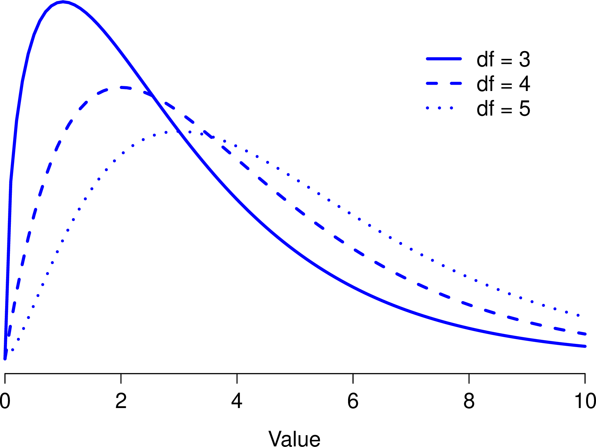
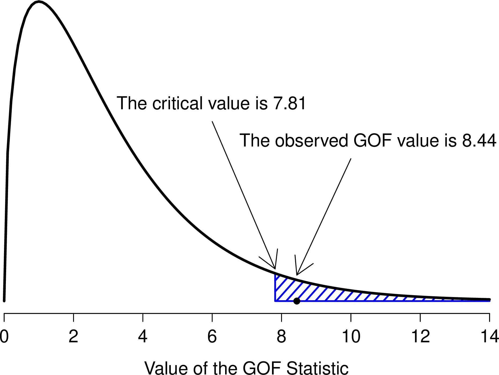

# (PART) 統計ツール {-}

カテゴリーデータの分析 {#ch:chisquare}
=============================================

仮説検定の背後にある基本的な理論についての説明が終わりましたので，ここからは心理学で一般的に用いられるさまざまな検定について見ていくことにしましょう。さて，どれから始めましょうかね。どの分析から始めるかは教科書によってもまちまちですが，本書では「\(\chi^2\)（カイ2乗^[「カイ自乗」と呼ばれる場合もあります。]）検定」（本章）と「\(t\)検定」（第\@ref(ch:ttest)章）から始めようと思います。この2つはどちらも科学の実践では非常によく用いられるものだからです。「回帰分析」（第\@ref(ch:regression)章）や「分散分析」（第\@ref(ch:anova)章）ほど強力ではありませんが，理解はずっと簡単です。

ところで，「カテゴリーデータ（カテゴリカルデータ）」というのは「名義尺度データ」の別名です。この呼び方はここまでの説明の中では一度も出てきていませんが，データの分析について話す場合には「名義尺度データ」ではなく「カテゴリーデータ」と呼ぶ方が一般的です。何ででしょうね。とにかく，<span class="keyterm">カテゴリーデータ分析</span>（categorical data analysis）というのは，データが名義尺度で得られたものである場合に使用できるツール群です。カテゴリーデータ分析に使用できるツールにはさまざまなものがありますが，本章ではその中からとくに一般的なものだけを扱います。

\(\chi^2\)（カイ2乗）適合度検定  {#sec:goftest}
---------------------------------------------------------

\(\chi^2\)適合度検定は，非常に古くからある仮説検定の1つです。この手法は，まさにこれから20世紀なろうという時代にカール・ピアソンによって考案され[@Pearson1900]，それにサー・ロナルド・フィッシャーが修正を加えてできあがったものです[@Fisher1922]。この検定では，名義変数の観測された度数分布が期待される度数分布に一致するかどうかを確かめます。たとえば，ある実験的治療を受けている患者グループがいて，その症状が改善したか，変わらないか，あるいは悪化したかを見るために健康状態を評価したとしましょう。そして，それぞれのグループ（改善，変化なし，悪化）の数が標準的な治療法で期待される数に一致するかどうかを調べたいというような場合に適合度検定が使用されるのです。では，もう少し心理学的な例を使いながら少し詳しく見ていきましょう。

### カードの実験

過去数年間，人間は無作為性をシミュレーションするのが非常に下手であるということが，数多くの研究によって示されてきました。無作為に「振る舞おう」としても，私たちはパターンや構造などを*考え*てしまうので，「無作為に何かをする」ように言われて人々がとる行動は，実際にはまったく無作為になっていないのです。そしてこうした人間の無作為性（というか非無作為性）についての研究から，私たちが世界をどのように捉えているかについての深い心理学的議論が数多く生じています。これを念頭に，非常にシンプルな研究を考えてみましょう。たとえば，人々にカードデッキをシャッフルした様子をイメージしてもらい，その想像上のカードデッキから「無作為に」カードを1枚引いてもらったとします。カードを1枚引いた後，今度は2枚目を引いてもらいます。どちらの場合も，選ばれたカードのマーク（ハート，クラブ，スペード，ダイヤ）にだけ注目するものとします。そしてこれを\(N=200\)人に実施し，そのデータから，人々が選んだふりをしたこのカードが本当に無作為になっているのかどうかを知りたいというわけです。このデータは<span class="filename">randomness.csv</span>ファイルに入っています。このファイルを<span class="jamovi">jamovi</span>で開いてスプレッドシートビューを見ると3つの変数があるはずです。最初の<span class="rtext">id</span>変数は各参加者に個別のIDを割り当てたものです。そして<span class="rtext">choice1</span>と<span class="rtext">choice2</span>が人々が選択したカードについての情報が含まれる変数です。

ここでは1回目に引いたカードについてだけ考えましょう。「**Exploration**（探索）」>「**Descriptives**（記述統計）」にある<span class="rtext">Frequency tables</span>（度数分布表）オプションで，選択されたカードのマークがそれぞれいくつであったのかを数えることができます。結果は次の通りです。


```{r, warning=FALSE, echo=FALSE,message=FALSE}
library(knitr)
library(kableExtra)

dt<- matrix(c(35,51,64,50), ncol=4, byrow=T)

colnames(dt)<-c('クラブ','ダイヤ','ハート','スペード ')
kable(dt, align = c('c','c','c','c')) %>%
  kable_styling(bootstrap_options = "striped", full_width = F)
```

このような簡単な度数分布表も非常に便利なものです。これを見れば，人にはクラブよりハートを選びやすい傾向がある*かもしれない*ということが何となくわかります。ただ，これを見ただけではその傾向が本当にあるといえるのか，あるいはこれがたまたまなのかははっきりとはわかりません。ですから，何らかの統計分析でそれをはっきりさせる必要があります。そしてその方法については次のセクションでお話しします。

ここまではいいですね。そしてここからは，この表を分析対象のデータとして用います。ただし，（残念ながら）このデータを数学的な用語を使って説明することになるので，その表記について明確にしておくことにしましょう。言葉で表現するところの「観測値」は，数学的表記では\(O\)という文字で表します。そして，その右下に小さな数字をつけて観測値の位置を示します。たとえば，この表の2番目の観測値は数式では\(O_2\)となります。数学表記とその意味の関係は次の通りです。

```{r, warning=FALSE, echo=FALSE,message=FALSE}
library(knitr)
library(kableExtra)

dt<- matrix(c(
'クラブ\\(\\clubsuit\\)','1','\\(O_1\\)','35',
'ダイヤ\\(\\diamondsuit\\)','2','\\(O_2\\)','51',
'ハート\\(\\heartsuit\\)','3','\\(O_3\\)','64',
'スペード\\(\\spadesuit\\)','4','\\(O_4\\)','50')
, ncol=4, byrow=T)

colnames(dt)<-c('ラベル','番号\\(i\\)','数学表記','値')
kable(dt, align = c('l','c','c','c')) %>%
  kable_styling(bootstrap_options = "striped", full_width = F)
```


よろしいでしょうか。また，数学者というのは個別の物事より全体について話をすることの方が好きだということも知っておくといいでしょう。つまり，\(i\)番目（\(i\)には1〜4の数字が入ります）のカテゴリーにあてはまる観測値の個数を指す場合，それを\(O_i\)という形で表すのです。最後に，観測度数全体を指す場合，統計学者はすべての観測値をベクトル^[ベクトルとは，同じ基本型のデータ要素をひとまとめにしたものです。]としてひとまとめにします。ここではそれを\(\boldsymbol{O}\)と表しましょう。

$$  \boldsymbol{O} = (O_1, O_2, O_3, O_4)  $$

さて，ここまでは別に新しくも興味深くもありません。これらは単なる表記です。たとえば\(\boldsymbol{O}~=~(35, 51, 64, 50)\)と言った場合には，これは観測度数（つまり <span class="rtext">observed</span>）の表全体のことを意味しますが，ここではただそれを数学的な表記で表しているだけです。

### 帰無仮説と対立仮説

先ほどのセクションで示したように，ここでの研究仮説は「人によるカードの選び方は無作為でない」というものです。ですから，これからやりたいことは，この研究仮説を何らかの形で統計的仮説に置き換えて，その統計的仮説のための検定を組み立てるということです。そして，ここで取りあげる検定は，<span class="keyterm">ピアソンの\(\chi^2\)（カイ2乗）適合度検定</span>（Pearson's \(\chi^2\) goodness-of-fit test）というものです。いつものことですが，まずは帰無仮説を注意深く立てなければなりません。この例の場合，それはとても簡単です。まず，帰無仮説を言葉で表現してみます。

$$
H_0: \text{ 4つのマークはどれも等しい確率で選択されている}
$$

さて，統計を使うわけですから，これを数学的に表現できなくてはなりません。そのために，\(i\)番目のマークが選ばれる真の確率を\(P_i\)と表すことにしましょう。もし帰無仮説が真であれば，4つのマークそれぞれの選択率は25%になります。つまり，ここでの帰無仮説は\(P_1 = .25\)，\(P_2 = .25\)，\(P_3 = .25\)，\(P_4 = .25\)ということです。また，観測度数全体をベクトル\(\boldsymbol{O}\)にひとまとめにして表したように，帰無仮説に対応するそれぞれの確率も\(\boldsymbol{P}\)という形で表すことができます。そして，帰無仮説のまとまりをベクトル\(\boldsymbol{P} = (P_1, P_2, P_3, P_4)\)とすると，帰無仮説は次のようになります。

$$
H_0: \text{　} \boldsymbol{P} = (.25, .25, .25, .25)
$$

この例の場合には，私たちの帰無仮説は確率のベクトル\(\boldsymbol{P}\)ということになり，そしてそのベクトルの中身はすべての要素で同じ確率になっています。しかし必ずしもそうでなくてはならないわけではありません。たとえば，クラブが他のマークの2倍多く入っているカードデッキからカードを引くという実験課題の結果について見ているのであれば，帰無仮説は\(\boldsymbol{P} = (.4, .2, .2, .2)\)のようになるでしょう。確率の値はすべてプラスになっていますし，これらすべてを合計すると1になりますから，これも帰無仮説としてまったく問題のないものなのです。ただし，適合度検定の使用場面では，多くの場合すべてのカテゴリーで確率が等しいという帰無仮説であることが多いので，ここではそのケースを例に見ていくことにします。

さて，では対立仮説\(H_1\)はどうなるでしょうか。私たちにとって本当に関心があるのは，選択の確率がすべて同じではない（つまり，人々は完全に無作為には選択していない）ということを示すことです。ですから，この仮説を「人間に優しい」形で表すと次のようになります。

$$
\begin{array}{ll}
H_0: & \text{すべてのマークは等しい確率で選択される}\\
H_1: & \text{すくなくとも1つのマークの選択率が0.25*ではない*}
\end{array}
$$

そして「数学者にやさしい」表記は次のようになります。

$$
\begin{array}{ll}
H_0: & \boldsymbol{P} = (.25, .25, .25, .25)\\
H_1: & \boldsymbol{P} \neq (.25,.25,.25,.25)
\end{array}
$$

### 適合度検定の統計量

ここまでのところ，私たちの手元には観測度数\(\boldsymbol{O}\)と，検定したい帰無仮説に対応した確率の集合\(\boldsymbol{P}\)があります。それではここから帰無仮説検定を組み立てていこうと思います。いつものように，\(H_1\)と\(H_0\)で検定するには検定統計量が必要になります。適合度検定の基本的な考え方は，データが帰無仮説にどれだけ*近い*かの指標となる検定統計量を求めるというものです。帰無仮説が真の場合に「期待」されるものとデータが似ていなければ，帰無仮説はおそらく真ではありません。では，もし帰無仮説が真の場合，どのような結果が期待されるのでしょうか。もう少し正確な用語で言うと，その場合の<span class="keyterm">期待度数</span>（expected frequencies）はどのようになるでしょうか。観測値の数は\(N=200\)で，（帰無仮説が真ならば）誰かがハートを選択する確率は\(P_3 = .25\)ですから，\(200 \times .25 = 50\)枚のハートが選択されるはずですね。もう少し詳しく言えば，「帰無仮説が真である場合に期待されるカテゴリー\(i\)の反応数」を\(E_i\)とした場合，この値は次のようになります。

$$  E_i = N \times P_i  $$

この計算はとても簡単です。観測値が200個あって，それが4つのカテゴリーに分かれるのですから，この4つのカテゴリーが同じ確率であるとするなら，そこから期待される各カテゴリーの観測値の数は50ということになります。

では，これをどのようにして統計量に置き換えたらよいのでしょうか。当然ながら，ここでやりたいことは，各カテゴリーの観測値に*期待される*数（\(E_i\)）と，それぞれのカテゴリーで実際に*観測された*観測値の数（\(O_i\)）を比較することです。そしてこの比較を元にして，適切な検定統計量を考え出さないといけません。そこでまず，帰無仮説が期待する数値と，実際に観測された数値の差を計算してみることにします。つまり，「観測度数−期待度数」の差（\(O_i - E_i\)）を求めるのです。そしてその結果が次の表です。


```{r, warning=FALSE, echo=FALSE,message=FALSE}
library(knitr)
library(kableExtra)

dt<- matrix(c(
'期待度数','\\(E_i\\)','50','50','50','50',
'観測度数','\\(O_i\\)','35','51','64','50',
'差の得点','\\(O_i-E_i\\)','-15','1','14','0'
)
, ncol=6, byrow=T)

colnames(dt)<-c('','','\\(\\clubsuit\\)','\\(\\diamondsuit\\)','\\(\\heartsuit\\)','\\(\\spadesuit\\)')
kable(dt, align = c('l','l','c','c','c','c')) %>%
  kable_styling(bootstrap_options = "striped", full_width = F)
```

この計算結果を見ると，帰無仮説で予測される数に比べてハートの数が多く，クラブは少ししか選ばれていないということがよくわかります。ただ，少し考えてみると，こうした個別の差の値そのものは，私たちが本当に求めているものでないということもわかりますね。直感的には，帰無仮説の予測が実際よりもかなり少ない（ハートの場合）のと，非常に多い（クラブの場合）のとでは，どちらも予測が正しくないという点では同じように感じられます。ですから，クラブの場合に値がマイナスになり，ハートの場合にはプラスになるというのはちょっと変なのです。これを修正するための簡単な方法は，すべてを2乗することです。つまり，差の2乗（\((E_i - O_i)^2\)）を計算するのです。先ほどと同じように，これも手で計算できます。


```{r, warning=FALSE, echo=FALSE,message=FALSE}
library(knitr)
library(kableExtra)

dt<- matrix(c(
'\\((観測度数 - 期待度数)^2\\)',225  ,  1   , 196  ,  0 
)
, ncol=5, byrow=T)

colnames(dt)<-c('','\\(\\clubsuit\\)','\\(\\diamondsuit\\)','\\(\\heartsuit\\)','\\(\\spadesuit\\)')
kable(dt, align = c('l','c','c','c','c')) %>%
  kable_styling(bootstrap_options = "striped", full_width = F)
```


これでだいぶ進みました。今私たちの手元にあるものは，帰無仮説の予測がずれている場合（クラブとハート）には大きくなり，そうでない場合（ダイヤとスペード）には小さくなる数値の集合です。次に，ある数学的な理由（これについては後で説明します）により，これらの数値をすべて期待度数\(E_i\)で割ります。つまり，\(\frac{(E_i-O_i)^2}{E_i}\)を求めるわけです。今回の例ではどのカテゴリーも\(E_i = 50\)ですので大して面白い計算にはなりませんが，とにかくやってみましょう。


```{r, warning=FALSE, echo=FALSE,message=FALSE}
library(knitr)
library(kableExtra)

dt<- matrix(c(
'\\(\\displaystyle\\frac{(観測度数 - 期待度数)^2\\ \\ \\ \\ \\ \\ \\ \\ \\ }{期待度数}\\)' , 4.50  ,  0.02   , 3.92  ,  0.00
)
, ncol=5, byrow=T)

colnames(dt)<-c('','\\(\\clubsuit\\)','\\(\\diamondsuit\\)','\\(\\heartsuit\\)','\\(\\spadesuit\\)')
kable(dt, align = c('l','c','c','c','c')) %>%
  kable_styling(bootstrap_options = "striped", full_width = F)
```


このようにして算出した値は実際には異なる4つの「誤差」得点で，それぞれが帰無仮説から観測度数を予測した場合の帰無仮説の「間違い」の大きさを教えてくれるものです。ですから，これを検定統計量に変換したければ，あとはこれらの数字を合計するだけでよいのです。こうして求められた値は<span class="keyterm">適合度</span>（goodness-of-fit）統計量と呼ばれ，\(X^2\)やGOFなどとも呼ばれます。この値の計算方法は次の通りです。

$$
\frac{(観測度数 - 期待度数)^2\ \ \ \ \ \ \ \ \ }{期待度数}\ の合計
$$

これを計算してみると，<span class="rtext">8.44</span>という値が求まります。この値についてはこのすぐ後に使用します。さて，カテゴリーの数を\(k\)で表す（このカード実験の場合は\(k=4\)）ならば，\(X^2\)統計量は次のように求められます。

$$  X^2 = \sum_{i=1}^k \frac{(O_i - E_i)^2}{E_i}  $$

直感的に，\(X^2\)が小さければ観測されたデータ\(O_i\)が帰無仮説の予測\(E_i\)に非常に近いということがわかります。ですから，帰無仮説を棄却するには\(X^2\)統計量が大きな値である必要があります。そして先ほど計算したように，私たちのカード実験では\(X^2 = 8.44\)という値が得られました。ということで今度はこの数値が帰無仮説を棄却するのに十分大きな値かどうかということが問題になるわけです。

### 適合度統計量の標本分布 

\(X^2\)の値から帰無仮説を棄却できるかどうかを判断するには，帰無仮説が真の場合の\(X^2\)の標本分布がどのようなものであるのかを知る必要があります。そこで，このセクションではこの部分について説明することにします。ここではこの標本分布がどのように求められるのかについてかなり詳しめに説明していきます。そしてこの次のセクションで，それを用いて仮説検定を行います。もし詳しい説明が不要で，標本分布は自由度が\(k-1\)の<span class="keyterm">\(\chi^2\)（カイ2乗）分布</span>（\(\chi^2\) distribution）になるという説明だけで十分なら，このセクションの残りは読み飛ばしても構いません。ですが，この方法で*なぜ*適合度検定ができるのかということを理解したければ，この続きも読んでください。

それでは，まず帰無仮説が真であると仮定しましょう。その場合，\(i\)番目の観測値の真の確率は\(P_i\)です。結局のところ，帰無仮説の定義はほぼこの通りです。では，これが実際にどういう意味なのかを考えてみましょう。これは，重みづけされたコインを投げたときにその結果がカテゴリー\(i\)になるかどうか（つまり表がでる確率\(P_i\)）を「自然」が決めていると言っているようなものです。ですから，ここでの観測度数\(O_i\)は，自然がそのようなコインを\(N\)回投げて（各回の観測結果がデータセットに含まれる観測値になります），ちょうど\(O_i\)回だけ表が出たというように考えることができるわけです。確かに，これは実験の結果に対するかなり奇妙な捉え方です。ですが，あえてこうしているのは，このようなシナリオをすでに見たことがあるということを皆さんに思いだしてもらいたいからです。じつはこれは，セクション\@ref(sec:binomial)で二項分布が得られたときとまったく同じ状況なのです。つまり，もし帰無仮説が真であったとすると，私たちの観測度数は二項分布からの標本抽出で生成されることになるのです。

$$  O_i \sim \mbox{B}(P_i, N)  $$

そして，もし中心極限定理（セクション\@ref(sec:clt)）の議論を覚えているなら，とくに\(N\)が非常に大きく，そして\(P_i\)が0または1に近すぎない場合には，二項分布は正規分布と非常によく似た形になると説明したはずです。つまり，\(N \times P_i\)が十分に大きい場合にはこれが成り立つのです。別の言い方をすると，期待度数\(E_i\)が十分大きい場合には，\(O_i\)の理論的な分布はおおよそ正規分布するということになります。さらに嬉しいことに，もし\(O_i\)が正規分布するのであれば，\((O_i - E_i)/\sqrt{E_i}\)も正規分布になるのです。なぜなら，\(E_i\)は固定された値なので，\(E_i\)を引いて\(\sqrt{E_i}\)で割った場合，正規分布の平均値と標準偏差は変わることになりますが，その他は変わらないからです。では，私たちの適合度統計量が実際にいくつになるかを見てみましょう。ここで私たちがしようとしているのは，正規分布の中からいくつかの値を取り出して，それを2乗し，合計するということです……っとちょっと待ってください。これは前にもどこかで見ましたよね。セクション\@ref(sec:otherdists)で説明したように，標準正規分布（つまり平均値が0で標準偏差が1の正規分布）の中から標本を取り出し，2乗して合計すると，その結果の値はカイ2乗分布になるのです。つまり，帰無仮説からは，この適合度統計量の標本分布がカイ2乗になるということが予測されるのです。なんとまあ。

あともう1つだけ説明しておくことがあります。それはいわゆる自由度についてです。セクション\@ref(sec:otherdists)の内容を覚えているでしょうか。そこでは，合計する要素の数が\(k\)個ならば，結果として求められるカイ2乗分布の自由度は\(k\)になると言いました。しかし，このセクションの頭では，実際のカイ2乗適合度検定の自由度は\(k-1\)であるといいました。これは一体どういうことなのでしょうか。じつは，私たちが考慮しなければならないのは，合計されるもののうち純粋に*独立*な要素の数なのです。そして，次のセクションで説明するように，今回の場合には合計する要素は\(k\)個あるのですが，そのうち本当に独立しているのは\(k-1\)個だけです。ですから，自由度は\(k-1\)個となるのです。では次のセクションでこの部分について見ていきましょう^[この問題は少し複雑です。詳しくは触れませんが，適合度統計量の式を\(k-1\)の独立なものの合計として書き直すという，ちょっとしたトリックもあります。そうすると「適切な」標本分布，つまり自由度\(k-1\)のカイ2乗が得られるのです。実際，数式的にうまく行くようにするためには，これをそのように書き直さなければなりません。ですが，そうした詳細部分の数式を示すことは入門書の範囲を超えています。ここでは，なぜ適合度統計量がカイ2乗分布に関係しているのかという感覚をつかんでもらうことの方を優先しています。]。

### 自由度

```{r manychi, warning=FALSE, echo=FALSE, out.width='70.6%', fig.align='center', fig.cap='異なる自由度におけるカイ2乗分布。', echo=FALSE}

```


セクション\@ref(sec:otherdists)でカイ2乗分布を紹介したとき，「<span class="keyterm">自由度</span>（degrees of freedom）」が何を*意味*するのかについては少し曖昧にしました。もちろんこれは重要な部分です。図\@ref(fig:manychi)を見ればわかるように，自由度が変わるとカイ2乗分布の形がかなり大きく変わるからです。しかしこれは一体*何*なのでしょうか。じつはこれについても，私がこの分布を取りあげ，正規分布との関係について説明したときに，すでに答えを示しています。これは，2乗して合計する対象となる「正規分布する変数」の数なのです。しかし，こんな抽象的な説明でわかる人はほとんどいないでしょう。私たちにとって本当に必要なのは，自由度というものを実際のデータで理解することです。では始めましょう。

まず，自由度の背後にある基本的な考え方はとてもシンプルです。この値は，データの記述に用いられる「量」の個数を数え，そこからそのデータが満たさなくてはならない「制約」の数を引くことによって求められます^[これは過度に単純化しすぎであると言わざるを得ません。大抵の状況ではこれでうまく行くのですが，自由度が整数でない場合というのにもちょくちょく出くわすのです。ですが心配しすぎないでください。あなたがそれに出くわしたら，「自由度」という概念はちょっとややこしい概念で，ここでの説明だけがすべてではないということだけを思い出してくれればいいのです。そして，入門編としてはこうした単純な説明にしておくのが最善なのです。ですが，こうした単純な説明があてはまらない場合もあるということはお知らせしておいた方がいいでしょう。もしこうした忠告をしていなかったら，あなたが\(df = 3.4\)のようなものを見たときに混乱し手しまうでしょう。そして，これは本書には取りあげられていなかったと（正しく）認識するのではなく，本書の内容を勘違いしてしまっているのではないかと（間違って）考えてしまうことでしょう。]。

これでもまだちょっと曖昧ですね。そこで，カード実験のデータを具体例として使うことにしましょう。ここでは，私たちのデータを4つのカテゴリー（ハート，クラブ，ダイヤ，スペード）の観測度数に対応した\(O_1\)，\(O_2\)，\(O_3\)，\(O_4\)という4つの数字で表します。これらの4つの数字は，私たちの実験における*無作為な結果*です。しかし，この実験には数を固定する制約が1つあります。それは，標本サイズ\(N\)です^[実際には標本サイズがつねに固定とは限りません。たとえば，実験の実施期間が一定に限られていると言うこともあります。そうすると，それに参加した人の数は，何人の人が実験に来てくれたかに依存します。ただ，これはここでの目的にとっては重要ではありません。]。もしハートを選んだ人数，ダイヤを選んだ人数，クラブを選んだ人数がわかったとすると，そこからスペードを選んだ人数もわかります。言い換えると，私たちのデータは4つの数字で記述されるのですが，実際には\(4-1 = 3\)の自由度に対応するのです。これについて少し違った角度から見てみましょう。私たちの関心対象は（4つのカテゴリーに対応した）4つの*確率*ですが，これらの確率は合計したときに1にならなければなりません。それが制約になるわけです。そのため，自由度は\(4-1 = 3\)になります。観測度数という視点から考えようと，確率という視点から考えようと，その答えは同じです。一般に，\(k\)個の集団が含まれるデータで\(\chi^2\)（カイ2乗）適合度検定を実施する場合，その自由度は\(k-1\)になります。

### 帰無仮説の検定

仮説検定の組み立てにおける最終的な段階は，棄却域を知ることです。つまり，\(X^2\)の値がいくつであれば，帰無仮説が棄却されることになるのかということです。すでに見たように，\(X^2\)が大きいということは帰無仮説が私たちの実験のデータをうまく予測できていないということを意味し，\(X^2\)が小さい場合には帰無仮説がデータをうまく予測しているということを意味します。そのため，臨界値を設けたうえで，\(X^2\)がその値より大きければ帰無仮説を棄却し，\(X^2\)がそれより小さければ帰無仮説を保持するというのが理にかなった戦略といえるでしょう。つまり，第\@ref(ch:hypothesistesting)章で用いた言葉で表現すれば，カイ2乗適合度検定はつねに<span class="keyterm">片側検定</span>（one-sided test）であるということになります。そして，あとはこの臨界値がいくつであるかがわかればいいということになります。これはとても簡単です。有意水準\(\alpha = .05\)で検定するなら（つまり，第1種の誤り率を5%まで許容するなら），帰無仮説が真の場合に\(X^2\)がそれを超える可能性が5%になる臨界値を選べばよいのです。これを図\@ref(fig:goftest)に示しました。

```{r goftest, warning=FALSE, echo=FALSE, out.width='70.6%', fig.align='center', fig.cap='カイ2乗適合度検定における仮説検定の図示。', echo=FALSE}

```


ですが，自由度\(k-1\)のカイ2乗分布における臨界値はどうやって見つけたらいいのでしょうか。大昔，私が初めて心理統計の授業を受けたとき，私たちは教科書に掲載されている図\@ref(fig:chisquaredcritvalues)のような臨界値の一覧から該当する値を探したものです。この図を見ると，自由度3の\(\chi^2\)分布のp=0.05の臨界値は7.815ということがわかります。

```{r chisquaredcritvalues, warning=FALSE, echo=FALSE, out.width='82.4%', fig.align='center', fig.cap='カイ2乗分布の臨界値の表', echo=FALSE}
knitr::include_graphics("img/chisquare/chisquared_critvalues.png")
```


つまり，算出した\(X^2\)統計量が臨界値である7.815よりも大きければ，帰無仮説を棄却することができます（帰無仮説（\(H_0\)）は4つのマークすべてが同じ確率で選ばれるというものだったのを思い出してくださいね）。この値はすでに計算してありますから（つまり\(X^2 = 8.44\)です），この基準から，私たちは帰無仮説を棄却することができます。基本的にはこれでおしまいです。これで「ピアソンの\(\chi^2\)適合度検定」を学びました。おめでとう！

### <span class="jamovi">jamovi</span>での検定 {#sec:gofTestInjamovi}

当然ながら，この分析は<span class="jamovi">jamovi</span>で行うことができます。「**Analyses**（分析）」タブの「**Frequencies**（頻度）」から，「**One Sample Proportion Tests**（1標本の比率検定）」にある「**N Outcomes**（3群以上のデータ）」を選択してください。そして表示された分析ウィンドウで，分析したい変数（<span class="rtext">choice1</span>）を「**Variable**（変数）」ボックスに移動します。また，「**Expected counts**（期待度数）」のチェックボックスをオンにしてください。すると，結果の表が表示されます。これらの設定が終わったら，<span class="jamovi">jamovi</span>の分析結果は図\@ref(fig:chisquaredanalysis1)のようになっているはずです。当たり前のことですが，<span class="jamovi">jamovi</span>が出力する期待度数は先ほど手で計算したのと同じ値で，統計量も同じです。\(\chi^2\)値は8.44，自由度3で\(p\)=0.038です。ここでは臨界値を探す必要がないという点に注意してください。<span class="jamovi">jamovi</span>は自由度3の場合の\(\chi^2\)の\(p\)値を計算してくれています。

```{r chisquaredanalysis1, warning=FALSE, echo=FALSE, out.width='82.4%', fig.align='center', fig.cap='<span class="jamovi">jamovi</span>でのカイ2乗適合度検定。表には観測度数と期待度数，および比率が示されている。', echo=FALSE}
knitr::include_graphics("img/chisquare/chisquared_analysis1.png")
```


### 異なる帰無仮説の指定

皆さんの中には，帰無仮説が「すべてのカテゴリーで可能性が等しい」というものでない場合にはどのように適合度検定を行えばよいのだろうかと疑問に思っている人もいるかもしれませんね。たとえば，誰かが「人は赤いマーク（ハートとダイヤ）のカードを60%の確率で選び，黒のマーク（クラブとスペード）を40％の確率で選ぶ」という予測をしたとします（なぜそう予測したのかは謎ですが）。なお，その他の偏りはないものとします。このような場合，帰無仮説は「ハートの選択が30％，ダイヤが30%，スペードが20%，クラブが20%」ということになります。つまり，ハートとダイヤはスペードとクラブに比べて1.5倍多く選択される（30%:20%の比率は1.5:1とおなじです）ということが期待されるわけです。なんとも馬鹿げた予測だと私には思えますが，このように明示的に帰無仮説を指定した検定も，<span class="jamovi">jamovi</span>では非常に簡単に実行できます。分析ウィンドウ（図\@ref(fig:chisquaredanalysis1)）の「**Proportion Test (N Outcomes)**（比率検定（3群以上））」 で，「**Expected Proportions**（期待比率）」の部分を展開してください。すると，選択した変数（この例の場合，<span class="rtext">choice1</span>です）にそれぞれ異なる比率を入力する欄が現れます。図\@ref(fig:chisquaredanalysis2)のように，新しい帰無仮説を反映させた比率を入力すると，その結果が変わるのがわかります。

```{r chisquaredanalysis2, warning=FALSE, echo=FALSE, out.width='82.4%', fig.align='center', fig.cap='<span class="jamovi">jamovi</span>の適合度検定における期待比率の変更', echo=FALSE}
knitr::include_graphics("img/chisquare/chisquared_analysis2.png")
```


その結果，期待度数は次のようになりました。

```{r, warning=FALSE, echo=FALSE,message=FALSE}
library(knitr)
library(kableExtra)

dt<- matrix(c(
'期待度数 \\(E_i\\)' , 40   ,          60      ,        60       ,     40
)
, ncol=5, byrow=T)

colnames(dt)<-c('','\\(\\clubsuit\\)','\\(\\diamondsuit\\)','\\(\\heartsuit\\)','\\(\\spadesuit\\)')
kable(dt, align = c('l','c','c','c','c')) %>%
  kable_styling(bootstrap_options = "striped", full_width = F)
```

そして\(\chi^2\)は4.74，自由度3で\(p\) = 0.182となります。新たな帰無仮説での分析結果と期待度数は，先ほどの分析とは異なっています。\(X^2\)統計量が異なっているため，\(p\)値も異なります。困ったことに，\(p\)値は.182ですから帰無仮説を棄却することはできません（なぜそうなのかについてはセクション\@ref(sec:pvalue)を読み返してください）。残念ながら，非常に馬鹿げた帰無仮説であるにもかかわらず，このデータはそれを棄却するのに十分な証拠を提供してくれませんでした。

### 検定結果の報告の仕方 {#sec:chisqreport}

これで検定の仕組みもわかり，<span class="jamovi">jamovi</span>の入った素晴らしい魔法の計算箱でこの検定を実行する方法もわかりました。次に知っておくべきことは，その結果の報告の仕方です。分析結果を誰にも伝えられないなら，実験してデータ分析しても何の意味もありませんよね。そこで，分析結果の報告には何が必要なのかを見ていくことにします。ここではカード実験の例を使いましょう。この結果を論文か何かで報告したいなら，一般的な書き方は次のようになるでしょう。

> 実験に参加した200名のうち，64名が1回目にハートを，51名がダイヤを，50名がスペードを，そして35名がクラブを選択した。この選択の確率が4つのマークすべてで同じであると言えるかどうかを確かめるため，カイ2乗適合度検定を実施した。検定の結果は有意であり（\(\chi^2(3) = 8.44, p<.05\)），マークの選択が完全には無作為になっていないということが示唆された。

そのままですし，ぜんぜん難しくないですよね。ただし，いくつか注意しておくべき点があります。

-   *統計的検定の前に記述統計量を示す*　 検定をする前に，データがどのようなものであったのかを読み手に伝えるようにしてください。一般的に，これが望ましい書き方です。読み手には，あなたのデータに関する知識がほとんどありません。ですから，データについて適切に説明しない限り，統計検定の結果は読み手にはまったく意味をなしません。読み手は頭が混乱して泣き出してしまうことでしょう。

-   *検定する帰無仮説について説明する*　 正直なところ，書き手がつねにこれを実践しているわけではないのですが，あいまいさのある状況や，読み手がそこで使われている統計ツールについてあまりよく知らない可能性がある場合には，これはよい方法です。読み手があなたの使用する検定の詳細を知らない（覚えていない）ということはしばしば起こりうることです。ですから，それを「思い出させる」のはある種の礼儀正しさでもあります。適合度検定に限って言えば，科学論文の読み手はまずその仕組みを知っていると考えることができるでしょう（なぜなら，ほとんどの統計入門の授業で扱われているからです）。しかしそれでも，帰無仮説について（簡単に）明示的に述べておくというのはよいことです。なぜなら，帰無仮説はあなたが何を検定したいのかによって異なる可能性があるからです。たとえば，カード実験の例では私の帰無仮説は「すべての4つのマークで確率が等しい（\(P_1 = P_2 = P_3 = P_4 = 0.25\)）」というものでしたが，この帰無仮説しかあり得ないわけではありません。帰無仮説を\(P_1 = 0.7\)かつ\(P_2 = P_3 = P_4 = 0.1\)として適合度検定をすることもできるわけです。ですから，あなたの帰無仮説がきちんと説明されているということは，読み手にとってはありがたいのです。また，帰無仮説を数式ではなく言葉で説明しているという点にも注意してください。これでぜんぜん問題ありません。数式で書きたければ書いてもいいですが，ほとんどの読み手にとっては記号より言葉のほうが理解しやすいので，言葉で説明できるのであれば，たいていの書き手は帰無仮説を言葉で説明する傾向にあります。

-   *「統計パーツ」を含める*　 検定そのものの結果について報告するとき，単に「結果が有意だった」だけでは終わりません。私は記述の中に「統計パーツ」（つまり，かっこで囲まれた数式っぽい難解な部分）を含め，そこにすべての「重要な」統計情報を記載しています。カイ2乗適合度検定では，報告される情報は検定統計量（適合度統計量は8.44だった），検定に使用された分布についての情報（自由度3の\(\chi^2\)，これは通常は\(\chi^2(3)\)のように書かれます），そして結果が有意だったかどうかの情報（この場合\(p<.05\)）です。この統計パーツに含める必要のある情報は検定ごとに異なります。ですから新しい検定について説明するたびに，その統計パーツがどのようになるかも示すようにします^[まあ，ある意味で，です。統計値をどのように報告すべきかという慣習は，学問領域ごとにいくらか異なっています。本書では心理学でのルールのみを取りあげています。それが私の専門だからです。ですが，読み手が結果を確認できるように十分な情報を提供するという一般原則についてはかなり普遍的なものだと思います。]。ただし，一般的な原理として，つねに十分な情報を提供するということがあります。読み手がその検定結果を自分で確かめたいというような場合に，それが可能になるような情報を提供する必要があるのです。

-   *結果の解釈を示す*　 結果が有意であったということを示すだけでなく，私は結果の解釈（つまり，人は無作為に選択していない）も記述しています。これも読み手に対する思いやりです。なぜなら，こうすることであなたのデータが意味することを読み手が理解しやすくなるからです。もしこのような部分がなかったら，読み手が結果を理解するのは非常に困難になります^[このアドバイスを奇妙に思う人もいるかもしれません。もしくは少なくとも専門的なレポートの書き方についての「普通の」アドバイスとは相容れないように思うことでしょう。たいていの場合，学生たちはレポートの「結果」のセクションはデータや統計分析の結果を報告する場所であり，解釈を書くのは「考察」のセクションだと教わっているからです。それはその通りなのですが，多くの人はそれを文字通りに解釈しすぎているようです。私は普段，データについてのシンプルでわかりやすい解釈を結果のセクションに書くという方法をとっています。そうすることで，読み手がデータを理解しやすくなるからです。そして考察では，私の結果が他の科学論文とどのように一致しているのかという，より大きな話をするようにしています。「解釈は考察に書きなさい」というアドバイスにこだわりすぎて，結果のセクションが理解不能なゴミにならないようにしてください。読み手に理解してもらうということの方が*はるかに*重要なのです。]。

何よりもまず，あなたにとっての最重要事項は読み手に物事を*説明*するということにあります。結果を報告するということは，他人に伝えることであるということをつねに心がけるようにしてください。レポートや卒業論文，さらには科学論文でさえ，結果のセクションがまったく意味不明な記述になっているのを私はそれこそ数え切れないほど見てきました。そうなってしまっているのは，書き手が単にすべての数字を書くということばかりに一所懸命になっていて，人間の読み手にきちんと伝えるということを忘れてしまっているからです。

### 統計表記に関して

> 悪魔にとって，統計と聖書の引用は等しく喜びである。
>
> 　　　　　--- H・G・ウェルズ

ここまでのセクションをしっかり読み込んでいて，そして私と同じくらい数学的な部分にこだわる人であれば，先ほどのセクションにおけるカイ2乗検定の結果の書き方にはちょっと気持ち悪いところがあったと思います。「\(\chi^2(3) = 8.44\)」という書き方は，何か変だと思いませんでしたか。だって，適合度統計量が8.44だったということなのですから，\(X^2 = 8.44\)とか，GOF\(=8.44\)のように書くべきではないのでしょうか。どうにもこれは，*標本分布*（つまり\(df = 3\)の\(\chi^2\)）と*検定統計量*（すなわち\(X^2\)）をまぜこぜにしているように思えます。もしかしたら，タイプミスかもと思ったかもしれませんね。なぜなら，\(\chi\)と\(X\)は見た目がとてもよく似ていますから。でもそうではないのです。\(\chi^2(3) = 8.44\)という書き方は，「検定統計量の標本分布は\(\chi^2(3)\)で，検定統計量の値は8.44である」というのをぎゅっと縮めたものなのです。

ある意味，馬鹿げた書き方です。カイ2乗の標本分布になることがわかっている検定統計量というのは*たくさん*あります。私たちが適合度検定に使用した\(X^2\)統計量は，そのたくさんあるうちの1つに過ぎません（ただし，もっとも一般的に用いられるものの1つです）。ものごとが完璧に整理された合理的な世界であれば，異なる検定統計量や標本分布のそれぞれには*必ず*別の名前がついていることでしょう。そうなっていれば，研究者が実際にどの値を計算したのかが統計パーツを見るだけでわかるからです。実際にそういう例を挙げてみましょう。たとえば，ピアソンの適合度検定に使用される統計量は\(X^2\)と書かれますが，これと非常に関連の深いものとして\(G\)検定^[ややこしい話ですが，\(G\)検定は一括りに*尤度比検定*（likelihood ratio test）と呼ばれる検定の特別な場合です。尤度比検定は本書では扱いませんが，これらは知っておくと便利な検定です。]と呼ばれる検定があり[@Sokal1994]，この検定では検定統計量は\(G\)と書かれます。偶然にも，ピアソンの適合度検定と\(G\)検定はどちらも同じ帰無仮説を検定し，そして標本分布もまったく同じ（つまり，自由度\(k-1\)のカイ2乗）です。仮に私が適合度検定の代わりに\(G\)検定でカード実験のデータを分析したら，検定統計量は\(G = 8.65\)で，先ほど得た\(X^2 = 8.44\)という値とはわずかに異なる結果になります。そして，\(p\)値はわずかに小さくなります（\(p = .034\)）。そして，たとえば結果の報告では検定統計量，標本分布，そして\(p\)値を記載するというのが慣習だったとしましょう。すると，2つの状況では統計パーツの中身が異なることになります。最初の結果は\(X^2 = 8.44, \chi^2(3), p = .038\)となるでしょうし，\(G\)検定を用いた方は\(G = 8.65, \chi^2(3), p = .034\)となるでしょう。ところが，短縮して報告するというやり方では，前者の結果は\(\chi^2(3) = 8.44, p = .038\)，後者の結果は\(\chi^2(3) = 8.65, p = .034\)となって，一体どちらの検定を行ったのかわからなくなります。

ではなぜ，私たちの世界では統計パーツの中身が実施した検定を特定できるようになっていないのでしょうか。結局のところ，人の世というのは複雑だということです。（統計ツールのユーザーである）私たちとしては，きっちりすっきり整理されていて欲しいのです。製品を作るときのようにしっかり*設計*されていて欲しいのですが，世の中はそううまくは行かないものなのです。統計学は他の領域と同じくらい知的な学問ですが，それ自体がある部分では協調的な，そしてある部分では競争的な多数の分野に分かれており，実際には誰もそのすべてを完全に理解することはできないのです。私たちがデータ分析ツールとして使用するのは，統計の神様が作ったものではありません。これらはじつにさまざまな人々によって考案され，学術論文として発表され，実装され，そして多くの他の人々によって修正されてきたものであり，そしてまた別の人々によって教科書の中で教えられてきたものです。そうしたことから，じつは名前すらない検定統計量というも*たくさん*あります。そしてその結果，それらは対応する標本分布の名前で呼ばれることになるわけです。この後でも見るように，\(\chi^2\)分布に従うあらゆる検定統計量は一般に「カイ2乗統計量」と呼ばれ，\(t\)分布に従うあらゆる統計量は一般に「\(t\)統計量」と呼ばれています。それでも，\(X^2\)と\(G\)の例が示すように，同じ標本分布を持った統計量であっても，違うものはやっぱり違うのです。

というわけで，とくにあなたが普通とは違うことをしている場合には，あなたが実際に行っている検定が何かということを明確にしておく方がよいでしょう。単に「カイ2乗検定」と言っただけでは，どの検定のことかがよくわからないからです。ただ，カイ2乗検定の中でも適合度検定と独立性の検定（セクション\@ref(sec:chisqindependence)）の2つはとくに一般的なものですので，統計の訓練を受けている読み手であれば，おそらくちゃんとわかってくれることでしょう。ですが，やはり注意はしておくべきです。

\(\chi^2\)独立性（連関）検定  {#sec:chisqindependence}
-----------------------------------------------------------------------


> ロボット1： 止マレ！\
> ロボット2： オマエタチ、ロボット カ 人間 カ？\
> リーラ： 　\ \ ワレワレハ、ロボットよ。\
> フライ： 　\ \ えっと，そう！ めっちゃロボットなロボットさ！ ほらね？\
> ロボット1： テスト ヲ 実施セヨ。\
> ロボット2： オマエ 一番好キナモノ 次ノ ドレ？\
> 　　　　　　A：子犬，B：恋人ニ モラッタ カワイイ花，C：フォーマット ガ 正シイ 大量データ。\
> ロボット1： コタエロ！\
>
> 　　　　　--- Futurama^[訳注：31世紀の地球を舞台にしたアメリカのSFコメディアニメ。]『Fear of a Bot Planet（ボットプラネットの恐怖）』

ある日，わたしは*チャペク9号星*の住民たちの風変わりな風習についてのドキュメンタリーアニメを見ていました。どうやら，彼らの都市に入るためには，訪問者は自分たちが人間ではなくロボットだと証明しなくてはいけないようなのです。訪問者が人間でないかどうかを確かめるために，原住民は訪問者に対して子犬と花，正しいフォーマットの大量のデータのうちのどれが一番好きかを尋ねます。「なるほど」と私は思いました。「でも，もし人間とロボットの好みが同じだったらどうなるのだろう。だったら，これはあまりいいテストとはいえないよね。」偶然にも，私は*チャペク9号星*の行政当局がこれをチェックするために使用したデータを入手しました。そして彼らの行ったことはとてもシンプルであるということがわかりました。彼らは大量のロボットと人間を見つけてはどれが好きかを尋ねたのです。彼らのデータは<span class="filename">chapek9.omv</span>というファイルに保存しましたので，これを<span class="jamovi">jamovi</span>で読み込むことができます。そこには，個人を特定する<span class="rtext">ID</span>変数のほか，<span class="rtext">species</span>（種族）と<span class="rtext">choice</span>（選択）という2つの名義変数が格納されています。データセットには全部で180件のデータがあり，1件が質問された1人（ここではロボットも人間も「人」で数えることにします）のデータに対応しています。もう少し詳しく言うと，そこには93件の人間のデータと87件のロボットのデータが含まれており，その中で圧倒的に好まれていたのはデータファイルでした。これは<span class="jamovi">jamovi</span>の「**Exploration**（探索）」>「**Descriptives**（記述統計）」で**Frequency Tables**（度数分布表）を作成すると確認できます。ただ，この要約は私たちが関心のある疑問には答えてくれません。そのためには，もう少し詳くデータを記述する必要があります。私たちがやりたいのは，<span class="rtext">choices</span>（選択）を<span class="rtext">species</span>（種族）*ごとに*分割して見ることです。つまり，データの分割表（セクション\@ref(sec:freqtables)参照）を作成する必要があるのです。<span class="jamovi">jamovi</span>では，「**Frequencies**（頻度）」>「**Contingency Tables**（分割表）」>「**Independent Samples**（対応なし）」 で分割表を作成できます。すると，次のような表が得られます。


```{r, warning=FALSE, echo=FALSE,message=FALSE}
library(knitr)
library(kableExtra)

dt<- matrix(c(
13   ,   15  ,    28 ,  
30    ,  13   ,   43   ,
44  ,    65    ,  109 ,  
87  ,    93    ,  180 
)
, ncol=3, byrow=T)

colnames(dt)<-c('ロボット'  , '人間' ,  '合計' )
rownames(dt)<-c('子犬', '花' , 'データ' , '合計' )

kable(dt, align = c('c','c','c')) %>%
  kable_styling(bootstrap_options = "striped", full_width = F)
```


ここから，人間の大多数がデータファイルを選択しているということがはっきりわかります。一方で，ロボットは好みがもっとばらついています。人間がこれほどデータファイルを好むのは*なぜ*かという疑問（これは確かにかなり奇妙です）はさておいて，私たちが最初にすべきことは，データセットにある人間の選択とロボットの選択の相違が統計的に有意かどうかを判断することです。

### 仮説検定の組み立て

さて，このデータをどう分析すればよいでしょうか。
 もう少し具体的には，私の研究仮説は「人間とロボットは質問への答え方が違う」な訳ですが，では「人間とロボットの質問への答え方は同じ」という帰無仮説をどのように検定したら良いのかということです。
 これまでのように，まずはデータを記述するための表記を決めるところから始めます。


```{r, warning=FALSE, echo=FALSE,message=FALSE}
library(knitr)
library(kableExtra)

dt<- matrix(c(
'\\(O_{11}\\)','\\(O_{12}\\)','\\(R_{1}\\)',
'\\(O_{21}\\)','\\(O_{22}\\)','\\(R_{2}\\)',
'\\(O_{31}\\)','\\(O_{32}\\)','\\(R_{3}\\)',
'\\(C_{1}\\)','\\(C_{2}\\)','\\(N\\)'
)
, ncol=3, byrow=T)

colnames(dt)<-c('ロボット'  , '人間' ,  '合計' )
rownames(dt)<-c('子犬', '花' , 'データ' , '合計' )

kable(dt, align = c('c','c','c')) %>%
  kable_styling(bootstrap_options = "striped", full_width = F)
```

この表記では，\(O_{ij}\)は質問に対する答えが\(i\)（子犬，花，データ）であった種族\(j\)（ロボットまたは人間）の数（観測度数）を意味します。観測値の総数はいつものように\(N\)と書きましょう。最後に，\(R_i\)で各行の合計（たとえば\(R_1\)は子犬を選んだ人の総数），\(C_j\)で各列の合計（たとえば\(C_1\)はロボットの総数）を表します^[注： 私がここで説明した方法は，列の合計は固定（つまり研究者は87人のロボットと93人の人間を調査しようとした）で，行の合計は無作為（たまたま28人が子犬を選択した）という形になっています。数学的な統計教科書の用語を使うと[@Hogg2005]，厳密にはこの場合はカイ2乗の等質性検定と呼ぶべきで，カイ2乗の独立性検定という呼び名は行と列の合計の両方が実験によって無作為に得られる場合の分析に使用すべきなのです。じつは本書の最初の草稿ではそのようにしていました。ですが，この2つの検定は同じものなので，これらを1まとめにすることにしました。]。

では，帰無仮説がどのようになるかを考えてみましょう。もしロボットと人間が質問に対して同じ答え方をするのであれば，「子犬という答えをロボットが選ぶ」確率は「子犬という答えを人間が選ぶ」確率と同じになります。これは花やデータの場合も同様です。つまり，「\(i\)番目の答えを種族\(j\)の一員が選ぶ確率」を\(P_{ij}\)とすると，帰無仮説は次のようになります。

$$
\begin{array}{ll}
H_0: & \text{以下のすべてが真である。}\\
  & P_{11} = P_{12}\text{（「子犬」と答える確率は同じ）}\\                     
  & P_{21} = P_{22}\text{（「花」と答える確率は同じ）}\\
  & P_{31} = P_{32}\text{（「ロボット」と答える確率は同じ）}
\end{array}
$$

そして，実際のところ帰無仮説の主張は「真の選択率は回答者の種族による影響を受けない」ということですので，その確率を\(P_i\)とすると，たとえば\(P_1\)は子犬という答えが選択される真の確率ということになります。

次に，適合度検定のところでやったのと同じように，期待度数を計算する必要があります。つまり，観測度数\(O_{ij}\)のそれぞれについて，帰無仮説ではどのように期待されるのかということを知る必要があるのです。この期待度数を\(E_{ij}\)と示すことにしましょう。今度は少しばかり複雑です。もし種族\(j\)の合計が\(C_j\)人で，（種族にかかわらず）誰かが\(i\)番目の答えを選択する真の確率が\(P_i\)であるならば，期待度数は次のようになります。

$$  E_{ij} = C_j \times P_i  $$

 さて，これはこれで良いのですが，1つ問題があります。先ほど適合度検定を行った場合とは違い，この帰無仮説では特定の\(P_i\)の値が指定されていません。この値はデータから推定（第\@ref(ch:estimation)章）する必要があるのです。幸いにも，それはとても簡単です。もし180人中28人が花を選んだとしたら，花を選ぶ確率の自然な推定値は\(28/180\)になり，およそ\(.16\)ということになります。これをもう少し数学的な形で表してみると，\(i\)番目の答えが選択される確率の推定値は，単に行の合計値を総標本サイズで割ったものであるということになるのです。

$$  \hat{P}_i = \frac{R_i}{N}  $$

 そのため，この場合の期待度数は，行の合計と列の合計の積（かけ算のことです）を観測値の総数で割ったものと書き表すことができます^[専門的には，ここでの\(E_{ij}\)は推定量なので，おそらくはこれを\(\hat{E}_{ij}\)と書くべきです。ですが，他の人は誰もそうしていませんので，私もやめておきました。]。

$$  E_{ij} = \frac{R_i \times C_j}{N}  $$

 これで期待度数の計算方法がわかりました。検定統計量の定義は簡単です。適合度検定の場合とまったく同じ手順でよいのです。実際，ほとんど*同じ*統計量が得られます。\(r\)行\(\times\)\(c\)列の分割表では，統計量\(X^2\)を定義する式は次のようになります。

$$  X^2 = \sum_{i=1}^r\sum_{j=1}^c \frac{({E}_{ij} - O_{ij})^2}{{E}_{ij}}  $$

 違うのは，行と列の両方の合計をするために総和記号（\(\sum\)）を2つ使う必要があるということくらいです。前回と同様，大きい\(X^2\)の値は帰無仮説がデータをうまく予測できていないことを示し，小さい\(X^2\)の値はデータをうまく説明できていることを示します。なので，前回と同じように\(X^2\)の値が大きすぎる場合に帰無仮説を棄却すればいいわけです。

当然ながら，統計量は\(\chi^2\)分布です。あとは自由度がいくつかを求めるだけですが，これはそんなに難しくありません。前にも説明したように，自由度というのは（普通は）分析するデータ要素の数から制約の数を引いたものです。\(r\)行\(\times\)\(c\)列の分割表には\(r \times c\)の観測度数が含まれていますので，これが観測値の総数となります。では制約はどうでしょうか。ここは少しばかり複雑です。ですが，答えはつねに次の通りになります。

$$  df = (r-1)(c-1)  $$

 ただ，自由度が*なぜ*この値になると考えられるのかは，実験デザインによって異なります。説明のために，私たちがもともと87人のロボットと93人の人間を調査しようとしていたのだとしましょう。すると列の合計は実験者の意図によって固定されますが，行の合計は自由に変化できます（行の合計は確率変数です）。この場合の制約を考えてみましょう。行の合計は実験者の意図によって固定されるので，\(c\)個の制約があることになります。しかし，それだけではありません。私たちの帰無仮説には自由なパラメータがあった（つまり\(P_i\)の値については推定が必要です）ということを思いだしてください。これも関係してくるのです。本書ではその理由について説明しませんが，帰無仮説におけるこれらの自由パラメータも制約として作用するのです。では，この制約はいくつと数えれば良いでしょうか。これらの確率は合計が1になる必要がありますので，制約の数はそのうちの\(r-1\)個だけです。すると，自由度の合計は次のようになります。

$$
\begin{array}{rcl}
df &=& \text{観測値の個数} - \text{制約の個数} \\
&=& (rc) - (c + (r-1)) \\
&=& rc - c - r + 1 \\
&=& (r - 1)(c - 1)
\end{array}  
$$

 別の場合として，実験者の固定したのが全体の標本サイズ\(N\)だけだったとします。つまり，最初に遭遇した180人に質問をしたところ，そのうちの87人がロボットで93人が人間だったという場合です。この場合，計算方法は少し違った形になります。ですが，最終的な答えは同じです。私たちの帰無仮説には選択率に関する\(r-1\)個の自由なパラメータがあり，そしてどちらの種族に遭遇するかという\(c-1\)個の自由なパラメータがあります。なぜなら，偶然に出くわした相手がロボットであるかどうかについても推定する必要があるからです^[これは私たちの多くが現実の世界で心配することです。]。最後に，私たちは観測値の総数\(N\)を固定したので，これがもう1つの制約ということになります。ということで，ここでは\(rc\)個の観測値と\((c-1) + (r-1) + 1\)の制約があるということになります。これを計算するとどうなるでしょう。

$$
\begin{array}{rcl}
df &=& \mbox{観測値の個数} - \mbox{制約の個数} \\
&=& rc - ( (c-1) + (r-1) + 1) \\
&=& rc - c - r + 1 \\
&=& (r - 1)(c - 1)
\end{array}  
$$

 素晴らしいですね。

### <span class="jamovi">jamovi</span>での検定 {#sec:AssocTestInjamovi}

検定の考え方はわかったので，今度はこれを<span class="jamovi">jamovi</span>で実行する方法を見ていきましょう。計算過程の退屈な説明を延々と続けたいのはやまやまですが，それをする意味はないでしょう。すでに先ほどのセクションで適合度検定について長い時間をかけて手順を説明しましたし，独立性検定は概念的にはこれと同じです。ですから，長々と説明しても，そこに新しい内容はないのです。その代わり，もっと簡単な方法をお見せすることにします。<span class="jamovi">jamovi</span>での検定（「**Frequencies**（頻度）」>「**Contingency Tables**（分割表）」>「**Independent Samples**（対応なし）」）はすでに終わっていますので，すべきことは結果ウィンドウに表示されている分割表の下を見るだけです。そこに\(\chi^2\)統計量が記載されています。これによれば，\(\chi^2\)統計量は10.72，自由度は2，そして\(p\)値は0.005です。

とっても簡単でしたね。また，<span class="jamovi">jamovi</span>で期待度数を表示させることもできます。その場合，「**Cells**（セル）」オプションの「**Counts**（度数）」にある「**Expected**（期待値）」のチェックボックスをオンにしてください。そうすると期待度数が分割表に表示されます。また，この分析の際に効果量の指標を求めておくのも役立つでしょう。ここではクラメールのVを計算してみましょう。「**Statistics**（統計）」オプションにある「**Phi and Cramer's V**（ファイとクラメールのV）」にチェックを入れてください。すると，Cramer's V（クラメールのV）は0.24ということがわかります。この値についてはこの少しあとで説明します。

これで，結果を書くのに十分な情報が得られました。

> ピアソンの\(\chi^2\)により，種族と選択の間に有意な関連のあることが示された（\(\chi^2\)(2) = 10.7, \(p < .01\)）。ロボットは花が好きだという答える可能性がより高いのに対し，人間はデータが好きだと答える可能性がより高かった。

ここでも，人間の読み手がデータの意味を理解する助けとしてちょっとした解釈を提供していることに注意してください。この後の考察のセクションでは，もっと多くの文脈情報を提供することになります。その違いを示すために，私が考察に書くであろう内容もあわせて示しておきます。

> 人間がロボットよりも生データファイルに対する強い選好を示したという事実は，少々直感に反するものである。しかし，これは文脈を考慮すると理解しやすい。なぜなら，チャペク9号星の行政当局は，人間を発見次第，殺して解剖するという残念な傾向を持っているからである。したがって，不幸な結果を避けるため，人間の参加者は質問に対して正直に答えなかった可能性が高い。これは本実験の方法における重要な欠点と考えるべきである。

おそらくこれは反応効果のかなり極端な例に入るでしょうね。しかもこの場合，この研究が人間とロボットの好みの違いを理解するうえでほぼ無意味なものになるほどに，その問題は深刻です。ですが，こうした例で，統計的に有意な結果（帰無仮説が棄却され対立仮説が採用された）と科学的に価値のあるものを発見すること（方法に重大な欠陥があって，データが研究仮説について興味深いことを何も示してくれない）の違いを示せたのではないかと思います。

### 追記

その後，このデータは偽物であることがわかりました。また，私はどうやら仕事をする代わりにアニメを見てしまっていたようです。

連続性の補正 {#sec:yates}
-------------------------------------------

ちょっとここで脱線です。ここまでのところで，私は少しばかり嘘をついていました。自由度が1しかない場合，じつはこの計算にちょっとした変更を加えないといけないのです。それは，「連続性の補正」や<span class="keyterm">イェーツの補正</span>（Yates correction）と呼ばれるものです。次のことを覚えているでしょうか。\(\chi^2\)検定は近似に基づくものであり，そこには\(N\)が大きい場合には二項分布が正規分布のような形になるという前提があるということです。ここでの問題の1つは，その通りにはならない場合がよくあるということです。とくに，自由度が1しかない場合（\(2 \times 2\)の分割表の検定をする場合など）はそうなのです。その主な理由として，\(X^2\)統計量は実際には（カテゴリーデータを扱っているわけですから）離散的であるのに対し，\(\chi^2\)分布は連続的であるということがあります。これが体系的な問題を引き起こすのです。とくに，\(N\)が非常に小さく，\(df=1\)の場合には，適合度統計量は「大きすぎ」になる傾向があります。つまり，\(\alpha\)の値が想定以上に大きくなりすぎる（あるいは\(p\)値が小さくなりすぎる）のです。@Yates1934[]()はこれに対して簡単な修正法を示しました。この修正を施すと，適合度統計量は次のようになります。

$$  \chi^2 = \sum_{i} \frac{(|E_i - O_i| - 0.5)^2}{E_i}  $$

単にすべての差から0.5を引いただけです。私がイェーツの論文を読んだ限りでは，この補正は基本的には小手先の修正です。何かの理論に基づいたようなものではありません。そうではなく，単に検定の振る舞いを検証して，この補正をした方が結果がよかったという観察に基づくものなのです。<span class="jamovi">jamovi</span>では「**Statistics**（統計量）」オプションにある「\(\chi^2\) **continuity correction**（連続性の補正）」チェックボックスでこの修正を指定できます。

効果量 {#sec:chisqeffectsize}
---------------------------------------

すでに論じたように（セクション\@ref(sec:effectsize)），研究者が効果量の指標を報告するよう求められることは一般的になりつつあります。さて，あなたがカイ2乗検定を行い，それの結果が有意だったとしましょう。これで変数間に何らかの関連があった（独立性検定）ということ，または特定の確率からの逸脱があった（適合度検定）ということがわかったわけです。その場合，効果量の指標を報告した方がよいでしょう。つまり，関連や逸脱があるとして，それがどれだけ強い（大きい）かを示すのです。

報告に使える指標にはいくつか種類がありますし，それらを計算するためのツールもいくつかあります。ただし，それらのすべてを取りあげたりはせず，ここではもっとも一般的に報告される効果量の指標だけを見ておくことにします。

一般的に，もっとも頻繁に報告される傾向にあるのは\(\phi\)（ファイ）統計量，そしてその改良版とでもいうべきクラメールの\(V\)の2つです。数学的にはこれらはとても単純です。\(\phi\)統計量を計算するには，\(X^2\)の値を標本サイズで割って，ルートをかけるだけです。

$$  \phi = \sqrt{\frac{X^2}{N}}  $$

この\(\phi\)統計量は0（まったく関連なし）から1（完全に関連）までの範囲の値をとるようになっていますが，分割表が\(2 \times 2\)より大きな場合には正確な値を求めることができません。これはじつに不便な部分です。大きな表では\(\phi>1\)になる場合もあり，これでは困るわけです。そこでこれを修正するために，一般には[]()@Cramer1946[]()によって提唱された\(V\)統計量を報告することが好まれます。これは非常に簡単な形で\(\phi\)を調整したものです。\(r\)行\(\times\)\(c\)列の分割表の場合，\(k = \min(r,c)\)として，この2つの値の小さい方の数字をとります。すると，<span class="keyterm">クラメールの\(V\)</span>（Cram\'er's  \(V\)）統計量は次のように求められます。

$$  V = \sqrt{\frac{X^2}{N(k-1)}}  $$

 これでおしまいです。これはとても人気のある指標ですが，それはおそらく，計算が簡単で，そこそこ役立つ答えを出してくれるからでしょう。クラメールのVでは，値は確実に0（まったく関連なし）から1（完全に関連）までに収まります。

検定の前提条件  {#sec:chisqassumptions}
-------------------------------------------------------

すべての統計検定には前提となる仮定があります。そして，そうした前提が満たされているかどうかをチェックするということも大切です。本章でここまで見てきたカイ2乗検定では，検定の前提条件には次のものがあります。

-   *期待度数が十分に大きい*　 先ほどのセクションで，\(\chi^2\)の標本分布というのは二項分布が正規分布にかなり類似している場合に生じるものだということを見ました。第\@ref(ch:probability)章で説明したように，これは観測値の個数が十分に多い場合にのみ成り立ちます。実際場面でこれが何を意味するかというと，すべての期待度数が十分に大きくなければならないということです。どれくらいであれば十分大きいと言えるのでしょうか。見解の相違はありますが，基本的にはすべての期待度数がおよそ5以上であることが望ましいでしょう。大きな表の場合，表全体の少なくとも80%が5以上で，期待度が1を下回るものがゼロであるというのが前提になります。ただし，私が見つけた文献によると[@Cochran1954[]()など]，これらは大まかなガイドラインとして提唱されたものであり，絶対的なルールというわけではないようです。また，かなり慎重な値でもあるようです[@Larntz1978]。

-   *データがお互いに独立である*　 カイ2乗検定における隠れた前提の1つに，観測値がすべて独立であることが明らかでなくてはならないということがあります。つまりこういうことです。私がある病院で生まれる赤ちゃんの性別が男である比率に関心を持っているとします。そこで産科病棟を歩き回ると，女の子の赤ちゃんが20人だったのに対し，男の子の赤ちゃんはわずか10人でした。かなり説得力のある差に見えますよね。しかしその後，それは私が同じ病棟を10回歩き回った結果であり，実際に私が見たのは2人の女の子と1人の男の子だけだったということがわかりました。ずいぶん説得力がなくなりましたね。最初の30件の*観測値*は，ほとんどが独立ではありません。そのうちわずかに3件だけが独立した観測値だったのです。確かにこれはかなり極端な（そしてかなり間抜けな）話ですが，この例は基本的な問題をよく示してくれています。つまり，独立性のない結果によって「水増し」されていたわけです。時として，これは誤って帰無仮説を棄却することにつながります。そのことは，この病院調査の間抜けな例でもわかります。ですが，それ以外の影響もあります。もう少し馬鹿馬鹿しさの少ない例を挙げてみましょう。今度はカード実験を少し違った方法でやる場合を考えてみます。200人に想像上のカードを1枚無作為に引いてもらう代わりに，50人にカードを4枚引いてもらったとしたらどうなるでしょうか。1つの可能性として，*全員*がハート，クラブ，ダイヤ，スペードのそれぞれを1枚ずつ引くということが考えられるのです（これは「代表性ヒューリスティック」（Tversky & Kahneman, 1974）に一致する結果です）。これは無作為からはかなり遠い結果ですが，この場合，観測度数は4つのマークすべてで50になります。すると，観測値が独立でない（なぜなら，選択された4枚のカードがお互いに関連しているからです）という事実が，実際には反対の結果につながり，そして帰無仮説が誤って保持されてしまうのです。

独立性が保たれていないとわかった場合には，マクニマー検定（本書で取りあげます）やコクラン検定（こちらは取りあげません）などを使用するといった方法があります。同様に，セル（表の1つ1つのマス目）の期待度数が小さすぎる場合にはフィッシャーの直接確率検定を試してみましょう。次にこれらについて見ていくことにします。

フィッシャーの直接確率検定 {#sec:fisherexacttest}
-------------------------------------------------

セルの度数が小さすぎるけれども，それでも2つの変数が独立かどうかの仮説検定を実施したいといった場合にはどうすれば良いでしょうか。1つの答えは「もっとデータを増やせ」ですが，これではあんまりですね。それが不可能な場合や非倫理的な場合というのも数多くあります。もしそうだとすれば，統計学者にはよりよい検定を科学者に提供する道義的義務というものがあります。この場合，ありがたいことに[]()@Fisher1922[]()がこの問題への解決策を提供してくれています。基本的な考えを示すために，あるフィールド実験のデータ分析場面を想定してみましょう。私たちは魔女狩りで告発された人々の感情状態を観察しています。そのうちの何人かは，現在火あぶりの真っ最中です^[この例は，『Journal of Irreproducible Results（「再生不能な結果」誌）』に掲載されたジョーク記事を元にしています。] 。科学者にとって不幸なことに（しかし一般大衆にとってはむしろ幸いなことに），この審判の過程で火あぶりにされる人はかなり少なく，いくつかのケースではセルの度数が非常に小さくなってしまいました。<span class="filename">salem.csv</span>データの分割表を見るとそれがわかります。


```{r, warning=FALSE, echo=FALSE,message=FALSE}
library(knitr)
library(kableExtra)

dt<- matrix(c(
0,10,3,3)
, ncol=2, byrow=T)

colnames(dt)<-c('幸福' , '悲しみ' )
rownames(dt)<-c('火にかけられている'  , '火にかけられていない' )

kable(dt, align = c('c','c')) %>%
  kable_styling(bootstrap_options = "striped", full_width = F)
```

このデータを見ると，火あぶりにされていない人々は火あぶりにされている人々よりも幸福である可能性が高いということが，それこそ火を見るより明らかです。しかし，これに対してカイ2乗検定を行うことはとても困難です。標本サイズが小さすぎるからです。そして，火あぶりにされたくない人の代表として，私は火あぶりの人数を増やすより優れた解決策を*心から*望んでいます。<span class="keyterm">フィッシャーの直接確率検定</span>（Fisher's exact test）[@Fisher1922]はこのような場面でとても役立つのです。

フィッシャーの直接確率検定は，カイ2乗検定とはいくらか異なった仕組みになっています（というか，本書で取りあげるどの仮説検定とも異なっています）。これには統計量がありません。その代わり，\(p\)値を「直接」計算するのです。\(2 \times 2\)分割表に対してこの検定がどのように行われるのかの基本的な考えを説明します。先ほどと同じように，まずは表記を決めておきましょう。


```{r, warning=FALSE, echo=FALSE,message=FALSE}
library(knitr)
library(kableExtra)

dt<- matrix(c(
'\\(O_{11}\\)','\\(O_{12}\\)','\\(R_{1}\\)',
'\\(O_{21}\\)','\\(O_{22}\\)','\\(R_{2}\\)',
'\\(C_{1}\\)','\\(C_{2}\\)','\\(N\\)'
), ncol=3, byrow=T)

colnames(dt)<-c('幸福' , '悲しみ' ,'合計')
rownames(dt)<-c('火にかけられている'  , '火にかけられていない' ,'合計')

kable(dt, align = c('c','c','c')) %>%
  kable_styling(bootstrap_options = "striped", full_width = F)
```

検定を組み立てるために，フィッシャーは行と列の合計の両方（\(R_1\)，\(R_2\)，\(C_1\)，\(C_2\)）を，すでに明らかな固定の量として取り扱いました。そして，それらの値が固定されているという条件で，実際に得られた観測度数（\(O_{11}\)，\(O_{12}\)，\(O_{21}\)，\(O_{22}\)）がどれくらいの確率で出現しうるのかを計算したのです。第\@ref(ch:probability)章で説明した表記を用いると次のようになります。

$$  P(O_{11}, O_{12}, O_{21}, O_{22} \ | \ R_1, R_2, C_1, C_2)  $$

 ご想像の通り，この確率がいくつになるのかを求めるのはちょっとばかり複雑です。ですが，この確率は*超幾何分布*（hypergeometric distribution）として知られる分布で説明できることがわかっています。\(p\)値を計算するために必要なことは，実際に得られた観測結果，または*それよりも「極端な」観測結果*が現れる確率を計算して合計することです^[当然ながら，フィッシャーの直接確率検定はフィッシャー流の\(p\)値解釈に基づいたもので，ネイマン流のものではありません（セクション\@ref(sec:pvalue)参照）。]。1920年代には，このような合計を計算することは単純なデータでもかなり大変な作業でした。しかし今日では，表が極端に大きなものでない場合，そして標本サイズがあまりにも大きすぎるものでない場合，その計算は非常に簡単です。概念的にややこしいのは，ある分割表が他に比べてより「極端である」というのがどういうことかという部分でしょう。簡単に言ってしまえば，より出現確率の低い結果が，極端な結果ということになります。これで\(p\)値を求めることができます。

<span class="jamovi">jamovi</span>でこの検定を行うには，「**Contingency Tables**（分割表）」の分析で「**Statistics**（統計）」オプションの「**Fisher's exact test**（フィッシャーの直接確率検定）」のチェックボックスをオンにします。これを<span class="filename">salem.csv</span>ファイルで実行すると，フィッシャーの直接確率検定の結果が結果ウィンドウに表示されます。ここで私たちの主な関心となるのは\(p\)値で，これは今回の場合十分小さなものになっています（\(p=.036\)）ので，「火あぶりになっている人はそうでない人と同程度に幸福である」という帰無仮説を棄却することができます（図\@ref(fig:Fisher)）。

```{r Fisher, warning=FALSE, echo=FALSE, out.width='58.8%', fig.align='center', fig.cap='<span class="jamovi">jamovi</span>におけるフィッシャーの直接確率検定の結果。「Value」は無視してp値だけを見ればよい。', echo=FALSE}
knitr::include_graphics("img/chisquare/Fisher.png")
```


マクニマー検定 {#sec:mcnemar}
------------------------------------

あなたが*日本汎用政策党*（日汎党）に就職したと仮定しましょう。あなたの仕事は日汎党の広告がいかに効果的かを明らかにすることにあります。そこであなたは\(N = 100\)人を標本として集め，彼らに日汎党の広告を見てもらいました。まず広告を見せる前に，参加者に日汎党に投票したいと思うかどうかを尋ね，そして広告を見せた後に再び同じ質問をして，意見が変わった人がいるかどうかを見たのです。もちろん，あなたがこのような仕事に就く機会を得たとすれば，他にもさまざまな業務があるとは思いますが，ここではこの1つの実験のことだけを取りあげることにしましょう。あなたのデータを記述する方法の1つは，次のような分割表を作ることです。


```{r, warning=FALSE, echo=FALSE,message=FALSE}
library(knitr)
library(kableExtra)

dt<- matrix(c(
30   ,   10  ,    40 ,
70   ,   90   ,   160 ,
100  ,    100  ,   200 
), ncol=3, byrow=T)

colnames(dt)<-c('前' , '後' ,'合計')
rownames(dt)<-c('投票する'  , '投票しない' ,'合計')

kable(dt, align = c('c','c','c')) %>%
  kable_styling(bootstrap_options = "striped", full_width = F)
```


ぱっと見た感じ，この状況であれば（セクション\@ref(sec:chisqindependence)のように）ピアソンの\(\chi^2\)独立性検定が使えるのではないかと思ったかもしれません。しかし，ちょっと考えてみると問題のあることがわかります。参加者は100人なのに，観測値が200あるのです。これは，それぞれの参加者の答えが「前」列と「後」列の*両方*に含まれているからです。つまり，この200の観測値はお互いに独立ではありません。1回目の質問で投票者Aが「投票する」，投票者Bが「投票しない」と答えたとすると，2回目の回答でも投票者Aは投票者Bに比べて「投票する」と答える可能性が高いと考えるはずです。その結果，通常の\(\chi^2\)検定では信頼できる結果は得られません。なぜなら，このデータは独立性の仮定に違反しているからです。ところで，もしこのような状況が非常に希なものだとしたら，私はここで時間を割いてまで説明しようとは思わないでしょう。でもこれはよくあることなのです。これは*標準的*な反復測定の研究デザインです。そして，ここまでに取りあげてきた検定では，このようなデータをうまく扱うことができません。これは困りましたね。

しかし，この問題への解決策を，[]()@McNemar1947[]()が示してくれました。その秘訣は，まず表の作成方法をわずかに変更するところから始まります。


```{r, warning=FALSE, echo=FALSE,message=FALSE}
library(knitr)
library(kableExtra)

dt<- matrix(c(
5        ,    5     ,    10   ,
25      ,      65 ,       90 ,
30     ,       70     ,   100 
), ncol=3, byrow=T)

colnames(dt)<-c('前：投票する' , '前：投票しない' ,'合計')
rownames(dt)<-c('後：投票する'  , '後：投票しない' ,'合計')

kable(dt, align = c('c','c','c')) %>%
  kable_styling(bootstrap_options = "striped", full_width = F)
```


先ほどとまったく同じデータなのですが，書き直したことによって，100人の参加者のそれぞれが1つのセルにだけ登場するようになりました。このような表の書き方であれば，独立性の前提は満たされます。これは\(\chi^2\)適合度統計量を計算*できる*分割表なのです。ただし，この後に説明するように，すこしばかり変則的な方法で計算する必要があります。話をわかりやすくするために，この表の中身については少し違う記号で表すことにしましょう。

```{r, warning=FALSE, echo=FALSE,message=FALSE}
library(knitr)
library(kableExtra)

dt<- matrix(c(
'\\(a\\)','\\(b\\)','\\(a+b\\)',
'\\(c\\)','\\(d\\)','\\(c+d\\)',
'\\(a+c\\)','\\(b+d\\)','\\(n\\)'
), ncol=3, byrow=T)

colnames(dt)<-c('前：投票する' , '前：投票しない' ,'合計')
rownames(dt)<-c('後：投票する'  , '後：投票しない' ,'合計')

kable(dt, align = c('c','c','c')) %>%
  kable_styling(bootstrap_options = "striped", full_width = F)
```


次に，私たちの帰無仮説がどうなるかを考えてみましょう。ここでの帰無仮説は，「広告を見る『前』と『後』 で，人々が『私は日汎党に投票します』と答える比率は同じである」ということになります。書き直した形の表で言えば，これは*行の合計*と*列の合計*が同じ分布から生じたものであるという仮説を検定することになるのです。つまり，マクニマー検定の帰無仮説は，データに「周辺同等性（marginal homogeneity）」があるというものになります。どういうことかというと，行の合計と列の合計が同じ分布になるということです。具体的には，\(P_a + P_b = P_a + P_c\)であり，かつ\(P_c + P_d = P_b + P_d\)となります。ここから，帰無仮説は\(P_b = P_c\)と単純化できる点に注意してください。マクニマー検定においては，この表の非対角のデータ（つまり\(b\)と\(c\)）が重要になるのです。これに気づけば，<span class="keyterm">周辺同等性のマクニマー検定</span>（McNemar test of marginal homogeneity）は通常の\(\chi^2\)検定と変わらないものになります。イェーツの補正を適用すると，私たちの検定統計量は次のようになります。

$$  \chi^2 = \frac{(|b-c| - 0.5)^2}{b+c}  $$   あるいは，本章の前半で使用した表記で示すと次のようになります。

$$  \chi^2 = \frac{(|O_{12}-O_{21}| - 0.5)^2}{O_{12} + O_{21}}  $$

 そしてこの統計量は自由度が（おおよそ）\(df=1\)の\(\chi^2\)分布に従います。ただし，他の\(\chi^2\)検定の場合と同様に，これはあくまで近似であり，期待度数が十分に大きくないと正しく計算できません。

### <span class="jamovi">jamovi</span>でのマクニマー検定

マクニマー検定がどのようなものかがわかりましたので，実際に実行してみましょう。<span class="filename">agpp.csv</span>ファイルには先ほど取りあげた選挙実験のデータが入っています。<span class="rtext">agpp</span>データセットには3つの変数が入っています。<span class="rtext">id</span>変数はデータセットに含まれるそれぞれの参加者のラベル（なぜこれが便利なのかは後で説明します），<span class="rtext">responsebefore</span>変数は1回目の質問時の答えを記録した変数，そして<span class="rtext">responseafter</span>変数は，2回目の質問時の答えを記録した変数です。このデータセットでは，それぞれの参加者は1度しか登場していないことに注意してください。<span class="jamovi">jamovi</span>で「**Analyses**（分析）」タブの「**Frequencies**（頻度）」>「**Contingency Tables**（分割表）」>「**Paired Samples**（対応あり）」と進み，<span class="rtext">responsebefore</span>変数を「**Rows**（行）」ボックスへ，<span class="rtext">responseafter</span>変数を「**Columns**（列）」ボックスへ移動します。すると分割表が結果ウィンドウに現れ，そのすぐ下にマクニマー検定の統計量が示されます（図\@ref(fig:McNemar)）。

```{r McNemar, warning=FALSE, echo=FALSE, out.width='82.4%', fig.align='center', fig.cap='<span class="jamovi">jamovi</span>のマクニマー検定の結果', echo=FALSE}
knitr::include_graphics("img/chisquare/McNemar.png")
```


これでおしまいです。マクニマー検定を使って，人々が広告を見た前後で日汎党に投票する可能性が同じであるかどうかについて見てみました。検定結果は有意（\(\chi^2(1) = 12.03, p<.001\)）で，その可能性が同じでないことが示唆されました。実際のところ，広告はマイナス効果のようです。広告を見た後では日汎党に投票する可能性が下がっているのです。まあ，でも，一般的な政治広告のできを考えればこれは極めて納得のいく話ですね。

マクニマー検定と独立性検定の違い
-------------------------------------------------------

本章の最初に戻って，もう一度<span class="rtext">cards</span>データを見てみましょう。覚えているでしょうか，この実験のデザインは人々が*2回*カードを選ぶというものでした。1回目に選んだ結果と2回目に選んだ結果について全員分の情報があるので，1回目の選択と2回目の選択のデータを使って次のような分割表を作ることができます。

|                | 2回目：\(\clubsuit\) | 2回目：\(\diamondsuit\) | 2回目：\(\heartsuit\) | 2回目：\(\spadesuit\) |
|:------------|:----------------:|:----------------:|:----------------:|:----------------:|
|  1回目： \(\clubsuit\)   |    10      |  9   |  10  |    6  |
| 1回目： \(\diamondsuit\)   | 20    |    4   |  13   |  14  |
| 1回目： \(\heartsuit\)   |   20    |   18    |  3  |   23  |
| 1回目： \(\spadesuit\)  |    18   |    13  |   15   |   4 |


ここで，私の知りたいことが「2回目の選択が1回目の選択に影響されている」かどうかだったとしましょう。この場合，独立性の検定が便利です。そして，そこでやるべきことは，この表の行と列の間に何らかの関連があるかどうかを確かめることです。

そうではなく，「2回目の選択のマークが*平均的に*1回目のマークとは異なったものになる」かどうかを知りたいとします。この場合，私が本当に知りたいのは行の合計が列の合計と異なっているかどうかです。この場合には，マクニマー検定を使います。

それぞれの検定で算出された統計量を図\@ref(fig:indpaired)に示しました。結果が異なっていることに注意してください。これらは別の検定です。

```{r indpaired, warning=FALSE, echo=FALSE, out.width='70.6%', fig.align='center', fig.cap='<span class="jamovi">jamovi</span>での独立性の検定の結果とマクニマー検定の結果', echo=FALSE}
knitr::include_graphics("img/chisquare/ind_paired.png")
```
 


要約
-------

本章で説明した重要な考えは以下のものです。

-   \(\chi^2\)（カイ2乗）適合度検定（セクション\@ref(sec:goftest)）は，複数のカテゴリーを持つ観測度数の表がある場合に使用されます。そして，帰無仮説はデータと比較すべき「既知の」確率を与えてくれます。

-   \(\chi^2\)（カイ2乗）独立性検定（セクション\@ref(sec:chisqindependence)）は２つのカテゴリー変数からなる分割表（クロス表）がある場合に使用されます。帰無仮説は，「その2つの変数間には関係（連関）がない」というものです。

-   分割表の効果量は，いくつかの方法で測定できます（セクション\@ref(sec:chisqeffectsize)）。ここではクラメールの\(V\)統計量を取りあげました。

-   ピアソンの検定はどちらのタイプも2つの仮定に基づいています。それは，期待度数が十分に大きいこと，そして観測値が独立であることです（セクション\@ref(sec:chisqassumptions)）。フィッシャーの直接確率検定（セクション\@ref(sec:fisherexacttest)）は期待度数が少ない場合に使用できます。マクニマー検定（セクション\@ref(sec:mcnemar)）は，独立性の前提が満たされていない場合に使用できます。

カテゴリーデータの分析についてもっと学びたいなら，まずは[]()@Agresti1996[]()を読むといいでしょう。これはタイトルが示すように，『Introduction to Categorical Data Analysis（カテゴリカルデータ解析入門^[訳注：この本は日本語訳が[サイエンティスト社](http://www.scientist-press.com/12_4.html)から出版されています]）』です。もし入門書では物足りなければ（あるいは問題が解決しなければ），[]()@Agresti2002[]()の『Categorical Data Analysis（カテゴリーデータ分析）』もいいでしょう。ただし，2冊目の方はより高度な教科書ですので，本書からいきなりというのはお薦めしません。

