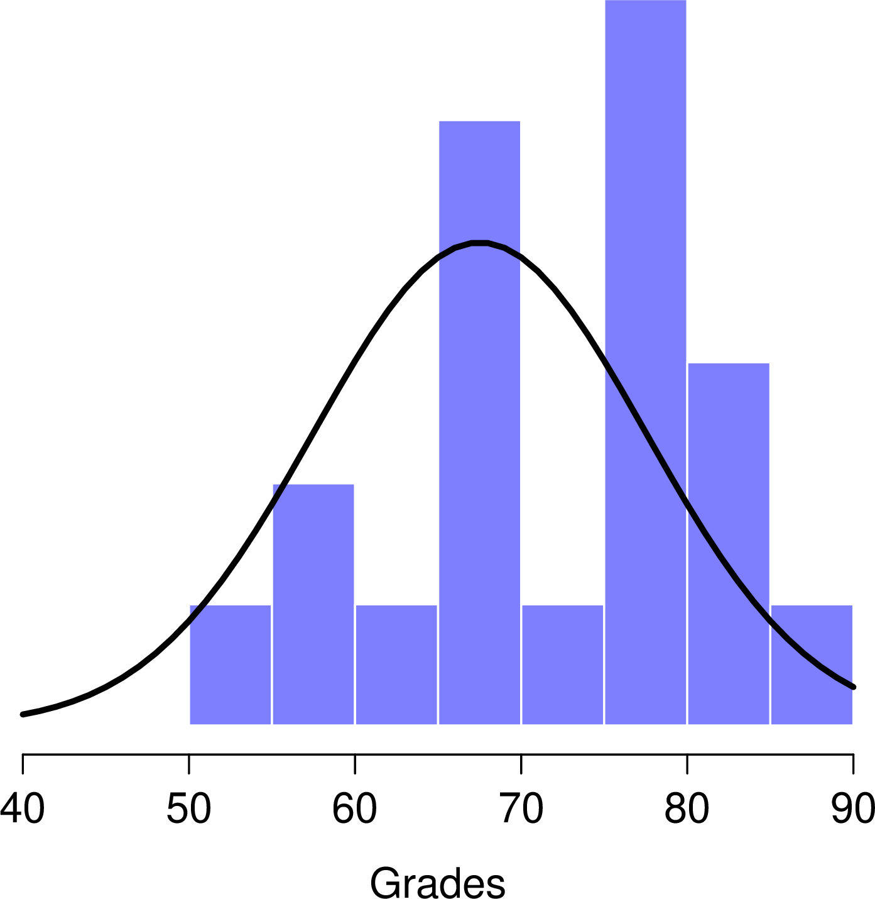
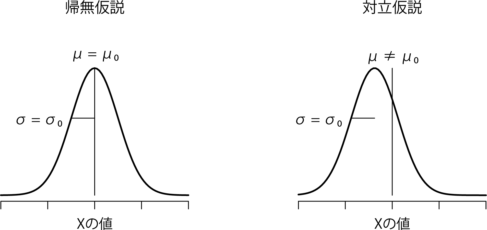
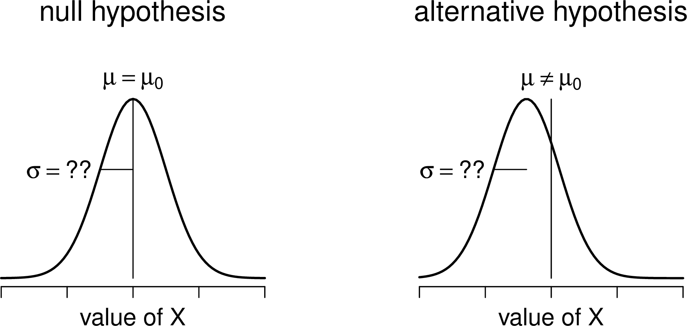
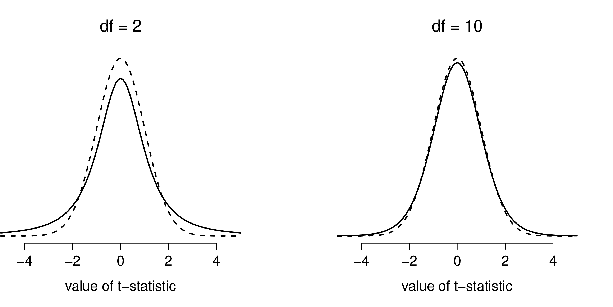
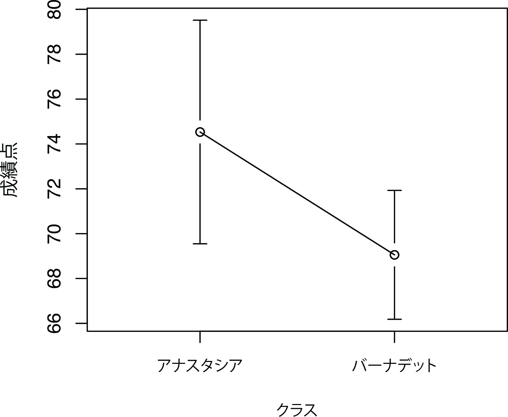
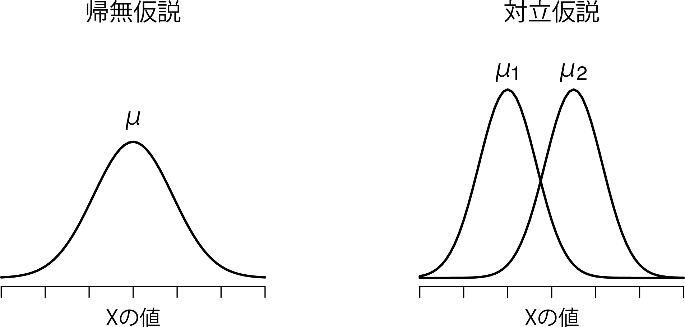
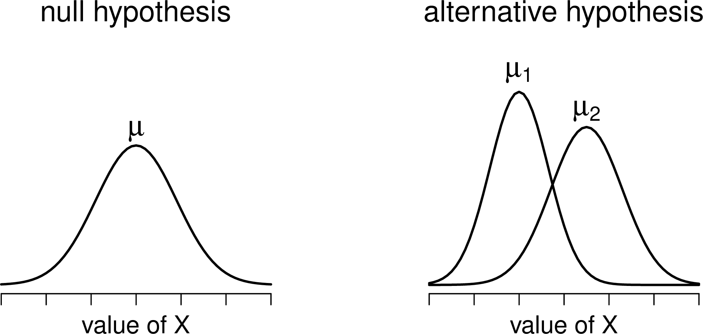
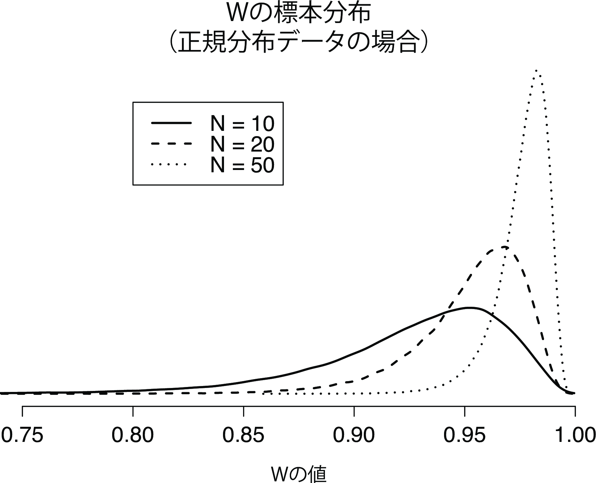
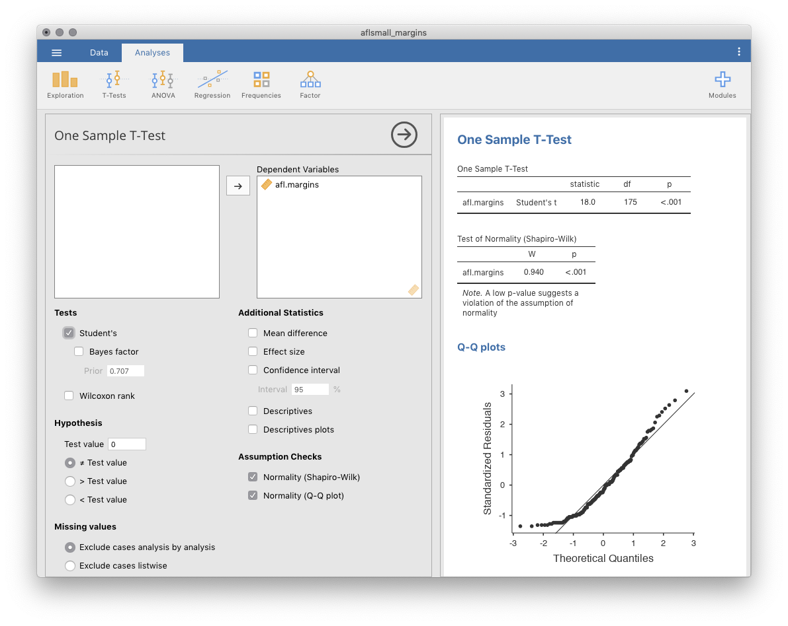

2つの平均値の比較 {#ch:ttest}
====================================

第\@ref(ch:chisquare)章では，結果変数が名義尺度で予測変数も名義尺度という場合を扱いました。実際の状況でもそのような場面はよくありますので，さまざまな場面で\(\chi^2\)（カイ2乗）検定が使用されているのを目にすることになるでしょう。しかし，結果変数が間隔尺度以上である場面の方がはるかに多く，そしてあるグループの結果変数の平均値が高いか低いかといった話になることも多いわけです。たとえば，子供のいない人よりも子供のいる人の方が不安の水準が高いのではないかとか，音楽を聴くと（音楽を聴いていないときよりも）作業記憶能力が低下するのではないかといったことに関心をもっている心理学者がいるかもしれません。また，医学の分野では，投薬によって血圧が上がったか下がったということに関心のある場合もあるでしょう。オーストラリアの在来植物にリンを与えると枯れてしまうのかどうかということに関心のある農学者もいるかもしれません^[わが家の庭で行った非公式な実験によれば，どうやらこれはその通りのようです。オーストラリアの在来種は地球上のどの地域よりも低いリン濃度に適応しているため，外来種がたくさん植えられた家で在来種を植えたい場合は，それらから離れた場所に植えるようにしましょう。ヨーロッパの植物用の栄養素は，オーストラリアの植物にとっては毒なのです。]。これらの状況はどれも，結果変数が間隔尺度または比率尺度の連続量であり，予測変数は2値の「グループ」変数です。つまりこれらは，2つのグループ間で平均値を比較したい場合ということになります。

平均値の比較をする場合，基本的には「\(t\)検定を使いなさい」ということになるのですが，\(t\)検定にもいくつかのタイプがあり，どのような疑問に答えたいかによってどれを使うかが変わってきます。そのため，本章の大半はさまざまな\(t\)検定の説明が中心となります。さまざまな\(t\)検定とは，1標本の\(t\)検定（セクション\@ref(sec:onesamplettest)），対応なしの\(t\)検定（セクション\@ref(sec:studentttest)とセクション\@ref(sec:welchttest)），そして対応ありの\(t\)検定（セクション\@ref(sec:pairedsamplesttest)）です。その後は片側検定（セクション\@ref(sec:onesidedttest)）についてと，少しだけコーエンの\(d\)（セクション\@ref(sec:cohensd)）についても説明します。これは，\(t\)検定における標準的な効果量の指標です。章の後半では，\(t\)検定の前提条件について取りあげ，それらが満たされない場合の対処法について説明します。ただし，こうした便利なツールの話をする前に，まずは\(z\)検定から始めたいと思います。

1標本の\(z\)検定 {#sec:onesampleztest}
------------------------------------------------


このセクションでは，さまざまな統計手法の中でももっとも役に立たないものの1つ，<span class="keyterm">\(z\)検定</span>について説明します。冗談抜きに，この検定が実際に使われることはまずありません。この検定の役目は，\(t\)検定を教えるための準備体操的なものとして非常に便利であるということぐらいです。なお，\(t\)検定はさまざまな統計手法の中でもおそらくもっとも多く使われ（過ぎ）ているツールです。

### 検定における推論の問題

\(z\)検定の背後にある考え方を説明するために，簡単な例を用いましょう。私の友人であるゼッポ教授が，相対評価方式で統計法入門クラスの採点をしました。そのクラスの平均点は67.5，標準偏差は9.5であったとしましょう。そして彼の何百人という学生のうち，20人が心理学専攻生であることがわかりました。好奇心から，私はふと疑問に思いました。心理学専攻の学生も他の学生と同じ成績（つまり平均点67.5）なのでしょうか，それともそれより高い，あるいは低い傾向にあるのでしょうか。ゼッポ教授は私に[<span class="filename">zeppo.csv</span>](data/zeppo.csv)ファイルを送ってくれたので，そのファイルで学生20名の<span class="rtext">grades</span>（成績）データを見ることができます。これを<span class="jamovi">jamovi</span>のスプレッドシートビューで見てみると次のような成績でした。

```{block2, type='rblock1'}
50 60 60 64 66 66 67 69 70 74 76 76 77 79 79 79 81 82 82 89
```

早速，「**Exploration**（探索）」>「**Descriptives**（記述統計）」で平均値を求めてみると^[ここでは<span class="rtext">X</span>の尺度水準を「Continuous（連続変数）」にする必要がありました。csvファイルを<span class="jamovi">jamovi</span>で開くと，この変数が名義尺度として認識されてしまうのです。今回の分析ではそれでは困ります。]，平均値は72.3点でした。

ふむ。どうやら心理学専攻生は全体平均より点数がやや*高そう*です。ただ，この標本の平均値\(\overline{X} = 72.3\)は仮定される母集団の平均値\(\mu = 67.5\)より高いのですが，標本サイズは\(N = 20\)しかなく，これはさほど大きくありません。もしかしたら単なる偶然かもしれませんね。

この疑問に答えるために，まずは現時点で私にわかっていることを書き出してみることにしましょう。まず，私には標本の平均値が\(\overline{X} = 72.3\)であることがわかっています。心理学専攻生の標準偏差とクラス全体の標準偏差が同じだとすると，母集団の標準偏差は\(\sigma = 9.5\)ということになります。また，ゼッポ教授は相対評価で採点していますので，心理学専攻生の成績は正規分布していると考えられます。

次に，私がデータから知りたいこともはっきりさせておきましょう。このケースでは，私の研究仮説は心理学専攻生の成績の*母集団*平均値\(\mu\)に関するものであり，この値は不明です。具体的には，私が知りたいのは\(\mu = 67.5\)かどうかということです。これだけの情報から，この問題を解決するための仮説検定を考え出すことはできるでしょうか。このデータと，このデータが属していると仮定される分布を図\@ref(fig:zeppo)に示しました。これだけでは何が正しい答えかまったくわかりませんね。そこで統計を使う必要があります。

```{r zeppo, warning=FALSE, echo=FALSE, out.width='40.8%', fig.align='center', fig.cap='心理学専攻生の成績（棒）とその母集団の理論的分布（実線）', echo=FALSE}

```

### 仮説検定の組み立て

仮説検定を組み立てるための最初のステップは，帰無仮説と対立仮説を明確にすることです。これはそれほど難しいことではありません。私たちの帰無仮説\(H_0\)は，「心理学専攻生の成績の母集団における真の平均値\(\mu\)は67.5点である」で，対立仮説は「母集団の平均値は67.5点*でない*」です。数学的な表記を用いて表すと，これらの仮説は次のようになります。

$$
\begin{array}{ll}
H_0: & \mu = 67.5 \\
H_1: & \mu \neq 67.5
\end{array}
$$

正直なところ，こう表記したからといって，それで問題に対する理解が深まるわけではありません。これは単に私たちがデータから知りたいことを簡潔にまとめただけです。そして，検定における帰無仮説（\(H_0\)）と対立仮説（\(H_1\)）の両方を図\@ref(fig:ztesthyp)に示してみました。
 
 ```{r ztesthyp, warning=FALSE, echo=FALSE, out.width='70.6%', fig.align='center', fig.cap='1標本のz検定（両側検定）で仮定される帰無仮説と対立仮説。帰無仮説と対立仮説は，母集団分布が正規分布であると仮定し，さらに母集団標準偏差が既知（\\(\\sigma_0\\)で固定）であると仮定している。 帰無仮説（左）は，「母集団平均値（\\(\\mu\\)）がある特定の値（\\(\\mu_0\\)）と等しい」である。対立替仮説は，「母集団の平均値がこの値とは異なる（\\(\\mu \\neq \\mu_0\\)）」である。', echo=FALSE}

```

先ほどのシナリオは，これらの仮説以外にも役立ちそうな背景情報をたくさん提供してくれています。具体的には，ここから次の2つの情報を得ることができます。

1.  心理学専攻生の成績は正規分布している。

2.  この得点の真の標準偏差\(\sigma\)は9.5である。

ここでは，この2つを完全に信頼できる事実として扱うことにします。実際には，この種の背景知識で絶対的に信用できるものは存在しませんし，こうした事実を利用したければ，これらが真であると*仮定*する必要があります。そしてそのような仮定が正しいということは保証されていませんので，それについては確認しなくてはなりません。ですが，今はこの部分については単純化しておくことにします。


次のステップは，\(H_0\)と\(H_1\)のどちらをとるべきかの判断を助けてくれるような検定統計量を見つけることです。仮説はどれも母集団の平均値（\(\mu\)）に関するものですから，開始地点としては標本の平均値（\(\overline{X}\)）がよさそうだというのは納得いくでしょう。私たちにできることというのは，標本の平均値\(\overline{X}\)と帰無仮説で予測される母集団の平均値との違いを見ることです。この例では，それは\(\overline{X} - 67.5\)を計算することです。より一般的には，帰無仮説で想定される母集団の平均値を\(\mu_0\)とすると，私たちが計算するものは次のものだということになります。

$$
\overline{X} - \mu_0
$$

そしてこの量が0に非常に近いならば，データが帰無仮説にあてはまっていることになります。しかしこの量が0からかなり離れていれば，帰無仮説を保持する価値はありません。ただ，この値がどれくらい0から離れていたら\(H_0\)を棄却できるのでしょうか。

これを知るためにはちょっとばかり工夫が必要です。また，先ほど書きだした，データが正規分布であるということと，母集団の標準偏差\(\sigma\)がわかっているという，2つの背景知識を利用しなくてはなりません。もし帰無仮説が真であり，真の平均値が\(\mu_0\)だとすると，これで私たちは母集団全体の分布について知っていることになります。つまり，母集団の平均値は\(\mu_0\)で，標準偏差は\(\sigma\)です。セクション\@ref(sec:normal)の表記を使用するとすれば，統計学者はこれを次のように書くでしょう。

$$
X \sim \mbox{Norm}(\mu_0,\sigma^2)
$$

さて，もしこれが真実だとしたら，\(\overline{X}\)の分布についてどのようなことが言えるのでしょうか。そう，以前に説明したように（セクション\@ref(sec:clt)参照），平均値\(\overline{X}\)の標本分布も正規分布であり，そして平均値\(\mu\)を持つということになるのです。ただし，この標本分布の標準偏差（\(\rm{\small SE}(\overline{X})\)），つまり*平均値の標準誤差*は次のようになります。

$$
\rm{\small SE}({\overline{X}}) = \frac{\sigma}{\sqrt{N}}
$$

別の言い方をすれば，帰無仮説が真の場合，平均値の標本分布は次のように書けます。

$$
\overline{X} \sim \mbox{Norm}(\mu_0,\rm{\small SE}({\overline{X}}))
$$

ここでちょっとしたトリックを使います。ここまでで，私たちは標本の平均値（\(\overline{X}\)）を標準得点（セクション\@ref(sec:zscore)）に変換できるようになりました。これは一般的には\(z\)と書かれますが，ここでは\(z_{\overline{X}}\)と書くことにします（このような表記を使用する理由は，ここで求めているのは標本平均値の標準得点であって，各観測値の標準得点を求めているのでは*ない*ということをわかりやすくするためです。普通，\(z\)得点というと後者を意味しますからね）。この変換を行うと，標本平均の\(z\)得点は次のようになります。

$$
z_{\overline{X}} = \frac{\overline{X} - \mu_0}{\rm{\small SE}({\overline{X}})}
$$

あるいは次のようにも書けます。

$$
z_{\overline{X}} =  \frac{\overline{X} - \mu_0}{\sigma / \sqrt{N}}
$$

そしてこの\(z\)得点が私たちの検定統計量になるのです。この値を検定統計量として使う利点は，これが標準正規分布になっているということです。\(z\)得点なわけですからね（こうなる理由を忘れてしまっている人は，セクション\@ref(sec:zscore)を見てください）。

$$
z_{\overline{X}} \sim \mbox{Norm}(0,1)
$$

つまり，元のデータがどのようなものであろうと，\(z\)統計量そのものの解釈はつねに同じになります。\(z\)統計量は，標本の平均値（\(\overline{X}\)）と帰無仮説で予測される母集団平均値（\(\mu_0\)）のずれの大きさを標準誤差の何倍という形で表したものなのです。また，元データの母集団パラメータが実際にどんな値であろうと，\(z\)検定の5%棄却域はつねに同じになり，図\@ref(fig:ztest)に示したようになります。そのため，遙か昔，人々が必要な統計量をすべて手で計算していた時代には，誰かが次のような表を公開してくれていました。


```{r, warning=FALSE, echo=FALSE,message=FALSE}
library(knitr)
library(kableExtra)

dt<- matrix(c(
.1,1.644854,1.281552,
.05,1.959964,1.644854,
.01,2.575829,2.326348,
.001,3.290527,3.090232
), ncol=3, byrow=T)

dtf<-as.data.frame(dt)
colnames(dtf)<-c('**\\(\\alpha\\)の水準**','**両側検定**','**片側検定**')

kable(dtf, align = c('c','c','c')) %>%
  kable_styling(bootstrap_options = "striped", full_width = F) %>%
  add_header_above(c(" ", "\\(z\\)の臨界値"=2))

```


そして研究者たちは，\(z\)統計量を手計算し，教科書にあるこうした臨界値を見て判断していたのです。

```{r ztest, warning=FALSE, echo=FALSE, message=FALSE, out.width='82.4%', fig.align='center', fig.cap='両側z検定(a)と片側z検定(b)の棄却域'}

require(magick); require(ggplot2); require(ggplotify); require(cowplot)

p1<-as.grob(image_read("img/ttest/zTestTwoTailed.png"))
p2<-as.grob(image_read("img/ttest/zTestOneTailed.png"))

plot_grid(p1,p2,labels=c("(a)", "(b)"),ncol=2,scale=.9,label_size=12)

```


### 手計算による計算例

さて，先ほど説明したように，\(z\)検定が実際場面で使用されることはほぼありません。実際にはまず使われないような検定なので，<span class="jamovi">jamovi</span>の基本ツールの中にもこの検定の機能はありません。ただ，この検定は信じられないほど簡単なので，手計算でも簡単に答えが出せます。それでは，ゼッポ教授クラスの成績データに戻りましょう。[<span class="filename">grades.csv</span>](grades.csv)データファイルを読み込んで最初にすべきことは標本の平均値を求めることですが，これはすでに終わっています（72.3）。母集団の標準偏差もすでにわかっています（\(\sigma = 9.5\)），そして帰無仮説が予測する母集団の平均値もわかっています（\(\mu_0 = 67.5\)）。さらに，標本サイズ（\(N=20\)）もわかっています。

では，平均値の（真の）標準誤差を計算してみましょう（電卓を使えば簡単です）。

$$
\begin{array}
\mbox{標準誤差} &= \displaystyle\frac{\mbox{標準偏差}}{\sqrt{N}} 
   = \displaystyle\frac{9.5}{\sqrt{20}} 
   = 2.124265
\end{array}
$$
         

そして，ここから\(z\)得点を計算します。

$$
\begin{array}
\mbox{z} &= \displaystyle\frac{\overline{X}-\mu}{\mbox{標準誤差}} 
   = \displaystyle\frac{72.3 - 67.5}{2.124265} 
   = 2.259606
\end{array}
$$

ここまで来たら，昔ながらのやり方で臨界値の表から2.26がどのくらい大きいかを見てみましょう。私たちの仮説は両側（心理学専攻の学生が他の学生よりも統計の成績が良いか悪いかについてははっきりした理論がない）ですので，ここでの仮説検定は両側検定です。先ほどの表を見てみると，2.26という値は\(\alpha = .05\)で有意になるための臨界値である1.96よりも大きいですが，\(\alpha = .01\)の有意水準で必要な2.58よりは小さな値です。ここから，私たちは5%水準で有意な効果があったと結論づけ，それを次のように書くことになります。

> 心理学専攻生の標本における統計法の成績点は平均73.2点であることから，母集団の真の標準偏差が9.5であると仮定した場合，心理学専攻生の成績はクラス平均点とは有意に異なる値であったと言える（\(z = 2.26\), \(N=20\), \(p<.05\)）。

### \(z\)検定の前提条件 {#sec:zassumptions}

前にも説明したように，統計検定はすべての何らかの仮定に基づいています。検定の中には合理的な仮定をするものもありますが，そうでないものもあるのです。先ほど説明した1標本の\(z\)検定には，次にあげる3つの基本的な仮定があります。

-   **正規性**　 よく言われるように，\(z\)検定は母集団の真の分布が正規分布であるということを仮定しています^[実際にはこれは少し言い過ぎです。厳密に言えば，\(z\)検定は平均値の標本分布が正規分布していることを仮定しているのです。母集団が正規分布なら，その平均値の標本分布も正規分布ですから，必然的にこれにあてはまります。ただし，中心極限定理の説明のところで見たように，母集団の分布そのものは正規分布でなくても，平均値の標本分布が正規分布になることはありうる（というか，よくある）ことです。ただし，真の標準偏差がわかっているというまったくもって馬鹿げた仮定があることを考えれば，これをこれ以上深く掘り下げる意味はありません。]。多くの場合，これはかなり合理的な仮定と言えます。それに，もしこの仮定が満たされているかどうかが心配なら，それを確認することもできます（セクション\@ref(sec:shapiro)参照）。

-   **独立性**　 この検定における2つめの仮定は，データに含まれる観測値がお互いに相関していない，あるいはお互いに何らかの形で関連していないというものです。これを統計的に確認するのは簡単ではありません。これは実験が正しくデザインされているかどうかによって決まるからです。この仮定に反する明らかな（そして愚かな）例は，データファイルの1つの観測値を何度も「コピペ」して巨大な「標本サイズ」のデータを作成したような場合です。この場合，純粋な観測値は1つしか含まれていません。さすがにここまでのことはないにしても，「各観測値は関心のある母集団からの完全無作為標本である」と本当に言えるかどうかについては少し注意して考える必要があります。実際には，この仮定はけっして満たされることはありません。それでも私たちは，研究をデザインする際にはデータ相互の関連性を最小化しようと最善を尽くすのです。

-   **標準偏差が既知である**　 \(z\)検定の3つめの仮定は，母集団の真の標準偏差が研究者にすでにわかっている（既知である）というものです。これはまったく馬鹿げた話です。実際のデータ分析で，母集団の真の平均値（\(\mu\)）がわからないのに標準偏差（\(\sigma\)）がわかっているという状況などありえません。言い換えれば，この仮定は*つねに*誤りということです。

\(\sigma\)がわかっていると仮定するのは馬鹿げていますから，これについてはもう忘れてしまいましょう。ということで，私たちは\(z\)検定という退屈な国を抜け出し，ユニコーンや妖精，こびとさんたちのいる，\(t\)検定という魔法の国に旅立つことになるのです。

1標本の\(t\)検定 {#sec:onesamplettest}
-----------------------------------------------

少しばかり考えた後，心理学専攻生の成績の標準偏差とゼッポ教授の授業の他の学生たちの標準偏差が同じであると仮定するのはやめた方がよいだろうという判断にいたりました。だって，心理学専攻生の平均値は他と違うという仮説について考えているのに，そこで標準偏差がまったく同じだと考えるのは変ですよね。だったら，\(\sigma\)の真の値を知っているなどと仮定することは絶対にやめておくべきでしょう。するとこれは\(z\)検定の前提条件を満たさないことになりますので，ある意味振り出しに戻ってしまったわけです。しかし，これで完全に道が絶たれたわけではありません。生データはまだありますし，そこから母集団標準偏差の*推定値*を求めることなら可能です。そしてそれを計算すると9.52になります。つまり，\(\sigma= 9.5\)だと言うことはできなくても，\(\hat\sigma= 9.52\)だと言うことは*できる*のです。

よしよし，これで\(z\)検定ができるぞと思った人もいるかもしれませんね。ですが，そうするためには真の標準偏差と仮定される9.5の代わりに，推定される標準偏差9.52を使用することになります。そして，それでも有意な結果は得られるだろうと聞いても意外ではありませんね。ただ，この方法は大体は正しいのですが，*完全に*は正しくありません。なぜなら，先ほどと違って母集団標準偏差の*推定値*を使用しているからです。母集団の真の標準偏差が実際にはわからないという事実に対応するためには，ちょっとした修正を行う必要があるのです。もしかしたら，このデータは単なるまぐれかもしれません。ですから，もしかしたら母集団の真の標準偏差は11だったりするかもしれないわけです。もし\(\sigma=11\)という仮定が正しかったとして，それで\(z\)検定を実行すると，結果は「*有意でない*」になります。これは問題ですね。では，この点についてこれから説明していきます。

```{r ttesthyponesample, warning=FALSE, echo=FALSE, out.width='70.6%', fig.align='center', fig.cap='1標本のt検定で仮定される帰無仮説と対立仮説。\\(z\\)検定（図11.2）との類似点に注意。帰無仮説は，「母集団の平均値（\\(\\mu\\)）が特定の値（\\(\\mu_0\\)）と等しい」というもので，対立仮説はそうではないというものである。\\(z\\)検定のように，データは正規分布が仮定されるが，母集団標準偏差（\\(\\sigma\\)）は事前にわかっているわけではない。', echo=FALSE}

```


### \(t\)検定の導入

こうしたあいまいさはやっかいな問題ですが，この問題は，当時ギネスの醸造所で化学者として働いていた[@Box1987[](参照)]ウィリアム・シーリー・ゴセットという人物によって1908年に解消されました[@Student1908]。ギネス社は従業員が統計分析に関して発表することを快く思っていなかったため（どうもそれは企業秘密だと考えていたようです），彼は自分の研究を「スチューデント（とある研究家）」という偽名で発表しました。そのため，\(t\)検定は現在でも<span class="keyterm">スチューデントの\(t\)検定</span>と呼ばれています。ゴセットは，真の標準偏差が完全にはわからないという事実にどう対処すべきかについて重要な発見をしました^[まあ，ある意味では，です。歴史についての私が理解する限りでは，ゴセットが考案した解決法は部分的なものでした。この問題への一般的な解決法は，サー・ロナルド・フィッシャーが考案したものです。]。その答えは，標本分布をわずかに変化させればよいということだったのです。\(t\)検定では，検定統計量は\(t\)統計量と呼ばれ，この値はすでに説明したのとまったく同じ方法で算出されます。もし帰無仮説における真の平均値が\(\mu\)で，標本の平均値が\(\overline{X}\)，母集団標準偏差の推定値が\(\hat{\sigma}\)だったとすると，\(t\)統計量は次のように求められます。

$$
t = \frac{\overline{X} - \mu}{\hat{\sigma}/\sqrt{N} }
$$

この式が\(z\)の式と違うところは，すでにわかっている真の値（\(\sigma\)）の代わりに推定値（\(\hat{\sigma}\)）を使用している点だけです。そしてもしこの推定値が\(N\)個の観測値を元に算出されたものだとすると，その標本分布は<span class="keyterm">自由度</span>（df）が\(N-1\)の\(t\)分布になるのです。\(t\)分布は正規分布と非常によく似ていますが，セクション\@ref(sec:otherdists)で説明したように，裾がより「重い」分布になっています（図\@ref(fig:ttestdist)）。ただし，自由度が大きくなると\(t\)分布は標準正規分布とほぼ同じになります。これは当然のことなのです。仮にあなたが標本サイズ\(N\)=70,000,000というようなデータを持っていたとしたら，そこから求めた標準偏差の「推定値」はかなり正確なものになりますよね。すると，\(N\)が大きい場合には，\(t\)検定は\(z\)検定とほぼ同じ振る舞いをするようになるはずです。そして，実際その通りなのです。

```{r ttestdist, warning=FALSE, echo=FALSE, out.width='76.5%', fig.align='center', fig.cap='自由度2（左）と自由度10（右）の\\(t\\)分布，および比較目的で標準正規分布（平均0と標準偏差1）点線でプロットしたもの。\\(t\\)分布は正規分布よりも重い裾（高い尖度）を持つことに注意。この違いは，自由度が非常に小さい場合にはかなり誇張されるが，自由度が大きな値の場合は無視できる。言い換えると，自由度が大きな値の場合，\\(t\\)分布は本質的に正規分布と同じである。', echo=FALSE}

```


### <span class="jamovi">jamovi</span>での検定

ご想像の通り，\(t\)検定の仕組みは\(z\)検定とほぼ同じです。ですから，退屈な計算を繰り返してこの値の求め方をくどくど説明する意味はないでしょう。計算方法は，標準偏差の*推定値*を使う以外は先ほどと同じです。ただし，仮説の検定には正規分布ではなく\(t\)分布を使用します。ですから，また手作業で計算する代わりに<span class="jamovi">jamovi</span>で\(t\)検定の実行方法の説明に進みましょう。<span class="jamovi">jamovi</span>には，は非常に柔軟な\(t\)検定専用の分析メニューがありますし（ここからさまざまなタイプの\(t\)検定を実施できます），使い方もとても簡単です。分析を実行するには，「**Analyses**（分析）」タブの「**T-Tests**（t検定）」>「**One Sample T-Test**（1標本のt検定）」と進み，関心のある変数（<span class="rtext">X</span>）を「**Variables**（変数）」ボックスに入れ，帰無仮説の平均値（67.5）を「**Hypothesis**（仮説）」の「**Test value**（検定値）」ボックスに入力するだけです。いたって簡単ですね。図\@ref(fig:ttestone)を見てください。ほんの一瞬で，\(t\)検定統計量は2.25で，自由度は19，\(p\)値は0.036であるという結果を得ることができます。


```{r ttestone, warning=FALSE, echo=FALSE, out.width='82.4%', fig.align='center', fig.cap='<span class="jamovi">jamovi</span>での1標本t検定', echo=FALSE}
knitr::include_graphics("img/ttest/ttest_one.png")
```


また，これら以外の2つの項目にも注目してください。それは，95%信頼区間と効果量の指標です（効果量については後で詳しく説明します）。見方はわかりますね。さて，この結果で何をしたらよいでしょうか。ここでは，私たちはこのくだらない例について真面目に分析しているという前提で話をしているわけですから，私たちはこの結果が統計的に有意であった（すなわち\(p<.05\)）ということを知って大喜びすればよいということになります。そして，この結果は次のように報告されることになるでしょう。

> 心理学専攻生の成績の平均値は72.3点で，全体の平均値である67.5点よりもわずかに高かった（\(t(19) = 2.25\), \(p<.05\)）。なお，95%信頼区間は67.8点から76.8点の間である。

\(t(19)\)の部分は，「\(t\)統計量の自由度が19である」ということを省略して書いた形です。なお，信頼区間については報告されないこともよくあります。また，この例よりもずっとコンパクトな形で書かれることもあります。たとえば，次のように統計ブロックに信頼区間を含めることも珍しくありません。

> \(t(19) = 2.25\), \(p<.05\), CI\(_{95} = [67.8, 76.8]\)

短い行に専門用語がたくさん詰め込まれているので，なんだか賢そうに見えますね^[冗談抜きに，私は真実はこの反対だと思っています。結果セクションに数字しか書かれていないような報告をみると，私はとても疑わしく思ってしまうのです。それは単に私が傲慢でやなヤツだからなのかもしれませんが，自分たちの分析結果を読み手に説明しようともせず解釈しようともしないのは，著者自身も結果を理解できていないか，あるいは著者が手抜きをしているかのどちらかだと私には思えます。論文や報告書の読み手は賢くても無限に辛抱強いわけではありません。できるだけ読み手を困らせないようにしてください。]。

### 1標本\(t\)検定の前提条件  {#sec:ttestoneassumptions}

では，1標本の\(t\)検定における仮定にはどのようなものがあるでしょうか。この\(t\)検定は，基本的に\(z\)検定の仮定から標準偏差が既知であるという部分を除いただけです。ですから，標準偏差が既知であるという部分を除き，\(t\)検定の仮定は\(z\)検定と同じになります。つまり次の通りです。

-   **正規性**　 \(t\)検定でも母集団の分布が正規分布であることを仮定します^[注： \(z\)検定のところで母集団でなく標本分布が正規分布していればよいと説明したように，じつは\(t\)検定でも母集団の正規性を仮定しなくてよいような形に前提を弱めることも*できなくはありません*。ただ，\(t\)検定でそれをやろうとすると，かなりややこしくなるのです。\(z\)検定の場合と同じように，母集団の正規性についての仮定を\(\overline{X}\)の標本分布が正規分布であると置き換えることはできます。ですが，ここでは標本による標準偏差の推定値も使用していて，そうすると\(\hat{\sigma}\)の標本分布はじつは\(\chi^2\)ででなくてはならないのです。これでは話がかなりややこしくなりますね。それに，この母集団でなく標本分布の正規性を仮定する形というのは実際にはほとんど使われません。そして幸いにも，母集団が正規分布の場合にはこの前提が両方とも満たされます。]。そして先ほども述べたように，この前提が満たされているかどうかはツールで確認することができ（セクション\@ref(sec:shapiro)），この前提が満たされない場合には別の検定を使用することもできます（セクション\@ref(sec:wilcox)）。

-   **独立性**　 ここでもまた，標本の各観測値がお互いに独立に得られたものであると仮定します。細かい部分については\(z\)検定のところでした説明（セクション\@ref(sec:zassumptions)）を参照してください。

全体として，これら2つの仮定はそれほど不合理なものではありません。そういうこともあって，仮説上の母集団の平均値と標本の平均値を比較する手段として，1標本の\(t\)検定は実際にさまざまな場面で使用されています。

対応なしの\(t\)検定（スチューデント検定） {#sec:studentttest}
---------------------------------------------------------------------

1標本の\(t\)検定は広く利用されていますが，\(t\)検定のもっとも一般的な例とまでは言えません^[もっとも単純なものではあるのですけどね。だからこそ，この検定から説明を始めたのです。]。異なる2つのグループについての観測値があるという場面の方がずっと多いからです。心理学で言えば，参加者を異なる2グループに分ける場合がそうです。そこでは，各グループがそれぞれ異なる実験条件に対応します。そうした研究では，各参加者について関心ある結果変数を測定することになり，そしてそこでの研究仮説は「2つのグループが同じ母集団平均値を持っている」かどうかということになります。そしてこのような場面に使用できるものとして，対応なしの\(t\)検定（独立標本\(t\)検定）があります。

### データ

33人の学生がハーポ教授の統計法の授業を受けているとしましょう。ハーポ教授の成績評価は相対評価ではありません。じつは，ハーポ教授の評価点は少しばかり謎めいていて，私たちにはそのクラス全体の平均点が何点なのかがまったくわかりません。なお，その授業には，アナスタシアとバーナデットという2人の個人指導員がいます。そして\(N_1 = 15\)人の学生はアナスタシアの指導を受け，\(N_2 = 18\)人はバーナデットの指導を受けています。ここで研究上の問いとして私が関心を持っているのは，アナスタシアまたはバーナデットのどちらか一方がもう一方より指導員として優れているということがあるのか，それとも2人はほぼ同程度なのかということです。ハーポ教授は，成績が入った[<span class="filename">harpo.csv</span>](data/harpo.csv)ファイルを私にメールで送ってくれています。いつものように，私はファイルを<span class="jamovi">jamovi</span>に読み込み，どのような変数が含まれているのかを見てみました。そこには<span class="rtext">ID</span>，<span class="rtext">grade</span><span class="rtext">tutor</span>の3つの変数が入っています。<span class="rtext">grade</span>変数には学生の成績が含まれていますが，<span class="jamovi">jamovi</span>に読み込んだときにこの変数には適切な尺度水準が割り当てられていませんでした。そこで私はこれを連続変数に設定し直しました（セクション\@ref(sec:coercion)参照）。<span class="rtext">tutor</span>変数は，各学生の指導員がアナスタシアとバーナデットのどちらであるかを示す変数です。

この平均値と標準偏差は「**Exploration**（探索）」>「**Descriptives**（記述統計）」で計算することができます。すると次のような要約結果になりました。

```{r, warning=FALSE, echo=FALSE,message=FALSE}
library(knitr)
library(kableExtra)

dtf<-data.frame('平均値' =c(74.53,69.06), '標準偏差'=c(9.00,5.77),N=c(15,18))
rownames(dtf)<-c('アナスタシアの指導学生','バーナデットの指導学生')
kable(dtf, align = c('c','c','c')) %>%
  kable_styling(bootstrap_options = "striped", full_width = F)
```


データについてもっと詳しく知るために，今度はヒストグラムを作成してみました（これには<span class="jamovi">jamovi</span>ではなく<span class="R">R</span>を使用しています）。図\@ref(fig:harpohist)は個人指導員別の成績分布を示したものです。同じく，両グループの学生の平均値および信頼区間を示した簡単な図も作成しました（図\@ref(fig:ttestci)）。

```{r harpohist, warning=FALSE, echo=FALSE, message=FALSE, out.width='82.4%', fig.align='center', fig.cap='アナスタシアの指導学生（図の(a)）とバーナデットの指導学生（図の(b)）の成績分布のヒストグラム。これらのグラフからは，アナスタシアの指導学生の方が平均して若干優れた成績を収めているように見える。', echo=FALSE}
require(magick); require(ggplot2); require(ggplotify); require(cowplot)

p1<-as.grob(image_read("img/ttest/HarpoAnastasia.png"))
p2<-as.grob(image_read("img/ttest/HarpoBernadette.png"))
plot_grid(p1,p2,labels=c("(a)", "(b)"),ncol=2,scale=.9,label_size=12)
```


```{r ttestci, warning=FALSE, echo=FALSE, out.width='52.9%', fig.align='center', fig.cap='図の点はアナスタシアとバーナデットの指導学生の平均点，誤差線は平均値の95％信頼区間を示す。図からは両者の間に違いがあるようにも見えるが，確かなことはわからない。', echo=FALSE}

```


### 検定の導入

<span class="keyterm">対応なしの\(t\)検定</span>には，スチューデントの方法とウェルチの方法の2種類があります。このセクションで説明するのはスチューデントの\(t\)検定ですが，これはウェルチの\(t\)検定に比べると単純な分，より多くの仮定による制約があります。両側検定をしたいとすると，最終的な目標は2つの「独立標本」データが同じ母集団から抽出されたものである（帰無仮説）か，異なる平均値を持つ（対立仮説）かを判断することとなります。「独立標本」というのは，2つの標本の間に何も特別な関係がない（対応がない）ということを意味しています。今はまだよくわからないかもしれませんが，対応ありの\(t\)検定について学べばそこははっきりするはずです。ここでは次のようにだけ説明しておきます。私たちの実験デザインが参加者を2グループのうちのいずれかに無作為に割り当てるようなものである場合，その2つのグループにおける結果指標の平均値を比較したければ，（対応ありの\(t\)検定でなく）対応なし（独立標本）の\(t\)検定を使用するのです。

では，まずグループ1（たとえばアナスタシアの学生）の母集団の平均値を\(\mu_1\)としましょう，そしてグループ2（たとえばバーナデットの学生）の母集団の平均値を\(\mu_2\)とします^[ここではいつもおかしな疑問が持ち上がります。それは，このケースで言及されている母集団というのは一体何なのかということです。ハーポ教授の授業を実際に受けている学生全体（33人）でしょうか。この授業を受けたかもしれない全員（未知の人数）でしょうか。それとも他の何かでしょうか。どれを選ぶかは重要でしょうか。一般的な統計法入門の授業ではこの点についてはごまかすことが多いのですが，毎年のように学生からこの質問を受けるので，ここで簡単な答えを示しておこうと思います。理屈の上ではそうです。重要です。もし「実際の」母集団が何であるかという定義を変えたら，観測される平均値（\(\overline{X}\)）の標本分布も変わるからです。\(t\)検定では観測値が無限大の母集団から無作為抽出されていることが仮定されていますが，実際の世界でそのようなことはあり得ないということを考えると，\(t\)検定は間違いであるとも言えるのです。ただし，実用面においては，それはたいしたことではありません。その仮定がつねに誤りであったとしても，検定の振る舞いに問題が生じることはありません。ですからこれについては普通は無視します。]。そしていつものように，それぞれのグループの標本の平均値を\(\overline{X}_1\)と\(\overline{X}_2\)とします。私たちの帰無仮説は，「2つの母集団の平均値は同じ（\(\mu_1 = \mu_2\)）」というものですので，対立仮説は「それらは同じでない（\(\mu_1 \neq \mu_2\)）」となります（図\@ref(fig:ttesthyp)）。

```{r ttesthyp, warning=FALSE, echo=FALSE, out.width='70.6%', fig.align='center', fig.cap='スチューデントの\\(t\\)検定で仮定される帰無仮説と対立仮説。帰無仮説は，「両グループが同じ平均値（\\(\\mu\\)）を持つ」と仮定するのに対し，対立仮説は「2つのグループがそれぞれ異なる平均値\\(\\mu_1\\)と\\(\\mu_2\\)を持つ」と仮定する。 母集団は正規分布であると仮定され，対立仮説では両グループの平均値は異なるとするが，標準偏差は同じであると仮定する。', echo=FALSE}

```

これを数学っぽく書くと次のようになります。

$$
\begin{array}{ll}
H_0: & \mu_1 = \mu_2  \\
H_1: & \mu_1 \neq \mu_2
\end{array}
$$

このシナリオに適用できる仮説検定を組み立てるために，まずは「帰無仮説が真であれば，母集団の平均値の差は*ぴったり*0になる（\(\mu_1 - \mu_2 = 0\)）」というところから始めます。結果的に，検定統計量は2つの標本平均値間の差に基づくものになるはずです。なぜなら，帰無仮説が真の場合，\(\overline{X}_1 - \overline{X}_2\)は0に*かなり近く*なると期待できるからです。しかし，1標本の検定（つまり1標本の\(z\)検定と1標本の\(t\)検定）でもそうだったように，私たちはこの差が0に*どの程度*近いかを正確に知る必要があります。この問題への答えは，多かれ少なかれ先ほどと同じです。先ほどと同様に標準誤差の推定値（SE）を計算し，そして平均値の差をこの推定値で割ってやればよいのです。つまり，<span class="keyterm">\(t\)統計量</span>は次のようになります。

$$
t = \frac{\overline{X}_1 - \overline{X}_2}{\mbox{SE}}
$$

 あとは，標準誤差の推定値が実際にいくらであるかを求めればよいのです。ただし，これはここまでに見てきた2つの検定に比べると少しばかりややこしくなります。ですから，この部分について少し詳しく見ていくことにしましょう。

### 標準偏差の「プールされた」推定値

「スチューデントの\(t\)検定」では，2つのグループの母集団が同じ標準偏差を持つと仮定します。つまり，母集団の平均値が同じかどうかに関わらず，母集団の標準偏差は同じである（\(\sigma_1 = \sigma_2\)）と仮定するのです。2つの標準偏差は同じであると仮定するので，添え字を取り払ってどちらも単に\(\sigma\)とすることができます。さて，これをどうやって推定すればよいでしょうか。標本が2つあるのに，どうやって1つの標準偏差を推定するのでしょう。基本的には，その2つを平均してやればよいのです。まあ，ある意味で，ですが。正確には，2つの*分散*の推定値を用いてその*重みつき*平均値を求めることになります。そしてそれを<span class="keyterm">プールされた分散推定値</span>として使用します。それぞれの標本には，各標本の観測値の個数&minus;1で重み付けを行います。数学的には，次のように書くことができます。

$$
\begin{array}{rcl}
w_1 &=& N_1 - 1\\
w_2 &=& N_2 - 1
\end{array}
$$

さて，2つの標本それぞれの重みづけが決まったので，2つの分散推定値（\({\hat\sigma_1}^2\)と\({\hat\sigma_2}^2\)）の重みづけ平均を求めてプールされた分散の推定値を計算します。

$$
\hat\sigma^2_p = \frac{w_1 {\hat\sigma_1}^2 + w_2 {\hat\sigma_2}^2}{w_1 + w_2}
$$

最後に，プールされた分散の推定値にルートをかけて，プールされた標準偏差の推定値という形にします。

$$
\hat\sigma_p = \sqrt{\frac{w_1 {\hat\sigma_1}^2 + w_2 {\hat\sigma_2}^2}{w_1 + w_2}}
$$

この式で\(w_1 = N_1 -1\)と\(w_2 = N_2 -1\)と置き換えると，非常にごちゃごちゃした式になってしまいますね。どちらかというと，プールされた標準偏差推定値の式の書き方としてはそのごちゃごちゃした式の方が「標準」のようです。ただ，それは私の好みではありません^[そうです。私には，プールされた標準偏差の推定値に対する「好み」の考え方があるのです。だから何？って感じでしょうけど。]。

### プールされた推定値の別の説明

私は次のような考え方の方が好きです。まず，私たちのデータセットには実際に\(N\)個の観測値が含まれており，それらは2つのグループに分けられます。ここで，\(i\)番目の学生が\(k\)番目のグループの指導を受けたということを\(X_{ik}\)と表記しましょう。つまり\(X_{11}\)は1人目の学生がアナスタシアの指導を受けた，そして\(X_{21}\)は2人目の学生もアナスタシアの指導を受けた，ということになります。また，私たちの手元には\(\overline{X}_1\)と\(\overline{X}_2\)という2つのグループの平均値もあります。これを「一般化」して\(\overline{X}_k\)，つまり\(k\)番目の指導グループの平均値，のように表記します。ここまではいいでしょうか。さて，それぞれの学生は2つのうちいずれかのグループになりますから，各学生のグループの平均値からの偏差は次のようになります。

$$
X_{ik} - \overline{X}_k
$$

ここまできたら，あとは単純にこの偏差（つまり，各学生成績のグループ平均値からの差）が使えそうですよね。思い出してください。分散は偏差の2乗の平均値です。ではその通りにしてみましょう。数学的にはこれは次のように書けます。

$$
\frac{\sum_{ik} \left( X_{ik} - \overline{X}_k \right)^2}{N}
$$

\(\sum_{ik}\)という表記は，「すべての指導グループのすべての学生について計算してね」というのをものぐさに書いただけです。なぜなら「\(ik\)」のそれぞれが各学生に対応しているからです^[もっと正確な表記については第\@ref(ch:anova)章で紹介します。]。ただし，第\@ref(ch:estimation)章で見たように，\(N\)で割って求める分散は母集団の分散に対する偏りありの推定値です。これを修正するために，そこでは\(N-1\)で割って分散を求めました。ただし，その時も説明したように，このような偏りが生じるのは分散の推定値が標本の平均値を元に計算されているからです。標本の平均値は母集団の平均値とまったく同じではないので，それが分散の推定値に体系的な偏りを生むわけです。しかも今度は*2つ*の標本平均値を使用しています。だとすると，偏りはもっと大きくなるのでしょうか。そう，その通りです。だとしたら，プールされた分散推定値を計算するためには\(N-1\)ではなく\(N-2\)で割る必要があるのでしょうか。そう，そうなのです。

$$
\hat\sigma^2_p = \frac{\sum_{ik} \left( X_{ik} - \overline{X}_k \right)^2}{N -2}
$$

そしてこの値にルートをかければ\(\hat{\sigma}_p\)が得られます。これでプールされた標準偏差の推定値が得られました。要するに，プールされた標準偏差推定値の計算は何も特別なものではないのです。これは通常の標準偏差の計算と大して変わりません。

### 検定の完了

これでプールされた標準偏差の推定値が求まりました。どちらの方法で計算しようが値は同じです。ここからは，この馬鹿げた\(p\)という添え字は省き，この推定値を単に\(\hat\sigma\)と呼ぶことにします。よろしいでしょうか。さて，例の仮説検定の話に戻りましょう。私たちがプールされた推定値を計算したのは，これが*標準誤差*の推定値を計算するうえで役に立つと考えたからです。ですが，これは*何*の標準誤差なのでしょうか。1標本の\(t\)検定では，これは標本平均の標準誤差（\(\rm{\small SE}(\overline{X})\)）でした。そして\(\rm{\small SE}(\overline{X}) = \sigma / \sqrt{N}\)で，これが\(t\)統計量の式の分母だったわけです。ただ，今度の場合は，*2つ*の標本平均値があります。そして私たちに関心があるのは，2グループの平均値の差（\(\overline{X}_1 - \overline{X}_2\)）です。そのため，ここで分母として必要な標準誤差は，実際には平均値間の<span class="keyterm">差の標準誤差</span>ということになります。2つの変数が同じ標準偏差を持つ限り，標準誤差の推定値は次のようになります。

$$
\rm{\small SE}(\overline{X}_1 - \overline{X}_2) = \hat\sigma \sqrt{\frac{1}{N_1} + \frac{1}{N_2}}
$$

 そして\(t\)統計量はこうなります。

$$
t = \frac{\overline{X}_1 - \overline{X}_2}{\rm{\small SE}(\overline{X}_1 - \overline{X}_2)}
$$

1標本の検定で見たのと同様に，この\(t\)統計量の標本分布は，帰無仮説が真，かつ検定のすべての前提条件が満たされている場合に\(t\)分布になります（びっくりですね）。ただ，自由度は若干異なります。いつものように，自由度はデータ要素の数から制約の数を引いたものと考えましょう。この場合，\(N\)個の観測値があり（標本1には\(N_1\)個，標本2には\(N_2\)個），そして制約の数（標本の平均値）は2つあります。ですから，この検定における自由度の合計は\(N-2\)となります。

### <span class="jamovi">jamovi</span>での検定

当然のことながら，対応なしの\(t\)検定も<span class="jamovi">jamovi</span>で簡単に実行できます。検定の対象となる結果変数は学生の<span class="rtext">grade</span>（成績）で，それらは各クラスの<span class="rtext">tutor</span>（指導員）でグループ分けされています。もうこれでおわかりですね。<span class="jamovi">jamovi</span>でやるべきことは，関連する分析の画面（「**Analyses**（分析）」タブの「**T-Tests**（t検定）」>「**Independent Samples T-Test**（対応ありのt検定）」）で「**Dependent Variables**（従属変数）」のボックスに<span class="rtext">grade</span>変数を，そして「**Grouping Variable**」グループ変数のボックスに<span class="rtext">tutor</span>変数を移動するだけです。その様子を図\@ref(fig:ttestind)に示しました。

```{r ttestind, warning=FALSE, echo=FALSE, out.width='82.4%', fig.align='center', fig.cap='<span class="jamovi">jamovi</span>における対応なしのt検定。いくつか便利なオプションもオンにしてある。', echo=FALSE}
knitr::include_graphics("img/ttest/ttest_ind.png")
```


結果の出力はもうおなじみですね。まず，最初に示されるのが検定の種類で，その後に使用した従属変数（結果変数）の名前が示されています。そして，その後に検定結果です。先ほどの検定の場合と同様に，検定結果の部分は\(t\)統計量，自由度，そして\(p\)値で構成されています。最後のセクションには別の2つの値が報告されています。これは信頼区間と効果量です。効果量については後で説明します。ですが，信頼区間についてはここで説明しておいた方がよいでしょう。

この信頼区間が実際に何を指しているのかはしっかり理解しておいてください。これはグループ平均値の*差*の信頼区間です。私たちの例では，アナスタシアの指導学生は平均74.53点でバーナデットの指導学生は平均69.06点でした。ですから，この2つの標本の平均値の差は5.48です。しかしもちろん，この2つの母集団の平均値の差は，実際にはこれより大きいこともあれば小さいこともあり得るわけです。図\@ref(fig:ttestind)に報告されている信頼区間は，0.20から10.76という範囲が平均値の真の差を捉えている確率が95%であるということを示しています。信頼区間がどのようなものだったかを忘れてしまった人はセクション\@ref(sec:ci)を読み返してください。

ともあれ，2つのグループの間の差は（かろうじて）有意ですので，その結果を書くとしたら次のようになります。

> アナスタシアの指導を受けた学生の平均点は74.5点（標準偏差9.0)で，バーナデットの指導を受けた学生の平均点は69.1点（標準偏差5.8)であった。スチューデントの対応なしの\(t\)検定の結果，この5.4点の差は有意であり（\(t(31) = 2.1\), \(p<.05\), \(CI_{95} = [0.2, 10.8]\), \(d = .74\)），学習成果に違いが生じているということが示唆された。

ここでは統計ブロックの中に信頼区間と効果量を含めてみました。みんながいつもこうするわけではありません。ただ，最低でも\(t\)統計量と自由度，そして\(p\)値は含まれているはずです。最小限に書くなら，「\(t(31) = 2.1\), \(p<.05\)」のようになります。統計学者が自分たちの好み通りに書けるなら，誰もが信頼区間，そしておそらく効果量の指標を併せて報告することでしょう。なぜなら，それらがわかっていた方が便利だからです。ですが，実際の世界では物事は必ずしも統計学者の希望通りには進みません。ですから，それがあなたの読み手にとって役に立つかどうかという視点から判断する必要があります。また，科学論文を投稿したいのであれば，投稿する雑誌の編集基準に合わせることも必要です。論文誌の中には効果量の報告を求めるものもありますし，そうでないものもあります。また，科学コミュニティの中でも信頼区間を報告するのが一般的になっているところもあれば，そうでないところもあります。ですから，読み手が何を期待しているのかということを知っておかなくてはならないのです。なお，ここではっきりさせておくと，もしあなたが私の授業を受けているのであれば，私の基本的な立場は，効果量と信頼区間は両方とも含めるようにした方がよいというものです。

### プラスの\(t\)値とマイナスの\(t\)値

\(t\)検定の前提条件について話をする前に，\(t\)検定の使用にあたって話しておきたいことがあともう少しあります。1つめは\(t\)統計量の符号（つまりそれがマイナスの値かプラスの値か）についてです。学生が初めて\(t\)検定を行ったとき，よく持ち上がる心配事の1つは，\(t\)統計量がマイナスの値になってしまい，それをどう解釈したらよいのかわからないということです。実際，別々に2人で計算をして，結果はほぼ一緒なのに，1人はマイナスの\(t\)値，もう1人はプラスの\(t\)値になるということも珍しくありません。ただし，両側検定を行っているのであれば，\(p\)値は同じになります。それから，よく見てみると信頼区間も符号が逆になっているのがわかるはずです。これはそれでまったく問題ありません。このような場合，それは実行方法がわずかに異なる\(t\)検定の結果を見ているだけなのです。その原因はとても単純です。私たちが計算する\(t\)統計量はつねに次の形になります。

$$
t = \frac{\mbox{平均値1} -\mbox{平均値2}}{ \mbox{標準誤差}}
$$

ですから，「平均値1」が「平均値2」より大きければ\(t\)統計量はプラスになり，「平均2」の方が大きければ\(t\)統計量はマイナスの値になるのです。同様に，<span class="jamovi">jamovi</span>の報告する信頼区間は「平均値1&minus;平均値2」の差についてのものであり，これは信頼区間を「平均値2&minus;平均値1」で計算した場合と符号が逆になります。

考えてみればとても単純ですね。ところで，アナスタシアの指導学生とバーナデットの指導学生を比較する際の\(t\)検定ではどうでしょう。どちらを「平均値1」に，どちらを「平均値2」にすればよいのでしょうか。これはどちらでもよいのです。ただし，あなたはどちらが「平均値1」でどちらが「平均値2」であるのかをちゃんと把握しておく必要があります。当然ですが，<span class="jamovi">jamovi</span>がこれを取り扱う方法もかなり恣意的です。本書の以前の版ではこれを説明しようとしたこともありましたが，もうやめてしまいました。なぜなら，これは重要なことではないし，正直，自分でもいちいち覚えていられないからです。私が\(t\)検定で有意な結果を得たときは，いつもどちらの平均値がより大きいかのを見るようにしています。\(t\)統計量からどちらが平均値1であるかを知ろうなどとはしません。だから別にどうだっていいのです。くだらない。各グループの平均値を見る方がずっと簡単です。それに<span class="jamovi">jamovi</span>はちゃんとそれらの値を出力してくれますしね。

ただし，ここからは重要な部分です。<span class="jamovi">jamovi</span>が結果をどう表示するかはどうでもいいのですが，私は普段，自分の書く結果と\(t\)統計量の向きが一致するような形で*報告*するようにしています。たとえば私が「アナスタシアの指導学生の方がバーナデットの指導学生よりも成績が上だった」と書きたいとしましょう。この文章では，アナスタシアのグループが先に来ていますので，\(t\)統計量の計算ではアナスタシアの指導学生の平均値を平均値1とするわけです。すると，書き方は次のようになります（実際には「上であった」に下線を引いたりはしません。ここでは「上である」ということと\(t\)の値がプラスであるということが一致しているのを示したかっただけです）。

> アナスタシアの指導学生はバーナデットの指導学生よりも成績が<u>上であった</u> (\(t(31)= 2.1, p=.04\))。

逆に，バーナデットの指導学生の方を先に書きたいとしましょう。すると，彼女の学生の平均値を平均値1とするのが自然なので，書き方は次のようになります。

> バーナデットの指導学生は，アナスタシアの指導学生に比べて成績が<u>悪かった</u>（\(t(31)= -2.1, p=.04\)）。

今度は，私は一方のグループの得点が「低い」ということを言っているので，負の\(t\)統計量を使用する方が意味がわかりやすくなります。単に読みやすさの問題です。

最後にもう1つだけ。他の統計量ではこれと同じことを*しないでください*。これは\(t\)検定では可能ですが，\(\chi^2\)検定や\(F\)検定では意味をなしませんし，本書で扱うほとんどの統計量で成り立ちません。ですから，このアドバイスを過度に一般化したりしないでください。これはあくまで\(t\)検定の場合にだけあてはまるもので，それ以外にはあてはまりません。

### 検定の前提条件 {#sec:studentassumptions}

いつものように，この仮説検定はいくつかの仮定に基づいています。今度はどんな仮定があるのでしょうか。スチューデントの\(t\)検定には3つの仮定があり，そのうちのいくつかは先ほどの1標本の\(t\)検定のところですでに説明しています（セクション\@ref(sec:ttestoneassumptions)）。

-   **正規性**　 1標本の\(t\)検定と同様に，データは正規分布しているものと仮定されています。また，ここでは両方のグループで正規分布が仮定されている点に注意してください。セクション\@ref(sec:shapiro)では正規性の検定について説明します。また，セクション\@ref(sec:wilcox)では正規性が満たされない場合の解決策について説明します。

-   **独立性**　 またしても，それぞれの観測値が独立に標本抽出されていることが仮定されています。スチューデントの検定においては，これには2つの意味があります。まず，それぞれの標本に含まれる観測値が互いに独立であるという仮定です（これは1標本の検定とまったく同じです）。2つめは，2つの標本の間に関連がないという仮定です。たとえば，参加者のうちの何人かが両方の実験条件に含まれているような場合（うっかり同じ人物を両方の条件に割り当ててしまった場合など）には，2つの標本の間に何らかの関連性があることを考慮しなくてはならないでしょう。

-   **分散の等質性**（等分散性）　 3つめの仮定は，母集団の標準偏差が両グループで同じというものです。この前提が満たされているかどうかはルビーン検定で確かめられます。これについてはまた後ほど説明します（セクション\@ref(sec:levene)）。ただし，この前提が満たされていない場合については非常に簡単な対処法があります。次のセクションではそれを説明することにします。

対応なしの\(t\)検定（ウェルチ検定） {#sec:welchttest}
-----------------------------------------------------------------

スチューデントの検定の最大の問題点は先ほどのセクションで取りあげた3つめの仮定です。この検定は，2つのグループで標準偏差が同じであると仮定しています。ですが実際場面では滅多にそうはなりません。2つの標本の平均値が同じでないとしたら，そこでなぜ同じ標準偏差を持っていることが仮定できるのでしょうか。この仮定が真実であると考える理由がありません。この前提が満たされているかどうかをチェックする方法もありますが，それについては少し後で説明します。なぜなら，これは他の検定でも仮定されているもので，\(t\)検定だけの問題ではないからです。ただ，ここではこの仮定を必要としない\(t\)検定の方法について見ていきます[@Welch1947]。図\@ref(fig:ttesthyp2)には，<span class="keyterm">ウェルチの\(t\)検定</span>がデータに関して仮定することを図示しました。また，これと対比するためにスチューデントの検定における仮定を図\@ref(fig:ttesthyp)に示してあります。診断前に治療法の話をするのは変だということは認めますが，<span class="jamovi">jamovi</span>ではウェルチの検定が「**Independent Samples T-Test**（対応なしのt検定）」の1つとして指定できるようになっていますし，この検定についてはここで話しておいた方がよいでしょう。

```{r ttesthyp2, warning=FALSE, echo=FALSE, out.width='70.6%', fig.align='center', fig.cap='ウェルチの\\(t\\)検定で仮定される帰無仮説と対立仮説。スチューデントの検定（図11.9）と同様に，両方の標本が正規分布する母集団から抽出されていると仮定する。ただし，対立仮説は2つの集団の分散が同じであることを必要としない。', echo=FALSE}

```


ウェルチの検定は，スチューデントの検定と非常によく似ています。たとえば，ウェルチの検定で使用する\(t\)統計量は，スチューデントの検定と非常によく似た方法で算出されます。すなわち，2つの平均値の差をとって，それを差の標準誤差の推定値で割るのです。

$$
t = \frac{\overline{X}_1 - \overline{X}_2}{\rm{\small SE}(\overline{X}_1 - \overline{X}_2)}
$$

この2つの主な違いは，標準誤差の計算方法にあります。2つの母集団が別の標準偏差を持っているならば，プールされた標準偏差の推定値を計算するのはまったく意味がありません。なぜなら，それはリンゴとミカンを平均しているようなものだからです^[ええそうですね。リンゴとミカンを平均したら，おいしいジュースができるかもしれませんね。でも，元の果物について説明するベストな方法はジュースにすることだ，なんて誰も言いませんよね？]。それでも，標本平均値の間の差の標準誤差を推定することはできます。ただし，少し違った形になります。

$$
\rm{\small SE}(\overline{X}_1 - \overline{X}_2)= \sqrt{ \frac{{\hat{\sigma}_1}^2}{N_1} + \frac{{\hat{\sigma}_2}^2}{N_2} }
$$

なぜこのように計算するのかという理由については本書の範囲を超えていますのでここでは省きます。重要なのは，ウェルチの検定における\(t\)統計量は，スチューデントの\(t\)検定とは少し違った値になるということです。

ウェルチの検定とスチューデントの検定の2つめの違いは，自由度がかなり異なる方法で計算されるということです。ウェルチの検定では「自由度」はもはや整数である必要はありません。ですからこの値は私がここまで使用してきた「データ要素の数&minus;制約の数」というような考え方では対応できないのです。自由度は，実際には次のように求められます。

$$
\mbox{df} = \frac{ ({\hat{\sigma}_1}^2 / N_1 + {\hat{\sigma}_2}^2 / N_2)^2 }{  ({\hat{\sigma}_1}^2 / N_1)^2 / (N_1 -1 )  + ({\hat{\sigma}_2}^2 / N_2)^2 / (N_2 -1 ) }
$$

すごく単純でわかりやすい……わけないですね。ここでは式の詳細は重要ではありません。重要なのは，ウェルチの検定では「自由度（df）」の値がスチューデントの検定より少し小さくなる傾向にあり，そして必ずしも整数にはならないということです。

### <span class="jamovi">jamovi</span>でのウェルチの検定

先ほどの分析画面にあった「**Welch's**（ウェルチ）」のチェックをオンにすると，その結果は図\@ref(fig:ttestwelch)のようになります。

```{r ttestwelch, warning=FALSE, echo=FALSE, out.width='82.4%', fig.align='center', fig.cap='ウェルチの検定とスチューデントの検定を<span class="jamovi">jamovi</span>で並べて出力した様子', echo=FALSE}
knitr::include_graphics("img/ttest/ttest_welch.png")
```

出力の見方についてはほとんど説明の必要はないでしょう。ウェルチの検定の結果もスチューデントの検定の結果と同じように見ればよいのです。結果には，記述統計量と検定の結果，その他の情報が出力されています。わかりますよね。

ただ……結果が有意でなくなってしまいました。スチューデントの検定では結果は有意でしたが，ウェルチの検定では同じデータでも結果が有意ではありません（\(t(23.02) = 2.03\), \(p = .054\)）。これはどういうことでしょうか。慌てるべき？ 愛で空が落ちてくる？ いや，それは多分ないでしょう。さて，ある検定で結果が有意なのに別の検定で有意でないというのは，それ自体はたいしたことではありません。とくに，今回の例ではわざとそうなるようなデータにしてありますしね。原則として，\(p\)値が.049の場合と\(p\)値が.051の場合の違いを解釈しようとしたり，説明しようとしたりするのはやめた方がよいでしょう。実際の場面でこのようなことが起きたとしたら，そうした\(p\)値の*差*というのはほぼ単なる偶然だからです。重要なのは，どちらの検定を使用するか，少し注意深く考えるようにするということです。スチューデントの検定とウェルチの検定は，それぞれに長所と短所があります。もし2つの母集団で実際に分散が等しいなら，スチューデントの検定の方がウェルチの検定よりもわずかに検定力が高く（第2種の誤り率が低く）なります。しかし，分散が*同じでない*ならば，スチューデントの検定における前提が満たされないことになり，分析結果を信頼することができなくなります。第1種の誤り率が高くなってしまう可能性があるからです。ですから，これは一種のトレードオフです。ただ，実際の場面では，私はウェルチの検定の方を好んで使います。なぜなら，母集団の分散が同じであると*本当に*思っている人なんてほぼ誰もいないからです。

### 検定の前提条件

ウェルチの\(t\)検定の仮定はスチューデントの\(t\)検定のものと非常によく似ています（セクション\@ref(sec:studentassumptions)参照)。ただし，ウェルチの検定では分散の等質性についての仮定がありません。そのため，仮定されているのは正規性と独立性だけということになります。これらの仮定の具体的な内容は，ウェルチの検定とスチューデントの検定で同じです。

対応ありの\(t\)検定  {#sec:pairedsamplesttest}
-------------------------------------------------------

スチューデントの検定でもウェルチの検定でも，対応なしの\(t\)検定では標本が2つあり，それらが互いに独立な（対応がない）場合を想定しています。参加者を2つの実験条件のいずれかに無作為に割り振れば自然とそうなるわけですが，研究デザインによってはそうならない場合もあります。とくに，両方の実験条件で同じ参加者で（同じ結果変数を）測定する繰り返し測定デザインでは，対応なしの\(t\)検定は使用に適しません。たとえば，音楽を聴くことで作業記憶の容量が低下するのではないかということに関心を持ったとします。そこで，それぞれの個人について音楽ありと音楽なしという2つの条件で作業記憶容量を測定しました。このような実験デザイン^[このデザインは，セクション\@ref(sec:mcnemar)でマクニマー検定を使った時に非常によく似ています。それは当然です。どちらも，2回の測定を含む標準的な反復測定デザインだからです。この両者の唯一の違いは，ここでの結果変数は間隔尺度（作業記憶の容量）であり，2値的な名義尺度変数（投票する・投票しない）ではないということです。]では，それぞれの参加者が*両方*のグループに含まれています。このため，この問題には別のアプローチを用いなくてはなりません。ここで使用するのが<span class="keyterm">対応ありの\(t\)検定</span>です。

### データ

今回使用するのは，チコ教授^[ここまで，ハーポ，チコ，ゼッポという3人の教授が出てきました。この後にグルーチョ（グラウチョ）教授が出てきても誰も驚きませんよね。]のクラスのデータです。彼女のクラスの学生は，テストを2回受けています。1つは学期はじめ，もう1つは学期末です。彼女が言うには，彼女の授業内容は難しく，多くの学生にとってかなりハードルの高いものなのだそうです。それでも，厳しい評価を受けることによって，学生たちはもっと頑張ろうとするのだと彼女は言います。彼女の理論では，1回目のテストは学生たちにとってのいわゆる「カンフル剤」のようなものだというわけです。この授業がいかに難しいかを認識することで，学生たちは2回目のテストではよい点を取ろうと頑張るというわけです。さて，彼女の言うとおりなのでしょうか。これを確かめるために，<span class="jamovi">jamovi</span>で[<span class="filename">chico.csv</span>](data/chico.csv)ファイルを開いてみましょう。今度はちゃんと正しい尺度水準でデータを読み込んでくれました。このデータセットには3つの変数が入っています。<span class="rtext">id</span>変数は各学生を識別するための変数，<span class="rtext">gradetest1</span>（成績1）変数は1回目のテストにおける成績，<span class="rtext">gradetest2</span>（成績2）変数は2回目のテストにおける成績が入った変数です。

<span class="jamovi">jamovi</span>のスプレッドシートを見てみると，確かにこの授業は難しいようです（成績のほとんどが50点から60点の間です）。そして，1回目のテストより2回目のテストの方が成績が向上しているようにも見えます。


```{r ttestpaired1, warning=FALSE, echo=FALSE, out.width='82.4%', fig.align='center', fig.cap='[<span class="filename">chico</span>](data/chico)データセットに含まれる2つの<span class="rtext">gradetest</span>変数の記述統計', echo=FALSE}
knitr::include_graphics("img/ttest/ttest_paired1.png")
```


図\@ref(fig:ttestpaired1)の記述統計をざっと見た限りでは，その印象は正しそうです。20人の学生全体で，1回目のテストの平均点は57点，そして2回目のテストでは58点に上昇しています。ただ，標準偏差はそれぞれ6.6と6.4ですので，成績が向上したように見えるのは単なる幻想かもしれないとも思えてきました。もしかしたら単なる確率的な変動かもしれません。この印象は，図\@ref(fig:pairedt)の(a)に示した平均値と信頼区間でさらに強まります。信頼区間がかなり広いので，この図だけで判断したとすると，学生たちの成績が向上しているように見えるのはたまたまだと言いたくなることでしょう。


```{r pairedt, warning=FALSE, echo=FALSE, message=FALSE, out.width='82.4%', fig.align='center', fig.cap='テスト1とテスト2の成績の平均値と95％信頼区間（図(a)），テスト1とテスト2の成績の散布図（図(b)），およびチコ教授のクラスにおける各学生の成績向上度を示すヒストグラム（図(c)）。図(c)では，分布のほとんどがゼロを上回っていることに注意。つまり，大多数の学生が1回目のテストから2回目のテストにかけて成績が向上している。', echo=FALSE}
 
require(magick); require(ggplot2); require(ggplotify); require(cowplot)

p1<-as.grob(image_read("img/ttest/pairedMeans.png"))
p2<-as.grob(image_read("img/ttest/pairedScatterplot.png"))
p3<-as.grob(image_read("img/ttest/pairedHist.png"))
plot_grid(p1,p2,p3,labels=c("(a)", "(b)", "(c)"),ncol=3,scale=.9,label_size=12)
```


ですが，その印象は誤りです。それがなぜかを見るために，1回目のテストの点数と2回目のテストの点数で散布図を作ってみましょう。それが図\@ref(fig:pairedt)の(b)です。この図では，1つ1つの点が2回のテストにおける学生の成績を示しています。1回目のテストの成績（横軸）が2回目のテストの成績（縦軸）と同じ場合には，この点は線の上に重なります。線より上に点がある場合，それは2回目のテストの方が成績がよかったことを示します。ここで重要なのは，ほぼすべての点がこの対角線より上側にあるということです。ほぼすべての学生で，わずかとは言え成績が向上したように*見える*のです。これがどういうことかというと，ここではそれぞれの学生ごとの1回目のテストから2回目のテストにかけての*成績向上*に注目すべきで，そしてそれをデータとして扱うべきだということなのです。そのためには，新しく変数を作る必要があります。各学生の成績向上度を<span class="rtext">improvement</span>という変数に格納し，これを<span class="rtext">chico</span>データに追加しましょう。これをするためのもっとも簡単な方法は，<span class="rtext">gradetest2 - gradetest1</span>という式で新しい計算変数を作ることです。

新しい<span class="rtext">improvement</span>変数ができたら，向上度の分布をヒストグラムにして見てみることにしましょう（図\@ref(fig:pairedt)の(c)）。ヒストグラムを見てみると，実際に成績向上が*見られる*ことは明らかです。大多数の学生が，テスト1よりもテスト2で高い得点をとっており，それはヒストグラムほぼ全体が0より右にあるという形で表れています。

### 対応ありの\(t\)検定とは何か

ここまでの探索の結果をもとに，適切な\(t\)検定の方法について考えてみましょう。可能性の1つのとして，<span class="rtext">gradetest1</span>と<span class="rtext">gradetest2</span>を関心対象の変数として対応なしの\(t\)検定をするという方法を考えたかもしれません。ですが，これは明らかに誤りです。なぜなら，対応ありの\(t\)検定では，2つの標本の間に特定の（対応）関係がないということが仮定されているからです。このデータの場合にはそれがあてはまらないのは明らかです。なぜなら，繰り返し測定されたデータだからです。先ほどのセクションで用いた言葉で表現するとすると，もし対応なしの\(t\)検定をしたいのであれば，<span class="keyterm">参加者内</span>の差（これが私たちの検定したい関心対象です）と<span class="keyterm">参加者間</span>の変動（これは私たちの関心対象ではありません）をなんとかして1つの量にまとめなくてはなりません。

この問題の解決法はもうおわかりですね。なぜなら，私たちはすでに先ほどのセクションでこの困難な作業を成し遂げているからです。<span class="rtext">gradetest1</span>と<span class="rtext">gradetest2</span>について対応なしの\(t\)検定をするのではなく，参加者内の差，つまり<span class="rtext">improvement</span>変数に対して*1標本の*\(t\)検定をすればいいのです。もう少しこの部分を明確にするために，\(i\)番目の参加者の1番目の変数の得点を\(X_{i1}\)，同じ参加者の2番目の変数の得点を\(X_{i2}\)として，その差を式で表してみます。

$$
D_{i} = X_{i1} - X_{i2}
$$

ここで注意して欲しいのは，差の得点は「*変数1&minus;変数2*」という形になっている点です。ですから，もし成績が向上した場合に差の得点がプラスになるようにしたいのであれば，2回目のテストの成績を「変数1」とすることになります。同様に，\(\mu_D = \mu_1 - \mu_2\)はこの差の変数の母集団の平均値です。そして，これを仮説検定の形にすると，ここでの帰無仮説は「この平均値が0である」というものになり，対立仮説は「平均値が0でない」ということになります。

$$
\begin{array}{ll}
H_0: & \mu_D = 0  \\
H_1: & \mu_D \neq 0
\end{array}
$$

これは両側検定を想定した形になっています。そしてこれは，1標本の\(t\)検定で仮説を記述したときとほとんど同じです。唯一の違いは，帰無仮説によって予測される値が0であるという点です。そして，ここでの\(t\)統計量もだいたい同じような形で定義されます。差の平均値を\(\overline{D}\)で表したとすると，式は次のようになります。

$$
t = \frac{\overline{D}}{\rm{\small SE}(\overline{D})}
$$

つまり， 

$$
t = \frac{\overline{D}}{\hat\sigma_D / \sqrt{N}}
$$

ということです。

\(\hat\sigma_D\)は差の標準偏差です。こうなると，これはもう単なる1標本の\(t\)検定ですので，特別なことは何もありません。なお，自由度は\(N-1\)です。そしてこれでおしまいです。対応ありの\(t\)検定は，ぜんぜん新しい検定ではありません。これは1標本の\(t\)検定で，それを2変数の差に応用したものなのです。実際，非常にシンプルです。この検定についてここまで説明したのは，対応ありの\(t\)検定を*いつ*使うべきなのかを知っておく必要があるということと，対応なしの\(t\)検定を使うよりもこちらの方が*なぜ*よいのかを理解する必要があるというのが理由です。

### <span class="jamovi">jamovi</span>での検定

<span class="jamovi">jamovi</span>で対応ありの\(t\)検定をするにはどうすればよいでしょうか。1つの方法は，先ほどの説明手順に沿って検定を行うことです。つまり，「差」の変数を作成し，1標本の\(t\)検定を実行するのです。すでに<span class="rtext">improvement</span>という差の変数を作っていますので，これを使って分析してみましょう。結果は図\@ref(fig:ttestpaired2)の通りです。

```{r ttestpaired2, warning=FALSE, echo=FALSE, out.width='82.4%', fig.align='center', fig.cap='差の変数を用いた1標本のt検定の結果', echo=FALSE}
knitr::include_graphics("img/ttest/ttest_paired2.png")
```
 


図\@ref(fig:ttestpaired2)の結果は，（当然ながら）先ほど「**One Sample T-Test**（1標本のt検定）」（セクション\@ref(sec:onesamplettest)）を実施したときと同じです。そして分析の結果は私たちの直感を支持するものでした。つまり，テスト1からテスト2にかけて成績は平均して1.4点向上しており，これは0とは有意に異なっています（\(t(19)=6.48, p<.001\)）。

さて，あなたがめんどくさがり屋で，わざわざ新しい変数を作りたくないとしましょう。あるいは，1標本の検定と対応ありの検定をはっきり別のものとして認識しておきたいということがあるかもしれません。その場合，<span class="jamovi">jamovi</span>の「**Paired Samples T-Test**（対応ありのt検定）」を使えば図\@ref(fig:ttestpaired3)の結果を得ることができます。

```{r ttestpaired3, warning=FALSE, echo=FALSE, out.width='82.4%', fig.align='center', fig.cap='対応ありのt検定の結果。図11.15の結果と比較せよ。', echo=FALSE}
knitr::include_graphics("img/ttest/ttest_paired3.png")
```
 


数字はどれも1標本の検定の場合と同じです。その理由はもちろん，対応ありの\(t\)検定が内部では1標本の検定と同じことをしているからです。

片側検定 {#sec:onesidedttest}
-----------------------------------------

帰無仮説検定について説明したとき，状況によっては*片側検定*が適切な場合もあると言いました（セクション\@ref(sec:onesidedtests)参照）。でも，ここまでのところはすべての\(t\)検定が両側検定でした。たとえば，Zeppo教授のクラスの成績に対して1標本の\(t\)検定を行ったとき，帰無仮説は「真の平均値は67.5点である」で，対立仮説は，「真の平均値は67.5点より大きい*か*小さい」でした。ここで，私たちの関心が「真の平均値が67.5点よりも上である」ということにだけあるとしましょう。そして，平均値が67.5点を下回っている場合についてはまったく関心がないとします。もしそうであれば，帰無仮説は「真の平均値は67.5点以下である」となり，対立仮説は「真の平均値は67.5点より大きい」となります。<span class="jamovi">jamovi</span>では，「**One Sample T-Test**（1標本のt検定）」を実行する際に，「**Hypothesis**（仮説）」のところで「**> Test Value**（> 検定値）」のラジオボタンを選択します。すると，図\@ref(fig:ttestonesided1)のような結果になるはずです。

```{r ttestonesided1, warning=FALSE, echo=FALSE, out.width='82.4%', fig.align='center', fig.cap='1標本のt検定で片側検定を行った結果。ここでは，真の平均値は67.5点以上であるというのが仮説になっている。', echo=FALSE}
knitr::include_graphics("img/ttest/ttest_onesided1.png")
```
 
前回見たときとは少し違う結果になっている点に注意してください。まず1つめに，仮説が変わっているのでそれが検定にも反映されています。2つめに，\(t\)統計量と自由度は変わっていませんが，\(p\)値は変わっています。これは，片側検定では棄却域が両側検定の場合と異なっているからです。なぜそうなのか，これがどういうことなのかを忘れてしまっている人は，もう一度第\@ref(ch:hypothesistesting)章，とくにセクション\@ref(sec:onesidedtests)を読み返してみましょう。3つめは，信頼区間も変わっているということです。結果には，両側でなく「片側」の信頼区間が報告されています。両側の信頼区間では，「同様の計算を何度も繰り返した場合に95%の確率で\(a\)と\(b\)の*間*に真の平均値を含む」と自信を持って言える\(a\)と\(b\)に相当する数値を探そうとします。片側の信頼区間では，95％の確率で真の平均値の方が\(a\)*より大きい*ような1つの値\(a\)だけを探します（「Hypothesis（仮説）」のオプションで「< Test value（< 検定値）」を選択した場合は真の平均値の方が\(a\)より小さい値になるような\(a\)を探します）。

これが片側1標本\(t\)検定の実行方法です。なお，すべての\(t\)検定で片側検定が可能です。対応なしの\(t\)検定で，グループAがグループBより得点が*高い*場合にのみ興味があり，グループBの得点がグループAより高い場合には関心がないという場合は片側検定です。たとえば，ハーポ教授のクラスの成績で，アナスタシアの指導学生の方がバーナデットの指導学生よりも成績がよいかどうかだけを知りたいという場合がそうです。その場合，「**Hypothesis**（仮説）」で「**Group 1 > Group2**（グループ1 > グループ2）」を指定します。すると図\@ref(fig:ttestonesided2)の結果になります。

```{r ttestonesided2, warning=FALSE, echo=FALSE, out.width='82.4%', fig.align='center', fig.cap='対応なしの\\(t\\)検定で片側検定を行った結果。ここでは，アナスタシアの指導学生はバーナデットの指導学生より成績がよいというのが仮説である。', echo=FALSE}
knitr::include_graphics("img/ttest/ttest_onesided2.png")
```
 
ここでも結果は予測通りに変化しています。対立仮説の定義が変化し，\(p\)値が変化します。そして両側ではなく片側の信頼区間が表示されています。

では，対応ありの\(t\)検定ではどうでしょうか。たとえばゼッポ教授の授業でテスト1からテスト2にかけて成績が向上したかどうかにだけ関心があり，成績が下がるということはまったく考えていないとします。<span class="jamovi">jamovi</span>では，「**Hypotheses**（仮説）」の下にあるオプションで「**Measure 1 > Measure 2**（測定1 > 測定2）」（「**Paired Variables**（変数の対）」で<span class="rtext">gradetest2</span>が左側，<span class="rtext">gradetest1</span>が右側に入っている場合）を指定します。すると図\@ref(fig:ttestonesided3)の結果になります。

```{r ttestonesided3, warning=FALSE, echo=FALSE, out.width='82.4%', fig.align='center', fig.cap='対応ありのt検定における片側検定の結果。ここではテスト2&gt;テスト1であるというのが仮説である。', echo=FALSE}
knitr::include_graphics("img/ttest/ttest_onesided3.png")
```

そしてここでも予測通りの形で結果が変化します。対立仮説が変わり，\(p\)値が変わり，そして信頼区間が片側になりました。

効果量  {#sec:cohensd}
-------------------------------

\(t\)検定における効果量の指標としてもっとも一般的に使用されているのは<span class="keyterm">コーエンの\(d\)</span>（Cohen's \(d\)）です[@Cohen1988]。これは基本は非常にシンプルな指標ですが，詳細を突き詰めていくといろいろ問題が出てきます。コーエン自身は，主に対応なしの\(t\)検定，とくにスチューデントの検定を念頭にこの指標を定義しています。そのような文脈では，効果量は平均値の差を標準偏差の推定値で割るという自然な形で定義されます。つまり，次のような*何か*を計算しようとするのです。

$$
d = \frac{\mbox{平均値1} - \mbox{平均値2}}{\mbox{標準偏差}}
$$

そしてコーエンはこの\(d\)を解釈するための大まかな基準として表\@ref(tab:cohensdinterpretation)のような数値を示しました。

<table><caption>(\#tab:cohensdinterpretation) コーエンの\(d\)を解釈するための（非常に）大まかな基準。あくまで個人的なアドバイスであるが，これらを盲目的に使用しないこと。\(d\)統計量はそれ自身を自然な形で解釈することができる。つまり，平均の差を標準偏差の倍数として書き直したものである。したがって，この値が実際に何を意味するのかを考えるのがよいだろう。状況によっては「小さい」効果であっても実用上重要なものでなる可能性もある。また，「大きい」効果であっても大して興味深いものでない場合というのもあり得る。</caption></table>

```{r cohensdinterpretation2, warning=FALSE, echo=FALSE,message=FALSE}
library(knitr)
library(kableExtra)

dt<- matrix(c(
'約0.2','効果：小',
'約0.5','効果：中',
'約0.8','効果：大'
), ncol=2, byrow=T)

dtf<-as.data.frame(dt)
colnames(dtf)<-c('\\(d\\)','大まかな解釈')

kable(dtf, align = c('c','c') ) %>%
  kable_styling(bootstrap_options = "striped", full_width = F)
```

とても明快じゃないかと思うかもしれませんが，でもそうではないのです。これは主に，標準偏差の指標として何を使うべきかについてコーエンがきちんと示していなかったことが原因です（コーエンを擁護しておくと，彼が自分の本の中でやりたかったことは，より大きな視点を提示することであり，重箱の隅をつつくようなことをしたかったわけではないのです）。[]()@McGrath2006[]()で論じられているように，この値として使用されているものにはさまざまなバージョンがあり，それぞれの著者がわずかに異なる表記を用いています。話を単純にするために（正確にするためにではありません），標本から計算されるものは\(d\)と呼び，母集団における効果量の理論的は\(\delta\)と呼ぶことにします。そう，\(d\)と呼ばれる値にはいろいろなものがあるのです。

おそらく，あなたがコーエンの\(d\)を使用する状況というのは\(t\)検定を行ったときだけです。そして，<span class="jamovi">jamovi</span>にはすべての\(t\)検定で効果量の計算オプションがあります。

### 1標本におけるコーエンの\(d\)

わかりやすい状況として，1標本の\(t\)検定の場合を考えてみましょう。この場合，1つの標本の平均値（\(\overline{X}\)）を1つの（仮説上の）母集団の平均値（\(\mu_0\)）と比べることになります。また，母集団標準偏差の推定値として意味をなす値というのは1通りしかありません。つまり，普通に推定した値，\(\hat{\sigma}\)です。そのため，\(d\)の計算方法はこの1つしかありません。

$$
d = \frac{\overline{X} - \mu_0}{\hat{\sigma}}
$$

 図\@ref(fig:ttestone)の結果を見直してみると，効果量（<span class="rtext">Cohen's d</span>）は0.50です。ゼッポ教授のクラスにいる心理学専攻生の成績（平均72.3点）は，彼らが他の学生と同程度の成績であったと仮定した場合に期待される成績（67.5点）よりも，全体的に標準偏差の0.5倍だけ成績がよかったということです。コーエンの大まかな基準によれば，これは中程度の効果量ということになります。

### スチューデントの\(t\)検定とコーエンの\(d\)

コーエンの\(d\)に関する議論の大部分は，対応なしのスチューデントの\(t\)検定と類似した状況についてのものです。そして，この状況では話がややこしくなるのです。なぜなら，この状況で使用される\(d\)には複数のバージョンがあるからです。なぜ\(d\)のバージョンが複数あるのかについて理解するために，母集団における真の効果量を\(\delta\)として話を進めましょう。この式はとても単純です。

$$
\delta = \frac{\mu_1 - \mu_2}{\sigma}
$$

 いつものように，\(\mu_1\)と\(\mu_2\)はそれぞれグループ1，グループ2に対応する母集団の平均値です。そして\(\sigma\)は標準偏差です（ここでは両方の母集団で標準偏差が等しいと仮定します）。\(\delta\)の推定方法としてわかりやすいのは，\(t\)検定の時と同じ方法をとるというものです。つまり，標本の平均値の差を式の分子に置き，そしてプールされた標準偏差の推定値を式の分母に置けばいいのです。

$$
d = \frac{\overline{X}_1 - \overline{X}_2}{\hat{\sigma}_p}
$$

ここで，\(\hat\sigma_p\)は\(t\)検定の時とまったく同じプールされた標準偏差の推定値です。これはスチューデントの\(t\)検定に適用されるコーエンの\(d\)としてはもっとも一般的な計算方法で，<span class="jamovi">jamovi</span>でもこの式が使われています。この値はヘッジズの\(g\)統計量と呼ばれることもあります[@Hedges1981]。

ところが，計算方法はこれだけではありません。それらについて簡単に説明します。まず1つめとして，標準偏差を計算する際に，2つのグループのうち1つだけを基準として使いたいという場合があるかもしれません。この方法（グラスの\(\Delta\)（デルタ）と呼ばれます）にとくに意味があるのは，2つのグループのうち一方にだけ「自然なばらつき」が反映され，もう一方はそうでないと考える十分な理由がある場合だけでしょう。たとえば，2つのグループのうちの1つが統制群である場合などです。2つめに，プールされた標準偏差の通常の計算方法では，標本の分散における偏りを修正するために\(N-2\)で割っていたのを思い出してください。コーエンの\(d\)の中には，この修正を省略し，\(N\)で割っているバージョンもあります。このようなやり方は，母集団の効果量を推定するのではなく，標本における効果量を計算する場合に意味を持ちます。最後に，普通の（プールされた）コーエンの\(d\)の推定値にはわずかに偏りがあるということを指摘した[]()@Hedges1985[]()の考えに基づく方法もあります。この方法では，通常の\(d\)の値に\((N-3)/(N-2.25)\)を掛けるというちょっとした補正が施されています。

とりあえず，必要に応じて使用できるこうしたバージョンのことは置いておいて，ここでは<span class="jamovi">jamovi</span>に取り入れられているオリジナル版の値について見ておきましょう。図\@ref(fig:ttestind)では，<span class="rtext">Cohen's d</span>は0.74で，アナスタシアの指導学生の成績はバーナデットの指導学生よりも平均して標準偏差の0.74倍だけ成績点が高いことが示されています。ウェルチの検定でも，効果量は同じです（図\@ref(fig:ttestwelch)）。

### 対応ありの\(t\)検定におけるコーエンの\(d\)

最後に，対応ありの\(t\)検定ではどうなるでしょうか。この場合，その答えはあなたが何をしたいかによって変わります。<span class="jamovi">jamovi</span>では，あなたが知りたいのは差の分布に関する効果量であると想定し，\(d\)を次のように計算します。

$$
d = \frac{\overline{D}}{\hat{\sigma}_D}
$$

 ここで，\(\hat{\sigma}_D\)は差の標準偏差の推定値です。図\@ref(fig:ttestpaired3)では，<span class="rtext">Cohen's d</span>は1.45で，2回目のテストの成績は1回目に比べて平均して差の標準偏差の1.45倍高いということが示されています。

これが<span class="jamovi">jamovi</span>の「**Paired Samples T-Test**（対応ありのt検定）」で報告されるコーエンの\(d\)です。ここで重要なのは，これが本当にあなたの知りたいことなのかどうかということです。研究結果の応用ということを考えると，*得点差*の効果量ではなく*元の変数*に対する効果量を測定したい場合というのもあります（たとえば，チコ教授のクラスでは1回目から2回目にかけて1%の成績向上が見られましたが，学生間の得点のばらつきを基準に考えれば，これは非常に小さな変化です）。その場合，スチューデントの検定やウェルチの検定で用いるのと同じバージョンのコーエンの\(d\)を使います。これを<span class="jamovi">jamovi</span>で計算するのはじつはそれほど簡単ではありません。そのためにはスプレッドシートにあるデータの構造を変える必要があり，ですからそれについてはここではこれ以上は触れません^[興味があれば，データをどのような形にすればよいのかは<span class="rtext">chico2.omv</span>ファイルで見られます。]。そして，こうした視点で求めたコーエンの\(d\)は通常出力される値とはかなり違ったものになります。チコ教授のクラスのデータで元の変数を基準に効果量を算出した場合の値は0.22で，これは非常に小さなものです。

標本の正規性の確認 {#sec:shapiro}
-----------------------------------------------------

本章で説明してきた検定では，そのすべてでデータの正規性が仮定されていました。多くの場合，この仮定は非常に合理的です。なぜなら，中心極限定理（セクション\@ref(sec:clt)）によって現実世界ではさまざまな量が正規分布する傾向にあるからです。あなたの変数が*実際に*さまざまなものの平均であると考えられる場合には，それが正規分布する確率は高くなり，少なくとも\(t\)検定を使える程度には正規分布に近くなると考えられるのです。しかし，世の中に絶対的な保証というものはありません。実際，正規分布からかけ離れた変数に出くわす可能性というのもたくさんあります。たとえば，あなたの扱う変数がさまざまなものの最小値であると考えられる場合，その変数はかなり歪んだ分布になっている可能性が高くなります。心理学では，反応時間がその典型的な例です。参加者の反応を引き起こす原因がたくさんあると考えられる場合，実際の反応はそのうちのいずれか1つが発生した時点で生じるという可能性もあります^[これはかなり単純化しすぎですが。]。これは反応時間データが正規分布にはならないことを意味します。では，すべての検定で正規性が仮定されていて，そして現実世界のデータではたいていはその前提が（少なくともおおよそは）満たされるけれども，必ずというわけではないとすると，標本の正規性はどうやって確かめたらよいのでしょうか。このセクションでは，Q-Qプロットとシャピロ・ウィルク検定という2つの方法について説明します。

### Q-Qプロット


標本が正規性の仮定を満たしているといえるかどうかをチェックする1つの方法は，<span class="keyterm">Q-Qプロット</span> (quantile-quantile plot）を作成してみることです。これにより，体系的なずれがあるかどうかを視覚的にチェックすることができます。Q-Qプロットでは，それぞれの観測値が1つの点で示されます。グラフの横軸はデータが正規分布（平均値と分散は標本から推定）である場合に観測値がとるはずの理論的な分位数で，縦軸は標本データにおける実際の分位数です。データが正規分布していれば，これらの点は直線上にまっすぐ並びます。例として，正規分布から標本抽出したデータでQ-Qプロットを作成してみましょう。その結果が図\@ref(fig:qq1)です。見ての通り，これらのデータはかなりまっすぐに並んでいます。正規分布から標本抽出したデータなのですから当然ですね。では，図\@ref(fig:qq2)の2つのデータセットを見てみましょう。上の図は，かなり歪んだ分布のヒストグラムとQ-Qプロットを示しています。この図ではQ-Qプロットは上向きのカーブになっています。下の図では，裾の重い（つまり尖度が高い）データで同様の図を作成したものです。この場合，Q-Qプロットは真ん中がフラットで，両端が急カーブになっています。


```{r qq1, warning=FALSE, echo=FALSE, message=FALSE, out.width='82.4%', fig.align='center', fig.cap='ヒストグラム（図(a)）と正規Q-Qプロット（図(b)）。<span class="rtext">normal.data</span>データは100個の観測値を持つ正規分布の標本。このデータについてのシャピロ・ウィルク統計量は\\(W = .99\\)であり，正規分布からの有意な逸脱は検出されなかった（\\(p = .73\\)）。', echo=FALSE}
require(magick); require(ggplot2); require(ggplotify); require(cowplot)

p1<-as.grob(image_read("img/ttest/qqNormalHist.png"))
p2<-as.grob(image_read("img/ttest/qqNormalPlot.png"))

plot_grid(p1,p2,labels=c("(a)", "(b)"),ncol=2,scale=.9,label_size=12)

```


```{r qq2, warning=FALSE, echo=FALSE,  message=FALSE, out.width='82.4%', fig.align='center', fig.cap='上の段は<span class="rtext">skewed.data</span>の100個の観測値のヒストグラム（図(a)）と正規Q-Qプロット（図(b)）。このデータの歪度は1.94であり，それがQ-Qプロットでは上向きのカーブという形で反映されている。シャピロ・ウィルク統計量は\\(W = .80\\)であり，正規分布から有意に逸脱している（\\(p <.001\\)）。下の段は裾が重い分布について同様に図示したもので，こちらも100個の観測値からなる。この場合，データの裾の重さは高い尖度（2.80）となり，Q-Qプロットは中央部では平坦に，両側では急カーブになる。シャピロ・ウィルク統計量は\\(W = .93\\)であり，やはりこちらも正規分布からの逸脱が有意である（p <.001）。', echo=FALSE}
require(magick); require(ggplot2); require(ggplotify); require(cowplot)

p1<-as.grob(image_read("img/ttest/qqSkewedHist.png"))
p2<-as.grob(image_read("img/ttest/qqSkewedPlot.png"))
p3<-as.grob(image_read("img/ttest/qqHeavyTailedHist.png"))
p4<-as.grob(image_read("img/ttest/qqHeavyTailedPlot.png"))

plot_grid(p1,p2,p3,p4,labels=c("(a)", "(b)","(c)", "(d)"),ncol=2,scale=.9,label_size=12)
```

<span class="jamovi">jamovi</span>の\(t\)検定でQ-Qプロットを作成したい場合には，結果変数を「**Dependent Variables**（従属変数）」に指定したうえで，「**Assumption Checks**（前提条件のチェック）」にある「**Normality (Q-Q Plot)**（正規性（Q-Qプロット））」のチェックをオンにしてください。また，\(t\)検定とは別にQ-Qプロットを作成したい場合には「**Exploration**（探索）」メニューの「**Plots**（作図）」のオプションで「**Q-Q Plots**（Q-Qプロット）」の部分にチェックを入れてください。

### シャピロ・ウィルク検定

Q-Qプロットはデータの正規性をぱっと見てチェックするのにはよいのですが，きちんと数値的に確かめたい場合というのもあるでしょう。その場合，<span class="keyterm">シャピロ・ウィルク検定</span>[@Shapiro1965]が便利です^[あるいはコルモゴロフ・スミルノフ検定です。こちらはおそらくシャピロ・ウィルク検定よりも古いものです。私が読んだ限りでは，正規性の検定としてはシャピロ・ウィルク検定の方が優れています。コルモゴロフ・スミルノフ検定は，分布の等質性についてのより一般的な検定で，その他の分布も扱えるようになっています。なお，<span class="jamovi">jamovi</span>ではシャピロ・ウィルク検定が使用されています。]。予想通りかもしれませんが，この検定の帰無仮説は「\(N\)個の観測値は正規分布している」というものです。ここで計算される検定統計量は，慣習的に\(W\)と表され，それは次のように計算されます。まず，観測値を昇順に並び替えます。すると\(X_1\)が標本の中でもっとも小さな値になり，\(X_2\)は2番目に小さな値になり……となります。そして，\(W\)の値を次のように求めます。

$$
W = \frac{ \left( \sum_{i = 1}^N a_i X_i \right)^2 }{ \sum_{i = 1}^N (X_i - \overline{X})^2}
$$

ここで，\(\overline{X}\)は観測値の平均値です。そして\(a_i\)の値は…… ごにょごにょごにょ……とにかく，入門書の範囲を少しばかり超えた複雑な何かです。

\(W\)統計量の背後にある数学を説明するのはちょっとばかり手間ですので，ここではこれがどんな振る舞いをするのかという大まかな説明だけにしておきましょう。本書に登場する多くの検定統計量と違い，この統計量は\(W\)が*小さい*値である場合に正規性からのずれがあることを示します。\(W\)統計量は最大値が1で，これはデータが「完全に正規分布」の場合です。小さな\(W\)の値は，データが正規分布でない場合です。ただし，\(W\)の標本分布は第\@ref(ch:probability)章で論じた標準的な分布とは違い，実際にはかなりやっかいです。そして，標本サイズ\(N\)によって分布が変化するのです。この標本分布がどのようなものかという感覚をつかんでもらうために，図\@ref(fig:swdist)に3つの場合について作図してみました。標本サイズが大きい場合，標本分布が\(W=1\)付近にかなり集中したものになるのがわかります。その結果，大きな標本では\(W\)の値が1からそれほど離れていなくても検定結果が有意になります。

```{r swdist, warning=FALSE, echo=FALSE, out.width='50.6%', fig.align='center', fig.cap='標本サイズが10，20，50のサンプルについて，データが正規分布しているという帰無仮説におけるシャピロ・ウィルク統計量Wの標本分布。Wの小さな値は正規分布からの逸脱を示す', echo=FALSE}

```


<span class="jamovi">jamovi</span>の\(t\)検定でシャピロ・ウィルク検定をしたい場合には，「**Assumption Checks**（前提条件のチェック）」にある「**Normality (Shapiro-Wilk)**（正規性（シャピロ・ウィルク））」のチェックをオンにしてください。また，\(t\)検定とは別にシャピロ・ウィルク検定をしたい場合には「**Exploration**（探索）」メニューの「**Statistics**（統計量）」のオプションで「**Normality**（正規性）」の「**Shapiro-Wilk**（シャピロ・ウィルク）」にチェックを入れてください。ただし，「**Exploration**（探索）」メニューのシャピロ・ウィルク検定では出力されるのは\(p\)値のみで，\(W\)の値は出力されません。Q-Qプロットのところで使用した\(N = 100\)の無作為標本では，シャピロ・ウィルクの正規性検定の統計量は\(W=0.99\)で，\(p\)値は0.69です。つまり，当然ながらこのデータが正規分布からかけ離れているという証拠はありません。シャピロ・ウィルク検定の結果を報告するときは，（いつものように）検定統計量\(W\)と\(p\)値を含める必要があります。ただし，標本分布が\(N\)によって大きく変わることから，そこに\(N\)も含めておくのが礼儀というものでしょう。

### 例

データが正規分布でない場合にQ-Qプロットやシャピロ・ウィルク検定がどうなるかということについて，ここで少し見ておいた方がいいかもしれませんね。そのために，AFL得点差データの分布を見てみることにしましょう。これは第\@ref(ch:descriptives)章で使用したものですが，覚えているでしょうか。まったく正規分布しているようには見えないデータです。このデータでQ-Qプロットの作成とシャピロ・ウィルク検定を行った結果が図\@ref(fig:jamoqq)です。ここでは「**One Sample T-Test**（1標本のt検定）」のメニューからQ-Qプロットの作成とシャピロ・ウィルク検定を行っています。


```{r jamoqq, warning=FALSE, echo=FALSE, out.width='82.4%', fig.align='center', fig.cap='<span class="jamovi">jamovi</span>の「One Sample T-Test」でのQ-Qプロットとシャピロ・ウィルク検定', echo=FALSE}

```


シャピロ・ウィルク正規性検定の統計量は\(W=0.94\)で，\(p<.001\)ですから，結果は明らかに有意です。

非正規分布データのウィルコクソン検定 {#sec:wilcox}
-------------------------------------------------------------

あなたのデータがかなり正規分布からずれているとして，それでも\(t\)検定のようなものをしたい場合にはどうしたらいいのでしょう。このような状況は，実際に数多く発生します。たとえばAFL得点差データでは，シャピロ・ウィルク検定によって正規性の前提を満たしていないことがはっきりしました。このような状況ではウィルコクソン検定が使えます。

ウィルコクソン検定には，\(t\)検定のように1標本の場合と2標本の場合の2つの形があります。そして，これらは\(t\)検定の場合とだいたい同じような使い方をされます。ウィルコクソン検定は\(t\)検定と違って正規性を仮定しませんので，これはありがたい部分です。実際，データがどんな分布であるかについて，一切の仮定がありません。統計の専門用語では，このような検定は<span class="keyterm">ノンパラメトリック検定</span>（nonparametric test）と呼ばれます。正規性の仮定が必要ないというのはいいですが，欠点もあります。ウィルコクソン検定は，一般的に\(t\)検定よりも検定力が低い（つまり第2種の誤り率が高い）のです。ウィルコクソン検定については\(t\)検定ほど詳しい説明ではなく，簡単な概要だけ説明しておきます。

### 2標本のウィルコクソン検定（マン・ホイットニーの\(U\)検定）

まずは<span class="keyterm">2標本のウィルコクソン検定</span>から説明することにします。なぜなら，こちらの方が1標本の場合より単純だからです。なお，この検定は別名<span class="keyterm">マン・ホイットニーの\(U\)検定</span>（Mann-Whitney \(U\) test）とも呼ばれ，<span class="jamovi">jamovi</span>ではこちらが使用されています。ですので，以下の説明ではマン・ホイットニーの検定ということにして説明していきます。さて，私たちの手元に，あるテストにおける10人分の得点データがあるとしましょう。自分の想像力のなさにほとほとがっかりですが，これはこれを「イケてる度合いのテスト」ということにしましょう。そしてAとBの2つのグループがあるとします。私はどちらのグループがよりイケてるのかに関心があるのです。このデータは[<span class="filename">awesome.csv</span>](data/awesome.csv)ファイルに入っています。そこにはいつもの<span class="rtext">ID</span>変数の他に，<span class="rtext">scores</span>（得点）と<span class="rtext">group</span>（グループ）という2つの変数が入っています。

この2つの間に同順位がない（つまりイケてる度合い得点に同点の人がいない）限り，この検定は驚くほど単純です。私たちがやるべきことは，グループ\(A\)とグループ\(B\)のそれぞれの観測値すべてを互いに比較した表を作るだけなのです。そして表の中でグループ\(A\)のデータの方が大きい箇所にチェックマークをつけます。

```{r, warning=FALSE, echo=FALSE, message=FALSE}
library(knitr)
library(kableExtra)

dt<- matrix(c(
'6.4',   '.', '.', '.', '.', '.',
'10.7', '.','✓','.','.','.',
'11.9', '.','✓','.','✓','.',
'7.3',   '.','.','.','.','.',
'10.0', '.','.','.','.','.'
), ncol=6, byrow=T)

dtf<-as.data.frame(dt)
colnames(dtf)<-c('','14.5','10.4','12.4','11.7','13.0')
rownames(dtf)<-c('グループA','',' ','  ','   ')

kable(dtf, align = c('r','c','c','c','c','c')) %>%
  kable_styling(bootstrap_options = "striped", full_width = F) %>%
  add_header_above(c('','','グループB'=5))  
```

そして，このチェックマークの数を数えます。これが検定統計量\(U\)^[実際には，この検定統計量にはもう1つの算出法があり，それらはお互いに一定数だけ異なった値になります。私がここで説明したのは<span class="jamovi">jamovi</span>が採用している計算方法です。]なのです。\(U\)の標本分布はちょっと複雑なので，ここでは詳細は省きます。ここでは，\(U\)の解釈の仕方は考え方としては\(t\)や\(z\)の場合と同じであるということだけ知っておけば十分です。つまり，両側検定をする場合には，\(U\)の値が非常に大きいか非常に小さい場合に帰無仮説を棄却します。また，大小の向きが意味を持つ仮説（つまり片側検定）の場合には，非常に大きい場合（あるいは非常に小さい場合）のみ棄却します。

<span class="jamovi">jamovi</span>では，「**Independent Samples T-Test**（対応なしのt検定）」を実行する際に，<span class="rtext">scores</span>を「**Dependent Variables**（従属変数）」，<span class="rtext">group</span>を「**Grouping Variables**（グループ変数）」にして，「**Tests**（検定）」の下にあるオプションで「**Mann-Whitney U**（マン・ホイットニーのU）」をチェックします。すると，<span class="rtext">Mann-Whitney U</span>が3.00（これは先ほどのチェックマークの数と同じ値です）で\(p\)値が0.056という結果が表示されます。

### 1標本のウィルコクソン検定

今度は<span class="keyterm">1標本のウィルコクソン検定</span>について見てみましょう（対応ありの場合のウィルコクソン検定もこれと同じです）。たとえば，私が「統計の授業を受けると学生の幸福度が影響を受ける」のではないかということに関心を持っていたとしましょう。私のデータは[<span class="filename">happiness.csv</span>](data/happiness.csv)ファイルに入っています。私が測定したのは，授業を受ける前の各学生の幸福度（<span class="rtext">before</span>）と授業後の幸福度（<span class="rtext">after</span>），そしてその2つの間の変化量（<span class="rtext">change</span>）です。\(t\)検定のところで見たように，<span class="rtext">before</span>（授業前）と<span class="rtext">after</span>（授業後）で対応ありの検定をするのと，<span class="rtext">change</span>（変化量）で1標本検定をするのは基本的に同じです。先ほどと同様に，もっとも単純な計算方法は表を作成することです。今度は，変化得点のうちで値がプラスのものだけを取りだし，それと全観測値の間で絶対値を比較したクロス表を作成します。その結果は次のようになります。


```{r, warning=FALSE, echo=FALSE, message=FALSE}
library(knitr)
library(kableExtra)

dt<- matrix(c(
'7','.','.','.','✓','✓','.','✓','.','.','✓',
'2','.','.','.','.','.','.','✓','.','.','.',
'5','.','.','.','.','.','.','✓','.','.','✓'
), nrow=3, byrow=T)

dtf<-as.data.frame(dt)
colnames(dtf)<-c('','-24','-14','-10','7','-6','-38','2','-35','-30','5')
rownames(dtf)<-c('プラスの差','',' ')

kable(dtf, align = c('c','c','c','c','c','c')) %>%
  kable_styling(bootstrap_options = "striped", full_width = F) %>%
  add_header_above(c('','','すべての差'=10))  
```


このチェックマークを数えると，検定統計量\(W = 7\)が得られます。先ほどと同様に，両側検定であれば，\(W\)が非常に大きい場合または非常に小さい場合に帰無仮説を棄却します。<span class="jamovi">jamovi</span>での実行方法については想像の通りです。1標本の検定として実施するなら，「**One Sample T-Test**（1標本のt検定）」の「**Tests**（検定）」の下にある「**Wilcoxon rank**（ウィルコクソン順位）」にチェックを入れてください。すると，<span class="rtext">Wilcoxon W</span>が7.00，\(p\)値は0.037となります。ここからわかるように，検定結果は有意でした。統計法の授業が幸福度に影響を与えているのは明らかです。もちろん，これを対応ありの検定で実行しても検定結果は同じです（図\@ref(fig:ttestnonparametric)）。


```{r ttestnonparametric, warning=FALSE, echo=FALSE, out.width='82.4%', fig.align='center', fig.cap='<span class="jamovi">jamovi</span>で1標本および対応ありのウィルコクソン検定を行った様子', echo=FALSE}
knitr::include_graphics("img/ttest/ttest_nonparametric.png")
```


要約
-------

-   1標本の\(t\)検定は，1つの標本の平均値を仮説上の母集団平均値と比較する場合に使用されます（セクション\@ref(sec:onesamplettest)）。

-   対応なしの\(t\)検定は，2つのグループの平均値を比較する場合に用いられます。帰無仮説は，「2つのグループの平均値が同じ」というものです。この検定には，両方のグループで標準偏差が同じであると仮定するスチューデントの検定（セクション\@ref(sec:studentttest)）と，そのような仮定を行わないウェルチの検定（セクション\@ref(sec:welchttest)）の2通りの方法があります。

-   対応ありの\(t\)検定は，2つの得点の両方とも同じ人から得られているような場合に，「2つの得点の平均値が同じである」という帰無仮説を検証するために使用されます。これは，同じ人で測定した2つの得点の差を求め，その差の値に対して1標本の\(t\)検定を行うのと同じです（セクション\@ref(sec:pairedsamplesttest)）。

-   事前に片側の仮説が設定されている場合には，片側検定を使用することもできます（セクション\@ref(sec:onesidedttest)）。

-   平均値の差の効果量は，コーエンの\(d\)統計量というかたちで計算されます（セクション\@ref(sec:cohensd)）。

-   Q-Qプロットやシャピロ・ウィルク検定を使うことで，標本の正規性を確認できます（セクション\@ref(sec:shapiro)）。

-   データが正規分布でない場合，\(t\)検定の代わりにマン・ホイットニー検定やウィルコクソン検定を使用することができます（セクション\@ref(sec:wilcox)）。
