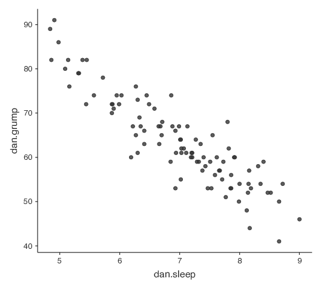
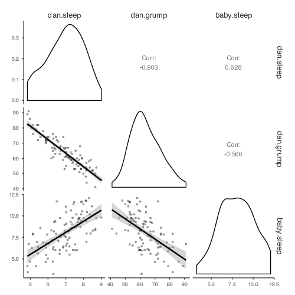
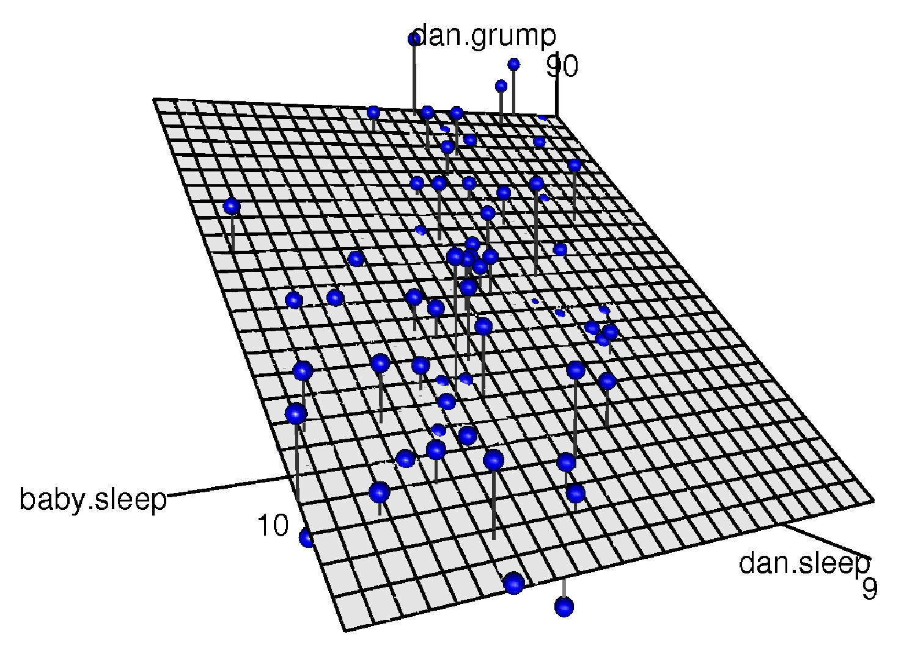
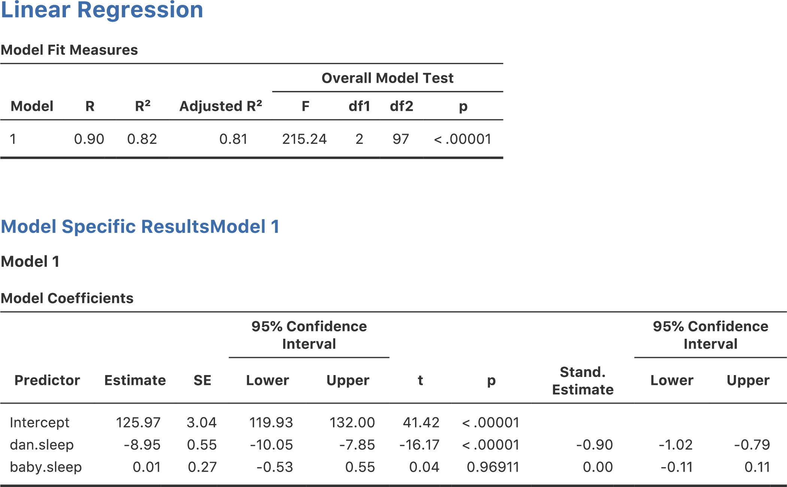
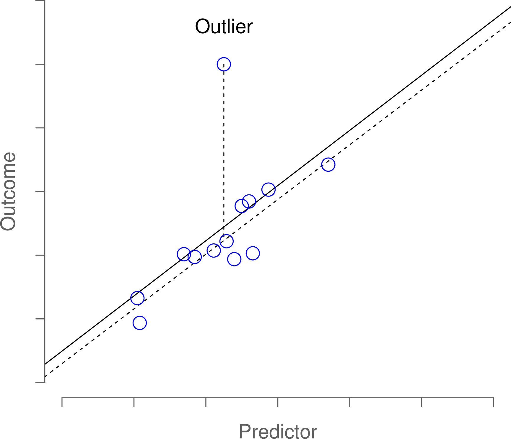
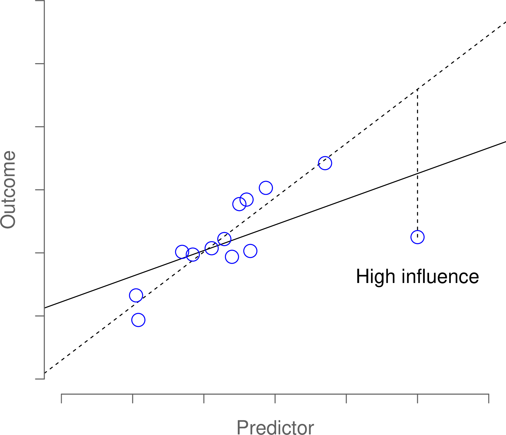
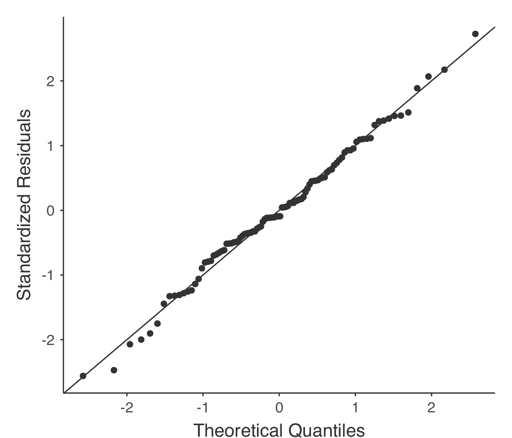

相関と線形回帰 {#ch:regression}
======================================================

本章では，<span class="keyterm">相関</span>（correlation）と<span class="keyterm">線形回帰</span>（linear regression）について説明します。これらは統計学者が予測変数と結果変数（いずれも連続変数）の関係を分析する際に使用する統計ツールです。

相関 {#sec:correl}
------------------------------

このセクションでは，データに含まれる変数*間*の関係を説明する方法について見ていきます。主に変数間の<span class="keyterm">相関</span>（correlation）について説明するわけですが，それにはまずデータが必要ですね。

### データ

ここでは，子育て中のすべての親に共感を呼ぶテーマ，睡眠を取りあげます。これから使用するデータは架空のものですが，実際の出来事に基づいています。さて，私はあることに興味を持っています。それは，私の幼い息子の睡眠時間が，私の気分にどれだけ影響を与えているのかということです。ここで，私は自分の不機嫌さを0（まったく不機嫌でない）から100（超絶悶絶に無愛想なじじばば並みに不機嫌）という尺度でかなり正確に評価できるものとします。そして，自分の不機嫌さと同時に，自分の睡眠時間と息子の睡眠時間についても測定したとします。たとえば，これを100日間行ったとしましょうか。そして，変人ぶりを発揮して，その結果を<span class="rtext">parenthood.csv</span>というファイルにデータとして保存しました。このデータを読み込むと，<span class="rtext">dan.sleep</span>，<span class="rtext">baby.sleep</span>，<span class="rtext">dan.grump</span>，<span class="rtext">day</span>という4つの変数が含まれているのがわかります。最初にこのデータを<span class="jamovi">jamovi</span>に読み噛んだとき，それぞれの変数のデータ型が正しく認識されないかもしれません。その場合は手作業で修正してください。<span class="rtext">dan.sleep</span>，<span class="rtext">baby.sleep</span>，<span class="rtext">dan.grump</span>，<span class="rtext">day</span>は連続変数（continuous）です。また，<span class="rtext">ID</span>は名義尺度（nominal）変数です^[<span class="jamovi">jamovi</span>のバージョンによってはID変数として指定することもできます。ただ，この変数は分析には直接使用しませんので，どちらに設定しても構いません。]。

次に，基本的な記述統計量を見てみましょう（表\@ref(tab:parenthood)）。そして，ヒストグラムを作成し，3つの変数がそれぞれどのような形になっているのかを見てみます（図\@ref(fig:parenthood) ）。念のため注意しておきますが，<span class="jamovi">jamovi</span>でさまざまな統計量が計算できるからといって，それらをすべて報告しなければならないわけではありません。私がこの結果をレポートに書くとしたら，たくさんの統計量の中から私にとって（そして想定される読み手にとって）もっとも関心のあるものを選び，それらを表\@ref(tab:parenthood)のようなシンプルな表にまとめることでしょう^[実際のところ，私はこの表でも情報が多すぎだと思います。実際には，ほとんどの人は中心傾向の指標は*1つ*だけ，ばらつきの指標も*1つ*だけを選択します。]。なお，私が作成した表では，すべてが「人間に理解できる」名前になっている点に注意してください。これはとても大事なことです。また，私が十分に睡眠時間をとれていない点にも注意してください。これは良いことではありませんが，他の親に聞いたところではこれは極めて普通のことだそうです。

Table: (#tab:parenthood) 子育てに関するデータの記述統計

| 変数                       | 最小値 | 最大値 | 平均値 | 中央値 | 標準偏差 | 四分位範囲    |
|:-------------------------|:---------:|:----------:|:---------:|:---------:|:-----------:|:------------------:|
| ダニーの不機嫌さ |      41   |       91   |  63.71  |   62     |   10.05    |     14              |
| ダニーの睡眠時間 |    4.84 |      9.00  |    6.97  |   7.03  |      1.02   |    1.45            |    
| ダニーの息子の睡眠時間  | 3.25  | 12.07  | 8.05  |   7.95  |    2.07  |   3.21            |


```{r parenthood, warning=FALSE, echo=FALSE, message=FALSE, out.width='82.4%', fig.align='center', fig.cap='<span class="rtext">parenthood</span>データセットに含まれる変数のヒストグラム'}

require(magick); require(ggplot2); require(ggplotify); require(cowplot)

p1<-as.grob(image_read("img/descriptives/grumpHist1.png"))
p2<-as.grob(image_read("img/descriptives/grumpHist2.png"))
p3<-as.grob(image_read("img/descriptives/grumpHist3.png"))

plot_grid(p1,p2, p3, labels=c("(a)", "(b)", "(c)"),ncol=3,scale=.9,label_size=12)

```


### 関係の強さと向き

2つの変数がどれだけ密接に関連しているかについてのおおよその印象をつかみたければ，散布図を作成してみると良いでしょう（図\@ref(fig:scatterparent)）。ただ，これだけではちょっと物足りない場合もあるかもしれませんね。たとえば，<span class="rtext">dan.sleep</span>（私の睡眠時間）と<span class="rtext">dan.grump</span>（私の不機嫌さ）の関係（図\@ref(fig:scatterparent)の左の図）と，<span class="rtext">baby.sleep</span>（私の息子の睡眠時間）と<span class="rtext">dan.grump</span>（私の不機嫌さ）の関係（図\@ref(fig:scatterparent)の右の図）を比較してみましょう。2つの散布図を見比べてみると，どちらの関係も*質的*には同じであることがわかります。つまり，睡眠時間が長くなるほど不機嫌さが低下するのです。また，<span class="rtext">dan.sleep</span>（私の睡眠時間）と<span class="rtext">dan.grump</span>（私の不機嫌さ）の関係は，<span class="rtext">baby.sleep</span>（息子の睡眠時間）と<span class="rtext">dan.grump</span>（私の睡眠時間）の関係よりも*強い*こともわかります。左側の図の方が右側の図よりも点が「そろって」いますよね。これがどういうことかというと，仮にあなたが私の気分を予測したいとしたとき，私の息子が何時間寝たかがわかっても予測にはあまり役立ちませんが，私が何時間寝たかがわかった場合には*ずっと*役立つだろうということです。

```{r scatterparent, warning=FALSE, echo=FALSE, message=FALSE, out.width='82.4%', fig.align='center', fig.cap='<span class="rtext">dan.sleep</span>と<span class="rtext">dan.grump</span>の関係を示した散布図（左）と<span class="rtext">baby.sleep</span>と<span class="rtext">dan.grump</span>の関係を示した散布図（右）。'}


p1<-as.grob(image_read("img/descriptives/grumpCor1.png"))
p2<-as.grob(image_read("img/descriptives/grumpCor2.png"))

plot_grid(p1,p2, labels=c("(a)", "(b)"),ncol=2,scale=.9,label_size=12)
```

今度は，図\@ref(fig:scatterparent2)の散布図で考えてみましょう。<span class="rtext">baby.sleep</span>（息子の睡眠時間）と<span class="rtext">dan.grump</span>（私の不機嫌さ）の散布図（左）と，<span class="rtext">baby.sleep</span>（息子の睡眠時間）と<span class="rtext">dan.sleep</span>（私の睡眠時間）の散布図（右）を比べると，全体的な関係の強さは同じですが方向が異なっています。つまり，息子の睡眠時間が長くなれば，私も*たくさん*寝ることができる（プラスの関係，右図）のに対し，息子がたくさん寝れば，私の不機嫌さは*下がる*（マイナスの関係，左図）のです。

```{r scatterparent2, warning=FALSE, echo=FALSE, message=FALSE, out.width='82.4%', fig.align='center', fig.cap='<span class="rtext">baby.sleep</span>と<span class="rtext">dan.grump</span>の関係を示した散布図（左）と<span class="rtext">baby.sleep</span>と<span class="rtext">dan.sleep</span>の関係を示した散布図（右）。'}

p1<-as.grob(image_read("img/descriptives/grumpCor2.png"))
p2<-as.grob(image_read("img/descriptives/grumpCor3.png"))

plot_grid(p1,p2, labels=c("(a)", "(b)"),ncol=2,scale=.9,label_size=12)
```


### 相関係数の解釈 {#sec:interpretingcorrelations}

当然のことながら，実際の場面では相関が1になることはそうありません。では，たとえば相関係数が\(r= 0.4\)のような場合，これをどう解釈すればよいのでしょうか。じつは，その答えはデータの使用目的や，その研究分野でどれくらいの強さの相関が一般的かによって変わります。たとえば，工学が専門の私の友人は，\(0.95\)より小さい相関などまったく無意味だと主張しています（いくら工学とはいえ，さすがにこれは誇張だと思いますが）。もちろん，心理学においても強い相関が期待できる場面はあります。たとえば，類似度判断についての理論を検証するためのデータでは結果がかなりきれいに出るので，相関係数が少なくとも\(0.9\)はないことには，その理論が役に立つものだとは言えません。ですが，（たとえば）知能の基本関連要素（視察時間や反応時間など）を見る場合には，相関係数が\(0.3\)を超えればかなり上出来だと言えます。要するに，相関係数の解釈は文脈によって大きく変わるのです。とは言うものの，一般的には表\@ref(tab:interpretingcorrelations)に示した値が大まかな基準となります。

Table: (#tab:interpretingcorrelations) 相関係数の大まかな解釈基準。これは「大まかな」ものである点に注意。相関係数がいくつであれば強い，あるいは弱いと言えるかについての単純な基準はなく，その解釈は文脈により異なる。

| 相関係数 |   強さ   |  向き |  
|:------------:|:---------:|:----------:|  
| &minus;1.0〜&minus;0.9 |  非常に強い |  負の相関 |  
| &minus;0.9〜&minus;0.7 |  強い |       負の相関 |  
| &minus;0.7〜&minus;0.4 |  中程度  |  負の相関 |  
| &minus;0.4〜&minus;0.2 |  弱い |      負の相関 |  
| &minus;0.2〜0  |  ごくわずか |   負の相関 |  
| 0〜0.2 |      ごくわずか |   正の相関 |  
| 0.2〜0.4 |    弱い |     正の相関 |  
| 0.4〜0.7 |    中程度 |    正の相関 |  
| 0.7〜0.9 |    強い |     正の相関 |  
| 0.9〜1.0 |    非常に強い |  正の相関 |
 

### 相関係数

こうした関係は，<span class="keyterm">相関係数</span>（correlation coefficient），より正確にはピアソンの積率相関係数と呼ばれる考え方を導入するとはっきりと示せるようになります。相関係数は，一般的には\(r\)と書かれます。詳しくは次のセクションで説明しますが，2つの変数\(X\)と\(Y\)の相関係数（\(r_{XY}\)と書かれることもあります）は，\(-1\)から\(1\)までの値になります。\(r = -1\)の場合，2変数の相関が完全に負（マイナス）であり，\(r = 1\)の場合にはそれが完全に正（プラス）であることを意味します。そして\(r = 0\)の場合は，まったく相関がないということです。図\@ref(fig:corr)には，さまざまな相関の値がどのような散布図になるかを示してあります。

```{r corr, warning=FALSE, echo=FALSE, message=FALSE, out.width='82.4%', fig.align='center', fig.cap='相関の強さと向きの説明図。 左側は，相関が0，.33，.66，および1の場合，右側は相関が0，&minus;.33，&minus;.66および&minus;1の場合。'}

p1<-as.grob(image_read("img/descriptives/corr0.png"))
p2<-as.grob(image_read("img/descriptives/corr0.png"))
p3<-as.grob(image_read("img/descriptives/corr33.png"))
p4<-as.grob(image_read("img/descriptives/corr33n.png"))
p5<-as.grob(image_read("img/descriptives/corr67.png"))
p6<-as.grob(image_read("img/descriptives/corr67n.png"))
p7<-as.grob(image_read("img/descriptives/corr100.png"))
p8<-as.grob(image_read("img/descriptives/corr100n.png"))

plot_grid(p1,p2, p3, p4,p5,p6,p7,p8, labels=c("0.00", "0.00","0.33", "–0.33","0.66", "–0.66","1.00", "–1.00"),ncol=2,scale=.9,label_size=12)
```

ピアソンの相関係数には，さまざまな式の書き方があります。この式を書く方法として一番シンプルだと私が思うのは，式を2つのステップに分けるというやり方です。まず，<span class="keyterm">共分散</span>（covariance）という考えを導入します。2つの変数\(X\)と\(Y\)の共分散は，分散の考え方をより一般化したもので，2変数間の関係を数学的な形で簡潔に表したものです。ただし，この値は人間にとってはあまり多くの情報を与えてくれません。

$$  \mbox{Cov}(X,Y) = \frac{1}{N-1} \sum_{i=1}^N \left( X_i - \overline{X} \right) \left( Y_i - \overline{Y} \right)  $$

\(X\)に基づく量と\(Y\)に基づく量のかけ算をして（つまり「積」を求めて）平均している^[分散や標準偏差のところでもそうだったように，ここでは\(N\)ではなく\(N-1\)で割っています。]ので，この式は\(X\)と\(Y\)の「互いの積の平均」になります。この共分散には，\(X\)と\(Y\)がまったく関連なしの場合には共分散の値がちょうど0になるという嬉しい性質があります。両者の関係がプラス（図\@ref(fig:corr)に示したような形）であれば，共分散もプラスの値になりますし，両者の関係がマイナスであれば共分散の値もマイナスになります。つまり，共分散には相関という考え方の質的な部分がうまく捉えられているのです。ただし，残念ながら共分散の大きさをそのまま解釈することは困難です。なぜなら，この値の大きさは\(X\)と\(Y\)が測定される単位によって大きく変わるからです。大体，共分散そのものの単位はじつに奇妙です。たとえば，\(X\)が<span class="rtext">dan.sleep</span>（私の睡眠時間，単位：時間）で，\(Y\)が<span class="rtext">dan.grump</span>（私の不機嫌さ，単位：不機嫌）だとすると，その共分散の単位は「時間\(\times\)不機嫌」というものになるわけです。これが一体どういう単位なのか，私にはさっぱりわかりません。

ピアソンの相関係数（\(r\)）は，共分散を標準化することでこうした解釈の問題を解決しています。共分散を標準化する方法は，生データを標準化して\(z\)得点にするのと非常によく似ています。つまり，共分散を標準偏差で割るのです。ただし，共分散は2つの変数から求められるものですので，これを標準化するには両方の変数の標準偏差で割る必要があります^[これは単純化しすぎですが，ここではこの理解で問題ありません。]。つまり，\(X\)と\(Y\)の相関係数は次のように書くことができます。

$$  r_{XY}  = \frac{\mbox{Cov}(X,Y)}{ \hat{\sigma}_X \ \hat{\sigma}_Y}  $$

このようにして標準化すると，先ほど説明した共分散の嬉しい性質はそのままに，\(r\)の値が意味をなす値になるのです。つまり，\(r= 1\)は2つの変数の間に完全な正の関係があることを意味し，\(r = -1\)が完全に負の関係であることを意味します。この点についてはセクション\@ref(sec:interpretingcorrelations)でもう少し詳しく説明します。その前に<span class="jamovi">jamovi</span>で相関係数を計算する方法を見ておきましょう。

### <span class="jamovi">jamovi</span>での相関係数の算出

<span class="jamovi">jamovi</span>で相関係数を求めるには，「**Regression**（回帰）」メニューの「**Correlation Matrix**（相関行列）」を使用します。4つの変数すべてを右側のボックスに移動させると，図\@ref(fig:correlations)のような結果が得られます。


```{r correlations, warning=FALSE, echo=FALSE, out.width='82.4%', fig.align='center', fig.cap='<span class="filename">parenthood.csv</span>ファイルに含まれる変数間の相関を示すjamoviのスクリーンショット', echo=FALSE}
knitr::include_graphics("img/descriptives/correlations.png")
```

ただし，これはいくら強調しても強調しすぎることのないほど大事なことですが，*必ず*散布図を見てから相関係数を解釈するようにしてください。変数間の関係が相関係数に正しく表れていない可能性もあるのです。その古典的な例として「アンスコムの例（Anscombe's Quartet）[@Anscombe1973]と呼ばれるものがあります。これは4種類のデータセットを集めたものです。それぞれのデータセットには\(X\)と\(Y\)の2つの変数が入っています。4種類のデータセットはどれも，\(X\)の平均値は9で\(Y\)の平均値は7.5です。変数\(X\)の標準偏差も4つのデータセットでほぼ同一で，変数\(Y\)についても同様です。そして，どのデータセットでも，\(X\)と\(Y\)の相関係数は\(r = 0.816\)になっています。これを自分で確かめてみることもできます。このデータは<span class="filename">anscombe.csv</span>というファイルに収められています。

これだけを聞くと，この4つのデータセットはお互いに非常によく似ていると思うことでしょう。でもそうではないのです。この4つのデータセットのそれぞれで\(X\)を横軸，\(Y\)を縦軸にとって散布図を作成してみると，図\@ref(fig:anscombe)に見られるように，この4つはお互いに*驚くほど*異なっているのです。このように，「*生データを必ずグラフにしてみること*」（第\@ref(ch:graphics)章）はとても大事です。ですが，実際場面ではあまりに多くの人がこのことを忘れてしまっているようです。

```{r anscombe, warning=FALSE, echo=FALSE, message=FALSE, out.width='82.4%', fig.align='center', fig.cap='アンスコムの例。 これらの4つのデータはどれもピアソンの相関係数はr=.816であるが，質的には互いに異なっている。'}

p1<-as.grob(image_read("img/descriptives/anscombe1.png"))
p2<-as.grob(image_read("img/descriptives/anscombe2.png"))
p3<-as.grob(image_read("img/descriptives/anscombe3.png"))
p4<-as.grob(image_read("img/descriptives/anscombe4.png"))

plot_grid(p1,p2, p3, p4,ncol=2,scale=.9,label_size=12)
```

### スピアマンの順位相関係数

ピアソンの相関係数はさまざまなものに使えて便利なのですが，欠点もいくつかあります。その中のとくに大きな問題として，ピアソンの相関係数が測定しているものは2変数間の*線形*関係の強さであるということがあげられます。どういうことかというと，この値はデータに含まれる観測値全体がどれだけ一直線上に集まるかを示す測度なのです。私たちが「関係」というとき，それが直線的な関係を意味するものであるということはよくあることで，そしてそれを計算するうえではピアソンの相関係数はよい指標なのです。ですが，そうでない場合もあります。

ピアソンの相関係数の使用が適さないもっとも典型的な状況は，\(X\)が増加すれば\(Y\)も増加するという関係がありながら，その関係が線形であるとは限らない場合です。たとえば，試験における努力と報酬の関係にはそうした例が見受けられるかもしれません。勉強という努力（\(X\)）が0であれば，成績（\(Y\)）も0点になるでしょう。ですが，わずかでも努力すれば，それが*大きな*改善につながることがあります。講義にただ出席するだけではあまり学んだことにはなりませんが，授業に出て少しばかりメモをとっただけでも0点から35点に成績点が向上したりするかもしれませんね。大して努力していないのにです。ですが，成績点の良い人たちでは，わずかな努力で点数が大きく上昇するといったことは望めません。誰もが知っているように，90点を取るのは55点を取るより*ずっと*努力が必要です。つまり，もし勉強努力の量と成績点を測定したデータがあったとして，そのデータにピアソンの相関係数を使用すると誤解を招く結果になる確率がかなり高いということなのです。

そのことを理解するために，図\@ref(fig:rankcorrpic)の散布図を見てください。これはある授業を履修する学生10人の勉強時間と成績点の関係を表したものです。（見るからに架空のものであるとわかる）このデータでは，興味深いことに努力をすれば*必ず*成績点が上昇するのです。たくさん上昇することもあれば少ししか上昇しないこともありますが，努力量が増えて成績点が下がるということは絶対にありません。このデータでピアソンの相関係数を求めると，勉強時間と成績点の間には\(r=0.91\)という強い相関が見られます。ただ，これは勉強時間が増えれば*必ず*成績点が上昇するという観察結果をうまく捉えられていません。このような状況では*完全*な関係があると言いたくなるのですが，その「関係」はピアソンの相関係数で示せるものではないのです。この場合に必要なのは，そこにある完全な<span class="keyterm">順序関係</span>（ordinal relationship）を捉えられるような指標です。このデータでは，学生1が学生2より勉強時間が長いとしたら，学生1の方が成績がよいということは確実です。ですが，相関係数\(r = .91\)というのはこの事実をうまく説明できていません。

```{r rankcorrpic, warning=FALSE, echo=FALSE, out.width='58.8%', fig.align='center', fig.cap='10人の学生の勉強時間と成績点で構成されるサンプルデータ（各点は1人の学生に対応）。中央の破線は，2変数間の線形関係を示している。このデータは r = .91 という強いピアソン相関係数になる。しかしここで注目すべき点は，2つの変数間には完全な単調関係が存在するということである。実線で示したように，この例では勉強時間が増加すれば成績点も増加する。これはスピアマン相関係数には ρ = 1 として反映される。ただし，このような小さなデータセットでは，どちらの相関係数が変数間の実際の関係をよりよく記述できるかということは未解決の問題である。', echo=FALSE}
knitr::include_graphics("img/descriptives/ordinalRelationship.png")
```

ではこの問題にどう対処したらよいのでしょうか。これはとても簡単です。順序関係について見たいのであれば，そのデータを順序尺度として扱えばよいのです。そこで，努力量を「勉強時間」で見るのではなく，10人の学生を勉強時間の長い順に並べ替えてみましょう。つまり，学生1は誰よりも勉強時間が短い（2時間）ので最下位になります（順位=1）。その次に勉強時間が短いのは，1学期の間にわずか6時間しか勉強していない学生4で，この学生が下から2番目の順位になります（順位=2）。なお，ここでは「順位=1」を「最下位」としている点に注意してください。日常の場面では「最下位」ではなく「最上位」を「順位=1」とすることもありますね。つまり，「小さい値から順に」順位をつける（小さい値が順位1）こともできれば「大きい値から値に」（大きな値が順位1）に順位をつけることもできるわけです。今回は数値の小さい順に順序をつけていますが，どちら向きに順位をつけたのかは忘れてしまいやすいので，しっかり覚えておいてください。

では，努力量の少ない方から順に学生を並べた結果を見てみましょう。

|              | 順位（勉強時間） | 順位（成績)  |
|:----------|:-------------------------:|:-----------------:|
| 学生1     |        1     |                 1    |
| 学生2     |       10     |                10    |
| 学生3     |        6     |                 6    |
| 学生4     |        2     |                 2    |
| 学生5     |        3     |                 3    |
| 学生6     |        5     |                 5    |
| 学生7     |        4     |                 4    |
| 学生8     |        8     |                 8    |
| 学生9     |        7     |                 7    |
| 学生10     |       9     |                 9  |


おや，まったく*同じ*になりましたね。もっとも努力した学生がもっともよい成績になり，もっとも努力しなかった学生がもっとも悪い成績になりました。この表に見られるように，2つの変数の順位はまったく同一ですから，この相関を求めれば相関係数は<span class="rtext">1.0</span>になるはずです。

このようにして私たちが再発明したものは，<span class="keyterm">スピアマンの順位相関係数</span>（Spearman's rank order correlation）と呼ばれています。この値は，ピアソンの相関係数\(r\)と区別するために，通常は\(\rho\)（ロー）と表記されます。<span class="jamovi">jamovi</span>では，「**Correlation Matrix**（相関行列）」の画面で「**Spearman**（スピアマン）」のチェックボックスをオンにすればスピアマンの\(\rho\)を求めることができます。


散布図 {#sec:scatterplots}
------------------------------------

<span class="keyterm">散布図</span>（scatterplot）は，相関についてのセクションで見た図（図\@ref(sec:correl)）のように，*2つの*変数間の関係を視覚化するうえで単純ながら非常に効果的なツールです。私たちが「散布図」という用語を使用するときは，たいていはこうした利用法が念頭にあります。こうした図では，1つの点がそれぞれの観測値に対応します。グラフの横軸の座標は1つめの変数の観測値，縦軸の座標はもう1つの変数の観測値値を示します。変数間の*因果*関係（たとえば，AがBの原因になるのか，それともBがAの原因になるのか，あるいは別の変数CがAとBの両方の原因となっているのか）についてはっきりした考えがない場合も多いでしょう。そのような場合，どちらの変数を横軸にしてどちらを縦軸にするかはあまり関係ありません。ですが，一方の変数が原因であることがはっきりしている場合，あるいは少なくともそうであろうと想定できる場合というのもあります。そのような場合には，一般的に原因となる変数を横軸に，結果変数を縦軸にして図を作成します。これらのことを念頭に置いて，<span class="jamovi">jamovi</span>で散布図を作成する方法を見てみましょう。ここでは相関についての導入で使用した<span class="rtext">parenthood</span>データセット（つまり<span class="filename">parenthood.csv</span>）を使用します。

```{r scatterplot1, warning=FALSE, echo=FALSE, out.width='82.4%', fig.align='center', fig.cap='「Correlation Matrix（相関行列）」メニューから作成した散布図', echo=FALSE}
knitr::include_graphics("img/graphics/scatterplot1.png")
```

ここで，私のやりたいことが私の睡眠時間（<span class="rtext">dan.sleep</span>）と次の日の不機嫌さ（<span class="rtext">dan.grump</span>）の関係を視覚化する散布図を作ることだったとしましょう。必要な図を<span class="jamovi">jamovi</span>で作成する方法は2通りあります。1つめは，「**Regression**（回帰）」メニューの「**Correlation Matrix**（相関行列）」で「**Plot**（作図）」オプションを選択するという方法です（図\@ref(fig:scatterplot1)）。<span class="jamovi">jamovi</span>は点の真ん中を通るような直線を引きますが，これについてはこの少し後のセクション(\@ref(sec:introregression)で説明します。このようにして散布図を作成するとき，「**Densities for variables**（変数の密度）」オプションを指定すると，各変数がどのように分布しているのかを密度曲線で示してくれます。

2つめの方法は，<span class="jamovi">jamovi</span>のアドオンモジュールを使用する方法です。そのモジュールは「<span class="rtext">jscatr</span>と呼ばれるもので，画面右上にある大きな「+」のアイコンをクリックし，<span class="jamovi">jamovi</span>ライブラリの中から<span class="rtext">jscatr</span>を探して「install（インストール）」をクリックするとインストールできます。インストールが終わったら，「**Exploration**（探索）」メニューの中に「**Scatterplot**（散布図）」コマンドがあるはずです。図\@ref(fig:scatterplot2)の図は1つめのものと少し違いますが，重要な部分は同じです。

```{r scatterplot2, warning=FALSE, echo=FALSE, out.width='70.6%', fig.align='center', fig.cap='「scatr」アドオンモジュールを使用して作成した散布図', echo=FALSE}

```

### より詳細な方法

複数の変数間の関係を一度に見たい場合というのもよくあります。その場合は，「**Correlation Matrix**（相関行列）」の「**Plot**（作図）」で<span class="keyterm">散布図行列</span>（scatterplot matrix）を作成します。<span class="jamovi">jamovi</span>では，単に他の変数，たとえば<span class="rtext">baby.sleep</span>（息子の睡眠時間）を相関係数を算出する変数のリストに追加するだけで，図\@ref(fig:scatterplot3)のような散布図行列を作成してくれるのです。

```{r scatterplot3, warning=FALSE, echo=FALSE, out.width='82.4%', fig.align='center', fig.cap='<span class="jamovi">jamovi</span>で作成した散布図行列', echo=FALSE}

```

線形回帰モデル  {#sec:introregression}
--------------------------------------------------------------

恐ろしく単純化して言ってしまえば，線形回帰モデルというのは基本的にはピアソンの相関係数（セクション\@ref(sec:correl)）を少し豪華にしたものです。ですが，回帰モデルは相関係数よりずっとパワフルなツールです。

回帰分析の基本的な考え方は相関と密接に関係しているので，再び<span class="filename">parenthood.csv</span>ファイルを使用しましょう。これは相関の仕組みを説明するのに使用したものです。このデータでは，なぜ私がいつもこんなに不機嫌なのかを調べようとしたのでした。そして，私たちの仮説は，その原因は私の睡眠時間が十分でないからだというものでした。そしていくつか散布図を作成して，私の睡眠時間と翌日の不機嫌さについての関係を検証しようとしました。それが図\@ref(fig:scatterplot2)です。そして，すでに見たように，そこには\(r=-.90\)という相関がありました。ただ，このとき，私たちは何となく図\@ref(fig:regression1)の(a)のようなものを想像したはずです。つまり，データの中央に心理的な線を引いていたのです。統計では，私たちが引いたこのような直線のことを<span class="keyterm">回帰直線</span>（regression line）と呼びます。私たちはバカではありませんから，回帰直線を引くときはそれがデータの中心を通るようにます。図\@ref(fig:regression1)の(b)のような間抜けな線の引き方をする人はいないはずです。

```{r regression1, warning=FALSE, echo=FALSE, message=FALSE, out.width='82.4%', fig.align='center', fig.cap='図の(a)は，睡眠時間と不機嫌さの散布図（図12.9）に最良の回帰直線を重ね書きしたもの。当然ながら，直線はデータの中央を通る。これとは対照的に，図(b)は同じデータを示したものであるが，重ね書きした回帰直線は非常にあてはまりが悪い。'}

p1<-as.grob(image_read("img/regression/introPicGoodLine.png"))
p2<-as.grob(image_read("img/regression/introPicBadLine.png"))

plot_grid(p1,p2, labels=c("(a)", "(b)"),ncol=2,scale=.9,label_size=12)
```

ごく自然なことですよね。私が図\@ref(fig:regression1)の(b)に引いた線はデータにあまり「フィット」していませんから，データを要約する方法としてはあまり意味がないということになります。これはごく単純な観察ですが，ここにちょっとばかり数学をちりばめると，これが非常に強力なツールになるのです。そのために，まずは高校数学の復習といきましょう。直線の式は，通常は次のように書かれます。

$$  y = a + bx  $$

少なくとも，これが何年も前に私が高校に通っていたときに習ったものです。この式には\(x\)と\(y\)という2つの*変数*があり，さらに\(a\)と\(b\)という2つの*係数*があります^[\(y = ax + b\)のように，\(a\)を傾きの係数，\(b\)を切片（定数）の係数とする書き方もあります]。係数\(a\)はこの直線の*\(y\)の切片*で，係数\(b\)は直線の*傾き*を表します。高校時代の薄れつつある記憶（私のように高校時代なんて遙か昔だという人もいるのです）をさらに掘り返してみると，切片とは「\(x=0\)の時の\(y\)の値」であるということが思い出されます。また，傾きが\(b\)の場合，\(x\)の値を1増やせば\(y\)の値が\(b\)だけ増加するのでした。また，傾きが負の値の場合には，\(x\)が増加すると\(y\)は増加するのではなく減少します。そうそう，そうでした。次第に記憶が戻りつつあります。さて，これで必要なことは思い出しましたので，この同じ式を回帰直線に応用できることがわかっても大した驚きではないですね。\(Y\)を結果変数（従属変数）とすると，\(X\)は予測変数（独立変数）ということになり，回帰直線の式は次のように書くことができるのです。

$$  \hat{Y_i} = b_0 + b_1 X_i  $$

ふむ。先ほどと同じ式のようにも見えますが，なんだか余分なおまけがくっついていますね。それらについて説明しておきましょう。まず，この式では昔ながらのシンプルな\(X\)や\(Y\)ではなく，\(X_i\)や\(Y_i\)という表記が用いられています。これは，私たちが扱っているのが実際のデータであるということをはっきりさせておくためです。この式では，\(X_i\)は\(i\)番目の観測値における予測変数の値（つまり，研究\(i\)日目の私の睡眠時間）で，\(Y_i\)はそれに対応する結果変数の値（つまりその日の私の不機嫌さ）を意味します。そして式の中でははっきりと述べられていませんが，この式はデータに含まれるすべての観測値（つまりすべての\(i\)）にあてはまるものと仮定されています。2つめに，式の中では\(Y_i\)ではなく\(\hat{Y}_i\)になっている点にも注意してください。これは，*実際のデータ*（\(Y_i\)）と*推定値*（\(\hat{Y}_i\)） (つまり回帰直線による予測値）を区別するためです。3つめに，この式では係数に相当する部分が\(a\)や\(b\)から\(b_0\)や\(b_1\)に変わっています。これは，統計学者が回帰モデルの係数を表す場合に好んで使う方法です。なぜ\(b\)なのかはわかりませんが，とにかく彼らはそうするのです。ということで，\(b_0\)は切片を意味します。そして\(b_1\)が傾きです。

うん，素晴らしい。それから，回帰直線がうまく引けているかどうかに関わらず，データに含まれるすべての観測値がその直線にぴったりあてはまるわけではないということにも気がつきますね。別の言い方をすれば，\(Y_i\)は回帰モデルの予測値である\(\hat{Y_i}\)と完全には同じにならないのです。統計学者というのは何にでも名前や数字や文字をつけたがるもので，このモデルの予測値と実際の値の差のことを*残差*と呼び，これを\(\epsilon_i\)と書きます^[\(\epsilon\)はギリシャ文字のイプシロンです。残差を指す場合，\(\epsilon_i\)や\(e_i\)と書くのが一般的です。]。数学的には，残差は次のように定義されます。

$$  \epsilon_i = Y_i - \hat{Y}_i  $$

つまり，線形回帰モデルの式は次のように書くことができるのです。

$$  Y_i = b_0 + b_1 X_i + \epsilon_i  $$

線形回帰モデルの推定  {#sec:regressionestimation}
---------------------------------------------------------------------

では，もう一度図を作成しましょう。ただし，今度はすべての観測値に残差の大きさを示す線を引いてみます。回帰直線がうまく引けていれば，残差（黒い実線の長さ）は図\@ref(fig:regression3)の(a)のように非常に小さなものになります。ですが，回帰直線がうまく引けていない場合，図\@ref(fig:regression3)の(b)のように残差が大きくなります。


```{r regression3, warning=FALSE, echo=FALSE, message=FALSE, out.width='82.4%', fig.align='center', fig.cap='データによくあてはまる回帰直線（図の(a)）の残差と，あてはまりの悪い回帰直線（図の(b)）の残差。残差は，あてはまりの良い回帰直線の方がはるかに小さい。あてはまりの良い回帰直線はデータの中央を通る線であるから，これは当然のことである。'}

p1<-as.grob(image_read("img/regression/introPicGoodSSE.png"))
p2<-as.grob(image_read("img/regression/introPicBadSSE.png"))

plot_grid(p1,p2, labels=c("(a)", "(b)"),ncol=2,scale=.9,label_size=12)
```

さて，私たちが回帰モデルに求めていることは，多分，残差が*小さい*ということですよね。そう，そのはずです。実際，「ベストフィット」する回帰直線というのは，残差が最も小さいものだとまで言えそうです。それに，統計学者というのは何でもかんでも2乗するのが好きですから，きっと次の様なことを言うはずです。

> 回帰係数の推定値\(\hat{b}_0\)と\(\hat{b}_1\)は残差の2乗を最小化するもので，これは\(\sum_i (Y_i - \hat{Y}_i)^2\)または\(\sum_i {\epsilon_i}^2\)と書ける。

そうです，そうです。だんだんいい感じになってきました。そして，私がわざわざこんな風に強調して書いたと言うことは，つまりこれが正解だということなのでしょう。そしてこれが正解だとすると，回帰係数が*推定値*である（母集団を説明するパラメータを推測しようとしている）という事実に注目した方が良さそうです。そう，だから私はこれにハット（^）をつけたんです。つまり，私たちが求めるものは，\(b_0\)や\(b_1\)ではなく\(\hat{b}_0\)と\(\hat{b}_1\)なのです。なお，実際には回帰モデルを推定する方法はいくつかあります。ここで説明した推定方法は，<span class="keyterm">最小2乗回帰</span>（ordinary least squares (OLS) regression）と呼ばれているものです。

さてこれで，私たちは「ベスト」な回帰係数（\(\hat{b}_0\)および\(\hat{b}_1\)）というものを説明するための具体的な定義を手に入れました。私たちのベストな回帰係数が残差の2乗和を最小化するものだすると，その次に生じる自然な疑問は，その素晴らしい数字をどうやって*見つける*かということになります。この疑問に対する答えは複雑で，回帰分析の考え方を理解するための役には立ちません^[少なくとも，ほとんどの人にとっては役に立たないでしょう。ですが，線形代数で黒帯を持っているような人（公平を期して言うと，私の入門クラスには毎年数人はそういう学生がいます）であれば，この推定問題の解が\(\hat{\boldsymbol{b}} = (\mathbf{X}' \mathbf{X})^{-1} \mathbf{X}' \boldsymbol{y}\)であるということがわかれば，それは*その人*にはきっと役立つ*だろう*と思います。なお，\(\hat{\boldsymbol{b}}\)は回帰係数の推定値含むベクトルで，\(\mathbf{X}\)は予測変数（と，すべての値が1の列が1列含まれます。厳密には\(\mathbf{X}\)は説明変数の行列ですが，その区別についてはまだ説明していません）を含む「デザイン行列」，\(\boldsymbol{y}\)は結果変数を含むベクトルです。ですが，それ以外の人にとってはこのような説明はぜんぜん役に立たないし，恐怖すら覚えることでしょう。ただ，線形回帰では非常にたくさんのものが線形代数を使って書かれるので，本章ではこうした脚注が山のように出てきます。こうした数学がわかるならそれは素晴らしいことです。ですが，そうでなければ無視してください。]。さて，ややこしい話はこのくらいにしておきましょう。あれやこれやとだらだら退屈な話をしてから最後の最後で<span class="jamovi">jamovi</span>が提供してくれる素晴らしい近道を「公開」するのではなく，早速<span class="jamovi">jamovi</span>を使ってこの重労働をやってみることにします。

### <span class="jamovi">jamovi</span>での線形回帰  {#sec:lm}


<span class="rtext">parenthood.csv</span>ファイルを使って線形回帰を実行するには，「**Analyses**（分析）」タブの「**Regression**（回帰）」メニューから「**Linear Regression**（線形回帰）」を選択します。そして<span class="rtext">dan.grump</span>（私の不機嫌さ）を「**Dependent Variable**（従属変数）」に，<span class="rtext">dan.sleep</span>（私の睡眠時間）を「**Covariates**（共変量）」ボックスに入れます。すると図\@ref(fig:reg1)のような結果が表示され，切片が\(\hat{b}_0 = 125.96\)で傾きが\(\hat{b}_1 = -8.94\)であることがわかります。


```{r reg1, warning=FALSE, echo=FALSE, out.width='82.4%', fig.align='center', fig.cap='<span class="jamovi">jamovi</span>での回帰分析結果', echo=FALSE}
knitr::include_graphics("img/regression/reg1.png")
```

つまり，私が図\@ref(fig:regression1)に示したあてはまりの良い回帰直線の式は次のようになります。

$$  \hat{Y}_i = 125.96 + (-8.94 \ X_i)  $$

### 推定モデルの解釈

回帰分析を理解するうえでもっとも重要なことは，これらの係数をどう解釈すればよいかということです。まずは傾き\(\hat{b}_1\)から見ていきましょう。傾きの定義を覚えているでしょうか。\(\hat{b}_1 = -8.94\)という回帰係数は，\(X_i\)が1増えれば\(Y_i\)が8.94だけ減るという意味です。つまり，睡眠時間が1時間増えるごとに私の気分は改善され，不機嫌さ得点が8.94点減少するのです。では，切片はどうでしょうか。\(\hat{b}_0\)は「\(X_i\)が0の時の\(Y_i\)の期待値」ですから，これも非常にわかりやすいですね。つまり，もし私の睡眠時間が0時間だったら（\(X_i =0\)），私の不機嫌さは測定尺度の範囲を超えて\(Y_i = 125.96\)という常軌を逸した値になるということです。こうはならないように気をつけた方が良さそうです。

線形重回帰  {#sec:multipleregression}
---------------------------------------------------------

ここまで説明してきた単回帰モデル^[説明変数が1つしかない回帰分析を「単回帰分析」と呼びます。]は，関心のある予測変数が1つしかありませんでした。ここでの例では，<span class="rtext">dan.sleep</span>（私の睡眠時間）ですね。ここまでのところ，本書で取りあげてきた統計ツールは*すべて*，予測変数が1つで結果変数も1つのものでした。しかし，多くの（というか，たいていの）研究プロジェクトでは，検討したい予測変数が複数である場合もあるわけです。だとすると，複数の予測変数を使用できるように線形回帰の枠組みを拡張できたら素晴らしいですね。ということで，ここで<span class="keyterm">重回帰分析</span>（multiple regression）の出番です。

重回帰分析は，考え方自体はとてもシンプルです。単に回帰式に入れる変数を増やすだけだからです。たとえば関心のある変数が2つあるとしましょう。ここでは<span class="rtext">dan.sleep</span>（私の睡眠時間）と<span class="rtext">baby.sleep</span>（息子の睡眠時間）の2つを用いて<span class="rtext">dan.grump</span>（私の不機嫌さ）変数を予測したいとします。先ほどと同様に，\(Y_i\)は\(i\)日目における私の不機嫌さを意味します。ただし，今度は\(X\)変数が2つあります。最初のものは私の睡眠時間，2つめのものは私の息子の睡眠時間です。そこで\(X_{i1}\)が\(i\)日目の私の睡眠時間，そして\(X_{i2}\)がその日の息子の睡眠時間を表すとしましょう。そうすると，回帰モデルは次のようになります。

$$  Y_i = b_0 + b_1 X_{i1} + b_2 X_{i2} + \epsilon_i  $$

先ほどと同様に，\(\epsilon_i\)は\(i\)番目の観測値と関連した残差で，\(\epsilon_i = {Y}_i - \hat{Y}_i\)です。このモデルでは3つの係数を推定する必要があります。\(b_0\)は切片，\(b_1\)は私の睡眠時間に関連した係数，そして\(b_2\)は私の息子の睡眠時間に関連した係数です。推定が必要な係数の数は増えましたが，推定についての基本的な考え方は変わりません。推定される係数，\(\hat{b}_0\)，\(\hat{b}_1\)，\(\hat{b}_2\)は，残差の2乗和^[2乗値の合計のことです。]を最小化するものです。


### <span class="jamovi">jamovi</span>での重回帰分析

<span class="jamovi">jamovi</span>での重回帰分析は，先ほどの単回帰分析と変わりません。「**Covariates**（共変量）」に変数を追加してやるだけです。たとえば，私の不機嫌さを説明する変数として<span class="rtext">dan.sleep</span>と<span class="rtext">baby.sleep</span>の両方を使いたかったら，この2つを「**Covariates**（共変量）」ボックスに入れればいいのです。<span class="jamovi">jamovi</span>では，切片については何も設定しなくても推定が行われます。この分析の結果，係数は次のようになりました。

```{r, warning=FALSE, echo=FALSE,message=FALSE}
library(knitr)
library(kableExtra)

dt<- matrix(c('(切片）',125.97 ,'私の睡眠時間',-8.95,'息子の睡眠時間',0.01), ncol=2, byrow=T)

kable(dt, align = c('l','r')) %>%
  kable_styling(bootstrap_options = "striped", full_width = F)
```

<span class="rtext">dan.sleep</span>（私の睡眠時間）に関連した係数が非常に大きくなっていることから，私の睡眠時間が減るほど私が不機嫌になるということが示唆されます。一方で，<span class="rtext">baby.sleep</span>（息子の睡眠時間）の係数は非常に小さいので，息子がどれだけよく寝るかは私が不機嫌かどうかにとってあまり重要でないということが示唆されます。つまり，私の不機嫌さに関して言う限り，*私*がどれだけ眠れるかが重要だということです。この重回帰モデルがどのようなものでなのかという感覚をつかんでもらうために，図\@ref(fig:multipleregression)には3つの変数すべてを使って3次元プロットを作成し，そこに回帰モデルを示しました。

```{r multipleregression, warning=FALSE, echo=FALSE, out.width='82.4%', fig.align='center', fig.cap='重回帰モデルの視覚化。モデルには<span class="rtext">dan.sleep</span>と<span class="rtext">baby.sleep</span>という2つの予測変数があり、結果変数は<span class="rtext">dan.grump</span>である。これら3つの変数を1つの図で表そうとすると，3次元の空間が形成される。各観測値はこの空間内に青い点で示されている。単回帰モデルでは2次元平面内に直線が描かれるのと同じように，重回帰モデルでは3次元空間内に平面が形成される。この回帰分析で回帰係数を推定するということは，すべての青い点に可能な限り近い平面を見つけることである。'}

```

### 一般化した場合の式

先ほど示した重回帰モデルには予測変数が2つありました。当然ながら，さらにたくさんの予測変数が必要な場合には\(X\)を追加してその分係数\(b\)も増やすことになります。つまり，モデルに\(K\)個の予測変数がある場合，回帰式は次のようになります。

$$  Y_i = b_0 + \left( \sum_{k=1}^K b_{k} X_{ik} \right) + \epsilon_i  $$


回帰モデルの適合度 {#sec:r2}
----------------------------------------------------------

これで，回帰モデルの係数を推定する方法がわかりました。ただし，この回帰モデルが良いモデルなのかどうかはまだわかりません。たとえば，先ほどのモデルは睡眠時間が1時間増えるごとに私の気分がかなり改善されると*主張*してますが，もしかしたらこれは単なるナンセンスかもしれません。覚えているでしょうか。回帰モデルは単に私の気分を予測（\(\hat{Y}_i\)）するだけであって，私の実際の気分（\(Y_i\)）を求めているわけではないのです。もしこの2つが非常に近い値であれば，その回帰モデルは役に立つものだということになります。ですが，これがかなり異なっている場合には，このモデルは役に立ちそうにありません。

### \(R^2\)値  {#sec:rsquared}

ここで，この問題を解決するために少しばかり数学を使いましょう。まず，すでに残差の2乗和（\(\mbox{SS}_{res}\)）は次のような形でわかっています。

$$  \mbox{SS}_{res} = \sum_i (Y_i - \hat{Y}_i)^2  $$

そして，これが非常に小さくあって欲しいわけです。より具体的に言うと，この値が結果変数全体のばらつきに対して非常に小さくあって欲しいのです。結果変数全体のばらつき（\(\mbox{SS}_{tot}\)）は次の式で表せます。

$$  \mbox{SS}_{tot} = \sum_i (Y_i - \overline{Y})^2  $$

では，この2つの値を実際に計算してみましょう。ただし，もちろん手計算でというわけではありません。計算には<span class="jamovi">jamovi</span>を使います^[訳注：英語版ではなぜかここで突然Excelを使って計算を始めるのですが，どう考えても<span class="jamovi">jamovi</span>を使う方が簡単です。ということで，この部分については「翻訳」ではなく日本語版のオリジナルです（といっても話の流れは英語版に沿っていますが）。]。　 最初に計算するのは\(\hat{Y}\)の値です。予測変数を1つしか使わない回帰モデルでは，これは次のように求められます。

1. まず，「**Data**（データ）」タブの「**Compute**（計算）」で「<span class="rtext">Y.pred</span>」という名前の計算変数を作成し，「数式（formula）」ボックスに「<span class="rtext">= 125.97 + (-8.94 * dan.sleep)</span>」と入力します。

これで，各測定日における私の不機嫌さを回帰モデルで予測した値が入った変数ができました。これを使って残差の2乗和（\(\mbox{SS}_{res}\)）を計算してみましょう。　

2. まず残差の2乗値を入れるための「Sq.res」という計算変数を作成し，数式ボックスに「<span class="rtext"> = (dan.grump - Y.pred)^2</span>」と入力します。

3. そして，「**Analyses**（分析）」タブの「**Exlporation**（探索）」>「**Descriptives**（記述統計）」で，「**Central Tendency**（中心傾向）」の「**Sum**（合計）」にチェックを入れて<span class="rtext">Sq.res</span>の合計を求めます。

すると，結果ウィンドウに<span class="rtext">1839</span>という合計値が表示されるはずです。素晴らしい。なんだか意味のよくわからない大きな数字です。さて，とにかく大胆に前進を続けましょう。次はデータ全体の2乗和（\(\mbox{SS}_{tot}\)）です。これも非常に簡単です。　

4. 再び「**Data**（データ）」タブに戻り，「**Compute**（計算）」で「<span class="rtext">Sq.tot</span>」という計算変数を作成して数式ボックスに「<span class="rtext"> = (dan.grump - VMEAN(dan.grump))^2</span>」と入力します^[<span class="rtext">VMEAN()</span>関数は，指定した変数に含まれるすべての値を用いた平均値を求めます（セクション\@ref(#sec:compvar)）。]。

5. そして，「**Analyses**（分析）」タブの「**Exlporation**（探索）」>「**Descriptives**（記述統計）」で，<span class="rtext">Sq.tot</span>の合計を求めます。

すると，<span class="rtext">9999</span>という値が表示されるはずです。なるほど，これは先ほどの値よりだいぶ大きいですね。そしてこれは，私たちの回帰モデルが良い予測をしているということを示唆するものです。しかし，このままではうまく解釈できません。

解釈できるようにするためには何らかの修正が必要になります。そこで，何だかよくわからないこの2つの数値を1つの数値に変換してやります。しかも，解釈可能な素敵な数値にです。どういうわけか，私たちはこれを\(R^2\)と呼びます。この\(R^2\)が，回帰モデルの予測がデータに完全に一致する場合，つまり残差が0になる場合に1になってくれると嬉しいですね。要するに，\(\mbox{SS}_{res} = 0\)の場合に\(R^2 = 1\)になって欲しいわけです。同様に，もしモデルがまったく役立たずであれば，\(R^2\)には0になって欲しいですね。ところで，「役立たず」とはどういう意味でしょう。なんだか，回帰モデルに対して親元を離れ，散髪をしてちゃんとした仕事に就くことを求めたい欲求に駆られるのですが，そうではなく，ここでの「役立たず」とは，残差の2乗和が全体の2乗和に比べて小さくならない，つまり\(\mbox{SS}_{res} = \mbox{SS}_{tot}\)であることを言います。ちょっと待ってください。だったらこれをそのまま式にしたら良いのではないでしょうか。すると，\(R^2\)の式は次のように非常に簡単な形で書くことができます。

$$  R^2 = 1 - \frac{\mbox{SS}_{res}}{\mbox{SS}_{tot}}  $$

ここまで来ればもう簡単ですね。

6. 先ほど求めた2つの2乗和を使って，\( 1 - (1839 / 9999 ) \)を計算します。

これで<span class="rtext">0.8161018</span>という\(R^2\)の値が求まりました。この\(R^2\)は，<span class="keyterm">決定係数</span>（coefficient of determination）と呼ばれることもあります^[「こともある」といいつつ「まずない」のが現実です。実際，ほぼ全員が「\(R\)2乗」と呼んでいます。]。この値の解釈はとても簡単です。この値は，結果変数の分散を予測変数で説明できる*割合*を表しているのです。つまり，この例で\(R^2 = .816\)だったということは，予測変数（<span class="rtext">my.sleep</span>）で結果変数（<span class="rtext">my.grump</span>）の分散のうち81.6%を説明できるということです。

当然ながら，実際には回帰モデルの\(R^2\)値を求めるために，わざわざ計算変数を作って式を入力したりする必要はありません。この後のセクション\@ref(sec:regressionsummary)で見るように，<span class="jamovi">jamovi</span>なら分析時にオプションを指定するだけでこの値を算出できます。ですが，その話はひとまず置いておきましょう。その前に，\(R^2\)の性質についていくつか説明しておきたいことがあります。

### 回帰と相関の関係

ここで私の最初の主張に戻りましょう。ここまで説明してきたこの非常にシンプルな形においては，回帰と相関は基本的に同じものなのです。たとえば，ピアソンの相関係数を示すのには\(r\)という記号を使いました。この相関係数\(r\)と線形回帰の\(R^2\)値の間には何か関係があったりするのでしょうか。そうです。あるのです。相関係数の2乗（\(r^2\)）は，予測変数が1つしかない場合の線形回帰における\(R^2\)値とまったく同じになるのです。つまり，予測変数が1つしかない場合には，ピアソンの相関係数を求めるのと線形回帰分析を行うのとはほぼ同じことなのです。

### 調整済\boldm{\(R^2\)}

話を進める前にあと1つだけ\(R^2\)についての話題を取りあげておきます。結果を報告する際には，モデル精度の指標として\(R^2\)とはわずかに異なる「調整済\(R^2\)」と呼ばれる値が報告されるのが一般的です。なぜ調整済\(R^2\)を計算するのかというと，モデルに含まれる予測変数の数が増えるにつれて，\(R^2\)値は*必ず*増加する（少なくとも減少しない）からなのです。調整済\(R^2\)では，次のように式にわずかな変更を加えます。回帰モデルに\(K\)個の予測変数があり，データに含まれる観測値の個数が\(N\)個の場合，調整済\(R^2\)は次のようになります。

$$  \mbox{adj. } R^2 = 1 - \left(\frac{\mbox{SS}_{res}}{\mbox{SS}_{tot}} \times \frac{N-1}{N-K-1} \right)  $$

この調整は自由度を考慮したものです。調整済\(R^2\)の大きな利点は，新しい予測変数を追加したとき，その変数がモデルの精度を偶然レベルよりも改善する場合にのみ調整済\(R^2\)値が上昇するという点です。ただし，調整済\(R^2\)の大きな欠点として，\(R^2\)のようなわかりやすい解釈が*できない*ということがあります。\(R^2\)は，「結果変数の分散が回帰モデルによって説明される割合」というようなシンプルな解釈が可能です。私の知る限り，調整済\(R^2\)に対してこのようなシンプルな解釈はありません。

となると，\(R^2\)と調整済\(R^2\)のどちらを報告すべきかと言うことが問題になります。おそらくこれは個人の好みの問題です。解釈のしやすさの方が重要だと思うなら\(R^2\)が良いでしょう。偏りの修正の方が重要だと考えるなら調整済\(R^2\)の方が良いでしょう。私個人としては，\(R^2\)を選びます。私の考えでは，モデルの精度についての指標を解釈できることの方がずっと重要だからです。それに，次のセクション\@ref(sec:regressiontests)で見るように，予測変数を追加して\(R^2\)が上昇したときに，それがモデル精度が向上したからでなく単なる偶然によるものであるという可能性を心配するのなら，そのための仮説検定というのもあるのです。


回帰モデルの仮説検定 {#sec:regressiontests}
------------------------------------------------------------------

ここまで，回帰モデルとは何か，回帰モデルの係数はどのように推定されのるかについて説明してきました。また，モデルの精度を数値化する方法についても説明してきました（この値は，偶然にも回帰分析の効果量になるのです）。ここからは仮説検定について話をすることにします。回帰分析には2つの重要な（そして関連した）仮説検定があります。1つめは，回帰モデル全体が帰無仮説モデルよりも有意に精度の高いモデルであるかどうかについての検定，もう1つは個々の回帰係数が有意に0ではないかどうかについての検定です。

### モデル全体の検定

さて，回帰モデルの推定が終わったとしましょう。これから仮説検定をしようという場合，まず最初に行うのはは，「予測変数と結果変数の間に*関係がない*」という帰無仮説と，「データは*回帰モデルが予測するように分布している*」という対立仮説を用いた検定です。より正確には，この「帰無仮説モデル」は予測変数が0個で切片\(b_0\)だけを含む，ごく基本的な「回帰」モデルに対応しています。

$$  H_0: Y_i = b_0 + \epsilon_i  $$

仮説検定したい回帰モデルに\(K\)個の予測変数があるすると，「対立仮説モデル」は普通の重回帰モデルの式を使って次のように説明することになります。

$$  H_1: Y_i = b_0 + \left( \sum_{k=1}^K b_{k} X_{ik} \right) + \epsilon_i  $$


では，これら2つの仮説をどのように検定すればよいのでしょうか。そのヒントは，全体の2乗和（\(\mbox{SS}_{tot}\)）が残差の2乗和（\(\mbox{SS}_{res}\)）と回帰モデルの2乗和（\(\mbox{SS}_{mod}\)）に分解できるというところにあります。ただし，ここではその詳細は省きます。なぜなら，この後の第\@ref(ch:anova)章で分散分析を取りあげる際に詳しく見ていくからです。そこで，ここでは次の式だけ示しておきます。

$$  \mbox{SS}_{mod} = \mbox{SS}_{tot} - \mbox{SS}_{res}  $$

この2乗和を自由度で割れば，2乗した値の平均値が求まります。

$$  
\begin{array}{rcl}
\mbox{MS}_{mod} &=& \displaystyle\frac{\mbox{SS}_{mod} }{df_{mod}} \\ \\
\mbox{MS}_{res} &=& \displaystyle\frac{\mbox{SS}_{res} }{df_{res}}  \end{array}  
$$

では，ここでの自由度はいくつでしょうか。ご想像の通り，モデルに関連した自由度（\(df\)）は，私たちが式に含めた予測変数の個数と密接に関連しています。実際，その値は\(df_{mod} = K\)になります。そして，残差の自由度は\(df_{res} = N -K - 1\)です。

さて，手元にある2乗平均値を使うと，次のようにして\(F\)統計量を求めることができます。

$$  F =  \frac{\mbox{MS}_{mod}}{\mbox{MS}_{res}}  $$

そして，これに関連する自由度は\(K\)と\(N-K-1\)です。この\(F\)統計量については第\@ref(ch:anova)で詳しく説明しますが，ここでは\(F\)の値が大きい場合に「帰無仮説の予測の程度が対立仮説よりも悪い」ということを示すのだと理解しておいてください。この検定を<span class="jamovi">jamovi</span>で簡単に行う方法についてもこの後に説明します。まずは個別の回帰係数について検定する方法を先に見ておくことにします。

### 回帰係数の検定

先ほど紹介した\(F\)検定は，モデル全体が偶然よりも良い精度を持っているかどうかをチェックするのに便利です。もし回帰モデルが\(F\)検定で有意でなかったとすると，その回帰モデルは良くない（というか，データが悪いという可能性がかなり高いですが）ということになります。ただし，この検定で有意にならないということはモデルに問題があるということのかなり強い指標になるのですが，この検定に*合格*した（つまり帰無仮説モデルが棄却された）からといって，そのモデルがよいものであるということにはなりません。なぜでしょうか。それがなぜかと不思議に思ったかもしれませんね。その答えは，セクション\@ref(sec:multipleregression)で説明した重回帰モデルの係数にあります。そこでは，私たちの係数は以下のようなものでした。

```{r, warning=FALSE, echo=FALSE,message=FALSE}
library(knitr)
library(kableExtra)

dt<- matrix(c('(切片）',125.97 ,'私の睡眠時間',-8.95,'息子の睡眠時間',0.01), ncol=2, byrow=T)

kable(dt, align = c('l','r')) %>%
  kable_styling(bootstrap_options = "striped", full_width = F)
```

<span class="rtext">baby.sleep</span>（息子の睡眠時間）変数に対する回帰係数の推定値は非常に小さい（0.01）のに対して<span class="rtext">dan.sleep</span>（私の睡眠時間）の係数は大きい（&minus;8.95）ですね。これらの2つの変数がまったく同じ尺度（どちらも「睡眠時間」）であるということを考えると，この違いはかなり目立ちます。実際，私は疑い始めています。私の不機嫌さは単に*私*の睡眠時間によって変化しているだけなのじゃないかと。

そして，この仮説検定には，すでに説明した\(t\)検定を再利用できます。ここでの検定では，帰無仮説は「真の回帰係数は0である（\(b = 0\)）」で，対立仮説は「真の回帰係数は0でない（\(b \neq 0\)）」です。つまり次の式で表されます。

$$  
\begin{array}{rl}
H_0: & b = 0 \\
H_1: & b \neq 0  
\end{array}  
$$

これはどのように検定すればよいのでしょうか。もし中心極限定理がここでも通用するなら，回帰係数の推定値（\(\hat{b}\)）の標本分布が平均値\(b\)の正規分布になると考えることができます。つまり，帰無仮説が真の場合には，\(\hat{b}\)は平均値が0の標本分布になるのです。ただし，標準偏差については不明です。そして，回帰係数の標準誤差（\(\rm{\small SE}(\hat{b})\)）を推定する方法があったとすると，おやびっくり。これは第\@ref(ch:ttest)章で説明した1標本の\(t\)検定と*まったく*同じ状況ではないですか。ですから，\(t\)統計量は次のように定義できます。

$$  
t = \frac{\hat{b}}{\rm{\small SE}(\hat{b})}  
$$

なぜかという理由はここでは省略しますが，この場合の自由度は\(df = N- K- 1\)です。ただし，腹立たしいことに回帰係数の標準誤差（\(\rm{\small SE}(\hat{b})\)）は第\@ref(ch:ttest)章の\(t\)検定の時のようには簡単に計算できません。実際，その式は何というかごちゃごちゃしていて，それを見たところであまり理解の役には立ちません^[線形代数の知識がある学生向けに簡単に説明しておきますと，残差ベクトルは\(\boldsymbol{\epsilon} = \boldsymbol{y} - \mathbf{X} \hat{\boldsymbol{b}}\)です。\(K\)個の予測変数と切片がある場合，残差の分散の推定値は\(\hat\sigma^2 = \boldsymbol{\epsilon}'\boldsymbol{\epsilon}/(N-K-1)\)です。係数の共分散行列の推定値は\(\hat\sigma^2(\mathbf{X}'\mathbf{X})^{-1}\)となって，その主対角要素が標準誤差の推定値（<small>SE</small>\((\hat{\boldsymbol{b}})\)）になるのです。]。ここでは，回帰係数の標準誤差推定値は予測変数と結果変数の両方の影響を受けて変化するということだけ述べておきます。そして，この値は分散の等質性の仮定（この後説明します）の違反に対していくらか敏感です。

いずれにせよ，この\(t\)統計量は第\@ref(ch:ttest)章で論じた\(t\)統計量と同じように解釈できます。両側検定（つまり\(b >0\)であるか\(b < 0\)であるかは気にしない）の場合，\(t\)が極端な値（つまり，0よりかなり小さいか，0よりかなり大きい）であれば，帰無仮説を棄却した方がよいということになるのです。

### <span class="jamovi">jamovi</span>での仮説検定 {#sec:regressionsummary}

ここまでに説明したすべての統計量は，<span class="jamovi">jamovi</span>で簡単に算出できます。それには関連するオプションをオンにしたうえで回帰分析を実行すればよいのです。すると図\@ref(fig:reg2)のように，たくさんの有益な情報が出力されます。

```{r reg2, warning=FALSE, echo=FALSE, out.width='82.4%', fig.align='center', fig.cap='<span class="jamovi">jamovi</span>での重回帰分析。いくつか便利なオプションも指定してある。'}
knitr::include_graphics("img/regression/reg2.png")
```

図\@ref(fig:reg2)の分析結果の下の部分にある「Model Coefficients（モデル係数）」には，回帰モデルの係数が表示されています。この表の各行が，回帰モデルの1つ1つの係数に対応しています。最初の行は切片で，それより下は各予測変数です。表の列方向には必要な関連情報が表示されています。一番左の列は\(b\)の推定値（つまり，切片が125.97，<span class="rtext">dan.sleep</span>予測変数の回帰係数は&minus;8.95）です。2列目は推定値の標準誤差（\(\hat\sigma_b\)）です。3列目と4列目は，\(b\)の推定値の95%信頼区間の下限値と上限値です（これについては後で詳しく説明します）。5列目は\(t\)統計量で，これはつねに\(t= \hat{b}/ \rm{\small SE}(\hat{b})\)になります。最後に，一番右の列は各検定における\(p\)値です^[<span class="jamovi">jamovi</span>はここで繰り返し検定が行われていますが，これについてボンフェロニ（Bonferroni）修正（セクション\@ref(sec:bonferroni)）などは一切行われていません。これらは一般的な両側検定の\(t\)検定です。検定の繰り返しに対する修正を行いたければ，自分で行う必要があります。]。

この表に示されていない唯一の情報は\(t\)検定に使用された自由度ですが，これはつねに\(N-K-1\)であり，その値は出力結果の上部にある「Model Fit Measures（モデル適合度指標）」の表の中で示されています。この結果を見ると，このモデルは偶然レベルよりも有意に良く予測できていますが（\(F(2,97) = 215.24\), \(p<.001\)），それは当然のことでしょう。なぜなら\(R^2 = .81\)で，この回帰モデルは結果変数の分散の81%（調整済\(R^2\)なら82%）を説明できるものだからです。しかし，各回帰係数の\(t\)検定結果を見てみると，<span class="rtext">baby.sleep</span>（息子の睡眠時間）変数は有意な影響を持っていないことが明らかです。つまり，このモデルでは<span class="rtext">dan.sleep</span>（私の睡眠時間）変数だけが作用しているのです。これらの結果をまとめると，この回帰モデルはデータに対する良いモデルではないということになります。おそらく，<span class="rtext">baby.sleep</span>変数はモデルから削除した方がよいでしょう。つまり，最初に取りあげた単回帰モデルの方が良いモデルだということになるのです。


回帰係数について  {#sec:regressioncoefs}
-------------------------------------------------------------

線形回帰分析の前提条件やそれらが満たされているかどうかの確認方法について話をする前に，あと2つほど説明しておこうと思います。それはどちらも回帰係数に関連するものです。1つめは係数の信頼区間について，そして2つめは予測変数の重要度をどう判断すればよいのかという，少々はっきりしない話題についてです。

### 回帰係数の信頼区間

他の母集団パラメータと同様に，回帰係数（\(b\)）も標本データから完璧な精度で推定することはできません。だから仮説検定が必要になるのです。そう考えると，真の\(b\)の値についての不確かさを捉えるうえで，信頼区間を報告するというのはとても良い方法です。とくに，あなたの研究上の問いが「変数\(X\)が変数\(Y\)に*どの程度*強く影響しているのか」を調べることである場合にはこれがあてはまります。なぜなら，こうした状況では主な関心の対象となるのが回帰係数\(b\)の大きさだからです。幸いにも，回帰係数の信頼区間は通常の考え方と同じです。

$$  \mbox{CI}(b) = \hat{b} \pm \left( t_{crit} \times \rm{\small SE}(\hat{b})  \right)  $$

ここで，\(\rm{\small SE}(\hat{b})\)は回帰係数の標準誤差，\(t_{crit}\)は適切な\(t\)分布における臨界値です。たとえば，95%信頼区間が必要な場合には臨界値は自由度\(N-K-1\)の\(t\)分布の両側5%の値となります。つまり，これはすでに見てきた信頼区間の求め方と基本的に同じです。<span class="jamovi">jamovi</span>で信頼区間を算出するには，「**Confidence interval**（信頼区間）」にチェックを入れて分析を実行します。図\@ref(fig:reg2)では「**Confidence interval**（95%信頼区間）」は「95% 」で計算していますが，それ以外，たとえば99%の信頼区間が必要なら，その値を数値欄に入力します。

### 標準化回帰係数の算出

回帰係数について算出することになるであろうもう1つの値は「標準化」回帰係数で，これはしばしば\(\beta\)と表されます。標準化回帰係数の背後にある考え方は次の通りです。まず，多くの状況では，あなたの手元にある変数はさまざまな尺度上で測定されています。たとえば，私の回帰モデルが学歴（教育を受けた年数）と収入を予測変数として人々のIQスコアを予測するものだとしましょう。学歴と収入が同じ尺度でないことは明らかです。学校に通った年数は数年，十数年という幅で変化するのに対し，収入は数百万円（もしくはそれ以上の）の範囲で変化します。そして，こうした測定の単位が回帰係数（\(b\)）に大きく影響すのです。この\(b\)係数は，予測変数と結果変数双方の測定単位を踏まえて解釈した場合にだけ意味を持ちます。ですから，単位の異なる予測変数同士で係数の大きさを比較することはとても困難なのです。ですが，それらの係数をどうしても比較したい状況というのもあるでしょう。つまり，どの予測変数が結果変数に強く影響しているのかを判断する基準になるような指標が欲しい場合というのがあるかもしれません。そしてそうした目的のために用いられるのが<span class="keyterm">標準化係数</span>（standardised coefficients）です。

基本的な考え方はとてもシンプルです。標準化係数は，事前にすべての変数を\(z\)得点に変換したうえで回帰分析を実施した場合の係数なのです^[厳密には，すべての*説明変数*を標準化した場合です。つまり，そのモデルの回帰係数に関連するすべての「モノ」を標準化するのです。ここまで説明してきた回帰モデルでは，各予測変数と説明変数は1対1で対応しています。ですが，第\@ref(ch:anova2)章の例で見るように，必ずしもそうならない場合というのがあるのです。ただし，ここではそうした区別にそれほど気を遣う必要はありません。]。考え方としては，すべての予測変数を\(z\)得点に変換し，同じ単位にしたうえで回帰モデルに入れてやれば，変数の測定単位が異なる問題は解決されるということです。こうすれば，変数の元の単位に関係なく，\(\beta\)の値が1の場合には，予測変数が標準偏差1個分上昇すると結果変数の値も標準偏差1個分上昇するということになります。そして，もし変数Aが変数Bよりも大きな絶対値の\(\beta\)を持っていれば，その変数は結果変数に対してより強い影響を持っていると考えられることになるのです。とまあ，このように考えるのです。ただし，ここでちょっと気をつけなければならないことがあります。それは，このやり方は「標準偏差1個分の変化」がすべての変数で基本的に同じ意味を持つという仮説に強く依存しているということです。ですが，それがつねに正しいとは限りません。

解釈の問題は置いておいて，この値の計算方法について見てみましょう。もちろん，すべての変数を自分で標準化してから回帰分析を行えばいいのですが，それよりずっと簡単な方法があります。結果変数\(Y\)に対する予測変数\(X\)の\(\beta\)係数は，次のような非常にシンプルな式で表せるのです。

$$  \beta_X = b_X \times \frac{\sigma_X}{\sigma_Y}  $$

ここで，\(\sigma_X\)は予測変数数\(X\)の標準偏差，\(\sigma_Y\)は結果変数\(Y\)の標準偏差です。これでずいぶんシンプルになりました。これよりさらに簡単な方法として，<span class="jamovi">jamovi</span>には\(\beta\)係数を計算するオプションがあります。「**Model Coefficients**（モデル係数）」の「**Standardized estimate**（標準化推定値）」のチェックをオンにすると，図\@ref(fig:reg3)のように結果が表示されます。

```{r reg3, warning=FALSE, echo=FALSE, out.width='82.4%', fig.align='center', fig.cap='重回帰分析の標準化係数と95%信頼区間'}

```

これを見ると，<span class="rtext">dan.sleep</span>（私の睡眠時間）変数が<span class="rtext">baby.sleep</span>（息子の睡眠時間）変数よりも強い影響を持っていることが明らかです。ただ，この場合は標準化係数（\(\beta\)）よりも元の回帰係数（\(b\)）を使った方が良いだろうという典型的な例です。だって，私の睡眠時間と息子の睡眠時間は*すでに*同じ単位，つまり睡眠時間数になっているわけですから。なぜこれをわざわざ\(z\)得点に変換して話をややこしくする必要があるのでしょう。

回帰分析の前提条件 {#sec:regressionassumptions}
-----------------------------------------------------------

ここまで説明してきた線形回帰モデルは，いくつかの仮定に基づいています。セクション\@ref(sec:regressiondiagnostics)ではこれらの前提が満たされているかどうかをチェックする方法について詳しく見ていきますが，ここではまず，どのような仮定があるのかについて見ておきましょう。

-   *正規性*　 他の多くの統計モデルと同じように，線形単回帰および重回帰モデルは正規性の仮定に基づいています。具体的には，これは*残差*が正規分布していることを仮定しています。つまり，予測変数\(X\)と結果変数\(Y\)が正規分布でなくても，残差（\(\epsilon\)）が正規分布している限りは大丈夫なのです。これについてはセクション\@ref(sec:regressionnormality)で説明します。

-   *線形性*　 線形回帰モデルの非常に基本的な仮定として，\(X\)と\(Y\)の関係は線形でなくてはなりません。単回帰であろうと重回帰であろうと，そこに含まれる関係が直線関係であるということが仮定されているのです。

-   *分散の等質性*　 厳密に言うと，回帰分析はそれぞれの残差（\(\epsilon_i\)）が平均値0の正規分布であると仮定します。そして（ここでの目的にとってより重要なこととしては）すべての残差において標準偏差（\(\sigma\)）が同じであると仮定しているのです。ただ，現実問題としてすべての残差で分散が同じであるという仮説を検定するのは不可能です。そこで，実際にはすべての\(\hat{Y}\)および（完璧を期したいなら）モデルに含まれるすべての予測変数\(X\)で，残差の標準偏差が同じであるかどうかを見ることになります。

-   *予測変数の無相関*　 重回帰モデルでは，予測変数間に強すぎる相関があるのは好ましくありません。これは「厳密に」言えば回帰モデルの仮説ではなく，実用上の用件です。お互いに強く相関している予測変数（「共線性」と呼ばれます）は，モデルを評価する際に問題を引き起こす可能性があるのです。これについてはセクション\@ref(sec:regressioncollinearity)で説明します。

-   *残差の相互独立性*　 これはいわゆる「何でもあり」な仮定で，「残差の間に何かおかしなことが起きていない」ということです。何かおかしなこと（たとえば，そこでは測定されていない何か別の変数によって残差が大きく影響を受けている場合など）があれば，分析は失敗するかもしれません。

-   *「悪い」外れ値の不在*　 またしても，これはモデルに関する理論的な仮定ではないのですが（というか，これは他のすべてで影響することですが），回帰分析には回帰モデルが少数の特異なデータ値に強く影響されていないという前提があります。なぜなら，そのようなことがあれば，モデルの適切性に疑問が生じ，データの信頼性について疑問を投げかけられることになるからです。これについてはセクション\@ref(sec:regressionoutliers)で説明します。

モデルのチェック {#sec:regressiondiagnostics}
------------------------------------------------

このセクションでは主に，回帰モデルの前提が満たされているかどうかをチェックしたり，前提が満たされていない場合にモデルを修正する方法を探したり，より一般的には何か「おかしなこと」が起きていないかどうかをチェックしたりする技である<span class="keyterm">回帰診断</span>（regression diagnostics）について扱います。私がこれをモデルチェックの「技」と呼ぶのにはそれなりの理由があります。これは簡単なものではないのです。モデルが患っている問題の診断や，そして（もし問題があれば）それを治療するための標準的なツールはたくさんあるのですが，それらを使用するためにはあなたがしっかりと判断しなくてはなりません。細かなところをあれやこれやとチェックし始めると迷子になりやすく，また，そうしたさまざまなツールの違いを覚えておくことも大変です。これには非常にやっかいな副作用があり，多くの人は*すべて*のツールを学ぼうとして挫折し，そしてモデルを*まったく*チェックしなくなってしまうのです。これは少しばかり気がかりです。

このセクションでは，回帰モデルが考えている通りのものになっているかどうかについて，それをチェックするためにできることのいくつかを説明します。本書ですべてをカバーしているわけではありませんが，本書の内容は多くの人が実際にやっていることよりもかなり細かいと思いますし，それに私自身も自分の入門クラスの中でこれらすべてを扱っているわけではありません。それでも，どのツールが自由に使えるのかという感覚を持っておくことは重要だと思いますので，その多くをここで紹介するわけです。最後に，このセクションはかなりの部分で[]()@Fox2011[]()のテキストを下敷きにしているのですが，この本は<span class="R">R</span>で回帰分析をする場合に使用される<span class="rtext">car</span>パッケージと関連しています。この<span class="rtext">car</span>パッケージには回帰診断用の優れたツールが含まれていることで有名で，このテキスト自体もじつに明快な形でこれを説明をしてくれています。少し大げさに聞こえるかもしれませんが，私は[]()@Fox2011[]()は非常に読む価値の高い本だと思います。たとえそこで取りあげられている高度な診断技法のいくつかは<span class="R">R</span>でのみ可能で，<span class="jamovi">jamovi</span>ではできないとしてもです。

### 3種の残差

回帰診断の大部分は，残差を調べることに関連して発展してきました。ここまでで，皆さんは統計について十分悲観的な考えを形成してきたことでしょう。そして，そこまで残差が重要なものであるならば，きっと考慮すべき残差が何種類もあるのだろうと推測しているはずです。そしてその通りなのです。このセクションでは，とくに「通常の残差」，「標準化残差」，「スチューデント化残差」の3つを扱います。これ以外の4つめの残差として，皆さんが図で見たりする可能性があるものに「ピアソン残差」があります。ですが，本章で説明してきた回帰モデルではピアソン残差は通常の残差とまったく同じです。

ここで取りあげる最初でもっとも単純な残差は <span class="keyterm">通常残差</span>（ordinary residual）です。これはつまりは実際の残差で，本章でここまでずっと残差と呼んできたものがこれです。通常残差は，単純に予測値（\(\hat{Y}_i\)）と観測値（\(Y_i\)）の差です。ここまでは\(i\)番目の通常の残差を\(\epsilon_i\)という形で示してきましたので，この後もそうすることにします。ということで，この残差の式は非常に単純です。

$$  \epsilon_i = Y_i - \hat{Y}_i  $$

もちろん，これはここまでにすでに見てきたものと同じです。そして，とくに残差の種類に言及がない限り，私が残差と言えばこの残差を指します。だから，何も新しいことはありません。念のためもう一度言っておきたかっただけです。この通常残差の欠点の1つは，結果変数の種類や回帰モデルの精度がどれくらいであるかによって，値の規模がつねに変化してしまうということです。切片なしの回帰分析を実行するのでもない限り通常残差の平均値は0になりますが，分散は回帰分析ごとにすべて異なったものになるのです。そこで，多くの場合，とくに残差の*パターン*にだけ関心があって残差の値そのものには関心がない場合には，<span class="keyterm">標準化残差</span>（standardised residual）を計算した方が便利です。これは標準偏差が1になるように正規化された残差です。その計算方法は，通常残差を残差の（母集団の）標準偏差の推定値で割るというものです。そして，かくかくしかじかという理由により，その式は次のようになります。

$$  \epsilon_{i}^\prime = \frac{\epsilon_i}{\hat{\sigma} \sqrt{1-h_i}}  $$

この式の\(\hat\sigma\)は通常残差の母集団標準偏差の推定値で，\(h_i\)は\(i\)番目の観測値の「ハット値」です。ハット値というものについてはまだ説明していませんので（でもこの後すぐに説明しますから怖がらなくても大丈夫です^[とはいえ，希望がないということもあり得ますが。]），これでは何のことかよくわかりませんね。今のところは，標準化残差というのは通常残差を\(z\)得点に変換したようなものだと解釈しておけばよいでしょう。実際，多かれ少なかれその通りなのです。そこに少しばかり装飾を施しただけです。

3つめの残差は<span class="keyterm">スチューデント化残差</span>（Studentised residual）（別名「ジャックナイフ残差（jackknifed residuals）」）で，これは標準化残差よりもさらにゴージャスな残差です。この残差も通常残差を何らかの値で割って何らかの形で標準化するという点では同じなのですが，その計算のための式が少しばかり異なっています。

$$  \epsilon_{i}^* = \frac{\epsilon_i}{\hat{\sigma}_{(-i)} \sqrt{1-h_i}}  $$

標準偏差の推定値が\(\hat{\sigma}_{(-i)}\)となっている点に注意してください。これが指すのは「\(i\)番目の観測値をデータから取り除いた場合」に*得られるであろう*残差標準偏差の推定値なのです。これを計算するなんて悪夢だと思うかもしれませんね。だって，それだと回帰分析を\(N\)回繰り返さなければならないように聞こえるからです（現在のコンピューターでもさすがにこれには少しばかり不平を言いそうですね。とくに大規模なデータの場合には）。ですが，幸いなことにあるとても賢い人物が，標準偏差の推定値は以下の式で得られることを示してくれています。

$$  \hat\sigma_{(-i)} = \hat{\sigma} \ \sqrt{\frac{N-K-1 - {\epsilon_{i}^\prime}^2}{N-K-2}}  $$

すごいと思いません？ さて，次の話に移る前にちゃんと話しておいた方が良いでしょう。これらの残差を自分で計算する必要はありません。たとえ全身全霊を傾けて回帰診断をしたいとしてもです。ほとんどの場合，回帰診断用のさまざまなオプションや前提チェックでこれらの値を計算してくれるからです。とは言え，これらの値がどう計算されるのかを知っておくことは，万一何か普通でないことをする必要が生じた場合に役に立つはずです。

### 3種の特異値 {#sec:regressionoutliers}

線形回帰分析で遭遇する可能性のある危険の1つに，ごく少数の「異常な」あるいは「特異な」観測値によって分析結果が不釣り合いに影響されてしまうということがあります。これについては，以前にもセクション\@ref(sec:boxplotoutliers)で取りあげました。そこでは，「**Exploration**（探索）」メニューの「**Descriptives**（記述統計）」で箱ひげ図を作成して外れ値を特定する方法を説明しましたが，ここではそれについてもっと正確な話をしようと思います。線形回帰分析では，概念的に異なる3種類の「特異値」があります。どれも注意すべき値ですが，データ分析においてはそれぞれ異なる意味合いを持ちます。

特異値の1つめは<span class="keyterm">外れ値</span>（outlier）です。外れ値の（回帰分析における）定義は，回帰モデルで予測される値から非常に離れた観測値というものです。その例を図\@ref(fig:outlier)に示しました。実際には，この外れ値の概念はスチューデント化残差（\(\epsilon_i^*\)）が極めて大きい観測値という形で操作的に定義されます。外れ値には注意を払う必要があります。大きな外れ値は，変数値の入力ミスといったデータ中のゴミ*かも*しれませんが，その他の問題が発見される可能性もあります。それが外れ値だからといって単にそれを削除すればよいというものではありませんので注意してください。そうではなく，外れ値があるということは，そのデータをもっと詳しく見てみる必要があるということを教えてくれている場合が多いのです。ですから，なぜそうなっているのかを知ろうとするようにしてください。

```{r outlier, warning=FALSE, echo=FALSE, out.width='58.8%', fig.align='center', fig.cap='特異値の図。点線は特異な観測値を含まずに推定された回帰線と，それに対応する残差（つまりスチューデント化された残差）をプロットしている。実線は特異な観測値を含む回帰直線を示す。外れ値は，結果変数（縦軸の位置）の値は特異であるが，予測変数（横軸の位置）は特異でない。そして，この値は回帰直線から遠く離れている。'}

```

特異値の2つめのケースは，それが高い<span class="keyterm">てこ比</span>（leverage）を持っている場合です。これは，その観測値が他の観測値とかなり異なっている場合に生じます。ですが，残差は必ずしも大きくなりません。観測値がすべての変数において同じようなパターンで異常な値である場合には，その観測値が回帰直線のすぐ近くに来ることもあるのです。この例を図\@ref(fig:leverage)に示しました。観測値のてこ比は，*ハット値*として操作的に定義され，通常，\(h_i\)と書かれます。ハット値の式はかなり複雑ですが^[再び線形代数マニアの皆さんへ。「ハット行列」は観測値ベクトルを予測値ベクトル\(\hat{\boldsymbol{y}}\)に変換する行列\(\mathbf{H}\)と定義されます。たとえば，\(\hat{\boldsymbol{y}} = \mathbf{H} \boldsymbol{y}\)のようにです。この名前は，これが「\(\boldsymbol{y}\)にハット（^）をつける」行列であるというところから来ています。そしてこの行列の\(i\)番目の対角要素が\(i\)番目の観測値のハット*値*になります（つまり，厳密にはこれは\(h_{i}\)ではなく\(h_{ii}\)と書くべきなのです）。そうそう，気になるでしょうから計算方法も示しておきましょう。式は\(\mathbf{H} = \mathbf{X}(\mathbf{X}' \mathbf{X})^{-1} \mathbf{X}' \)となります。美しいですね。]，その解釈は「\(h_i\)とは\(i\)番目の観測値が回帰直線の行く先を「コントロール」する程度の指標」ではありません。

```{r leverage, warning=FALSE, echo=FALSE, out.width='58.8%', fig.align='center', fig.cap='てこ比の高い観測値の図。この観測値は予測変数（横軸）と結果変数（縦軸）の両方で特異であるが，値そのものは他の観測値の間に存在する相関のパターンと一致している。そのため，観測値は回帰直線に非常に近く，それを歪めない。'}
knitr::include_graphics("img/regression2/unusual_leverage.png")
```

一般に，ある観測値の予測変数の値が他の観測値から大きく離れている場合，その観測値は大きなハット値を持ちます（大まかな基準として，てこ比が大きいと見なされるのはハット値が平均より2〜3倍大きい場合です。なお，ハット値の合計は\(K+1\)になるように制約されています）。てこ比が大きい観測値も詳しく見てみる価値があります。ですが，そのような観測値は，それが同時に外れ値でもある場合を除き，心配しなくてよい場合がほとんどです。


そしてそれが3つめの特異値です。特異値に関する3つめの指標は，観測値の<span class="keyterm">影響力</span>（influence）です。影響力の強い観測値とは，高いてこ比をもつ外れ値のことです。つまり，他の観測値とはなんらかの点において大きく異なっており，さらに回帰直線からもだいぶ離れている観測値です。これを図\@ref(fig:influence)に示しました。

```{r influence, warning=FALSE, echo=FALSE, out.width='58.8%', fig.align='center', fig.cap='影響力の強い観測値。この場合，特異値である観測値は予測変数（横軸）上で他の値と異なる値をとり，回帰直線からも遠く離れている。その結果，特異値は（この場合には）結果変数（縦軸）上では一般的な値であるものの，回帰直線が非常に歪んだものになっている。'}

```

先ほどの2つの図と比較してください。外れ値でもてこ比の高い値でも，それで回帰直線が大きく動くことはありません。しかし，てこ比が高くかつ外れ値である値は回帰直線に大きな影響を与えます。だからこうした観測値を影響力が強いと呼ぶわけです。そしてこれはもっとも問題視すべき特異値です。影響力は<span class="keyterm">クックの距離</span>（Cook's distance）として知られる指標によって次のように操作的に定義されます。

$$  D_i = \frac{{\epsilon_i^*}^2 }{K+1} \times \frac{h_i}{1-h_i}  $$

これは観測値の外れ値具合を測定する何か（左側の部分）と観測値のてこ比を測定する何か（右側の部分）のかけ算である点に注意してください。つまり，クックの距離が大きくなるには，観測値がかなりの外れ値で，かつ，てこ比も高くなくてはなりません。大まかな基準ですが，多くの場合，クックの距離が1より大きいものを影響力が強いと見なします（これは私がよく使う少しばかり乱暴な基準です）。

<span class="jamovi">jamovi</span>では，回帰分析画面の「**Assumption Checks**（前提条件チェック）」にある「**Data Summary**（データ要約）」で，「**Cook's Distance**（クックの距離）」にチェックを入れればこの値が算出されます。本章で例として用いた重回帰モデルでこれを実行すると，図\@ref(fig:reg4)のような結果が得られるはずです。


```{r reg4, warning=FALSE, echo=FALSE, out.width='58.8%', fig.align='center', fig.cap='<span class="jamovi">jamovi</span>でのクックの距離の算出'}
knitr::include_graphics("img/regression/reg4.png")
```

この結果から，クックの距離の平均値は0.01で，範囲は0.00000262から0.11であることがわかります。つまり，クックの距離が1より大である場合に影響力が強いとする大雑把な基準でも，それにはぜんぜん該当しないことがわかります。

さて，クックの距離が大きかったらどうすれば良いのかという疑問も当然のごとく生じるでしょう。いつものことですが，それに対する鉄則といえるようなものはありません。おそらく，まず試してみるべきことは，クックの距離が大きな観測値を除いて回帰分析を実行し^[残念ながら，今のところこれを<span class="jamovi">jamovi</span>で簡単にやる方法はありません。より進んだ分析を行いたい場合は，<span class="R">R</span>の<span class="rtext">car</span>パッケージなどを使うのが良いでしょう。]，モデル精度や回帰係数にどのような変化が生じるかを見てみることでしょう。もしその結果が本当に大きく異なっていたならば，データ全体や研究ノート（当然，研究中に記録メモをつけていますよね）を掘り返して見てみるべきです。そして，その観測値が*なぜ*そんなに違っているのかを理解しようと努めてください。その観測値が分析結果をひどく歪めていると確信し始めたなら，その観測値を除外するというのも方法の1つでしょう。ですが，なぜその観測値が他と異なっているのか，そしてその理由がその観測値を除外する理由として十分であるのかについてきちんと説明できない限り，ただ観測値を除外するというのは理想的なこととは言えません。

### 残差の正規性 {#sec:regressionnormality}

本書で取りあげた多くの統計ツールと同様に，回帰分析でも正規性の仮定があります。回帰分析で正規分布すると仮定されているのは残差です。これを確かめるための方法の1つは，回帰分析画面の「**Assumption Checks**（前提条件チェック）」にある「**Q-Q plot of residuals**（残差Q-Qプロット） 」を使ってQ-Qプロットを作成してみることです。

図\@ref(fig:reg5)には，回帰モデルにおける理論上の分位点を横軸に，標準化残差を縦軸にとった結果が示されています。

```{r reg5, warning=FALSE, echo=FALSE, out.width='82.4%', fig.align='center', fig.cap='<span class="jamovi">jamovi</span>で作成した残差Q-Qプロット。横軸は標準化残差の分位点，縦軸はモデルに基づく理論分位点。'}

```

もう1つチェックすべきなのが，予測値と残差そのものの関係です。<span class="jamovi">jamovi</span>では「**Residuals Plots**（残差プロット）」オプションでこれを見ることができます。このオプションは，各予測変数と結果変数，そして予測値と残差の間で作成された散布図が表示されます（図\@ref(fig:reg6)）。これらのプロットでは，「点」が均一に分布していることが望ましいと考えられています。つまり，点のかたまりや分布のパターンが見られないことが望ましいのです。見た限りでは，どの図でも点はかなり均等に散らばっていますので，何も心配することはなさそうです。図の(b)にはやや均一でない部分があるかもしれませんが，それほど強い偏差ではなく，おそらく心配の必要はないでしょう。

```{r reg6, warning=FALSE, echo=FALSE, message=FALSE, out.width='82.4%', fig.align='center', fig.cap='<span class="jamovi">jamovi</span>の残差プロット'}

p1<-as.grob(image_read("img/regression/reg6a.png"))
p2<-as.grob(image_read("img/regression/reg6b.png"))
p3<-as.grob(image_read("img/regression/reg6c.png"))
p4<-as.grob(image_read("img/regression/reg6d.png"))

plot_grid(p1,p2, p3,p4, labels=c("(a)", "(b)","(c)", "(d)"),ncol=2,scale=.9,label_size=12)
```

もし心配なら，この問題（そしてその他の多くの問題）の解決策は，1つあるいは複数の変数にたいして変数変換を行うことです。変数変換の基本についてはセクション\@ref(sec:transform)とセクション\@ref(sec:mathfunc)で説明しましたが，ここまでに取りあげていなかったもう1つの方法をここで紹介しておこうと思います。それはボックス・コックス変換{#subsec:boxcox}です。ボックス・コックス関数は非常にシンプルな変換で，さまざまな場面で使用されています。

$$  f(x,\lambda) = \frac{x^\lambda - 1}{\lambda}  $$

\(\lambda\)は\(\lambda = 0\)以外のすべての値です。\(\lambda = 0\)の場合には，\(x\)の自然対数（つまり\(\ln(x)\)）を使用します。<span class="jamovi">jamovi</span>では，「**Compute**（計算）」変数を作成する際に，<span class="rtext">BOXCOX</span>関数を使用して計算することができます。

### 共線性のチェック  {#sec:regressioncollinearity}

本章で取りあげる回帰診断の最後の項目は<span class="keyterm">分散拡大係数</span>（variance inflation factors: VIF）で，これは回帰モデルの予測変数間に高すぎる相関がないかどうかの判断に役立ちます。モデルに含まれる各予測変数\(X_k\)について分散拡大係数（VIF）を求めることができ，\(k\)番目のVIFは次の式で求められます。

$$  \mbox{VIF}_k = \frac{1}{1-{R^2_{(-k)}}}  $$

ここで，\(R^2_{(-k)}\)は，\(X_k\)を結果変数とし，それ以外の\(X\)変数を予測変数として回帰を行った場合の\(R^2\)値です。この式の\(R^2_{(-k)}\)は，\(X_k\)が他の予測変数と相関している程度を示す非常に良い指標であると考えられています。さらに嬉しいことに，VIFの平方根は解釈がとても容易なのです。この値は，予測変数のすべてで問題がなく，互いに相関していない場合に比べ，対応する回帰係数（\(b_k\)）の信頼区間がどれくらい大きくなるかを教えてくれます。2つしか予測変数がない場合，回帰分析画面で「**Assumption Checks**（前提条件チェック）」の「**Collinearity statistics**（共線性統計量）」をオンにするとわかるように，2変数のVIFの値はつねに同じになります。<span class="rtext">dan.sleep</span>と<span class="rtext">baby.sleep</span>のVIFは，どちらも1.65です。そして，1.65の平方根は1.28なので，この2つの予測変数間の相関は大きな問題にならないことがわかります。

共線性の強いモデルではどうなるかという感覚をつかむために，非常につまらない回帰モデルで分析を行ったとしましょう。そこでは，それぞれの観測を行った日付（<span class="rtext">day</span>）について，データに含まれるその他のすべての変数で予測するようなモデルを作ったとします。なぜこれが問題になるのかを見るために，4つの変数すべてで相関行列を見てみましょう。

```{r, warning=FALSE, echo=FALSE,message=FALSE}
library(knitr)
library(kableExtra)

dt<-matrix(c(1.00000000,0.62794934, -0.90338404, -0.09840768,
0.62794934,1.00000000, -0.56596373, -0.01043394,
-0.90338404,-0.56596373,1.00000000,0.07647926,
-0.09840768,-0.01043394,0.07647926,1.00000000
),ncol=4, byrow=T)

colnames(dt)<-rownames(dt)<-c("dan.sleep","baby.sleep","dan.grump","day")

kable(dt, align = c('c','c','c','c')) %>%
  kable_styling(bootstrap_options = "striped", full_width = F)
```

いくつかの予測変数の間でかなり大きな相関がありますね。回帰分析を実行してVIFの値を観てみると，共線性の高さが原因で係数が不確かなものになっていることがわかります。まず，図\@ref(fig:reg7)のように設定して回帰分析を実行してください。すると，VIF値から見てわかるように，非常に強い共線性があることがわかります。


```{r reg7, warning=FALSE, echo=FALSE, out.width='82.4%', fig.align='center', fig.cap='<span class="jamovi">jamovi</span>で算出した重回帰分析の共線性統計量'}
knitr::include_graphics("img/regression/reg7.png")
```

モデルの選択 {#sec:modelselreg}
--------------------------------------

あともう1つ，主要な問題として残っているものに「モデル選択」があります。複数の変数を含むデータがあるとして，どの変数を予測変数に含めるべきで，どの変数を含めるべきでないのでしょうか。この場合，私たちは<span class="keyterm">変数選択</span>（variable selection）の問題を抱えていることになります。モデル選択は一般に複雑な作業ですが，モデルに含める変数を選ぶという問題だけに限定するならば，いくらか単純になります。ですが，この限定的な話でさえ，ここで詳細を説明しようとは思いません。その代わりとして，ここでは考慮すべき2大原則について説明しておこうと思います。また，<span class="jamovi">jamovi</span>でモデル選択を行うための具体的なツールについて論じます。ではまず，2つの原則からです。

-   実質的な基準を用いて選択することが重要です。多くの場合，研究者である皆さんには理論的な関心対象になるような少数の回帰モデルがあるはずです。そうしたモデルは，その分野や文脈において意味のある解釈を提供してくれるでしょう。この重要性を見くびってはいけません。統計は科学のプロセスに役立ちますが，その逆は真ではありません。

-   選択が統計的推論に依存すればするほど，単純さと適合度の間でトレードオフが生じます。予測変数を追加するだけモデルが複雑になっていきます。また，予測変数を加えるごとに新たな自由パラメータ（つまり新しい回帰係数）が追加され，そしてそれぞれのパラメータがモデルの確率変動を「吸収する」能力を増加させます。つまり，予測変数を追加するごとに，ときにわずかに，ときに偶然に適合度（たとえば\(R^2\)）が上昇し続けるのです。モデルを新たな観測値に対しても一般化したいなら，変数をたくさん突っ込むのは避けなくてはなりません。

この2つめの原則は<span class="keyterm">オッカムの剃刀</span>（Ockham's razor）とも呼ばれ，これは「*存在を必要以上に増加させてはならない*」という力強い言葉で言い表されます。要するにこれは，回帰分析で言えば「\(R^2\)を増加させるためだけに無関連な予測変数を山ほど突っ込んではならない」ということになるのです。うーん，やっぱり元の言葉の方がいいですかね。

ともあれ，私たちに必要なのは，オッカムの剃刀の考え方の背後にある質的な原則を，回帰モデルの選択という文脈に実装するための数学的な基準です。これにはいくつかの方法がありますが，その1つとして<span class="keyterm">赤池情報基準</span>（Akaike information criterion）[AIC; @Akaike1974]というものがあります。なぜこれを取りあげるかというと，単に<span class="jamovi">jamovi</span>にオプションがあるからです。線形回帰モデルでは（そして，モデルに影響を受けない項はとりあえず無視した場合），\(K\)個の予測変数と切片を含むモデルのAICは次のようになります。

$$  \mbox{AIC} = \displaystyle\frac{\mbox{SS}_{res}}{\hat{\sigma}^2} + 2K  $$

このAICの値が小さいほど，モデルの精度が良いことを示します。基礎的な部分の詳細を無視するならば，AICが何をしているのかはかなり明らかです。式の左側には，モデル精度が悪くなると増加する項があり，式の右側にはモデルの複雑さが増すると増加する項があります。つまり，最適なモデルはデータによく適合するもので（残差が小さければ式の左側の項が小さくなる），より少ない説明変数を使用している（\(K\)が小さければ式の右側の項が小さくなる）ものということです。つまり，これはオッカムの剃刀をシンプルな形で実装したものなのです。

AICは，「**AIC**」のチェックボックスをオンにすると，結果の表の「Model Fit Measures（モデル適合度指標）」に追加で表示されます。さまざまなモデルを評価するためのかなりダサい方法は，回帰モデルの予測変数を1つあるいは複数取り除いたときに「AIC」の値が低下するかどうかを見ることです。<span class="jamovi">jamovi</span>では実装されている方法はこれだけですが，<span class="R">R</span>のような強力なプログラムには他の選択肢もあります。そうしたプログラムでは，最適なAICを探すために予測変数を選択的に削除（追加）する手順を自動化してくれます。そうした方法は<span class="jamovi">jamovi</span>には実装されていませんが，ここではそれらについても簡単に説明しておきます。

### 変数減少法

<span class="keyterm">変数減少法</span>（backward elimination）では，考え得る予測変数をすべて含めたフルバージョンの回帰モデルからスタートします。そして，それぞれの「ステップ」で，それらの変数のうちのいずれか1つを削除するとしたらどれがもっともよいか（どれを削除するとAICが最小になるか）を探します。これが新たな回帰モデルになり，そしてその新しいモデルで再び削除できる変数を探します。ここでもAICが最小になるものを選択して削除します。この手続きを，予測変数のうちの1つを削除してもAICがそれ以上小さくならないモデルが得られるまで繰り返します。

### 変数増加法

もう1つの方法としては，<span class="keyterm">変数増加法</span>（forward selection）があります。この方法では，もっとも小さな回帰モデルからスタートします。そして，そこに追加可能な変数を探していくのです。ただし，ここの方法には1つ注意しなければならないことがあります。それは，どこまで大きなモデルを許容するかをあらかじめ決めておく必要があるということです。

なお，変数減少法と変数増加法は同じ結果になることもありますが，つねにそうなるとは限りません。

### 注意点

自動的な変数選択はとても魅力的です。強力な統計プログラムに（かなり）シンプルな機能としてまとめられているときはとくにです。これらの手法はモデル選択に客観性を与えてくれるものですし，それはありがたいことです。ただ残念なことに，それがちゃんと考えないことの言い訳として使われることがあるのです。自動的な変数選択法を使い始めると，どの予測変数をモデルに追加すればよいかについて注意深く考えなくなり，その変数を含めることにどのような理論的基礎があるかを考えなくなるのです。AICの魔法ですべて解決というわけです。そして，オッカムの剃刀のようなフレーズを振りかざせば，誰にも文句を言えないような素敵なパッケージにすべてが詰め込まれているように聞こえてくるのです。

でも，もしかしたらそうじゃないかもしれません。まず，何を基準にモデル選択を行うかについて，統一的な見解というものはありません。私が学部時代に変数減少法を教わったとき，そこでは\(F\)検定を使っていました。なぜなら，それがそのソフトの初期設定値だったからです。ここではAICを使う方法を書きました。それはこれが統計法入門の教科書であり，本書で取りあげた唯一の方法がAICだからです。ですが，AICは統計の神の言葉からはほど遠いものです。これは特定の仮定の下で得られた近似であり，これがうまく行くことが保証されるのは，仮定が満たされていて大きな標本のときだけです。異なる仮定を用いるなら，たとえばBIC（これも<span class="jamovi">jamovi</span>で利用可能です）などの別の基準を使用することになります。その他の方法として，NML基準を使用するものもあります。あなたがベイズ主義者であれば，事後オッズ比を基準にモデルを選択することになるでしょう。つまり，ここには取りあげていない回帰のためのツールというのは山ほどあるのです。つまりはそういうことです。これらの方法はどれも一長一短であり，計算が簡単なものもあればそうでないものもあります（AICはおそらくもっとも簡単な部類で，だから人気があるのでしょう）。答えが「明らか」な場合にはほとんどすべてで同じ結果になりますが，モデル選択が難しくなれば，結果が一致しないこともよくあります。

すると，実際問題としてどのようなことが考えられるでしょうか。モデル選択の理論を学ぶだけで何年もかかってしまう*可能性*がでてくるのです。すべての方法について長所と短所を学び，どれが正しいのかという個人的な見解を得ようと思えばそうなる可能性があります。そして実際にそれをやったことのある人間として言わせてもらえば，それはお薦めできません。おそらく逆効果となって，最初の頃よりさらに混乱してしまうことでしょう。もっとよい方略は，すこしばかり常識を働かせることです。変数減少法や変数増加法による自動的な変数選択結果をじっくり見て，最小のAICを持つモデルよりもわずかにAICの大きいモデルの方が意味があるように感じたならば，あなたの直感を信じてください。統計的なモデル選択というのは不正確なツールです。私が最初に言ったように，*解釈できるかどうかが大事*なのです。

## 回帰モデルの比較

自動的にモデルを選択させるのではなく，明示的に2つあるいはそれ以上の回帰モデルを作成し，それらをお互いに比較するという方法もあります。これにはいくつかのやり方があり，あなたがどのような研究の問いに答えようとしているかによってどれを選ぶかが異なります。ここでは，私の不機嫌さに影響するのは私の睡眠時間だけで，私の息子の睡眠時間はまったく関係しないのかどうかを知りたいとしましょう。

また，その関係には測定した日による影響がないということも確かめたいとします。つまり，<span class="rtext">baby.sleep</span>（息子の睡眠時間）と<span class="rtext">dan.grump</span>（私の不機嫌さ）の関係に興味があるのですが，その関係において<span class="rtext">dan.sleep</span>（私の睡眠時間）と<span class="rtext">day</span>（測定日）が確率変数であるのか，私たちがコントロールすべき<span class="keyterm">共変量</span>（covariate）であるのかを確かめたいのです。この状況では，私たちが知りたいのはこのデータにとって<span class="rtext">dan.grump ~ dan.sleep + day + baby.sleep</span>（これをモデル2あるいは<span class="rtext">M2</span>と呼ぶことにします）が<span class="rtext">dan.grump ~ dan.sleep + day</span>（これをモデル1，または<span class="rtext">M1</span>と呼ぶことにします）よりも良い回帰モデルといえるかどうかです。これら2つのモデルを比較する方法は2通りあります。1つはAICのようなモデル選択基準を用いるもので，もう1つは仮説検定によるものです。

まずはAICを用いる方法を説明しましょう。なぜならそちらの方が簡単だからです。それに，先ほどのセクションから話が自然につながっていますからね。まず，それぞれのモデルで回帰分析を実行し，それぞれの分析で得られたAICをメモします。そしてデータをうまく説明できるモデルとして，AICが小さい方のモデルを採用するのです。でも，ここではまだやらないでください。なぜなら，このもう少し後で，<span class="jamovi">jamovi</span>を使って複数のモデルのAICを1つの表にまとめる方法について説明するからです^[なお，実証的データの示すところでは，AICよりもBICの方が基準として優れているということを指摘しておきます。私がこれまでに見たシミュレーション研究では，多くの場合，BICの方が適切なモデルをうまく選択できていました。]。

これとは少し違うやり方として，仮説検定の枠組みを用いるものもあります。手元に2つのモデルがあるとしましょう。そしてそのうちの1つ（モデル1）にはもう1つ（モデル2）の予測変数の*一部*が含まれています。つまり，モデル2にはモデル1に含まれる予測変数すべてに加え，さらに1つかそれ以上の予測変数が追加されている状態です。このような場合のことを，モデル1がモデル2に<span class="keyterm">ネスト</span>（nested）されているといいます。あるいは，モデル1はモデル2の<span class="keyterm">サブモデル</span>（submodel）であるという言い方をすることもあります。呼び方はどうあれ，この場合にはモデル1を帰無仮説と考えて，モデル2を対立仮説と考えることができるのです。そして非常にわかりやすい形で，この帰無仮説と対立仮説を確かめるための\(F\)検定を組み立てることができます。まず，それぞれのモデルをデータにあてはめ，残差2乗和を求めます。求められた残差2乗和をそれぞれ\(\mbox{SS}_{res}^{(1)}\)と\(\mbox{SS}_{res}^{(2)}\)としましょう。添え字は単にどちらのモデルであるかを示しているだけです。そして\(F\)統計量は次のようになります。

$$  F = \frac{(\mbox{SS}_{res}^{(1)} - \mbox{SS}_{res}^{(1)})/k}{(\mbox{SS}_{res}^{(2)})/(N-p-1)}  $$

\(N\)は観測値の数，\(p\)はフルモデルの予測変数の数（切片は含みません），そして\(k\)は両モデル間のパラメータ数の違いです^[この\(F\)統計量は，ここで説明したよりもずっと広い範囲の仮説検定に使えるということはお知らせしておいた方が良いでしょう。ごく簡単に言えば，ネストされたモデルであるM1は，フルモデルであるM2の回帰係数のいくつかを0に固定したものに対応します。サブモデルを作成する場合，回帰係数に何らかの制約を加えるというやり方が便利なこともあるのです。たとえば，2つの係数を合計すると0になるとか，そうした制約です。そしてこうした制約についても仮説検定を行うことができます。ただ，それはいくらか複雑で，\(F\)の標本分布は非心\(F\)分布と呼ばれるものになります。そしてそれは本書の範囲をかなーーーーり超えています。ということで，そうした可能性もあるということだけ指摘しておきます。]。ここでの自由度は\(k\)と\(N-p-1\)です。なお，この2つの2乗和の差は，それ自体が2乗和であると考えたほうがいろいろと便利です。つまり次の通りです。

$$  \mbox{SS}_\Delta = \mbox{SS}_{res}^{(1)} - \mbox{SS}_{res}^{(2)}  $$

なぜこれが便利かというと，\(\mbox{SS}_\Delta\)は2つのモデルが結果変数について異なる予測をする程度の指標として用いることができるからです。具体的には次の通りです。

$$  \mbox{SS}_\Delta  = \sum_{i} \left( \hat{y}_i^{(2)} - \hat{y}_i^{(1)} \right)^2  $$

\(\hat{y}_i^{(1)}\)はモデル\(M_1\)による\(y_i\)の予測値で，\(\hat{y}_i^{(2)}\)はモデル\(M_2\)による\(y_i\)の予測値です。

さて，これが2つの回帰モデルの比較に使える仮説検定です。では，これを<span class="jamovi">jamovi</span>で実行するにはどうすればよいでしょうか。図\@ref(fig:reg8)に示したように，「**Model Builder**（モデルビルダー）」オプションを使います。そこで，モデル1の予測変数として<span class="rtext">dan.sleep</span>と<span class="rtext">day</span>を「Block 1（ブロック1）」に指定し，モデル2で追加する予測変数（<span class="rtext">baby.sleep</span>）を「ブロック2」に入れるのです。すると，「**Model Comparisons**（モデル比較）」表が表示され，モデル1とモデル2の比較結果が\(F(1,96) = 0.00\), \(p = 0.954\)であることがわかります。結果は\(p>.05\)なので，帰無仮説（<span class="rtext">M1</span>）が保持されます。このように，回帰分析においてまず帰無仮説モデルにすべての共変量を含め，そして対立モデルに関心のある変数を*追加*して，そして2つのモデルを仮説検定の枠組みで検定するとい方法は，<span class="keyterm">階層的回帰分析</span>（hierarchical regression）と呼ばれています。

なお，この「**Model Comparison**（モデル比較）」オプションでは，図\@ref(fig:reg8)のようにそれぞれのモデルのAICやBICを表示させることもできます。これで，どちらのモデルがより小さな値を持つかという比較も簡単に行えます。

```{r reg8, warning=FALSE, echo=FALSE, out.width='82.4%', fig.align='center', fig.cap='<span class="jamovi">jamovi</span>の「Model Builder」オプションを使用したモデル比較'}
knitr::include_graphics("img/regression/reg8.png")
```

要約
-------

-   2変数間の関係の強さを知りたい場合には相関係数を求めます（セクション\@ref(sec:correl)）。

-   散布図の作成（セクション\@ref(sec:scatterplots)）。

-   線形回帰の基本的な考え方と回帰モデルの推定法（セクション\@ref(sec:introregression)およびセクション\@ref(sec:regressionestimation)）。

-   重回帰分析（セクション\@ref(sec:multipleregression)）。

-   \(R^2\)を使用した回帰モデルの全体的精度の測定（セクション\@ref(sec:r2)）。

-   回帰モデルのための仮説検定（セクション\@ref(sec:regressiontests)）。

-   回帰係数の信頼区間と標準化係数の算出（セクション\@ref(sec:regressioncoefs)）。

-   回帰分析の前提条件（セクション\@ref(sec:regressionassumptions)）とその確認方法（\@ref(sec:regressiondiagnostics)）。

-   回帰モデルの選択（セクション\@ref(sec:modelselreg)）。
