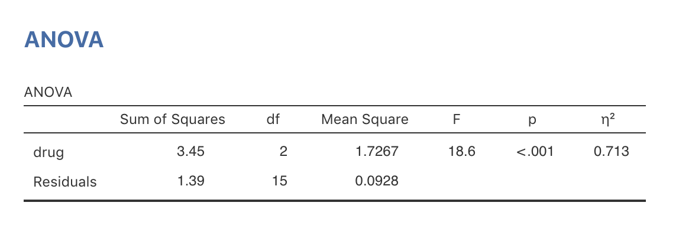
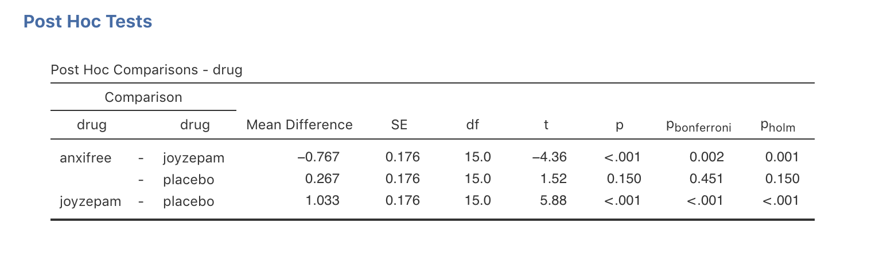
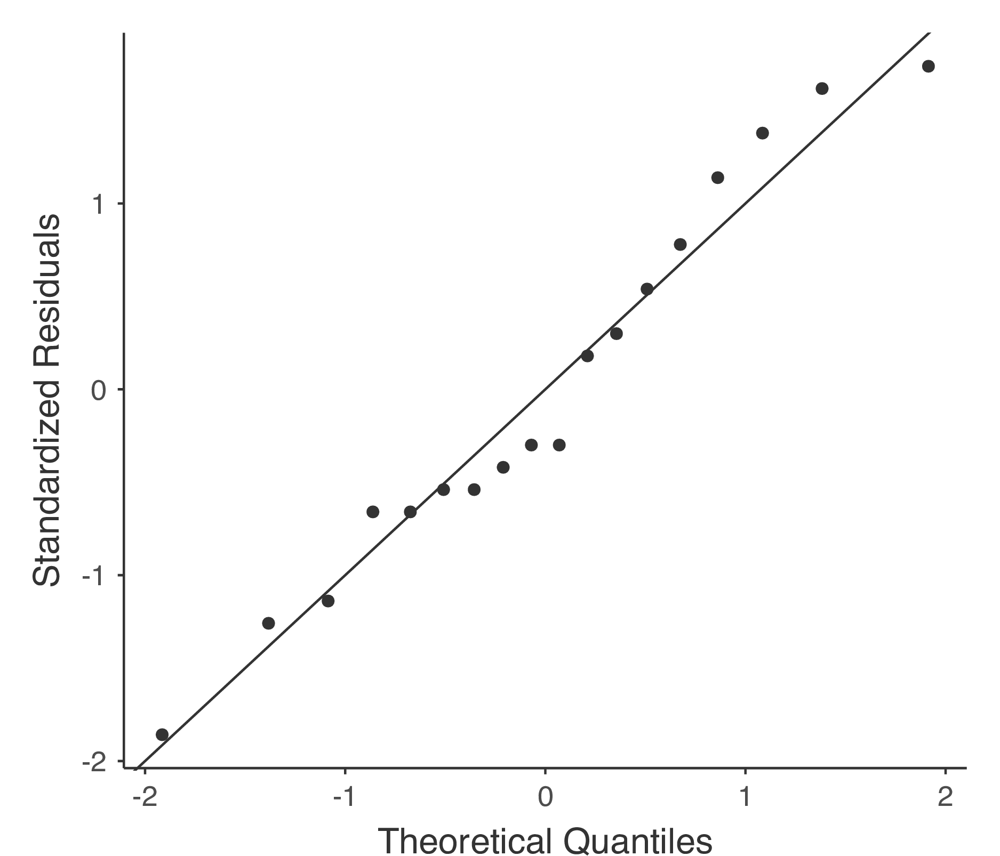

3つ以上の平均値の比較（1要因分散分析）{#ch:anova}
=======================================================

本章では，心理統計でもっとも広く使用されている統計ツールの1つ，分散分析（ANOVA）について説明します。この分析技法の基本的な部分は，20世紀初頭にサー・ロナルド・フィッシャーによって開発されました。この名前のせいで私たちはいろいろ悩まされるのことになるわけですが，基本的にそれはサー・ロナルド・フィッシャーのせいだということになります。分散分析（ANOVA）という名前は，2つの点において誤解を招きます。まず，名前に「分散」とついていますが，分散分析は平均値の差を調べるための方法です。2つめに，分散分析（ANOVA）と呼ばれるものは他にもいろいろあり，そのいくつかはお互いにほとんど関連がありません。この後の章ではさまざまな分散分析法を取りあげますが，それらはどれもかなり異なる状況に適用されるものです。そして本章では，その中でももっともシンプルな形の分散分析のみを考えることにします。それは，複数グループの観測値があり，それらのグループ間で結果変数に違いが見られるかどうかを知りたいという場合です。これは<span class="keyterm">1要因分散分析</span>（one-way ANOVA）が適用される場面です。

本章の構成は次の通りです。まず，セクション\@ref(sec:anxifree)では，本章を通じて使用することになる架空のデータセットについて説明します。データの説明が終わった後は，1要因分散分析がどのような仕組みになっているのかについて解説し（セクション\@ref(sec:anovaintro)），その後に<span class="jamovi">jamovi</span>で分散分析を実施する方法について説明します（セクション\@ref(sec:introduceaov)）。この2つのセクションが本章の中心部分です。本章の残りの部分では，分散分析の実施時に避けては通れないさまざまな話題について取りあげます。具体的には，効果量の計算方法（セクション\@ref(sec:etasquared)），事後検定と多重比較における補正（セクション\@ref(sec:posthoc)），そしてANOVAの前提条件（セクション\@ref(sec:anovaassumptions)）です。前提条件をチェックする方法や前提条件が満たされない場合の対策方法についても説明します（セクション\@ref(sec:levene)およびセクション\@ref(sec:kruskalwallis)）。本章の最後には，分散分析とその他の統計ツールの関係について少しだけ説明します（セクション\@ref(sec:anovaandt)）。

説明用データ  {#sec:anxifree}
---------------------------------------------

あなたが臨床試験を行っていると想定してください。そこでは新しい抗うつ薬，*ジョイゼパム*の治験が行われています。薬の効果を公正にテストするために，この研究では3つの投薬条件が用いられています。1つはプラシボ（偽薬），もう1つは既存の抗うつ・抗不安薬，*アンシフリー*です。最初の治験のため，抑うつ症状が中程度から重度の参加者18人が集められました。抗うつ薬は心理療法と組み合わせて投与されることも多いので，この研究では参加者のうち9人が認知行動療法（CBT）を受けました。残りの9人は心理療法を受けていません。参加者は各グループに無作為に割りあてられており（もちろん二重盲検法です），3つの投薬条件すべてにおいて，3人が認知行動療法を受け，3人は心理療法なしになっています。そしてそれぞれの薬物を3ヶ月間使用した後，心理学者が各参加者の気分を評価し，各個人の全体的な気分*改善*の程度を\(-5\)から\(+5\)までの尺度で評価しました。このような研究デザインを念頭に置いて，早速データファイルを読み込んでみましょう。ファイル名は<span class="filename">clinicaltrial.csv</span>です。このデータには<span class="rtext">drug</span>（投薬条件），<span class="rtext">therapy</span>（心理療法），<span class="rtext">mood.gain</span>（気分改善）の3つの変数が含まれています。

本章における一番の関心は，<span class="rtext">mood.gain</span>（気分改善）に対する<span class="rtext">drug</span>（薬）の効果です。まずやるべきことは，記述統計量を計算してグラフを作成することです。その方法は第\@ref(ch:descriptives)章で説明しています。そして<span class="jamovi">jamovi</span>で算出した記述統計量を図\@ref(fig:anova1)に示しました。

```{r anova1, warning=FALSE, echo=FALSE, out.width='82.4%', fig.align='center', fig.cap='気分改善得点の記述統計量と投薬条件ごとの箱ひげ図', echo=FALSE}
knitr::include_graphics("img/anova/anova1.png")
```


図から明らかなように，ジョイゼパムを投与されたグループの参加者は，アンシフリーやプラシボのグループに比べて気分が大きく改善しています。アンシフリーのグループではコントロール（プラシボ）よりも気分改善が見られていますが，その差はそれほど大きくありません。ここで私たちが知りたいのは，これらの差が「本物」なのか，単なる偶然なのかということです。

分散分析の仕組み  {#sec:anovaintro}
--------------------------------------

この臨床試験データの疑問に答えるために，これから1要因分散分析を実施します。<span class="jamovi">jamovi</span>の素晴らしい分散分析機能が使えなくても困らないように，ここではまず統計ツールをゼロから組み立てていくというハードな方法を説明します。これを注意深く読み，分散分析の仕組みを理解できたと確信できるまで2度3度と読み返してください。そしてその考え方が理解できたら，この方法を*2度と*繰り返す必要はありません。

さて，先ほどのセクションで説明した実験デザインからは，私たちの関心が3つの異なるグループにおいて気分改善度の平均値を比較することだということがわかるはずです。その意味で，ここで取りあげる分析は\(t\)検定（第\@ref(ch:ttest)章）とよく似たものになるのですが，比較するグループが3つあるという点が異なります。ここで，プラシボによる気分改善の母集団平均値を\(\mu_P\)，アンシフリーとジョイゼパムによる気分改善の母集団平均値をそれぞれ\(\mu_A\)と\(\mu_J\)とすると，私たちが検定したい（なんとも悲観的な）帰無仮説は，「3つのすべての母集団で平均値が同じである」というものになります。つまり，2つの薬は*どちらも*プラシボと変わらないということです。この帰無仮説は次のように書くことができます。

$$
\begin{array}{rcl}
H_0 &:& \mu_P = \mu_A = \mu_J \mbox{が真である} 
\end{array}
$$

そして私たちの対立仮説は，「3つの投薬条件のうち少なくとも1つで平均値が他と異なる」というものになります。これを数学的に書くのはちょっとばかり大変です。なぜなら（これから見ていきますが）帰無仮説が誤りである場合というのが何通りもあるからです。そこで，ここでは対立仮説を次のように書くことにします。

$$
\begin{array}{rcl}
H_1 &:& \mu_P = \mu_A = \mu_J \mbox{が真*でない*} 
\end{array}
$$

今回の帰無仮説の検定は，私たちがこれまでに見てきたものよりかなりやっかいです。どうやったらいいのでしょうか。その答えが「分散分析をする」であるというのは大体察しがつくでしょう。だって，それが本章のタイトルですし。でも，*平均値*について知りたいのに「*分散*分析」がどう役に立つのかよくわかりませんよね。実際，初めて分散分析を学ぶ人にとって，理解がしづらく感じられる最大の点といえるのがここなのです。ですから，この分析の仕組みを説明するためには，まず分散の話から始めるのがよさそうです。実際，これから私が始めることは，分散を説明する式を使ったちょっとした数学的なお遊びです。そして，分散で遊んでいるうちに，やがてそれが平均値について検討するための便利なツールになっていくのです。

### \(Y\)の分散の2つの式

まず，いくつか表記の説明から始めましょう。ここではグループの総数を\(G\)で表します。私たちのデータには３つの投薬条件があるのでグループの数は\(G=3\)です。次に，全体の標本サイズを\(N\)で表します。私たちのデータには\(N=18\)人の参加者がいます。同様にして，\(k\)番目のグループの人数を\(N_k\)と表します。この架空の臨床試験では，3群すべてで\(N_k = 6\)です^[すべてのグループで観測値の数が同じである場合，その実験デザインは「釣り合い型（balanced）」と呼ばれます。本章で取りあげる1要因分散分析では，釣り合い型かどうかは大して問題にはなりません。ですが，より複雑な分散分析をしようとする場合にはこれが重要になってきます。]。最後に，結果変数を\(Y\)で表します。例題データでは，\(Y\)は気分の改善得点です。また，\(k\)番目のグループの\(i\)番目の参加者の気分改善得点を\(Y_{ik}\)で表します。同様に，実験に参加した18人全員の気分改善得点の平均値を\(\overline{Y}\)，\(k\)番目のグループに含まれる6人の参加者の気分改善得点の平均値を\(\overline{Y}_k\)とします。

ここまではいいでしょうか。表記が整理できましたので，式を書き始めましょう。まず，セクション\@ref(sec:var)で使用した分散の式を思い出してください。私たちがまだ記述統計をやっていた，遠い昔の話です。\(Y\)の標本分散は次のようになります。

$$
\mbox{Var}(Y) = \frac{1}{N} \sum_{k=1}^G \sum_{i=1}^{N_k} \left(Y_{ik} - \overline{Y} \right)^2
$$

この式はセクション\@ref(sec:var)の分散の式とほとんど同じです。唯一違う点は，ここでの式には合計記号が2つ使われているということです。この式では，まずそれぞれのグループにいる個人（つまり\(i\)の値）について合計を求め，そしてグループ（つまり\(k\)の値）の合計を求めています。この違いはあくまでも見た目の問題です。仮に，標本に含まれる\(p\)番目の人の結果変数の値を\(Y_p\)と表すなら，合計記号は1つで済みます。ここで合計記号を2つ使用するのは，参加者を複数のグループに分け，それぞれのグループで参加者に番号をつけたからというだけの理由です。

これについては具体例を示した方がいいかもしれません。次の表について考えてみましょう。そこでは\(N=5\)人が\(G=2\)グループに分けられています。ここではとりあえずグループ1を「イケてる」人々，グループ2を「イケてない」人々としましょう。すると，イケてる人が3人（\(N_1 = 3\)）でイケてない人は2人（\(N_2 = 2\)）ということになります。


```{r, warning=FALSE, echo=FALSE,message=FALSE}
library(knitr)
library(kableExtra)

dt<- matrix(c(
'アニー','1','イケてる','1','1','20',
'ガリー','2','イケてる','1','2','55',
'サリー','3','イケてる','1','3','21',
'ダニー','4','イケてない','2','1','91',
'ナリー','5','イケてない','2','2','22'
), ncol=6, byrow=T)

dtf<-as.data.frame(dt)
colnames(dtf)<-c('','\\(p\\)','','\\(k\\)','\\(i\\)','\\(Y_{ik}\\)または\\(Y_p\\)')

kable(dtf, align = c('l','c','c','c','c','c')) %>%
  kable_styling(bootstrap_options = "striped", full_width = F) %>%
  add_header_above(c('名前','個人','グループ','グループID','グループ内の番号','不機嫌さ'))

```

この表では参加者を指す表記が2通り用いられているという点に注意してください。1つめは「個人」変数（\(p\)）で，これを用いれば標本中の\(p\)番目の個人の不機嫌さは\(Y_p\)と表すことができます。たとえば，表ではダニーは4番目ですから\(p = 4\)となります。つまり，誰だかわかりませんがこの「ダニー」なる人物の不機嫌さ（\(Y\)）について話すときは，この人物の不機嫌さを\(p = 4\)における\(Y_p = 91\)と表すことができるのです。しかし，ダニーを参照する方法はそれだけではありません。別の見方では，ダニーは「イケてない」グループ（\(k = 2\)）に属していて，そのイケてないグループで最初の人物（\(i = 1\)）です。つまり，ダニーの不機嫌さを\(k = 2\)かつ\(i = 1\)の場合の\(Y_{ik} = 91\)とすることもできるのです。このように，各個人\(p\)は\(ik\)のすべての組み合わせに対応しているので，私が先ほど書いた式は，次の通常の分散の式とまったく同じものになるのです。

$$  
\mbox{Var}(Y) = \frac{1}{N} \sum_{p=1}^N  \left(Y_{p} - \overline{Y} \right)^2  
$$

どちらの式も，単に標本に含まれる観測値に関して合計を計算しているだけです。たいていの場合は\(Y_p\)という表記が使われます。\(Y_p\)を使った式の方が明らかにシンプルだからです。しかし，分散分析では各参加者がどのグループに属するのかを把握しておくことが重要なので，そのために\(Y_{ik}\)という表記を使うのです。

### 分散から2乗和へ

さて，分散の計算方法がわかりました。今度は\(\mbox{SS}_{tot}\)で表される<span class="keyterm">全体2乗和</span>（total sum of squares）と呼ばれる値を定義しましょう。これはとても単純です。分散の計算では偏差の2乗を平均しますが，そうではなく，この値はただ合計しただけのものです。つまり，全体2乗和の式は分散の式とほぼ同じです。

$$  
\mbox{SS}_{tot} = \sum_{k=1}^G \sum_{i=1}^{N_k} \left(Y_{ik} - \overline{Y} \right)^2  
$$

分散の分析といいつつ，分散分析で実際に行っていることは，分散ではなくこの全体2乗和に関する計算です。そして全体2乗和には1つ嬉しい性質があります。この値は，2つの異なるばらつきに分解することができるのです。まず，1つめのばらつきが<span class="keyterm">グループ内2乗和</span>（within-group sum of squares）です。これは各個人の値が自分の属するグループの平均値からどれくらい離れているかを表したものです。

$$  
\mbox{SS}_w = \sum_{k=1}^G \sum_{i=1}^{N_k} \left( Y_{ik} - \overline{Y}_k \right)^2  
$$

\(\overline{Y}_k\)はグループの平均値です。例題データでいうと，\(\overline{Y}_k\)は\(k\)番目の投薬条件に含まれる参加者における気分改善得点の平均値です。つまり，実験参加者全体の平均値と個人の得点を比べるのではなく，同じグループ内の人とだけ比べるのです。その結果，\(\mbox{SS}_w\)の値は全体2乗和よりも小さくなります。なぜなら，グループの差，つまり投薬条件が気分改善に異なる影響を与えるだろうということを完全に無視しているからです。

次に，もう1つのばらつきの定義です。これはグループ間の違い*だけ*を捉えます。これは，グループの平均値\(\overline{Y}_k\)と全体の平均値\(\overline{Y}\)の差という形で見ることができます。このばらつきの大きさを数値化したものが<span class="keyterm">グループ間2乗和</span>（between-group sum of squares）です。

$$  
\begin{aligned}
\mbox{SS}_{b} &=& \sum_{k=1}^G \sum_{i=1}^{N_k} \left( \overline{Y}_k - \overline{Y} \right)^2 \\
&=& \sum_{k=1}^G N_k \left( \overline{Y}_k - \overline{Y} \right)^2\end{aligned}  
$$

実験参加者全体のばらつき（\(\mbox{SS}_{tot}\)）が，グループ間のばらつき（\(\mbox{SS}_b\)）とグループ内のばらつき（\(\mbox{SS}_w\)）の合計であることを式で示すのはそれほど難しくありません。つまり次のようになります。

$$  
\mbox{SS}_w  + \mbox{SS}_{b} = \mbox{SS}_{tot}  
$$

簡単ですね。

```{r anovavar, warning=FALSE, echo=FALSE, message=FALSE, out.width='82.4%', fig.align='center', fig.cap='グループ間のばらつき（図の(a)）とグループ内のばらつき（図のb）。図(a)の矢印はグループ平均値の違いを示しており，図(b)の矢印は各グループ内でのばらつきを強調している。'}

require(magick); require(ggplot2); require(ggplotify); require(cowplot)

p1<-as.grob(image_read("img/anova/anovaBetween.png"))
p2<-as.grob(image_read("img/anova/anovaWithin.png"))

plot_grid(p1,p2, labels=c("(a)", "(b)"),ncol=2,scale=.9,label_size=12)

```

さて，これで何がわかったのでしょうか。これでわかったのは，結果変数の全体的なばらつき（\(\mbox{SS}_{tot}\)）が数学的には「グループごとの平均値の違いによるばらつき」（\(\mbox{SS}_{b}\)）と「それ以外のばらつき」（\(\mbox{SS}_{w}\)）の合計として表せるということです。では，これは各グループが異なる母集団平均値を持つかどうか知るうえでどのように役立つのでしょうか。えっと…あれ？ ちょっと待ってください。これ*こそ*が私たちの探しているものじゃないでしょうか。帰無仮説が真の場合，すべてのグループの平均値はお互いにほぼ同じ値になるはずですよね。ということはつまり，それは\(\mbox{SS}_{b}\)がごく小さいか，あるいは少なくともそれが「何か別のものに関連したばらつき」（\(\mbox{SS}_{w}\)）よりも小さくなるということではないでしょうか。うん。どうやら仮説検定の方法が見つかったようです。

### 2乗和から\(F\)検定へ

先ほどのセクションで見たように，分散分析の背後にある*考え方*は\(\mbox{SS}_b\)と\(\mbox{SS}_w\)という2つの2乗和を比較することにあります。グループ間のばらつき（\(\mbox{SS}_b\)）がグループ内のばらつき（\(\mbox{SS}_w\)）に比べて大きい場合，すべてのグループで母集団平均値が同じであるということに疑いが生じるのです。ですが，この考え方を仮説検定にするためには，もうすこし「いじくり回す」必要があります。そこで，まず必要な検定統計量である<span class="keyterm">\(F\)比</span>（\(F\) ratio）の計算には*何*が必要なのかを説明したうえで，*なぜ*そのような計算になるのかという感覚をつかんでもらおうと思います。

2乗和の値を\(F\)比にするためには，SS\(_b\)とSS\(_w\)の<span class="keyterm">自由度</span>を計算しなくてはなりません。いつものように，自由度は特定の計算を行う際の「データ要素」の個数から，そこで満たされなくてはならない「制約」の個数を引いたものに対応します。グループ内変動では，グループ平均値（\(G\)個の制約）からの個々の観測値のばらつき（\(N\)個のデータ要素）を計算しています。対照的に，グループ間変動では全体の平均値（1個の制約）からのグループ平均値のばらつき（\(G\)個のデータ要素）を計算しています。したがって，それぞれの自由度は以下のようになります。

$$  
\begin{array}{lcl}
\mbox{df}_b &=& G-1 \\
\mbox{df}_w &=& N-G \\
\end{array}  
$$

とってもシンプルですよね。次は，2乗和の値を「2乗平均^[訳注：分散分析の文脈ではmean squareは「平均平方」と呼ばれることの方が一般的ですが，ここではあえて「2乗平均」としておきます。どうも，「平方といえば2乗のことである」ということが，「ゴホン！といえば 龍角散」と同じくらいスムーズに思い浮かぶ人が思ったより少ないように感じるからです。そして，そうした人にとっては「平均平方」より「2乗平均」の方が，わずかとは言えイメージしやすいでしょう。同じ理由で，本書の中では「平方和（sum of squares）」についても一貫して「2乗和」という表現を用いています。ただし，sum of squaresを「2乗和（二乗和）」と呼ぶことはmean squareを「2乗平均」と呼ぶことに比べるとだいぶ一般的なので，他の統計の教科書などでこちらが使われているのを目にすることも多いでしょう。]（mean square: MS）」に変換します。

$$  
\begin{array}{lcl}
\mbox{MS}_b &=& \displaystyle\frac{\mbox{SS}_b }{ \mbox{df}_b}  \\
 \\
\mbox{MS}_w &=& \displaystyle\frac{\mbox{SS}_w }{ \mbox{df}_w}  \end{array}  
$$

最後に，グループ間の2乗平均をグループ内の2乗平均で割って\(F\)比を求めます。

$$  
F = \frac{\mbox{MS}_b }{ \mbox{MS}_w }  
$$


非常に一般的な話をすれば，\(F\)統計量の背後にある考え方はとても単純です。大きな\(F\)値は，グループ間のばらつきがグループ内のばらつきに比べて大きいことを意味します。ですから，\(F\)の値が大きければ帰無仮説を棄却する根拠が十分あることになるわけです。でも，\(F\)がどれくらい大きければ帰無仮説（\(H_0\)）を棄却することができるのでしょうか。これを理解するためには，分散分析とは何か，2乗平均値が一体何を意味するのかについて，もう少し深く見ていく必要があります。

そこで次のセクションではこの点についてもう少し詳しく説明します。ですが，検定で何を測定しているのかという詳細部分にあまり関心のない読者のために，まずは結論を先に示しておきましょう。この仮説検定を完了するためには，帰無仮説が真の場合の\(F\)の標本分布が必要です。当然ながら，帰無仮説における\(F\)<u>統計量</u>は\(F\)<u>分布</u>します。第\@ref(ch:probability)章で取りあげた\(F\)分布の説明を覚えているでしょうか。\(F\)分布には2つのパラメータがあり，それぞれが2つの自由度に対応しています。最初の自由度1（df\(_1\)）はグループ間の自由度（df\(_b\)）で，2つめの自由度2（df\(_2\)）はグループ内の自由度（df\(_w\)）です。

1要因分散分析に含まれるこれら主要な数値を表\@ref(tab:anovatable)にまとめました。表には各数値を計算するための式も示してあります。

Table (#tab:anovatable)  分散分析に含まれる主要な数値のすべてを「標準的な」分散分析表にまとめたもの。数値の算出式も示した（ただし\(p\)値を除く。なぜなら，\(p\)の式は極めて複雑で，コンピューターを使用せずに計算するのは悪夢と言えるほど困難なためである）。

|                   | 自由度 | 2乗和 | 2乗平均 | \(F\)統計量 | \(p\) |
|:-------:|:-------:|:-------:|:-------:|:-------:|:-------:|
|グループ間 | \(\mbox{df}_b = G-1\) | \(\mbox{SS}_b = \displaystyle\sum_{k=1}^G N_k (\bar{Y}_k - \bar{Y})^2\) | \(\mbox{MS}_b = \displaystyle\frac{\mbox{SS}_b}{\mbox{df}_b}\) | \(F = \displaystyle\frac{\mbox{MS}_b }{ \mbox{MS}_w }\) | [複雑な式] |
| グループ内  | \(\mbox{df}_w = N-G\) | \(\mbox{SS}_w = \displaystyle\sum_{k=1}^G \displaystyle\sum_{i = 1}^{N_k} ( {Y}_{ik} - \bar{Y}_k)^2\) | \(\mbox{MS}_w =  \displaystyle\frac{\mbox{SS}_w}{\mbox{df}_w}\) | --- | --- |

### データのモデルと\(F\)の意味 {#sec:anovamodel}

非常に基本的な言い方をすれば，分散分析というのは帰無仮説（\(H_0\)）と対立仮説（\(H_1\)）という2つの統計モデル間の競争です。じつは最初のセクションで帰無仮説と対立仮説を説明した際には，これらのモデルが実際に意味するところについて，やや不正確な形で説明しましたので，ここでその修正をしようと思います。ただ，多分これは見ていて楽しいものではないとは思います。さて，覚えているでしょうか。私たちの帰無仮説は「すべてのグループで平均値が同じ」というものでした。すると，自然な考え方として，結果変数\(Y_{ik}\)は1つの母集団平均値\(\mu\)とそこからの個人の得点の偏差という形で説明できそうです。この偏差は一般的には\(\epsilon_{ik}\)と表され，そして伝統的には測定に関する*誤差*（error）あるいは<span class="keyterm">残差</span>（residual）と呼ばれています。ここで1つ注意して欲しいことがあります。「有意」という言葉のところでも見たように，「誤差」にも統計用語としての意味があり，この意味は日常語としての誤差とは少し意味が違うのです。日常の言葉の中では，「誤差」というと何らかの誤りが含まれていることを意味しますが，統計ではそうではありません（少なくともそれ以外の意味を含んでいます）。となると，ここでの用語としては「誤差」より「残差」のほうが好ましいでしょう。統計においては，どちらの用語も「残りのばらつき」，つまりモデルでは説明できない「何か」を意味します。ともあれ，帰無仮説を統計モデルとして書くと次のようになります。

$$  
Y_{ik} = \mu + \epsilon_{ik}  
$$

ここで，残差（\(\epsilon_{ik}\)）の平均値は0，標準偏差（\(\sigma\)）はすべてのグループで同じで，これは正規分布であると*仮定*します（これについては後で説明します）。第\@ref(ch:probability)章で使用した表記を用いると，この仮定は次のようにも書けます。

$$  
\epsilon_{ik} \sim \mbox{N}(0, \sigma^2)  
$$


では対立仮説（\(H_1\)）はどうなるでしょうか。帰無仮説と対立仮説の唯一の違いは，それぞれのグループが異なる平均値を持つかどうかと言うことです。つまり，実験における\(k\)番目のグループの平均値を\(\mu_k\)とするならば，対立仮説（\(H_1\)）に対応する統計モデルは次のようになります。

$$  
Y_{ik} = \mu_k + \epsilon_{ik}  
$$


ここでも，残差は平均値が0で標準偏差が\(\sigma\)の正規分布であると仮定します。つまり，対立仮説でも\(\epsilon \sim \mbox{N}(0, \sigma^2)\)と仮定するのです。

さて，これで帰無仮説（\(H_0\)）と対立仮説（\(H_1\)）がより詳しい形で統計モデルとして説明できました。これで，2乗平均が何を測定しているのか，そしてそれが\(F\)を解釈するうえでどのような意味を持つのかについての説明がとてもシンプルになりました。これを証明するために退屈な話を続けるようなことはしませんが，グループ内の2乗平均（MS\(_w\)）は，残差の分散（\(\sigma^2\)）の推定値と見なせるのです（数理の部分は第\@ref(ch:estimation)) 章を参照）。グループ間の2乗平均（MS\(_b\)）も推定値ですが，これは残差の分散*プラス*グループ間の平均値の差によって変化する量の推定値になります。この数値を\(Q\)と呼ぶなら，\(F\)統計量は基本的に次のようになります^[第\@ref(ch:anova2)章まで読み進んで，ある要因の\(k\)水準における「処置効果（treatment effect）」が\(\alpha_k\)値によってどのように定義されるかを見れば（セクション\@ref(sec:interactions)参照），\(Q\)は処置効果の重みづけ平均値であり，\(Q=(\sum_{k=1}^G N_k \alpha_k^2)/(G-1)\)であるということがわかります。]。

$$  
F = \frac{\hat{Q} + \hat\sigma^2}{\hat\sigma^2}  
$$

ここで，帰無仮説が真の場合には，真の値\(Q=0\)であり，対立仮説が真であれば，\(Q > 0\)になります[@Hays1994 ch. 10など]。というわけで，帰無仮説を棄却するには*\(F\)値が1より大きい*ことが最低条件となるのです。ただし，だからといって1より小さな\(F\)値があり得ないわけではないので注意してください。つまり，帰無仮説が真の場合，\(F\)比の標本分布は平均値が1になるので^[ひたすら正確さにこだわりたいならば，より厳密には1ではなく\(1 + \frac{2}{df_2 - 2}\)です。]，帰無仮説を安全に棄却するには1より大きな\(F\)値が必要になるということです。

標本分布についてもう少しだけ正確に言えば，帰無仮説が真の場合，MS\(_b\)とMS\(_w\)は残差の分散\(\epsilon_{ik}\)の推定値になります。これらの残差が正規分布するのだとすると，\(\epsilon_{ik}\)の分散の推定値はカイ2乗分布になるのではないかということに気づいた人もいるかもしれませんね。そう，（セクション\@ref(sec:otherdists)で説明したように），これはカイ2乗分布そのものなのです。カイ2乗分布は，正規分布する値を2乗して合計したときに得られる分布です。そして，（その定義上）カイ2乗分布する2つの値の比をとった場合に得られる分布が\(F\)分布なのですから，これが私たちに必要な標本分布になるのです。お気づきのように，ここでの説明の中には細かな部分でいろいろごまかしもあるのですが，大まかにはこれが標本分布の得られる仕組みです。

### 実例  {#sec:anovacalc}

ここまでの説明はやや抽象的で少しばかり技術的な部分に偏っていましたので，ここからは実際の例を使って見ていくことにしましょう。そのために，本章の冒頭に導入した臨床試験データに戻ります。すでに行った記述統計では，気分改善の平均値はプラシボで0.45，アンシフリーで0.72，ジョイゼパムで1.48でした。これらの値を念頭に置きながら，ここからは今が1899年であるかのように行動してみましょう^[より正確には，「今が1899年で，友人もおらず，その時代には何の意味もなかったような計算をひたすらやる以外に時間を潰す方法がない状況」を思い浮かべてください。分散分析というのは1920年代までは存在しなかったわけですから。]。紙と鉛筆を使った計算です。ここでは最初の5つの観測値についてだけそれをやることにします。なぜなら，今は1899年じゃないし，私はめんどくさがり屋だからです。では，グループ内の2乗和である\(\mbox{SS}_{w}\)の計算から始めましょう。まず，計算を楽にするための表を作成します。


```{r, warning=FALSE, echo=FALSE,message=FALSE}
library(knitr)
library(kableExtra)

dt<- matrix(c(
'プラシボ','0.5','プラシボ','0.3','プラシボ','0.1','アンシフリー','0.6','アンシフリー','0.4'
), ncol=2, byrow=T)

dtf<-as.data.frame(dt)
colnames(dtf)<-c('\\(k\\)','\\(Y_{ik}\\)')

kable(dtf, align = c('c','c','c')) %>%
  kable_styling(bootstrap_options = "striped", full_width = F) %>%
  add_header_above(c('グループ','結果'))

```

現時点では，表に含まれているのは生データだけです。つまり，各個人のグループ変数（<span class="rtext">drug</span>）と結果変数（<span class="rtext">mood.gain</span>）です。この結果変数は先ほどの式の\(Y_{ik}\)に対応する部分だという点に注意してください。次のステップは，この研究の各参加者ごとに対応するグループの平均値（\(\overline{Y}_k\)）を記入することです。これは繰り返し作業ですが，とくに難しいことではありませんね。必要なグループ平均値はすでに記述統計量として計算してあります。


```{r, warning=FALSE, echo=FALSE,message=FALSE}
library(knitr)
library(kableExtra)

dt<-c('**0.45**','**0.45**','**0.45**','**0.72**','**0.72**')
dtf2<-as.data.frame(dt)
colnames(dtf2)<-c('\\(\\overline{Y}_k\\)')

dtf2<-cbind(dtf,dtf2)

kable(dtf2, align = c('c','c','c')) %>%
  kable_styling(bootstrap_options = "striped", full_width = F) %>%
  add_header_above(c('グループ','結果','グループ平均値'))

```

必要な値の記入が終わりましたので計算を再開しましょう。各参加者について，グループ平均値からの偏差を求めます。つまり，\(Y_{ik} - \overline{Y}_k\)の計算です。計算が終わったら，その値を2乗します。すると，表は次のようになっています。

```{r, warning=FALSE, echo=FALSE,message=FALSE}
library(knitr)
library(kableExtra)

dt<-c('**0.05**','**--0.15**','**--0.35**','**--0.12**','**--0.32**')
dt2<-c('**0.0025**','**0.0225**','**0.1225**','**0.0136**','**0.1003**')

dtf2[,3]<-c('0.45','0.45','0.45','0.72','0.72')

dtf3<-data.frame(dt,dt2)
colnames(dtf3)<-c('\\(Y_{ik} - \\overline{Y}_{k}\\)','\\((Y_{ik} - \\overline{Y}_{k})^2\\)')
dtf3<-cbind(dtf2,dtf3)

kable(dtf3, align = c('c','c','c','c','c')) %>%
  kable_styling(bootstrap_options = "striped", full_width = F) %>%
  add_header_above(c('グループ','結果','グループ平均','偏差','偏差2乗'))

```


最後のステップも同様にとても単純です。グループ内の2乗和を計算するために，すべての観測値における偏差の2乗値を合計します。

$$  
\begin{array}{rcl}
\mbox{SS}_w &=& 0.0025 + 0.0225 + 0.1225 + 0.0136 + 0.1003 \\
&=& 0.2614
\end{array}  
$$


もちろん，実際の*正しい*答えが欲しい場合には，5つの観測値だけでなく，18個すべてについてこの計算を行う必要があります。このまま紙と鉛筆による計算を続けてもよいのですが，だんだん億劫になってきましたね。OpenOffice（LibreOffice）やExcelなどの表計算ソフトを使った方がいいかもしれません。自分で試してみてください。私がEXCELでそれをやってみた結果が<span class="filename">clinicaltrialanova.xls</span>ファイルに入っています^[訳注：<span class="jamovi">jamovi</span>で必要な値を求めた結果（\(F\)，自由度，\(p\)を除く）を<span class="filename">clinicaltrialanova.omv</span>ファイルに入れておきました。ただし，グループの平均値（<span class="rtext">Y.k</span>）は小数点第4位を四捨五入した値を手入力しているので，その分の丸め誤差があります（正確な値を式で計算させる方法もありますが，ごちゃごちゃするのでやめておきました）]。自分でやってみると，最終的にグループ内の2乗和の値は1.39になります。

よし。これで私たちはグループ内のばらつきの値（\(\mbox{SS}_w\)）を得ました。今度はグループ間の2乗和\(\mbox{SS}_b\)に目を向ける番です。この場合の計算も先ほどととてもよく似ています。主な違いは，すべての観測値について観測値（\(Y_{ik}\)）とグループ平均値（\(\overline{Y}_k\)）の差を求める代わりに，すべてのグループについてグループ平均値\(\overline{Y}_k\)と全体の平均値（\(\overline{Y}\)，この場合は0.88）の差を計算するというところです。

```{r, warning=FALSE, echo=FALSE,message=FALSE}
library(knitr)
library(kableExtra)

dt<-matrix(c(
'プラシボ','0.45','0.88','--0.43','0.19',
'アンシフリー','0.72','0.88','--0.16','0.03',
'ジョイゼパム','1.48','0.88','0.60','0.36'
),ncol=5,byrow=T)

dtf<-data.frame(dt)
colnames(dtf)<-c('\\(k\\)','\\(\\overline{Y}_k\\)','\\(\\overline{Y}\\)','\\(\\overline{Y}_{k}-\\overline{Y}\\)','\\((\\overline{Y}_{k}-\\overline{Y})^2\\)')

kable(dtf, align = c('c','c','c','c','c')) %>%
  kable_styling(bootstrap_options = "striped", full_width = F) %>%
  add_header_above(c('グループ','グループ平均','全体平均','偏差','偏差2乗'))

```

なお，グループ間の計算では，それぞれの偏差の2乗値をそのグループに含まれる観測値の個数（\(N_k\)）倍する必要があります。なぜなら，そのグループのすべての*観測値*（すべての\(N_k\)）がグループの差に関連しているからです。つまり，プラシボ群に6人の参加者がいて，プラシボ群の平均値が全体の平均値から0.19ずれているのなら，この6人に関連したグループ間のばらつきの*合計*は\(6 \times 0.19 = 1.14\)になるのです。だから，この計算表を拡張する必要がありますね。

```{r, warning=FALSE, echo=FALSE,message=FALSE}
library(knitr)
library(kableExtra)

dt<-matrix(c(
'プラシボ','…','0.19','6','1.14',
'アンシフリー','…','0.03','6','0.18',
'ジョイゼパム','…','0.36','6','2.16'
),ncol=5,byrow=T)

dtf<-data.frame(dt)
colnames(dtf)<-c('\\(k\\)','…','\\((\\overline{Y}_{k}-\\overline{Y})^2\\)','\\(N_k\\)','\\(N_k (\\bar{Y}_{k} - \\bar{Y})^2\\)')

kable(dtf, align = c('c','c','c','c','c')) %>%
  kable_styling(bootstrap_options = "striped", full_width = F) %>%
  add_header_above(c('グループ','…','偏差2乗','標本サイズ','重みづけ偏差2乗'))

```

そして，3つのグループの「重みづけされた偏差2乗」の合計を計算すると，グループ間の2乗和の値が求まります。

$$  
\begin{array}{rcl}
\mbox{SS}_{b} &=& 1.14 + 0.18 + 2.16 \\
&=& 3.48
\end{array}  
$$

見ての通り，グループ間の計算は非常にシンプルです^[<span class="filename">clinicaltrialanova.xls</span>にあるExcelでの\(SS_b\)の計算結果は3.45で，これは本文の値とわずかに異なります。これは数値の「丸め誤差（四捨五入などによる誤差）」によるものです。]。さて，これで2つの2乗和の値（\(\mbox{SS}_b\)と\(\mbox{SS}_w\)）の計算が終わりました。残りの手順はまったく苦痛ではありません。次は自由度の計算です。例題データには\(G = 3\)のグループがあり，全部で\(N = 18\)の観測値がありますので，単純な引き算で必要な自由度を算出できます。

$$  
\begin{array}{lclcl}
\mbox{df}_b &=& G - 1 &=& 2 \\
\mbox{df}_w &=& N - G &=& 15  \end{array}  
$$

グループ内のばらつきとグループ間のばらつきの2乗和と自由度がわかったので，そこから2乗平均を求めます。

$$  
\begin{array}{lclclcl}
\mbox{MS}_b &=& \displaystyle\frac{\mbox{SS}_b }{  \mbox{df}_b } &=& \displaystyle\frac{3.48}{ 2}  &=& 1.74 
\\  
 \\
\mbox{MS}_w &=& \displaystyle\frac{\mbox{SS}_w }{  \mbox{df}_w } &=& \displaystyle\frac{1.39}{15} &=& 0.09
\end{array}  
$$

あと少しです。ここから2乗平均値を使って私たちの求めている検定統計量，\(F\)値の計算です。グループ間の2乗平均をグループ内の2乗平均で割って\(F\)値を求めます。

$$  
F \ = \ \frac{\mbox{MS}_b }{ \mbox{MS}_w } \ = \ \frac{1.74}{0.09} \ = \ 19.3  
$$

やったー！ これは大興奮ですね。さて，検定統計量の計算が終わりましたので，あとはこの値が有意かどうかを見るだけです。第\@ref(ch:hypothesistesting)章で説明したように，「一昔前」なら統計の教科書を開いてたくさんの数字が書かれた一覧表をのぞき込み，対応する有意水準（0.05，0.01，0.001など）で自由度2と15の\(F\)の臨界値を探すことになります。そうすると，有意水準0.001の\(F\)値の臨界値は11.34とあるはずです。この数値は算出した\(F\)値より小さいので，\(p < 0.001\)と言うことができます。ですが，これは古いやり方です。今は素晴らしい統計ソフトが正確な\(p\)値を計算してくれます。実際，正確な\(p\)値は0.000071です。つまり，私たちが第1種の誤り率に対して*極度に*慎重でない限り，十分に帰無仮説を棄却できるということになります。

これで検定に関する計算はおしまいです。計算を終えたら，これらの数値を表\@ref(tab:anovatable)のような分散分析表にまとめるのが伝統的なやり方です。私たちの臨床試験データでは，分散分析表は次のようになります。

|                   | 自由度 | 2乗和 | 2乗平均 | \(F\)統計量 | \(p\)確率 |
|:-------:|:-------:|:-------:|:-------:|:-------:|:-------:|
| グループ間 | 2 | 3.48 | 1.74 | 19.3 | 0.000071 |
| グループ内   | 15 | 1.39 | 0.09 | --- | --- |


今では，おそらく自分でこうした表を作ることはないでしょうが，（<span class="jamovi">jamovi</span>を含む）ほとんどの統計ソフトは分散分析の結果をこのような表の形で示しますので，こうした表を読むのになれておくのは良いことです。なお，ソフトウェアはこのような分散分析表を出力しますが，結果を書く際にはこの表をそのまま書くようなことはしません。この結果を報告する際の一般的は書き方は次のようなものです。

> 1要因分散分析の結果，薬物による有意な気分改善効果が見られた（\(F(2,15) = 19.3, p<.001\)）。

なんと。あれだけ手間をかけたのに，結果はこの1文でおわりです。

<span class="jamovi">jamovi</span>での分散分析 {#sec:introduceaov}
--------------------------------------------------

先ほどのセクションを読み終えて，*とくに*あなたが私のアドバイスに従って紙と鉛筆で（といいつつ，表計算ソフトも使用していますが）すべてを自力で計算したあとに皆さんが何を考えているか，私にはかなりはっきりわかります。分散分析を手で計算するのは*サイテー*だと。計算の必要な値が山ほどあるので，分散分析のたびに何度も何度もこれを計算しなくてはならないとなるとかなり面倒です。

### <span class="jamovi">jamovi</span>での分散分析

そこで人生の苦しみを少しでも減らすことにしましょう。<span class="jamovi">jamovi</span>を使えば簡単に分散分析ができるのです。万歳！ 「**ANOVA**（分散分析）」メニューから「**ANOVA**（分散分析）」を選択し，<span class="rtext">mood.gain</span>（気分改善）変数を「**Dependent Variables**（従属変数）」ボックスに，そして<span class="rtext">drug</span>（投薬）変数を「**Fixed Factors**（固定要因）」ボックスに入れます。すると，図\@ref(fig:anova2)のような結果が得られたはずです ^[<span class="jamovi">jamovi</span>の結果は，先ほどの本文で説明した数値よりもずっと正確なものになっています。丸め誤差が少ないためです。]。ここでは「**Effect Size**（効果量）」オプションにある\(\eta^2\)（「イータ」2乗と読みます）のチェックボックスもオンにした上で分析を行っています。そしてこの値も表に含まれています。効果量については少し後で説明します。


```{r anova2, warning=FALSE, echo=FALSE, out.width='82.4%', fig.align='center', fig.cap='投薬による気分改善効果についての<span class="jamovi">jamovi</span>での分散分析結果', echo=FALSE}

```

<span class="jamovi">jamovi</span>の結果の表には，2乗和と自由度，そしてその他のあまり興味のない数値が並んでいます。なお，<span class="jamovi">jamovi</span>では「グループ間（between-group）」とか「グループ内（within-group）」といった表現が使われていないことに注意してください。その代わり，もっと意味のわかりやすい名前になっています。この例では，*グループ間*変数は<span class="rtext">drug</span>が結果変数に与える影響に対応します。そして，*グループ内*変数は「残りの」ばらつきに対応しており，これは*residuals*（残差）と示されています。セクション\@ref(sec:anovacalc)で計算した値とこれらの数値を比べてみると，丸め誤差を除いて大体同じになっているのがわかるはずです。グループ間の2乗和は\(\mbox{SS}_b = 3.45\)で，グループ内の2乗和は\(\mbox{SS}_w = 1.39\)です。そして自由度はそれぞれ2と15です。それから\(F\)値と\(p\)値もあり，これも私たちが苦労して手作業で求めた値と基本的に同じ値です。

効果量 {#sec:etasquared}
---------------------------------

分散分析で効果量を測定する方法はいくつかありますが，もっとも一般的に使用されているのは\(\eta^2\)（<span class="keyterm">イータ2乗</span>）と偏\(\eta^2\)です。1要因分散分析ではこれらの値は同一になりますので，ここでは\(\eta^2\)についてだけ説明しておきます。\(\eta^2\)の定義はとても単純です。

$$  
\eta^2 = \frac{\mbox{SS}_b}{\mbox{SS}_{tot}}  
$$

これだけです。つまり表\@ref(fig:anova2)の分散分析表の結果から，\(\mbox{SS}_b = 3.45\)で\(\mbox{SS}_{tot} = 3.45 + 1.39 = 4.84\)です。したがって，\(\eta^2\)値は次の通りとなります。

$$  
\eta^2 = \frac{3.45}{4.84} = 0.71  
$$

\(\eta^2\)の解釈も同じく簡単です。これは結果変数（<span class="rtext">mood.gain</span>）のばらつきのうち，予測変数（<span class="rtext">drug</span>）で説明できる割合を示します。\(\eta^2 = 0\)の場合は，2つの間にまったく関係がないことを意味し，\(\eta^2 = 1\)の場合にはその関係が完全であることを意味します。さらに，\(\eta^2\)値はセクション\@ref(sec:rsquared)で説明した\(R^2\)値とも密接に関連しており，解釈の仕方は同じです。

なお，統計の教科書の多くでは分散分析における効果量の指標は\(\eta^2\)が基本だとされていますが，ダニエル・レイケンス（Daniel Lakens）氏の興味深いブログ投稿によれば，\(\eta^2\)は偏りありの推定値になる可能性があり，実際のデータ分析におけるベストな効果量の指標とは言えないのではないかということです^[<http://daniellakens.blogspot.com.au/2015/06/why-you-should-use-omega-squared.html>]。ありがたいことに，<span class="jamovi">jamovi</span>には\(\eta^2\) と並んで\(\omega^2\)（オメガ2乗）を指定するオプションもあり，こちらはより偏りが小さい指標であるとされています。

多重比較と事後検定  {#sec:posthoc}
-----------------------------------------------------------

3つ以上のグループで分散分析をして結果が有意だった場合，どのグループの間に差があったのかをまず確認したいはずです。私たちの治験の例では，帰無仮説は「3つのすべての投薬条件（プラシボ，アンシフリー，ジョイゼパム）で気分改善効果がまったく同じ」というものです。しかしよく考えてみると，この帰無仮説は実際には*3つ*の異なる内容を1度に述べているのです。具体的には次の3つです。

-   アンシフリーの効果はプラシボと同じである（つまり\(\mu_A = \mu_P\)）

-   ジョイゼパムの効果はプラシボと同じである（つまり\(\mu_J = \mu_P\)）

-   アンシフリーとジョイゼパムは効果が同じである（つまり\(\mu_J = \mu_A\)）

これらの3つの主張のうち1つでも偽であれば，帰無仮説は偽になります。つまり先ほど帰無仮説が棄却されたということは，これらのうちの*少なくとも*1つは真でないということなのです。ですがどれでしょうか。この3つの命題は，いずれも関心の対象です。当然ながら新薬であるジョイゼパムがプラシボよりよく効くかどうかを知りたいでしょうし，既存の薬（つまりアンシフリー）よりジョイゼパムの方が効果があることがわかれば素晴らしいことですよね。アンシフリーがプラシボに比べて効果があるかどうかをチェックするのだって役に立つはずです。たとえアンシフリーがすでに他の研究者によってプラシボに対して十分テストされているとしても，私たちの研究で先行研究と同様の結果が得られたかどうかを確認することは有益ですからね。

帰無仮説には3つの異なる命題が含まれているということを考えると，私たちの「現実界の状態」には次の8通りの可能性があることがわかります。

| 可能性  | \(\mu_P = \mu_A\) | \(\mu_P = \mu_J\) |  \(\mu_A = \mu_J\) |  仮説 |
|:--------:|:--------:|:--------:|:--------:|:--------:|
|        1       |      ✓    |        ✓      |      ✓      |        帰無仮説 |
|        2         |    ✓    |        ✓      |                  |         対立仮説|
|        3       |      ✓    |                 |             ✓  |         対立仮説|
|        4       |      ✓    |                 |                  |                対立仮説|
|        5       |             |          ✓   |         ✓  |         対立仮説|
|        6      |              |             ✓   |                |              対立仮説|
|        7       |             |                     |                ✓  |         対立仮説|
|        8       |             |                     |                     |                対立仮説|

そして帰無仮説を棄却したということは，私たちは1番目の状態は真でないと考えているわけです。すると問題なのは，残り7つの可能性のうちのどれが正しいのかということです。このような状況では，まずデータを見てみることが大事です。たとえば，図\@ref(fig:anova1)を見ると，ジョイゼパムはプラシボやアンシフリーよりも効果的に見えますし，アンシフリーとプラシボには実際のところ差は無さそうです。ただし，答えをはっきりさせたいなら，何らかの検定を行ってみるのがいいかもしれません。

### ペアごとの\(t\)検定の実行

では，この問題はどう解決すればよいのでしょうか。私たちには比較すべき3つの平均値のペア（プラシボ対アンシフリー，プラシボ対ジョイゼパム，アンシフリー対ジョイゼパム）があるので，それぞれで\(t\)検定をやって結果を見てみるのがいいかもしれません。これは<span class="jamovi">jamovi</span>で簡単にできます。「**ANOVA**（分散分析）」の「**Post Hoc Tests**（事後検定）」オプションで，<span class="rtext">drug</span>変数を右側のボックスに移動させます。ここでは「**No correction**（修正なし）」のチェックをオンにしておきましょう。すると，<span class="rtext">drug</span>条件のペアごとの\(t\)検定結果が図\@ref(fig:anova3)のように表示されます。

```{r anova3, warning=FALSE, echo=FALSE, out.width='82.4%', fig.align='center', fig.cap='<span class="jamovi">jamovi</span>での事後検定としてのペアごとのt検定結果。', echo=FALSE}

```

### 多重検定の修正

先ほどのセクションでは，繰り返し何度も\(t\)検定を行うのは良くないことだということをほのめかしました。じつは，そうした分析を行うと「下手な鉄砲数打ちゃ当たる」的なことになってしまう懸念が生じるのです。つまりこれは，とくに理論的な裏づけなしに，どこかで有意な結果が出るだろうと期待しながらたくさんの検定を行っているのと同じなのです。理論が伴わないこの種のグループ間の差の探索は，<span class="keyterm">事後分析</span>（post hoc analysis）と呼ばれています^[もしあなたがある特定のペアだけを比較し，それ以外で比較する必要がないという理論的基礎を持っているなら，これはまた話が別です。それは「事後」分析を行っていることにはなりません。それは「計画的な比較」を行っていることになります。この状況については本書のもう少し後（セクション\@ref(sec:plannedcomparisons)）で説明しますが，ここでは話を単純にしておきたいと思います。]。

事後分析を行うこと自体はだめというわけではないのですが，その際にはいろいろと注意が必要です。たとえば，先ほどのセクションで実行した分析は，それぞれ*個別の*\(t\)検定で第1種の誤り率を5%に保つ（つまり\(\alpha = .05\)）よう設計されています。そして私はそれを3回実行したのです。もし分散分析のデータに10個のグループがあったらどうなるでしょう。その場合，どのグループとどのグループに差があるのかを知るためには45回の「事後」\(t\)検定をすることになります。すると，そのうちの2つか3つは*単なる偶然*で有意になる可能性があるのです。第\@ref(ch:hypothesistesting)章で見たように，帰無仮説検定における中心的な原則は第1種の誤り率をコントロールすることです。ですが今，私は分散分析の結果をうけてたくさんの\(t\)検定を一度に行いました。するとこの一連の検定全体（*族あたり*）でみた場合には，第1種の誤り率がまったくコントロールできていないことになるのです。

この問題に対する一般的な解決法は，一連の検定全体で誤り率が抑えられるように\(p\)値を調整することです[see @Shaffer1995]。事後検定を行う場合には通常（つねにというわけではありません）この種の調整が適用されますが，多くの場合，これは<span class="keyterm">多重比較補正</span>（correction for multiple comparisons）や「同時推定（simultaneous inference）」などと呼ばれています。とにかく，このような調整法には非常にたくさんのものがあるのです。このセクションおよびセクション\@ref(sec:posthoc2)でそのうちのいくつかについて説明しますが，それ以外にもたくさんのものがあるということは覚えておいてください[see, e.g., @Hsu1996]。

### ボンフェロニ補正 {#sec:bonferroni}

これらの調整法でもっとも単純なのは<span class="keyterm">ボンフェロニ補正</span>（Bonferroni correction）と呼ばれる方法です[@Dunn1961]。これは本当に本当に単純なのです。事後分析で\(m\)回の検定を行うとしましょう。そして全体での第1種の誤り率を最大で\(\alpha\)に抑えたいとします^[すべての調整法がこうしようとしているわけではないということは指摘しておいた方がよいでしょう。私がここで説明しているのは，「族あたりの第1種の誤り率」をコントロールしようとするアプローチです。それ以外の事後検定では，「偽発見率（false discovery rate: FDR）」をコントロールしようとするものもあります。これはまた別のものです。]。その場合，ボンフェロニ補正は「元の\(p\)値をすべて\(m\)倍する」だけなのです。元の\(p\)値を\(p\)とし，そして修正値を\(p^\prime_j\)とした場合，ボンフェロニ補正では次のようになります。

$$  
p^\prime = m \times p  
$$


そして，ボンフェロニ補正を使用する場合，\(p^\prime < \alpha\)の場合に帰無仮説を棄却します。この補正の考え方はとても簡単です。つまり，\(m\)回の検定をするのだから，検定ごとの第1種の誤り率が最大でも\(\alpha / m\)であれば，検定*全体*での第1種の誤り率が\(\alpha\)より大きくなることはないというわけです。本当にシンプルな方法なので，著者自身も次のように言っています。

> ここで示した方法は，あまりに単純であまりに一般的なものであることから，おそらくすでにどこかで使用されていたに違いない。ただ，私には過去の使用例を見つけることはできなかった。おそらく，この方法はあまりに単純過ぎて，この方法がいくつかの状況で非常に役立つものだということに統計学者たちも気づけなかったのだろう[@Dunn1961 pp 52-53]。

このボンフェロニ補正を<span class="jamovi">jamovi</span>で使用するには，単に「**Correction**（補正）」のところで「**Bonferroni**（ボンフェロニ）」のチェックボックスをオンにするだけです。そうすると，分散分析の結果の表に新たに列が追加され，結果の<span class="rtext">p<sub>bonferroni</sub></span>という欄にボンフェロニ補正済の\(p\)値が表示されます（\@ref(fig:anova3)）。補正済みの\(p\)値と補正されていない\(t\)検定の\(p\)値を比較すると，<span class="jamovi">jamovi</span>が元の値を3倍しただけだというのがよくわかります。

### ホルム補正

ボンフェロニ補正はもっとも単純な調整法ですが，この方法がベストというわけではありません。その代わりとしてよく用いられる方法に<span class="keyterm">ホルム補正</span>（Holm correction）があります[@Holm1979]。ホルム補正では，あなたが一連の検定全体を（元の）\(p\)値が最小のものから徐々に大きなものへと連続的に行っているものとして捉えます。そして，\(j\)番目に大きな\(p\)値に対しては次の*いずれか*の調整が行われます。

$$  
p^\prime_j = j \times p_j  
$$

（最大の\(p\)値は変化させず，2番目に大きな\(p\)値を2倍し，3番目に大きな\(p\)値を3倍し……として調整する）

*または* 

$$  
p^\prime_j = p^\prime_{j+1}  
$$


上の式で求められた値のいずれか<u>大きい方</u>をとるのです。ちょっとややこしいので混乱するかもしれませんね。ですからもう少しゆっくり見てみましょう。ホルム補正の方法は次の通りです。まず，すべての\(p\)値を小さい順に並べます。そしてもっとも小さな\(p\)値を\(m\)倍します。残りの\(p\)値については2段階で調整を行います。たとえば，2番目に小さな\(p\)値では，まずその値を\(m-1\)倍します。その結果が先ほど調整した\(p\)値よりも大きな値だった場合，この値を使用します。ですが，先ほどより小さかった場合には，先ほどの\(p\)値をそのまま使います。この仕組みを説明するためにこの手順を表にしてみました。この表にはホルム補正で5つの\(p\)値を補正した場合の計算例を示しています。

```{r, warning=FALSE, echo=FALSE,message=FALSE}
library(knitr)
library(kableExtra)

dt<-matrix(c(
'.001','5','.005','.005',
'.005','4','.020','.020',
'.019','3','.057','.057',
'.022','2','.044','.057',
'.103','1','.103','.103'
),ncol=4,byrow=T)

dtf<-data.frame(dt)
colnames(dtf)<-c('\\(p\\)','順位\\(j\\)','\\(p \\times j\\)','ホルムの\\(p\\)')

kable(dtf, align = c('c','c','c','c')) %>%
  kable_styling(bootstrap_options = "striped", full_width = F)

```

これで理解できたでしょうか。

計算は少しばかり難しいですが，ホルム補正には優れた特性があります。この補正はボンフェロニ補正よりも検定力が高い（つまり第2種の誤り率が低い）のです。そして直感的にはそう思えないかもしれませんが，ホルム補正とボンフェロニ補正では第1種の誤り率は*同じ*なのです。ということで，実際の場面ではボンフェロニ補正を使う理由がまったくないことになります。なぜなら，単純なボンフェロニ補正はいくらか精巧なホルム補正につねに劣ることになるからです。つまり，多重比較補正の方法としてはホルム補正を*主力*にすべきだということですね。図\@ref(fig:anova3)にはホルム補正された\(p\)値も含まれています（<span class="rtext">p<sub>holm</sub></span>の欄）。値を比較すると，もっとも大きな\(p\)値（アンシフリーとプラシボの比較）は元の値と同じであることがわかります。値は\(.15\)で，これはまったく補正されていない元の値と同じです。対照的に，最も小さい\(p\)値（ジョイゼパム対プラシボ）は3倍されています（といっても見た目にはわかりませんが）。

### 事後検定の結果の書き方

最後に，事後分析でどのグループが有意に他と異なっているかを判断したら，その結果を次のように書きます。

> 事後検定（\(p\)値をホルム補正で調整）の結果，ジョイゼパムによる気分変化はアンシフリー（\(p = .001\)）およびプラシボ（\(p = 9.0 \times 10^{-5}\)）に比べて有意に大きいことが示された。アンシフリーがプラシボよりも効果的であるという結果は得られなかった（\(p = .15\)）。

もし正確な\(p\)値を書くやり方が好きでなければ，その数字の部分をそれぞれ\(p<.01\)や\(p<.001\)，\(p > .05\)に変えてください。いずれにせよ，大事なのは「ホルム補正で\(p\)値を補正した」ということをきちんと示すということです。そしてもちろん，ここではすでにどこかで関連する記述統計量（グループの平均値や標準偏差）についての記述がなされているものと仮定しています。なぜなら，ただ\(p\)値を並べただけでは大して有益な情報とはいえないからです。

1要因分散分析の前提条件 {#sec:anovaassumptions}
---------------------------------------------------------

他の統計的検定と同様に，分散分析もデータに対するいくつかの仮定に依存しています。とくに重要な仮定は，*正規性*，*分散の等質性*，そして*独立性*の3つです。セクション\@ref(sec:anovamodel)の説明を覚えているでしょうか。全部は読んでいなくてもざっとは見てくれていると思いたいですが，そこで私は分散分析の基礎となる統計モデルを次のように書きました。

$$  
\begin{array}{lrcl}
H_0: & Y_{ik} &=& \mu + \epsilon_{ik} \\
H_1: & Y_{ik} &=& \mu_k + \epsilon_{ik}  
\end{array}  
$$

この式では，\(\mu\)はすべてのグループで同じ1種類の母集団平均値を示しています。また，\(\mu_k\)は\(k\)番目のグループごとの母集団平均値です。ここまでのところ，私たちは自分たちのデータが1つの全体平均値で説明できる（帰無仮説）かグループごとに異なる平均値で説明されるか（対立仮説）というところばかりを見てきました。もちろんこれは意味のあることで，実際これが研究における重要な問いなわけです。しかし，ここまでの検定手順はどれも，残差（\(\epsilon_{ik}\)）についてのある仮説に暗黙に依存していたのです。それは次のものです。

$$  
\epsilon_{ik} \sim \mbox{N}(0, \sigma^2)  
$$

この仮定なしにはどの計算も正しく機能しません。より正確には，それでもすべての計算をして\(F\)統計量にたどり着くこと自体はできるのですが，その\(F\)統計量で実際に私たちが測定したいものを測定できているという保証が得られないのです。ということは，その\(F\)統計量を用いた検定を基に引き出された結論は，どれも間違っている可能性があるということです。

では，この残差に関する仮定が正しいことをどうやって確認したらいいのでしょう。前述の通り，この仮定には3つの異なる主張が含まれていますので，それらを別々に見ていくことにしましょう。

-   <span class="keyterm">正規性</span>　 残差は正規分布していることが仮定されています。セクション\@ref(sec:shapiro)で見たように，これはQ-Qプロット（あるいはシャピロ・ウィルク検定^[<span class="jamovi">jamovi</span>では，まだ分散分析メニューの中でシャピロ・ウィルク検定はできません。]）で評価できます。分散分析におけるこれらの方法についてはセクション\@ref(sec:anovanormality)で説明します。

-   <span class="keyterm">分散の等質性</span>　 母集団の標準偏差に関しては，それぞれのグループが別々の標準偏差を持つ（\(\sigma_k\)）のではなく，1つの値（つまり\(\sigma\)）しかないという点に注意してください。これは分散の等質性（等分散性）の仮説とよばれます。分散分析では，母集団の標準偏差はすべてのグループで同じであると仮定されているのです。これについてはセクション\@ref(sec:levene)で詳しく説明します。

-   <span class="keyterm">独立性</span>　 この独立性の仮定は少しばかりやっかいです。これが基本的に意味することは，1つの残差についてわかったところで，他の残差については何もわからないということです。ここでは，\(\epsilon_{ik}\)のすべての値が，他の残差からの影響を受けることなく生じていると仮定されています。これを調べるための単純な方法というのはないのですが，この仮定に明らかに違反している状況というのはいくつか考えられます。たとえば，その研究が繰り返し測定デザインである場合，各参加者に対して複数の条件で繰り返し測定を行っているわけですから独立性が保たれません。観測値の間に特別な関係，つまり同じ個人から得られたものであるという関係があるからです。このような場合には，反復測定分散分析のような別の手法を使用する必要があります。

分散の等質性の確認方法  {#sec:levene}
------------------------------------------------------------------

（英語には）「猫の皮をはぐ方法は1つに限らない（ある種の仕事は何通りかのやり方がある）」ということわざがありますが，等分散性の仮定を検定する方法も1つに限りません（なぜ誰もこれをことわざにしないのでしょうね）。私がこれまでに見た中で，論文の中でもっとも一般的に使用されているのは<span class="keyterm">ルビーン検定</span>（Levene test）[@Levene1960]と，それに深く関連した<span class="keyterm">ブラウン・フォーサイス検定</span>（Brown-Forsythe test）[@BrownForsythe1974]です。ここではこの両方について説明します。

ルビーン検定は驚くほど単純です。私たちの手元に\(Y_{ik}\)個の結果変数があるとしましょう。私たちがすべきことは，グループ平均値からの偏差の絶対値に対応した新しい変数を定義することだけなのです。ここでは新しい変数を\(Z_{ik}\)と表しましょう。

$$  
Z_{ik} = \left| Y_{ik} - \overline{Y}_k \right|  
$$

さて，これが何の役に立つのでしょうか。まず，\(Z_{ik}\)が一体何なのか，私たちが何を検定しようとしているのかについて少し考えてみましょう。\(Z_{ik}\)の値は，\(k\)番目のグループにおける\(i\)番目の観測値がそのグループ平均値から離れている程度を表します。そして私たちの帰無仮説は「すべてのグループで分散が同じである」というもので，これはつまり，グループ平均値からの全体的な偏差がすべてのグループで同じであるということなのです。ということで，ルビーン検定の帰無仮説は「\(Z\)の母集団平均値はすべてのグループで同じである」というものになります。うん。そして私たちに必要なのは，「すべてのグループで平均値が同じである」という帰無仮説に対する統計的検定です。これに見覚えはないですか。そうです。これは分散分析です。つまり，ルビーン検定とは，新しく作成した変数\(Z_{ik}\)に対して分散分析をするのと同じなのです。

ではブラウン・フォーサイス検定はどうでしょう。何か際だった違いがあるのでしょうか。ありません。ルビーン検定との違いは，\(Z\)変数の値の求め方が少し違うということだけです。この検定では，グループの*平均値*の代わりに*中央値*からの偏差を使用するのです。これがブラウン・フォーサイス検定です。

$$  
Z_{ik} = \left| Y_{ik} - \mbox{median}_k(Y) \right|  
$$


\(\mbox{median}_k(Y)\)はグループ\(k\)の中央値です。標準的なルビーン検定の場合もブラウン・フォーサイス検定の場合も，検定統計量（これは\(F\)と書かれることもあれば\(W\)と書かれることもあります）は通常の分散分析で計算される\(F\)統計量とまったく同じ方法で算出されます。ただ，\(Y_{ik}\)の代わりに\(Z_{ik}\)が使用されているだけなのです。これらの点を念頭に置きながら，次にこの検定を<span class="jamovi">jamovi</span>で行う方法について見てみましょう。

### <span class="jamovi">jamovi</span>でのルビーン検定

ルビーン検定はどうやればよいのでしょう。とても簡単です。分散分析画面の「**Assumption Checks**（前提条件チェック）」オプションで，「等質性検定」のチェックボックスをオンにするだけです。図\@ref(fig:anova4)に示された結果を見ると，検定結果は有意でない（\((F_{2,15} = 1.45, p = .266)\)）ことがわかります。ということで，分散の等質性の仮定については問題なさそうです。

```{r anova4, warning=FALSE, echo=FALSE, out.width='58.8%', fig.align='center', fig.cap='<span class="jamovi">jamovi</span>による1要因分散分析のためのルビーン検定の結果。', echo=FALSE}
knitr::include_graphics("img/anova/anova4.png")
```

正規性の仮定の確認方法 {#sec:anovanormality}
------------------------------------------------------------

正規性の仮定についての確認方法は比較的単純です。必要なことのほとんどはセクション\@ref(sec:shapiro)で説明しました。私たちがすべきことはQ-Qプロットを作成することだけです。また，可能であれば追加でシャピロ・ウィルク検定を行えばよいのです。図\@ref(fig:anova5)にQ-Qプロットを示しましたが，私には十分正規分布しているように見えます。

```{r anova5, warning=FALSE, echo=FALSE, out.width='70.6%', fig.align='center', fig.cap='<span class="jamovi">jamovi</span>の分散分析でオプションとして作成されるQ-Qプロット。', echo=FALSE}

```

正規性の仮定を必要としない方法  {#sec:kruskalwallis}
-----------------------------------------------------------

ここまでは正規性の確認方法について見てきました。そうすると次は，もしこの正規性の仮定が満たされていなかった場合にはどう対処すればいいのかと疑問に思うのが自然な流れというものでしょう。1要因分散分析の場合，おそらくもっとも簡単な解決策はノンパラメトリック検定（つまり，分布の種類に関する特定の仮定に基づかない方法）を使用することです。ノンパラメトリック検定についてはすでに第\@ref(ch:ttest)章でも取りあげました。グループが2つしかない場合，利用可能なノンパラメトリック検定にはマン・ホイットニー検定やウィルコクソン検定がありましたが，グループが3つ以上ある場合には<span class="keyterm">クラスカル・ウォリス順位和検定</span>（Kruskal-Wallis rank sum test）[@KruskalWallis1952]が使用できます。ではこの検定について見ていくことにしましょう。

### クラスカル・ウォリス検定の考え方

クラスカル・ウォリス検定は，ある意味で驚くほど分散分析に似ています。分散分析では\(Y_{ik}\)，つまり\(k\)番目のグループにおける\(i\)番目の個人の結果変数を用いて分析を行いました。クラスカル・ウォリス検定では，これら\(Y_{ik}\)の値を大小順に並べ替えて順位をつけ，そしてこの順位データに対して分析を実施するのです。まず，\(k\)番目のグループの\(i\)番目の個人の順位を\(R_{ik}\)としましょう。そして，\(k\)番目のグループに含まれる観測値に与えられた順位の平均値，\(\overline{R}_k\)を算出します。

$$  
\overline{R}_k = \frac{1}{N_K} \sum_{i} R_{ik}  
$$


そして，全体の順位の平均値（\(\overline{R}\)）についても計算しましょう。

$$  
\overline{R} = \frac{1}{N} \sum_{i} \sum_{k} R_{ik}  
$$


それが終わったら，全体の順位平均値（\(\overline{R}\)）からの偏差の2乗を計算します。これを個別の順位得点について求めると，つまり\((R_{ik} - \overline{R})^2\)を計算すると，その値は\(ik\)番目の観測値の順位が全体の順位平均値からどれだけ離れているかについての「ノンパラメトリック」な指標になるのです。そして，全体の順位平均値からのグループ順位平均値の偏差の2乗を計算すると，つまり\((\overline{R}_k  - \overline{R} )^2\)を計算すると，この値は全体の順位平均値からその*グループ*がどれだけ離れているのかについてのノンパラメトリックな指標になります。これを念頭に置きながら，分散分析と同じ考え方で*順位*の2乗和を定義します。まず，すでに「全体の順位2乗和」については計算が終わっています。

$$  
\mbox{RSS}_{tot} = \sum_k \sum_i ( R_{ik} - \overline{R} )^2  
$$


そして「グループ間の順位2乗和」は次のように定義できます。

$$  
\begin{array}{rcl}
\mbox{RSS}_{b} &=& \sum_k \sum_i ( \overline{R}_k  - \overline{R} )^2 \\
&=& \sum_k N_k ( \overline{R}_k  - \overline{R} )^2  \end{array}  
$$

つまり，もし帰無仮説が真であれば，そこにはグループの真の違いはまったくないということになり，グループ間の順位2乗和（\(\mbox{RSS}_{b}\)）は非常に小さく，全体の順位2乗和（\(\mbox{RSS}_{tot}\)）よりもかなり小さくなると考えられるのです。考え方としては，これは私たちが分散分析の\(F\)統計量を求めたときのやり方とほぼ同じです。ですが，具体的な計算方法は同じではないため，クラスカル・ウォリス検定統計量は通常は\(K\)と表されます。これは次のように少し違った形になります。

$$  
K = (N - 1) \times \frac{\mbox{RSS}_b}{\mbox{RSS}_{tot}}  
$$


そして帰無仮説が真であれば，\(K\)の標本分布は*おおよそ*自由度\(G-1\)のカイ2乗分布になります（\(G\)はグループの個数です）。\(K\)の値が大きいほどデータが帰無仮説と一致しないことになるので，この検定は片側検定です。そして\(K\)が十分に大きいときに帰無仮説（\(H_0\)）を棄却します。

### 捕捉

先ほどのセクションでは，クラスカル・ウォリス検定の考え方について説明しました。*考え方*としては，この検定の仕組みについては先ほど説明した通りです。ですが，数学的な視点から見た場合，この計算はとんでもなく面倒くさいことになるのです。そこで，（ここでその導出法を示したりはしませんが）ちょっとばかり代数の裏の手^[専門用語]を使って\(K\)の式を次のように書き直します。

$$  
K = \frac{12}{N(N-1)} \sum_k N_k {\overline{R}_k}^2    -  3(N+1)  
$$

これが最終的な\(K\)の式です。こちらの式の方が，先ほどのセクションで示した式よりもずっと計算が簡単です。ただし，この式は人間にとってはまったくもって意味不明になってしまっています。ですから，おそらく\(K\)については私が先ほど説明したような「順位についての分散分析」という例え方をするのが一番の方法でしょう。ただし，最終的に算出される検定統計量は分散分析で計算されるものとはずいぶん違ったものになるということは覚えておいてください。

そうそう，もう1つありました。やれやれ，何でいつもそうなんでしょう。もう1つもう1つって，まるで刑事コロンボみたいですよね。さて，ここまでのお話は，じつは生データに同順位がない場合に限って真実なのです。つまり，まったく同じ値の観測値が含まれていない場合です。同順位のデータが*ある*場合，この計算を修正するための補正係数が必要になるのです。ええ，そうですよね。この時点で，おそらくもっとも勤勉な読者でさえ，もうどうでもよくなってきたんじゃないでしょうか（少なくとも同順位補正係数なんて今すぐには必要ないと思ったことでしょう）。だから，その計算方法については素早くささっと説明します。それと*なぜ*そうなるのかについての詳細は退屈だし省略することにします。私たちが生データを使って度数分布表を作成したとしましょう。ここでは\(f_j\)を\(j\)番目の固有の値とします。これだけだとちょっと抽象的すぎるかもしれませんので，具体例として<span class="filename">clinicaltrials.csv</span>データセットの<span class="rtext">mood.gain</span>変数について作成した度数分布表を使います。

```{r, warning=FALSE, echo=FALSE,message=FALSE}
library(knitr)
library(kableExtra)

dt<- matrix(c(
'1','1','2','1','1','2','1','1','1','1','2','2','1','1'
), nrow=1, byrow=T)

dtf<-as.data.frame(dt)
colnames(dtf)<-c('0.1','0.2','0.3','0.4','0.5','0.6','0.8','0.9','1.1','1.2','1.3','1.4','1.7','1.8')

kable(dtf, align = c('c','c','c')) %>%
  kable_styling(bootstrap_options = "striped", full_width = F)
```

この表を見ると，度数分布表の3番目の値が\(2\)になっています。これは0.3という<span class="rtext">mood.gain</span>の値に対応しているので，この表から気分改善度が0.3であった人が2人いたことがわかります。つまり，私が上で導入した数学的な表記では，これは\(f_3 = 2\)であるということなんです。さて，これらの数値を用いて次のように同順位補正係数（TCF）を計算します。

$$  
\mbox{TCF} = 1 - \frac{\sum_j {f_j}^3 - f_j}{N^3 - N}  
$$


クラスカル・ウォリス統計量に対する同順位補正後の値は，\(K\)をこの値で割ることによって求められます。<span class="jamovi">jamovi</span>で計算されるのは，このようにして同順位を補正した値です。さて，これでようやく本当にクラスカル・ウォリス検定の理論に関する説明はおしまいです。自分がクラスカル・ウォリス検定の同順位補正係数の計算方法を知らないことに気づいた際，皆さんの心の中には実存的不安がこみ上げてきたはずです。今こうして私がその不安を取り除いてあげたおかげで，皆さんはきっと深く安堵していることでしょう。ですよね？

### <span class="jamovi">jamovi</span>でのクラスカル・ウォリス検定

クラスカル・ウォリス検定の仕組みを理解するための道のりは恐怖に満ちていたかもしれませんが，この検定の実行そのものは非常に簡単です。なぜなら，<span class="jamovi">jamovi</span>には「**ANOVA**（分散分析）」メニューの一部として，「**Non-Parametric**（ノンパラメトリック）」の「**One Way ANOVA (Kruskall-Wallis)**（1要因分散分析：クラスカル・ウォリス）」が含まれているからです。たいていの場合，あなたの手元にあるのは<span class="filename">clinicaltrial.csv</span>のようなデータで，そこには結果変数（<span class="rtext">mood.gain</span>）とグループ変数（<span class="rtext">drug</span>）が含まれているはずです。であれば，あとは<span class="jamovi">jamovi</span>で分析を実行するだけです。分析を実行すると，図\@ref(fig:anova6)に示したようにクラスカル・ウォリス\(\chi^2\) = 12.076, df = 2, \(p\) = 0.00239という結果が得られます。

```{r anova6, warning=FALSE, echo=FALSE, out.width='82.4%', fig.align='center', fig.cap='<span class="jamovi">jamovi</span>でのクラスカル・ウォリス検定の様子', echo=FALSE}
knitr::include_graphics("img/anova/anova6.png")
```

分散分析とスチューデントの\(t\)検定 {#sec:anovaandt}
-----------------------------------------------------------------------------

本章の最後に，あと1つだけ指摘しておきたいことがあります。それは多くの人が驚くことで，そして知っておく価値のあることです。じつは，2グループの分散分析はスチューデントの\(t\)検定とまったく同じなのです。いえ，本当にです。単に似ているというのではなく，本当にあらゆる意味において同一なのです。これが真実であることを証明しようとはしませんが，1つ具体的な証拠をお見せします。例題データで，<span class="rtext">drug</span>（投薬条件）の代わりに<span class="rtext">therapy</span>（心理療法）をグループ変数として分散分析を行ってみましょう。この分散分析を実行すると，\(F\)統計量は\(F(1,16) = 1.71\)で，\(p = 0.21\)となります。グループが2つしかありませんので分散分析に頼る必要はありません。ここではスチューデントの\(t\)検定をすることもできます。そこで，実際にその通りにやってみたらどうなるかを見てみましょう。すると，\(t\)統計量\(t(16) = -1.3068\)で\(p= 0.21\)という結果になりした。不思議なことに\(p\)値が同じですね。こちらも \(p = .21\)です。ですが，検定統計量はどうでしょう。分散分析の代わりに\(t\)検定実行すると，\(t(16) = -1.3068\)という値になります。これは少し違う値です。ですが，じつはここにとても単純な関係があるのです。この\(t\)統計量を2乗すると，先ほど得た\(F\)統計量と同じになるのです（\(-1.3068^2 = 1.7077\)）。

要約
-------

本章ではたくさんの内容を扱いましたが，まだまだ欠けているところがたくさんあります。たとえば，3群以上の場合で対応ありの\(t\)検定に相当するものについての説明がまだです。もちろん，そのような分析方法もあります。それは*反復測定分散分析*で，それについては本書では扱っていません。また，グループ変数が複数ある場合の分散分析についても話していません。これは第\@ref(ch:anova2)章で詳しく説明します。本章で取りあげた内容における主要な部分は次の通りです。

-   分散分析の考え方（セクション\@ref(sec:anovaintro)）と<span class="jamovi">jamovi</span>での実行方法（セクション\@ref(sec:introduceaov)）。

-   分散分析における効果量の算出（セクション\@ref(sec:etasquared)）。

-   事後分析と多重検定の補正（セクション\@ref(sec:posthoc)）。

-   分散分析の前提条件（セクション\@ref(sec:anovaassumptions)）。

-   等分散性の確認方法（セクション\@ref(sec:levene)）。

-   正規性の確認方法（セクション\@ref(sec:anovanormality)）とそれが満たされない場合の対処法（セクション\@ref(sec:kruskalwallis)）。

他のすべての章もそうですが，本章の内容はさまざまな文献を参考にしながら構成されています。本章の内容に関しては，もっとも著名なテキストで私がもっとも影響を受けているのは[]()@Sahai2000[]()です。初心者向けの本ではありませんが，分散分析の基礎にある数学の部分に関心がある上級者にとっては，これは非常に優れたテキストです。
