多元配置分散分析  {#ch:anova2}
=================================

この章までに，とてもたくさんのことを見てきました。統計的検定としては，名義尺度の予測変数が1つあり，そこにグループが2つ含まれている場合（たとえば\(t\)検定，第\@ref(ch:ttest)章），グループが3つ含まれている場合（たとえば1要因分散分析，第\@ref(ch:anova)章）について見てきました。回帰分析の章（第\@ref(ch:regression)章）では，*複数*の連続変数を予測変数とし，それらで1つの結果変数を説明する統計的モデルを構築するという，強力な考え方も取り入れました。回帰モデルを使えば，たとえば読解力テストにおける児童の誤答数をテスト勉強時間の長さと標準IQテストの得点から予測するといったことができるかもしれません。

本章の目的は，この予測変数を複数使うという考え方を分散分析（ANOVA）の枠組みに取り込むことです。たとえば，児童の読解力テストの成績について，3つの学校で平均値が違うかどうかに興味があり，さらに男女で発達の早さに違いがある（そのために男女で成績の平均値が異なる）ということが疑われる場合を考えてみましょう。この場合，各児童は性別と学校という2通りの基準を用いて分類できます。また，読解テストの点数に対して*両方*のグループ変数がどう影響しているかを見たい場合はどうすればよいでしょうか。このような場合に使用するツールは，一般に<span class="keyterm">多元配置分散分析</span>（factorial ANOVA）と呼ばれています。また，グループ変数が2つあることから，第\@ref(ch:anova)章で取りあげた1要因分散分析と対比させるような形で「2要因分散分析」と呼ぶこともあります。

多元配置分散分析（その1） ---釣り合い型で交互作用なしの場合--- {#sec:factorialanovasimple}
------------------------------------------------------------------------------------

第\@ref(ch:anova)章で分散分析について説明したときには，極めてシンプルな実験デザインを仮定しました。各参加者を複数あるグループのうちのいずれかに振り分け，それらのグループ間で結果変数の平均値に違いがあるかどうかを知りたいというものです。このセクションでは，<span class="keyterm">要因計画</span>（factorial design）として知られる，より複雑な実験デザインについて論じます。これにはグループ変数が複数あるのです。このデザインの例としては，先ほどあげたもの（学校と性別）もその1つです。別の例として，第\@ref(ch:anova)章で使用した投薬条件の違いによる気分改善への影響の例にもこのデザインをあてはめることができます。その章では投薬条件に有意な効果のあることがわかり，そして章の終盤では心理療法の効果があるかどうかについても検定を行いました。その結果は有意ではありませんでしたが，同じ結果変数に対して*別々*に2つの分析を行うことに対しては少しばかり不安を感じます。もしかしたら，実際には心理療法も気分改善に影響しているのに，それが薬の効果によって「かき消されて」しまっているのかもしれません。別の言い方をすれば，「投薬条件」と「心理療法」のという2つの予測変数を使用して*1つの*分析をした方がいいのではないかということです。するとこの分析では，各参加者は「投薬条件（3つの水準（グループ）をもつ要因）」と「心理療法（2つの水準を持つ要因）」の組み合わせで分類されることになります。このような実験デザインを\(3 \times 2\)要因計画と言います。

ここで，「**Frequencies**（頻度）」>「**Contingency Tables**（分割表）で<span class="rtext">drug</span>と<span class="rtext">therapy</span>のクロス集計表を作成してみると（クロス集計表の作成方法はセクション\@ref(sec:freqtables)を参照），図\@ref(fig:factorialanova1)のような表が得られます。

```{r factorialanova1, warning=FALSE, echo=FALSE, out.width='52.9%', fig.align='center', fig.cap='<span class="rtext">drug</span>と<span class="rtext">therapy</span>のクロス集計表', echo=FALSE}
knitr::include_graphics("img/factorialanova/factorialanova1.png")
```

ご覧のように，2つの要因のすべての組み合わせに参加者があり，そしてすべてのグループで人数が同じになっています。このような実験デザインは<span class="keyterm">完全交差</span>（completely crossed）と呼ばれます。また，これは<span class="keyterm">釣り合い型</span>（balanced）デザインとも呼ばれます。こちらの方が単純なので，このセクションではまず釣り合い型デザインの分析法について見ていくことにします。不釣り合い型デザインの分析はとても面倒なので，ここではひとまず忘れましょう。

### 検定の対象となる仮説 {#sec:factanovahyp}

1要因分散分析と同様に，多元配置分散分析も母集団平均値に関する仮説を検定するためのツールです。ということで，まずはその仮説がどのようなものかというところから話を始めるのがよさそうです。ですがその前に，まずは母集団平均値を説明するための明快で単純な表記を用意しておく方が良いでしょう。なぜなら，今回は観測値が2つの要因からなる組み合わせによって分類されるため，関心対象になる平均値がたくさんあることになるからです。そこでまずはこのようなデザインで計算される標本平均値にどのようなものがあるのかを考えるところから始めましょう。まず，次のグループ平均値は絶対に必要ですね。

```{r, warning=FALSE, echo=FALSE, message=FALSE}
library(knitr)
library(kableExtra)

dt<- matrix(c(
'プラシボ','心理療法なし','0.300000','アンシフリー','心理療法なし','0.400000','ジョイゼパム','心理療法なし','1.466667','プラシボ',' 認知行動療法','0.600000','アンシフリー','認知行動療法','1.033333','ジョイゼパム','認知行動療法','1.500000'
), ncol=3, byrow=T)

dtf<-as.data.frame(dt)
colnames(dtf)<-c('投薬条件','心理療法','気分改善')

kable(dtf, align = c('l','c','c','c','c','c')) %>%
  kable_styling(bootstrap_options = "striped", full_width = F)
```

ここでは，2つの要因のすべての組み合わせ（プラシボを投与されて心理療法は受けなかったグループ，プラシボを投与されて認知行動療法を受けたグループなど）について，それぞれにグループ平均値を算出しています。これらの数値を表の形に整理しましょう。そしてそこに全体の平均値と行・列の平均値を加えたものが次の表です。

```{r, warning=FALSE, echo=FALSE, message=FALSE}
library(knitr)
library(kableExtra)

dt<- matrix(c(
'0.30','0.60','0.45','0.40','1.03','0.72','1.47','1.50','1.48','0.72','1.04','0.88'
), ncol=3, byrow=T)

dtf<-as.data.frame(dt)
colnames(dtf)<-c('心理療法なし','認知行動療法','全体')
rownames(dtf)<-c('プラシボ','アンシフリー','ジョイゼパム','全体')

kable(dtf, align = c('c','c','c','c','c','c')) %>%
  kable_styling(bootstrap_options = "striped", full_width = F)
```

さて，これらの平均値は当然ながら標本統計量です。つまり，これは実験における観測によって得られた量です。私たちがやりたいことは，ここからこれに対応した母集団パラメータを推測するということです。つまり，より大きな母集団に存在する真の平均値を知りたいわけですね。それらの母集団平均値も同じ表の形に整理できるはずですが，そのためには数学的な表記がいくつか必要になります。いつものように，母集団平均値を\(\mu\)と表しましょう。ただし，今回は平均値がたくさんあるので，添え字を使ってそれらを区別しなくてはなりません。

表記というのはこういう場面で役立ちます。まず，先ほどの表には2つの要因が含まれています。表の行は要因A（この場合，投薬条件：<span class="rtext">drug</span>）の各水準，そして列は要因B（この場合，心理療法：<span class="rtext">therapy</span>）の各水準に対応しています。そこで表の行数を\(R\)，表の列数を\(C\)と表すと，これは\(R \times C\)の多元配置分散分析ということになります。このデータの場合，\(R=3\)で\(C=2\)です。特定の行や列を指す場合には小文字を使うことにしましょう。そうすると，\(\mu_{rc}\)は要因Aの\(r\)番目（つまり\(r\)行目）の水準で，要因Bの\(c\)番目（つまり\(c\)列目）の水準に相当する母集団平均値ということになります^[添え字を使ったこうした表記のよいところは，簡単に一般化ができるということです。実験に3つめの要因が含まれていたとしても，単に3つめの添え字を加えるだけで済みます。原則として，必要なだけいくつでも要因を追加することはできますが，本書では3要因の場合はほとんど考慮しませんし，それを超える場合については一切扱いません。]。すると，各母集団の平均値は次のように書くことができます。

```{r, warning=FALSE, echo=FALSE, message=FALSE}
library(knitr)
library(kableExtra)

dt<- matrix(c(
'\\(\\mu_{11}\\)','\\(\\mu_{12}\\)','','\\(\\mu_{21}\\)','\\(\\mu_{22}\\)','','\\(\\mu_{31}\\)','\\(\\mu_{32}\\)','','','',''
), ncol=3, byrow=T)

dtf<-as.data.frame(dt)
colnames(dtf)<-c('心理療法なし','認知行動療法','全体')
rownames(dtf)<-c('プラシボ','アンシフリー','ジョイゼパム','全体')

kable(dtf, align = c('c','c','c','c','c','c')) %>%
  kable_styling(bootstrap_options = "striped", full_width = F)
```

では，残りの部分はどうでしょう。たとえばこのような実験で，認知療法を受けたかどうかに関係なく，ジョイゼパムを投与された人々の（仮説的な）母集団全体における気分改善の平均値というのはどのように表せばよいのでしょうか。ここではそれを「ドット」を使って表現することにします。ジョイゼパムの場合で言えば，それは表の3列目の平均値ということになります。つまり，表の2つのセル（\(\mu_{31}\)と\(\mu_{32}\)）の平均値です。この場合，<span class="keyterm">周辺平均値</span>（marginal mean）と呼ばれるこのような平均値は\(\mu_{3.}\)のように示されます。認知行動療法（CBT）の周辺平均値はこの表の2列目の平均値に相当するので，これは\(\mu_{.2}\)と表記します。全体の平均値は行と列の両方の（周辺）平均値^[厳密には，周辺平均値は平均値同士の単なる平均ではありません。これは重みづけ平均で，平均する際には各事象の度数を考慮しなければなりません。ただ，釣り合い型デザインの場合にはすべてのセルで度数が同じなので，重みづけ平均も単なる平均も結果は同じことになります。不釣り合い型のデザインについては後ほど説明します。その時には，不釣り合い型デザインではあらゆる計算が文字通り頭の痛くなるものだということがわかるはずです。ですが，今はそれは忘れましょう。]なので，\(\mu_{..}\)と表します。つまり，母集団平均値の表をすべて埋めると次のようになります。


```{r, warning=FALSE, echo=FALSE, message=FALSE}
library(knitr)
library(kableExtra)

dt<- matrix(c(
'\\(\\mu_{11}\\)','\\(\\mu_{12}\\)','\\(\\mu_{1.}\\)','\\(\\mu_{21}\\)','\\(\\mu_{22}\\)','\\(\\mu_{2.}\\)','\\(\\mu_{31}\\)','\\(\\mu_{32}\\)','\\(\\mu_{3.}\\)','\\(\\mu_{.1}\\)','\\(\\mu_{.2}\\)','\\(\\mu_{..}\\)'
), ncol=3, byrow=T)

dtf<-as.data.frame(dt)
colnames(dtf)<-c('心理療法なし','認知行動療法','全体')
rownames(dtf)<-c('プラシボ','アンシフリー','ジョイゼパム','全体')

kable(dtf, align = c('c','c','c','c','c','c')) %>%
  kable_styling(bootstrap_options = "striped", full_width = F)
```

こうして表記が整理できたことで，仮説を式にすることが簡単になりました。ここで私たちが知りたいのは次の2点だとしましょう。まず，薬の種類が気分改善に影響するかどうかです。そして2つめに，認知行動療法が気分改善に影響するかどうかです。もちろん，私たちが式にできる仮説はこれだけではありませんが，これ以外の重要な仮説の例についてはセクション\@ref(sec:interactions)で取りあげますので，ここではこの2つの単純な仮説だけを扱うことにします。では最初の検定について考えてみましょう。もし薬の種類による影響がなかったとしたら，すべての行で平均値が同じになるはずですよね。そう，それが私たちの帰無仮説です。一方で，もし薬の種類によって違いがあるのだとすると，行の平均値は異なった値になることが期待されます。これが対立仮説です。この帰無仮説と対立仮説を式にするには，これを*周辺平均値が同じ*という形に書き表せばよいのです。

$$
\begin{aligned}
帰無仮説(H_0): & \ 行の平均値は同じである，すなわち\mu_{1.} = \mu_{2.} = \mu_{3.} \\
対立仮説(H_1): & \ 少なくとも1つの行で平均値が異なっている
\end{aligned}
$$


これは第\@ref(ch:anova)章の1要因分散分析と*まったく同じ*統計的仮説であるという点に注意してください。そこでは，プラシボ条件の気分改善得点の平均値を\(\mu_P\)と表記し，2つの投薬条件の平均値をそれぞれ\(\mu_A\)と\(\mu_J\)と書きました。そして，帰無仮説は\(\mu_P = \mu_A = \mu_J\)でした。このように，ここではまったく同じ仮説の話をしているのです。表記が違うのは，今回の分散分析ではグループ変数が複数あるために表記を工夫する必要があるからで，だからここでは帰無仮説を\(\mu_{1.} = \mu_{2.} = \mu_{3.}\)と表したのです。ただし，このすぐ後に見るように，仮説はまったく同じであるにも関わらず，仮説検定はわずかに異なります。それは，今回の場合には2つめのグループ変数の存在を考慮する必要があるからです。

そして当然ながら，もう一方のグループ変数である心理療法の有無についても同じ方法で仮説検定を式にできます。ただし，その場合は投薬条件ではなく心理療法条件が問題となるわけですから，帰無仮説は「列の平均値が等しい」になります。

$$
\begin{aligned}
帰無仮説(H_0): & \ 列の平均値は同じである，すなわち\mu_{1.} = \mu_{2.} = \mu_{3.} \\
対立仮説(H_1): & \ 列の平均値は異なっている，すなわち\mu_{.1} \neq \mu_{.2}
\end{aligned}
$$

### <span class="jamovi">jamovi</span>での分析方法

先ほどのセクションで説明した帰無仮説と対立仮説はもうおなじみですね。これは基本的に第\@ref(ch:anova)章の1要因分散分析で検定した仮説と同じものです。ということは，多元配置分散分析における仮説*検定*は，第\@ref(ch:anova)章の\(F\)検定と基本的に同じなんじゃないかと思ったのではないでしょうか。多分，2乗和や2乗平均，自由度を調べ，最終的に\(F\)統計量で\(p\)値を求めるんじゃないかと。違いますか？ そうです。完璧のパーペキにその通りなのです。だから，いつものやり方はやめておきましょう。本書では，まず分析の基礎にある考え方（といくらかの数学）を説明し，それから<span class="jamovi">jamovi</span>での分析方法を紹介するというアプローチをとってきました。今回はこれまでとは逆に，まず<span class="jamovi">jamovi</span>で分析してみるところから始めましょう。なぜそうするかというと，第\@ref(ch:anova)章で説明した1要因分散分析と本章で扱うより複雑な分散分析の類似性をしっかり示したいからです。

これから分析しようとするデータが釣り合い型デザインの多元配置になっている場合，その分散分析は簡単です。これがどれだけ簡単かを見るために，まずは第\@ref(ch:anova)章での分析を再現するところから始めましょう。忘れてしまっている人もいるかもしれませんが，この分析では1つの要因（投薬条件）のみを予測変数とし，それが結果変数（気分改善）にどう影響するかについて見ました。そしてその結果が図\@ref(fig:factorialanova2)です。


```{r factorialanova2, warning=FALSE, echo=FALSE, out.width='70.6%', fig.align='center', fig.cap='<span class="jamovi">jamovi</span>での1要因分散分析。結果変数は気分改善（<span class="rtext">mood.gain</span>），予測変数は投薬条件（<span class="rtext">drug</span>）。', echo=FALSE}
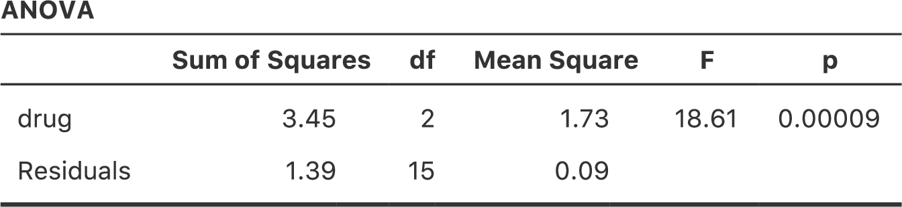
```

さて，ここで気分改善には「心理療法」も影響しているのではないかということに関心を持ったとします。その場合，第\@ref(ch:regression)章の重回帰分析のように，分析画面で<span class="rtext">therapy</span>（心理療法）変数を2つめの「**Fixed Factor**（固定要因）」に指定するだけです（図\@ref(fig:factorialanova3)）^[訳注：正確には，図の通りの結果を得るためには「Model（モデル）」から交互作用（<span class="rtext">drug</span>*<span class="rtext">therapy</span>）を削除する必要があります。]。


```{r factorialanova3, warning=FALSE, echo=FALSE, out.width='82.4%', fig.align='center', fig.cap='<span class="jamovi">jamovi</span>での2要因分散分析。結果変数は気分改善（<span class="rtext">mood.gain</span>），予測変数は投薬条件（<span class="rtext">drug</span>）と心理療法（<span class="rtext">therapy</span>）。', echo=FALSE}
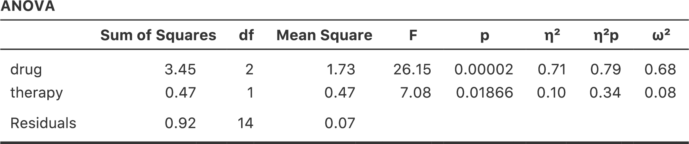
```

この出力結果も読むのは簡単です。表の1行目は投薬条件（<span class="rtext">drug</span>）に関するグループ間の2乗和（Sum of Squares）と自由度です。そして，その横には2乗平均（Mean Square）と\(F\)統計量，それから\(p\)値も示されています。この表には心理療法（<span class="rtext">therapy</span>）の要因に関連する行もあり，そして残差（つまり，グループ内のばらつき）の行もあります。

これらの値はそれぞれ非常に見慣れたものであるというだけでなく，2乗和や2乗平均といった数値の関係も1要因分散分析で見たものそのままです。たとえば，2乗平均の値は対応する自由度（\(df\)）で2乗和を割ったものです。つまり，これも次の通りで変わっていないのです。

$$
\mbox{MS} = \frac{\mbox{SS}}{df}
$$

この関係は，<span class="rtext">drug</span>（薬物条件）であろうと<span class="rtext">therapy</span>（心理療法）であろうと，そして残差であろうと同じです。ここでは具体的にどのように2乗和が計算されているのかについては気にしないことにしましょう。その代わり，<span class="jamovi">jamovi</span>が2乗和を正しく計算してくれていると信じて，残りの値がすべて定義通りになっているかを確認してください。まず，投薬条件（<span class="rtext">drug</span>）では，\(3.45\)を\(2\)で割って\(1.73\)という値を得ます。心理療法要因（<span class="rtext">therapy</span>）では，自由度が1なので計算は単純です。\(0.47\)（2乗和）を1で割れば，\(0.47\)（2乗平均）になります。

\(F\)統計量と\(p\)値は全部で2つ算出されています。1つは投薬条件（<span class="rtext">drug</span>），もう1つは心理療法（<span class="rtext">therapy</span>）についてです。どちらの要因でも，\(F\)統計量はその要因の2乗平均を残差の2乗平均で割って求めます。1つめの要因（この例では投薬条件：<span class="rtext">drug</span>）を要因Aとし，残差を「R」とすると，要因Aの\(F\)統計量は\(F_A\)となり，次のように計算されます。

$$
F_{A} = \frac{\mbox{MS}_{A}}{\mbox{MS}_{R}}
$$

要因B（つまり心理療法：<span class="rtext">therapy</span>）も同様の式で計算できます。ただし，残差を示す「R」の使い方には少しばかり注意してください。ここまでは表の行数を示すためにRという文字使用していますが，SS\(_R\)とMS\(_R\)については「R」は行数ではなく残差の意味です。ともあれ，この式を投薬条件（<span class="rtext">drugs</span>）にあてはめ，\(1.73\)という2乗平均を残差の2乗平均\(0.07\)で割ると，\(F\)統計量は\(26.15\)となります。心理療法（<span class="rtext">therapy</span>）の場合も同様に，\(0.47\)を\(0.07\)で割ると\(7.08\)という\(F\)統計量が得られます。当然ながら，これらは<span class="jamovi">jamovi</span>が分散分析表で報告している値と同じです。

分散分析表には\(p\)値も計算されています。これも新しいことではありません。ここで2つの要因に対して行ったたことは，「その要因と結果変数の間にまったく関係がない」という帰無仮説の検定です（これについてはこの後にもう少し詳しくお話しします）。このために，ここでは1要因分散分析の場合と（明らかに）同じ戦略でそれぞれの仮説に対する\(F\)統計量が算出されているのです。これらの値を\(p\)値に変換するために必要なことは，帰無仮説（「その要因と結果変数の間にまったく関係がない」）における\(F\)*統計量*の標本分布が\(F\)*分布*であるということに気づくことです。また，2つの自由度は要因の自由度と残差の自由度です。投薬条件（<span class="rtext">drug</span>）の要因では，\(F\)分布は自由度2と14で見ることになります（自由度についてはこの後で少し詳しく説明します）。心理療法（<span class="rtext">therapy</span>）の要因では，標本分布は自由度1と14の\(F\)分布です。

ここまでのところで，より複雑な多元配置分散分析の分散分析表も1要因分散分析の場合と同じように読めるということがわかっていただけたと思います。要するに，例題の\(3 \times 2\)の2元配置分散分析は，投薬条件の影響が有意（\(F_{2,14} = 26.15, p < .001\)）で心理療法の影響も有意（\(F_{1,14} = 7.08, p = .02\)）だということです。専門的な用語を使用すれば，そこには投薬条件と心理療法の2つの<span class="keyterm">主効果</span>（main effect）があると言えるのです。なぜ効果でなく「主」効果なのかと不思議に思うかもしれませんが，これには理由があります。このあとで2要因間の「交互作用」（interaction）の効果について取りあげますが，一般的に主効果と交互作用は別のものとして区別されるからです。

### 2乗和の計算方法

先ほどのセクションには2つの目標がありました。1つめは<span class="jamovi">jamovi</span>での多元配置分散分析が1要因分散分析と基本的に同じであるということを示すこと。唯一の違いは要因が増えて2つになることです。2つめは，この場合の分散分析表がどのようなものになるかを示すことでした。そしてそこから，多元配置分散分析の基本的な考え方や構造が1要因分散分析の場合と同じであるということをまず見てもらいたかったのです。その感覚をしっかりつかんでおいてください。このことは，多元配置分散分析が多かれ少なかれ1要因分散分析と同じ形のモデルになっている場合は間違いなく真実なのです。ただし，より深く掘り進めていくとこうした親近感は雲散霧消してしまうわけですが。伝統的に，こうした安心感は次第に統計教科書の著者に対する罵倒へと置き換えられていくのです。

さて，それでは詳細について見ていくことにしましょう。先ほどのセクションでは，主効果（投薬条件と心理療法）の仮説検定は\(F\)検定だと説明しましたが，2乗和の計算方法については示していませんでした。また，自由度をどのように計算するのかということについても説明していません。ただし，自由度については計算はずっと単純です。さてここで，因子Aと因子Bという2つの予測変数を持つデータがあるとしましょう。結果変数を\(Y\)とすると，\(Y_{rci}\)でグループ\(rc\)（つまり要因Aが\(r\)番目の水準，要因Bが\(c\)番目の水準）の\(i\)番目の参加者の値を示せます。このように，\(\overline{Y}\)が標本の平均値を指すとすると，先ほどと同じ表記を使ってグループ平均値，周辺平均値，全体平均値を示すことができます。つまり，\(\overline{Y}_{rc}\)は要因Aが\(r\)番目の水準で要因Bが\(c\)番目の水準の標本平均値，\(\overline{Y}_{r.}\)は要因Aが\(r\)番目の水準の周辺平均値，\(\overline{Y}_{.c}\)は要因Bの水準が\(c\)番目の周辺平均値，そして\(\overline{Y}_{..}\)は全体平均値です。要するに，標本平均値は母集団平均値の表と同じ形に整理できるのです。例題の臨床試験データでは，その表は次のようになります。

```{r, warning=FALSE, echo=FALSE, message=FALSE}
library(knitr)
library(kableExtra)

dt<- matrix(c(
'\\(\\overline{Y}_{11}\\)','\\(\\overline{Y}_{12}\\)','\\(\\overline{Y}_{1.}\\)','\\(\\overline{Y}_{21}\\)','\\(\\overline{Y}_{22}\\)','\\(\\overline{Y}_{2.}\\)','\\(\\overline{Y}_{31}\\)','\\(\\overline{Y}_{32}\\)','\\(\\overline{Y}_{3.}\\)','\\(\\overline{Y}_{.1}\\)','\\(\\overline{Y}_{.2}\\)','\\(\\overline{Y}_{..}\\)'
), ncol=3, byrow=T)

dtf<-as.data.frame(dt)
colnames(dtf)<-c('心理療法なし','認知行動療法','全体')
rownames(dtf)<-c('プラシボ','アンシフリー','ジョイゼパム','全体')

kable(dtf, align = c('c','c','c','c','c','c')) %>%
  kable_styling(bootstrap_options = "striped", full_width = F)
```

そしてすでに示した標本平均値をみれば，\(\overline{Y}_{11} = 0.30\)で\(\overline{Y}_{12} = 0.60\)であるということがわかります。例題の臨床試験データでは，投薬条件（<span class="rtext">drugs</span>）の要因には3水準，心理療法（<span class="rtext">therapy</span>）の要因には2水準あるので，ここで行おうとしているのは\(3 \times 2\)の多元配置分散分析ということになります。しかし，これをもう少し一般化しておきましょう。要因A（行）が\(R\)水準，要因B（列）が\(C\)水準の場合は\(R \times C\)の多元配置分散分析です。

これで表記の整理が終わったので，2つの要因それぞれについて，比較的見慣れたやり方で2乗和の値を求めることができるようになりました。要因Aのグループ間2乗和は，行の周辺平均値である\(\overline{Y}_{1.}\)や\(\overline{Y}_{2.}\)などが全体平均値（\(\overline{Y}_{..}\)）からどれくらい離れているかを評価することによって得られます。その計算方法は1要因分散分析の場合と同じです。つまり，\(\overline{Y}_{i.}\)の値と\(\overline{Y}_{..}\)の値の差の2乗の合計を求めるのです。具体的に言うと，各グループに\(N\)人の参加者がいる場合，計算は次のようになります。

$$
\mbox{SS}_{A} = (N \times C)  \sum_{r=1}^R  \left( \overline{Y}_{r.} - \overline{Y}_{..} \right)^2
$$

1要因分散分析の場合と同様に，この式のもっとも興味深い^[日本語に訳せば「もっともややこしくない」という意味です。}部分は\(\left( \overline{Y}_{r.} - \overline{Y}_{..} \right)^2\)のところで，これは\(r\)水準の偏差の2乗に対応しています。この式が行っていることは，行の要因の水準すべて（\(R\)）について偏差の2乗を求めて合計し，それを\(N \times C\)倍するということです。この最後の処理が必要なのは，このデザインでは要因Aの\(r\)の各水準に複数の列があるからです。実際，そこには\(C\)個の列があり，それらの1つ1つがそれぞれB要因の各水準に対応しています。たとえば，例題データでは<span class="rtext">anxifree</span>（アンシフリー）という薬に*2つ*の異なるセルがあります。1つは<span class="rtext">no.therapy</span>（心理療法なし），もう1つは<span class="rtext">CBT</span>（認知行動療法）です。さらに，これらのセルの中にはそれぞれ\(N\)個の観測値があります。つまり，もしこの2乗和の値を「観測値全体での」グループ間2乗和にしたいなら，この値を\(N \times C\)倍する必要があるのです。要因Bの式ももちろん同じ考え方で，ところどころ添え字が異なるだけです。

$$
\mbox{SS}_{B} = (N \times R) \sum_{c=1}^C \left( \overline{Y}_{.c} - \overline{Y}_{..} \right)^2
$$

これらの式で得られる値を先ほどのセクションで<span class="jamovi">jamovi</span>で算出した値と比べてみましょう。この種の計算作業には表計算ソフトが役立ちます。皆さんも挑戦してみてください。私が計算に使用したExcelファイルが[<span class="filename">clinicaltrialfactorialanova.xls</span>](data/clinicaltrialfactorialanova.xls)にあるので，こちらを見てもらっても構いません^[訳注：いちいち別のソフトを起動するのが面倒であれば，<span class="jamovi">jamovi</span>でもできます。これを<span class="jamovi">jamovi</span>で行った場合の結果は[<span class="filename">clinicaltrialfactorialanova.omv</span>](data/clinicaltrialfactorialanova.omv)ファイルで見られます。]。

まず，投薬条件（<span class="rtext">drug</span>）の主効果に関連した2乗和を計算しましょう。各グループには\(N=3\)人の参加者がいて，\(C=2\)の異なる心理療法条件があります。別の言い方をすれば，それぞれの薬を投与されているのは\(3 \times 2 = 6\)人です。この値を計算すると，投薬条件（<span class="rtext">drug</span>）の2乗和は3.45という値になりました。当然ながら，これはすでに図\@ref(fig:factorialanova3)で見た分散分析表における投薬条件要因の2乗和と同じです。

同じことを心理療法の効果についても繰り返します。ここでも\(N=3\)人の参加者がそれぞれのグループにいて，そして\(R=3\)の異なる投薬条件があるので，認知行動療法（CBT）を受けたのは\(3 \times 3 = 9\)人，他の9人は心理療法を受けていません。これを計算すると，心理療法（<span class="rtext">therapy</span>）の2乗和は0.47という値になります。当然ですが，この値も図\@ref(fig:factorialanova3)の分散分析結果と同じです。

ということで，これが主効果の2乗和を計算する方法です。これらの2乗和の値は，第\@ref(ch:anova)章の1要因分散分析で計算したグループ間の2乗和と似ています。ただし，これらの値をグループ間2乗和と呼ぶのは賢明ではありません。ここではグループ変数が2つあり，混乱してしまう可能性が高いからです。さて，\(F\)検定を行うにはグループ内の2乗和も計算する必要があります。回帰分析（第\@ref(ch:regression)章) で使用した用語，そして<span class="jamovi">jamovi</span>が分散分析表の出力に使用する用語にあわせて，ここではグループ内2乗和の値を*残差*2乗和（SS\(_R\)）と呼ぶことにします。

この場合における残差2乗和の意味は，結果変数のばらつきから周辺平均値の影響を取り除いた（つまりSS\(_A\)とSS\(_B\)を取り除いたあとの）残りでと考えるとわかりやすいでしょう。ということで，まずは全体の2乗和（SS\(_T\)）を計算する必要があります。その式は，1要因分散分析の場合と非常によく似ています。各観測値（\(Y_{rci}\)）と全体平均値（\(\overline{Y}_{..}\)）の間の差をとり，その差を2乗してすべて合計するのです。

$$
\mbox{SS}_T = \sum_{r=1}^R \sum_{c=1}^C \sum_{i=1}^N \left( Y_{rci} - \overline{Y}_{..}\right)^2
$$

「総和記号が3つ」もあって複雑に見えますが，大したことはしていません。最初の総和記号は要因Aのすべての水準（表の各行：\(r\) )の合計，次は要因Bのすべての水準（表の各列：\(c\)）の合計を求めているだけです。\(rc\)のすべての組み合わせに対応するグループにはそれぞれ\(N\)人の参加者が含まれているで，これら（つまりすべての\(i\)）の合計も求めなければなりません。つまり，この式が意味することは，データに含まれるすべての観測値（つまりすべての\(rci\)の組み合わせ）についての偏差2乗を合計するということです。

これで，結果変数全体のばらつき（SS\(_T\)）がわかり，そのばらつきのどれくらいが要因Ａ（SS\(_Ａ\)）で説明されるか，どれくらいが要因Ｂ（SS\(_Ｂ\)）で説明されるかがわかりました。残差2乗和は，\(Y\)のばらつきのうち2つの要因で説明*できない*部分と定義できます。つまり次のようになります。

$$
\mbox{SS}_R = \mbox{SS}_T - (\mbox{SS}_A + \mbox{SS}_B)
$$

残差2乗和を直接計算する式ももちろんあるのですが，このように考えた方がわかりやすいと思います。これを残差と呼ぶのはこれが残り物のばらつきだからで，上の式はそのことをとてもはっきり示しているからです。なお，回帰分析の章で使用した用語を用いると，\(\mbox{SS}_A + \mbox{SS}_B\)は一般に「分散分析モデル（ANOVAモデル）」で説明される分散と呼ばれ，これはSS\(_M\)と表記されます。また，こうしたことから「全体の2乗和はモデルの2乗和と残差の2乗和の和に等しい」というような言い方もよく使われます。本章の後半では，これが単なる表面的な類似性ではないということについて説明します。分散分析と回帰分析は，実際には中身は同じものなのです。

とにかく，SS\(_R\)をこの式で計算し，<span class="jamovi">jamovi</span>の分散分析表と同じ答えになるということを確認しておきましょう。この計算は表計算ソフトを使ってやるととても簡単です（[<span class="filename">clinicaltrialfactorialanova.xls</span>](data/clinicaltrialfactorialanova.xls)ファイルを参照）^[訳注：全体の2乗和は<span class="jamovi">jamovi</span>でも計算できますし，そちらの方が簡単だと思います（[<span class="filename">clinicaltrialfactorialanova.omv</span>](data/clinicaltrialfactorialanova.omv)ファイルを参照）。]。1つ前の式を使って全体の2乗和を求め（そうすると全体の2乗和は4.85になります）そして先ほどの式で残差2乗和を求めると0.92となりました。ここでもまた，答えは<span class="jamovi">jamovi</span>の結果と同じです。

### 多元配置分散分析の自由度

自由度の計算方法は1要因分散分析とほぼ同じです。各要因の自由度は水準数&minus;1（つまり要因A（行）の自由度は\(R-1\)，要因B（列）の自由度は\(C-1\)）です。つまり，投薬条件（<span class="rtext">drugs</span>）の自由度は\(df = 2\)となり，心理療法（<span class="rtext">therapy</span>）では\(df=1\)です。なぜこの数字になるのかということについては，後ほど回帰モデルとしての分散分析の解釈について論じる際にきちんと説明します（セクション\@ref(sec:anovalm)）。ですが今のところは，自由度については「観察された量の数&minus;制約の数」という単純な定義を使うことにしましょう。つまり，投薬条件には3つのグループ平均値がありますが，これらは1つの全体平均値によって制約を受けています。だから自由度は2になるのです。残差についても考え方は同様ですが，完全に同じではありません。私たちの実験における観測値の数は全部で18です。制約としては1つの全体平均に加え，投薬条件で2つ，そして心理療法で1つのグループ平均による制約があるので，自由度は14ということになります。これを式で表すと，\(N-1 -(R-1)-(C-1)\)で，単純化すれば\(N-R-C+1\)です。

### 多元配置分散分析と1要因分散分析

ここまでは多元配置分散分析の仕組みを説明してきました。今度はこの分析の結果と1要因分散分析を複数回行った場合とを比べてみることにしましょう。なぜなら，そうすることによって，*なぜ*多元配置分散分析を使った方が良いのかということがとてもよくわかるからです。第\@ref(ch:anova)章では，まず投薬条件による差があるかどうかを見るために1要因分散分析を行いました。そしてその後に心理療法による違いを見るために2回目の1要因分散分析を行いました。セクション\@ref(sec:factanovahyp)で見たように，1要因分散分析で検定される帰無仮説と対立仮説は実際には多元配置分散分析の場合とまったく同じです。分散分析表をよく見てみると，2つの分析で対応する2乗和は同じであることもわかります（投薬条件（<span class="rtext">drug</span>）では3.45，心理療法（<span class="rtext">therapy</span>）では0.92），そして自由度も（投薬条件（<span class="rtext">drug</span>）で2，心理療法（<span class="rtext">therapy</span>）で1で同じです）。しかし，同じ答えにはなっていない点に注意してください。とくに，1要因分散分析で心理療法の効果を分析したときには（セクション\@ref(sec:anovaandt)），有意な結果は得られませんでした（\(p=.21\)）。ところが，心理療法の主効果を2要因分散分析で見てみると，その効果は有意（\(p=.019\)）になっています。つまりこの2つの分析は同じではないのです。

なぜこのようなことになるのでしょう。その答えは，*残差*の計算方法にあります。\(F\)検定の背後にある考え方は，特定の要因によって説明できるばらつきと，それでは説明できないばらつき（残差）を比較をするというものだったことを思いだしてください。もし心理療法（<span class="rtext">therapy</span>）について1要因分散分析を行えば，それは投薬条件（<span class="rtext">drug</span>）の影響を無視することになり，投薬条件の違いによって生じたばらつきは分散分析ではすべて残差として扱われてしまうのです。そのためにデータはよりノイズ（残差）の多いものとなり，2要因分散分析では有意になる心理療法（<span class="rtext">therapy</span>）の効果が1要因分散分析では有意でなくなるのです。つまり，実際に何か重要な影響を持っているもの（たとえば投薬条件）を無視して他のもの（たとえば心理療法）の影響を評価しようとすると，その分析結果は歪められてしまうのです。もちろん，関心対象とまったく無関係な変数を無視することは問題ありません。たとえば，私たちが投薬時の壁の色を記録していたとして，その影響が3要因分散分析で有意でないとわかったら，その要因を無視して2要因分散分析を行い，その結果を報告することは問題ないでしょう。やってはいけないのは，実際に差を生じさせる変数を取り除くということです。

### この分析で捉えられているもの

ここまで話してきた分散分析モデルには，データに観察されるさまざまなパターンが含まれています。たとえば，2要因分散分析では(a)要因Aのみが重要，(b)要因Bのみが重要，(c)要因AとBの両方が重要，(d)要因AもBも重要でない，という4つの可能性があります。この4つの可能性について，その例を図\@ref(fig:maineffects)に示しました。

```{r maineffects, warning=FALSE, echo=FALSE, message=FALSE, out.width='82.4%', fig.align='center', fig.cap='主効果のみの場合の2×2分散分析の4つの結果パターン。図の(a)では要因Aの主効果が見られ，要因Bの主効果は見られない。図の(b)は要因Bの主効果があるが，要因Aの主効果はない。図の(c)は，要因AとBの両方に主効果がある。最後に，図の(d)はいずれの要因にも主効果がない。'}

require(magick); require(ggplot2); require(ggplotify); require(cowplot)

p1<-as.grob(image_read("img/factorialanova/maineffectA.png"))
p2<-as.grob(image_read("img/factorialanova/maineffectB.png"))
p3<-as.grob(image_read("img/factorialanova/maineffectAB.png"))
p4<-as.grob(image_read("img/factorialanova/maineffectO.png"))

plot_grid(p1,p2,p3,p4, labels=c("(a)", "(b)","(c)", "(d)"),ncol=2,scale=.9,label_size=12)
```

多元配置分散分析（その2） --- 釣り合い型デザイン，交互作用あり --- {#sec:interactions}
---------------------------------------------------------------------------------

図\@ref(fig:maineffects)の4つのパターンはどれも実際によく見られるものです。このようなパターンを示すデータは本当にたくさんあります。ですが，これらがすべてではありません。そして，ここまで見てきた分散分析モデルも，グループ平均値の表を完全には説明できてていません。それはなぜでしょうか。それは，ここまでのところでは投薬条件が気分に影響する可能性や心理療法が気分に影響する可能性については見てきましたが，この2つの間の<span class="keyterm">交互作用</span>（interaction）については見てこなかったからです。要因AとBの間の交互作用とは，要因Aの影響が要因Bの水準によって異なる場合のことを言います。2\(\times\)2の分散分析における交互作用の例を図\@ref(fig:interaction)に示しました。

```{r interaction, warning=FALSE, echo=FALSE, message=FALSE, out.width='82.4%', fig.align='center', fig.cap='2×2分散分析の交互作用の例'}

require(magick); require(ggplot2); require(ggplotify); require(cowplot)

p1<-as.grob(image_read("img/factorialanova/interaction2.png"))
p2<-as.grob(image_read("img/factorialanova/interaction3.png"))
p3<-as.grob(image_read("img/factorialanova/interaction1.png"))
p4<-as.grob(image_read("img/factorialanova/interaction4.png"))

plot_grid(p1,p2,p3,p4, labels=c("(a)", "(b)","(c)", "(d)"),ncol=2,scale=.9,label_size=12)
```

もう少し具体的な例で考えるために，アンシフリーとジョイゼパムがかなり異なる生理学的メカニズムで作用しているとしましょう。その結果，たとえばジョイゼパムの効果は心理療法を受けるかどうかに関係なく大体同じなのに対し，アンシフリーは認知行動療法とセットにした場合に非常に効果的であるというようなことがあるかもしれません。先ほどのセクションで説明した分散分析では，この部分が捉えきれていないのです。交互作用が実際にあるかどうかを知るには，まずは各グループの平均値を見てみるのがよいでしょう。<span class="jamovi">jamovi</span>の「**Exploration**（探索）」メニューの「**Descriptives**（記述統計）」で，「**Variables**（変数）」に<span class="rtext">mood.gain</span>，「**Split by**（グループ変数）」に<span class="rtext">drug</span>と<span class="rtext">therapy</span>を指定して，「**Statistics**（統計量）」の欄で「Mean（平均値）」にチェックを入れて平均値を算出します。平均値だけを表示させると，結果は図\@ref(fig:interactiontable)のようになるはずです。数値だけではわかりにくいという人は，表計算ソフトなどを使ってこの平均値をグラフにしてみてもいいでしょう。平均値のグラフの例が図\@ref(fig:interanctionplot)です^[訳注：以前のバージョンでは，「ANOVA」メニューの中に「Descriptive Plots」というオプションがあり，そこからグラフを作成できたのですが，最近のバーションではそれがなくなってしまいました。このグラフは「ANOVA」メニューの「Estimated Marginal Means（周辺平均の推定）」オプションで作成したものです。なお，この図を作成するためには分析モデルに主効果と交互作用をすべて含める必要があります。]。ここでの主な関心は，グラフ中の2本の線が平行でないかどうかということです。ジョイゼパムを投与されたグループの認知行動療法の平均値と心理療法なしの平均値はほぼ同じで（図の中央），その差はプラシボの場合の両条件の差（図の右）よりも小さくなっています。ところが，アンシフリーが投与された場合には，認知行動療法と心理療法なしの差はプラシボより大きくなっています（図の左）。こうした差は本物でしょうか。それとも単なる偶然によるものでしょうか。先ほどの分散分析ではこの問いには答えられません。なぜなら，交互作用が存在するということを一切考慮していないからです。そこでこの問題を修正することにしましょう。

```{r interactiontable, warning=FALSE, echo=FALSE, out.width='50.4%', fig.align='center', fig.cap='臨床試験データの各グループ平均値', echo=FALSE}
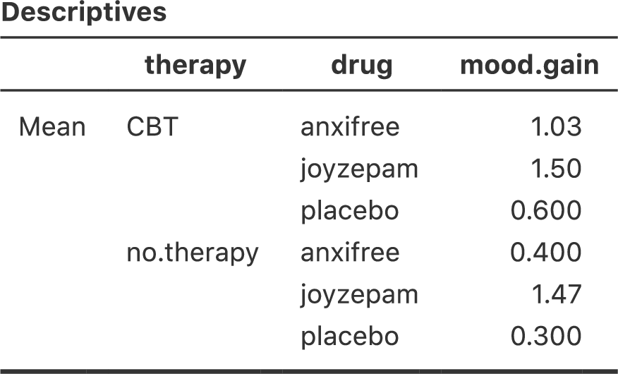
```

```{r interanctionplot, warning=FALSE, echo=FALSE, out.width='82.4%', fig.align='center', fig.cap='臨床試験データの交互作用プロット', echo=FALSE}
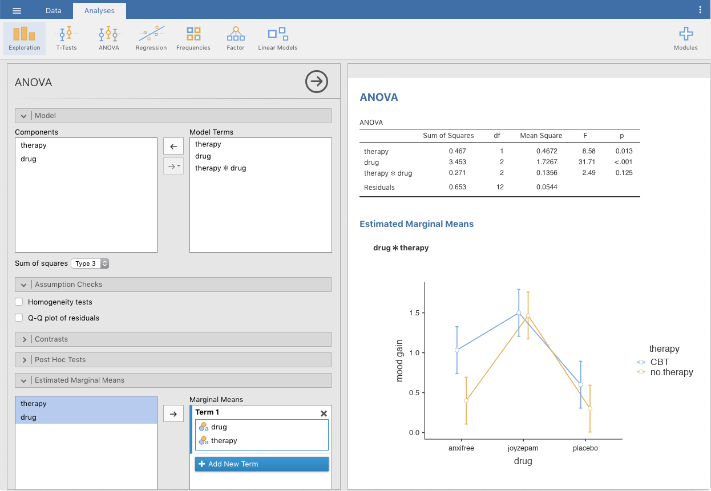
```

### 交互作用とは何か

このセクションでは，交互作用という考え方を取りあげます。ここまで見てきた分散分析では，「投薬条件」と「心理療法」の2つの*要因*だけがモデルに含まれていました。交互作用を追加するということは，このモデルに新しい要素を追加することを意味します。それは「投薬条件」と「心理療法」の組み合わせです。交互作用の考え方というのは実際にはとても単純です。これは要因Aの影響が要因Bの各水準ごとに異なるというだけのことだからです。ですが，これを例題データにあてはめた場合にはどうなるのでしょうか。図\@ref(fig:interaction)にいくつかのパターンを示しましたが，これらはお互いにずいぶん違った形をしているものの，どれも交互作用と言えるものです。そして，こうした考え方を統計学者が扱えるような数学的な形にするのはそれほど単純なことではありません。その結果，交互作用の考え方を帰無仮説と対立仮説という形で式にしようとすると，少し複雑なものになってしまいます。それに，本書の読者の多くはそこまで式に関心がないでしょう。とはいえ，ここでは基本的な考え方を示しておくことにします。

交互作用について考えるためには，まず主効果というものをもう少し明確にする必要があります。例題データにおける要因A（投薬条件）の主効果について考えてみましょう。先ほどは，「2つの周辺平均値（\(\mu_{r.}\)）が互いに同じである」という形で帰無仮説を式にしました。ですが，もしその2つが互いに等しいのであれば，その値は全体平均値（\(\mu_{..}\)）と同じになるはずですよね。つまり，\(r\)水準における要因Aの*効果*は，それが周辺平均値（\(\mu_{r.}\)）と全体平均値\(\mu_{..}\)の差に等しいという形で定義することができます。この効果を\(\alpha_r\)として，これを式にすると次のようになります。

$$
\alpha_r  = \mu_{r.} - \mu_{..}
$$

定義上，すべての\(\alpha_r\)は合計したときに0にならなければなりません。なぜなら，周辺平均値（\(\mu_{r.}\)）の平均値が全体平均値（\(\mu_{..}\)）と同じにならなくてはならないからです。要因Bについても同様に，\(c\)水準における要因Bの効果を\(c\)列の周辺平均値（\(\mu_{.c}\)）と全体平均値（\(\mu_{..}\)）の差として定義します。

$$
\beta_c = \mu_{.c} - \mu_{..}
$$

そして，ここでも\(\beta_c\)の合計は0にならなければなりません。統計学者が主効果について話す場合，こうした\(\alpha_r\)や\(\beta_c\)の値が用いられることがよくあるのですが，統計学者がそうするのは，これらの値を用いれば交互作用がないということを正確に示せるからです。交互作用がまったくない場合には，この\(\alpha_r\)と\(\beta_c\)の値だけで\(\mu_{rc}\)を完全に説明できるはずです。具体的には，次のようになります。

$$
\mu_{rc} = \mu_{..} + \alpha_r + \beta_c
$$

つまり，グループ平均値には周辺平均値で完全に説明できないような*特別*なことは何もないということです。そして，これが私たちの帰無仮説になります。また，対立仮説は次のようになります。

$$
\mu_{rc} \neq \mu_{..} + \alpha_r + \beta_c
$$

表に含まれるグループ\(rc\)のうち，少なくともいずれか1つでこの式が成立するというのが対立仮説です。ただ，多くの場合，統計学者はこれを少し違った形で書きます。統計学者は一般に，グループ\(rc\)に関する交互作用を\((\alpha\beta)_{rc}\)という何ともヘンテコな形で表し，対立仮説を次のように書きます。

$$
\mu_{rc} = \mu_{..} + \alpha_r + \beta_c + (\alpha\beta)_{rc}
$$

そして，\((\alpha\beta)_{rc}\)が少なくとも1つのグループで0でないというのが対立仮説になります。この表記は見た目はあまり美しくないのですが，次のセクションで行うように，2乗和の計算においては便利です。

### 交互作用の2乗和の計算

では，交互作用の2乗和（SS\(_{A \times B}\)）はどのように計算すればよいのでしょうか。まず先ほどのセクションで，交互作用を「実際のグループ平均値が周辺平均値で予測される値とどれくらい異なっているか」という形で定義したことを思い出してください。もちろん，これらの式はどれも母集団パラメータを意味していて標本統計量ではないのですが，私たちにはその値がいくつであるかはわかりません。それでも，母集団平均値の代わりに標本の平均値を使って推測することはできます。つまり要因Aで\(r\)水準の主効果を推定するには，*標本*の周辺平均値（\(\overline{Y}_{rc}\)）と標本の全体平均値（\(\overline{Y}_{..}\)）の差を求めればよいということになります。そして，この値を効果の推定値として使用するのです。

$$
\hat{\alpha}_r = \overline{Y}_{r.} - \overline{Y}_{..}
$$

同様に，要因Bの\(c\)水準における主効果の推定値は次のように定義することができます。

$$
\hat{\beta}_c = \overline{Y}_{.c} - \overline{Y}_{..}
$$

さて，私が主効果の2乗和を説明するために使用した式を見返してみれば，これらの効果の量を2乗して合計すればよいということがわかるでしょう。では，この交互作用はどのように考えればよいのでしょうか。その答えは，対立仮説におけるグループ平均値（\(\mu_{rc}\)）の式を並べ替えてみるとわかります。実際に並び替えてみましょう。

$$
\begin{aligned}
(\alpha \beta)_{rc} &= \mu_{rc} - \mu_{..} - \alpha_r - \beta_c \\
&= \mu_{rc} - \mu_{..} - (\mu_{r.} - \mu_{..}) - (\mu_{.c} - \mu_{..}) \\
&= \mu_{rc} - \mu_{r.} - \mu_{.c} + \mu_{..}
\end{aligned}
$$

そして，ここでも母集団平均値の代わりに標本統計量を使用すれば，グループ\(rc\)の交互作用として以下の値を推定できます。

$$
\hat{(\alpha\beta)}_{rc} = \overline{Y}_{rc} - \overline{Y}_{r.} - \overline{Y}_{.c} + \overline{Y}_{..}
$$

後は，これらの推定値を要因Aの\(R\)水準すべてと要因Bの\(C\)水準すべてで合計するだけです。これで交互作用全体に関する2乗和の式を得ることができます。

$$
\mbox{SS}_{A \times B} = N \sum_{r=1}^R \sum_{c=1}^C \left( \overline{Y}_{rc} - \overline{Y}_{r.} - \overline{Y}_{.c} + \overline{Y}_{..} \right)^2
$$

ここで\(N\)倍しているのは，それぞれのグループに\(N\)個の観測値があるからです。ここで2乗和の値に反映させたいのはグループ間のばらつきではなく，交互作用で説明される*観測値*のばらつきです。

これでSS\(_{A \times B}\)を計算するための式が得られました。交互作用も（当然ながら）モデルの一部であるということを忘れないでください。つまり，モデル全体の2乗和（SS\(_M\)）は，\(\mbox{SS}_A + \mbox{SS}_B + \mbox{SS}_{A \times B}\)という，関連する3つの2乗和の合計に等しくなるのです。そして残差の平方和（\(\mbox{SS}_R\)）は，やはり残りのばらつきとして定義されます。つまり，\(\mbox{SS}_T - \mbox{SS}_M\)となるわけですが，モデルには交互作用が含まれているので具体的には次のようになります。

$$
\mbox{SS}_R = \mbox{SS}_T - (\mbox{SS}_A + \mbox{SS}_B + \mbox{SS}_{A \times B})
$$

結果的に，この場合の残差2乗和（SS\(_R\)）は，交互作用を含めない分散分析の場合よりも小さくなります。

### 交互作用の自由度

交互作用の自由度についての計算も，主効果の場合に比べてわずかに複雑です。まず，分散分析モデル全体を考えてみましょう。交互作用をモデルに含めたことで，すべてのグループが独自の平均値（\(\mu_{rc}\)）を持つことが可能になりました。\(R \times C\)の多元配置分散分析では，これは関心のある値がモデルに\(R \times C\)個あることを意味します。そして，そこでの制約は1つだけです。それは，すべてのグループ平均値を平均したときに全体の平均値と同じにならなければならないというものです。そのため，このモデル全体には\((R \times C ) - 1\)個の自由度があることになります。しかし要因Aの主効果は\(R-1\)個の自由度を持ち，要因Bは\(C-1\)個の自由度を持ちます。そのため，交互作用に関する自由度は次のようになります。

$$
\begin{aligned}
df_{A \times B} &= (R\times C - 1) - (R - 1) - (C -1 ) \\
&= RC - R - C + 1 \\
&= (R-1)(C-1)
\end{aligned}
$$

つまり，自由度は行の要因と列の要因の自由度を掛け算したものになるのです。

残差の自由度はどうでしょうか。交互作用を追加したことによっていくらかの自由度が奪われてしまうので，残差に残される自由度はより少ないものになります。具体的には，モデルの交互作用が\((R\times C) - 1\)の自由度を持ち，データに\(N\)個の観測値があってそれらの平均値が全体平均値に一致しなくてはならないという制約がある場合，残差の自由度は\(N-(R \times C)+1-1\)，要するに\(N-(R \times C)\)となります。

### <span class="jamovi">jamovi</span>での分散分析の実行

<span class="jamovi">jamovi</span>の分散分析でモデルに交互作用を追加するのは簡単です。というか，簡単以上です。なぜなら，それが分散分析での初期設定になっているからです。つまり，2要因（たとえば<span class="rtext">drug</span>と<span class="rtext">therapy</span>）の分散分析を指定すれば，交互作用（<span class="rtext">drug*therapy</span>）は自動的にモデルに追加されるのです^[これについては<span class="jamovi">jamovi</span>での主効果の検定のところですでに気づいた人もいるかもしれません。説明のため，そこではこの交互作用をモデルから取り除いた上で分析を実行していました。]。交互作用を含む分散分析モデルを実行すると図\@ref(fig:factorialanova4)の結果が得られます。

```{r factorialanova4, warning=FALSE, echo=FALSE, out.width='82.4%', fig.align='center', fig.cap='投薬条件×心理療法の交互作用を含めた分散分析の結果', echo=FALSE}
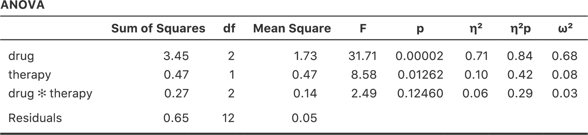
```

分析の結果，投薬条件の主効果は有意（\(F_{2,12} = 31.7, p <.001\)）で心理療法の主効果も有意（\(F_{1,12} = 8.6, p=.013\)）でしたが，2つ要因間に有意な交互作用は見られませんでした（\(F_{2,12} = 2.5, p = 0.125\)）。

### 結果の解釈

多元配置分散分析の結果の解釈にはとても重要なことがいくつかあります。まず，1要因分散分析の場合と同じ問題です。たとえば投薬条件（<span class="rtext">drug</span>）で有意な主効果があったとしても，どの薬が他と違っているのかまではわかりません。これを知るためには，追加の分析が必要になります。この場合に使用できる分析のいくつかについてはセクション\@ref(sec:contrasts)とセクション\@ref(sec:posthoc2)で説明します。このことは交互作用についても同じです。有意な交互作用があるということがわかっても，どのような交互作用があるのかまではわかりません。ここでも追加の分析が必要になります。

2つめに，交互作用が有意であったのに主効果が有意でないという，何とも奇妙な場合の解釈問題があります。このようなことは時々あるのです。たとえば図\@ref(fig:interaction)の(a)にあるような交差型の交互作用の場合がそうです。この場合，どちらの主効果も有意ではありませんが，交互作用は有意です。これは解釈の難しい状況で，これを見てどうしたらいいのか困惑してしまう人もよくいます。この状況に対する統計学者の一般的なアドバイスは，「交互作用がある場合には主効果は気にしなくてよい」というものです。統計学者がそう言うのは，交互作用が有意な場合，主効果の検定は数学的視点から見れば正しくても，そこで検定される仮説には実質的な意味がほとんどないからです。覚えているでしょうか，セクション\@ref(sec:factanovahyp)では，主効果の帰無仮説は「*周辺平均値*が互いに等しい」というものであると説明しました。そして周辺平均値は，複数のグループで値を平均することによって得られます。しかし，交互作用が有意であるということは，周辺平均値を構成するグループで値が同じでないことは明らかなので，これらの周辺平均値について気に掛ける必要はないというわけです。

つまりこういうことです。ここでも臨床試験を例にとりましょう。恐怖症の2つの治療法（たとえば系統的脱感作とフラッディング法），そして2つの抗不安薬（たとえばアンシフリーとジョイゼパム）を\(2 \times 2\)の要因計画で比較したとします。そして，アンシフリーでは脱感作が行われた場合には効果がなく，ジョイゼパムはフラッディングの場合に効果がなかったとしましょう。しかし，両方とももう一方の治療法の場合には非常に効果的でした。これは典型的な交差型の交互作用で，この分散分析の結果からわかったことは，投薬条件の主効果はないが，有意な交互作用はあるということです。さて，ここで「主効果がない」というのは実際には何を*意味する*のでしょうか。これが意味するのは，2つの心理療法条件で平均した場合，アンシフリーとジョイゼパムの*平均的な*効果が同じになるということです。ですが，そんなこと誰も気にしませんよね。恐怖症の治療でフラッディング法と系統的脱感作法を*平均*した治療を受ける人なんていません。そんなのまったく意味ありませんから。平均したものじゃなくてどちらか一方の治療を受けるはずです。ある心理療法との組み合わせではある薬が効果的で，別の心理療法との組み合わせでは別の薬が効果的ということであれば，その交互作用は重要ですが，主効果はどうでもいいことです。

このような場合というのはよくあります。主効果というのは周辺平均値の検定ですから，交互作用があるのであれば周辺平均値には関心はないはずです。なぜなら，交互作用がある場合の周辺平均値には，本来平均すべきでないようなものが平均されてしまっていることになるからです。もちろん，交互作用があれば必ず主効果が無意味になるというわけではありません。たとえば，主効果が非常に大きく，交互作用は小さい場合というのもよくあります。そのような場合には，「一般的に薬Aは薬Bよりも効果が高い」のように言ってよいでしょう（なぜなら薬による大きな主効果があるからです）。しかし，その場合でも，「薬の効果は心理療法の種類によってわずかに異なる」と付け加える必要があります。いずれの場合も，交互作用が有意であった場合には，その文脈において主効果が実際に何を意味しているのかということを少し立ち止まって*考える*ことが重要です。何も考えずに主効果が興味深いものであると仮定してはいけません。

効果量 {#sec:effectsizefactorialanova}
------------------------------------------------

多元配置分散分析の効果量の計算方法は，1要因分散分析の場合（セクション\@ref(sec:etasquared)参照）ととてもよく似ています。具体的に言うと，それぞれの効果の全体的な大きさの指標として\(\eta^2\)（イータ2乗）を使用できるのです。前述のように，\(\eta^2\)は関連する効果の2乗和を全体2乗和で割ったものです。たとえば，要因Aの主効果の効果量は次の式で求められます。

$$
\eta_A^2 = \frac{\mbox{SS}_{A}}{\mbox{SS}_{T}}
$$

すでに説明したとおり，この値は回帰分析の\(R^2\)のように解釈できます^[本章ではRという文字が何種類もの意味で使われています。多分これが最多記録でしょう。ここまで，Rは平均値の表の行数，モデルにおける残差を指す文字として使われており，そして今度は回帰における相関係数です（ついでに言うと<span class="R">R</span>というのは統計ソフトの名前でもあります）。わかりにくいですよね。でもこれは，アルファベットの文字数が少なすぎるのが悪いんです。一応，私はその「R」が何を指しているのかがちゃんとわかるように，かなり配慮しているつもりです。]。この値は，結果変数の分散のうち，要因Aの主効果で説明できる割合を意味します。そのため，値の範囲は0（まったく効果なし）から1（結果変数の*すべて*のばらつきを説明）までになります。さらに，\(\eta^2\)の値をモデルに含まれるすべての効果で合計したものは，その分散分析モデルの全体の\(R^2\)になります。たとえば，分散分析モデルが完璧にデータに適合していたら（つまりグループ内のばらつきがまったくないならば），\(\eta^2\)の合計値は1になるのです。もちろん，そんなことは実際にはまず起こりえません。

なお，多元配置分散分析では，多くの人が効果量として報告するもう1つの指標があります。それは偏\(\eta^2\)と呼ばれるものです。偏\(\eta^2\)（これは\(_p\eta^2\)や\(\eta^2_p\)のように示される場合もあります）は，ある特定の効果（たとえば要因Aの主効果）の効果量を測定するときに，そのモデルに含まれるそれ以外の効果（たとえば要因Bの主効果）を意図的に無視して考えた場合の数値です。つまり，他のすべての効果がゼロであるふりをして，\(\eta^2\)がいくつになるかを計算するのです。この計算はかなり簡単です。他の効果に関連する2乗和を分母から取り除くだけでいいのです。つまり，要因Aの主効果について偏\(\eta^2\)を計算したい場合には，式の分母には要因Aの2乗和と残差の2乗和だけを置きます。

$$
\mbox{partial } \eta^2_A = \frac{\mbox{SS}_{A}}{\mbox{SS}_{A} + \mbox{SS}_{R}}
$$

この値はつねに\(\eta^2\)よりも大きくなります。偏\(\eta^2\)が人気なのは，じつはそれが理由なんじゃないかと密かに思っていたりします。この値も0から1までの数値になり，0は効果なしを意味します。ただし，大きな偏\(\eta^2\)についての解釈は少しややこしくなります。とくに，この偏\(\eta^2\)値は異なる要因間で比較することができません。たとえば，グループ内のばらつきがまったくなかったとしましょう。だとすると，\(\mbox{SS}_R = 0\)です。これがどういうことかというと，すべての要因で偏\(\eta^2\)の値が1になるのです。しかし，だからといってそのモデルで各要因の主効果や交互作用が同程度に重要であるということにはなりませんし，それらが同等に大きいことを意味するものでもありません。そこから言えるのは，モデルに含まれるすべての要因が*残差のばらつきに比べて*大きな効果量を持っているということだけなのです。これを要因間で比較することはできません。

これがどういうことかを理解するために，具体的な例を挙げましょう。まず，図\@ref(fig:factorialanova3)の結果から，交互作用を含めない分散分析の効果量を見てみましょう。

```{r, warning=FALSE, echo=FALSE,message=FALSE}
library(knitr)
library(kableExtra)

dt<-matrix(c(
'0.71','0.79','0.10','0.34'
),ncol=2,byrow=T)

dtf<-data.frame(dt)
colnames(dtf)<-c('\\(\\eta^2\\)','\\(\\eta^2p\\)')
rownames(dtf)<-c('drug','therapy')

kable(dtf, align = c('c','c','c','c','c')) %>%
  kable_styling(bootstrap_options = "striped", full_width = F)
```

\(\eta^2\)値を見ると，<span class="rtext">drug</span>（投薬条件）が気分改善得点の分散の71%を説明することがわかります（つまり\(\eta^2 = 0.71\)）。ですが，<span class="rtext">therapy</span>（心理療法）で説明できるのはわずかに10%です。そして，全体のばらつきのうち19%が未説明になっています（つまり結果変数のばらつきのうち19％が残差です）。全体として，この結果が意味することは，「投薬条件」には非常に大きな効果^[あり得ないほど大きいですね。おかげでこのデータが架空のものだと言うことがよくわかります。]があり，「心理療法」には弱い効果があるということです。

さて，今度は偏\(\eta^2\)値を見てみましょう。これも図（\@ref(fig:factorialanova3)）に示してあります。<span class="rtext">therapy</span>（心理療法）の効果はそれほど大きくないので，これを除外したところでそれほど大きな影響はありません。そのため偏\(\eta^2\)の値は<span class="rtext">drug</span>（投薬条件）ではそれほど上昇せず，\(_p\eta^2 = 0.79\)という値になります。対照的に，<span class="rtext">drug</span>（投薬条件）の効果はとても大きいので，これを除外すると大きな違いが生じます。<span class="rtext">therapy</span>（心理療法）について偏\(\eta^2\)を計算すると，その値は\(_p\eta^2 = 0.34\)にまで上昇するのです。ここで私たちが自問すべきは，これらの偏\(\eta^2\)の値が実際に何を*意味*しているのかということです。要因Aの主効果についての偏\(\eta^2\)を解釈するとき，私が一般的にとっている方法は，「これは要因A*のみ*が変化する仮説的な実験についての主張である」と解釈することです。つまり，実際の実験には要因AとBの2つがあるとしても，そのうちの要因Aだけを変化させた実験というのは簡単に想像できるからです。そして偏\(\eta^2\)統計量は，その実験において結果変数の分散が説明されると期待される程度ということになります。ただし，主効果に関連する多くのものがそうですが，この解釈の仕方はそこに大きな交互作用がある場合にはあまり意味をなしません。

交互作用について言えば，交互作用を含むモデルの効果量は，図\@ref(fig:factorialanova4)から次の表のようになります。ご覧の通り，\(\eta^2\)による主効果の効果量の値は変わりませんが，偏\(\eta^2\)は値が変わります。

```{r, warning=FALSE, echo=FALSE,message=FALSE}
library(knitr)
library(kableExtra)

dt<-matrix(c(
'0.71','0.84','0.10','0.42','0.06','0.29'
),ncol=2,byrow=T)

dtf<-data.frame(dt)
colnames(dtf)<-c('\\(\\eta^2\\)','\\(\\eta^2p\\)')
rownames(dtf)<-c('drug','therapy','drug*therapy')

kable(dtf, align = c('c','c','c','c','c')) %>%
  kable_styling(bootstrap_options = "striped", full_width = F)
```


### グループ平均値の推定 {#sec:marginalmeans}

分散分析の結果をもとに，すべてのグループ平均値やそれに関連した信頼区間を報告したい場面はよくあることでしょう。その場合，<span class="jamovi">jamovi</span>の分散分析（ANOVA）画面にある「**Estimated Marginal Means**（周辺平均の推定）」を使用すると便利です（図\@ref(fig:margmean1)）。実行した分散分析が<span class="keyterm">飽和モデル</span>（saturated model，つまり考えられるすべての主効果と交互作用を含むモデル）の場合，グループ平均値の推定値は標本の平均値と同じものになります。ただし，信頼区間の算出にはグループごとの標準誤差の値でなくプールされた標準誤差の値が用いられます。


```{r margmean1, warning=FALSE, echo=FALSE, out.width='82.4%', fig.align='center', fig.cap='<span class="jamovi">jamovi</span>による周辺平均値の算出結果', echo=FALSE}
knitr::include_graphics("img/factorialanova/margmean1.png")
```

この出力結果では，プラシボで心理療法なしのグループにおける気分改善の推定平均値は0.300で，95%信頼区間は0.006から0.594です。なお，これはグループごとに計算した場合の信頼区間と同じでないということに注意してください。分散分析モデルは分散の等質性を仮定しているので，標準誤差にはプールされた推定値が使用されるのです。

また，モデルに交互作用を含めない場合，グループ平均の推定値は標本平均値とは異なる値になります。その場合，<span class="jamovi">jamovi</span>は標本平均値ではなく，周辺平均値に基づいた（つまり交互作用を想定しない）グループ平均値を計算します。これまでに使用してきた表記を用いれば，（行の）要因Aが\(r\)水準目で（列の）要因Bが\(c\)水準のグループ平均値（\(\mu_{rc}\)）として報告される値は，\(\mu_{..} + \alpha_r + \beta_c\)となります。もし2つの要因による交互作用がまったくないのであれば，母集団平均値の推定値としては標本の平均値よりもこちらの値の方がよいということになります。<span class="jamovi">jamovi</span>の分散分析でモデルから「**Model**（モデル）」のオプションで交互作用を取り除くと，周辺平均値は図\@ref(fig:margmean2)のようになります。

```{r margmean2, warning=FALSE, echo=FALSE, out.width='82.4%', fig.align='center', fig.cap='交互作用を含まないモデルの周辺平均値の算出結果', echo=FALSE}
knitr::include_graphics("img/factorialanova/margmean2.png")
```


前提条件のチェック {#sec:factorialanovaassumptions}
---------------------------------------------------------

1要因分散分析と同様に，多元配置分散分析も分散の等質性（すべてのグループが同じ標準偏差を持つ），残差の正規性，そして観測値の独立性の仮定が重要です。最初の2つについては検定ができますが，3つめについては観測値間に何か特別な関係がないかどうかを自分で評価する必要があります。また，飽和モデルを使用しない場合（たとえば交互作用を省略したなど）には，モデルから省いた効果が重要でないということを仮定していることになります。もちろん，この最後の仮定についてもチェックが可能です。省いた効果も含む分散分析を実行してそれが有意かどうかを見るだけですから，じつに簡単です。では，分散の等質性と残差の正規性はどうでしょうか。この後に見るように，これらもチェックは簡単です。チェックの方法は基本的に1要因分散分析の場合と同じです。

### 分散の等質性についてのルビーン検定

グループが同じ分散を持つかどうかを確かめるには，ルビーン検定を使用できます。ルビーン検定の考え方はセクション\@ref(sec:levene)で説明しましたので，ここでは再び取りあげるようなことはしません。なお，この検定では飽和モデル（関連する効果をすべて入れたモデル）を使用する必要があります，なぜならこの検定は主にグループ内の分散を見るためのものなので，完全なモデルでそれを計算しないとあまり意味がないからです。ルビーン検定は<span class="jamovi">jamovi</span>の「**ANOVA**（分散分析）」メニューの「**Assumption Checks**（前提条件のチェック）」>「**Homogeneity Tests**（等質性の検定）」オプションにあります。その結果は図\@ref(fig:factorialanova5)のようになります。ルビーン検定が有意でなかったので，例題データは分散の等質性の仮定に違反していないということが確認できました。

```{r factorialanova5, warning=FALSE, echo=FALSE, out.width='82.4%', fig.align='center', fig.cap='分散分析モデルの前提条件のチェック', echo=FALSE}
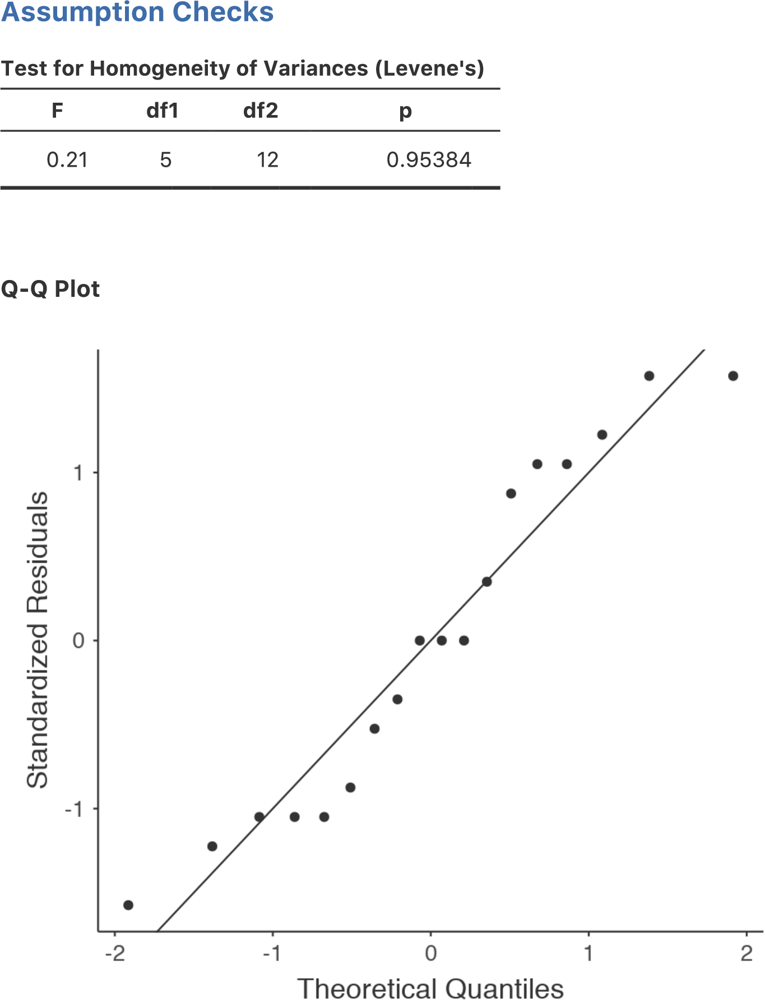
```

### 残差の正規性

残差の正規性の確認方法も，1要因分散分析の場合と同様で非常に簡単です（セクション\@ref(sec:anovanormality)参照）。残差の正規性についてはQ-Qプロットで視覚的に確かめればよいでしょう。結果は図\@ref(fig:factorialanova5)を見てください。


線形モデルとしての分散分析 {#sec:anovalm}
------------------------------------------

分散分析と回帰分析の理解においてとりわけ重要なことの1つに，これらが基本的には同じものであるということがあります。ぱっと見た限りでは，これが真実だとはとても思えないでしょう。ここまでの説明では，分散分析は主にグループ間の差を検定するもので，回帰分析は主に変数間の関係を理解するためのものだったからです。そして，それは確かにその通りです。ですが，その中身を見てみると，分散分析と回帰分析の基本的仕組みは驚くほどよく似ているのです。じつは，私たちはこれまでにすでにその証拠を目にしてきました。分散分析と回帰分析は，どちらも2乗和の値に大きく依存しており，どちらも\(F\)検定を使用する，といった点です。振り返ってみれば，第\@ref(ch:regression)章と第\@ref(ch:anova)章には同じような内容の繰り返しがいくつもあったという感じが拭えません。

それは，分散分析と回帰分析がどちらも<span class="keyterm">線形モデル</span>（linear model）の一種だからです。回帰分析の場合，これが線形モデルであることは明らかです。予測変数と結果変数の関係を記述するために使用した回帰式は直線の式でした。つまり，これは明らかに線形モデルで，そして式は次のようになります。

$$
Y_{p} = b_0 + b_1 X_{1p} + b_2 X_{2p} + \epsilon_{p}
$$

\(Y_p\)は\(p\)番目の観測値の結果変数で（たとえば\(p\)番目の人），\(X_{1p}\)は最初の予測変数の\(p\)番目の観測値の値，\(X_{2p}\)は2つめの予測変数の\(p\)番目の観測値の値，そして\(b_0\)，\(b_1\)，\(b_2\)は回帰係数で，\(\epsilon_{p}\)は\(p\)番目の残差です。もし残差の\(\epsilon_{p}\)を無視して回帰直線のみに注目すれば，この式はこうなります。

$$
\hat{Y}_{p} = b_0 + b_1 X_{1p} + b_2 X_{2p}
$$

なお，\(\hat{Y}_p\)は実際に観測された\(Y_p\)ではなく，回帰直線が\(p\)番目の個人に対して予測する\(Y\)の値です。ぱっと見ではわからないかもしれませんが，じつは分散分析も線形モデルとして書き表せます。しかも，かなり簡単にできるのです。非常に単純な例から見てみましょう。ここでは\(2 \times 2\)の多元配置分散分析を線形モデルで表してみます。

### データ

話を具体的にするために，ここでの結果変数は学生たちが私の授業でとった「成績」で，範囲が0点から100点までの比率尺度変数とします。ここでは関心対象となる2つの予測変数があります。1つめは学生が授業に出席したかどうか（「出席」）で，もう1つは学生がちゃんと教科書を読んだかどうか（「教科書」）です。ここでは，学生が出席した場合を<span class="rtext">出席 = 1</span>，欠席した場合を<span class="rtext">出席 = 0</span>ということにします。同様に，学生が教科書をちゃんと読んでいたら<span class="rtext">教科書 = 1</span>，そうでなければ<span class="rtext">教科書 = 0</span>です。

ここまではとても単純ですね。次にすべきことは，ここに少しばかり数学を加えることです（またか……って感じでしょうが）。説明のために，ここでは\(p\)番目の学生の「成績」を\(Y_p\)で表します。ただし，これは本章の最初に用いた表記とまったく同じものではありません。本章の最初の部分では，予測変数1（行の要因）が\(r\)番目のグループで予測変数2（列の要因）が\(c\)番目のグループにおける\(i\)番目の個人の値を\(Y_{rci}\)という表記で表しました。このような表記は2乗和の計算方法を説明するのには非常に便利なのですが，この文脈では面倒なだけなので，ここでは表記を変えることにします。さて，\(Y_p\)という表記は視覚的には\(Y_{rci}\)よりシンプルですが，グループの区別ができないところが欠点です。つまり，もし\(Y_{0,0,3} = 35\)という表現を用いれば，すぐにそれが授業に出席しておらず（<span class="rtext">出席 = 0</span>），教科書を読んでいないグループ（<span class="rtext">教科書 = 0</span>）の3番目で，成績が35点（<span class="rtext">成績 = 35</span>）の学生のことだとわかります。ですが，\(Y_p = 35\)という表現では，そこからわかることは\(p\)番目の学生の成績は悪かったということだけで，重要な情報が失われてしまっているのです。もちろん，これに対する修正方法はそれほど難しくありません。グループの情報がないのなら，その情報を保持するために2つの新しい変数（\(X_{1p}\)と\(X_{2p}\)）を導入すればよいのです。先ほどの学生の場合，\(X_{1p} = 0\)（つまり<span class="rtext">出席 = 0</span>）で\(X_{2p} = 0\)（つまり<span class="rtext">教科書 = 0</span>）ということになります。そうするとデータは次のようになるでしょう。

```{r, warning=FALSE, echo=FALSE,message=FALSE}
library(knitr)
library(kableExtra)

dt<-matrix(c(
1,90,1,1,2,87,1,1,3,75,0,1,4,60,1,0,5,35,0,0,6,50,0,0,7,65,1,0,8,70,0,1
),ncol=4,byrow=T)

dtf<-data.frame(dt)
colnames(dtf)<-c('学生（\\(p\\)）','成績（\\(Y_p\\)）','出席（\\(X_{1p}\\)）','教科書（\\(X_{2p}\\)）')

kable(dtf, align = c('c','c','c','c','c')) %>%
  kable_styling(bootstrap_options = "striped", full_width = F)
```

もちろん，これは何も特別なことではありません。実際のデータもこの形になっていることが期待されるのですから。[<span class="filename">rtfm.csv</span>](data/rtfm.csv)データファイルを見てみましょう。<span class="jamovi">jamovi</span>の「**Exploration**（探索）」メニューの「**Descriptives**（記述統計）」 で，データが釣り合い型のデザインになっていることを確認してください。データには出席（<span class="rtext">attend</span>）と教科書（<span class="rtext">reading</span>）のそれぞれの組み合わせごとに2つの観測値が含まれています。同様に，各組み合わせごとに成績の平均点を計算することもできます。その結果が図\@ref(fig:rtfmdescriptives)です。平均値を見ると，教科書を読むことと授業に出席することはどちらもかなり重要であるという印象を受けます。

```{r rtfmdescriptives, warning=FALSE, echo=FALSE, out.width='82.4%', fig.align='center', fig.cap='[<span class="filename">rtfm.csv</span>](data/rtfm.csv)データの記述統計', echo=FALSE}
knitr::include_graphics("img/factorialanova/rtfmdescriptives.png")
```

### 2値の要因を持つ分散分析と回帰モデル

さて，数学の話に戻りましょう。データには3つの数値変数がありました。それは，連続変数\(Y\)と，2値変数である\(X_1\)および\(X_2\)です。ここで皆さんに理解していただきたいのは，この2\(times\)2の分散分析が次の回帰モデルと*まったく*同じものであるということです。

$$
Y_{p} = b_0 + b_1 X_{1p} + b_2 X_{2p} + \epsilon_p
$$

つまり，先ほど説明した2つの予測変数を持つ回帰モデルとまったく同じ式になるのです。唯一の違いは，\(X_1\)と\(X_2\)が分散分析では*2値*変数（つまり値が0か1のもの）とされていて，回帰分析では\(X_1\)と\(X_2\)が連続変数であるとされているという点です。これを理解してもらうための方法はいくつかあって，その1つはこの2つが同じであるということを数学的に長々と証明することです。ただし，その方法を選択した場合には私の身に危険が迫り，本書の読者はそれを役立つと思うどころか嫌がらせのように思ってしまうことでしょう。ということで，ここではまず基本的な考えを説明し，その後は<span class="jamovi">jamovi</span>を使って分散分析と回帰分析がただ似ているだけでなくすべてにおいて同じであるということを示していこうと思います。まずはこのデータで分散分析を実行してみましょう。<span class="jamovi">jamovi</span>で<span class="rtext">rtfm.csv</span>データで主効果のみの分散分析を実行すると，図\@ref(fig:factorialanova6)の結果が得られます。

```{r factorialanova6, warning=FALSE, echo=FALSE, out.width='82.4%', fig.align='center', fig.cap='<span class="rtext">rtfm.csv</span>データの主効果のみの分散分析', echo=FALSE}
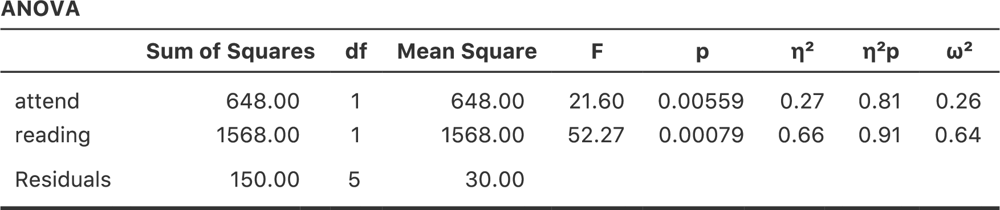
```

分散分析表の主要な数値とすでに示した平均値から，授業に出席して（\((F_{1,5} = 21.6, p = .0056)\)），教科書を読んでいる（\((F_{1,5} = 52.3, p = .0008)\)）学生がよい成績を取ることがわかります。この\(F\)統計量と\(p\)値をメモしておきましょう。

さて，今度はこのデータで線形回帰分析を行ってみます。なお，<span class="rtext">rtfm.csv</span>データでは，<span class="rtext">attend</span> （出席）と<span class="rtext">reading</span>（教科書）は，まるでこれらが数値変数であるかのように入力してありますが，この場合はこれでまったく問題ありません。授業に出席した学生（つまり<span class="rtext">attend = 1</span>）は出席していない学生（<span class="rtext">attend = 0</span>）よりも実際に「たくさん出席した」ことになるからです。つまり，これらを数値変数と考えて回帰モデルの予測変数として使うことは十分合理的なのです。ただ，これは少しばかり珍しい状態です。なぜなら，予測変数が取り得る値が2種類しかないからです。ただし，そのことは線形回帰分析のいかなる前提条件にも違反していません。それに解釈も容易です。もし<span class="rtext">attend</span>（出席）の回帰係数が0より大きい値であれば，それは授業に出席した学生の方がよい成績を取るという意味です。もし係数がゼロより小さい値なら，授業に出席した学生の方が成績が悪いという意味です。同じことは<span class="rtext">reading</span>（教科書）変数にも言えます。

でもちょっと待ってください。*なぜ*これが正しいと言えるのでしょうか。これまでに統計の授業をいくつか受けてきた人や数学が得意な人にとっては直感的に明らかなことかもしれませんが，まったく初めての人にとっては必ずしもそうではないでしょう。なぜこれが正しいと言えるのか，何人かの学生を例に具体的に見てみましょう。たとえば6番目と7番目の学生（\(p=6\)と\(p=7\)）を見てみましょう。どちらも教科書は読んでいないので，2人とも<span class="rtext">reading = 0</span>です。数学的に表現するならば，この2人は\(X_{2,6} = 0\)と\(X_{2,7} = 0\)ということになります。ただし，学生7は授業に出席していますが（<span class="rtext">attend = 1</span>なので\(X_{1,7} = 1\)），学生6はそうではありません（<span class="rtext">attend = 0</span>なので\(X_{1,6} = 0\)）。さて，これらの数値を回帰直線の式に入れたらどうなるでしょうか。学生6の場合，回帰式で予測される値は次のようになります。

$$
\begin{aligned}
\hat{Y}_{6} &= b_0  + b_1 X_{1,6} + b_2 X_{2,6}\\
&=  b_0 + (b_1 \times 0)  + ( b_2 \times 0) \\
&=  b_0
\end{aligned}
$$

つまり，この学生は切片（\(b_0\)）の値に対応する成績を取るだろうと予測できます。では学生7はどうでしょうか。この学生の数値を回帰式に入れると次のようになります。

$$
\begin{aligned}
\hat{Y}_{7} &= b_0 + b_1 X_{1,7} + b_2 X_{2,7} \\
&=  b_0 + (b_1 \times 1)  + ( b_2 \times 0) \\
&=  b_0 + b_1 
\end{aligned}
$$

この学生は講義に出席しているので，予測される成績は切片項（\(b_0\)）*プラス*出席（<span class="rtext">attend</span>）に関する係数（\(b_1\)）となります。つまり，もし\(b_1\)がゼロより大きければ，この講義に出席した学生は出席しなかった学生よりもよい成績を取るだろうと予測できます。そしてもしこの係数がマイナスの値であれば，予測は反対になります。つまり，授業に出た学生は最終的に成績が下がると予測されるのです。もう少し他の学生で見てみましょう。学生1の場合はどうでしょうか。彼は授業に出席し（\(X_{1,1} = 1\)），*かつ*教科書を読んでいます（\(X_{2,1} = 1\)）。これらの数字を回帰式に入れると次のようになります。

$$
\begin{aligned}
\hat{Y}_{1} &= b_0 + b_1 X_{1,1} + b_2 X_{2,1} \\
&=  b_0 + (b_1 \times 1)  + ( b_2 \times 1)  \\
&=  b_0 + b_1 + b_2 
\end{aligned}
$$

つまり，もし授業への出席がよい成績につながり（つまり\(b_1 > 0\)），そして教科書を読むことがよい成績につながる（\(b_2 > 0\)）のであれば，学生1は学生6や学生7よりもよい成績になることが期待されるのです。

ここまで来れば，教科書は読んだけれども授業に出席していない学生3の成績の予測値が，この回帰モデルでは\(b_2 + b_0\)になるということもわかっていただけるでしょう。ここでまた回帰式を書いて説明するような退屈なことはしません。その代わり，それらを*期待される成績*の表として示しておきます。


```{r, warning=FALSE, echo=FALSE,message=FALSE}
library(knitr)
library(kableExtra)

dt<-matrix(c(
'\\(b_0\\)' , '\\(b_0 + b_2\\)', '\\(b_0 + b_1\\)' , '\\(b_0 + b_1 + b_2\\)'
),ncol=2,byrow=T)

dtf<-data.frame(dt)
colnames(dtf)<-c('読んだ','読んでない')
rownames(dtf)<-c('出席','欠席')

kable(dtf, align = c('c','c')) %>%
  kable_styling(bootstrap_options = "striped", full_width = F)%>%
  add_header_above(c('','教科書'=2))
```

ご覧のように，切片の\(b_0\)は出席せず教科書も読んでない学生に期待される成績で，これは成績の「ベースライン」のような役目を持っています。同様に，\(b_1\)は授業に出席した場合に期待される成績の増分，\(b_2\)は教科書を読んだときに期待される成績の増分を表しています。これが分散分析だったとしたら，\(b_1\)は出席の主効果，\(b_2\)は教科書を読むことの主効果ということになるでしょう。実際，単純な\(2 \times 2\)の分散分析ではまさにその通りなのです。

では，なぜ分散分析と回帰分析が基本的に同じであると言えるのかについて見ていきましょう。<span class="jamovi">jamovi</span>で<span class="rtext">rtfm.csv</span>データの回帰分析を実行すると，本当にその通りだということがわかります。通常どおりに回帰分析を実行した結果が図\@ref(fig:factorialanova7)です。

```{r factorialanova7, warning=FALSE, echo=FALSE, out.width='82.4%', fig.align='center', fig.cap='<span class="jamovi">jamovi</span>での<span class="rtext">rtfm.csv</span>データの回帰分析結果', echo=FALSE}
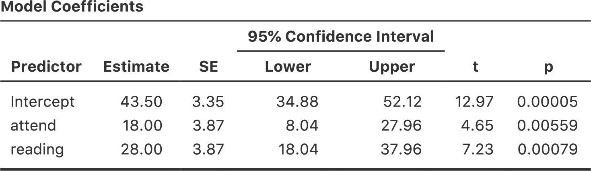
```

ここにはいくつか興味深い点があります。まず，切片の43.5という値は授業に出席せず，教科書も読んでいない「グループ」の平均値42.5と近い値であることに注意してください。2つめに，出席（<span class="rtext">attend</span>）変数の回帰係数が\(b_1 = 18.0\)ですから，授業に出席した学生はそうでない学生に比べて18点成績が高くなるということです。つまり，授業に出席した学生で教科書を読んでいない学生は\(b_0 + b_1\)の成績になるので，この学生の成績は\(43.5 + 18.0 = 61.5\)ということになります。教科書を読んだ学生の場合も同様であるということは自分で確かめてみてください。

分散分析と回帰分析が同じものであるという証拠をさらに見ていきましょう。回帰分析の出力にある<span class="rtext">attend</span>（出席）変数の\(p\)値と<span class="rtext">reading</span>（教科書）変数の\(p\)値を見てください。これらは先ほど行った分散分析の結果と同じです。これはちょっと驚きかも知れませんね。なぜなら，回帰モデルで計算されているのは\(t\)統計量で，分散分析で計算されているのは\(F\)統計量だからです。ですが，第\@ref(ch:probability)章の話を覚えているでしょうか。\(t\)分布と\(F\)分布にはある関係があるのです。自由度\(k\)の\(t\)分布に従って分布する何らかの量を2乗すると，その2乗した値は自由度1と\(k\)の\(F\)分布になるのです。このことは回帰分析結果の\(t\)統計量で確かめることができます。たとえば<span class="rtext">attend</span>変数の\(t\)は4.65です。この値を2乗すると21.6になり，そしてこれは対応する分散分析の\(F\)統計量に一致します。

そしてこれが最後の項目です。<span class="jamovi">jamovi</span>は分散分析と回帰分析がどちらも線形モデルであることを知っているので，回帰分析でも分散分析表を得ることができます。そのためには「**Linear Regression**（線形回帰）」メニューの「**Model Coefficients**（モデル係数）」にある「**Omnibus Test**（オムニバス検定）」の「**ANOVA Test**（ANOVA検定）」をチェックしてください。そうすると，図\@ref(fig:factorialanova8)のような結果が得られます。

```{r factorialanova8, warning=FALSE, echo=FALSE, out.width='82.4%', fig.align='center', fig.cap='<span class="jamovi">jamovi</span>の回帰分析におけるオムニバス検定（ANOVA）の結果', echo=FALSE}
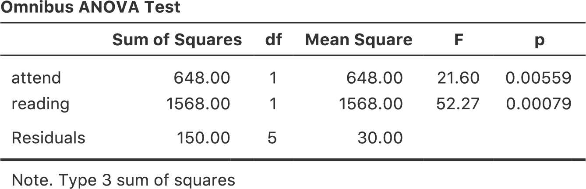
```

### 3水準以上の要因の対比

ここまで，\(2\times 2\)の分散分析を線形モデルとして捉える方法について見てきました。これを\(2 \times 2 \times 2\)の分散分析や\(2 \times 2 \times 2 \times 2\)の分散分析に一般化することはとても簡単です。実際，手順はまったく同じで，単に新たな2値変数をそれぞれの要因に追加してやるだけです。ところが，水準数が2を超える要因がある場合には話がややこしくなりはじめます。本章の最初に扱った[<span class="filename">clinicaltrial.csv</span>](data/clinicaltrial.csv)データでの\(3 \times 2\)の分散分析の場合を考えてみましょう。 水準が3つある<span class="rtext">drug</span>（投薬条件）要因を回帰分析に使えるような数値型に変換するにはどうすれば良いのでしょうか。

これは実際にはそれほど難しいことではありません。3水準の要因が*2つ*の2値変数として書き直し可能であるということさえわかればよいのです。たとえば，<span class="rtext">druganxifree</span>という新しい2値変数を作ったとしましょう。<span class="rtext">drug</span>（投薬条件）変数が<span class="rtext">anxifree</span>（アンシフリー）の場合，この変数の値は必ず<span class="rtext">druganxifree=1</span>とします。それ以外の場合には<span class="rtext">druganxifree=0</span>とします。この変数は，アンシフリーとそれ以外の2つの投薬条件の<span class="keyterm">対比</span>（contrast）を行うものです。もちろん，<span class="rtext">druganxifree</span>という対比だけでは，<span class="rtext">drug</span>変数に含まれるすべての情報を完全には捉えきれていません。ここではもう1つの対比が必要です。それはジョイゼパムとプラシボを区別できるようにするための対比です。このために，<span class="rtext">drugjoyzepam</span>という名の2番目の2値変数を作成します。これは投薬条件がジョイゼパムの場合に1になり，それ以外は0になります。この2つの対比を組み合わせると，3つの投薬条件すべてを完全に区別することができます。これを表で示すと次のようになります。

```{r, warning=FALSE, echo=FALSE,message=FALSE}
library(knitr)
library(kableExtra)

dt<-matrix(c(
'placebo',0,0,'anxifree',1,0,'joyzepam',0,1
),ncol=3,byrow=T)

dtf<-data.frame(dt)
colnames(dtf)<-c('drug','druganxifree','drugjoyzepam')

kable(dtf, align = c('c','c','c','c','c')) %>%
  kable_styling(bootstrap_options = "striped", full_width = F)
```

患者に投与された薬がプラシボの場合，2つの対比変数は両方とも0になります。もし薬がアンシフリーなら，<span class="rtext">druganxifree</span>変数は1で<span class="rtext">drugjoyzepam</span>変数は0です。ジョイゼパムの場合はこの反対で，<span class="rtext">drugjoyzepam</span>が1に，<span class="rtext">druganxifree</span>は0になります。

対比変数は，<span class="jamovi">jamovi</span>では新しい計算変数として簡単に作成できます。たとえば，<span class="rtext">druganxifree</span>変数を作るには，新しい計算変数を作って数式ボックスに<span class="rtext">IF(drug == 'anxifree', 1, 0)'</span>という式を入れます。同様に，新たに<span class="rtext">drugjoyzepam</span>という変数を作ったら，数式ボックスに<span class="rtext">IF(drug == 'joyzepam', 1, 0)'</span>と入力します。同じように，心理療法の変数についても<span class="rtext">CBTtherapy</span>という計算変数を作成して<span class="rtext">IF(therapy == 'CBT', 1, 0)</span>という式を入れてやれば，対比変数ができます。これらの新しい変数とその式は，[<span class="filename">clinicaltrial2.omv</span>](data/clinicaltrial2.omv)ファイルで確認できます。

これで3水準の要因を2つの2値変数で定義することができました。それに，2水準の要因を持つ分散分析と回帰分析が同じ振る舞いをすることはすでに見てきました。ただ，この場合は先ほどより少し複雑になっています。その点について次のセクションで見ていくことにします。

### 3水準以上の要因が含まれる分散分析と回帰分析

私たちの手元には，2種類の方法で表現された同じデータがあります。元の[<span class="filename">clinicaltrial.csv</span>](data/clinicaltrial.csv)データでは<span class="rtext">drug</span>（投薬条件）変数は3水準の1つの変数でしたが，拡張した[<span class="filename">clinicaltrial2.omv</span>](data/clinicaltrial2.omv)データでは，これが2つの対比変数で表現されています。ここで確かめたいのは，元の\(3 \times 2\)の分散分析が対比変数を使用した回帰分析と同じだということです。再び（主効果のみで）分散分析を実行してみましょう。そうすると結果は図\@ref(fig:factorialanova9)のようになります。

```{r factorialanova9, warning=FALSE, echo=FALSE, out.width='82.4%', fig.align='center', fig.cap='<span class="jamovi">jamovi</span>での主効果のみの分散分析結果', echo=FALSE}

```

驚くようなことは何もありませんね。これはすでに実行した分散分析とまったく同じ結果です。次に，<span class="rtext">druganxifree</span>と<span class="rtext">drugjoyzepam</span>，そして<span class="rtext">CBTtherapy</span>を予測変数として回帰分析を実行してみます。その結果が図\@ref(fig:factorialanova10)です。

```{r factorialanova10, warning=FALSE, echo=FALSE, out.width='64.7%', fig.align='center', fig.cap='<span class="jamovi">jamovi</span>での対比変数（<span class="rtext">druganxifree</span>と<span class="rtext">drugjoyzepam</span>）を使った回帰分析の結果', echo=FALSE}
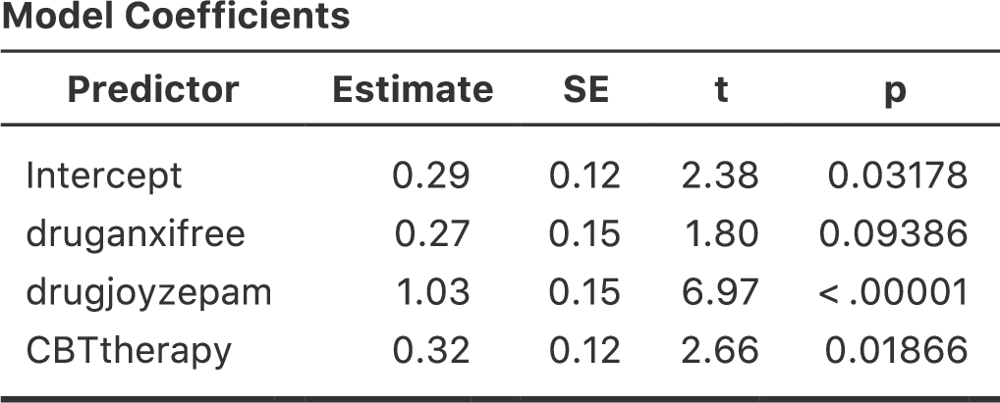
```

おや，これは先ほど見た結果と同じではありませんね。当然ですが，回帰分析の出力には3つの予測変数の結果が別々に表示されており，回帰分析を実行したときと同じ見た目になっています。ただし，<span class="rtext">CBTtherapy</span>変数の\(p\)値が分散分析の<span class="rtext">therapy</span>要因の値とまったく同じであるということがわかります。これでこの回帰分析が分散分析と同じことをやっているということが再確認できました。一方で，回帰分析では<span class="rtext">druganxifree</span>と<span class="rtext">drugjoyzepam</span>の対比変数がそれぞれ*別々*に検定されており，まるで無関係な変数のように扱われています。これは当然のことで，かわいそうな回帰分析君には，<span class="rtext">drugjoyzepam</span>と<span class="rtext">druganxifree</span>が実際には<span class="rtext">drug</span>要因の3水準を符号化するために用いた対比変数であるということを知るすべがありません。回帰分析からは，<span class="rtext">drugjoyzepam</span>と<span class="rtext">therapyCBT</span>が無関係であるのと同じくらい，<span class="rtext">drugjoyzepam</span>と<span class="rtext">druganxifree</span>が無関係に見えているのです。私や皆さんはその関係を知っているのですけどね。ただ，ここではこれら2つの対比が個別に有意かどうかはどうでもいいことです。ここで知りたいのは，投薬条件による「全体的な」効果があるかどうかということですから。つまり，*私たち*が<span class="jamovi">jamovi</span>にやって欲しいことというのは，何かしらの「モデル比較」であり，そこではこの2つの「投薬関連」の対比はひとまとめにして扱って欲しいわけです。これに見覚えはないですか？ そう，ここで私たちがすべきことは帰無仮説の指定で，この場合のそれは，<span class="rtext">CBTtherapy</span>変数を含み，図\@ref(fig:factorialanova11)のように投薬関連の変数を両方とも取り除いたモデルなのです。

```{r factorialanova11, warning=FALSE, echo=FALSE, out.width='82.4%', fig.align='center', fig.cap='<span class="jamovi">jamovi</span>の回帰分析における帰無仮説と対比変数入りモデルの比較', echo=FALSE}
knitr::include_graphics("img/factorialanova/factorialanova11.png")
```

これでだいぶよくなりました。\(F\)統計量は26.15，自由度は2と14で，\(p\)値は\(0.00002\)です。この数値は，分散分析で<span class="rtext">drug</span>の主効果として得た値と同じです。ここでもまた，分散分析と回帰分析が本質的に同じであることがわかりました。両者とも線形モデルであり，基礎にある統計的な仕組みは分散分析と回帰分析で同じなのです。このことの重要性を過小評価してはいけません。本章の残りの部分では，この考え方を大いに利用します。

なお，先ほどは分散分析と回帰分析が本質的に同じであることを示すために新しい変数として<span class="rtext">druganxifree</span>と<span class="rtext">drugjoyzepam</span>という対比変数を作成しましたが，<span class="jamovi">jamovi</span>の線形回帰分析にはこの対比を簡単に作成できる素晴らしい機能があります（図\@ref(fig:regfactors)）。<span class="jamovi">jamovi</span>では，要因になっている予測変数を回帰分析に「**Factors**（要因）」として追加できるのです。そう，要因です。素晴らしいですね。また，どのグループを基準レベルにするかは「**Reference Levels**（基準レベル）」オプションで指定できます。ここでは基準レベルを「<span class="rtext">placebo</span>（プラシボ）」と「<span class="rtext">no.therapy</span>（心理療法なし）」にしました。こうするのが一番意味が通りますからね。

```{r regfactors, warning=FALSE, echo=FALSE, out.width='82.4%', fig.align='center', fig.cap='<span class="jamovi">jamovi</span>の回帰分析での「要因」の使用とオムニバス検定（ANOVA）の結果', echo=FALSE}
knitr::include_graphics("img/factorialanova/regfactors.png")
```

さらに，「**Model Coefficients**（モデル係数）」の「**Omnibus Test**（オムニバス検定）」にある「**ANOVA**（分散分析）」のチェックボックスをオンにすると，\(F\)統計量は26.15，自由度は2と14，そして\(p\)値は\(0.00002\)であることがわかります（図\@ref(fig:regfactors)）。この数値は，分散分析で<span class="rtext">drug</span>の主効果として得た値と同じです。ここでもまた，分散分析と回帰分析が本質的に同じであることが示されました。両者とも線形モデルであり，基礎にある統計的な仕組みは分散分析と回帰分析で同じなのです。

### パラメータ数としての自由度

さて，これでようやく私にとって満足な形で自由度を定義できる準備が整いました。じつは，モデルの自由度というのはそのモデルで推定する必要があるパラメータの数という形で定義できるのです。回帰分析や分散分析では，パラメータ数が切片を含む回帰係数の個数（つまり\(b\)の値）に対応しています。\(F\)検定はつねに2つのモデルの比較であるということを思い出してください。最初の自由度（\(df\)）は2つのモデルのパラメータ数の違いです。たとえば，さきほどの比較モデルでは，帰無仮説（<span class="rtext">気分改善 ~ 切片 + 認知行動療法</span>には2つのパラメータがあります。つまり，切片と<span class="rtext">therapyCBT</span>変数のための係数です。対立仮説モデル（<span class="rtext">気分改善 ~ 切片 + アンシフリー + ジョイゼパム + 認知行動療法</span>）には4つのパラメータがあります。3つの対比それぞれの回帰係数と切片です。そして，この分析における自由度は，この2つのモデルのパラメータの*差*，\(df_1 = 4-2 = 2\)になるのです。

帰無仮説モデルがないように見えるケースではどうなるのでしょう。たとえば，「**Linear Regression**（線形回帰）」の「**Model Fit**（モデル適合）」オプションで「**F Test**（\(F\)検定）」を選んだときに表示される\(F\)検定はどうなのだと思ったかもしれません。確かに，これについては回帰モデル全体の検定だと説明しました。ですが，これもやはり2つのモデルを比較しているのです。この場合の帰無仮説モデルは，1つの回帰係数，つまり切片のみを含むモデルです。対立仮説モデルには，\(K\)個の予測変数と切片という，\(K+1\)個の回帰係数が含まれています。つまり，この\(F\)検定での1つめの自由度は，\(df_1 = K+1-1 = K\)ということになります。

では\(F\)検定に現れる2つめの自由度は何でしょうか。これはつねに関連する残差の自由度です。これもパラメータと考えることができますが，ちょっとややこしくなります。これは次のように考えてください。データ全体で総数\(N\)個の観測値があったとします。もしこれらの\(N\)個の値を*完全*に説明したいなら，\(N\)個の数が必要になります。回帰モデルを作成するということは，実際にはデータを完全に説明するのに必要な数のうちの一部を特定することなのです。そして，モデルに\(K\)個の予測変数と切片があるということは，そのすべての数のうちの\(K+1\)個を特定したということになります。さて，実際にそれを*どうやるのか*というのはとりあえず置いておいて，生データを完全に説明するためには，*あといくつ*の数を\(K+1\)パラメータの回帰モデルに追加する必要があるでしょうか。\((K+1) + (N-K-1) = N\)で，だからあと\(N-K-1\)個必要だという答えに自力でたどり着けたなら上出来です^[訳注：\(N\)個必要なところに\(K+1\)個あるのだから，\(N\)個から\(K+1\)個を引いて\(N-(K+1)=N-K-1\)だと考える方が自然だと思うのですが，このあたりは文化差でしょうか。ヨーロッパなどでは，おつりの計算でも「商品価格の3ドルにあと2ドル足すと受け取った金額の5ドルになるからおつりは2ドル」のように足し算的に計算するそうですから。]。それで正解です。原理としては，まずすべての観測値のためのパラメータを含む馬鹿げたほど複雑な回帰モデルを想像します。もちろん，このモデルはデータを完全に説明することができます。このモデルには全部で\(N\)個のパラメータが含まれますが，ここでの関心はこの完全モデルのパラメータ数（つまり\(N\)）と実際に関心対象となる単純な回帰モデルのパラメータ数（\(K+1\)）の差であり，したがって\(F\)検定の2つめの自由度は\(df_2 = N-K-1\)となるのです。なお，ここでは\(K\)が（回帰モデルの）予測変数の個数，あるいは（分散分析の）対比の個数に相当します。私が上で示した例では，データには\(N=18\)の観測値があり，分散分析モデルには\(K+1 = 4\)の回帰係数があるので，残差の自由度は\(df_2 = 18-4 = 14\)になります。

対比のさまざまな指定方法{#sec:contrasts}
--------------------------------------------------------

先ほどのセクションでは，1つの要因を対比のセットに変換する方法について説明しました。そこでの方法は，次の表のような形で2値変数のセットを作成するというものでした。

```{r, warning=FALSE, echo=FALSE,message=FALSE}
library(knitr)
library(kableExtra)

dt<-matrix(c(
'placebo',0,0,'anxifree',1,0,'joyzepam',0,1
),ncol=3,byrow=T)

dtf<-data.frame(dt)
colnames(dtf)<-c('drug','druganxifree','drugjoyzepam')

kable(dtf, align = c('c','c','c','c','c')) %>%
  kable_styling(bootstrap_options = "striped", full_width = F)
```

この表の各行がそれぞれ要因の1つのレベルに対応しており，そしてそれぞれの列が対比に対応しています。そしてこの表は，つねに列数よりも行数の方が1つだけ多くなります。この表には特別な名前があり，これは<span class="keyterm">対比行列</span>（contrast matrix）と呼ばれています。また，対比行列の指定方法にはさまざまなものがあります。このセクションでは，統計学者が使用する一般的な対比行列と，それらを<span class="jamovi">jamovi</span>で使用する方法について説明します。もしこの後に不釣り合い型の分散分析（セクション\@ref(sec:unbalancedanova)）を読むつもりなら，このセクションを注意深く読んでおくことをお勧めします。そうでないなら，この部分をざっと読み飛ばしてもいいでしょう。なぜなら，対比の選択は釣り合い型デザインではそれほど重要でないからです。

### 処理対比

先ほど説明したタイプの対比では，要因の中の1つの水準が特別で（つまり例題データの<span class="rtext">placebo</span>），それを「ベースライン」とする形で他の2つが定義されていました。このような対比は<span class="keyterm">処理対比</span>（treatment contrasts）または「ダミーコーディング」（dummy coding）と呼ばれています。この対比では，要因の各水準と基準水準での比較が行われ，そして基準水準が切片の値になります。

この対比は，その要因に含まれる水準のうちの1つが実際にベースラインとして用いられるため，その水準が本当に特別なものである場合には，極めて自然でわかりやすいものになります。そしてこれは私たちの臨床試験データにもあてはまります。このデータの<span class="rtext">placebo</span>（プラシボ）条件は，実際には本物の薬を投与されていない状態であり，だから特別なのです。他の2つの条件は，このプラシボと比較する形で定義されます。必要に応じ，プラシボをアンシフリーに置き換えたり，あるいはジョイゼパムに置き換えたりすることもできます。

上に示した表は3つの水準がある場合の処理対比の行列です。では，5水準の要因で処理対比行列を作成したい場合はどうなるでしょう。その場合は次のようになります。

```{r, warning=FALSE, echo=FALSE,message=FALSE}
library(knitr)
library(kableExtra)

dt<-matrix(c(
1,0,0,0,0,2,1,0,0,0,3,0,1,0,0,4,0,0,1,0,5,0,0,0,1
),ncol=5,byrow=T)

dtf<-data.frame(dt)
colnames(dtf)<-c('水準','2','3','4','5')

kable(dtf, align = c('c','c','c','c','c')) %>%
  kable_styling(bootstrap_options = "striped", full_width = F)
```

この例では，最初の対比は水準1と水準2の比較，2つめは水準1と水準3の比較という形になっています。とくに何も指定しない場合，つねに*最初*の水準がベースラインとして扱われる点に注意してください（つまり，最初の水準はつねに値が0になり，その効果を見るための対比は明示的には作成されません）。<span class="jamovi">jamovi</span>では，「**Data Variable**（データ変数）」ウィンドウで「**Levels**（レベル）」の順序を変更することでその要因のどの水準を最初にするかを指定できます（「**Data Variable**（データ変数）」ビューを開くには，スプレッドシート上で変数名の部分をダブルクリックしてください）。

### ヘルマート対比，差分対比

処理対比は多くの状況で便利な対比です。ですが，この対比は真の意味でのベースラインが存在し，すべてのグループについてそれとの比較で評価を行いたいような場合にもっとも意味をなします。ですが，そのようなベースラインが存在せず，1つのグループを残りのグループの平均値と比較した方が意味があるという場合もあるかもしれません。そのような場面では<span class="keyterm">ヘルマート対比</span>（Helmert contrasts）または<span class="keyterm">差分対比</span>（difference contrasts）を使用します。<span class="jamovi">jamovi</span>では「**ANOVA**（分散分析）」の「**Contrasts**（対比）」オプションで「<span class="rtext">helmert</span>」（ヘルマート対比の場合）あるいは「<span class="rtext">difference</span>」（差分対比の場合）を選択することで使用できます。

ヘルマート対比では，各グループの値が「それ以降」の平均値と比較されます。つまり，最初の対比はグループ1の平均値とグループ2，3，4…の平均値の比較，2つめの対比はグループ2の平均値とグループ3，4，5…の平均値の比較，というような形で比較をしていくのです。これに対し，差分対比では各グループの値が「それ以前」の平均値と比較されます。つまり，最初の対比はグループ1の平均値とグループ2の比較，2つめの対比はグループ3の平均値とグループ1，2の平均値の比較，という形になります。こうしたことから，差分対比は「逆ヘルマート対比」と呼ばれることもあります^[訳注：本書の英語版である『Learning Statistics with jamovi』の元となっている『Learning Statistics with R』では，当然ながら<span class="R">R</span>による対比の作成方法が説明されています。じつは，<span class="R">R</span>でヘルマート対比を作成するための<span class="rtext">contr.helmert</span>という関数が作成する対比と<span class="jamovi">jamovi</span>の作成する「ヘルマート対比」は同じものではありません。<span class="R">R</span>のヘルマート対比は，<span class="jamovi">jamovi</span>の「差分対比（逆ヘルマート対比）」と同じ形になっているのです。そして<span class="R">R</span>には<span class="jamovi">jamovi</span>の作成するヘルマート対比を直接指定するためのコマンドはありません。なお，ヘルマート対比と逆ヘルマート対比は基本的に行列が上下逆さまに回転しているだけなので，<span class="R">R</span>のような行列の扱いが得意なソフトウェアでは，このことはとくに問題にはなりません。ただ，『Learning Statistics with jamovi』では，本文には『Learning Statistics with R』の記述がそのまま使われていて，<span class="jamovi">jamovi</span>でのヘルマート対比と向きが逆になっていましたので，日本語版ではその辺の記述を修正・追加してあります。]。

ヘルマート対比で5水準ある要因の対比行列を作成すると次のようになります。

```{r, warning=FALSE, echo=FALSE,message=FALSE}
library(knitr)
library(kableExtra)

dt<-matrix(c(
1,-1,-1,-1,-1,2,1,-1,-1,-1,3,0,2,-1,-1,4,0,0,3,-1,5,0,0,0,4
),ncol=5,byrow=T)

dt2<-dt[nrow(dt):1,ncol(dt):1][,1:4]
dt[,2:5]<-dt2
dtf<-data.frame(dt)
colnames(dtf)<-c('水準','2','3','4','5')

kable(dtf, align = c('c','c','c','c','c')) %>%
  kable_styling(bootstrap_options = "striped", full_width = F)
```

また，差分対比では次のようになります。

```{r, warning=FALSE, echo=FALSE,message=FALSE}
library(knitr)
library(kableExtra)

dt<-matrix(c(
1,-1,-1,-1,-1,2,1,-1,-1,-1,3,0,2,-1,-1,4,0,0,3,-1,5,0,0,0,4
),ncol=5,byrow=T)

dtf<-data.frame(dt)
colnames(dtf)<-c('水準','2','3','4','5')

kable(dtf, align = c('c','c','c','c','c')) %>%
  kable_styling(bootstrap_options = "striped", full_width = F)
```

ヘルマート対比や差分対比の便利なところは，すべての対比で合計が0（つまり，各列の合計が0）になるということです。これにより，これらの対比を使用した場合には，分散分析を回帰分析として解釈する際に切片の値が全体平均値（\(\mu_{..}\)）と同じになるのです。これとは対照的に，処理対比では切片の値はベースラインの平均値になります。こうした特性は，いくつかの状況では非常に役立ちます。ここまで説明してきたような釣り合い型デザインではあまり大きな問題になりませんが，この後のセクション\@ref(sec:unbalancedanova)で説明する不釣り合い型のデザインでは，このことが重要になってくるのです。実際，私がこのセクションをわざわざここに入れた理由は，不釣り合い型の分散分析を理解するうえで対比を理解しておいて欲しかったからです。

### ゼロ和対比

ここで取りあげるべきであろう4つめの対比は「ゼロ和」対比で，これは異なるグループ間で比較するものです。<span class="jamovi">jamovi</span>ではこれは「simple（単純）」対比と呼ばれています。具体的には，それぞれの対比でベースライン（最初のグループ）と各グループの比較が行われます。

```{r, warning=FALSE, echo=FALSE,message=FALSE}
library(knitr)
library(kableExtra)

dt<-matrix(c(
1,-1,-1,-1,-1,2,1,0,0,0,3,0,1,0,0,4,0,0,1,0,5,0,0,0,1
),ncol=5,byrow=T)

dtf<-data.frame(dt)
colnames(dtf)<-c('水準','2','3','4','5')

kable(dtf, align = c('c','c','c','c','c')) %>%
  kable_styling(bootstrap_options = "striped", full_width = F)
```

この対比はヘルマート対比と非常によく似ていて，それぞれの列の合計は0になります。つまり，分散分析を回帰モデルとして扱った場合，その切片の値が全体平均値と同じになるのです。この対比を解釈する場合には，これがグループ1と残りの4グループそれぞれとの比較であるということを認識しておく必要があります。具体的には，対比1は「グループ1 &minus; グループ2」の比較，対比2は「グループ1 &minus; グループ2」の比較という形になるのです^[処理対比と何が違うのかと思った人も多いのではないでしょうか。そこで，わかりやすい例として性別の主効果で考えてみましょう。男性を0（<span class="rtext")>m = 0</span>），女性を1（<span class="rtext")>f = 1</span>）とします。処理対比の場合，対応する係数には女性と男性の平均値の差が示され，そして切片は男性の平均値になります。しかし，単純対比では（<span class="rtext")>m = -1</span>）で（<span class="rtext")>f = 1</span>）になり，切片は両グループの平均値を平均した値になります。そして，主効果は切片と各グループの平均値との差の大きさになるのです。]。

### <span class="jamovi">jamovi</span>の対比オプション

<span class="jamovi">jamovi</span>には分散分析でさまざまな対比を作成することができます。その設定は，「**ANOVA**（分散分析）」メニューで表示される分散分析画面の「**Contrasts**（対比）」オプションにあります。そこでは以下のタイプが指定できます。


| 対比のタイプ | 説明                                          |
|:---|:---------------|
| <span class="rtext">deviation</span><br>（偏差）| 各水準（基準グループを除く）の平均値を全水準の平均値（全体の平均値）と比較します。|
| <span class="rtext">simple</span><br>（単純）| 処理対比と同じく，単純対比は各水準の平均値を特定の水準の平均値と比較します。このタイプの対比は，コントロールグループ（統制群）がある場合に便利です。初期設定値では，1番目の水準が基準になります。ただし，単純対比では切片の値はその要因の全水準の平均値になります。|
| <span class="rtext">difference</span><br>（差分）|  各水準の平均値とそれ以前の水準全体の平均値との間で比較を行います。（逆ヘルマート対比と呼ばれることもあります）。|
|  <span class="rtext">helmert</span><br>（ヘルマート） |  各水準の平均値（1番最後を除く）とそれ以降の水準全体の平均値との間で比較を行います。|
| <span class="rtext">repeated</span><br>（反復）|  各水準（1番最後を除く）の平均値とその直後の水準の平均値との間で比較を行います。|
| <span class="rtext">polynomial</span><br>（多項式）|  まずすべての水準の線形効果（1次効果），次に2次効果，3次効果という形で，線形効果（1次効果）および高次効果の比較を行います。この対比は多項式近似の推定によく用いられます。|


事後検定 {#sec:posthoc2}
----------------------------------

さて，少し話を変えましょう。今度は対比を使用した計画的な比較ではなく，分散分析で有意な効果が見られた場合について考えてみます。\(F\)検定というのは「全体」についての検定なので，帰無仮説ではグループ間に差がないということだけが仮定されています。そのため，結果が有意だったとしてもどのグループの間に差があるのかまではわかりません。これについては第\@ref(ch:anova)章でも論じました。そして，そこでは考えられる組み合わせすべてに対して\(t\)検定を行い，（ボンフェロニ補正やホルム補正などで）多重比較補正をして全体での第1種の誤り率をコントロールする方法について説明しています。第\@ref(ch:anova)章で使用した方法は比較的単純なもので，複数の仮説を検定するさまざまな場面で応用できるという利点があるのですが，分散分析で事後分析を行う場合においては，それらの方法がベストというわけでもないのです。統計学の文献にはじつにさまざまな多重比較の方法があげられています[@Hsu1996]。ただ，それらすべてを詳しく説明することは本書のような入門書の範囲を超えています。

ただ，その中で皆さんに知っておいてほしいツールが1つあります。それは<span class="keyterm">テューキーのHSD</span>と呼ばれるものです（テューキーのHSDの「HSD」は「本当に有意な差（Honestly Significant Difference）」の略です）。今回は，式の説明は省いて考え方の説明だけにしておこうと思います。テューキーのHSDの基本的な考え方は，関連するすべてのペアで比較をするというものです。つまり，テューキーのHSDはペアごとの比較が実際の関心対象である場合に適切な方法といえます^[たとえば，グループB，Cの平均値とグループAの間に有意な差があるのではないかということに関心がある場合には，別のツールを使用する必要があります（たとえばシェフェ（Scheffe）法がそうですが，これはより慎重な方法で，そして本書の範囲を超えています）。しかし，多くの場面ではグループ間でのペアごとの比較に興味があることでしょう。だからテューキーのHSDについて知っておくことはとても役立ちます。]。たとえば，私たちは[<span class="filename">clinicaltrial.csv</span>](data/clinicaltrial.csv)データで多元配置分散分析を行いました。そして投薬条件と心理療法の主効果があったので，次の4つを比較することに関心があるはずです。

-   アンシフリーとプラシボでの気分改善効果の差

-   ジョイゼパムとプラシボでの気分改善効果の差

-   アンシフリーとジョイゼパムを投与された人の気分改善の差

-   認知行動療法（CBT）と心理療法なしの気分改善効果の差

これらの比較では，いずれも関心があるのはグループ（の母集団の）平均値の差です。テューキーのHSDでは，<span class="keyterm">同時信頼区間</span>（simultaneous confidence interval）を使用してこれら4つの比較を行います。95％の「同時」信頼区間というのは，これと同じ研究を何度も繰り返した場合に，その研究結果の95％で真の値がその信頼区間の中に含まれるということです。また，特定の比較の際に信頼区間を使用して調整済み\(p\)値を計算することもできます。

しかも，<span class="jamovi">jamovi</span>の分散分析でテューキーのHSDを使用するのはとても簡単です。分散分析のモデルで使用した要因のうち，事後検定を行いたいものを指定するだけでいいのです。たとえば，例題データの主効果については事後検定をしたいが交互作用についてはしたくない場合，分散分析の「Post Hoc Tests（事後検定）」を開いて<span class="rtext">drug</span>と<span class="rtext">therapy</span>変数を右側のボックスに入れ，そして「**Tukey**（テューキー）」のチェックボックスをオンにします。設定画面と出力結果を図\@ref(fig:factorialanova13)に示しました。

```{r factorialanova13, warning=FALSE, echo=FALSE, out.width='82.4%', fig.align='center', fig.cap='<span class="jamovi">jamovi</span>の分散分析における主効果についてのテューキーのHSD検定', echo=FALSE}
knitr::include_graphics("img/factorialanova/factorialanova13.png")
```

「**Post Hoc Tests**（事後検定）」の結果の表もとても簡単です（よね？）。たとえば，最初の比較はアンシフリーとプラシボの差で，結果の最初の部分はグループ間で観察された平均値の差が\(.27\)であることを示しています。次の数値は差の標準誤差で，この値を用いれば必要に応じて95%信頼区間を計算できます。ただし，今のところ<span class="jamovi">jamovi</span>では信頼区間までは計算してくれませんので，必要な場合は自分で計算する必要があります。そしてその横には自由度の列があり，\(t\)値の列があり，最後に\(p\)値の列があります。最初のアンシフリーとプラシボの比較では，調整済み\(p\)値は\(.21\)です。これに対し，次の行にあるジョイゼパムとプラシボの比較では観察された差は1.03で，この差は有意です（\(p<.001\)）。

ここまではいいでしょうか。では交互作用が含まれているモデルの場合にはどうなるでしょう。たとえば，<span class="jamovi">jamovi</span>の初期設定では，投薬条件と心理療法の交互作用もモデルに含まれています。その場合，比較すべきペアの数は増加します。これまでのように，まず<span class="rtext">drug</span>主効果について３つの比較を考える必要があり，そして<span class="rtext">therapy</span>の主効果では比較が1つあります。そこに有意な交互作用を含めて考えるなら（その交互作用に含まれる差を見たいなら），さらに次の比較も含めなくてはなりません。

-   アンシフリーを投与されて認知行動療法（CBT）を受けた人と，プラシボを投与されて認知行動療法を受けた人の気分改善の差

-   アンシフリーを投与されて心理療法を受けたなかった人と，プラシボを投与されて心理療法を受けなかった人の気分改善の差

-   ……などなど

このように，比較しなくてはならないペアが非常にたくさんあることになります。そのため，分散分析でテューキーのHSDによる検定を行った場合，かなりたくさん（この例では合計19個）の結果を見ることになります（図\@ref(fig:factorialanova14)）。見た目はよく似ていますが，比較の数はかなり多くなっているのがわかりますね。

```{r factorialanova14, warning=FALSE, echo=FALSE, out.width='82.4%', fig.align='center', fig.cap='<span class="jamovi">jamovi</span>の分散分析における主効果および交互作用についてのテューキーのHSD検定', echo=FALSE}
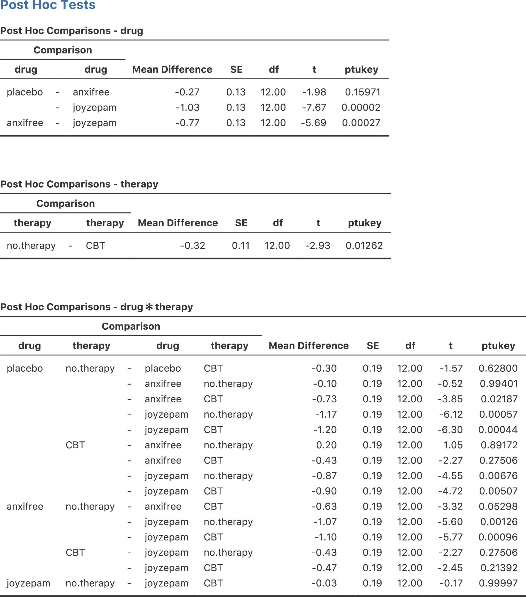
```

計画的比較法 {#sec:plannedcomparisons}
---------------------------------------------------------------

分散分析における対比と事後検定のセクションに続けて，計画的比較の方法についてもざっと見ておいた方がよいでしょう。先ほどのセクションや第\@ref(ch:anova)章の多重比較の議論では，実行したい検定が純粋に事後的なものであると仮定していました。たとえば，例題データの分析の場合，薬の種類が気分改善に対して異なる影響を持つだろう（つまり薬の主効果がある）とは考えていたでしょうが，どの薬がどんな風に異なる影響を持つかということについては特別な仮説を持っていなかったのではないでしょうか。あるいは，どのペアを比較すべきかということについて，事前にはまったくわからないという状態だったのではないかと思います。その場合には，テューキーのHSDのような方法でペアごとの比較を行わなくてはなりません。

しかし，特定の比較についてあらかじめ何か特別な仮説を持っているような場合，そして事前に指定した以外の比較を*何があろうと*，*絶対に*，*誓って*行わないというのなら状況が変わってきます。その場合，そして（万一当初の仮説にはなかった部分で有意になりそうに見える部分があったとしても）誠実に，厳然と，そしてあなたの気高い意志を貫いてその他のいかなる比較も行わないという場合には，テューキーのHSDのような方法をとる意味はありません。なぜならそれらの方法は全ての組み合わせで比較をする場合の補正であって，この場合にはすべての組み合わせについて関心があるわけではないし，それを見ようともしていないからです。そうした状況では，多重比較のための調整なしに（限られた）個数の仮説検定を安全に実行することができます。これは<span class="keyterm">計画的比較法</span>（method of planned comparisons）と呼ばれ，臨床試験などでときどき用いられています。ただし，その方法の詳細については本書のような入門書の範囲を超えているのでここでは取りあげません。ここではただ，そのような方法も存在するということだけお伝えしておきます。

多元配置分散分析（その3） ---不釣り合い型デザイン--- {#sec:unbalancedanova}
----------------------------------------------------------------

多元配置分散分析は知っておくととても便利な方法です。これは実験データを分析するためのツールとして何十年も使われてきました。今でも心理学の研究論文を見るとその少なくとも2，3本に1本の頻度で分散分析が使われているはずです。ただし，実際の科学論文に見る分散分析と私がここまで説明してきた分散分析には大きな違いがあります。それは，実際の場面では，完全に釣り合い型デザインになることは滅多にないということです。さまざまな理由により，いくつかのグループで観測値の数が他と違うということがあります。別の言い方をすれば，<span class="keyterm">不釣り合い型デザイン</span>（unbalanced design）の場合があるのです。

不釣り合い型デザインは釣り合い型デザインよりもはるかに注意して扱う必要があり，その基礎となる統計理論も数段ごちゃごちゃしています。このごちゃごちゃのせいか，あるいは時間が足りないせいか，私の知る限り大学の心理学研究法の授業ではこの問題は完全に無視されてしまう傾向にあるようです。統計の入門教科書の大部分もこの問題には触れていません。その総合的な結果だと私は思うのですが，この領域における現役研究者も，その多くは不釣り合い型デザインの分散分析に複数の「タイプ」があるということを認識しておらず，非常に異なる答えを出してしまっていることがあるのです。実際，心理学の研究論文を読んでみると，不釣り合い型デザインの分散分析を使用している人の多くがその分析の再現のために必要な情報をきちんと提供していないのですから驚きです。私が密かに思っているところでは，おそらく多くの人は統計ソフトにデータ分析上の重要な意思決定の大部分を任せてしまっているということに気づいてすらいません。そう考えると，これは実際には恐ろしいことです。ですから，もしあなたが自分のデータ分析における決定権を統計ソフトなんかに渡したくないならば，ぜひ次のセクションを読んでください。

### コーヒーデータ

まずは，何らかの例題データがあった方がよいでしょう。そこで，[<span class="filename">coffee.csv</span>](data/coffee.csv)ファイルに\(3 \times 2\)の不釣り合い型分散分析用の架空データを用意しておきました。ここでは，人々の無駄話（<span class="rtext">babble</span>）の程度に注目します。人々がコーヒーを飲み過ぎた場合に，コーヒーそのものの影響で無駄話が増えるのか，それともコーヒーに追加したミルク（<span class="rtext">milk</span>）や砂糖（<span class="rtext">sugar</span>）の影響で無駄話が増えるのかを知りたいというのが目的です。そして18人の参加者にコーヒーを飲んでもらったとしましょう。コーヒーとカフェインの量は一定とし，ミルクを加えるかどうかが実験条件になります。ですから，ミルク（<span class="rtext">milk</span>）の要因は「あり」（<span class="rtext">yes</span>）と「なし」（<span class="rtext">no</span>）の2水準です。また，砂糖については複数の条件を使用しました。コーヒーに追加する砂糖は，本物の砂糖（<span class="rtext">"real"</span>），人工甘味料（<span class="rtext">"fake"</span>），砂糖なし（<span class="rtext">"none"</span>）のいずれかなので，砂糖（<span class="rtext">sugar</span>）要因は3水準です。ここでの結果変数は連続変数で，これは何らかの心理学的な測度を用いて人が「無駄話をしている」程度を測定しています。その詳細部分についてはここでは重要ではありません。このデータを<span class="jamovi">jamovi</span>のスプレッドシートビューで見ると，図\@ref(fig:factorialanova15)のようになります。

```{r factorialanova15, warning=FALSE, echo=FALSE, out.width='82.4%', fig.align='center', fig.cap='[<span class="filename">coffee.csv</span>](data/coffee.csv)データの記述統計。ここではグループごとに算出してある。', echo=FALSE}
knitr::include_graphics("img/factorialanova/factorialanova15.png")
```

図\@ref(fig:factorialanova15)の表に示された平均値を見ると，グループ間に差がありそうだという印象を強く受けます。とくに無駄話（<span class="rtext">babble</span>）変数の標準偏差に注目した場合，これらの平均値の差がよりはっきりします。標準偏差はグループ間で.14から.71までばらついていますが，いずれにしてもこれらの値はグループ平均値の差に比べてかなり小さいからです^[この標準偏差の違いから，分散の等質性の前提に違反しているのではないかと思った人もいるかもしれません（というか思ってください）。これについてはルビーン検定のオプションを使ってチェックしてみてください。ちょっとした練習問題です。]。一見するとこれは単純な多元配置分散分析に見えるかもしれませんが，それぞれのグループに含まれる観測値の個数を見たときにそうではないことがわかります。図\@ref(fig:factorialanova15)に示されている\(N\)の値はグループごとに異なっています。つまり，私たちの最初の仮定の1つ，「各グループで人数が同じ」に違反しているのです。このような場合にどう対処すればよいのかについてはまだ説明していません。

### 不釣り合い型デザイン用の「分散分析の標準」は存在しない

不釣り合い型デザインを見ていくと，ちょっと不安なある事実に突き当たります。それは，この場合の分散分析には本当の意味での標準と呼べる方法がないということです。事実，分散分析を不釣り合い型で実行する場合には，基本的に異なる3つの方法があります^[実際にはこれはちょっとばかり嘘になります。分散分析には本書で説明した以外の形のものもあります。たとえば，本書では各要因の水準が実験者または世界によって「固定」される固定効果モデルと，各要因の水準がより大きな母集団からの無作為標本であるランダム効果モデルの違いを完全に無視しています（本書では固定効果モデルだけを扱っています）。本書やその他の教科書，資料等が，統計について「あなたが知っておくべきことすべて」を教えてくれているという考えは捨ててください。1冊の本で心理学や物理学，あるいは哲学についてのすべてを語ることなど不可能です。世の中はあまりに複雑で，1冊の本では語りきれないのです。ですが，だからといって絶望する必要はありません。多くの研究者は，本書に書かれているのとそれほど変わらないような基本的な分散分析の知識でやりくりできているのです。ただ，本書は長い長い物語のほんの始まりに過ぎず，これがすべてではないということを念押ししておきます。]。なお，釣り合い型デザインのデータの場合には，3つの方法すべてで2乗和や\(F\)値その他の諸々のすべてが本章の最初に示した式と同じになり，同じ分析結果になります。ところが，不釣り合い型デザインの場合にはそうはなりません。さらに，それぞれの方法は，使用する状況によって適切さが変化します。状況によっては，ある方法が他の方法より適切であるというようなこともあるのです。ですから，異なるタイプの分散分析がどのようなものであるのかを理解すること，そしてそれらがお互いにどのように違っているのかを理解しておくことはとても重要です。

最初に取りあげる分散分析は，伝統的に<span class="keyterm">タイプIの2乗和</span>（Type I sum of squares）と呼ばれているものです。これで残り2つが何と呼ばれているか，だいたい想像がつきますね。名前に「2乗和」が入っていますが，これはもともと統計パッケージのSASが使い始めた呼び方です。そして，それが一般的になって標準的な呼び名になりました。ただ，この名前は少しばかり誤解を招くものです。おそらく，これを「タイプ○の2乗和」と呼ぶのは，出力される分散分析表における大きな違いが2乗和にあるからでしょう。自由度は変わりませんし，2乗平均の値も2乗和を自由度で割ったものです。ただ，私がこの名前はよくないと思うのは，2乗和が*なぜ*お互いに異なっているのかの説明になっていないというところです。「なぜ」の部分に答えるためには，この3種類の分散分析を「3つの異なる*仮説検定方略*を用いた分散分析」であると考える方がいいでしょう。これら検定方略の違いによって，2乗和は確かに異なった値になります。ですが，ここで重要なのは方略の違いであって，2乗和の違いではありません。セクション\@ref(sec:anovalm)で説明したように，すべての\(F\)検定は2つの線形モデルの比較と考えることができます。ですから，分散分析表を見る場合には，その\(F\)検定が何らかのモデルの*ペア*について比較を行っているのだということを忘れないようにしてください。そうするともちろん，そこから自然な疑問が生まれてきます。つまり，*どの*モデルペアを比較するのかということです。これが分散分析におけるタイプIの2乗和，タイプIIの2乗和，タイプIIIの2乗和の基本的な違いです。これらの分散分析は，それぞれ異なった方法でモデルのペアを作成し，検定しているのです。

### タイプIの2乗和

タイプIの2乗和は，「逐次」2乗和と呼ばれることもある方法です。なぜなら，これはモデルに効果を1つずつ追加していくからです。コーヒーデータを例に考えてみましょう。このデータで交互作用を含む\(3 \times 2\)の分散分析を実行したいとします。完全モデルには，結果変数として「無駄話（<span class="rtext">babble</span>）」，予測変数には「砂糖（<span class="rtext">sugar</span>）」と「ミルク（<span class="rtext">milk</span>）」，そしてその交互作用である「砂糖×ミルク（<span class="rtext">sugar × milk</span>）」が含まれています。するとこのモデルは，<span class="rtext">無駄話〜砂糖+ミルク+砂糖×ミルク</span>のように書けます。タイプIの方法では，このモデルを逐次組み立てていくのです。まずはもっとも単純なモデルで，そこから1つずつ効果を追加していきます。

このデータに対するもっとも単純なモデルは，ミルクも砂糖も無駄話には効果がないとするモデルです。そのモデルに含まれる唯一の効果は切片で，このモデルを<span class="rtext">無駄話〜切片</span>と表しましょう。これが私たちの最初の帰無仮説です。このデータで次に単純なモデルは，2つの主効果のいずれかが含まれたものです。コーヒーデータの場合，可能性としては2つの選択肢があります。つまり，ミルクを先に追加するか砂糖を先に追加するかです。あとで見るように，どちらを先にするかということは実際には大事な部分なのですが，ここではとりあえず砂糖を選ぶことにしましょう。すると，2つめのモデルは<span class="rtext">無駄話〜切片+砂糖</span>となって，これが最初の検定における対立仮説になります。それでは，次の2つの仮説を使って仮説検定を行いましょう。

$$
\begin{array}{ll}
帰無仮説モデル: & 無駄話 \sim 切片 \\
対立仮説モデル:& 無駄話 \sim 切片+ 砂糖
\end{array}
$$

この比較は，「砂糖」の主効果についての検定になります。モデル構築の次のステップは，ここに別の主効果を追加することです。すると次のモデルは<span class="rtext">無駄話〜切片+砂糖+ミルク</span>となります。2つめの仮説検定では，次の2つのモデルを比較します。

$$
\begin{array}{ll}
帰無仮説モデル: & 無駄話 \sim 切片+ 砂糖 \\
対立仮説モデル:& 無駄話 \sim 切片+ 砂糖 + ミルク
\end{array}
$$
　
この比較は，「ミルク」の主効果の検定になります。ある意味，これは非常にエレガントな方法です。なぜなら，最初の検定における対立仮説が次の検定における帰無仮説になるからです。この意味で，タイプIの手法は完全に逐次的なやり方であるといえます。すべての検定が，その直前の検定結果に基づいて構成されるのです。しかし，見方を変えると，この方法はあまりエレガントとは言えません。なぜなら，2つの検定の間に強い非対称性があるからです。「砂糖」の主効果の検定（1回目の検定）は「ミルク」を完全に無視しているのに対し，「ミルク」の主効果の検定（2つめの検定）は「砂糖」を考慮したモデルになっています。ともあれ，この通りに検定を進めていけば，4つめのモデルが完全モデル（<span class="rtext">無駄話〜切片+砂糖+ミルク+砂糖×ミルク</span>）になります。そしてこれに対応する仮説検定は次のようになります。

$$
\begin{array}{ll}
帰無仮説モデル: & 無駄話 \sim 切片+ 砂糖 + ミルク\\
対立仮説モデル:& 無駄話 \sim 切片+ 砂糖 + ミルク+ 砂糖×ミルク
\end{array}
$$

<span class="jamovi">jamovi</span>の分散分析では初期設定値がタイプIIIの2乗和なので，タイプIの2乗和による分析を行うには「**ANOVA**（分散分析）」の「**Model**（モデル）」オプションで「**Sum of squares**（Sum of squares）」に「**Type 1**」を指定する必要があります。これを実行すると，図\@ref(fig:factorialanova16)のような分散分析表が出力されます。

```{r factorialanova16, warning=FALSE, echo=FALSE, out.width='82.4%', fig.align='center', fig.cap='<span class="jamovi">jamovi</span>でのタイプIの分散分析結果', echo=FALSE}
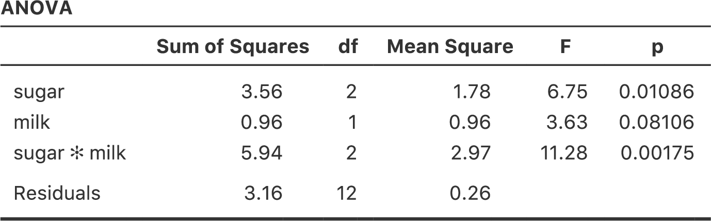
```

タイプIの方法を使用する際の大きな問題は，変数の投入順序による影響が非常に大きいということです。ところが，多くの場合，どの変数を優先してモデルに投入すべきかを判断するための基準が研究者にはありません。これは例題データにおけるミルクと砂糖の場合でも同じです。ミルクと砂糖はどちらを先に入れるべきでしょうか。実際にコーヒーを入れる場合にはどちらが先か決まった順序はありませんが，これはデータ分析の場合でも同様です。中にはその順序について確固たる意見を持っている人もいるでしょうが，この問題に対する原則的な答えというものは想像できません。ですが，順序を変えるとどうなるか，図\@ref(fig:factorialanova17)を見てください。

```{r factorialanova17, warning=FALSE, echo=FALSE, out.width='82.4%', fig.align='center', fig.cap='<span class="jamovi">jamovi</span>でのタイプIの分散分析結果。先ほどの分析と異なり，「ミルク（milk）」要因が最初にモデルに投入されている。', echo=FALSE}
knitr::include_graphics("img/factorialanova/factorialanova17.png")
```

両者の主効果に関する\(p\)値が変化しています。それもかなりの変化です。とくに目立つのが<span class="rtext">milk</span>（ミルク）の主効果で，今度は結果が有意になりました（ただし，すでに述べたように，これについて強い結論を導くことは避けるべきでしょう）。どちらの分散分析結果を報告すべきでしょうか。これはすぐにはわかりません。

ここで「1つめ」の主効果の検定と「2つめ」の主効果の検定に使用されたモデルを見てみると，それらが違う内容になっていることがわかります。最初の例では，「ミルク」を完全に無視した状態で「砂糖」の主効果についての検定を行いましたが，「ミルク」の主効果の検定では「砂糖」が考慮されています。このように，タイプIの検定では最初の主効果が理論的に優位なものとして扱われているのです。私の経験では，複数の主効果のうちいずれかに理論的な優位性がある場合というのは非常に希で，それらの主効果を非対称に扱うことは正当化できません。

つまり，タイプIの検定が関心対象になることは非常に希であるといえます。ですから，タイプIIやタイプIIIの検定に話を進めるべきでしょう。

### タイプIIIの2乗和

タイプIの次は，きっとタイプIIだと思ったことでしょう。ですが，タイプIIの検定は少しややこしいので，その前にタイプIIIの検定について説明するのが自然だろうと思います（こちらは単純で，<span class="jamovi">jamovi</span>の分散分析でも初期設定になっています）。タイプIII検定の考え方はとてもシンプルです。どの効果についての検定をするかに関わらず，\(F\)検定の対立仮説モデルはユーザーが指定した完全モデルで，そして帰無仮説モデルは検定対象の効果のみそこから取り除いたモデルになります。たとえば，コーヒーデータの例では，私たちの完全モデルは<span class="rtext">無駄話 ~ 切片 + 砂糖 + ミルク + 砂糖×ミルク</span>ですから，「砂糖」の主効果の検定は次の2つのモデルの比較になります。

$$
\begin{array}{ll}
帰無仮説モデル: & 無駄話 \sim 切片 + ミルク+ 砂糖×ミルク\\
対立仮説モデル:& 無駄話 \sim 切片+ 砂糖 + ミルク+ 砂糖×ミルク
\end{array}
$$

同様に，「ミルク」の主効果は完全モデルとそこから「ミルク」を取り除いた帰無仮説モデルに対する検定なので次のようになります。

$$
\begin{array}{ll}
帰無仮説モデル: & 無駄話 \sim 切片 + 砂糖 + 砂糖×ミルク\\
対立仮説モデル:& 無駄話 \sim 切片+ 砂糖 + ミルク+ 砂糖×ミルク
\end{array}
$$

最後に，交互作用（砂糖×ミルク）もまったく同じ方法で検定されます。ここでも，完全モデルとそこから「砂糖×ミルク」の交互作用を取り除いた帰無仮説モデルで検定します。すると次のようになります。

$$
\begin{array}{ll}
帰無仮説モデル:& 無駄話 \sim 切片 + 砂糖 + ミルク\\
対立仮説モデル:& 無駄話 \sim 切片+ 砂糖 + ミルク+ 砂糖×ミルク
\end{array}
$$


この考え方は，要因数がさらに多い分散分析でも同じです。たとえば，<span class="rtext">A</span>，<span class="rtext">B</span>，<span class="rtext">C</span>という3つの要因を含む分散分析をしようとしているとしましょう。そしてすべての主効果と交互作用を検定したいとします。そこには<span class="rtext">A*B*C</span>という3要因の交互作用も含まれます。次の表は，その場合にタイプIIIの検定がどうなるかを示したものです。

| 検定<br>対象 |  帰無仮説モデル <br><span class="rtext">Y ~ \...</span>  |  対立仮説モデル <br><span class="rtext">Y ~ \...</span> |
|:--------|:----------------------------------------------|:-----------------------------------------------------|
| <span class="rtext">A</span> | <span class="rtext">B + C + A×B + A×C + B×C + A×B×C</span> | <span class="rtext">A + B + C + A×B + A×C + B×C + A×B×C</span> |
| <span class="rtext">B</span> | <span class="rtext">A + C + A×B + A×C + B×C + A×B×C</span> | <span class="rtext">A + B + C + A×B + A×C + B×C + A×B×C</span> |
| <span class="rtext">C</span> | <span class="rtext">A + B + A×B + A×C + B×C + A×B×C</span> | <span class="rtext">A + B + C + A×B + A×C + B×C + A×B×C</span> |
| <span class="rtext">A×B</span> | <span class="rtext">A + B + C + A×C + B×C + A×B×C</span> | <span class="rtext">A + B + C + A×B + A×C + B×C + A×B×C</span> |
| <span class="rtext">A×C</span> | <span class="rtext">A + B + C + A×B + B×C + A×B×C</span> | <span class="rtext">A + B + C + A×B + A×C + B×C + A×B×C</span> |
| <span class="rtext">B×C</span> | <span class="rtext">A + B + C + A×B + A×C + A×B×C</span> | <span class="rtext">A + B + C + A×B + A×C + B×C + A×B×C</span> |
| <span class="rtext">A×B×C</span> | <span class="rtext">A + B + C + A×B + A×C + B×C</span> | <span class="rtext">A + B + C + A×B + A×C + B×C + A×B×C</span> |


表はなんともひどいことになっていますが，それでもとても単純です。どの場合でも，対立仮説は3つの主効果（<span class="rtext">A</span>など），3つの2要因の交互作用，（<span class="rtext">A×B</span>など）そして1つの3要因の交互作用（つまり<span class="rtext">A×B×C</span>）を含む完全モデルです。帰無仮説モデルはつねにこの7つの効果のうちの6つを含むもので，欠けている1つが有意性検定の対象となる効果です。

こうしてみると，最初に試すものとしてはタイプIIIはよい選択肢といえるでしょう。まず，タイプI検定を実施する場合に生じる非対称性の問題を取り除けます。ここではすべての効果が同じ方法で扱われているので，仮説検定の結果が効果の投入順序に左右されることはありません。これは間違いなく好ましいことです。ただし，この方法には大きな問題が1つあります。それは，検定結果の解釈，とくに主効果の解釈です。コーヒーデータの例を考えてみてください。タイプIIIの検定で「ミルク」の主効果が有意でなかったとしましょう。この結果で明らかになるのは，<span class="rtext">無駄話〜切片+砂糖+砂糖×ミルク</span> のモデルが完全モデルよりも良いモデルであるということです。しかし，これはどういう意味でしょうか。ここでもし「砂糖×ミルク」の交互作用も有意でなかったとしたら，無駄話に影響を与えているのは「砂糖」であると結論づけたくなるでしょう。しかし，交互作用が有意であるにもかかわらず「ミルク」の主効果が有意でなかったらどうでしょう。この場合，「砂糖の効果」と「ミルクと砂糖の交互作用」はあるけれども「ミルクの効果」はないと言ってしまって本当によいのでしょうか。これはおかしいですよね。結局，「交互作用が有意なら主効果について話すのは意味がない」ということになるのです^[もしくは，少なくとも主効果には関心がないということになります。] 。一般に，統計学者の多くが「交互作用が有意なら主効果は意味がない」いうのはつまりはこういうことで，そして私もこれは正しい考え方だと思います。しかし，交互作用が有意で主効果が有意でない場合，その主効果について話すことが本当に無意味だとしたら，では，なぜタイプIIIの検定では帰無仮説モデルに交互作用を含めるのに，その交互作用を構成する主効果の1つを省略するのでしょうか。このような形で比較した場合，帰無仮説にはほとんど意味がなくなってしまいます。

じつはタイプIIIの検定が名誉挽回できる場合というのもあって，それについてはこの後に説明します。ですが，まずは分散分析表の結果を見てみることにしましょう。タイプIIIの2乗和を使った場合の分析結果が図\@ref(fig:factorialanova18)です。

```{r factorialanova18, warning=FALSE, echo=FALSE, out.width='82.4%', fig.align='center', fig.cap='<span class="jamovi">jamovi</span>でのタイプIIIの分散分析結果', echo=FALSE}
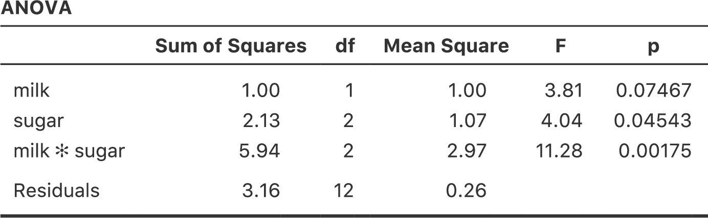
```

ここで注意して欲しいことがあります。これがタイプIII検定のやっかいなところなのですが，この検定結果は要因の*対比*（対比の話を忘れてしまった人はセクション\@ref(sec:contrasts)を参照してください）をどのように作成するかによって変わってくる^[ただし，<span class="jamovi">jamovi</span>ではタイプIIIの2乗和は選択する対比に関係なくすべて同じ値になります。ということは，<span class="jamovi">jamovi</span>は明らかに何か違うことをしているのですね。]。

もし，タイプIIIの検定で得られる\(p\)値が（<span class="jamovi">jamovi</span>ではそうでないけれど）対比の作成方法によって大きく影響を受けるなら，タイプIIIの検定は恣意的で信頼できないものということになってしまうのではないでしょうか。ある意味ではその通りです。そしてこの後のタイプIIについてのセクションを読むと，タイプIIの分析ではそうした恣意性が完全に取り除かれていることがわかります。ただし，結論としてはそれは言いすぎだと思います。まず，選択する対比によっては答えはつねに同じになります。ここでとくに重要なのは対比行列の各列の合計で，これが0に制約されている場合には，タイプIIIの分析の結果はつねに同じになるのです（ということで，じつは<span class="jamovi">jamovi</span>ではこのように計算されているのです）。

### タイプIIの2乗和

さて，タイプIとタイプIIIの検定についての話が終わりました。この2つはどちらも非常に単純です。タイプIの検定は一度に1つずつモデルに効果を追加していき，タイプIIIの検定は完全モデルと対象となる効果を取り除いたモデルを比較するというだけでした。しかし，どちらにも問題点があります。タイプIの検定は効果の投入順序によって影響を受けますし，タイプIIIの検定はどのような対比にするかによって結果が変わります。タイプIIの検定は，説明するのは少し難しいですが，これらの問題が両方とも取り除かれており，そのおかげで解釈も少しだけ簡単になります。

タイプIIの検定は，大まかにはタイプIIIの検定と同様です。「完全」モデルからスタートして，特定の効果を取り除いたモデルと比較します。ただし，タイプIIの検定には<span class="keyterm">周辺原理</span>（marginality principle）が採用されています。それは，そこにもし高次の効果があるならば，その効果に関連する低次の効果を削除してはならないというものです。これがどういうことかというと，たとえばモデルに2要因（<span class="rtext">A×B</span>）の交互作用（2次の効果）が含まれているならば，<span class="rtext">A</span>と<span class="rtext">B</span>の主効果（1次の効果）はモデルから削除してはならないということなのです。同様に，もし3要因の交互作用（<span class="rtext">A×B×C</span>）が含まれているならば，そのモデルには<span class="rtext">A</span>，<span class="rtext">B</span>，<span class="rtext">C</span>の主効果と，より単純な交互作用である<span class="rtext">A×B</span>，<span class="rtext">A×C</span>，<span class="rtext">B×C</span>が含まれていなければなりません。タイプIIIの検定では，この周辺原理に違反するケースが多々あります。たとえば，すべての交互作用を含む3要因分散分析において，<span class="rtext">A</span>の主効果について検定する場合を考えてみましょう。タイプIIIの検定によれば，帰無仮説モデルと対立仮説モデルは次のようになります。

$$
\begin{array}{ll}
帰無仮説モデル: & 結果変数 \sim \rm{B}+\rm{C}+\rm{A}\times\rm{B}+\rm{A}\times\rm{C}+\rm{B}\times\rm{C}+ \rm{A}\times\rm{B}\times\rm{C}\\
対立仮説モデル:& 結果変数 \sim \rm{A}+\rm{B}+\rm{C}+\rm{A}\times\rm{B}+\rm{A}\times\rm{C}+\rm{B}\times\rm{C}+ \rm{A}\times\rm{B}\times\rm{C}
\end{array}
$$

このとき，<span class="rtext">A</span>は帰無仮説から削除されていますが，<span class="rtext">A×B</span>や<span class="rtext">A×C</span>，そして<span class="rtext">A×B×C</span>はモデルの一部として含まれたままです。タイプIIの検定では，このようなモデルは帰無仮説として適切とみなされません。要因<span class="rtext">A</span>が結果変数に無関係であるという帰無仮説を検定したいなら，交互作用を含め<span class="rtext">A</span>が一切関与しないモデルの中でもっとも複雑なものを帰無仮説として使用する必要があるのです。そして対立仮説モデルは，その帰無仮説モデルに<span class="rtext">A</span>の主効果を加えたものになります。これは多くの人が「<span class="rtext">A</span>の主効果」として直感的に思い浮かべるものに非常に近い形でしょう。そして，タイプIIの方法による<span class="rtext">A</span>の主効果の検定は次のようになります^[当然ですが，これはあなたが指定したモデルに依存します。もし元々の分散分析モデルに\rtextsmall{B*C}の交互作用が含まれていないなら，当然ながらその効果は帰無仮説にも対立仮説にも含まれません。ですが，これはタイプI，II，IIIのいずれの場合も同様です。どの場合でも，あなたが分析モデルに含めなかった効果が検定の対象になることは絶対にありません。これらタイプの異なる分析方法は，あなたが指定した効果について検定を行う際に，そのモデルをどのように組み立てるかが異なるのです。]。

$$
\begin{array}{ll}
帰無仮説モデル: & 結果変数 \sim \rm{B}+\rm{C}+\rm{B}\times\rm{C}\\
対立仮説モデル:& 結果変数 \sim \rm{A}+\rm{B}+\rm{C}+\rm{B}\times\rm{C}
\end{array}
$$

とにかく，タイプIIがどんな手順になるのかを見ておくことにしましょう。以下は3要因分散分析における検定を表にまとめたものです。

| 検定<br>対象 |  帰無仮説モデル <br><span class="rtext">Y ~ \...</span>  |  対立仮説モデル <br><span class="rtext">Y ~ \...</span> |
|:--------|:----------------------------------------------|:-----------------------------------------------------|
|<span class="rtext">A</span> | <span class="rtext">B + C + B×C</span> | <span class="rtext">A + B + C + B×C</span>|
|<span class="rtext">B</span> | <span class="rtext">A + C + A×C</span> | <span class="rtext">A + B + C + A×C</span>|
|<span class="rtext">C</span> | <span class="rtext">A + B + A×B</span> | <span class="rtext">A + B + C + A×B</span>|
|<span class="rtext">A×B</span> | <span class="rtext">A + B + C + A×C + B×C</span> | <span class="rtext">A + B + C + A×B + A×C + B×C</span>|
|<span class="rtext">A×C</span> | <span class="rtext">A + B + C + A×B + B×C</span> | <span class="rtext">A + B + C + A×B + A×C + B×C</span>|
|<span class="rtext">B×C</span> | <span class="rtext">A + B + C + A×B + A×C</span> | <span class="rtext">A + B + C + A×B + A×C + B×C</span>|
|<span class="rtext">A×B×C</span> | <span class="rtext">A + B + C + A×B + A×C + B×C</span> | <span class="rtext">A + B + C + A×B + A×C + B×C + A×B×C</span>|


コーヒーデータにおける2要因分散分析では，仮説検定はもっとシンプルになります。「砂糖」の主効果は，次の2つのモデルの\(F\)検定になります。

$$
\begin{array}{ll}
帰無仮説モデル: & 無駄話 \sim 切片+ミルク\\
対立仮説モデル:& 無駄話 \sim 切片+砂糖 + ミルク
\end{array}
$$

「ミルク」の主効果の検定は次の通りです。

$$
\begin{array}{ll}
帰無仮説モデル: & 無駄話 \sim 切片+砂糖\\
対立仮説モデル:& 無駄話 \sim 切片+砂糖 + ミルク
\end{array}
$$


最後に，「砂糖×ミルク」の交互作用はこうなります。

$$
\begin{array}{ll}
帰無仮説モデル: & 無駄話 \sim 切片+砂糖 + ミルク\\
対立仮説モデル:& 無駄話 \sim 切片+砂糖 + ミルク+砂糖 \times ミルク
\end{array}
$$

検定の実行方法も簡単です。「**ANOVA**（分散分析）」の「**Model**（モデル）」オプションで，「**Sum of squares**（2乗和）」の種類として「Type 2」を選択するだけです。すると，図\@ref(fig:factorialanova19)のような分散分析表が得られます。

```{r factorialanova19, warning=FALSE, echo=FALSE, out.width='82.4%', fig.align='center', fig.cap='<span class="jamovi">jamovi</span>でのタイプIIの分散分析結果', echo=FALSE}
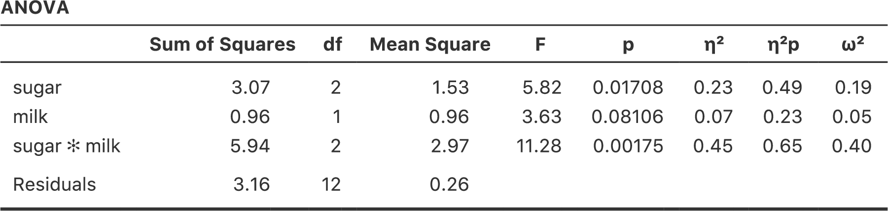
```

タイプII検定には，タイプIやタイプIIIの検定に比べて明らかに優れている面がいくつかあります。タイプII検定は（タイプIと違い）特定の要因を指定する順序に影響されませんし，（タイプIIIと違い）要因の対比の指定方法に依存しません。そして，最後の点については意見が分かれるところで，私たちがデータから何を明らかにしようとしているのかにもよるのですが，タイプIIの仮説検定は，私たちが本当に関心を持っている事柄にうまく対応していると考えられる点です。その結果，タイプIIの検定結果はタイプIやタイプIIIの検定に比べて解釈が容易な場合が多いと感じます。こうしたことから，自分の研究の問いに直接つながるような明確なモデル比較がなく，それでも不釣り合い型分散分析を行いたい場合には，タイプIやタイプIIIではなくタイプIIの検定をするのがおそらくもっともよい選択だろうというのがひとまずの私の考え方です^[面白いことに，<span class="R">R</span>ではタイプIが初期設定値で，SPSSと<span class="jamovi">jamovi</span>ではタイプIIIが初期設定値です（訳注：ついでに言うと，SASの初期設定ではタイプIとタイプIIIの結果が表示されます）。どちらも私にとってはあまり魅力的ではありません。これに関して私が残念に思うのは，心理学の研究論文でどのタイプの分散分析を実施したのかについて報告する人がほとんどいないということです。変数投入順序（タイプI）や対比（タイプIII）について報告する人はさらに少なくなります。多くの場合，どのソフトウェアを使用したのかさえ報告されていないのです。こうなると，周辺的な手がかりからどのソフトウェアが使用されているのかを推測し，さらにその初期設定がけっして変更されていないと仮定する以外に，報告されている内容を理解する方法はありません。こんなことはやめてください。皆さんはこうした問題があるということを知ったわけですから，使用したソフトウェアを必ず報告するようにしてください。そしてもし不釣り合い型分散分析の結果を報告するならどのタイプの分析を実行したのか，タイプIを使用した場合にはどの順序で変数を投入したのか，タイプIIIを使用した場合にはどの対比を用いたのかをきちんと示すようにしてください。あるいは，本当に関心のある事柄に対応した仮説検定を行い，それを報告するようにしてください。]。

### 効果量（と非相加2乗和）

<span class="jamovi">jamovi</span>では，オプションを選択すれば\(\eta^2\)や偏\(\eta^2\)といった効果量を算出することができます（\@ref(fig:factorialanova19)）。しかし，不釣り合い型デザインの場合には，少しばかり複雑な問題が関係してきます。

分散分析についてかなり最初の方に説明したことですが，2乗和の計算における基本の1つに，モデルに含まれる効果の2乗和すべてを合計し，そしてそこに残差の2乗和を加えると，それが全体の2乗和になるということがあります。そして，\(\eta^2\)の考え方は2乗和の1つを全体の2乗和で割るというものであり，そういった理由から\(\eta^2\)はその特定の効果が全体の分散を説明する割合として解釈できるのでした。ところが，不釣り合い型デザインの場合にはそう単純にはいかないのです。なぜなら，分散の一部が「失われてしてしまう」からです。

これは少し奇妙な話に聞こえるかもしれません。でもこれは，次のことが原因で生じます。つまり，不釣り合い型デザインの場合，そこに含まれる要因はお互いに関連することになり，要因Aと要因Bの効果を区別することが困難になってしまうのです。極端な場合として，\(2 \times 2\)の要因計画で各グループの人数が次のような場合の分析を考えてみましょう。

```{r, warning=FALSE, echo=FALSE,message=FALSE}
library(knitr)
library(kableExtra)

dt<-matrix(c(
100,0,0,100
),ncol=2,byrow=T)

dtf<-data.frame(dt)
colnames(dtf)<-c('砂糖あり','砂糖なし')
rownames(dtf)<-c('ミルクあり','ミルクなし')

kable(dtf, align = c('c','c','c','c','c')) %>%
  kable_styling(bootstrap_options = "striped", full_width = F)
```

このデータは見事なまでに不釣り合いです。100人がミルクと砂糖を使用し，100人がミルクなしで砂糖なしです。他はありません。砂糖なしでミルクありの人は0人で，砂糖ありでミルクなしの人も0人です。ここで，このデータでは「ミルク＋砂糖」グループと「ミルクなし＋砂糖なし」グループの間に大きな（そして統計的に有意な）差があったとしましょう。さて，これは砂糖の主効果でしょうか。ミルクの主効果でしょうか。それとも交互作用でしょうか。これを区別することは不可能です。なぜなら，砂糖のあり・なしがミルクのあり・なしと完全に関連しているからです。今度はもう少し釣り合いのとれたデザインで見てみましょう。

```{r, warning=FALSE, echo=FALSE,message=FALSE}
library(knitr)
library(kableExtra)

dt<-matrix(c(
100,5,5,100
),ncol=2,byrow=T)

dtf<-data.frame(dt)
colnames(dtf)<-c('砂糖あり','砂糖なし')
rownames(dtf)<-c('ミルクあり','ミルクなし')

kable(dtf, align = c('c','c','c','c','c')) %>%
  kable_styling(bootstrap_options = "striped", full_width = F)
```

今度は，砂糖とミルクのどちらか一方しか使っていない人が少数いるので，計算上はミルクの効果と砂糖の効果を区別できます。しかし，その区別は依然としてかなり困難です。なぜなら，砂糖とミルクの関連が非常に強く，この2つのグループの観測値の数があまりに少ないからです。この場合，予測変数（ミルクと砂糖）が結果変数（無駄話）に関係していることがわかったとしても，やはりその関係がいずれかの要因の主効果によるものなのか，それとも交互作用なのかがわからない可能性は非常に高いのです。

そして，分散が失われてしまうのはこの不確実性が理由です。「失われる」分散というのは，結果変数のばらつきのうち，予測変数に起因することが明らかでも，モデル中のどの効果によるものかがわからない部分に対応します。なお，タイプIの2乗和では，その計算過程で分散が失われることは一切ありません。タイプIは逐次的に計算を行うので，そうした分散は分散分析に最初に投入した効果に自動的に割りあてられるのです。しかし，タイプIIとタイプIIIではそうはなりません。特定の効果に明確に割り当てられない分散は，どの効果にも割り当てられず，結果として失われてしまいます。

要約
-------

-   釣り合い型デザインの多元配置分散分析，交互作用なし（セクション\@ref(sec:factorialanovasimple)）と交互作用あり（セクション\@ref(sec:interactions)）

-   多元配置分散分析における効果量，推定平均値，信頼区間（セクション\@ref(sec:effectsizefactorialanova)）

-   線形モデルとしての分散分析の理解とさまざまな対比（セクション\@ref(sec:anovalm)とセクション\@ref(sec:contrasts)）

-   テューキーのHSDによる事後検定（セクション\@ref(sec:posthoc2)）と計画的多重比較についての手短な解説（セクション\@ref(sec:plannedcomparisons)）

-   不釣り合い型デザインの多元配置分散分析（セクション\@ref(sec:unbalancedanova)）