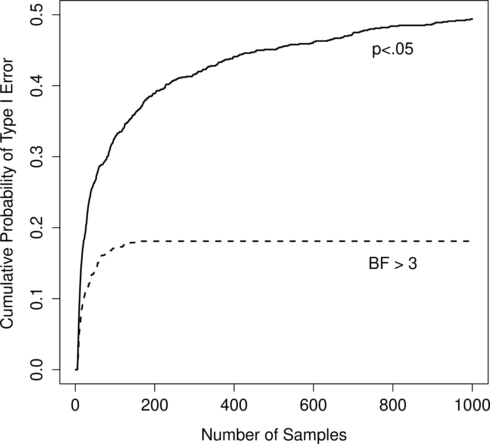
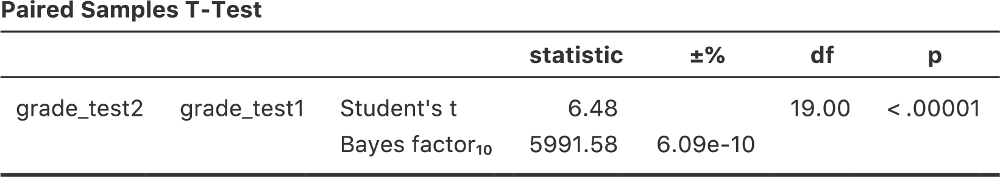

# (PART) 結び　もう1つの方法と展望 {-}

ベイズ統計  {#ch:bayes}
====================================

> われわれの事実に関する推論には，最高度の確実さをもつものから精神的明証のような確実さの低いのものまであり，その確信度合いはこの上なくさまざまである。それゆえ，賢者は自らの信念と証拠の間で釣り合いをとるのだ。\
>
> 　　　　　--- デイヴィッド・ヒューム^[http://en.wikiquote.org/wiki/David_Hume]


私が本書で説明してきた内容は，頻度主義の視点に立った推測統計です。このような立場から説明するのは私だけではありません。実際，心理学の学部生向けの教科書は，そのほぼすべてが頻度主義統計の考え方を*これこそ*が推測統計であり，真なる唯一の方法であるとして紹介しています。本書がこのような形で説明しているのは実際上の理由からです。頻度主義統計は，20世紀のほぼすべての期間に渡って統計学という学問領域で支配的な位置を占めてきました。その傾向は，応用科学者の間ではさらに強く見られます。心理学者の間では，これまでも，そして現在も，頻度主義の手法が使用されています。頻度主義の手法は科学論文のいたるところで用いられているため，学生たちはこれらの手法について理解しておく必要があります。そうでないと，それらの論文に書かれている内容が理解できないからです。ただ，少なくとも私の考えでは，残念ながら心理学の統計には見当違いのものも多く見られます。そしてその責任の一端は，頻度主義の手法に依存していることにあると考えます。本章では，私がなぜそう思うのかについて説明するとともに，ベイズ統計について取りあげようと思います。私の考えでは，ベイズ統計は全般的に従来型の方法よりも優れていると思うからです。

本章は2つの部分からなります。セクション\@ref(sec:basicbayes)から\@ref(sec:whybayes)では，ベイズ統計の基本となる数学的規則から，なぜ私がベイズ流のアプローチを便利だと思うのかまで，ベイズ統計とは何なのかということについて説明します。その後は，ベイズ統計版の\(t\)検定について簡単に概観します（セクション\@ref(sec:ttestbf)）。

合理的行為者による確率推論 {#sec:basicbayes}
----------------------------------------------------------------

ベイズ流の視点では，統計的推論は*信念の更新*がすべてです。たとえば，私の元に世界に関する一連の仮説（\(h\)）があるとします。私にはその仮説のうちどれが真実かはわかりませんが，私はどの仮説に説得力があり，どれがそうでないかという信念を持っています。そしてデータ（\(d\)）を観察した際に，私はこれらの信念を更新します。もしデータがいずれかの仮説に一致していれば，その仮説に対する私の信念が強められます。もしデータが仮説と一致していなければ，その仮説に対する私の信念は弱められます。これでおしまいです。ベイズ流の推論についてはこのセクションの終わりに詳しく説明しますが，まずは中心的な考え方を知ってもらうために単純な例を取りあげたいと思います。次の推論問題を考えてみてください。

> 私は傘を持っています。雨は降るでしょうか。

ここで，私は皆さんに1つのデータ（\(d =\)「私は傘を持っている」）を提示しています。そして「雨が降るかどうか」についての皆さんの信念ないしは仮説を尋ねているわけです。皆さんには，「今日は雨が降る」または「雨は降らない」という2つの選択肢（\(h\)）があります。さて，この問題はどうやって解決したらよいのでしょうか。

### 事前確率 --- 観測前の信念 ---

まず，私が傘について話したことはいったん忘れてください。そして皆さんが持っている，雨が降ると思うかどうかについての信念を書き出してみることにします。これはとても大事なことです。新たな証拠（データ）が与えられたときに信念がどのように更新されるのかということを知りたいのなら，データが与えられる前に信じていたことを明確にする必要があるからです。さて，皆さんは今日は雨が降ると思ったでしょうか。それとも降らないと思ったでしょうか。おそらく皆さんは私がオーストラリアに住んでいるということを知っていて，そしてオーストラリアの大部分は暑くて乾燥したところだということも知っているでしょう。私が住んでいるアデレードの町は地中海気候で，南カリフォルニアや南ヨーロッパ，北アフリカよく似た気候です。私がこの原稿を書いているのは1月で，ということは今は真夏だということになります。もしかしたら，アデレードの気候についてWikipedia^[http://en.wikipedia.org/wiki/Climate_of_Adelaide]で調べた人もいるかもしれませんね。すると，アデレードの1月の平均降雨日は4.5日程度だということがわかります。これ以外の情報はないとすると，1月のアデレードで雨が降る日の確率は約15%（\(4.5\div 31 = 0.145...\)）ということになり，そして雨が降らない日の確率は85%となります。もしこれがアデレードの雨について皆さんが考えていることだとすると（皆さんはきっとそう思っているはずです），私が先ほど述べたものは皆さんの<span class="keyterm">事前分布</span>（prior distribution）ということになります。そしてこれは\(P(h)\)と表されます。

```{r, warning=FALSE, echo=FALSE, message=FALSE}
library(knitr)
library(kableExtra)

dt<- matrix(c(
'雨が降る',0.15,'雨が降らない',0.85
), ncol=2, byrow=T)

dtf<-as.data.frame(dt)
colnames(dtf)<-c('仮説','確信度')

kable(dtf, align = c('l','c','c','c','c','c')) %>%
  kable_styling(bootstrap_options = "striped", full_width = F)
```

### 尤度 --- データについての理論 ---

この推論問題を解くためには，私の行動に関する理論も必要です。ダニーはいつ傘を持ち歩くのでしょうか。皆さんは，私が底抜けの間抜けではなく^[たしかにそうだという根拠はありませんが，ここではそういうことにしておきましょう。いいですね。]，雨の日にだけ傘を持ち歩くだろうと考えたとします。一方で，皆さんは私に小さな子供がいることを知っています。とすれば，私がこの種のことをすぐ忘れてしまうと聞いても大して驚かないでしょう。たとえば，雨が降る日に私が傘を忘れずに持って出かける確率が30%だとしましょう（私は本当にこういうのが苦手なのです）。ですが，雨が降らない日に私が傘をもって出かける確率は5%程度しかないとします。さて，ここまでの情報を表にまとめると次のようになります。

```{r, warning=FALSE, echo=FALSE, message=FALSE}
library(knitr)
library(kableExtra)

dt<- matrix(c(
'雨が降る','0.30','0.70','雨が降らない',0.05,0.95
), ncol=3, byrow=T)

dtf<-as.data.frame(dt)
colnames(dtf)<-c('仮説','傘を持っている','傘を持っていない')

kable(dtf, align = c('l','c','c','c','c','c')) %>%
  kable_styling(bootstrap_options = "striped", full_width = F) %>%
  add_header_above(c('','データ'=2))
```

この表の各セルは，どのデータ（\(d\)）が観察されるかについての皆さんの信念，それも各仮説\(h\)に関する真実が*与えられた*状態での皆さんの信念を説明するものであるということを覚えておいてください。これは「条件つき確率（conditional probability）」と呼ばれるもので，\(P(d|h)\)と表されます。これは「\(h\)が与えられたときの\(d\)の確率」と読みます。ベイズ統計ではこれを「仮説（\(h\)）が与えられた場合のデータ（\(d\)）の<span class="keyterm"><ruby>尤度<rt>ゆうど</rt></ruby></span>（likelihood）」と呼びます^[えっと，この話を持ち出すのは好きではないのですが，統計学者の中には私がここで「尤度」という言葉を使うことに反対する人もいます。じつは，「尤度」というのは頻度主義統計では特定の意味を持つ用語で，それがベイズ統計での意味とやや異なっているのです。私の知る限り，ベイズ統計では元々この尤度に関する明確な呼び名がなかったため，頻度主義の用語を拝借して使用するのが一般的な方法となりました。ところが，ベイズ主義者の尤度という用語の使い方が頻度主義者のものとまったく違うものになってしまったことから問題がややこしくなったのです。ここで長々と歴史の講釈をたれるつもりはありませんが，非常に大雑把に言えば，ベイズ主義者が「尤度関数（likelihood function）」という場合には，普通はこの表の1つの行を指します。これに対し，頻度主義者が尤度関数と言う場合には，同じ表の1つの「列」を指すことがほとんどなのです。こうした区別はいくつかの場面においては問題になるのですが，今ここでは重要ではありません。]。

### データと仮説の同時確率

ここまでで要素はすべて出そろいました。事前確率と尤度を書き出したことで，ベイズ推論に必要なすべての情報が手に入ったのです。ここからは，この情報を*どうやって*使うかが問題となります。結論を言えば非常に単純な式があってそれを利用すれば済むことなののですが，大事なのはなぜその式を使うのかを理解することですので，ここでは非常に基本的な考え方から順番に組み立てていこうと思います。

まずは確率論の規則の1つから始めましょう。以前に表\@ref(tab:probrules)でも一覧で示したのですが，そこでは対して強調しませんでしたし，おそらく皆さんは気にもとめなかったでしょう。ここで問題になっているのは，*2つ*の事柄が真である確率について話す場合の規則です。この例の場合，今日雨が降り（すなわち\(h\)が真である）<u>かつ</u>私が傘を持っている（すなわち\(d\)が観察される）確率を計算したいはずです。これは仮説とデータの<span class="keyterm">同時確率</span>（joint probability）と呼ばれ，これは\(P(d,h)\)と書かれます。そしてこの同時確率は，事前確率（\(P(h)\)）に尤度（\(P(d|h)\)）を掛けることで求められます。これを数学的に表現すると次のようになります。

$$
P(d,h) = P(d|h) P(h)
$$

では，今日雨が降り*かつ*私が傘を忘れずに持って出かける確率はいくつになるでしょうか。すでに論じたように，事前確率において雨が降る確率は15%です。そして尤度では私が雨の日に傘を忘れず持って出かける確率は30%です。つまり，この両方が真である確率を知りたければ，この2つを掛け算すればよいのです。

$$
\begin{aligned}
P(雨, 傘) & =  P(傘 | 雨) \times P(雨) \\
& =  0.30 \times 0.15 \\
& =  0.045
\end{aligned}
$$

つまり，実際に結果がどうだったかについての情報が与えられる前の時点では，皆さんは今日雨が降り，そして私が傘を持って出かける確率は4.5%だと考えていることになります。ただ，ここで結果として生じる可能性のある組み合わせは*4つ*ありますよね。ということで，その4つすべてについて同様の方法で確率を求めてみましょう。そうすると，次のような表ができあがります。

```{r, warning=FALSE, echo=FALSE, message=FALSE}
library(knitr)
library(kableExtra)

dt<- matrix(c(
'雨が降る','0.0450','0.1050','雨が降らない',0.0425,0.8075
), ncol=3, byrow=T)

dtf<-as.data.frame(dt)
colnames(dtf)<-c('仮説','傘を持っている','傘を持っていない')

kable(dtf, align = c('l','c','c','c','c','c')) %>%
  kable_styling(bootstrap_options = "striped", full_width = F) 
```

4つの組み合わせのそれぞれがどの程度起こりうるかということについて，この表にはすべての情報が含まれています。ですが，全体像をつかむためにはここに行の合計と列の合計を加えるのがよいでしょう。すると表はこうなります。

```{r, warning=FALSE, echo=FALSE, message=FALSE}
library(knitr)
library(kableExtra)

dt<- matrix(c(
'雨が降る','0.0450','0.1050','0.15','雨が降らない',0.0425,0.8075,0.85,'計','0.0875','0.9125',1
), ncol=4, byrow=T)

dtf<-as.data.frame(dt)
colnames(dtf)<-c('仮説','傘を持っている','傘を持っていない','計')

kable(dtf, align = c('l','c','c','c','c','c')) %>%
  kable_styling(bootstrap_options = "striped", full_width = F) 
```

これはとても重要な表ですので，これらの数字が何を意味しているのかについて少し考えてみることにします。まず，行の合計の部分は何も新しいことを言っていないということに注意してください。たとえば最初の行は，傘の問題を無視した場合，今日が雨である確率は15%だということを言っています。これは意外でもなんでもありません。なぜならこれは私たちの事前確率だからです^[念のため書いておきますが，「事前確率」を構成するのはもともとあった知識や信念であり，その情報を改善するためのいかなるデータも集める前のものです。]。ここで重要なのはその数字ではありません。大事なのは，これによって私たちの計算が意味をなすものであるという自信が持てるということです。さて，今度は列の合計を見てください。すると，そこには私たちが明示的には言っていないことが書かれています。行の合計から雨の日である確率がわかるように，列の合計からは私が傘を持って出かける確率がわかるのです。具体的に言うと，最初の列の数字からは私が傘を持っている確率が平均して（つまり雨の日かどうかを無視した場合に）8.75%であるということになります。最後に，この表に含まれる論理的にあり得る4つの組み合わせで数値を合計をすると1になるという点にも注意してください。つまり，この表に含まれている数値は，データと仮説の組み合わせすべてについて定義された確率分布なのです。

さて，この表はとても役立つものなので，これらの要素が何に対応していて，そしてどのように表記されるかということを明白にしておきたいと思います。

```{r, warning=FALSE, echo=FALSE, message=FALSE}
library(knitr)
library(kableExtra)

dt<- matrix(c(
'雨が降る','\\(P\\)(傘,雨)','\\(P\\)(傘なし,雨)','\\(P\\)(雨)',
'雨が降らない','\\(P\\)(傘,雨なし)','\\(P\\)(傘なし,雨なし)','\\(P\\)(雨なし)',
'','\\(P\\)(傘)','\\(P\\)(傘なし)',''
), ncol=4, byrow=T)

dtf<-as.data.frame(dt)
colnames(dtf)<-c('','傘を持っている','傘を持っていない','')

kable(dtf, align = c('l','c','c','c','c','c')) %>%
  kable_styling(bootstrap_options = "striped", full_width = F) 
```

最後に，「適切な」統計表記を使うことにしましょう。雨の日問題では，データは私が傘を持っているかどうかということについての観測値に対応します。そこで，私が傘を持っている確率を\(d_1\)，私が傘を持っていない確率を\(d_2\)と表します。同様に，\(h_1\)は今日は雨が降るという仮説，\(h_2\)は雨が降らないという仮説を意味します。この表記を使うと，表は次のようになります。

```{r, warning=FALSE, echo=FALSE, message=FALSE}
library(knitr)
library(kableExtra)

dt<- matrix(c(
'\\(h_1\\)','\\(P(h_1,d_1)\\)','\\(P(h_1,d_2)\\)','\\(P(h_1)\\)',
'\\(h_2\\)','\\(P(h_2,d_1)\\)','\\(P(h_2,d_2)\\)','\\(P(h_2)\\)',
'','\\(P(d_1)\\)','\\(P(d_2)\\)',''
), ncol=4, byrow=T)

dtf<-as.data.frame(dt)
colnames(dtf)<-c('','\\(d_1\\)','\\(d_2\\)','')

kable(dtf, align = c('l','c','c','c','c','c')) %>%
  kable_styling(bootstrap_options = "striped", full_width = F) 
```

### ベイズの定理による信念の更新

先ほどのセクションで作成した表は，雨の日問題を解決するための非常にパワフルなツールです。なぜなら，この表では4つの論理的可能性がすべて考慮されていて，何らかのデータが与えられる前の状態で，その4つの可能性のそれぞれについて皆さんがどの程度の確信を持っていたかが示されているからです。さてここからは，実際にデータを与えられた後に私たちの信念がどうなるかについて考えてみましょう。雨の日問題では，私は「私は傘を*持っています*」と皆さんに言いました。これはある意味驚きの出来事です。私たちの表によれば，私が傘を持って出かける確率はわずか8.75%しかありません。ですが，つじつまは合いますよね。暑く乾燥した都市で，ある人物が傘を持っているというのは極めて珍しいことで，皆さんはそんなことがあるとは予測していなかったはずだからです。ただし，データはそれが真実であると語っています。いくらそれがあり得ないことのように思えても，今ではもう皆さんは「私が傘を持っている」ということを*知っている*わけですから，そうすると皆さんはその事実に合わせて自分の信念を調整しなくてはなりません^[もうちょっと厳密にやろうとすれば，ここに私が傘について嘘をついている確率を採り入れて表を拡張することもできたかもしれません。ですが，ここでは問題を単純にしておきましょう。]。この新しい知識に対応した*改訂版*の表は次のようになります。

```{r, warning=FALSE, echo=FALSE, message=FALSE}
library(knitr)
library(kableExtra)

dt<- matrix(c(
'雨が降る','','0','雨が降らない','','0','計','1','0'
), ncol=3, byrow=T)

dtf<-as.data.frame(dt)
colnames(dtf)<-c('仮説','傘を持っている','傘を持っていない')

kable(dtf, align = c('l','c','c','c','c','c')) %>%
  kable_styling(bootstrap_options = "striped", full_width = F) 
```

つまり，私たちが得た事実から「傘を持っていない」という可能性は排除されるので，私が傘を持っていないことを意味するセルはすべて0にならなければなりません。また，皆さんは私が傘を持っているという事実を知っているわけですから，\(P(傘)=1\)という事実を正確に記述するために，表の左側の列の合計は1でなければなりません。

では，空っぽのセルにはどのような数値を入れるべきでしょうか。ここでも，まずは数学のことは忘れて直感に頼りましょう。私たちが最初にこの表を作成したとき，この2つのセルはほぼ同じ数字でしたよね。「雨と傘」の同時確率は4.5%で，「雨なしと傘」の同時確率は4.25%でした。つまり，「私が傘を持っている」という情報を得る前には，この2つの出来事は確率的にほぼ同じだと皆さんは答えたはずです。違いますか。なお，この2つは*どちらも*「私が傘を持っている」という事実に一致しています。ということは，これら2つの可能性から見た場合，ほとんど何も変わっていないと言うことになります。「この2つの可能性はどちらも同程度に確からしい」というのは*依然として*真実なわけです。納得していただけたでしょうか。私たちが最終版の表に期待するものは，「雨なしと傘」よりも*わずかに*「雨と傘」の方が可能性が高いという事実に違反しないような数値で，かつ，数値全体の合計が1になるようなものです。すると，こんな感じになるでしょうか。

```{r, warning=FALSE, echo=FALSE, message=FALSE}
library(knitr)
library(kableExtra)

dt<- matrix(c(
'雨が降る','0.514','0','雨が降らない','0.486','0','計','1','0'
), ncol=3, byrow=T)

dtf<-as.data.frame(dt)
colnames(dtf)<-c('仮説','傘を持っている','傘を持っていない')

kable(dtf, align = c('l','c','c','c','c','c')) %>%
  kable_styling(bootstrap_options = "striped", full_width = F) 
```

この表から言えるのは，「私が傘を持っている」という情報が与えられた後では，皆さんは今日雨が降る可能性は51.4%であると考え，そうでない可能性は48.6%だと考えているということです。そしてこれがこの雨の日問題に対する答えです。「私が傘を持っている」ことがわかった場合の今日が雨である確率は<span class="keyterm">事後確率</span>（posterior probability）と呼ばれ，これは\(P(h|d)\)と表されます。そして，この場合の\(P(h|d)\)は51.4%です。

さて，この数字はどうやって計算したのでしょうか。多分想像がついたことでしょう。「雨」の確率が0.514であるということを知るために私がしたことは，「雨と傘」の確率である0.045を「傘」の確率0.0875で割るというものです。こうすることによって，すべてを合計すると1になるという条件を満たし，実際のデータに一致する2つの事象間の相対的な確からしさのバランスを損なわないという条件を満たした表ができあがります。これを統計専門用語を使って表現すれば，私がここでしたことは，仮説とデータの同時確率（\(P(d,h)\)）をデータ（\(P(d)\)）の<span class="keyterm">周辺確率</span>（marginal probability）で割ったということです。そしてこれによって得られた値は，観測データが*与えられた*後の仮説の事後確率となります。これを式にすると次のようになります^[この式が実際には前のセクションの最初にあげた原則の言い換えであるということに気づいた人もいるかもしれません。もし式の両方を\(P(d)\)倍すれば，\(P(d) P(h| d) = P(d,h)\)となるからです。これは同時確率を計算する場合の式ですね。つまり，これは「新しい」ルールを導入するものではなく，単に同じルールを違う形で使用しただけなのです。]。

$$
P(h | d) = \frac{P(d,h)}{P(d)}
$$

ここで，先ほどのセクションで冒頭に私が言ったことを思いだしてください。つまり，同時確率\(P(d,h)\)は事前確率\(P(h)\)に尤度\(P(d|h)\)を掛けたものです。現実の場面で実際に私たちにわかっているのは事前確率と尤度ですから，これを式に置き換えましょう。すると，事後確率は次の式で与えられます。

$$
P(h | d) = \frac{P(d|h) P(h)}{P(d)}
$$

そしてこの式こそが， <span class="keyterm">ベイズの定理</span>（Bayes' rule）として知られるものなのです。これは，さまざまな仮説の確からしさに対する学習者の当初の信念が，データに直面した後にどのように改訂されるのかということを説明する式です。ベイズ統計のパラダイムでは，すべての統計的推論がこの単純な1つの定理を元にしているのです。

ベイズ統計における仮説検定 {#sec:bayesianhypothesistests}
-------------------------------------------------------------

第\@ref(ch:hypothesistesting)章では，仮説検定について従来型のアプローチから説明しました。そこでは1章まるまるを説明にあてています。なぜなら，帰無仮説検定は非常に複雑な仕組みで，多くの人が理解に苦しむからです。これとは対照的に，ベイズ統計のアプローチでは仮説検定も恐ろしく単純です。従来型の仮説検定のシナリオとよく似た場面を1つ例に挙げましょう。そこには比較したい2つの仮説があります。それは帰無仮説（\(h_0\)）と対立仮説（\(h_1\)）です。実験を始める前，私たちはどちらの仮説が真実かということについて何らかの信念（\(P(h)\)）を持っています。そして実験を行ってデータ（\(d\)）を得ました。頻度主義統計と違い，ベイズ統計では帰無仮説が真である確率について話すことができます。さらに，ベイズ統計ではベイズの定理を使用して<span class="keyterm">帰無仮説の事後確率</span>を計算することもできます。

$$
P(h_0 | d) = \frac{P(d|h_0) P(h_0)}{P(d)}
$$

この式は，データ（\(d\)）を得た後に私たちの帰無仮説に対する信念がどうなったかをズバリ教えてくれるものです。対立仮説に対する信念についても同じ式で計算することができます。添え字を変えてやるだけです。

$$
P(h_1 | d) = \frac{P(d|h_1) P(h_1)}{P(d)}
$$

あまりに単純なので，この式をわざわざ書くのが馬鹿みたいです。じつを言えば，私は先ほどのセクションに書いたベイズの定理をコピペして済ませています^[もちろん，これはかなり単純化して話しています。実際のベイズ統計における仮説検定の複雑さは，仮説（\(h\)）が複雑で曖昧な場合の尤度（\(P(d|h)\)）をどう計算するのかという形で現れます。本書ではそうした複雑さについては説明しませんが，いまのところ，こうした単純さは真実であると強調しておきます。現実は統計の入門書で扱えるような単純なものではありません。]。

### ベイズ因子

実際の場面では，ベイズ統計を使うデータ分析家は\(P(h_0|d)\)や\(P(h_1|d)\)といった生の事後確率について話をすることはあまりありません。その代わり，<span class="keyterm">事後オッズ比</span>（posterior odds ratio）を使います。これは賭け事のようなものだと考えてください。たとえば，帰無仮説の事後確率が25%で，対立仮説の事後仮説が75%だったとしましょう。対立仮説は帰無仮説の3倍の確率です。このようなとき，私たちは「対立仮説が支持される*オッズ*は3:1である」といいます。事後オッズの計算方法は，数学的には1つの事後確率をもう一方で割るだけです。

$$
\frac{P(h_1 | d)}{P(h_0 | d)} = \frac{0.75}{0.25} = 3
$$

これを先ほど示した帰無仮説と対立仮説の事後確率の式を用いて書き直すとこうなります。

$$
\frac{P(h_1 | d)}{P(h_0 | d)} = \frac{P(d|h_1)}{P(d|h_0)} \times \frac{P(h_1)}{P(h_0)}
$$

式をこのように展開したのには意味があります。この式は，皆さんが知っておくべき非常に重要な3つの要素で構成されているからです。式の左は事後オッズで，これはデータが与えられた*後*の帰無仮説と対立仮説の相対的な確からしさについての信念を表しています。式の一番右にあるのは<span class="keyterm">事前オッズ</span>（prior odds）です。これはデータを見る*前*の信念を表しています。真ん中にあるのは<span class="keyterm">ベイズ因子</span>（Bayes factor）です。これは，データが提供する証拠の強さを表しています。

$$
\begin{array}{ccccc}\displaystyle
\frac{P(h_1 | d)}{P(h_0 | d)} &=& \displaystyle\frac{P(d|h_1)}{P(d|h_0)} &\times& \displaystyle\frac{P(h_1)}{P(h_0)}\\
\uparrow && \uparrow && \uparrow \\
\mbox{事後オッズ} && \color{#008080}{\mbox{ベイズ因子}} && \mbox{事前オッズ}
\end{array}
$$

ベイズ因子（<span class="keyterm">BF</span>と省略されることもあります）は，ベイズ統計の仮説検定において特別な役割を担っています。これは，従来型の仮説検定における\(p\)値と似た機能を提供するのです。ベイズ因子はデータがもつ証拠の強度を数量化したものなので，ベイズ統計で仮説検定を行った場合にはこのベイズ因子が報告されます。事後オッズでなくベイズ因子を報告するのは，研究者ごとに事前オッズが異なっているからです。研究者の中には帰無仮説が真であると強く考えていた人もいるかもしれませんし，帰無仮説は誤りであると強く考えていた人もいるかもしれません。ですから，結果を報告する場合にはベイズ因子を用いた方がよいのです。そうすれば，論文を読んでいる人は誰でも，自分自身の*個人的な*事前オッズとベイズ因子を掛け合わせることで，どのような事後オッズになるかを見てみることができます。なお，いずれの場合も，慣習的には帰無仮説と対立仮説の確からしさが同じであるかのような形がとられます。つまり，事前オッズを1とするのです。そしてその場合，事後オッズはベイズ因子と同じ値になります。

### ベイズ因子の解釈

ベイズ因子の非常に嬉しいところは，その数字が本質的に意味を持つということです。実験をしてベイズ因子を計算したら4になったという場合，それはデータによって提供される証拠が4:1のオッズで対立仮説を支持しているということと対応します。
 なお，この数値がどれくらいであれば科学の研究において意味があると言えるのかという基準を定めようとする試みもいくつかなされています。その中でもっとも広く使われているのは[]()@Jeffreys1961[]()と[]()@Kass1995[]()の2つです。私はこの2つでは[]()@Kass1995[]()の方がよいと思います。なぜなら，こちらの方がやや厳しめだからです。その基準は以下のようなものです。

```{r, warning=FALSE, echo=FALSE, message=FALSE}
library(knitr)
library(kableExtra)

dt<- matrix(c(
'1 - 3','取るに足りない証拠','3 - 20','肯定的な証拠','20 - 150','強い証拠','>150','非常に強い証拠'
), ncol=2, byrow=T)

dtf<-as.data.frame(dt)
colnames(dtf)<-c('ベイズ因子','　解釈')

kable(dtf, align = c('c','l','c','c','c','c')) %>%
  kable_styling(bootstrap_options = "striped", full_width = F) 
```

正直なところ，私は[]()@Kass1995[]()の基準でもかなり甘いと思います。もし私がこれを決められる立場にいたとすれば，「肯定的な証拠」の部分は「弱い証拠」としたでしょう。私にとっては3:1から20:1の範囲は「弱い」証拠，最大でも「あまり大きくない」証拠です。ただ，これについて明確な決まりはありません。いくつなら強い証拠でいくつなら弱い証拠かは，あなたがどれだけ判断に慎重であるか，あなたの属するコミュニティーがどのような基準でその結果を「真」であると判断しているかによってまったく異なります。

ただ，上にあげた数字はどれも，ベイズ因子が1より大きければ意味がある（つまり証拠が対立仮説を支持している）ということにはなります。なお，ベイズ流のアプローチが従来型アプローチよりも実用上優れている点として，帰無仮説の確からしさを数量化できるということがあります。その場合，ベイズ因子は1より小さくなります。なお，1より小さいベイズ因子を報告することもできますが，正直なところ紛らわしいのでそれはやめた方がよいでしょう。たとえば，帰無仮説の元でのデータの尤度\(P(d|h_0)\)が0.2で，対立仮説の元での尤度\(P(d|h_0)\)が0.1だったとしましょう。上の式を使うと，ベイズ因子は次のようになります。

$$
\mbox{BF} = \frac{P(d|h_1)}{P(d|h_0)} = \frac{0.1}{0.2} = 0.5
$$

文字通り読めば，これは証拠が対立仮説を支持する程度は0.5:1ということです。ですが，これは理解しづらいですよね。この場合には，式を「上下逆さま」にして，*帰無仮説*を支持する証拠の強さを報告した方がわかりやすいと思います。つまり，次の値を計算するのです。

$$
\mbox{BF}^\prime = \frac{P(d|h_0)}{P(d|h_1)} = \frac{0.2}{0.1} = 2
$$

そして，報告する場合には，帰無仮説を支持するベイズ因子が2:1であったとします。こちらの方がずっと理解しやすいですし，それに先ほどの表を使って解釈することもできます。

なぜベイズ統計か {#sec:whybayes}
--------------------------------------

ここまで，私はベイズ統計の基礎にある考え方だけに注目してきました。「確信の度合いとしての確率」という考え方について話し，そしてそれが合理的な行為者（エージェント）による世界についての推論にとってどのような意味を持つのかというところを説明してきました。ここで皆さんが考える必要があるのが，*自分*はどちらの統計を選択するのかということです。従来型の統計を用い，標本分布を頼りに\(p\)値を使って結果の判断をしたいのか。それともベイズ主義者になって，事前信念やベイズ因子，合理的信念の更新ルールのようなものを使うのか。正直なところ，私が皆さんに代わってこの問いに答えることはできません。最終的には，これは皆さんがどう考えるか次第だからです。これは皆さんの問題であり，皆さん自身の問題だからです。とはいえ，「私」がなぜベイズ流のアプローチを好むのかということであれば，ちょっとばかり話すことができます。

### 統計値が考える通りの意味になる

> さっきから何度もその言葉使ってるけどな， お前，その言葉の意味を誤解していると思うぞ。\
>
> 　　　　　--- イニーゴ・モントーヤ　『プリンセス・ブライド・ストーリー^[http://www.imdb.com/title/tt0093779/quotes]』より 

念のために言っておきますが，頻度主義の手法にケチをつけるためにこの台詞を使ったのは私が最初ではありません。最初にこの台詞を引用したのはリッチ・モーリーらです。私が臆面もなくそれを盗んだのは，この台詞があまりにもここでの内容にふさわしく，そして『プリンセス・ブライド・ストーリー』から引用する機会は逃したくなかったからです。

私にとってのベイズ流アプローチの最大の利点は，それが正しい問いに答えてくれるということです。ベイズ統計の枠組みでは，「仮説が真である確率」について言及することができ，そしてそれが完全に意味をなします。その確率を計算することすらできます。究極的には，これこそあなたが統計検定で知りたいことではないでしょうか。私たち人間にとって，統計を使う核心部分はここにあるのではないかと思います。つまり，何が真実で何がそうでないのかを判断したいということです。そして何が真実であるかはっきりわからないとき，皆さんは確率論の言葉を使って「理論Aが正しい確率は80％だが，理論Bが正しい確率は20％だ」のように言うはずです。

これは人間にとってはあまりに自然で明白なことなのですが，従来型の統計法の枠組みではこれが明確に禁じられています。頻度主義者にとって，そのような説明は意味のないことなのです。なぜなら，「理論が真」であることは繰り返し可能な事象ではないからです。理論は真か偽かのいずれかしかなく，それに対して確率的な説明はできません。どんなにあなたがそうしたくてもです。セクション\@ref(sec:pvalue)で\(p\)値を帰無仮説が正しい確率だと解釈しないようにと私が繰り返し警告したのには理由があります。ほぼすべての統計教科書でこの警告を繰り返さざるを得ない理由があるのです。それは，みんなそれが正しい解釈だと*思いたい*からです。頻度主義者の教義がどうであれ，ずっと学部生を教えてきて，そして日常的にデータ分析を行ってきた経験からすると，実際の大部分の人にとっては「仮説が真である確率」というのは単に意味があるだけというだけに収まらず，それがもっとも重要ですらあるのです。こうした考え方はあまりにも魅力的なので，訓練を受けた統計学者でさえ\(p\)値を間違って解釈してしまったりします。たとえば，以下は調査会社Newspollの2013年版公式レポートからの引用です。これは（頻度主義）データ分析の解釈方法についての説明です^[http://about.abc.net.au/reports-publications/appreciation-survey-summary-report-2013/]。

> 報告書全体を通じ，関連する場所では統計的に有意な変化が見られた箇所に印をつけた。すべての有意性検定は95%の信頼水準に基づいて行われている。**つまり，その変化が統計的に有意であったという場合，それは95%の確率で実際に変化しているということであり**，それが単なる偶然の変動ではないということである。（強調は著者による）

違います。\(p<.05\)はそういう意味では*ありません*。頻度主義統計における「95%の信頼水準」はそのような意味ではありません。太字の部分は完全に間違いです。従来型の方法では，「95％の確率で実際に変化が生じた」とは語れません。なぜなら，これは頻度主義の考え方で確率をあてはめて話をできるような種類の事象ではないからです。頻度主義的イデオロギーを持つ人にとって，この文は意味をなしません。より実用主義的な頻度主義者であったとしても，やはりこれは\(p\)値の定義としては間違っています。従来型の統計ツールを使用するのであれば，これは許されないことだし，間違いでもあるのです。

一方で，あなたがベイズ主義者だったとしましょう。太字部分は\(p\)値の定義としては正しくありませんが，これはベイズ統計で対立仮説の事後確率が95％より大きいというのとほぼ同じことです。つまりはこういうことなのです。実際にあなたが報告したいものがベイズ統計の事後確率だったとして，だったらなぜ従来型の統計を使用しようとするのでしょうか。ベイズ流の主張をしたいなら，ベイズ主義者になってベイズ統計のツールを使えばいいじゃないですか。

私自身の考えでは，これはベイズ統計に切り替えるべき理由としてもっとも説得力のあるものだと思います。一度飛び移ってしまえば，もう非直感的な\(p\)値の定義で頭を悩ます必要はなくなります。なぜ「真の平均値がこの範囲にあることは95％確かである」と言ってはいけないのかということを頑張って覚えておく必要はありません。あなたがすべきことは，研究を行う前に自分が何をどう信じていたかということに正直になり，そして研究によって学んだことを報告するだけです。どうですか。素晴らしいと思いませんか。この点は，私がベイズ流アプローチに大きく期待している部分です。自分が本当にやりたい分析をして，そしてデータが語っているのはこういうことだと，自分が本当に考えていることをそのまま表現すればよいのです。

### 信じることのできる証拠基準

> \(p\)が.02より下であれば，*帰無仮説*が事実全体を説明できていないということが強く示唆される。.05という値で線を引き，それより小さな\(p\)値が事実との不一致を示すと考えておけば，私たちはまず誤りを犯すことはない。\
>
　　　　　--- サー・ロナルド・フィッシャー[@Fisher1925]

これは従来型統計アプローチの創設者の1人，サー・ロナルド・フィッシャーによる言葉の引用です。\(p\)値が持つ機能について意見を述べるうえで，フィッシャー以上の適格者はいないでしょう。この一節は古典的な手引き書，『Statistical Methods for Research Workers（日本語版タイトル：『[研究者のための統計的方法](https://www.morikita.co.jp/books/book/2641)』）』からとられたもので，フィッシャーは\(p<.05\)で帰無仮説を棄却することの意味をかなり明確に述べています。彼によれば，\(p<.05\)の場合に「真の効果がある」と考えておけば，「まず誤りを犯すことはない」のです。これは何も特別な考え方ではありあません。私の経験では，多くの実務家がフィッシャーと同じような考え方を表明しています。要するに，慣習的な\(p<.05\)という基準はかなり厳格な証拠基準であると考えられているのです。

さて，それはどの程度真実なのでしょうか。この問題にアプローチする1つの方法は，\(p\)値をベイズ因子に変換し，2つを比べてみることです。これは簡単ではありません。なぜなら\(p\)値とベイズ因子は根本的に計算方法が違いますし，同じものを測定しているわけではないからです。しかし，この2つの関係を調べようとする試みはいくつかなされており，その結果はいくらか意外なものです。たとえば，[]()@Johnson2013[]()では非常に説得力のある例が提示されています。そこでは，（少なくとも\(t\)検定においては）\(p<.05\)という基準はベイズ因子ではおおまかに3:1から5:1で対立仮説を支持するのと同等だとされています。もしこれが正しいなら，フィッシャーの主張はちょっとばかり拡大解釈ということになります。半分の場合で帰無仮説が真であるという場合を考えてみましょう（つまり\(H_0\)の事前確率が0.5）。そして帰無仮説が\(p<.05\)で棄却されたという事実が与えられたとき，これらの数字を使って帰無仮説の事後確率を求めてみます。@Johnson2013[]()のデータを使用すると，帰無仮説を\(p<.05\)で棄却した場合，正しい判断がなされるのはそのうちの80%ということになります。あなたがどう思うかはわかりませんが，間違っている可能性が20%もある証拠基準というのは，私には十分だとは思えません。フィッシャーの主張に反し，\(p<.05\)で棄却した場合にはたびたび判断を誤ることになってしまうのです。つまり，これはそれほど厳格な証拠基準にはならないのです。

### \(p\)値は嘘である

> ケーキなんてウソさ\
> ケーキなんてウソさ\
> ケーキなんてウソさ\
> ケーキなんてウソさ\
>
> 　　　　　-- 『ポータル^[http://knowyourmeme.com/memes/the-cake-is-a-lie]』

さて，ここまでのところで，問題はは従来型の統計法ではなくて\(p<.05\)という基準にあるのではないかと思った人もいるかもしれませんね。ある意味で，それはその通りです。[]()@Johnson2013[]()の結果から言えることは，「誰もが今すぐベイズ主義者になるべきだ」というようなものではありません。そうでなく，そこから示唆されることは，慣習的な基準を捨てて\(p<.01\)という基準を採用すべきだというものです。たしかにこうした視点も不合理ではないのですが，私の考えでは問題はそれよりずっと深いところにあります。私の考えでは，問題は（すべてではないものの）ほとんどの従来型仮説検定が構築されている方法にあります。それらは人が実際にどのような方法で研究しているかということに対してあまりに認識が甘く，だからほとんどの\(p\)値は間違いなのです。

馬鹿げた主張に聞こえますよね。ですが，次のシナリオを考えてみてください。あなたは非常に素晴らしい研究仮説を思いつき，それを検定するための研究をデザインしました。あなたはとても熱心な研究者で，どれくらいの標本サイズが必要かを検定力分析で確かめたうえで研究を実施しました。データを集め，仮説検定を行った結果，\(p\)値は0.072でした。何ともムカつきますよね。

さてどうしたものでしょうか。可能性として考えられるのは以下の選択肢です。

1.  効果なしという結論で結果を報告する。

2.  もしかしたら効果があるかもしれないと考え，「有意傾向」として報告する。

3.  あきらめて別の研究を始める。

4.  もう少しデータを集め，\(p\)値が増加するか，（望むべくは）「魔法の」基準値\(p<.05\)を下回るかを見てみる。

あなたならどれを選びますか。この先を読み進める前に，少し時間をとって考えてみてください。自分に正直になりましょう。ただし，あまり思い詰めないでください。どれを選んでもよい結果にはならないのですから。論文の著者，査読者，編集者としての私の経験から，そして私がこれまでに聞いたことのある話をを元にすれば，それぞれのケースは次のような結果になります。

-   まずは選択肢1です。有意差なしという結果で論文を投稿したとしましょう。するとその論文が掲載されることは非常に難しくなります。一部の査読者は，\(p=.072\)なら差がないとまでは言い切れないと考えるでしょう。そしてこれは有意傾向とすべきだと言います。別の査読者は，結果が有意でないということには同意しつつ，結果が有意でなくても掲載される論文はあるが，あなたの論文はそうでないと言うことでしょう。査読者のうち1人か2人はあなたの味方になってくれるかもしれませんが，あなたはかなり不利な状況で闘わなければなりません。

-   次に2つめの選択肢です。これを有意傾向として論文を投稿したとします。一部の査読者は，これは有意な結果ではないから掲載できないと言うでしょう。別の査読者は，証拠が曖昧なので，もっとデータを集めて結果をはっきりさせるべきだと言うでしょう。ここでもまた，論文掲載までの道のりはあなたにとって不利なものになります。

-   \(p=.072\)のような「曖昧な」結果での論文掲載は困難ですから，この研究をあきらめて別の研究を始めるという選択肢3は魅力的に見えるかもしれません。ですが，この選択肢ではあなたのキャリアが台無しになります。曖昧な結果が出るたびにそれをやめて別の新しいプロジェクトを始めていたら，あなたの研究成果が出版されることはないでしょう。学術界にいて論文の出版がなければあなたは職を失います。ですからこの選択肢もアウトです。

-   となると，選択肢4しかなさそうです。決定的な結果が得られていないので，もう少しデータを集めてから再分析を行うことにしました。これは賢明な判断のように思えます。ですが，もしこれをやったとしたら，あなたが得た\(p\)値は残念なことにすべて誤りということになってしまいます。*すべて*です。*この研究*で計算した\(p\)値だけではありません。*すべて*なのです。過去に計算した\(p\)値，そして今後計算するであろう\(p\)値も含めてすべてです。幸い，そのことに気づく人は誰もいないでしょう。なので論文は掲載されるでしょうが，でもあなたは嘘をつくことになってしまいます。

これはどういうことでしょう。なぜ嘘をついていることになるのでしょうか。これはすごく合理的な方法のように思えるのに。結果がはっきりしなければ，はっきりするまで追加でデータを集める。何が悪いのでしょう。

実際のところ，何も悪くはありません。合理的で賢明で，かつ納得の行く方法です。現実には，これはすべての研究者が行っていることでもあります。ただ残念なことに，私が第\@ref(ch:hypothesistesting)章で説明した帰無仮説検定の理論では，これは*禁じ手*なのです^[厳密に言うと，すべての従来型検定にこのような馬鹿げた前提があるわけではありません。<u>逐次分析</u>のためのツールというのもいくつかあって，それらは臨床試験などで時々用いられています。これらの方法は，データは得られ次第分析されるものであるという仮定に基づいているので，私がここで文句をつけている方法によって分析が破綻することはありません。ただし，逐次分析法は「標準的」な帰無仮説検定とはかなり異なった方法で構築されています。これらの手法は入門の教科書では扱われませんし，心理学の研究論文ではあまり使われていません。私がここで提起している懸念は，本書でここまでに紹介してきた従来型の検定すべてにあてはまるもので，私が読んできた論文で報告されているほぼすべての検定にあてはまるものです。]。なぜなら，これらの理論は実験が終了してすべてのデータがそろった状態を仮定しているからです。実験は終わっているものと仮定しているので，そこでは*2つ*の選択肢しか考慮されていません。あなたが従来型の\(p<.05\)の基準を用いるなら，その判断は次の通りになります。

```{r, warning=FALSE, echo=FALSE, message=FALSE}
library(knitr)
library(kableExtra)

dt<- matrix(c(
' \\(p\\)が.05未満','帰無仮説を棄却',' \\(p\\)が.05以上','帰無仮説を保持'
), ncol=2, byrow=T)

dtf<-as.data.frame(dt)
colnames(dtf)<-c('結果','判断')

kable(dtf, align = c('l','l','c','c','c','c')) %>%
  kable_styling(bootstrap_options = "striped", full_width = F) 
```

分析結果を見てデータを追加するというのは，ここに3つめの判断を加えるのと同じことです。具体的に言うと，それは実験や調査を続けることを正当化するために\(p\)値を用いていることになるのです。そしてその結果，あなたの意志決定手順は次のようなものに変わってしまっています。

```{r, warning=FALSE, echo=FALSE, message=FALSE}
library(knitr)
library(kableExtra)

dt<- matrix(c(
' \\(p\\)が.05未満','実験をやめて帰無仮説を棄却する', '\\(p\\)が.05から.1の間','実験を続ける',' \\(p\\)が.1より大','実験をやめて帰無仮説を保持する'
), ncol=2, byrow=T)

dtf<-as.data.frame(dt)
colnames(dtf)<-c('結果','判断')

kable(dtf, align = c('l','l','c','c','c','c')) %>%
  kable_styling(bootstrap_options = "striped", full_width = F) 
```

帰無仮説検定の「基本」理論は，この種の判断を扱うために構築されたものではありません。第\@ref(ch:hypothesistesting)章で説明した形ではこうした判断はできないのです。もしあなたが現実に「もっとデータを追加する」を選ぶような人であったとすると，それはあなたが帰無仮説検定のルールに則って判断していないということを意味します。結果的に仮説検定による判断と同じになったとしても，仮説検定の判断手順には従っていません。そしてこうして手続きに従わないということが問題を引き起こすのです^[関連する問題については[]()http://xkcd.com/1478/[]()を参照]。あなたが算出した\(p\)値は嘘です。

さらに悪いことに，その嘘はかなり危険なものです。なぜなら，それらはどれも実際より小さな値になるからです。これがどれだけ悪いことかという感覚的を持ってもらうために，次の（最悪の）シナリオを考えてみてください。あなたは超熱心な研究者で，厳しい予算の中でやりくりしているものの，先ほどの警告には注意を払っていないとしましょう。あなたは2つのグループを比較するという研究デザインを作成します。どうしても\(p<.05\)で有意な結果が欲しいのですが，必要以上のデータを集めたくはありません（それにはお金がかかるからです）。そこで経費削減のため，少量のデータを集めるところからスタートし，新しいデータが得られるたびに\(t\)検定を行ったとします。もし\(t\)検定の結果が\(p<.05\)であれば，そこで実験をやめて有意な結果を報告します。そうでなければデータ収集を継続します。そしてこれをあらかじめ設定された予算限度まで続けます。ここではその上限を\(N=1000\)としましょう。この実験では，結果として実際の効果はなかったとしましょう。つまり帰無仮説は真です。さて，この実験が終了した時点で，あなたが有意な効果はないという（正しい）結論に到達できる可能性はどれくらいでしょうか。理想の世界においては，その答えは95％です。結局のところ，\(p<.05\)という基準は第1種の誤り率を5%に抑えるためのものですから，この状況で帰無仮説が誤って棄却される確率は5%未満であるということになるはずです。ところが，それが真実である保証はないのです。なぜなら，あなたがルールを破っているからです。あなたは何度も検定を繰り返し，データを「のぞき見」しては結果が有意だったかどうかを確認しているので，そうした前提がまったくあてはまらなくなってしまっているのです。

これはどれくらい悪いことなのでしょうか。その答えを図\@ref(fig:type1)に実線で示しましたが，これは*驚くほど*悪いことなのです。もしあなたが1件データを得るたびに結果をのぞき見していたとすると，あなたが第1種の誤りを犯す率は49%にもなるのです。これは本来想定されている5%よりもかなり大きな数値です。比較のために，今度は次の方法を用いた場合を想像してみてください。まずデータ収集を始めます。そしてデータが得られるたびに*ベイズ流*の\(t\)検定（セクション\@ref(sec:ttestbf)）を行ってベイズ因子を見てみました。なお，ここでは[]()@Johnson2013[]()が正しいとして，ベイズ因子3:1と\(p\)値.05がだいたい同じであると考えます^[@Johnson2013[]()には\(p=.05\)は5:1から3:1の範囲のどこかだとされているのに，なぜ5:1でなく3:1なのかと思った人もいることでしょう。私が3:1を選んだのは，できるだけ\(p\)値にハンデをあげるためです。もしベイズ因子を5:1にしたら，結果はもっとベイズ流アプローチに有利なものになります。]。そして今度は，このやたら検定好きな研究者君は次の方法を使いました。ベイズ因子が3:1かそれ以上で帰無仮説が支持されるならば，実験をやめて帰無仮説を保持します。ベイズ因子3:1以上で対立仮説が支持されるなら，実験をやめて帰無仮説を棄却します。それ以外の場合には実験を続けます。さて，先ほどの場合と同様に帰無仮説は実際には真であるとしましょう。結果はどうなるでしょうか。このシナリオでシミュレーションしてみると，その結果は図\@ref(fig:type1)の点線のようになります。第1種の誤り率は，従来型の\(t\)検定を行った場合の49%よりずっと低くなるのです。

```{r type1, warning=FALSE, echo=FALSE, out.width='58.8%', fig.align='center', fig.cap='新しいデータが得られるたびに検定を再実行した場合に何が起きるだろうか。頻繁に検定した場合，その結果は「大きな誤り」になる。', echo=FALSE}

```

ある意味，これは驚きです。従来型の帰無仮説検定は，何よりもまず第1種の誤り率を抑えることを第一に考えて作られているものです。ベイズ統計の方法はそうした目的で設計されたものではありません。しかしこの結果に見るように，データが増えるごとに帰無仮説検定を「打ちまくる」研究者の場合には，ベイズ流のアプローチの方がずっとよい結果になるのです。ベイズ主義者の大半にとって受け入れられないほど緩い3:1という基準ですら，\(p<.05\)の基準よりもずっと安全なのです。

### これはそこまで悪いことなのか

先ほどのセクションで取りあげた例はかなり極端なものです。実際の場面では，新しいデータが得られるたびに仮説検定をするような人はいません。ですから，\(p<.05\)の基準が「実際に」49%の第1種の誤り率（つまり\(p=.49\)）に相当するというのは言い過ぎです。ですが，もしあなたが\(p\)値に正直であろうとするならば，まったく別の方法で仮説検定をするか，*のぞき見なし*のルールを徹底するしかありません。データを使って実験をやめるタイミングを判断してはいけないのです。「ギリギリ」の\(p\)値を見てデータを追加してはいけないのです。データを見た後で分析方略を変えてはならないのです。あなたはこれらのルールに厳密に従わなくてはなりません。そうでなければあなたの計算する\(p\)値は意味がないものになってしまうのです。

そして，このルールは驚くほど厳しいものです。数年前の授業で，私は練習として学生たちに次のシナリオについて考えてもらいました。あなたはこれから\(N=80\)人のデータを集める研究を始めようとしています。そして研究が始まりました。あなたはルールに従い，途中でデータを見たり検定したりはしていません。ですが，\(N=50\)に達したとき，心が揺らぎます。そしてついのぞき見をしてしまったのです。するとどうでしょう^[訳注：そこではなんと鶴が……。]，結果が有意だったのです。さて，当初\(N=80\)まで研究を続ける予定でしたが，でも今ではそうする意味はないように思えてきました。違いますか。\(N=50\)の標本サイズで結果が有意なら，データを集め続けるのは無駄だし非効率ではないでしょうか。実験をやめたくなりませんか。ちょっとだけそう思いました？ さて，もしあなたがそうしたとしたら，\(p<.05\)水準で検定した場合の第1種の誤り率は8%に急上昇するのです。論文で\(p<.05\)と報告したとしても，それは*実際*には\(p<.08\)なのです。「たった一度ののぞき見」の結果はこれほどまでに大きいのです。

こう考えてみてください。科学論文には，\(t\)検定や分散分析，回帰分析やカイ2乗検定があふれています。本書でこれらの検定を取りあげたのは私の気まぐれではありません。この4つが多くの統計入門教科書に出てくる理由は，これらが科学における必需品とも言えるツールだからです。ところが，これらのツールには「データののぞき見」に対する補正は含まれていません。これらの検定は，どれもあなたがのぞき見などしない前提なのです。ですが，この前提はどれくらい現実的でしょうか。実際場面において，実験が終わる前に自分たちのデータを「のぞき見」している人はどれくらいいるでしょうか。そしてデータを見た後にそれにあわせて判断を調整している人はどれくらいいるでしょうか。標本抽出手続きが外的な制約を受けているような場合を除き，私は「ほとんどの人がやっている」のではないかと思っています。だとすると，報告されている\(p\)値は間違いだということになります。さらに悪いことに，その研究者が実際にどのような判断過程を用いたのかということは私たちにはわかりませんので，その\(p\)値が実際のところいくつであるのかを知るすべはありません。研究者が使用した判断過程がわからない限り，実際の\(p\)値は計算できないのです。ですから，報告された\(p\)値は嘘のままです。

さて，結局のところ何が言いたいのでしょうか。ベイズ統計が絶対確実だと言うことではありません。不正行為をしようと思えばいつだってできてしまいます。ベイズの定理で人が嘘をつくのを止めることはできませんし，実験で不正をするのを防ぐこともできません。ここで私が言いたいのはそういうことではありません。私の言いたいことは，本書のかなり最初の方にセクション\@ref(sec:whywhywhy)で書いたことと同じです。私たちが統計的検定を使うのは，自分自身から自分を守るためなのです。そして，「データののぞき見」が問題になるのはその誘惑があまりに強いからで，それは誠実な研究者にとってすらそうなのです。だから統計的推論の理論にはこうしたことが考慮されていなければなりません。こう言うと，それは研究者が\(p\)値を適切に使わないことが悪いのだと弁護する人もいるかもしれません。ですが，私に言わせればそれはポイントがずれています。統計的推論の理論はあまりにも人間について無知であり，研究者が自分自身のデータをのぞき見するかもしれないという可能性が一切考慮されていないのです。要するに，私の言いたいことはこういうことです。

> 優れた法の背景には不品行がある。
>
> 　　　　　--- アンブロシウス・マクロビウス^[http://www.quotationspage.com/quotes/Ambrosius_Macrobius]

優れた統計検定は，人間の弱さを考慮したものでなくてはなりません。まったく過ちを犯さない人などいません。強い誘惑に勝てる人などいないのです。優れた統計的推論システムは，そうした生身の人間が用いてもちゃんと機能するものでなくてはなりません。ですが，従来型の帰無仮説検定はそうではないのです^[ええ，知識の豊富な頻度主義者の中にはこのセクションを読んで文句を言い始める人がいるだろうと言うことは十分承知しています。私はそこまで馬鹿じゃありません。逐次分析という視点を取り入れれば，従来型の統計法の枠組みでもこうした問題を避けることができることはよくわかっています。最初から暫定的な分析を考慮して研究デザインを考えればよいことだってちゃんとわかっています。それに，私がやっていることはある意味，従来型手法の「わら人形」に対する攻撃だということもわかっています（訳注：ここでの「わら人形」とは，相手の発言に含まれている非本質的な部分を誇張したり意図的に曲解したりして歪めた上で，そのねじ曲げられた言説を否定・反論するといったやり方を指す。[]()https://www.weblio.jp/content/ストローマン[]()）。ですが，私が攻撃しているわら人形は，<u>ほぼすべての人が実践している方法です</u>。もし実験心理学者の間で逐次的分析法が規範的な方法となり，かなり疑わしい分散分析結果を1日に20件も目にするようなことがなくなったなら，私はこのセクションを書き直して辛らつな言葉のトーンを下げることでしょう。ですがその日が来るまでは，実世界に存在するデータ分析の実践としてはベイズ因子を用いる<u>一般的な</u>方法の方が頑健であると私は主張し続けます。<u>一般的な</u>従来型の手法は最低です。そして誰もがそのことを知っています。]。

ベイズ流の\(t\)検定 {#sec:ttestbf}
---------------------------------------------

本書で論じてきた統計的推論の中でも重要なものの1つに，2つの平均値の比較があります。これは\(t\)検定の章（第\@ref(ch:ttest)章）で詳しく論じました。記憶をだいぶ遡ることになりますが，\(t\)検定にはいくつかのタイプがあったことを覚えているでしょうか。ここでは，ベイズ統計版の対応なし\(t\)検定と対応あり\(t\)検定について簡単に紹介したいと思います。

### 対応なしの\(t\)検定

もっとも一般的な\(t\)検定は，対応なし（独立標本）の\(t\)検定です。そしてこれは，\(t\)検定の章（第\@ref(ch:ttest)章）で使用した[<span class="filename">harpo.csv</span>](data/harpo.csv)データのようなデータがある場合に使用されます。このデータには，2グループの学生の成績が含まれています。1つはアナスタシアの指導を受けた学生で，別のグループはバーナデットの指導を受けた学生です。ここで私たちが知りたいのは，グループによって学生の成績に違いがあるかどうかと言うことです。第\@ref(ch:ttest)章ではこのデータを対応なし\(t\)検定で分析し，そして図\@ref(fig:bayes1)のような結果を得ました。結果として得られた\(p\)値は0.05未満なので，帰無仮説は棄却されます。

```{r bayes1, warning=FALSE, echo=FALSE, out.width='82.4%', fig.align='center', fig.cap='<span class="jamovi">jamovi</span>での対応なしのt検定', echo=FALSE}
knitr::include_graphics("img/bayes/bayes1.png")
```

ではベイズ統計版の\(t\)検定はどのようなものでしょうか。ベイズ因子を使った分析は，\(t\)検定画面の「**Tests**（検定）」で「**Bayes factor**（ベイズ因子）」のチェックをオンにすることで可能です。ここでは「**Prior**（事前確率）」の値は初期値のままで問題ありません。分析を実行すると，図\@ref(fig:bayes2)のような結果が得られます。この表で見るとベイズ因子は1.75で，これはこのデータで提供される証拠が1.75:1で対立仮説を支持するものであるということを意味します。

```{r bayes2, warning=FALSE, echo=FALSE, out.width='82.4%', fig.align='center', fig.cap='ベイズ因子分析と対応なしのt検定', echo=FALSE}
knitr::include_graphics("img/bayes/bayes2.png")
```

話を先に進める前に，従来型の検定結果とベイズ統計の結果を比較しておく必要があるでしょう。従来型の検定では2グループの差は有意でした。ただしかろうじてです。ところが多くの人は，\(p=.043\)であったという結果を「差がある」という合理的で強力な証拠だと受け止めがちです。これとは対照的に，ベイズ統計での検定結果は，対立仮説に対して2:1のオッズにも達しません。つまり，これはかなり弱い証拠だということになります。私の経験では，これはよくあるパターンです。ベイズ統計の手法では，帰無仮説を棄却するにはより多くの証拠が必要になるのが一般的です。

### 対応ありの\(t\)検定

セクション\@ref(sec:pairedsamplesttest)では，学生の成績が2回のテストで測定された<span class="rtext">chico.csv</span>データを取りあげました。そしてそこでの関心は，テスト1からテスト2にかけて成績点が上昇したかどうかということでした。すべての学生が両方のテストを受けているので，そこで分析に使用した統計ツールは対応ありの\(t\)検定です。図\@ref(fig:bayes3)は従来型の対応あり\(t\)検定とベイズ因子による分析の結果をあわせて表示したものです。ここまで来たら，もうこうした出力結果を難なく読めるようになっていますよね。このデータはおよそ6000:1で対立仮説を支持する証拠を提供しています。ということはかなり自信を持って帰無仮説を棄却できそうです。

```{r bayes3, warning=FALSE, echo=FALSE, out.width='82.4%', fig.align='center', fig.cap='<span class="jamovi">jamovi</span>での対応ありのt検定とベイズ因子の結果', echo=FALSE}

```


要約
-------

本章の前半部分では，主にベイズ統計の理論的基礎を取りあげました。ベイズ推定の仕組みについての数学的な部分（セクション\@ref(sec:basicbayes)），そしてベイズ流の仮説検定の方法について非常に大雑把に説明しました（セクション\@ref(sec:bayesianhypothesistests)）。最後に，なぜ私がベイズ流の手法を使う価値があると考えているのかについて，少しスペースを割いて説明しました（セクション\@ref(sec:whybayes)）。

そして実践的な例として，ベイズ流の\(t\)検定（セクション\@ref(sec:ttestbf)）を取りあげました。もしベイズ流のアプローチについてもっと学びたいのであれば，よい本はたくさんあります。最初の1冊としては，ジョン・クリュシュクの『Doing Bayesian Data Analysis（日本語版タイトル：『[ベイズ統計モデリング：R，JAGS，Stanによるチュートリアル](https://www.kyoritsu-pub.co.jp/bookdetail/9784320113169)』）』[@Kruschke2011]が非常にお薦めです。この本には理論と実践がうまくミックスされています。彼のアプローチは私がここで論じた「ベイズ因子」のアプローチとは少し違うので，同じ話を繰り返し読むようなことにもなりません。認知心理学者には，マイケル・リーとE・J・ワーゲンメイカーズの『Bayesian Cognitive Modeling（日本語版タイトル：『[ベイズ統計で実践モデリング: 認知モデルのトレーニング](http://www.kitaohji.com/books/mokuji/m2997.html)』）』[@Lee2014]もよいでしょう。この2冊を選んだのは，この分野ではこれらがとても役に立つと思うからですが，これ以外にもよい本はたくさんあります。ぜひ探してみてください。
